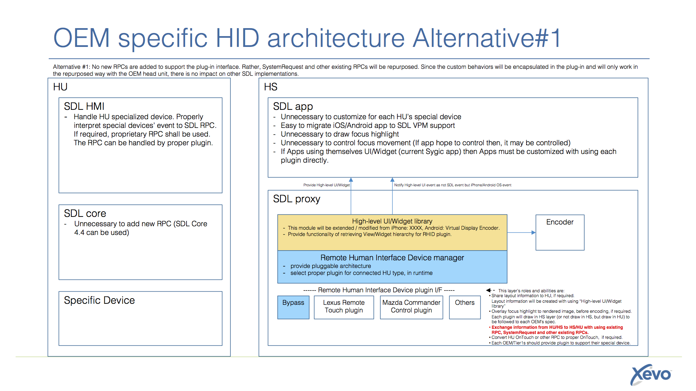

# OEM specific Human Interface Device support as Plug-in architecture in SDL proxy


* Proposal: [SDL-0075](0075-HID-Support-Plug-in.md)
* Author: [Jennifer Hodges](https://github.com/jhodges55)
* Status: **Accepted with Revisions**
* Impacted Platforms: [iOS/Android/Core/RPC ]

## Introduction

Many OEM head units (ex. Lexus Remote Touch, Mazda Commander Control, BMW Gesture Control, Audi MMI) do not support direct touch interaction, but rather support a focus and select model driven by physical controls. This proposal describes a proxy plug-in interface that models the physical controls as HID devices with OEM-specific plug-in implementations. 
Note: From conclusion in Steering Committee, this proposal was changed to alt#1 (specify proper RPC, not plug-in architecture).


## Motivation

OEMs have invested in branded, usability and safety tested user interfaces for their head units, including physical control design, visual and haptic feedback. For proprietary head unit and handset applications, OEMs can implement custom support for their interface. For SDL applications that use the standard UI templates, the SDL HMI can determine which template control has focus and render appropriate visual, audible and haptic feedback. However, for video streaming applications that use the NAV_FULLSCREEN_MAP template, the SDL HMI does not know which focusable elements exist in the projected window. It can only generate and send OnTouchEvent RPCs that the handset application needs to interpret. While OEMs could map their physical control events to touch events, this approach does not allow for consistent focusing and selection feedback.

## Proposed solution

This solution assumes the iOS and Android proxies expose a "High-level UI/Widget library" that traverses the application control hierarchy and renders the hierarchy as a video stream. On iOS, the Ford developed SDLCarWindow class is a prototype for the "High-level UI/Widget library". On Android, VirtualDisplayEncoder class is already [accepted proposal](https://github.com/smartdevicelink/sdl_evolution/blob/master/proposals/0051-enhance_video_streaming_apis_for_android.md) which is base point to extended to include this logic rather than forcing Android app developers to roll their own. View hierarchy can be retrieved as followings:

```
    public static class SdlPresentation extends Presentation{
        protected Window w;
        protected void onCreate(Bundle savedInstanceState) {
            super.onCreate(savedInstanceState);
            w  = getWindow();
            w.getDecorView().post( new Runnable() {
                @Override
                public void run() {
                    retrieveLayout();
                }
            });
        }

        protected void retrieveLayout() {
            retrieveLayoutFromView( w.getDecorView(), 0 );
        }

        private void retrieveLayoutFromView(View v, int nesting ) {
            Log.i( TAG, " LAYOUT: nesting:" + nesting + " view:" + v);

            int[] location = new int[2];
            v.getLocationOnScreen( location );
            Rect rect = new Rect( location[0], location[1], v.getWidth(), v.getHeight() );
            Log.i( TAG, " LAYOUT: rect=" + rect );
            if ( v instanceof ViewGroup) {
                ViewGroup vg = (ViewGroup) v;
                for (int i = 0; i < vg.getChildCount(); i++) {
                    retrieveLayoutFromView( vg.getChildAt( i ), nesting+1 );
                }
            }
        }
```

SDLCarWindow and VirtualDisplayEncoder can be thought of as native application views that app developers can draw "off-screen". This provides a centralized location for app developers to draw their video projection views without interfering with their on-phone UI.
For OEM head units that render their own focus and selection feedback, communication of the focusable element rectangles to the head unit. 
Retrieved user control spatial layout data shall be used for haptic feedback and/or focus management by the head unit.

For general purpose to exchange proprietary information of OEM specified device, following RPC will be added.

### New additions to RPC

Add `SendHapticData` request and response to both the HMI and Mobile API.
This RPC would be the standardized SDL interface for haptic events, and would be interpreted by OEM's on the HMI side.

#### Mobile_API

```xml

<struct name="SpatialStruct">
  <description>Defines spatial for each user control object for video streaming applicaion</description>
  <param name="id" type="Integer" minvalue="0" maxvalue="2000000000" mandatory="true">
    <description>A user control spatial identifier</description>
  </param>
  <param name="x" type="float" mandatory="true">
    <description>The X-coordinate of the user control</description>
  </param>
  <param name="y" type="float" mandatory="true">
    <description>The Y-coordinate of the user control</description>
  </param>
  <param name="width" type="float" mandatory="true">
    <description>The width of the user control's bounding rectangle</description>
  </param>
  <param name="height" type="float" mandatory="true">
    <description>The height of the user control's bounding rectangle</description>
  </param>
</struct>

<function name="SendHapticData" functionID="SendHapticDataID" messagetype="request">
  <description>
    Send the spatial data gathered from SDLCarWindow or VirtualDisplayEncoder to the HMI. 
    This data will be utilized by the HMI to determine how and when haptic events should occur
  </description>
    <param name="HapticSpatialData" type="SpatialStruct" minsize="0" maxsize="100" mandatory="false", array="true">
      <description>
        Array of spatial data structures that represent the locations of all user controls present on the HMI. 
        This data should be updated if/when the application presents a new screen.
        When a request is sent, if successful, it will replace all spatial data previously sent through RPC.
        If an empty array is sent, the existing spatial data will be cleared
      </description>
    </param>
</function>

<function name="SendHapticData" functionID="SendHapticDataID" messagetype="response">
    <param name="success" type="Boolean" platform="documentation">
      <description> true if successful; false if failed </description>
    </param>
    <param name="resultCode" type="Result" platform="documentation">
      <description>See Result</description>
      <element name="SUCCESS"/>
      <element name="GENERIC_ERROR"/>
    </param>
</function>

```

#### HMI_API

```xml

<interface name="Common" version="x.x.x" date="yyyy-mm-dd">

<struct name="SpatialStruct">
  <param name="id" type="Integer" minvalue="0" maxvalue="2000000000" mandatory="true">
    <description>A user control's identifier.
    </description>
  </param>
  <param name="x" type="float" mandatory="true">
    <description>The X-coordinate of the user control</description>
  </param>
  <param name="y" type="float" mandatory="true">
    <description>The Y-coordinate of the user control</description>
  </param>
  <param name="width" type="float" mandatory="true">
    <description>The width of the user control's bounding rectangle</description>
  </param>
  <param name="height" type="float" mandatory="true">
    <description>The height of the user control's bounding rectangle</description>
  </param>
</struct>

</interface>


<interface name="UI" version="x.x.x" date="yyyy-mm-dd">

<function name="SendHapticData" messagetype="request">
  <description>Send the UI spatial data from MOBILE. This data will be utilized by the HMI to determine how and when haptic events should occur</description>
    <param name="appID" type="Integer" mandatory="true">
      <description>Id of application related to this RPC.</description>
    </param>
    <param name="HapticSpatialData" type="Common.SpatialStruct" minsize="0" maxsize="100" mandatory="false", array="true">
      <description>
        Array of spatial data structures that represent the locations of all user controls present on the HMI. 
        This data should be updated if/when the application presents a new screen.
        When a request is sent, if successful, it will replace all spatial data previously sent through RPC.
        Avoidance of doubt, when an empty HapticSpatialData, it will be clear all spatial data previously sent through RPC.
      </description>
    </param>
</function>

<function name="SendHapticData" messagetype="response">
    <param name="success" type="Boolean">
      <description> true if successful; false if failed </description>
    </param>
</function>

</interface>

```


### New additions to Proxies

1. SDLCarWindow will need to be implemented into the iOS proxy
2. VirtualDisplayEncoder will need to be implemented into the Android proxy
3. The above classes will monitor the video projected view's hierarchy and identify any user controls (ie, how accessibility and tvOS work on Apple's side). App's will be able to control which UI controls are captured in the same way they do at present to support accessibility modes.
4. Haptic layout will be retrieved from view hierarchy of SDLCarWindow or VirtualDisplayEncoder.


## Potential downsides


## Impact on existing code

There will be significant code changes required in the iOS and Android proxies, specifically in the "High-level UI/Widget library". There is no application code impact beyond adopting the "High-level UI/Widget library".
New RPC will be added. No change to existing RPCs.


## Alternatives considered

#### Alternative #1: 
Missing number because original proposal's alt#1 was replaced as main proposal.

#### Alternative #2: 
No new RPCs are added to support the plug-in interface. Rather, SystemRequest and other existing RPCs will be repurposed. Since the custom behaviors will be encapsulated in the plug-in and will only work in the repurposed way with the OEM head unit, there is no impact on other SDL implementations. 



#### Alternative #3:
OEMs disclose their specific device specs to ISVs. This forces the ISVs to do custom work for each OEM.
