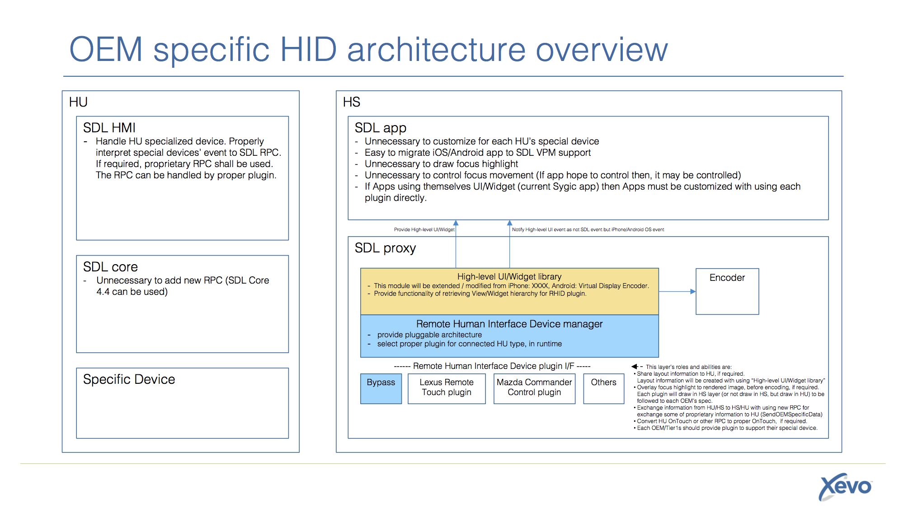
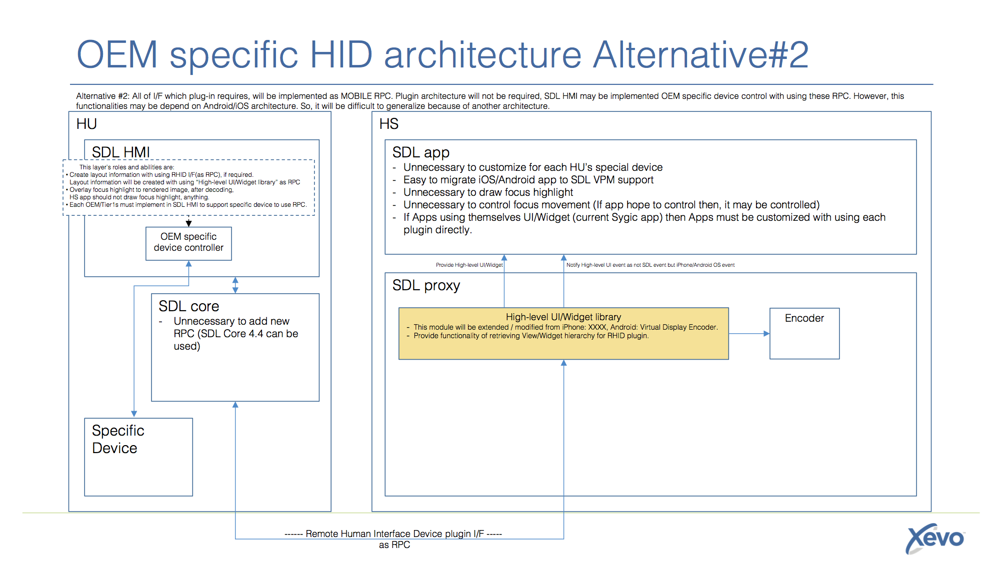

# OEM specific Human Interface Device support as Plug-in architecture in SDL proxy


* Proposal: [SDL-0075](0075-HID-Support-Plug-in.md)
* Author: [Jennifer Hodges](https://github.com/jhodges55)
* Status: **Accepted with Revisions**
* Impacted Platforms: [iOS/Android/Core/RPC ]

## Introduction

Many OEM head units (ex. Lexus Remote Touch, Mazda Commander Control, BMW Gesture Control, Audi MMI) do not support direct touch interaction, but rather support a focus and select model driven by physical controls. This proposal describes a proxy plug-in interface that models the physical controls as HID devices with OEM-specific plug-in implementations. 

Please see attached documents for [overview design](../assets/proposals/0075-HID-support-plug-in/HID_Architecture_Overview.pdf).

## Motivation

OEMs have invested in branded, usability and safety tested user interfaces for their head units, including physical control design, visual and haptic feedback. For proprietary head unit and handset applications, OEMs can implement custom support for their interface. For SDL applications that use the standard UI templates, the SDL HMI can determine which template control has focus and render appropriate visual, audible and haptic feedback. However, for video streaming applications that use the NAV_FULLSCREEN_MAP template, the SDL HMI does not know which focusable elements exist in the projected window. It can only generate and send OnTouchEvent RPCs that the handset application needs to interpret. While OEMs could map their physical control events to touch events, this approach does not allow for consistent focusing and selection feedback.

It's not realistic to add new SDL RPCs to support every OEM user interface because of the complex SDL core version management and ISV effort to support every custom spec. This proposal uses a plug-in architecture to represent the OEM controls as a HID device with corresponding device support module. OEMs can provide their support module quickly using this architecture and ISVs do not need to do OEM-specific integration work, even for video streaming.

## Proposed solution

This solution assumes the iOS and Android proxies expose a "High-level UI/Widget library" that traverses the application control hierarchy and renders the hierarchy as a video stream. On iOS, the Ford developed SDLCarWindow class is a prototype for the "High-level UI/Widget library". On Android, VirtualDisplayEncoder class is also a prototype which is base point to extended to include this logic rather than forcing Android app developers to roll their own.



SDLCarWindow and VirtualDisplayEncoder can be thought of as native application views that app developers can draw "off-screen". This provides a centralized location for app developers to draw their video projection views without interfering with their on-phone UI.

The "High-level UI/Widget library" exposes a remote HID device plug-in interface. The "High-level UI/Widget library" will load the correct plug-in by inspecting the VehicleType properties with using reflection mechanism in Java/Objective-C. The plug-in may provide the following functions, depending on the OEM's requirements:

1. For OEM head units that render their own focus and selection feedback, communication of the focusable element rectangles to the head unit. This information may be used for haptic feedback and/or focus management by the head unit. Or, plug-in self may use the information for superimposing focus control (ex. cursor, highlight) before video encoding. In the case of superimposing, "High-level UI/Widget library" provides fetching functionality which can access before encoding view, to plug-in layer.

2. Conversion of head unit control events to "OnTouchEvent"(RPC) or to native platform events if "OnTouchEvent"(RPC) is not sufficient.


For general purpose to exchange proprietary information of OEM specified device, following RPC will be added.

### New additions to Proxies

1. SDLCarWindow will need to be implemented into the iOS proxy
2. VirtualDisplayEncoder will need to be implemented into the Android proxy
3. The above classes will monitor the video projected view's hierarchy and identify any user controls (ie, how accessibility and tvOS work on Apple's side). App's will be able to control which UI controls are captured in the same way they do at present to support accessibility modes.
4. The OEM plugin will take the captured data and translate it into the OEM specific format. This data will be transmitted to the HMI via the new haptic RPC
5. A default "Bypass" plugin will be implemented for OEM's that do not support haptic input, or are fine with supporting a "free cursor" mode.

### New additions to RPCs (Mobile_API)


Add `SendOEMSpecificData` request and response.


```xml

<function name="SendOEMSpecificData" functionID="SendOEMSpecificDataID" messagetype="request">

  <description>Send OEM specific Haptic information to head unit. This data will be defined and interpreted per the OEM's specs in the OEM plugin</description>

    <param name="ProprietaryHapticData" type="String" minlength="0" maxlength="5000" mandatory="false">

      <description>
        This parameter is proprietary parameter. This parameter's spec shall be defined by each OEMs who adds plug-in to support specific device.
      </description>

    </param>

</function>


<function name="SendOEMSpecificData" functionID="SendOEMSpecificDataID" messagetype="response">
    <param name="success" type="Boolean" platform="documentation">

      <description> true if successful; false if failed </description>

    </param>


    <param name="resultCode" type="Result" platform="documentation">

      <description>See Result</description>

      <element name="SUCCESS"/>

      <element name="GENERIC_ERROR"/>

    </param>


    <param name="info" type="String" minlength="0" maxlength="5000" platform="documentation">

      <description>Provides proprietary information from OEM specific device.</description>

    </param>

</function>

```


## OEM's plugin integration and distribution


Plug-in which is developed by OEM, there are three selectable options.


1. Add the plugin code to the mobile library framework as open source code.
2. Add the plugin compiled binary to the mobile library framework as library.
3. Add the plugin to a separate open repository, and modify SDL's CocoaPods/Carthage/Android Dependency Manager configuration to pull them down automatically.


## Potential downsides

OEMs will need to implement plug-ins for their head unit physical control and interface versions. If they do not, a default bypass plug-in contemplated by this proposal will handle the events. So, if all events can be mapped to an existing RPC (e.g. OnTouchEvent), applications can run without any specific plug-in. OEMs can disclose their plug-in specs and applications can customize to use plug-in features directly. It is possible that some specific device behaviors cannot be mapped to existing RPCs, and so new RPCs may be required.

OEM Plugins will need to be distributed to app developers individually, included in SDL Proxy as open sourced code/compiled binaries, or be distributed via another means (a separate repository that can be included via dependency management)


## Impact on existing code

There will be significant code changes required in the iOS and Android proxies, specifically in the "High-level UI/Widget library". There is no application code impact beyond adopting the "High-level UI/Widget library".


## Alternatives considered

#### Alternative #1: 
Plugin architecture is replaced with a more defined RPC interface. This RPC would be the standardized SDL interface for haptic events, and would be interpreted by OEM's on the HMI side.


```xml

<struct name="SpatialStruct">
  <param name="x" type="float" mandatory="true">
    <description>The X-coordinate of the user control</description>
  </param>
  <param name="y" type="float" mandatory="true">
    <description>The Y-coordinate of the user control</description>
  </param>
  <param name="width" type="float" mandatory="true">
    <description>The width of the user control's bounding rectangle</description>
  </param>
  <param name="height" type="float" mandatory="true">
    <description>The height of the user control's bounding rectangle</description>
  </param>
</struct>

<function name="SendHapticData" functionID="SendHapticDataID" messagetype="request">

  <description>Send the spatial data gathered from SDLCarWindow to the HMI. This data will be utilized by the HMI to determine how and when haptic events should occur</description>

    <param name="HapticSpatialData" type="SpatialStruct" minsize="0" maxsize="50" mandatory="true", array="true">
      <description>
        Array of spatial data structures that represent the locations of all user controls present on the HMI. This data should be updated if/when the application presents a new screen.
      </description>
    </param>
</function>


<function name="SendHapticData" functionID="SendHapticDataID" messagetype="response">

    <param name="success" type="Boolean" platform="documentation">
      <description> true if successful; false if failed </description>
    </param>

    <param name="resultCode" type="Result" platform="documentation">
      <description>See Result</description>
      <element name="SUCCESS"/>
      <element name="GENERIC_ERROR"/>
    </param>
</function>

```
This RPC could be adjusted to work in a similar fashion to UI.Show, where each spatial struct has an id, and the proxy only reports deltas when the screen is updated.

#### Alternative #2: 
No new RPCs are added to support the plug-in interface. Rather, SystemRequest and other existing RPCs will be repurposed. Since the custom behaviors will be encapsulated in the plug-in and will only work in the repurposed way with the OEM head unit, there is no impact on other SDL implementations. 



#### Alternative #3:
OEMs disclose their specific device specs to ISVs. This forces the ISVs to do custom work for each OEM.
