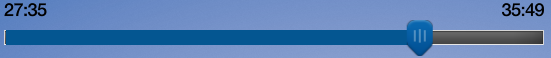

# Progress Bar Seek Feature 
* Proposal: [0084-Progress-Bar-Seek-Feature.md](NNNN-Progress-Bar-Seek-Feature.md)
* Author: [Michael Crimando](https://github.com/MichaelCrimando) & [Derrick Portis](https://github.com/dportis)
* Status: **Accepted**
* Impacted Platforms: [Core / iOS / Android / RPC]

## Introduction

The Seek feature is a proposed new feature that is meant to enhance the usage of the progress bar for media apps with seek capability. Giving the user the ability to use the progress bar to seek will allow users to freely move throughout a song or podcast with ease.

## Motivation

Currently while media plays, there is a bar to indicate progress, but currently the user has no way to control it. So, if the user is listening to a 30+ minute long chapter in an audio book, they don’t have an easy way to navigate around the chapter. A progress bar seek feature gives drivers a way to have more control of media through the HMI. Users could skip half-way through a two hour podcast in a second without being distracted.

## Proposed solution


The progress bar seek feature would allow new functionality such as the ability to rewind and fast-forward by selecting the cursor on the progress bar and dragging it to the desired place in the song/podcast/audio book. HMI would only send notifications to the app when desired. The progress bar would update to show the new track time.


SetMediaClockTimer is a RPC that SDL already has. If the app would like to use the progress bar seek feature, adding an enableSeek parameter and setting it to true would allow the added functionality to the progress bar. Older head units will ignore the enableSeek parameter, leaving the system unaffected. If an app set the enableSeek parameter to true, but there is no progress bar, the system should ignore the enableSeek parameter.


There will be a new notification called OnSeekMediaClockTimer, which gives the app an updated startTime. For example, a notification would be sent to the app when the user selects the cursor on the head unit’s progress bar, drags it somewhere else in the track, and releases it. The notification contains the new track time position in hours, minutes and seconds.

### Current Implementation:

Example: Progress Bar without Seek feature


```
  <function name="SetMediaClockTimer" functionID="SetMediaClockTimerID" messagetype="request">
    <description>Sets the initial media clock value and automatic update method.</description>

    <param name="startTime" type="StartTime" mandatory="false">
      <description>
        See StartTime.
        startTime must be provided for "COUNTUP" and "COUNTDOWN".
        startTime will be ignored for "RESUME", and "CLEAR"
        startTime can be sent for "PAUSE", in which case it will update the paused startTime
      </description>
    </param>


```


### Proposed Implementation:

Example: Progress Bar with Seek feature



There is a new parameter for SetMediaClockTimer in the Mobile and HMI APIs that allows the Seek feature to exist.   

```
    <param name="enableSeek" type="Boolean" mandatory="false">
     <description>
       Defines if seek media clock timer functionality will be available. If omitted, the value is set to false. The value is retained until the next SetMediaClockTimer is sent.
     </description>
    </param>
  </function>
```
There is a new notification named OnSeekMediaClockTimer in the Mobile API that will send the new start time to the app. 
```
  <function name="OnSeekMediaClockTimer" functionID="OnSeekMediaClockTimerID" messagetype="notification">
     <description> Callback for the seek media clock timer notification. Notifies the application of progress bar seek event on the mediaclock timer. System will automatically update the media clock timer position based on the seek notification location. </description> 
     <param name="seekTime" type="StartTime" mandatory="true">
      <description>See StartTime.</description>
     </param>
  </function>
```

There is a new notification named OnSeekMediaClockTimer in the HMI API that will send the new start time to the app.  
```
<function name="OnSeekMediaClockTimer" messagetype="notification">
        <param name="seekTime" type="Common.TimeFormat" mandatory="true"/>
            <description>See TimeFormat.</description>
        </param>
        <param name="appID" type="Integer" mandatory="true">
            <description>
		The ID of application that relates to this media clock status change.
            </description>
        </param>
    </function>
```

 
 
## Potential downsides

* Not having the space or capability to have different scrub speeds. \(Scrubbing is the motion of dragging the button across the progress bar\)

* If an app has ads that they don’t want the user to skip through, they would have to turn the seek progress bar feature off.

## Impact on existing code

* Mobile API's, HMI API's and SDL Core all need to be updated to accommodate the new parameters proposed.


## Alternatives considered

* Apps on the phone such as Audible often have configurable seek times. So if the user taps Seek Left or Seek Right, Audible will seek the configured amount of time. (E.g. 30 seconds or 5 minutes.) This doesn’t always necessarily do a good enough job, depending on the length of the track.  


