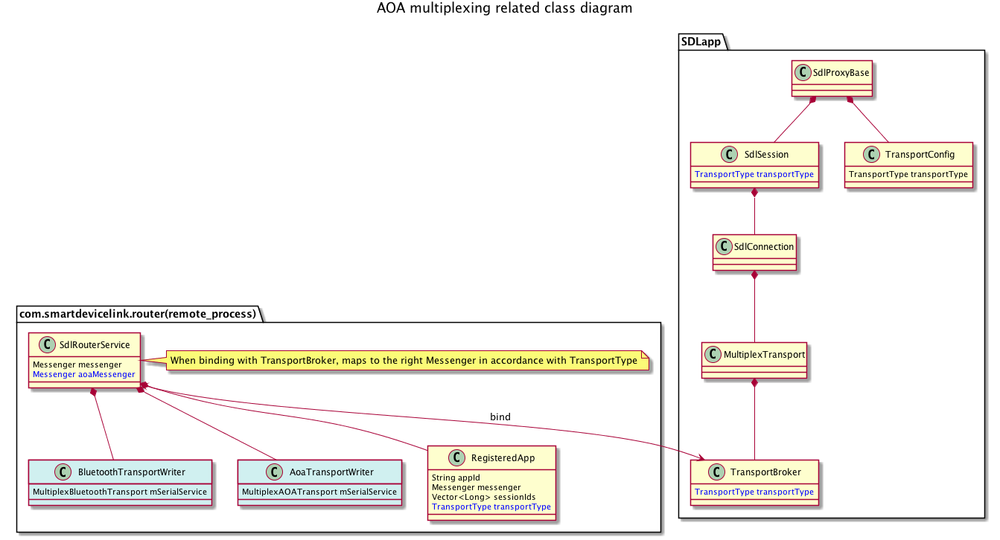

# AOA multiplexing similar to Android BT/SPP multiplexing

* Proposal: [SDL-0095](0095-AOA-multiplexing.md)
* Author: [Jennifer Hodges](https://github.com/jhodges55), [Shinichi Watanabe](https://github.com/shiniwat)
* Status: **Returned for Revisions**
* Impacted Platforms: [ Android ]


## Introduction

This proposal aims to add AOA multiplexing capability to SdlRouterService.  

## Motivation

Currently SdlRouterService works for MultiplexTransport, which supports Bluetooth transport as the underlying transport. This proposal extends SdlRouterService to support both Bluetooth and AOA (Android Open Accessory) transports, so that multiple SDL applications can share the AOA transport without having to worry about USB connection.
AOA protocol basically allows only single application to access the USB accessory -- if multiple applications are designed to use the same accessory, Android system asks which application to use the accessory and shows a permission dialog. This proposal allows multiple SDL applications to share the USB accessory. 
 
## Proposed solution

Currently, SDL app chooses the transport (either Bluetooth multiplexing, legacy Bluetooth, USB, or TCP), by specifying BaseTransportConfig when it launches SdlProxyALM instance.
 This proposal adds yet another transport (= AOA multiplexing), and SDL app can specify which transport to use explicitly. 
 Current SdlRouterService works for Bluetooth multiplexing, and this proposal basically extends the SdlRouterService to support both Bluetooth multiplexing and AOA multiplexing.
 To do that, the basic idea is:
- MultiplexTrannsportConfig is extended to be aware of TransportType. A new TransportType "MULTIPLEX_AOA" is supported in addition to "MULTIPLEX".
- SDL application specifies TransportType when configuring MultiplexTransportConfig.
- SdlRouterService internally holds separate Handlers according to the TransportType, and returns the right Handler when binding to the service, so that IPC channel is isolated per TransportType.
- SdlRouterService recognizes the expected TransportType when registering the app to router. SdlRouterService internally recognizes the expected TransportType per appId.
- SdlRouterService uses (newly added) BluetoothTransportWriter or AoaTransportWriter depending on TransportType
- The affected component is Android proxy only. No change is required for SDL Core.
 
The affected classes in Android Proxy are shown below:



**Fig. 1: affected classes in Android Proxy**


## Detailed design
### Extends MultiplexTransportConfig
Extends MultiplexTransportConfig by adding TransportType. Current MultiplexTransportConfig assumes the underlying transport is Bluetooth only, but this proposal introduces TransportType in the class.

```java
public class MultiplexTransportConfig extends BaseTransportConfig{
	TransportType transportType;

	public TransportType getTransportType() {
		return transportType;
	}

	public void setTransportType(TransportType transportType) {
		this.transportType = transportType;
	}
}
```

### SDL app specifies TransportType when using MultiplexTransportConfig.
Specifies TransportType explicitly in MultiplexTransportConfig if the app uses AOA multiplexing. This would be simpler than adding another TransportConfig class from SDL application's perspective.
```java
    transport = new MultiplexTransportConfig(getApplicationContext(), getAppId());
    ((MultiplexTransportConfig) transport).setTransportType(TransportType.MULTIPLEX_AOA);
    proxy = new SdlProxyALM(this,
                    ....
                    transport);
```

### SdlRouterService holds newly added Handler for AOA clients
Extends SdlRouterService by adding AoaRouterHandler:
```java

	final Messenger aoaMessenger = new Messenger(new AoaRouterHandler(this));

	/**
	 * Handler of incoming messages from AOA clients.
	 */
	static class AoaRouterHandler extends Handler {
	    ...
	}
	
	@Override
	public IBinder onBind(Intent intent) {
	    ...
			}else if(TransportConstants.BIND_REQUEST_TYPE_AOA_CLIENT.equals(requestType)) {
				return this.aoaMessenger.getBinder();
			}
	    ...
	}
```
and extends TransportBroker to specify (newly added) action (== BIND_REQUEST_TYPE_AOA_CLIENT) for the binding Intent:
```java
	private boolean sendBindingIntent(){
        ...
		if (mTransportType.equals(TransportType.MULTIPLEX_AOA)) {
			bindingIntent.setAction(TransportConstants.BIND_REQUEST_TYPE_AOA_CLIENT);
		} else {
            ...
		}
        ...
	}
```

### SdlRouterService recognizes expected TransportType
Extends SdlRouterService so that internal class (RegisteredApp) is aware of TransportType:
```java
	class RegisteredApp {
		/**
		 * This is a simple class to hold onto a reference of a registered app.
		 * @param appId
		 * @param messenger
		 * @param theType
		 */
		public RegisteredApp(String appId, Messenger messenger, TransportType theType){
		    ...
			transportType = theType;
		}
	}
	
	@Override
	public void handleMessage(Message msg) {
	    ....    
        switch (msg.what) {
	        case TransportConstants.ROUTER_REGISTER_CLIENT:
	            RegisteredApp app = service.new RegisteredApp(appId,msg.replyTo, TransportType.MULTIPLEX); // This is the case for Bluetooth. AOA's message handler specifies TransportType.MULTIPLEX_AOA
	    }
	}
```

### SdlRouterService uses (newly added) ITransportWriter to write into actual transport
Introduces BluetoothTransportWriter and AoaTransportWriter class that utilize actual transports to send data to SDL Core:
```java
public interface ITransportWriter {
	boolean writeBytesToTransport(Bundle bundle);
	boolean manuallyWriteBytes(byte[] bytes, int offset, int count);
}

// BluetoothTransportWriter internally utilizes MultiplexBluetoothTransport
public class BluetoothTransportWriter implements ITransportWriter {
    private MultiplexBluetoothTransport mSerialService = null;
    ...
    public boolean writeBytesToTransport(Bundle bundle){
        ...
    }
    
    public boolean manuallyWriteBytes(byte[] bytes, int offset, int count){
        ...
    }
}

// AoaTransportWriter internally utilizes (new) MultiplexAOATransport
public class AoaTransportWriter implements ITransportWriter {
    private MultiplexAOATransport mSerialService = null;

    public boolean writeBytesToTransport(Bundle bundle){
        ...
    }
    
    public boolean manuallyWriteBytes(byte[] bytes, int offset, int count){
        ...
    }
}
```

SdlRouterService selects either BluetoothTransportWriter or AoaTransportWriter according to the TransportType of the RegisteredApp instance:
```java
public class SdlRouterService extends Service {
    ...
    // TransportWriters -- for now BT and USB.
	private BluetoothTransportWriter bluetoothTransportWriter;
	private AoaTransportWriter aoaTransportWriter;
    ...
    // utilizes the TransportWriter in accordance with the TransportType for each registered app.
}
```

## Potential downsides

This feature introduces TransportType for TransportBroker and SdlRouterService. While this approach should have no obvious downsides, backward compatibility should be taken into account as much as we can.
In particular, the following cases need to be confirmed:
- Case #1: Older proxy's TransportBroker binds to new SdlRouterService. In this case, SdlRouterService assumes TransportType == MULTIPLEX for backward compatibility.
- Case #2: Newer proxy's TransportBroker binds to older SdlRouterService. The older SdlRouterService won't support AOA multiplexing. In this case, the expected behavior is "don't bind to older SdlRouterService; instead, start and bind to newer (local) SdlRouterService". We can utilize existing version check and trusted router logic to make this case to work.

This feature also increases the IPC transaction between TransportBroker and SdlRouterService. While Android system has Binder Transaction Limit, which is explained at [TransactionTooLargeException Android document](https://developer.android.com/reference/android/os/TransactionTooLargeException.html), we won’t run into TransactionTooLargeException cases in real scenario based on our test, unless underlying transport has a fatal error. The fatal error case would be, for example, the case where we cannot write Bluetooth socket and/or USB's ParcelFileDescriptor for some reason. Those fatal error cases can be discussed in outside of this proposal.

## Impact on existing code

All the change will be made to Android Proxy, and there's no change required to SDL Core and/or other components.
The proposed solution keeps existing logic of SdlRouterService intact, and hence there should be no obvious side effect for existing Bluetooth multiplexing.
Because AOA multiplexing application explicitly specifies the transport, existing applications that use other transports should have no impact, as AOA multiplexing transport is not enabled. 

## Alternatives considered

Alternative solution would be to utilize (existing) AltTransport. AltTransport is essentially just another Message Handler provided externally by binding to SdlRouterService. 
If apps are using Bluetooth multiplexing, it appears that existing Bluetooth sessions need to be disconnected first before setting up AltTransport. This proposal takes different approach, so that existing SDL apps don't have to disconnect when another app starts utilizing AOA multiplexing transport.
Logically speaking, however, it is possible to implement the same transport-aware logic by using AltTransport. From router client's perspective, AltTransport consumes additional IPC channel for communicating with SDL Core. So it may have performance overhead when compared with this proposed approach. 
