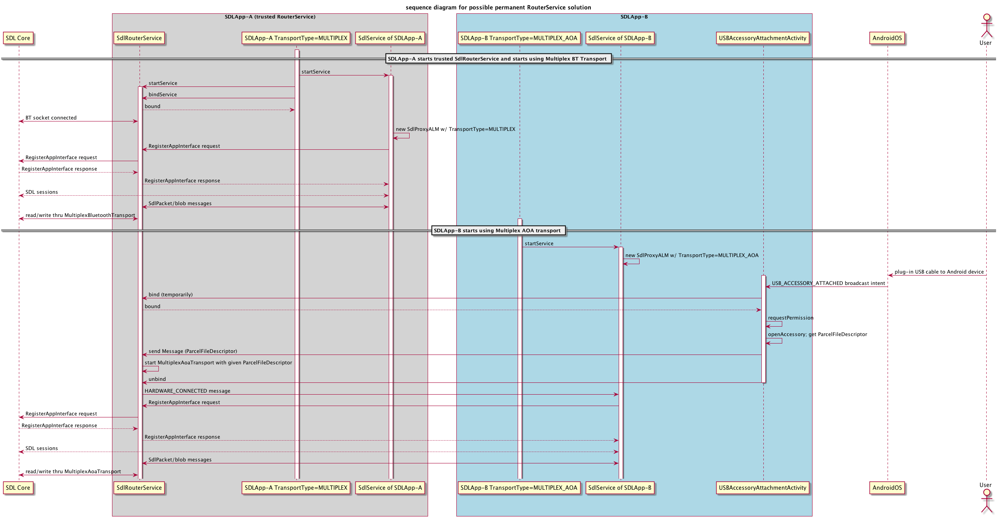

# AOA multiplexing for Android Proxy

* Proposal: [SDL-0095](0095-AOA-multiplexing.md)
* Author: [Jennifer Hodges](https://github.com/jhodges55), [Shinichi Watanabe](https://github.com/shiniwat)
* Status: **Returned for Revisions**
* Impacted Platforms: [ Android ]


## Introduction

This proposal aims to add AOA multiplexing capability to SdlRouterService.  

## Motivation

Currently SdlRouterService works for MultiplexTransport, which supports Bluetooth transport as the underlying transport. This proposal extends SdlRouterService to support both Bluetooth and AOA (Android Open Accessory) transports, so that multiple SDL applications can share the AOA transport without having to worry about USB connection.
AOA protocol basically allows only a single application to access the USB accessory -- if multiple applications are designed to use the same accessory, the Android system asks which application should use the accessory and shows a permission dialog. This proposal allows multiple SDL applications to share the USB accessory.
In addition, this proposal addresses extension of SdlRouterService to support simultaneous multiple transports, and AOA multiplexing will work as a part of simultaneous multiple transports. This proposal mainly assumes the scenario where utilizing Bluetooth multiplexing for RPC service, and utilizing AOA multiplexing transport for audio/video services.
As you see the , the secondary transport will be specified by SDLCore, however.
 
## Proposed solution

Currently, SDL app chooses the transport (either Bluetooth multiplexing, legacy Bluetooth, USB, or TCP), by specifying BaseTransportConfig when it launches SdlProxyALM instance.
 By utilizing simultaneous multiple transports capability, SdlSession will support secondary transport for audio/video service, but currently we assume TCP transport and (legacy) USB transport for the secondary transport.
 This proposal extends it to use MultiplexTransport as the secondary transport.

 To do that, the basic idea is:
- MultiplexTransportConfig is extended to have "highBandwidthRequired" flag.
- To recognize AOA multiplexing transport for the secondary transport, SdlRouterService internally manages if the underlying MultiplexTransport is either Bluetooth or AOA.
- The underlying type of MultiplexTransport is used only for internal purpose. It won't be recognized by SDL apps directly.
- When MultiplexTransport is instantiated by secondary connection, MultiplexTransport instantiates TransportBroker with newly added flag (multiplexForSecondary), and different action is specified when binding to SdlRouterService.
- SdlRouterService is extended and internally holds both MultiplexBluetoothTransport and MultiplexAoaTransport.
- When SdlRouterService is bound for secondary connection, SdlRouterService will map the session (connection) to MultiplexAoaTransport.
- Unlike TCP transport, protocol listener's onEnableSecondaryTransport event won't be used for AOA multiplexing. Android Proxy manages physical USB connection directly, and managing the availability of AOA transport.
- SdlRouterService internally manages transport per connection. SdlRouterService reads from/writes to the right transport depending on Message/SdlPacket.
- When user disconnected USB cable, SdlRouterService handles the disconnection of underlying MultiplexAoaTransport, and TransportBroker for secondary transport will be unbound. SDL application should be responsible for how to handle this case.
- From SDLCore's perspective, the AOA multiplexing is handled as USB_AOA transport type. SDLCore must allow USB_AOA transport to be used for secondary transport.　
- On the Android device, in order to share the UsbAccessory with multiple applications, the app that actually has the USB accessory's permission will send ParcelFileDescriptor to the active router service. If no active router is running, the local app launches router service for AOA transport.
- Make sure the AOA multiplexing can be used with older SDLCore, which does not support simultaneous multiple transports. When running with older SDLCore and the app specified "highBandwidthRequired" flag, MultiplexTransport will use AOA transport for all service types. This means the app cannot be registered until AOA transport is available.
 
The affected classes in Android Proxy are shown below:


**Fig. 1: affected classes in Android Proxy**


## Detailed design
### Extends MultiplexTransportConfig
Extends MultiplexTransportConfig by adding highBandwidthRequired flag.

```java
public class MultiplexTransportConfig extends BaseTransportConfig{
	boolean highBandwidthRequired;

	public boolean isHighBandwidthRequired() {
		return highBandwidthRequired;
	}

	public void setHighBandwidthRequired(boolean requiredOrNot) {
		highBandwidthRequired = requiredOrNot;
	}
}
```

### SDL app specifies highBandwidthRequired if the app uses VIDEO or PCM serviceType.
Call MultiplexTransportConfig.setHighbandwithRequired(true) if the app uses VIDEO or PCM serviceType. This tells MultiplexTransport that AOA multiplexing will be used when available.
```java
    transport = new MultiplexTransportConfig(getApplicationContext(), getAppId());
    ((MultiplexTransportConfig) transport).setHighBandwidthRequired(true);
    proxy = new SdlProxyALM(this,
                    ....
                    transport);
```

### MultiplexTransport and TransportBroker have multiplexForSecondary flag, which is internal use only
If TransportBroker has multiplexForSecondary flag specified, it specifies different action when binding to SdlRouterService. This is used internally, and SDL apps do not have to pay attention to this flag.
```java
public class MultiplexTransport extends SdlTransport{
    public MultiplexTransport(MultiplexTransportConfig transportConfig, final ITransportListener transportListener, boolean multiplexForSecondary){
        ...
    }
}

public class TransportBroker {
    public TransportBroker(Context context, String appId, ComponentName service, boolean multiplexForSecondary){
        ...
    }
    ...
    private boolean sendBindingIntent(){
        ...
        if (multiplexForSecondary) {
            bindingIntent.setAction(TransportConstants.BIND_REQUEST_TYPE_AOA_CLIENT); 
        } else {
            bindingIntent.setAction(TransportConstants.BIND_REQUEST_TYPE_CLIENT); 
        }
    }
}

```


### SdlRouterService uses either MultiplexBluetoothTransport or MultiplexAoaTransport depending on binding action
```java
public class SdlRouterService extends Service {
    ...
    // underlying transport depending on the type of Multiplexing.
	private MultiplexBluetoothTransport bluetoothTransport;
	private MultiplexAoaTransport aoaTransport;
    ...
}
```

### AOA multiplexing won't use onEnableSecondaryTransport event
Unlike TCP Transport, AOA multiplexing won't use onEnableSecondaryTransportEvent (which is sent by SDLCore); instead, SdlRouterService internally manages physical connection of AOA transport.
This makes sense, because SdlProxy manages the permission of UsbAccessory, and SDLCore cannot recognize the USB connection until user explicitly grants the access permission of UsbAccessory.

### SdlRouterService manages the disconnection of AOA transport
When AOA transport has been disconnected, every RegisteredApp will be notified by Messege, and then TransportBroker of secondary transport will be unbound. SDL application should be responsible for how to handle this case.

### AOA multiplexing will be handled by SdlProxy, and has no impact on SDLCore
AOA multiplexing will be solely handled by SdlProxy. From SDLCore's perspective, AOA multiplexing will be handled as USB_AOA transport type, and existing AOA transport adapter works on SDLCore.

### The app that has actual UsbAccessory's permission sends ParcelFileDescriptor to active SdlRouterService
We discussed about a potential issue where multiple SDL applications have the same accessory_filter settings.

When a user plugs in their device to an AOA connection, they are prompted with selection dialog. The dialog contains all apps that support the currently connected accessory. In this dialog there is also an option to always open a specific app for that accessory. We basically assumed the app that receives AOA intent gets the accessory permission, and then the app works as the router for AOA transport. if the user picks an app to always receive the AOA intent and it propagates the router service, all multiplexed connections will go through that apps router service regardless if there is a newer router service present. If by chance that is not a trusted router service, no other apps will ever connect until the user clears the flag.

The underlying issue is that the app user chooses to give the accessory permission is not necessarily the trusted router service.
To solve the issue, we take the approach where sending the USB device's descriptor (ParcelFileDescriptor) from user granted app to active router service.
The following sequence diagram shows how it works:



**Fig. 2: Sequence diagram for possible permanent RouterService solution**

### AOA multiplexing should work with older SDLCore that has no support of simultaneous multiple transports
If "highBandwidthRequired" SDL app runs with older SDLCore that has no support of simultaneous multiple transports, the app should have single SdlConnection for all service type, and its transport would be AOA multiplexing.
This means the app won't be registered until AOA transport is available.

## Potential downsides

This feature introduces "highBandwidthRequired" flag in MultiplexTransportConfig, and multiplexForSecondary flag in TransportBroker. While this approach should have no obvious downsides, backward compatibility should be taken into account as much as we can.
In particular, the following cases need to be confirmed:
- Case #1: Older proxy's TransportBroker binds to new SdlRouterService. In this case, SdlRouterService assumes highBandwidthRequired flag is always false for backward compatibility.
- Case #2: Newer proxy's TransportBroker binds to older SdlRouterService. The older SdlRouterService won't support AOA multiplexing. In this case, the expected behavior is "don't bind to older SdlRouterService; instead, start and bind to newer (local) SdlRouterService". We can utilize existing version check and trusted router logic to make this case work.

This feature also increases the IPC transaction between TransportBroker and SdlRouterService. While Android system has Binder Transaction Limit, which is explained at [TransactionTooLargeException Android document](https://developer.android.com/reference/android/os/TransactionTooLargeException.html), we won’t run into TransactionTooLargeException cases in real scenario based on our test, unless underlying transport has a fatal error. The fatal error case would be, for example, the case where we cannot write Bluetooth socket and/or USB's ParcelFileDescriptor for some reason. Those fatal error cases can be discussed outside of this proposal.

## Impact on existing code

All changes will be made to Android Proxy, and there's no change required to SDL Core and/or other components.
Because AOA multiplexing application explicitly specifies the highBandwidthRequired flag, existing applications that do not specify that flag should have no impact, as AOA multiplexing transport is not enabled.

## Alternatives considered

Alternative solution would be to utilize (existing) AltTransport. AltTransport is essentially just another Message Handler provided externally by binding to SdlRouterService.
AltTransport currently has no support for simultaneous multiple transports, so even if we use AltTransport approach, we have to implement the support of simultaneous multiple transports anyway.
