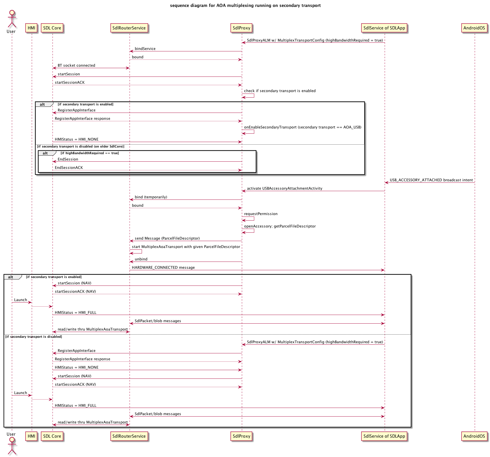

# AOA multiplexing for Android Proxy

* Proposal: [SDL-0095](0095-AOA-multiplexing.md)
* Author: [Jennifer Hodges](https://github.com/jhodges55), [Shinichi Watanabe](https://github.com/shiniwat)
* Status: **Rejected**
* Impacted Platforms: [ Android ]


## Introduction

This proposal aims to add AOA multiplexing capability to SdlRouterService.  

## Motivation

Currently SdlRouterService works for MultiplexTransport, which supports Bluetooth transport as the underlying transport. This proposal extends SdlRouterService to support both Bluetooth and AOA (Android Open Accessory) transports, so that multiple SDL applications can share the AOA transport without having to worry about USB connection.
AOA protocol basically allows only a single application to access the USB accessory -- if multiple applications are designed to use the same accessory, the Android system asks which application should use the accessory and shows a permission dialog. This proposal allows multiple SDL applications to share the USB accessory.
In addition, this proposal addresses extension of SdlRouterService to support simultaneous multiple transports, and AOA multiplexing will work as a part of simultaneous multiple transports. This proposal mainly assumes the scenario where utilizing Bluetooth multiplexing transport for RPC service, and utilizing AOA multiplexing transport for audio/video services.
As you see in the , the secondary transport will be specified by SDLCore, however.
 
## Proposed solution

Currently, SDL app chooses the transport (either Bluetooth multiplexing, legacy Bluetooth, USB, or TCP), by specifying BaseTransportConfig when it launches SdlProxyALM instance.
 By utilizing simultaneous multiple transports capability, SdlSession will support secondary transport for audio/video service, but currently we assume TCP transport and (legacy) USB transport for the secondary transport.
 This proposal extends it to use MultiplexTransport as the secondary transport.

 To do that, the basic idea is:
- MultiplexTransportConfig is extended to have "highBandwidthRequired" flag, which should be turned on for audio/video apps.
- If SDL Core supports secondary transport, proxy will be notified with onEnableSecondaryTransport. If the secondary transport is AOA_USB, the proxy takes it as AOA multiplexing.
- If AOA_USB is the expected secondary transport, SdlProxy puts off starting audio/video session until AOA transport becomes available.
- Make sure the AOA multiplexing can be used with older SDLCore, which does not support simultaneous multiple transports. When running with older SDLCore and the app specified "highBandwidthRequired" flag, MultiplexTransport will use AOA transport for all service types. This means the app cannot be registered until AOA transport is available.
- AOA multiplexing will be solely handled by Android Proxy. From SDLCore's perspective, AOA multiplexing will be handled as AOA_USB transport type, and the existing AOA transport adapter on SDLCore should work for AOA multipelxing.
 
The sequence diagram running on secondary transport is shown below:



**Fig. 1: sequence diagram for AOA multiplexing running on secondary transport**


The affected classes in Android Proxy are shown below:


**Fig. 2: affected classes in Android Proxy**


## Detailed design
### Extends MultiplexTransportConfig
Extends MultiplexTransportConfig by adding highBandwidthRequired flag.

```java
public class MultiplexTransportConfig extends BaseTransportConfig{
	boolean highBandwidthRequired;

	public boolean isHighBandwidthRequired() {
		return highBandwidthRequired;
	}

	public void setHighBandwidthRequired(boolean requiredOrNot) {
		highBandwidthRequired = requiredOrNot;
	}
}
```

### SDL app specifies highBandwidthRequired if the app uses VIDEO or PCM serviceType.
Call MultiplexTransportConfig.setHighbandwithRequired(true) if the app uses VIDEO or PCM serviceType. This tells SdlProxyALM that AOA multiplexing will be used when available.
```java
    transport = new MultiplexTransportConfig(getApplicationContext(), getAppId());
    ((MultiplexTransportConfig) transport).setHighBandwidthRequired(true);
    proxy = new SdlProxyALM(this,
                    ....
                    transport);
```

### When handling StartSessionACK control frame, checks to see if secondary transport is supported.
The case where secondary transport is NOT supported will be mentioned later in this proposal.
```java
private void handleControlFrame(SdlPacket packet) {
    if (frameInfo == FrameDataControlFrameType.StartSessionACK.getValue()) {
        // checks to see if protocolVersion supports secondary transport
    }
}
```

### When onEnableSecondaryTransport gets called, we read AOA_USB as AOA multiplexing.
This proposal assumes the app should use AOA multiplexing rather than legacy AOA for all cases. Legacy AOA exclusively accesses the USB accessory and disallows other apps to use AOA transport, so AOA multiplexing should be better.
```java
public void onEnableSecondaryTransport(byte sessionID, ArrayList<String> secondaryTransport,
	        ArrayList<Integer> audio, ArrayList<Integer> video, TransportType transportType) {
                // check to see if secondaryTransport contains "AOA_USB", and then handle it as AOA multiplexing
	        }

```

### SdlRouterService uses either MultiplexBluetoothTransport or MultiplexAoaTransport depending on binding action
MultiplexAoaTransport encapsulates the actual read/write operation of AOA transport.
```java
public class SdlRouterService extends Service {
    ...
    // underlying transport depending on the type of Multiplexing.
	private MultiplexBluetoothTransport bluetoothTransport;
	private MultiplexAoaTransport aoaTransport;
    ...

	@Override
	public IBinder onBind(Intent intent) {
        String requestType = intent.getAction();
        if(TransportConstants.BIND_REQUEST_TYPE_CLIENT.equals(requestType)) {
            // corresponding Binder will use bluetoothTransport
        } else if (TransportConstants.BIND_REQUEST_TYPE_AOA_CLIENT.equals(requestType)) {
            // corrsponding Binder will use aoaTransport
        }
    }
}
```

### The app that has actual UsbAccessory's permission sends ParcelFileDescriptor to active SdlRouterService
When a user plugs in their device to an AOA connection, they are prompted with selection dialog. The dialog contains all apps that support the currently connected accessory. In this dialog there is also an option to always open a specific app for that accessory.
We basically assume the app that receives AOA intent gets the accessory permission, and then the app works as the router for AOA transport. if the user picks an app to always receive the AOA intent and it propagates the router service, all multiplexed connections will go through that app's router service regardless of if there is a newer router service present. If by chance that is not a trusted router service, no other apps will ever connect until the user clears the flag.

To solve the issue, we take the approach where sending the USB device's descriptor (ParcelFileDescriptor) from user granted app to active router service. The sequence diagram in **Fig. 1: sequence diagram for AOA multiplexing running on secondary transport** shows how it works.

### SdlRouterService manages the disconnection of AOA transport
When AOA transport has been disconnected, every RegisteredApp will be notified by Messege, and then TransportBroker of secondary transport will be unbound. SDL application should be responsible for how to handle this case.
```java
	// In SdlRouterService

	/**
	 * MultiplexType is internal-use-only enum to distinguish if the multiplex type is BT or AOA.
	 **/
	public void onTransportDisconnected(MultiplexType type){
		...
		if (type == MultiplexType.AOA) {
		    bundle.putString(TransportConstants.HARDWARE_DISCONNECTED_AOA, type.name());
		} else {
		    bundle.putString(TransportConstants.HARDWARE_DISCONNECTED, type.name());
		}
		message.setData(bundle);
		notifyClients(message);
	}
```

### AOA multiplexing should work with older SDLCore that has no support of simultaneous multiple transports
If "highBandwidthRequired" SDL app runs with older SDLCore that has no support of simultaneous multiple transports, the app should have single SdlConnection for all service types, and its transport would be AOA multiplexing.
This means the app won't be registered until AOA transport is available.
Please refer to **Fig. 1: sequence diagram for AOA multiplexing running on secondary transport** to see how AOA multiplexing will work with older SDL Core.

## Potential downsides

This feature introduces "highBandwidthRequired" flag in MultiplexTransportConfig, and internal enum MultiplexType in TransportBroker. While this approach should have no obvious downsides, backward compatibility should be taken into account as much as we can.
In particular, the following cases need to be confirmed:
- Case #1: Older proxy's TransportBroker binds to new SdlRouterService. In this case, SdlRouterService assumes highBandwidthRequired flag is always false for backward compatibility.
- Case #2: Newer proxy's TransportBroker binds to older SdlRouterService. The older SdlRouterService won't support AOA multiplexing. In this case, the expected behavior is "don't bind to older SdlRouterService; instead, start and bind to newer (local) SdlRouterService". We can utilize existing version check and trusted router logic to make this case work.

This feature also increases the IPC transaction between TransportBroker and SdlRouterService. While Android system has Binder Transaction Limit, which is explained at [TransactionTooLargeException Android document](https://developer.android.com/reference/android/os/TransactionTooLargeException.html), we won’t run into TransactionTooLargeException cases in real scenario based on our test, unless underlying transport has a fatal error. The fatal error case would be, for example, the case where we cannot write Bluetooth socket and/or USB's ParcelFileDescriptor for some reason. Those fatal error cases can be discussed outside of this proposal.

Also note that this proposal assumes MultiplexBluetoothTransport is available prior to when MultiplexAoaTransport becomes available. Otherwise we cannot check if the SDL Core supports simultaneous multiple transports. What if the head unit is configured without Bluetooth? What if user did not setup Bluetooth pairing beforehand? Such case may need to be discussed, but for now it is out of scope in this proposal.

## Impact on existing code

All changes will be made to Android Proxy, and there's no change required to SDL Core and/or other components.
Because AOA multiplexing application explicitly specifies the highBandwidthRequired flag, existing applications that do not specify that flag should have no impact, as AOA multiplexing transport is not enabled.

## Alternatives considered

Alternative solution would be to utilize (existing) AltTransport. AltTransport is essentially just another Message Handler provided externally by binding to SdlRouterService.
AltTransport currently has no support for simultaneous multiple transports, so even if we use AltTransport approach, we have to implement the support of simultaneous multiple transports anyway.
