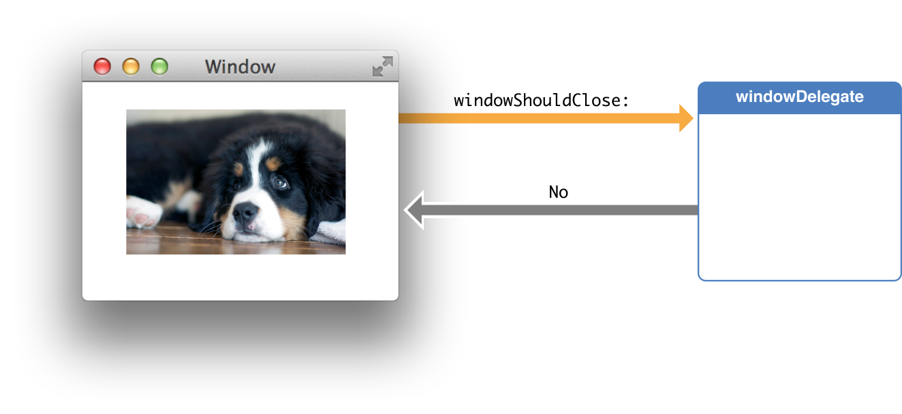

## Enhanced iOS Proxy Interface

* Proposal: [SDL-0133](0133-EnhancediOSProxyInterface.md)
* Author: [Brandon Salahat](https://www.github.com/Toyota-BSalahat)
* Status: **In Review**
* Impacted Platforms: [iOS]

## Introduction
Currently when app developers implement SDL they are responsible for understanding and handling a lot of SDL-centric logic. This creates a heavy burden for app implementers, leads to large bug/issue counts in production integrations, and results in a high cost of development/maintenance to support SDL. This proposal aims to enhance the proxy defined interface to SDL to reduce the burden on app developers, centralize SDL-specific logic within the proxy where it can be maintained by developers who understand SDL-specific implementation details, and reduce the time and cost required to integrate with SDL successfully.

## Motivation

Currently app integrations must handle a lot of tedious logic to manage show requests, manage SDL application state, and in general manage their application flow within SDL.
This leads to a large burden on 3rd party app developers, and requires a lot of custom code to be written specifically for SDL. The current interface for SDL is also dissimilar from the design concepts encouraged by iOS, and that iOS developers are familiar with.

Native iOS development is heavily tied to the concept of Model View Controller (MVC), and organizing your app flow via View Controllers and the view stack.


[Apple Documentation](https://developer.apple.com/library/content/documentation/General/Conceptual/DevPedia-CocoaCore/MVC.html)

These view controllers often conform to delegation interfaces which allow an eloquent way of populating their view components with content.


[Apple Documentation](https://developer.apple.com/library/content/documentation/General/Conceptual/DevPedia-CocoaCore/Delegation.html)


However, the current SDL proxy interface is designed at a lower level than this. It does not currently mesh well with these higher level design patterns. This often results in app integrations having to write completely custom SDL modules of code within their code base.


## Proposed solution

The proposed solution can be broken down into two goals. The first goal builds on and implements the second in a nice, easy to use package for app developers

1. Provide an interface for template SDL applications that conform to native iOS design patterns, and are easy/familiar for app developers to work with, without them needing to really understand the fine details of SDL's display logic

This can be achieved by exposing templates and allowing developers to customize them via View Controller interfaces. These view controllers would look and feel to app developers like native view controllers. ie instead of setting up and dispatching a setDisplayLayout and Show request to display a LargeGraphicOnly template, a developer would initialize a SDLLargeGraphicOnlyViewController, and present it as they would any other view controller.

2. Populate Show and Media content via the delegation pattern. This will allow View Controllers to conform to the SDLTemplateDataSource delegate, and report the necessary information to generate a SDL template screen. This will also allow app developers to set up their existing view controllers to conform to this delegate, and prevent the need of much SDL specific code for basic-to-moderate implementations.

This could be achieved by implementing something along the lines of below

````swift
protocol SDLTemplateDataSource {
    func templateType() -> SDLTemplates
    func mainFieldLabelsForTemplate() -> [UILabel]
    func buttonsForTemplate() -> [UIButton]
    func imagesForTemplate() -> [UIImageView]
    func barButtonsForTemplate() -> [(UIBarButtonItem, String)]
    //etc
}
}
````

Then view controllers could do something like this

````swift
extension LargeGraphicWithSoftButtonsViewController: SDLTemplateDataSource {
    func templateType() -> SDLTemplates {
        return .largeGraphicWithSoftButtons
    }
    
    func buttonsForTemplate() -> [UIButton] {
        return buttons
    }
    
    func imagesForTemplate() -> [UIImageView] {
        return [mainImage]
    }
    
    func mainFieldLabelsForTemplate() -> [UILabel] {
        return []
    }
}
````

For media functionalities, we could mimic the relationship Apple uses in some instances where a parent delegate also contains the behavior of a child delegate (ie UITableViewDelegate also contains UIScrollViewDelegate)

````swift
protocol SDLAVPlayerMediaDelegate: SDLTemplateDataSource {
    func avPlayer() -> AVPlayer
    func playButtonToggled()
    func skipForwardButtonTapped()
    func skipBackButtonTapped()
    func shouldShowProgressBar() -> Bool
    func progressBarMode() -> SDLUpdateMode
    func presetButtonsForTemplate() -> [UIButton]
}
````

This would allow us to cover the various different modes of media playback in iOS with delegates that make sense (in this example, the metadata and track information would be pulled from the AVPlayer instance, and internally conformed to the SDLTemplateDataSource delegate on behalf of the app, but there could be other MediaDelegates that make more sense for other media player implementations, or for apps that want to just manually specify all display information)

(the above are theoretical examples only, and not necessarily proposed concrete implementations)

## Potential downsides

1. Existing SDL implementations would have to do a total refactor to reap the benefits of the enhanced interface, but would not be required to do so (unless the SDLC determines to make this a breaking change by restricting the current interface in the future)
2. The implementation complexity of managing SDL's display state and other fine details will be taken into the proxy, this will probably increase maintenance for the project maintainer/open source community, but will take that burden from future app implementations

## Impact on existing code

Technically impact to existing code would be minimal, however this would be a large addition of new code.

## Alternatives considered

1. Continue requiring apps to understand all SDL implementation details, and continue to not have a smooth integration experience.
2. Implement code that manages some of the trickier SDL logic, but still requires app developers to develop independent SDL code modules that don't really conform to MVC or other familiar iOS patterns [268](https://github.com/smartdevicelink/sdl_evolution/pull/268)


## Out of Scope
This proposal mainly discusses the iOS proxy, however similar upgrades the Android proxy are also necessary. Given the scope of the changes, we feel this should be a separate proposal.

Optimizations to how certain RPCs are built and maintained internally to the proxy. This proposal assumes that something like [268](https://github.com/smartdevicelink/sdl_evolution/pull/268) will also be approved.
