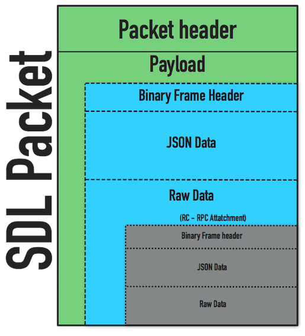
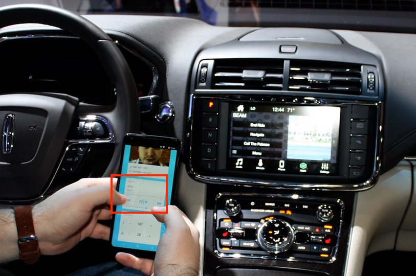
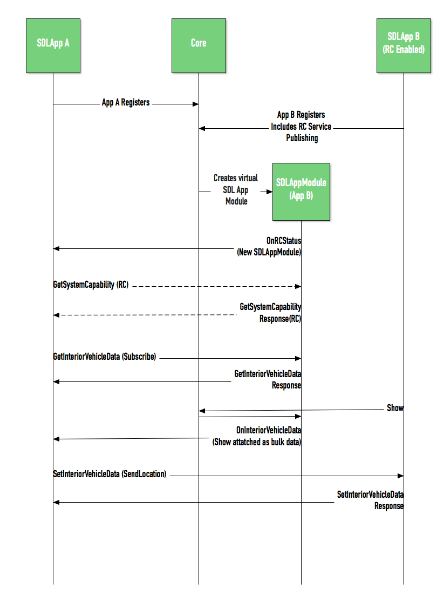

# Remote Control - SDL Module

* Proposal: [SDL-0136](0136-rc-sdl-module.md)
* Author: [Joey Grover](https://github.com/joeygrover/)
* Status: **Deferred**
* Impacted Platforms: [Android, Core, iOS, RPC]

## Introduction

There is a strong desire to implement some method of inter-app communication between SDL apps. The SDL protocol can be enhanced to facilitate this feature. Leveraging the previously accepted Remote Control functionality, we can introduce a new module type, SDL_APP. 


## Motivation

SDL connected apps provide augmented functionality to an SDL enabled IVI system. This includes mobile navigation or even off-board voice recognition. Most apps focus on a particular feature or experience they provide and therefore leverage libraries, 3rd party solutions, or other apps to perform the features that are not part of their main line user experience. One of the ways an app augments itself is using SDL enabled features, send location, voice req, etc. This is a potential alternative to [SDL-0130](https://github.com/smartdevicelink/sdl_evolution/blob/master/proposals/0130-SendLocation-for-Mobile-Nav.md)


## Proposed solution

This proposal introduces a new module type into the Remote Control feature titled SdlApp.

Core would monitor which apps are connected and create the virtual modules for each of the SDL apps that are connected and have registered as a RC module. When an app connects, it can register with a flag that will allow other apps to access/subscribe to that app. Core takes this flag and creates a new virtual module, and sends out an `OnRCStatus` notification that includes this new module.

The way in which data and control is actually passed between the apps is by attaching a second RPC to the original RPC through the bulk data. The receiving app will be responsible for pulling the raw data out of the packet, parsing it, and pushing it through the normal callback system for RPCs.

#### Packet Structure
As stated, the RPC that is desired to be sent for either setting or getting purposes will be attched as the raw data in the Set/Get Interior Vehicle Data RPC pairs. The structure will be as followed:


   

#### SDL App Identification
In order to talk to specific modules we will need to introduce some sort of identification. For this reason we will add a `moduleUUID` field to the `GetInteriorVehicleData` request and `ModuleData`.

#### Subscription
When an app is subscribed to another app,(App A is subscribed to App B), Core will take the RPC sent by App B and create `OnInteriorVehicleData` RPCs for the corresponding SDL_APP module created for App B. It should then send an update to all subscribed apps, in this case App A. 

#### SDL App becomes available
When a new app registers with an available RC service, the Core module will be responsible for sending `OnRCStatus` that contains the new virtualized module.

#### Use Case
Apps can display `Show` updates using the supplied metadata and HMI type to determine if and where the updates should be displayed. An example of when this is useful is for a passenger app that allows the user to see what is playing through the SDL connected app as well as have basic control.



## Detailed design




#### Mobile_API.xml changes

##### RegisterAppInterface

```xml
<function name="RegisterAppInterface" functionID="RegisterAppInterfaceID" messagetype="request">
        ..
        
        <param name="publishRCService" type="SdlAppControlCapabilities" mandatory="true">
            <description>Capabilities of this SDL app</description>
        </param>
        
</function>
```

##### SdlAppControlData

```xml
<struct name="SdlAppControlData">
	<param name="type" type="AppHMIType" mandatory="false">
            <description>The type of app this module is advertising as.</description>
        </param>
        <param name="HMIStatus' type="HMI_LEVEL" mandatory="false">
            <description>The current HMI status of the app</description>
        </param>
        <param name="containsRpc' type="boolean" mandatory="false">
            <description>If this flag is set, the data included in this packet will actually be a fully formed RPC</description>
        </param>
        <param name="rpcFunctionId' type="FunctionID" mandatory="false">
            <description>If this flag is set, the data included in this packet will actually be a fully formed RPC </description>
        </param>
</struct>

```
##### SdlAppControlCapabilities

```xml
<struct name="SdlAppControlCapabilities">
    <description>Contains information about an SDL control module's capabilities.</description>
    <!-- need an ID in the future -->
    <param name="moduleName" type="String" maxlength="100" mandatory="true">
        <description>The short friendly name of the SDL App module (app name).                      It should not be used to identify a module by mobile application. 
        </description>
    </param>
    <param name="moduleUUID" type="String" mandatory="false">
        <description>This is a unique identifier for this module. 
        </description>
    </param> 
    <param name="writeableRPCs" type="FunctionID" array="true" minsize="0" maxsize="10000" mandatory="false">
         <description> This array can contain the list of RPCs that another app or module could write to or set in this module/app. If an array is not included, it is assumed all RPCs are supported. </description>
    </param>
    
        <param name="readableRPCs" type="FunctionID" array="true" minsize="0" maxsize="10000" mandatory="false">
         <description> This array can contain the list of RPCs that can be read/requested from this module/app. If an array is not included, it is assumed all RPCs are supported. </description>
    </param>
        
</struct>
```

##### ModuleType
```xml
    <enum name="ModuleType">
        <element name="CLIMATE"/>
        <element name="RADIO"/>
        <!-- NEW --> 
        <element name="SDL_APP"/>
    </enum>
```

##### ModuleData
```xml
    <struct name="ModuleData">
        <description>The moduleType indicates which type of data should be changed and identifies which data object exists in this struct. For example, if the moduleType is CLIMATE then a "climateControlData" should exist</description>
        <param name="moduleType" type="ModuleType" mandatory="true">
        </param>
        <!-- NEW --> 
        <param name="moduleUUID" type="String" mandatory="false">
            <description>This is a unique identifier for this module. 
            </description>
        </param> 
        ...
        <param name="sdlAppControlData" type="SdlAppControlData" mandatory="false">
        </param>
    </struct>

```

##### GetInteriorVehicleData

```xml
    <function name="GetInteriorVehicleData" functionID="GetInteriorVehicleDataID" messagetype="request">
        <param name="moduleType" type="ModuleType" mandatory="true">
            <description>
                The type of a RC module to retrieve module data from the vehicle.
                In the future, this should be the Identification of a module.
            </description>
        </param>
       <!-- NEW --> 
        <param name="moduleUUID" type="String" mandatory="false">
            <description>This is a unique identifier for this module. 
            </description>
        </param>
       
       ...
    </function>
```


## Potential downsides
- App developers may have to keep track of which module to send RPCs.
- The solution bends the guidelines of how the protocol works. 
- We have to add some sort of identifier to modules. In this proposal they are simple UUIDs. 

## Impact on existing code
- The new type of module would have to be created and code that would allow one RPC to be combined into another packet's bulk data.
- The proxies will need to handle parsing the bulk data into an RPC and pass through the correct callbacks. 


## Alternatives considered

#### New App types
Instead of using the already existing HMI_TYPE enum, it would be possible to introduce a new set of enums that are defined specifically for what service type is offered through its virtual RC module.

#### Core Sends Bulk Data RPC
Instead of forwarding on the SetInteriorVehicle data packet as a whole, Core would parse the packet and the bulk data. It would decode the bulk data into an RPC and form a new SDL packet that would get sent to the destination app.


#### SDL Module Types
Instead of a generic SDL_APP module type, it would be possible to introduce specific types of apps that could be flushed out to have a more strict RPC representation. However, this limits each release of the RPC spec to only have the SDL app types that have been created.

#### New RPCs
Creating a new get/set/on RPC trio specifically for inter-app-communication. 

```xml
<function name="SendInterAppRequest" messagetype="request">
	<param name="type" type="AppHMIType" mandatory="false">
            <description>The type of app this module is advertising as.</description>
        </param>
        <param name="HMIStatus' type="HMI_LEVEL" mandatory="false">
        <description>The current HMI status of the app
        </param>
        <param name="containsRpc' type="boolean" mandatory="false">
        <description>If this flag is set, the data included in this packet will actually be a fully formed RPC
        </param>
        <param name="functionIDRpc' type="boolean" mandatory="false">
        <description>If this flag is set, the data included in this packet will actually be a fully formed RPC
        </param>    
</function>

<function name="SendInterAppRequest" messagetype="request">
	<param name="type" type="AppHMIType" mandatory="false">
            <description>The type of app this module is advertising as.</description>
        </param>
        <param name="HMIStatus' type="HMI_LEVEL" mandatory="false">
        <description>The current HMI status of the app
        </param>
        <param name="containsRpc' type="boolean" mandatory="false">
        <description>If this flag is set, the data included in this packet will actually be a fully formed RPC
        </param>
        <param name="rpcFunctionId' type="FunctionID" mandatory="false">
        <description>If this flag is set, the data included in this packet will actually be a fully formed RPC
        </param>    
</function>


<function name="GetInterAppRequest" messagetype="request">
	<param name="type" type="AppHMIType" mandatory="false">
            <description>The type of app this module is advertising as.</description>
        <param name="rpcFunctionId' type="FunctionID" mandatory="false">
        <description>This is the function ID that the requesting app is requesting from the receiving app. (eg Show, AddCommand, etc)
        </param> 
        <param name="subscribe' type="boolean" mandatory="false">
        <description>If the app would like to subscribe to future updates via this RPC
        </param>         
           
</function>

<function name="GetInterAppRequest" messagetype="response">
	<param name="type" type="AppHMIType" mandatory="false">
            <description>The type of app this module is advertising as.</description>
        </param>
        <param name="HMIStatus' type="HMI_LEVEL" mandatory="false">
        <description>The current HMI status of the app
        </param>
        <param name="containsRpc' type="boolean" mandatory="false">
        <description>If this flag is set, the data included in this packet will actually be a fully formed RPC
        </param>
        <param name="rpcFunctionId' type="FunctionID" mandatory="false">
        <description>If this flag is set, the data included in this packet will actually be a fully formed RPC
        </param>    
</function>

```
