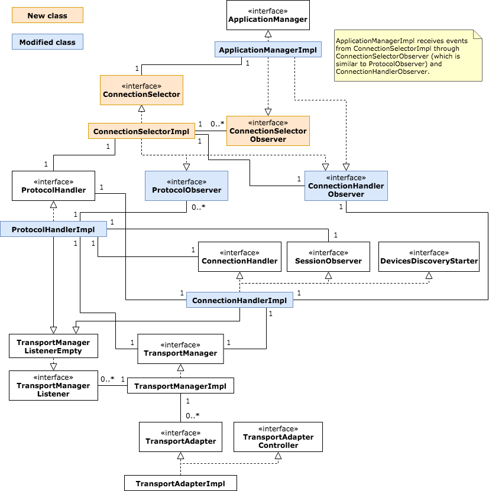

# Supporting simultaneous multiple transports

* Proposal: [SDL-0141](0141-multiple-transports.md)
* Author: [Sho Amano](https://github.com/shoamano83), [Robin Kurian](https://github.com/robinmk)
* Status: **In Review**
* Impacted Platforms: [Core / iOS / Android / RPC / Protocol]

## Introduction

This proposal aims to support multiple transports between Core and Proxy. Some parts of this proposal are split into separate proposal documents in order to get better discussion.

## Motivation

The initial motivation was to utilize Wi-Fi transport for apps that require high bandwidth, such as video projection apps. After discussions in SDLC workshop, it turned out that using Wi-Fi transport has a few limitations. For example, Wi-Fi transport may be disabled when an iOS app goes background or the iPhone's screen is locked. The app will be then unregistered from Core, so it will significantly decrease user's experience.

This proposal aims to address such limitations by utilizing multiple transports, for example iAP and Wi-Fi, at the same time. The app will keep iAP connection when using Wi-Fi transport, so if the transport becomes unavailable it will switch to iAP transport and continue working.
The proposal should also benefit app developers since it will remove the burden of selecting appropriate transport and/or implementing transport switching in their apps.


## Proposed solution

The basic idea is that:
- Proxy enables multiple instances of transports and uses all of them to connect to Core
- Proxy runs Version Negotiation procedure on every transport. The frames used by Version Negotiation include extra data so that Core knows a single Proxy has initiated multiple connections.
- Core accepts and maintains multiple sessions of a single service (e.g. RPC service) over multiple connections
- Core and Proxy choose appropriate connection when sending data
- Core and Proxy support detecting connection unavailability and switching to another one
- Core and Proxy buffer transmit data and resend them when switching connection. They also support discarding duplicate messages received from multiple transports, if any.

Following sections will describe the idea in more detail.

### Selection of a transport

In this document, a simple prioritization of the transport is proposed. For example, Wi-Fi (TCP) > USB > Bluetooth; both Core and Proxy transmit frames over TCP when it is available, if not then over USB (iAP over USB and AOA), and if USB is not available either then over Bluetooth (iAP over Bluetooth and Bluetooth SPP).

OEMs may prefer one prioritization over another, so it is a good idea to make the prioritization configurable through smartDeviceLink.ini file. Core reads it from the file and forwards it to Proxy, so that they both use same prioritization. For this purpose, it is proposed to add `transportPriority` parameter in the payload of Start Service ACK frame of RPC service.

Details of the parameter and .ini file format will be discussed in separate proposal [SDL-nnnn: Configuring transport priority][transport_priority].

### Modification to Version Negotiation

One of the issues arising from multiple-transports feature is that SDL Core needs to distinguish between two cases: "a single SDL app connecting to SDL Core using two different transports" and "two instances of a SDL app on two phones connecting to SDL Core using different transports". For this purpose, this document proposes to introduce an ID called "App Instance ID". It is generated by each instance of SDL Proxy, and Proxy should keep the ID at least until all transports are disconnected from Core.

We will also need same checking for Proxy. When a Proxy is connecting to Core through multiple transports, Proxy should make sure that it is not connecting to two different head units (which is unlikely to happen in real use-case though). For this purpose, SDL Core generates an ID called "Core Instance ID". Core keeps the ID at least until ignition off. When Proxy detects that its second transport is connecting to a different head unit, Proxy should disconnect it.

During Version Negotiation, Start Service frame of RPC service includes a parameter called `appInstanceId` in the payload and Proxy adds its App Instance ID in this parameter. Start Service ACK frame of RPC service includes a parameter called `coreInstanceId` in the payload and Core adds its Core Instance ID in it.

As described in previous section, Start Service ACK frame of RPC service also includes a parameter called `transportPriority` to indicate the priority of the transport to Proxy.

Detailed specification of these IDs and the frames will be discussed in a separate proposal [SDL-nnnn: Addition of 'App Instance ID' and 'Core Instance ID'][instance_ids].

### Detecting transport unavailability and resending data

The main reason of utilizing multiple transports is to seamlessly switch to another connection when the transport currently in use becomes unavailable. Unfortunately, TCP connection is not good at detecting underlying transport unavailability. In some cases, applications don't detect it until the connection generates timed out event.

To quickly identify transport unavailability, a new control frame called `Receiver Report` is introduced. The frame is periodically sent by both Core and Proxy and includes the Message IDs of the latest frames that has been received on each service. When `Receiver Report` frame is not received for a given period of time, the receiver of the frame considers the transport as unavailable and switches to another connection (if any).

When a transport becomes unavailable, it is possible that messages which are being transmitted are not delivered to peer. To cope with this case, Proxy and Core should buffer messages even after sending them, and retransmit them when a transport becomes unavailable and it switches to another connection. The Message IDs in `Receiver Report` frame are used for this purpose. Core and Proxy buffer send frames until they receive a `Receiver Report` frame and confirm that the messages are successfully received by peer.

Core and Proxy should check Message IDs and should discard any duplicate messages.

The details of `Receiver Report` frame and its related features are discussed in a separate proposal [SDL-nnnn: Addition of 'Receiver Report' control frame][receiver_report].

### Backward compatibility

It is important that Proxy does not initiate multiple connections to an old version of Core. The behavior of Proxy is described below.

**iOS Proxy:** Once Proxy is started, it initiates all of the transports which are specified by the app. iAP Transport waits for accessory connection, and TCP transport scans a head unit on the network.

When it receives an accessory connected event, it sets up an RPC session over iAP transport and proceeds with RegisterAppInterface sequence. It also checks if Core supports multiple transport feature during Version Negotiation. If it doesn't, then Proxy may stop using TCP transport.

When it finds a head unit on Wi-Fi network first, it sets up an RPC session over TCP transport and proceeds with RegisterAppInterface sequence. It continues to wait for iAP accessory connected event, since a Core that supports Wi-Fi advertising feature should also support multiple transport feature.


**Android Proxy:** Once Proxy is started, it initiates all of the transports which are specified by the app. Bluetooth transport waits for incoming connection from the head unit, AOA transport waits for accessory connected event, and TCP transport scans a head unit on the network.

When it detects a connection through Bluetooth or AOA, it sets up an RPC session over the transport and proceeds with RegisterAppInterface sequence. It also checks if Core supports multiple transport feature during Version Negotiation. If it doesn't, then Proxy may keep the first transport that has been connected and stop the rest of transports.

When Proxy finds a head unit on Wi-Fi network first, it sets up an RPC session over TCP transport and proceeds with RegisterAppInterface sequence. It continues to wait for Bluetooth and AOA connections, since a Core that supports Wi-Fi advertising feature should also support multiple transport feature.

Please note that when connecting to old version of Core, only one transport that has been set up at first will be used. Additional feature like automatic transport switching is not used. This is to keep the behavior of Proxy similar to previous version.


## Detailed design

### Extension of SDL Protocol

Start Service frame of RPC service will include a parameter called `appInstanceId`. Start Service ACK frame of RPC service will include a parameter called `coreInstanceId`. Details of these parameters are discussed in proposal [SDL-nnnn: Addition of 'App Instance ID' and 'Core Instance ID'][instance_ids].

Start Service ACK frame of RPC service will also include a parameter called `transportPriority` to convey the prioritization of transports from Core to Proxy. Details of this parameter is discussed in proposal [SDL-nnnn: Configuring transport priority][transport_priority].

A new control frame called `Receiver Report` will be introduced. Details are discussed in proposal [SDL-nnnn: Addition of 'Receiver Report' control frame][receiver_report].

### Extension of iOS Proxy

iOS Proxy introduces a new class called `SDLProtocolSelector` which is placed between `SDLProxy` and `SDLProtocol` classes. SDLProtocolSelector class creates two SDLProtocol instances (one for iAP transport and other for Wi-Fi) and manages them. It implements most of the features described in this proposal, such as:
- Receiving priority of connections from Core through Start Service ACK
- Selecting best SDLProtocol instance when transmitting messages
- Buffering transmit messages until SDLProtocol instance notifies that Receiver Report is received
- Discarding duplicate messages
- Receiving connection unavailable events from SDLProtocol instances and resending buffered messages on another connection
- Managing MessageID (since it should be shared between two SDLProtocol instances)
- Generating App Instance ID when starting Proxy

`SDLProtocol` and `SDLProtocolListener` classes are extended to support `Receiver Report` frame handling.

Fig. 1 illustrates newly added and modified classes related to SDLProtocolSelector.


**Fig. 1: Added and modified classes in iOS Proxy**

`ProxyManager` class adds an API to enable this multiple-transports feature.

```objc
typedef NS_ENUM(NSUInteger, ProxyTransportType) {
    ProxyTransportTypeUnknown,
    ProxyTransportTypeTCP,      // TCP transport with automatic IP address and TCP port configuration
    ProxyTransportTypeIAP,
    ProxyTransportTypeTCPDebug  // (for debugging only) IP address and TCP port should be manually configured
};

- (void)startWithTransports:(NSArray *)transports;
```
Where `transports` indicates a list of transports that the app is intended to enable. App calls this API like this:
```objc
[[ProxyManager sharedManager] startWithTransports:@[@(ProxyTransportTypeIAP), @(ProxyTransportTypeTCP)]];
```
`SDLLifecycleConfiguration` will include additional parameters to keep this list. `SDLLifecycleManager` creates a `SDLProxy` instance which uses `SDLProtocolSelector`, and passes the list to the selector.

`SDLTCPTransport` is likely to be updated to support head unit discovery feature over Wi-Fi, which will be discussed in separate proposal [SDL-nnnn: Add Service Discovery mechanism for TCP transport][service_discovery].

### Extension of Android Proxy

Android Proxy introduces a new class called `SdlConnectionSelector` which is placed between `SdlSession` and `SdlConnection` classes. SdlConnectionSelector class creates multiple SdlConnection instances (each of which is dedicated for a single type of a transport) and manages them. It implements most of the features described in this proposal, such as:
- Receiving priority of connections from Core through Start Service ACK
- Selecting best SdlConnection instance when transmitting messages
- Buffering transmit messages until SdlConnection instance notifies that `Receiver Report` is received
- Discarding duplicate messages
- Receiving connection unavailable events from SdlConnection instances and resending buffered messages on another connection
- Managing MessageID (since it should be shared between multiple WiProProtocol instances)
- Generating App Instance ID when starting Proxy
Also, `WiProProtocol` class and `IProtocolListener` interface are extended to support `Receiver Report` frame handling.

Fig. 2 illustrates newly added and modified classes related to SdlConnectionSelector.


**Fig. 2: Added and modified classes in Android Proxy**

`SdlProxyALM` class adds new constructors to enable this multiple-transports feature, such as:
```java
public SdlProxyALM(IProxyListenerALM listener, SdlProxyConfigurationResources sdlProxyConfigurationResources,
    String appName, Vector<TTSChunk> ttsName, String ngnMediaScreenAppName, Vector<String> vrSynonyms, Boolean isMediaApp,
    SdlMsgVersion sdlMsgVersion, Language languageDesired, Language hmiDisplayLanguageDesired, Vector<AppHMIType> appType,
    String appID, String autoActivateID, boolean callbackToUIThread, boolean preRegister, String sHashID,
    List<BaseTransportConfig> transportConfigs) throws SdlException {
    ....
}
```
`SdlProxyBase` class will be tweaked to keep the list of transport configs, and create `SdlSession` instance that uses SdlConnectionSelector.

Note that `BTTransportConfig` and `MultiplexTransportConfig` should not be specified at the same time, as both of the transports will try to use Bluetooth device. `SdlProxyBase` class should detect this error during construction.

`TCPTransport` class is likely to be updated to support head unit discovery feature over Wi-Fi, which will be discussed in separate proposal [SDL-nnnn: Add Service Discovery mechanism for TCP transport][service_discovery].

### Extension of Core

First of all, the ID value returned by `ApplicationImpl::app_id()` has to be connection independent. Currently the value is generated from a pair of `connection_handle` and `session_id` (please refer to `ApplicationManagerImpl::RegisterApplication()` implementation). We propose to replace it with the value of App Instance ID and make it connection independent.

Likewise, `connection_key` value in `application_manager::Message` class should be replaced with App Instance ID. Any implementation above ApplicationManager that uses `connection_key` as an identification of an app should be updated to use App Instance ID instead.

Secondary, SDL Core introduces a new component called `ConnectionSelector`. It is placed in between `ConnectionHandler` and `ApplicationManager`. It implements following features:
* Conversion between `connection_key` and App Instance ID
  - It receives OnServiceStartedCallback and OnServiceEndedCallback from ConnectionHandler, and keeps relationship between App Instance ID and `connection_key` in a table. For a legacy app that does not send App Instance ID, ConnectionSelector generates one when OnServiceStartedCallback of RPC service is received.
  - When a message is received from ProtocolHandler through OnMessageReceived(), it converts `connection_key` into appropriate App Instance ID and notifies ApplicationManager.
  - It calls OnServiceStartedCallback of ApplicationManager when a new type of service is started on an app. For example, it calls the callback when RPC service is started on a transport for an app, but it will not call when another RPC service is started on a different transport for the same app. Likewise, it calls OnServiceEndedCallback of ApplicationManager when *all* instances of a service for an app are ended.
* Selection of a connection to send out messages
  - It receives transmit data from ApplicationManager, looks for the App Instance ID attached with the message and selects the best connection available for the app. Then it converts App Instance ID into connection\_key, creates a RawMessage instance and sends it to ProtocolHandler. The priority of the connections should be pre-configured, through smartDeviceLink.ini setting.
  - It also sends the priority of connection types to mobile app using Start Service ACK frame.
* Re-transmission when a connection gets unavailable
  - It buffers transmit messages until it receives `Receiver Report` event from ProtocolHandler. Also, when ProtocolHandler notifies connection unavailable event, it clears the connection from the table and resends buffered messages on another connection.
* Discarding duplicate messages
* Managing MessageID
  - Currently MessageID is generated in ProtocolHandler (refer to `message_counters_`). This has to be moved to `ConnectionSelector` so that the IDs will be consistent within an app for different connections.
* Handling Core Instance ID
  - Upon starting, it generates a Core Instance ID.
  - It adds Core Instance ID value in Start Service ACK frame when corresponding Start Service frame includes App Instance ID. The details of Core Instance ID specification is discussed in separate proposal [SDL-nnnn: Addition of 'App Instance ID' and 'Core Instance ID'][instance_ids].

Other classes have to be updated accordingly. Here are a few examples:
- ProtocolHandler implements receiving and sending `Receiver Report` frame. It periodically sends `Receiver Report` messages on all connections. When it receives a `Receiver Report` message, it notifies ConnectionSelector that sent message(s) is/are successfully received by peer. When it detects a timeout on a particular connection, it notifies ConnectionSelector that the connection becomes unavailable.
- ConnectionHandler keeps connection type (such as Bluetooth, USB, Wi-Fi) when a new connection is detected through OnConnectionEstablished() callback. When it notifies ConnectionSelector that a new service is started through ConnectionHandlerObserver::OnServiceStartedCallback(), it includes the connection type.
- ApplicationManager is updated to call ConnectionSelector's methods instead of ConnectionHandler.
- Profile and ProtocolHandlerImpl classes include support to read transport priority from smartDeviceLink.ini file and include it in Start Service ACK frame of RPC service.

Fig. 3 illustrates newly added and modified classes in SDL Core. (Note: it does not include IP address and port number advertising feature over Wi-Fi.)



**Fig. 3: Added and modified classes in SDL Core**

### Modification of HMI\_API.xml

HMI should be notified that an app is connected over multiple transports. Update `deviceInfo` param of `HMIApplication` to an array, so that HMI can recognize the app using multiple transports.

```diff
<struct name="HMIApplication">
     <description>Data type containing information about application needed by HMI.</description>
 
     :
 
-    <param name="deviceInfo" type="Common.DeviceInfo" mandatory="true">
+    <param name="deviceInfo" type="Common.DeviceInfo" minsize="1" maxsize="10" array="true" mandatory="true">
        <description>The ID, serial number, transport type the named-app's-device is connected over to HU.</description>
     </param>
```

## Potential downsides

This feature introduces additional logics in both Core and Proxy. They may increase CPU usage on a head unit and mobile phone.

This feature requires Core and Proxies to buffer sent messages for a while. This will increase memory usage.

When a single device is connected to SDL Core through multiple transports, different values of `DeviceUID` will be assigned per transport. Also, HMI receives multiple `DeviceInfo` information, although there is actually one device. (Note that these behaviors are same as of now and it is not a new issue.) The cause of these issues is that the device information is strictly tied to TransportAdapter classes in Core, and we have no way to merge multiple device information into one. It may cause an issue if HMI implements a "Device chooser" GUI based on information from `BasicCommunication.OnUpdateDeviceList` notification.

## Impact on existing code

* Most of the code changes are limited to transport and protocol handler layers, notably:
  - Addition of new selector classes in Proxies and Core
  - Modification to protocol handlers to support new parameters in Version Negotiation
  - Additional implementation in protocol handlers to support Receiver Report frame
* SDL Core's Application Manager also needs updates on app\_id usage (i.e. replacing connection\_key with App Instance ID).
* This proposal also introduces small update on Proxies' APIs.
* This proposal includes HMI\_API.xml changes that are not backward compatible. When Core is updated, HMI should be updated accordingly.

## Out of scope of this proposal

For better user experience, SDL Proxies need a means to automatically detect Core's IP address and TCP port number. Otherwise, a user needs to enter them manually on every SDL apps s/he is going to use. Such mechanism is not covered by this proposal and will be discussed in another proposal [SDL-nnnn: Add Service Discovery mechanism for TCP transport][service_discovery].

An advanced feature which allows usage of Wi-Fi transport only to specific apps is proposed along with this multiple-transports idea. It will be discussed in [SDL-nnnn: Add capability to disable or reject an app based on app type, transport type and OS type][reg_limitation].

## Alternatives considered

- Introduce transport switching mechanism while keeping current "single transport" design. This should have less impact on existing implementation since we only keep one transport between Proxy and Core at the same time. However, it will not resolve the limitation raised during SDLC workshop to utilize Wi-Fi transport.
- Extend RegisterAppInterface request and response instead of Version Negotiation to convey App Instance ID and Core Instance ID. This approach has more impact on implementations since ApplicationManager layers of SDL Core and Proxies need to be updated.
- Introduce existing protocol like MPTCP (Multi-path TCP) or SCTP (Stream Control Transport Protocol). This will introduce a large amount of code (either implemented by SDLC members or using existing open-source library) and increases complexity. Since we only need retransmission mechanism, this approach seems to be "too much".

## References

- [SDL-nnnn: Configuring transport priority][transport_priority]
- [SDL-nnnn: Addition of 'App Instance ID' and 'Core Instance ID'][instance_ids]
- [SDL-nnnn: Addition of 'Receiver Report' control frame][receiver_report]
- [SDL-nnnn: Add Service Discovery mechanism for TCP transport][service_discovery]
- [SDL-nnnn: Add capability to disable or reject an app based on app type, transport type and OS type][reg_limitation]


  [transport_priority]: nnnn-mt-transport-priority.md       "Configuring transport priority"
  [instance_ids]:       nnnn-mt-instance-ids.md             "Addition of 'App Instance ID' and 'Core Instance ID'"
  [receiver_report]:    nnnn-mt-receiver-report.md          "Addition of 'Receiver Report' control frame"
  [service_discovery]:  nnnn-mt-service-discovery.md        "Add Service Discovery mechanism for TCP transport"
  [reg_limitation]:     nnnn-mt-registration-limitation.md  "Add capability to disable or reject an app based on app type, transport type and OS type"

