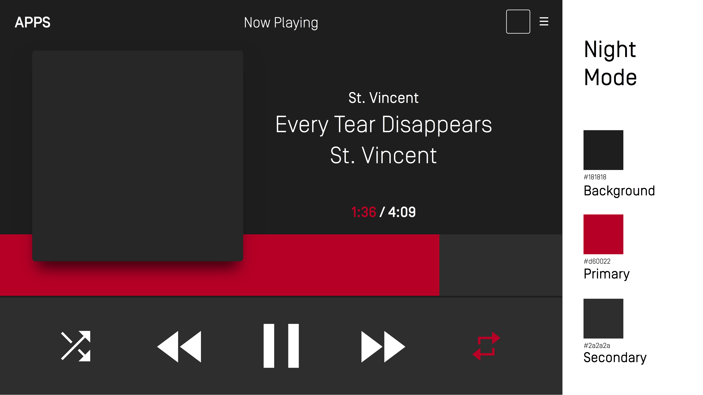

# Template Improvements: Color Scheme

* Proposal: [SDL-0147](0147-template-color-scheme.md)
* Author: [Joel Fischer](https://github.com/joeljfischer)
* Status: **In Review**
* Impacted Platforms: [RPC, Android, iOS, Core]

## Introduction

This proposal enables apps to provide a custom color scheme. This will allow OEMs to still strictly control layout and design while allowing apps some amount of branding and customization.

## Motivation

Currently, nearly no customizability is available to developers and their apps for branding outside of the app icon. Most apps and developers have their own branding colors, and that is an easy way to help provide developers customization that competitor solutions do not.

## Proposed solution

The proposed solution is to add a few new structs:

```xml
<struct name="RGBColor">
    <description>
    </description>
    <param name="red" type="Integer" minValue="0" maxValue="255" mandatory="true" />
    <param name="green" type="Integer" minValue="0" maxValue="255" mandatory="true" />
    <param name="blue" type="Integer" minValue="0" maxValue="255" mandatory="true" />
    </param>
</struct>

<struct name="TemplateColorScheme">
    <description>
        A color scheme for all display layout templates.
    </description>
        <param name="primaryColor" type="RGBColor" mandatory="false">
            <description>The primary "accent" color</description>
        </param>
        <param name="secondaryColor" type="RGBColor" mandatory="false">
            <description>The primary "accent" color</description>
        </param>
        <param name="backgroundColor" type="RGBColor" mandatory="false">
            <description>The color of the background</description>
        </param>
</struct>
```

Along with an addition to the RegisterAppInterface request:

```xml
<function name="RegisterAppInterface" functionID="RegisterAppInterfaceID" messagetype="request">
...
<param name="dayColorScheme" type="TemplateColorScheme" mandatory="false">
<param name="nightColorScheme" type="TemplateColorScheme" mandatory="false">
...
</function>
```

and SetDisplayLayout:

```xml
<function name="SetDisplayLayout" functionID="SetDisplayLayoutID" messagetype="request">
    ...
    <param name="dayColorScheme" type="TemplateColorScheme" mandatory="false">
    <param name="nightColorScheme" type="TemplateColorScheme" mandatory="false">
</function>
```

A `SetDisplayLayout` request with the same layout as is currently displayed will result in the current template to change color. This is to allow a developer to change their color scheme based on which head unit they are connected to, if desired. SDL Core should track the number of attempted `SetDisplayLayout` requests with the current template and `REJECT` any beyond the first with the reason "Using SetDisplayLayout to change the color scheme may only be done once."

The developer may provide either a day color scheme, a night scheme, or both. If the dev doesn't offer one or the other, the HMI can decide what to do. The strong recommendation is to use the default color scheme for whatever is not supported.

The text color should be calculated using an algorithm based on the background color and will always be either white or black, whatever shade the OEM decides based on the rest of their UI.

While the OEM may use these colors to appear the best within their UI, there are a few requirements and a few strong recommendations for placement of the colors to allow for consistency across platforms and to give app developers a good base they can consider when selecting their colors.

### Examples

Using the Generic HMI, this scheme works out like the following:

#### Pandora
##### Day


Primary: #356efc – Secondary & Background: #ffffff

##### Night


Primary: #356efc – Secondary & Background: #151841

#### AccuWeather
##### Day


##### Night


Primary: #ed5628 – Secondary: #3b4147 – Background: #131b24

#### iHeart Radio
##### Day


##### Night


### OEM Requirements
1. If the OEM uses only one color, they must use the `primaryColor`.
2. If the OEM uses the `secondaryColor`, they must also use the `primaryColor`.

### OEM Recommendations
1. The `backgroundColor` should change the background color of the layout.
2. The `primaryColor` should change the `mediaClockTimer` bar and the highlight color of soft buttons.
3. The `secondaryColor` should change the background color of buttons, such as soft buttons.
4. If the OEM supports both day and night schemes, and a developer provides only one scheme, they should use the developer's scheme for the one they provided, and their default scheme for the other.
5. If the OEM supports only day or night scheme (e.g. light / dark, respectively), then the OEM should only use the corresponding scheme, if the developer provides it. e.g. If the OEM only supports a dark scheme on their head unit, the OEM should only use the night scheme, when available.

#### App Requirements
1. An app's `primaryColor` must be their primary brand color. Other colors they choose should be based on that color being the primary color.

## Potential downsides

This **must** be implemented consistently across platforms. If it is not, then apps may have colors appearing where they do not expect across platforms. Either a platform needs to integrate it in a consistent manner across other platforms, or they should not have the capability at all and use their own color scheme(s).

The app may provide a color scheme that no text color will work well for. App certification may be necessary for this case. I would recommend we follow the [W3C accessibility guidelines](https://www.w3.org/TR/WCAG20/), with an [example algorithm](https://stackoverflow.com/a/3943023/1221798).

Allowing developers to change the current template's color at runtime could result in a "painting" effect which is less than ideal.

## Impact on existing code

This should be a minor version change. There are HMI API changes required.

## Alternatives considered

1. Require both a day and night color scheme. This would be accomplished by adding another struct containing mandatory day / night parameters, then the struct itself would be not mandatory on the Register App Interface.
2. Additional colors could be provided. Currently only 3 colors are used, with the ability to expand later. If there were more colors, it would be more likely that they would be implemented differently across head units.
3. Additional specific colors could be provided, such as soft button background color, hard button background color (e.g. Play), etc.
