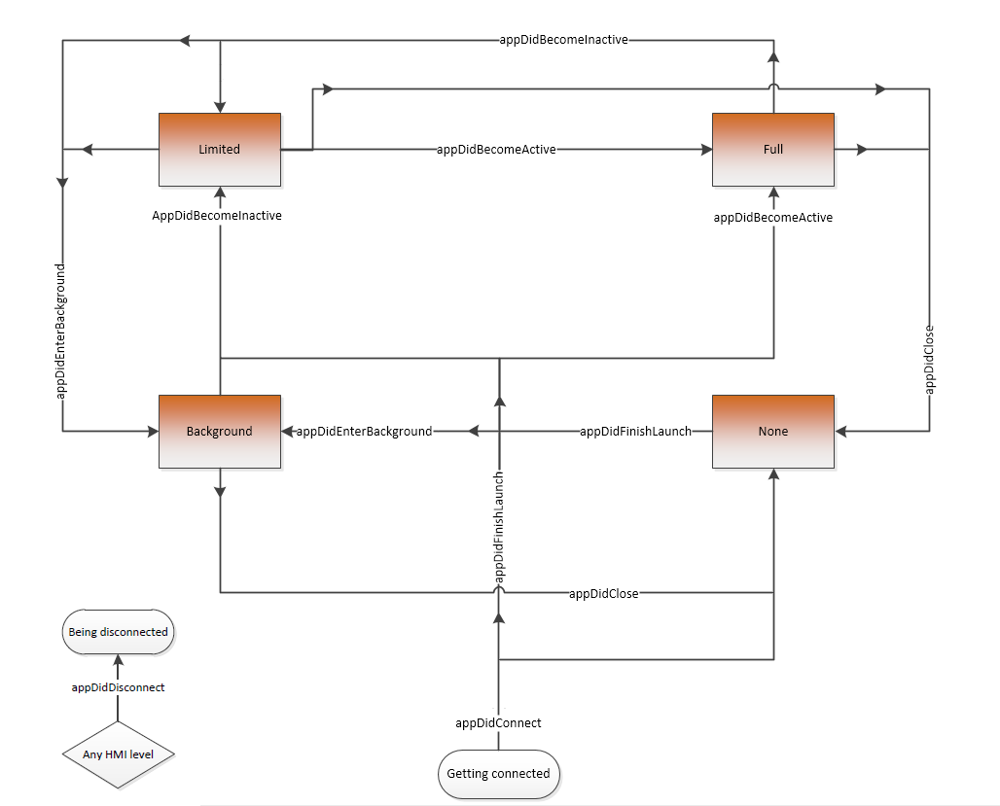

# High level interface: Foundation

* Proposal: [SDL-0156](0156-high-level-interface-foundation.md)
* Author: [Kujtim Shala](https://github.com/kshala-ford)
* Status: **Accepted with Revisions**
* Impacted Platforms: [ iOS ]

## Introduction

This proposal is about setting up a foundation to provide a high level developer interface to the iOS library. 
The foundation will be about the application lifecycle which is necessary for view controller lifecycle and management.
It's the first proposal from a set of proposals each addressing a specific section of the high level interface.

## Motivation

In order to work with SDL, app developers need to learn a new API which mostly doesn't adopt familiar patterns. Including but not limited to 
- read best practices and implement proxy lifecycle (Android above all)
- the use of RPCs and handle notifications, requests and responses
- manually manage concurrent and sequential operations (e.g. image upload)

The time for an app developer to learn SDL (non-productive time) is high and not accepted by some developers. 
The SDL iOS library already improves the current situation by abstracting painful implementations. However the management layer is still unfamiliar and causes a high learning curve.

## Proposed solution

This proposal is about adding a new abstraction layer which utilizes the management layer and provides a high level interface familiar to the UIKit framework in iOS and Activity package in Android.

| High level interface |
|----------------------|
| Management layer     |
| Proxy layer          |
| Protocol layer       |
| Transport layer      |

The high level interface sits on top of the management layer. It should provide classes like 
- SDL Application to abstract SDL-centric application lifecycle including HMI status, capabilities, language etc. 
- SDL ViewController (iOS) or Activity (Android) to allow architecture SDL use cases beyond today's possibilities (incl. UI stack)
- SDL View with subclasses to simplify the HMI screen manipulation throughout the UI stack

This proposal is about the application lifecycle only. It may mention views and view controllers which are covered by other proposals. The application lifecycle is about providing an easy, convenient way to setup the SDL application using the concept of UIKit. The idea is to reduce the learning curve and provide a (mostly) familiar API to the developer.

The application lifecycle will contain the following items:
- `SDLApplication` which will be the central class coordinating the SDL application running on the SDL enabled system.
- `SDLApplicationState` provides well known app states covering the complexity and pain with HMI level transitions.
- `SDLApplicationDelegate` will be used by the app to receive delegate calls very similar to UIKit.

### SDLApplication (mimic UIApplication)

The application lifecycle `SDLApplication` should utilize the lifecycle manager and provide 
- a state machine abstracting transitions of the HMI level, audio streaming state etc.
- properties to access (appliation related) capabilities (from `RegisterAppInterfaceResponse` or `GetSystemCapabilities`)
- refer to an SDL view controller manager which will be used to manage view controller instances starting with the root view controller. 

The application should bypass the manager's sub-managers. The only exception should be the SDLPermissionManager as it is very focused on RPC permissions. 
Instead the high level features should monitor the required RPCs internally and provide named properties and notifications 
similar to [`CLLocationManager.authorizationStatus`](https://developer.apple.com/documentation/corelocation/cllocationmanager/1423523-authorizationstatus?language=objc) 
and [`locationManager:didChangeAuthorizationStatus:`](https://developer.apple.com/documentation/corelocation/cllocationmanagerdelegate/1423701-locationmanager?language=objc)
in order to monitor permissions. For violations the high level features should provide errors using something like
[`locationManager:didFailWithError:`](https://developer.apple.com/documentation/corelocation/cllocationmanagerdelegate/1423786-locationmanager?language=objc)
and an SDL version of [`kCLErrorDenied`](https://developer.apple.com/documentation/corelocation/clerror/kclerrordenied?language=objc).

As not all RPCs are abstracted and the above permission management is not implemented yet the permission manager (to access RPC permissions) and the sdl Manager (to send RPCs) will be made accessible.

```objc
/**
 * The central class coordinating the SDL application running on the SDL enabled system
 * By default every application contains a single instance of SDLApplication. 
 */
@interface SDLApplication

/** Initializes the shared application object using the specified configuration. */
+ (void)initializeWithConfiguration:(SDLConfiguration *)configuration rootViewController:(__kindof SDLViewController *)rootViewController delegate:(id<SDLApplicationDelegate>)delegate;

/** Returns the singleton app instance. */
@property (strong, nonatomic, class, readonly) SDLApplication *sharedApplication;

/** The delegate of the SDL application. */
@property (weak, nonatomic) id<SDLApplicationDelegate> delegate;

/** The current state of the application. */
@property (assign, nonatomic, readonly) SDLApplicationState applicationState;

/** Describes whether or not streaming audio of the media application is currently audible through the system. */
@property (assign, nonatomic, readonly) SDLAudioStreamingState audibleState;

/** Indicates whether or not a user-initiated interaction is in progress, and if so, in what mode (i.e. MENU or VR). */
@property (assign, nonatomic, readonly) SDLSystemContext systemContext;

/** The SDL application configuration. (bypass to manager) */
@property (copy, nonatomic, readonly) SDLConfiguration *configuration;

/** The capabilities of the SDL enabled system. (bypass to manager) */
@property (strong, nonatomic, readonly) SDLSystemCapabilityManager *systemCapabilities;

/** The file manager to be used by the running app. (bypass to manager) */
@property (strong, nonatomic, readonly) SDLFileManager *fileManager;

/** The streaming media manager to be used for starting video sessions. (bypass to manager) */
@property (strong, nonatomic, readonly, nullable) SDLStreamingMediaManager *streamManager;

/** The permission manager monitoring RPC permissions (bypass to manager). It's likely that this property will be deprecated with RPCs being abstracted. */
@property (strong, nonatomic, readonly) SDLPermissionManager *permissionManager;

/** The underlying SDL manager. It's likely that this property will be deprecated with RPCs being abstracted. */
@property (strong, nonatomic, readonly) SDLManager *sdlManager;

/** The root/manager of the application's view controllers. */
@property (nonatomic, strong, readonly) SDLViewControllerManager *viewControllerManager;

@end
```

A private extension will be used in order to create objects out of `SDLApplication`. This extension should be located in a separate private header file but should be implemented in the application's .m file. This would hide the technical possibility for creating multiple `SDLApplication` objects. The class method `+(void)initializeWithConfiguration:rootViewController:delegate` should use the initializer and set the shared application instance. Those who master SDL and need to have multiple SDL applications can reuse the extension and create new objects manually. 

```objc
@interface SDLApplication()

/** Returns the singleton app instance. */
@property (strong, nonatomic, class, readwrite) SDLApplication *sharedApplication;

- (instancetype)initWithConfiguration:(SDLConfiguration *)configuration rootViewController:(__kindof SDLViewController *)rootViewController delegate:(id<SDLApplicationDelegate>)delegate;

@end
```

Different to [`UIApplicationMain()`](https://developer.apple.com/documentation/uikit/1622933-uiapplicationmain?language=objc) the class method `+(void)initializeWithConfiguration:rootViewController:delegate` should become **the** entry point for SDL apps. The app developer should call the class method in an early phase of the app's launching procedure (e.g. in `UIApplicationDelegate.application:didFinishLaunchingWithOptions:`). It'll create the shared application object using the provided parameters.

As a start to demonstrate the ease of SDL the function should be able to build the application as HelloSDL by calling the initializer with `nil`. The transport layer should be iAP so it's expected that `ExternalAccessory.framework` linked and the protocol strings are added. The idea of helloSDL in the framework is to provide a very quick start into SDL. It could be added to the iOS documentation as a checkpoint to get an SDL app running.

### SDLApplicationState (mimic UIApplicationState)

Inspired by [`UIApplicationState`](https://developer.apple.com/documentation/uikit/uiapplicationstate) an SDL application can behave very similar to a native iOS app. The current state is stored as a property in the application object. Transitions between the states are covered by the application delegate.

```objc
typedef SDLEnum SDLApplicationState SDL_SWIFT_ENUM;
extern SDLApplicationState const SDLApplicationStateActive;       // Equivalent to HMI_FULL
extern SDLApplicationState const SDLApplicationStateLimited;      // Equivalent to HMI_LIMITED (Inactive state)
extern SDLApplicationState const SDLApplicationStateBackground;   // Equivalent to HMI_BACKGROUND
extern SDLApplicationState const SDLApplicationStateNotRunning;   // Equivalent to HMI_NONE
extern SDLApplicationState const SDLApplicationStateDisconnected; // Equivalent to not connected/registered
```

### SDLApplicationDelegate (mimic UIApplicationDelegate)

This protocol corresponds to [UIApplicationDelegate](https://developer.apple.com/documentation/uikit/uiapplicationdelegate) and provides method called on certain commonly used transitions. All of the transitions would also be notified through the notification center.

The purpose of the protocol is to improve the learning curve of possible HMI level transitions by reducing the number of possible transitions.

*AppDelegate protocol*

```objc
@protocol SDLApplicationDelegate

- (void)applicationDidFinishLaunching:(SDLApplication *)application;

@optional
- (void)applicationDidConnect:(SDLApplication *)application;
- (void)applicationDidDisconnect:(SDLApplication *)application;

- (void)applicationDidBecomeActive:(SDLApplication *)application;
- (void)applicationDidBecomeLimited:(SDLApplication *)application;
- (void)applicationDidEnterBackground:(SDLApplication *)application;
- (void)applicationDidClose:(SDLApplication *)application;

- (void)applicationDidBecomeAudible:(SDLApplication *)application;
- (void)applicationDidBecomeAttenuated:(SDLApplication *)application;
- (void)applicationDidBecomeNotAudible:(SDLApplication *)application;

- (void)applicationDidEnterMainContext:(SDLApplication *)application;
- (void)applicationDidEnterVoiceRecognitionSession:(SDLApplication *)application;
- (void)applicationDidEnterMenu:(SDLApplication *)application;
- (void)applicationDidBecomeObscured:(SDLApplication *)application;
- (void)applicationDidDisplayAlert:(SDLApplication *)application;

- (SDLLifecycleConfigurationUpdate *)application:(SDLApplication *)application shouldUpdateLifecycleConfigurationToLanguage:(SDLLanguage)language;

@end
```

Equivalent notification names should also be provided. The notifications will use `NSNotification` with one of the below names. `.object` will be set to the SDLApplication object.

```objc
const NSNotificationName SDLApplicationDidFinishLaunching;

const NSNotificationName SDLApplicationDidConnect;
const NSNotificationName SDLApplicationDidDisconnect;

const NSNotificationName SDLApplicationDidBecomeActive;
const NSNotificationName SDLApplicationDidBecomeLimited;
const NSNotificationName SDLApplicationDidEnterBackground;
const NSNotificationName SDLApplicationDidClose;

const NSNotificationName SDLApplicationDidBecomeAudible;
const NSNotificationName SDLApplicationDidBecomeAttenuated;
const NSNotificationName SDLApplicationDidBecomeNotAudible;

const NSNotificationName SDLApplicationDidEnterMainContext;
const NSNotificationName SDLApplicationDidEnterVoiceRecognitionSession;
const NSNotificationName SDLApplicationDidEnterMenu;
const NSNotificationName SDLApplicationDidBecomeObscured;
const NSNotificationName SDLApplicationDidDisplayAlert;
```

*Transition flow*



*Transition table*

| From          | To            | Delegate call(s)                                                      | Case/Example                                                          |
|---------------|---------------|-----------------------------------------------------------------------|-----------------------------------------------------------------------|
| Any level     | Not connected | `appDidDisconnect:`                                                   | Phone's disconnected. No `appDidClose:` (exclusive to connected apps) |
| Not connected | NONE          | `appDidConnect:`                                                      | App just registered                                                   |
| BACKGROUND    | NONE          | `appDidClose:`                                                        | Background app was closed                                             |
| LIMITED       | NONE          | `appDidClose:`                                                        | Active media app was closed by the user while HMI is e.g. in Nav      |
| FULL          | NONE          | `appDidClose:`                                                        | App was closed by the user                                            |
| Not connected | BACKGROUND    | `appDidConnect:`<br>`appDidFinishLaunch:`<br>`appDidEnterBackground:` | App with background service just registered                           |
| NONE          | BACKGROUND    | `appDidFinishLaunch:`<br>`appDidEnterBackground:`                     | App just got permission to serve in background                        |
| LIMITED       | BACKGROUND    | `appDidEnterBackground:`                                              | Active media app was closed as the user selected another media app    |
| FULL          | BACKGROUND    | `appDidEnterBackground:`                                              | Non-media app is backgrounded as the user moved to e.g. media         |
| Not connected | LIMITED       | `appDidConnect:`<br>`appDidFinishLaunch:`<br>`appDidBecomeLimited:`   | Media app resumed after ignition cycle while HMI is e.g. in Nav       |
| NONE          | LIMITED       | `appDidFinishLaunch:`<br>`appDidBecomeLimited:`                       | Media app to be started by the system but not brought to foreground   |
| BACKGROUND    | LIMITED       | `appDidBecomeLimited:`                                                | Media app to be started by the system but not brought to foreground   |
| FULL          | LIMITED       | `appDidBecomeLimited:`                                                | Media app was background as the user moved to e.g. Nav                | 
| Not connected | FULL          | `appDidConnect:`<br>`appDidFinishLaunch:`<br>`appDidBecomeActive:`    | Media app resumed after ignition cycle and became visible on HMI      |
| NONE          | FULL          | `appDidFinishLaunch:`<br>`appDidBecomeActive:`                        | App was selected by the user (or system)                              |
| BACKGROUND    | FULL          | `appDidBecomeActive:`                                                 | Background app was selected by the user                               |
| LIMITED       | FULL          | `appDidBecomeActive:`                                                 | Active media app was selected by the user                             |

## Potential downsides

The initial workload in order to implement this high level interface is expected to be quite high. Once implemented it is expected that developers will be able to implement SDL into their apps in less time than they would need today. At the end the maintenance of the high level interface may be lower compared to the counterproposal for different reasons.

This proposal mimics the native UI API. Compared to the counterproposal this proposal is not that close to the native UI kit experience. On the other side some SDL specific APIs can be easily abstracted and integrated into the rest of the high level interface.

## Impact on existing code

This proposal will add a totally new high level interface layer abstracting many parts of SDL. Existing code should not be affected in a short term but it would make parts of the code obsolete therefore to be deprecated and made private.

## Alternatives considered

As discussed in the steering committee meeting from March 20 (see [here](https://github.com/smartdevicelink/sdl_evolution/issues/379#issuecomment-374736496)) this proposal is a counterproposal to [0133 - Enhanced iOS Proxy Interface](https://github.com/smartdevicelink/sdl_evolution/blob/master/proposals/0133-EnhancediOSProxyInterface.md).
