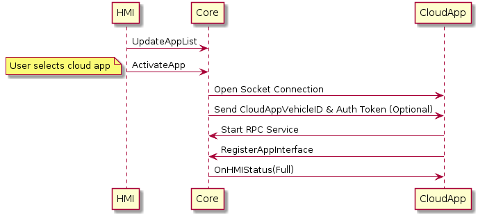
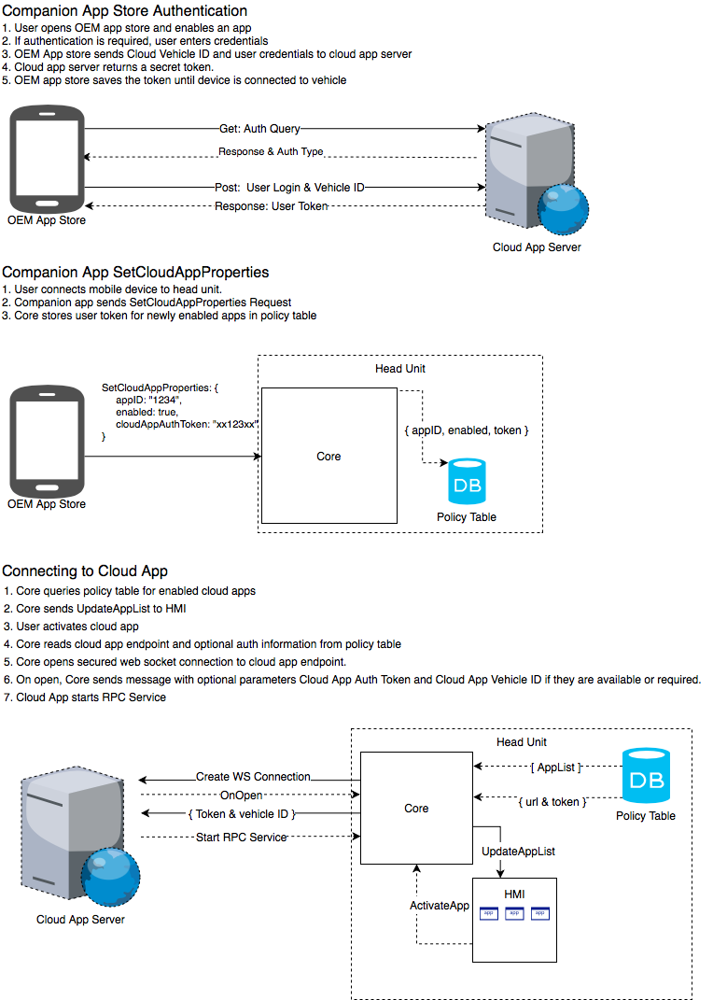

# Cloud App Transport Adapter

* Proposal: [SDL-0158](0158-cloud-app-transport-adapter.md)
* Author: [Jack Byrne](https://github.com/JackLivio)
* Status: **Accepted with Revisions**
* Impacted Platforms: [Core, Android, IOS, RPC, Server, Protocol]

## Introduction

This proposal will detail a possible solution for allowing  SDL-enabled cloud applications to be used in a vehicle. This proposal will cover the process of obtaining cloud application server endpoints, enabling which cloud apps should appear in the HMI app list, opening connections between Core and a cloud based app server, and how a cloud application can authenticate connected head units. 

## Motivation

### Background on SDL-enabled cloud applications:
- SDL cloud apps would still use the SDL RPC Service / protocol
- SDL cloud apps would integrate a proxy library that supports all Mobile API RPCs
- SDL cloud apps live in the "cloud", not in the car or phone
- Using a cloud app on the head unit would not require a mobile device, but would require the head unit to have an active data connection
- SDL Core initiates the connection to cloud application using endpoints supplied by policy table updates (OEMs control trusted app connections)
- User can select which cloud apps to display through an OEM App Store

## Proposed solution

### High level overview of connection process and authentication

1. User opens OEM App store containing the list of possible cloud applications. (Using mobile sdl app or embedded sdl app)
2. User chooses to enable a cloud application from the list
3. If the cloud application requires user authentication, the user will enter login information or complete OAuth Device Flow
4. Auth information is sent in a post request from OEM app store to cloud app server with the cloudAppVehicleID (Optional)
5. Cloud app verifies login credentials and stores the cloudAppVehicleID for future use (Optional) 
6. Cloud app responds to OEM app store with a secret token that will be used to authenticate SDL Core's future websocket connection
7. User connects phone to headunit, OEM app registers and sends updated list of enabled cloud apps and corresponding secret tokens.
8. Core stores secret tokens in the policy table and updates the `enabled` field of the cloud apps listed in the policy table.
9. Core sends update app list to HMI to display cloud apps' availability
10. User activates the cloud app, Core gets the websocket (WS) endpoint from policy table and opens a websocket connection.
11. Cloud app sends a start service request, and Core responds with a `Start Service ACK` with the auth_token in the payload.

Note: This is one possible implementation of enabling and authenticating cloud apps using an OEM cloud app store. Please refer to other example use cases.


### Obtaining Cloud App IP Address and Port
Maintaining a list of urls for each cloud app will be similar to how policies for SDL applications are currently managed. When a policy table update is required, the sdl server will send an updated policy table with a list of cloud apps and their websocket endpoints.

There will need to be three new fields introduced in the app_policies section of the policy table. 

This is what the app_policies section of a policy table that includes a cloud app endpoint might look like: 

```JSON
        "app_policies": {
            "default": {
                "keep_context": false,
                "steal_focus": false,
                "priority": "NONE",
                "default_hmi": "NONE",
                "groups": ["Base-4"]
            },
            "IOSApp12345": {
                "keep_context": true,
                "steal_focus": true,
                "priority": "NONE",
                "default_hmi": "NONE",
                "groups": ["Base-4", "Location-1", "Emergency-1"]
            },
            "WebAppID12345" : {
                "keep_context": true,
                "steal_focus": true,
                "priority": "NONE",
                "default_hmi": "NONE",
                "groups": ["Base-4"],
+               "endpoint": "https://fakesdlwebsocketurl.com:8080",
+               "certificate" : "-----BEGIN CERTIFICATE-----\n" ...,
+               "enabled" : false,
+               "auth_token" : "ABCD12345",
+               "cloud_transport_type": "WSS",
+               "hybrid_app_preference": "MOBILE"
            }
        }
```

The `endpoint` field includes the URL/IP and port that the SDL cloud app can be connected to. Endpoints can be added, removed, or updated via policy table updates. This means OEMs will be in control of the cloud apps that their head units attempt to connect to.

The `certificate` field is used for secured RPC service connections which equates to opening a secured websocket connection. 

The `enabled` field is by default set to false so the cloud app does not show on the HMI. If the user enables an app via the app store flow highlighted in the section above, then `enabled` will be set to true in the head unit's local policy table. When set to true, this cloud app will be included in the HMI RPC "UpdateAppList".

The `auth_token` field is also obtained via the app store selection and authorization flow discussed above. This token is used to authenticate the head unit's websocket connection to the cloud app server. This field can be populated by a SetCloudAppProperties request or through a policy table update response.

The `cloud_transport_type` field is used to specify the type of connection core will use to connect to that cloud app server. This proposal only specifies the use of secured websockets so this field is for future proofing other types of connections.

The `hybrid_app_preference` field is used to specify the user's preference for using a cloud app that is also available on the user's phone. For example when the preference is set to `MOBILE` and the user connects a mobile app while using the same cloud app, the cloud app will unregister and the mobile version will be the only app to be displayed on the app list. Possible fields are `MOBILE`, `CLOUD`, `BOTH`.


### Enabling Cloud Apps to Appear on SDL App List

Mobile API Changes

Add new RPCs `SetCloudAppProperties` and `GetCloudAppProperties`.

`SetCloudAppProperties` can be used by an OEM "App Store" in order to enable/disable a cloud app from appearing on the SDL HMI. This RPC will also deliver neccesary authentication information if the app requires it.

`GetCloudAppProperties` can be used by an OEM "App Store" in order to retrieve the current cloud app information upon startup and after these properties are modified by other means (such as a PTU).

```
    <enum name="FunctionID" internal_scope="base" since="1.0">
        ...
        <element name="SetCloudAppPropertiesID" value="50" hexvalue="32" since="5.x" />
        <element name="GetCloudAppPropertiesID" value="51" hexvalue="33" since="5.x" />
    <enum>
    ...
    <enum name="HybridAppPreference">
        <description>Enumeration for the user's preference of which app type to use when both are available</description>
        <element name="MOBILE" />
        <element name="CLOUD" />
        <element name="BOTH">
    </enum>

    <struct name="CloudAppProperties" since="5.x">
        <param name="appName" type="String" maxlength="100" mandatory="true"></param>
        <param name="appID" type="String" maxlength="100" mandatory="true"></param>
        <param name="enabled" type="Boolean" mandatory="false">
            <description>If true, cloud app will be included in HMI RPC UpdateAppList</description>
        </param>
        <param name="authToken" type="String" maxlength="65535" mandatory="false">
            <description>Used to authenticate websocket connection on app activation</description>
        </param>
        <param name="cloudTransportType" type="String" maxlength="100" mandatory="false">
            <description>Specifies the connection type Core should use</description>
        </param>
        <param name="hybridAppPreference" type="HybridAppPreference" maxlength="100" mandatory="false">
            <description>Specifies the user preference to use the cloud app version or mobile app version when both are available</description>
        </param>
        <param name="endpoint" type="String" maxlength="65535" mandatory="false"></param>
    </struct>

    <function name="SetCloudAppProperties" functionID="SetCloudAppPropertiesID" messagetype="request" since="5.x">
        <description>
            RPC used to enable/disable a cloud application and set authentication data
        </description>
        <param name="properties" type="CloudAppProperties" mandatory="true">
            <description> The new cloud application properties </description>
        </param>
    </function>

    <function name="SetCloudAppProperties" functionID="RegisterAppInterfaceID" messagetype="response" since="5.x">
        <description>The response to SetCloudAppProperties</description>
        <param name="success" type="Boolean" platform="documentation" mandatory="true">
            <description> true if successful; false if failed </description>
        </param>
        <param name="resultCode" type="Result" platform="documentation" mandatory="true">
            <description>See Result</description>
            <element name="SUCCESS"/>
            <element name="INVALID_DATA"/>
            <element name="OUT_OF_MEMORY"/>
            <element name="TOO_MANY_PENDING_REQUESTS"/>
            <element name="GENERIC_ERROR"/>
            <element name="DUPLICATE_NAME"/>
            <element name="TOO_MANY_APPLICATIONS"/>
            <element name="APPLICATION_REGISTERED_ALREADY"/>
            <element name="UNSUPPORTED_VERSION"/>
            <element name="WRONG_LANGUAGE"/>
            <element name="DISALLOWED"/>
            <element name="WARNINGS"/>
            <element name="RESUME_FAILED"/>
        </param>
    </function>

    <function name="GetCloudAppProperties" functionID="SetCloudAppPropertiesID" messagetype="request" since="5.x">
        <description>
            RPC used to get the current properties of a cloud application
        </description> 
        <param name="appID" type="String" maxlength="100" mandatory="true"></param>
    </function>

    <function name="GetCloudAppProperties" functionID="RegisterAppInterfaceID" messagetype="response" since="5.x">
        <description>The response to GetCloudAppProperties</description>
        <param name="properties" type="CloudAppProperties" mandatory="false">
            <description> The requested cloud application properties </description>
        </param>
        <param name="success" type="Boolean" platform="documentation" mandatory="true">
            <description> true if successful; false if failed </description>
        </param>
        <param name="resultCode" type="Result" platform="documentation" mandatory="true">
            <description>See Result</description>
            <element name="SUCCESS"/>
            <element name="INVALID_DATA"/>
            <element name="OUT_OF_MEMORY"/>
            <element name="TOO_MANY_PENDING_REQUESTS"/>
            <element name="GENERIC_ERROR"/>
            <element name="DUPLICATE_NAME"/>
            <element name="TOO_MANY_APPLICATIONS"/>
            <element name="APPLICATION_REGISTERED_ALREADY"/>
            <element name="UNSUPPORTED_VERSION"/>
            <element name="WRONG_LANGUAGE"/>
            <element name="DISALLOWED"/>
            <element name="WARNINGS"/>
            <element name="RESUME_FAILED"/>
        </param>
    </function>
```
HMI API Changes

Update to UpdateAppList description
```
<function name="UpdateAppList" messagetype="request">
      <description>Issued by SDL to notify HMI about new applications registered or enabled cloud apps.</description>
      ...
</function>
```
Update HMIApplication Struct 
```
<struct name="HMIApplication">
    ...
    <param name="isCloudApplication" type="Boolean" mandatory="false"></param>
    <param name="cloudConnectionStatus" type="CloudConnectionStatus" mandatory="false"></param>
</struct>
```

A new enum CloudConnectionStatus will be used to allow the HMI to notify the user about the status of a cloud app connection.
```
<enum name="CloudConnectionStatus">
    <element name="NOT_CONNECTED" value="0"/><description>No active websocket session or ongoing connection attempts</description>
    <element name="CONNECTED" value="1"/><description>Websocket is active</description>
    <element name="RETRY" value="2"/><description>Websocket connection failed and retry attempts are ongoing</description>
</enum>
```
### Retry Sequence

The config file smartDeviceLink.ini should be updated to include two fields that relate to connection retry attempts for cloud connections

```
[Cloud App Connections]
; Value in milliseconds for time between retry attempts on a failed websocket connection
CloudAppRetryTimeout = 1000 
; MaxNn number of retry attempts for a cloud websocket connection
CloudAppMaxRetryAttempts = 5
```

While Core is attempting to retry opening the websocket connections, Core will send the HMI an UpdateAppList RPC with the HMIApplication CloudConnectionStatus enum of "RETRY". The HMI may choose how it wants to display to the user that connection attempts to the cloud app are ongoing.

If the CloudAppMaxRetryAttempts value is reached, Core will stop attempting to open the websocket connection and send an UpdateAppList RPC with the HMIApplication CloudConnectionStatus enum of "NOT_CONNECTED". Future connection attempts can be initiated by the user if they activate the app again.

If the websocket connection attempt is successful, Core will send the CloudConnectionStatus enum "CONNECTED" via UpdateAppList.

#### Transport Adapter Connection Flow

App Activation: User selects the cloud app from the app list on the HMI and the websocket connection to the cloud server is opened. After the cloud app sends a start rpc service request, Core will respond with a `Start Service ACK` with the auth_token included in the payload.



The behavior of displaying a cloud app before registration is to prevent unnecessary websocket connections when an app is not in use. Also if an application is put into hmi status NONE, then the websocket connection will be closed until the user activates the application again.

### Disconnecting Websocket Connection

If a cloud app connection is open and the app is put into HMI level `NONE`, the cloud transport adapter should disconnect the websocket connection. The connection will be recreated once the app is activated again. 

Additionaly there should be a new ApplicationExitReason added to the HMI API to allow for the HMI to manage cloud app connections.

```
<enum name="ApplicationExitReason">
  <element name="DRIVER_DISTRACTION_VIOLATION" >
    <description>By getting this value, SDL puts the named app to NONE HMILevel</description>
  </element>
  <element name="USER_EXIT" >
    <description>By getting this value, SDL puts the named app to NONE HMILevel</description>
  </element>
  <element name="UNAUTHORIZED_TRANSPORT_REGISTRATION">
    <description>By getting this value, SDL unregisters the named application</description>
  </element>
  <element name="UNSUPPORTED_HMI_RESOURCE">
    <description>By getting this value, SDL unregisters the named application</description>
  </element>
+  <element name="CLOSE_CLOUD_CONNECTION">
+    <description>By getting this value, SDL puts the named app to NONE HMILevel. Used by the HMI to close a cloud app connection.</description>
+  </element>
</enum>
```

### CloudAppVehicleID

The CloudAppVehicleID is an optional parameter used by cloud apps or the policy server to identify a head unit. This value could be used by a cloud app to identify an incoming connection from core. This value could also be used by an enhanced policy server to index cloud app configurations for a specific head unit. (Please see example use cases).

The CloudAppVehicleID is stored by the HMI and is sent to Core through a get vehicle data request. CloudAppVehicleID should be added as a new vehicle data parameter.

The content of CloudAppVehicleID is up to the OEM's implementation. Possible values could be the VIN or a hashed VIN. Also OEM's may choose to reset this value on a master reset of the head unit in case the vehicle changes owners. 

Mobile API changes

```
<enum name="VehicleDataType">
            :
    <element name="VEHICLEDATA_CLOUDAPPVEHICLEID" />
</enum>

<function name="SubscribeVehicleData" functionID="SubscribeVehicleDataID" messagetype="request">
            :
    <param name="cloudAppVehicleID" type="Boolean" mandatory="false"></param>
</function>
<function name="SubscribeVehicleData" functionID="SubscribeVehicleDataID" messagetype="response">
            :
    <param name="cloudAppVehicleID" type="VehicleDataResult" mandatory="false"></param>
</function>

<function name="UnsubscribeVehicleData" functionID="UnsubscribeVehicleDataID" messagetype="request">
            :
    <param name="cloudAppVehicleID" type="Boolean" mandatory="false"></param>
</function>
<function name="UnsubscribeVehicleData" functionID="UnsubscribeVehicleDataID" messagetype="response">
            :
    <param name="cloudAppVehicleID" type="VehicleDataResult" mandatory="false"></param>
</function>

<function name="GetVehicleData" functionID="GetVehicleDataID" messagetype="request">
            :
    <param name="cloudAppVehicleID" type="Boolean" mandatory="false"></param>
</function>
<function name="GetVehicleData" functionID="GetVehicleDataID" messagetype="response">
            :
    <param name="cloudAppVehicleID" type="String" mandatory="false"></param>
</function>

<function name="OnVehicleData" functionID="OnVehicleDataID" messagetype="notification">
            :
    <param name="cloudAppVehicleID" type="String" mandatory="false"></param>
</function>
```

HMI API changes

```
<enum name="VehicleDataType">
            :
    <element name="VEHICLEDATA_CLOUDAPPVEHICLEID" />
</enum>

<function name="SubscribeVehicleData" functionID="SubscribeVehicleDataID" messagetype="request">
            :
    <param name="cloudAppVehicleID" type="Boolean" mandatory="false"></param>
</function>
<function name="SubscribeVehicleData" functionID="SubscribeVehicleDataID" messagetype="response">
            :
    <param name="cloudAppVehicleID" type="Common.VehicleDataResult" mandatory="false"></param>
</function>

<function name="UnsubscribeVehicleData" functionID="UnsubscribeVehicleDataID" messagetype="request">
            :
    <param name="cloudAppVehicleID" type="Boolean" mandatory="false"></param>
</function>
<function name="UnsubscribeVehicleData" functionID="UnsubscribeVehicleDataID" messagetype="response">
            :
    <param name="cloudAppVehicleID" type="Common.VehicleDataResult" mandatory="false"></param>
</function>

<function name="GetVehicleData" functionID="GetVehicleDataID" messagetype="request">
            :
    <param name="cloudAppVehicleID" type="Boolean" mandatory="false"></param>
</function>
<function name="GetVehicleData" functionID="GetVehicleDataID" messagetype="response">
            :
    <param name="cloudAppVehicleID" type="String" mandatory="false"></param>
</function>

<function name="OnVehicleData" functionID="OnVehicleDataID" messagetype="notification">
            :
    <param name="cloudAppVehicleID" type="String" mandatory="false"></param>
</function>
```
## Example Use Cases

The purpose of these example use cases is to show how leveraging the existing policy table update mechanism and the new proposed SetCloudAppProperties RPC can create the possibility of having many different types of OEM Cloud App Store implementations.

### Example Use Case 1

This diagram describes the flow in which the user could enable the cloud apps they want to use in their vehicle by using an OEM Companion App.

Note: AuthToken and CloudAppVehicleId are optional.



### Example Use Case 2

This diagram shows how an enhanced policy server could be used to deliver enabled cloud app information to SDL Core by using the policy table update mechanism. This flow does not require the user to connect their mobile device to the head unit, therefore the OEM app store does not have to be implemented on a mobile companion app. The OEM app store could be implemented on a website instead.


### Example Use Case 3

This diagram shows how the OEM App Store could be implemented as a cloud app itself. Under the current proposal, the OEM could configure the preloaded policy table to contain the OEM app store server endpoint and have it be "enabled" by default. This way the OEM App store as a cloud app would appear on the HMI by default. The user could navigate this app store on the HMI to enable and authenticate other available cloud apps.


### Example Use Case 4

This diagram shows how authentication for a specific cloud app can be contained within the cloud app itself. Login information is passed to the cloud app via a perform interaction.

This diagram assumes that the cloud app has previously been enabled through some other OEM App Store SetCloudAppProperties mechanism.


## Potential downsides

Requires OEM to develop an App store that allows the user to enable and configure cloud apps. 

OEM must maintain extra set of policy related data (Endpoints and certificates). If an endpoint becomes outdated, head units will try to connect to an unknown endpoint. 

Adding a new "cloud proxy" library means another major repository must be developed and maintained. This effort requires new feature development, issue tracking/bug fixes, creating documentation.

## Impact on existing code

### SDL Core

#### New Device Type

A new enum must be added to DeviceType to differentiate cloud app connections from app connections located in the vehicle. 

```c++
enum DeviceType {
+ WEBSOCKET,
  AOA,
  PASA_AOA,
  BLUETOOTH,
  PASA_BLUETOOTH,
  MME,
  IOS_BT,
  IOS_USB,
  TCP,
  UNKNOWN
};
```

#### Websocket Client Transport Adapter
Core will need a new transport adapter that initiates websocket client connections to a remote endpoint. I suggest creating a transport adapter that integrates this library: [Boost Beast](https://github.com/boostorg/beast) for handling the websocket connections.  

### Protocol Changes

#### 3.1.3 Payloads

###### 3.1.3.2.2 Start Service ACK
| Tag Name| Type | Description |
|------------|------|-------------|
|authToken|String|This token is used by a cloud application to authenticate a user account associated with the vehicle.|

### Policies

app_policies section of policy table related classes must be expanded to support new cloud app related fields. 

types.h
```
struct PolicyBase : CompositeType {
 public:
  Strings groups;
  Optional<Strings> preconsented_groups;
  Enum<Priority> priority;
  Enum<HmiLevel> default_hmi;
  Boolean keep_context;
  Boolean steal_focus;
  Optional<String<0, 65535> > endpoint;
  Optional<String<0, 65535> > certificate;
  Optional<Boolean> enabled;
  Optional<String<0, 65535> > auth_token;
  Optional<String<0, 255> > cloud_transport_type;
  Optional<Enum<HybridAppPreference>> hybrid_app_preference;
  Optional<String<0, 65535> > icon_url;

```

policy_table_interface_ext.xml
```
    <struct name="ApplicationParams">
        <param name="groups" type="Strings" />
        <param name="nicknames" type="Strings" mandatory="false" />
        <param name="preconsented_groups" type="Strings" mandatory="false" />
        <param name="AppHMIType" type="AppHMITypes" mandatory="false" />
        <param name="priority" type="Priority" />
        <param name="default_hmi" type="HmiLevel" />
        <param name="keep_context" type="Boolean" />
        <param name="steal_focus" type="Boolean" />
        <param name="memory_kb" type="Integer" minvalue="1" maxvalue="65225" mandatory="false"/>
        <param name="watchdog_timer_ms" type="Integer" minvalue="1"
            maxvalue="65225" mandatory="false"/>
        <param name="endpoint", type="String", minlength="0" maxlength="255", mandatory="false">
        <param name="certificate" type="String" minlength="0" maxlength="65535"
            mandatory="false" />
        <param name="enabled" type="Boolean" mandatory="false" />
        <param name="auth_token" type="String" minlength="0" maxlength="65535"
            mandatory="false"/>
        <param name="cloud_transport_type" type="String" minlength="0" maxlength="255"
            mandatory="false"/>
        <param name="hybrid_app_preference" type="HybridAppPreference" mandatory="false"/>
        <param name="icon_url" type="String" minlength="0" maxlength="65535" mandatory="false"/>
    </struct>
```
This feature should be supported by both regular and external policy build configurations.

#### Policy Table Functional Group Structuring

For security reasons it is recommended that only a trusted OEM companion app or app store is able to send `SetCloudAppProperties` and `GetCloudAppProperties` requests to Core. This policy is to keep other apps from changing or collecting the app property information of other cloud apps registered in the policy table.

Policy Table Entry:
```
"functional_groupings": {
    ...
    "AppStore" : {
        "rpcs":{
            "SetCloudAppProperties":{
                "hmi_levels":["BACKGROUND",
                "FULL",
                "LIMITED"]
            }, "GetCloudAppProperties":{
                "hmi_levels":["BACKGROUND",
                "FULL",
                "LIMITED"]
            }
        }
    }
    ...
}
```

#### App Icon URL

In order to show an app icon before the first time a cloud app is connected and registered, Core should use the app's "icon_url" parameter stored in the policy table with the onSystemRequest and SystemRequest RPCs to get the image data. This process is similar to how the lock screen image is obtained.

A new RequestType should be added to the Mobile and HMI APIs specific to a cloud app's icon.


```
    <enum name="RequestType" since="3.0">
        <description>Enumeration listing possible asynchronous requests.</description>
        <element name="HTTP" />
        <element name="FILE_RESUME" />
        <element name="AUTH_REQUEST" />
        <element name="AUTH_CHALLENGE" />
        <element name="AUTH_ACK" />
        <element name="PROPRIETARY" />
        <element name="QUERY_APPS" />
        <element name="LAUNCH_APP" />
        <element name="LOCK_SCREEN_ICON_URL" />
        <element name="TRAFFIC_MESSAGE_CHANNEL" />
        <element name="DRIVER_PROFILE" />
        <element name="VOICE_SEARCH" />
        <element name="NAVIGATION" />
        <element name="PHONE" />
        <element name="CLIMATE" />
        <element name="SETTINGS" />
        <element name="VEHICLE_DIAGNOSTICS" />
        <element name="EMERGENCY" />
        <element name="MEDIA" />
        <element name="FOTA" />
        <element name="OEM_SPECIFIC" since="5.0" />v
+        <element name="ICON_URL" since="5.x" />
    </enum>   
```


### SDL Server

SDL Server must create an interface for managing additional policy data. Interface should allow for adding, updating, and revoking endpoint urls and SSL certificates. This work should be minimal since it's only two extra parameters.

## Alternatives considered

Since there are many aspects to this proposal, I have considered a few alternatives.

### Using Tokens Supplied by Policy Server to Authenticate

1. Core gets cloud app endpoints and associated tokens from policy server after a policy table update. 
2. Core opens a websocket connection for each cloud app endpoint located in the policy table. 
3. Core sends the VIN and token to the application and waits for the application to respond with data.
4. The cloud application server sends a request to the policy server to identify the incoming connection via the received VIN and token. 
5. If the policy server verifies that the VIN and token pair is valid, the cloud app will send a start service request to Core.

This method would remove the need for requiring the OEM App Store mobile application to connect to SDL Core.

### Using the Mobile Device to Connect

If future vehicles will not have dedicated LTE connections, then the mobile device could be used as the proxy for connecting cloud apps to Core. The phone would connect to Core using traditional SDL transports, and then also maintain a socket connection with the cloud application. Any data sent from Core/Cloud App would be passed through the phone. 

### Separating Policies and Cloud App Endpoints

A separate server could be developed to maintain cloud app endpoints if we believe that this type of logic and data is outside of the scope of policies.

