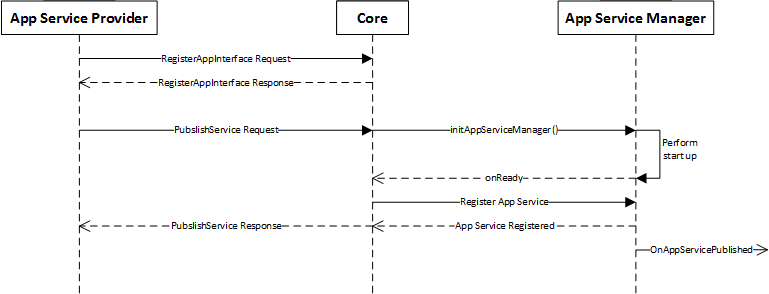
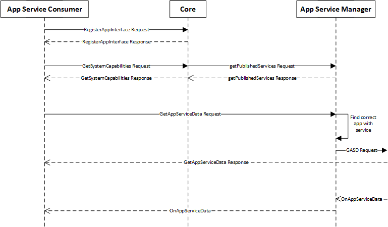
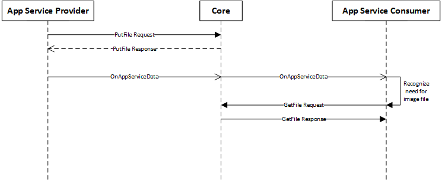
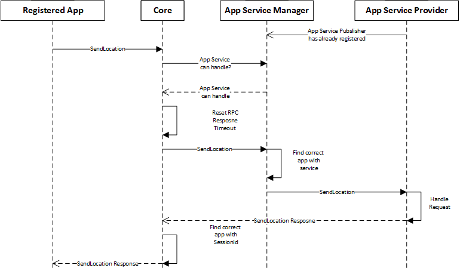

# App Services

* Proposal: [SDL-0167](0167-app-services.md)
* Author: [Joey Grover](https://github.com/joeygrover)
* Status: **Accepted with Revisions**
* Impacted Platforms: [iOS / Android / Core / RPC]


## Introduction

SmartDeviceLink has always been limited to a 1 - 1 relationship between module and smartphone apps. However, to create truly compelling experiences this should be expanded. This proposal will aim to introduce a paradigm that allows apps to advertise a "service" they offer that the module and other apps can leverage. This allows users to augment their vehicle's IVI system with off-board solutions. This proposal also details how SDL apps can communicate with each other through the module. 

This proposal is extremely lengthy as it is a big feature. The recommended review process would be to review the high level process first (publish, subscribe, etc). Then following the agreement on how services work in general, moving to review each service type for its exhaustiveness of functionality per that specific service.

## Motivation

SDL is becoming a much more integrated solution with an expanding ecosystem. While the initial problem SDL set out to solve has been accomplished, we're looking for new ways to make the ecosystem even more compelling and to create an immersive user experience. One of the biggest steps we can take forward is creating a way for apps to offer augmented services to not only the onboard embedded system, but to other SDL connected apps. 


## Proposed solution

After apps are registered on the module, they will have the opportunity to publish a service they wish to offer. If the request is successful and the service has indicated they allow app consumers, all other SDL connected apps will be notified that the new service is available for subscriptions.

Once other apps either use the `getSystemCapability` functionality or they are notified of an app service being offered they can they start to request data. This is done through new RPCs that will get the current data provided by the service and allow the service consumer to subscribe to future updates from the app service provider.

Services will be expected to handle a subset of RPCs according to their service type for basic interaction. For example, Media services will be expected to handle `ButtonPress` RPCs and Navigation services should handle things like `SendLocation`. Each service will define what RPCs it agrees to handle in the `AppServiceManifest` they provide along with the specific manifest param that is defined by their service type.

Along with this basic, standardized set of control requests from app service consumers, we will implement a way for services to expose their native URI scheme for more in-depth actions. These will be exposed with a URI prefix and array of possible URI scheme parameters. SDL makes no guarantees that these actions will be executed as the app service consumer intends, it is therefore the responsibility of the app service provider to ensure standardized URI schemes and intuitive parameters. 

App service providers will be defined into specific types of service. Only one service of each service type can be active at a time. Similar to the HMI status of apps where only one can be in `HMI_FULL` at any given time.


### Service Types
-------

Services will be defined to a few high level categories so that we can support the most services in a generic way. We will discuss this briefly before moving into how most of this system works.

##### AppServiceType enum

_Same for both MOBILE\_API and HMI\_API._

```xml
<enum name="AppServiceType" platform="documentation">
	 <element name = "MEDIA"/>
	 <element name = "WEATHER"/>
	 <element name = "NAVIGATION"/>
</enum>
```

Each service type will have two structs specifically defined for them.

1. `___ServiceManifest` - This struct will contain parameters that are only relevant for that specific service. For example, the `VoiceAssistantManifest` includes a `wakeWords` param that wouldn't make sense for any other service.
2. `___ServiceData` - This is all the data the service provides. It will always be specific to that service. 

Some services will need more structs defined to help standardize the data that is sent and received.


#### Media

A media service is defined as a service that is currently the audio source for the module. The `MediaServiceData` object is defined in a general way for all types of media (music, podcast, audiobook, other). This allows the struct to be simplified with clear descriptions of what data should be contained in for each key.


###### Struct:

```xml
	<struct name="MediaServiceManifest">
	
	</struct>
	
	<enum name="MediaType">
	    <element name="MUSIC">
	    <element name="PODCAST">
	    <element name="AUDIOBOOK">
	    <element name="OTHER">
	</enum>
	
    <struct name="MediaServiceData">
         <description> This data is related to what a media service should provide</description>
         <param name="mediaType" type="MediaType" mandatory="false">
             <description>The type of the currently playing or paused track.</description>
         </param>
         <param name="mediaTitle" type="String" mandatory="false">
             <description>
             Music: The name of the current track
             Podcast: The name of the current episode
             Audiobook: The name of the current chapter
             </description>
         </param>
         <param name="mediaArtist" type="String" mandatory="false">
             <description>
             Music: The name of the current album artist
             Podcast: The provider of the podcast (hosts, network, company)
             Audiobook: The book author's name
             </description>
         </param>
         <param name="mediaAlbum" type="String" mandatory="false">
             <description>
             Music: The name of the current album
             Podcast: The name of the current podcast show
             Audiobook: The name of the current book
             </description>
         </param>
         <param name="playlistName" type="String" mandatory="false">
             <description>
             Music: The name of the playlist or radio station, if the user is playing from a playlist, otherwise, Null
             Podcast: The name of the playlist, if the user is playing from a playlist, otherwise, Null
             Audiobook: Likely not applicable, possibly a collection or "playlist" of books
             </description>
         </param>
         <param name="isExplicit" type="Bool" mandatory="false">
             <description> Whether or not the content currently playing (e.g. the track, episode, or book) contains explicit content</description>
         </param>
         <param name="trackPlaybackProgress" type="Int" mandatory="false">
             <description>
             Music: The current progress of the track in seconds
             Podcast: The current progress of the episode in seconds
             Audiobook: The current progress of the current segment (e.g. the chapter) in seconds
             </description>
         </param>
         <param name="trackPlaybackDuration" type="Int" mandatory="false">
             <description>
             Music: The total duration of the track in seconds
             Podcast: The total duration of the episode in seconds
             Audiobook: The total duration of the current segment (e.g. the chapter) in seconds
             </description>
         </param>
         <param name="queuePlaybackProgess" type="Int" mandatory="false">
             <description>
             Music: The current progress of the playback queue in seconds
             Podcast: The current progress of the playback queue in seconds
             Audiobook: The current progress of the playback queue (e.g. the book) in seconds
             </description>
         </param>
         <param name="queuePlaybackDuration" type="Int" mandatory="false">
             <description>
             Music: The total duration of the playback queue in seconds
             Podcast: The total duration of the playback queue in seconds
             Audiobook: The total duration of the playback queue (e.g. the book) in seconds
             </description>
         </param>
         <param name="queueCurrentTrackNumber" type="Int" mandatory="false">
             <description>
             Music: The current number (1 based) of the track in the playback queue
             Podcast: The current number (1 based) of the episode in the playback queue
             Audiobook: The current number (1 based) of the episode in the playback queue (e.g. the chapter number in the book)
             </description>
         </param>
         <param name="queueTotalTrackCount" type="Int" mandatory="false">
             <description>
             Music: The total number of tracks in the playback queue
             Podcast: The total number of episodes in the playback queue
             Audiobook: The total number of sections in the playback queue (e.g. the number of chapters in the book)
             </description>
         </param>
     </struct>
    
```

###### RPCs to be handled:

- Button Press: 
  - OK
  - SEEKLEFT
  - SEEKRIGHT
  - TUNEUP
  - TUNEDOWN
  - SHUFFLE
  - REPEAT


#### Weather
A weather service is defined as a service that can provide weather data. 

```xml

    <struct name="WeatherServiceManifest">
        <param name="currentForecastSupported" type="Boolean" mandatory="false"/>
        <param name="maxMultidayForecastAmount" type="Integer" mandatory="false"/>
        <param name="maxHourlyForecastAmount" type="Integer" mandatory="false"/>
        <param name="maxMinutelyForecastAmount" type="Integer" mandatory="false"/>
        <param name="weatherForLocationSupported" type="Boolean" mandatory="false"/>
    </struct>

    <struct name="WeatherServiceData">
        <description> This data is related to what a weather service would provide</description>
        <param name="location" type="LocationDetails" mandatory="true"/>
        <param name="currentForecast" type="WeatherData" mandatory="false"/>
        <param name="minuteForecast" type="WeatherData" array="true" minsize="15" maxsize="60" mandatory="false" />
        <param name="hourlyForecast" type="WeatherData" array="true" minsize="1" maxsize="96" mandatory="false" />
        <param name="multidayForecast" type="WeatherData" array="true" minsize="1" maxsize="30" mandatory="false" />
        <param name="alerts" type="WeatherAlert" array="true" minsize="1" maxsize="10" mandatory="false" >
            <description> This array should be ordered with the first object being the current day</description>
        </param>
    </struct>

    <struct name="WeatherData">
        <param name="currentTemperature" type="Temperature" mandatory="false"/>
        <param name="temperatureHigh" type="Temperature" mandatory="false"/>
        <param name="temperatureLow" type="Temperature" mandatory="false"/>
        <param name="apparentTemperature" type="Temperature" mandatory="false"/>
        <param name="apparentTemperatureHigh" type="Temperature" mandatory="false"/>
        <param name="apparentTemperatureLow" type="Temperature" mandatory="false"/>
    
        <param name="weatherSummary" type="String" mandatory="false"/>
        <param name="time" type="DateTime" mandatory="false"/>
        <param name="humidity" type="Float" mandatory="false">
            <description> 0 to 1, percentage humidity </description>
        </param>
        <param name="cloudCover" type="Float" mandatory="false">
            <description> 0 to 1, percentage cloud cover </description>
        </param>
        <param name="moonPhase" type="Float" mandatory="false">
            <description> 0 to 1, percentage of the moon seen, e.g. 0 = no moon, 0.25 = quarter moon </description>
        </param>

        <param name="windBearing" type="Integer" mandatory="false">
            <description> In degrees, true north at 0 degrees </description>
        </param>
        <param name="windGust" type="Float" mandatory="false">
            <description> km/hr </description>
        </param>
        <param name="windSpeed" type="Float" mandatory="false">
            <description> km/hr </description>
        </param>

        <param name="nearestStormBearing" type="Integer" mandatory="false">
            <description> In degrees, true north at 0 degrees </description>
        </param>
        <param name="nearestStormDistance" type="Integer" mandatory="false">
            <description> In km </description>
        </param>
        <param name="precipAccumulation" type="Float" mandatory="false" >
            <description> cm </description>
        </param>
        <param name="precipIntensity" type="Float" mandatory="false" >
            <description> cm of water per hour </description>
        </param>
        <param name="precipProbability" type="Float" mandatory="false" >
            <description> 0 to 1, percentage chance </description>
        </param>
        <param name="precipType" type="String" mandatory="false" >
            <description> e.g. "rain", "snow", "sleet", "hail" </description>
        </param>
        <param name="visibility" type="Float" mandatory="false" >
            <description> In km </description>
        </param>

        <param name="weatherIconImageName" type="String" mandatory="false" />
    </struct>

    <struct name="WeatherAlert">
        <param name="title" type="String" mandatory="false" />
        <param name="summary" type="String" mandatory="false" />
        <param name="expires" type="DateTime" mandatory="false" />
        <param name="regions" type="String" array="true" minsize="1" maxsize="99" mandatory="false" />
        <param name="severity" type="String" mandatory="false" />
        <param name="timeIssued" type="DateTime" mandatory="false" />
    </struct>
    
```


#### Navigation
A navigation service is defined as a service that is currently listed as the navigation provider. This service type will likely deprecate the TBT RPCs. However, when the Service managers are created they could send the TBT information based on the service manager to maintain compatibility with older head units.

```xml
	<struct name="NavigationServiceManifest">
		<param name="acceptsWayPoints" type="Boolean" mandatory="false">
		<description>  Informs the subscriber if this service can actually accept way points.</description>
		</param>
	</struct>

    <struct name="NavigationServiceData">
	    <description> This data is related to what a navigation service would provide.</description>
	
	    <param name="timestamp" type="" mandatory="true">
	        <description> This is the timestamp of when the data was generated. This is to ensure any time or distance given in the data can accurately be adjusted if necessary. </description>
	    </param>
	
	    <param name="origin" type="LocationDetails" mandatory="false"/>
	
	    <param name="destination" type="LocationDetails" mandatory="false"/>
	
	    <param name="destinationETA" type="DateTime" mandatory="false"/>
   
       <param name="wayPoints" type="LocationDetails" mandatory="false" array="true">
           <description> The current way points for the current navigation session. See also LocationDetails</description>
        </param>
   
        <param name="instructions" type="NavInstruction" array="true" mandatory="false">
            <description> This array should be ordered with the first object being the start location of the current trip and the last object the final destination. </description>
	    </param>
	
	    <param name="nextInstructionETA" type="DateTime" mandatory="false"/>
	    <param name="nextInstructionDistance" type="Float" mandatory="false">
	        <description>The distance to this instruction from current location. This should only be updated ever .1 unit of distance. For more accuracy the consumer can use the GPS location of itself and the next instruction. </description>
	    </param>
        <param name="nextInstructionDistanceScale" type="Float" mandatory="false">
            <description>Distance till next maneuver (starting from) from previous maneuver.</description>
        </param>
	
    </struct>

    <struct name="NavInstruction">
	    <param name="locationDetails" type="LocationDetails" mandatory="true">
	    </param>
	
	    <param name="action" type="NavAction" mandatory="true">
	    </param>	
	
	    <param name="direction" type="int" minValue="0" maxValue="359" mandatory="false">
	        <description>The angle at which this instruction takes place. For example, 0 would mean straight, 45 a sharp right, 180 a U-Turn, etc. </description>
	    </param>
	
	    <param name="junctionType" type="NavJunctionType" mandatory="false">
	    </param>	
    </struct>
    
    <enum name="NavAction">
        <element name="TURN">
            <description> Using this action plus a supplied direction can give the type of turn. </description>
        </element>
        <element name="EXIT">
        </element>
        <element name="STAY">
        </element>              
        <element name="MERGE">
        </element>
        <element name="FERRY">
        </element>        
    <enum>
    
    <enum name="NavJunctionType">
        <element name="REGULAR">
            <description> A junction that represents a standard intersection with a single road crossing another.</description>
        </element>
        <element name="BIFURCATION">
            <description> A junction where the road splits off into two paths; a fork in the road.</description>
        </element>
        <element name="MULTI_CARRIAGEWAY">
            <description> A junction that has multiple intersections and paths.</description>
        </element>              
        <element name="ROUNDABOUT">
            <description>A junction where traffic moves in a single direction around a central, non-traversable point to reach one of the connecting roads.</description>
        </element>
        <element name="TRAVESABLE_ROUNDABOUT">
        <description> Similar to a roundabout, however the center of the roundabout is fully traversable. Also known as a mini-roundabout.</description>
        </element>
        <element name="JUGHANDLE">
        <description>A junction where lefts diverge to the right, then curve to the left, converting a left turn to a crossing maneuver.</description>
        </element>
        <element name="ALL_WAY_YIELD">
            <description> Multiple way intersection that allows traffic to flow based on priority; most commonly right of way and first in, first out.</description>
        </element>
        <element name="TURN_AROUND">
            <description> A junction designated for traffic turn arounds.</description>
        </element>
    <enum>
    
```

###### RPCs to be handled:
 - SendLocation
 - GetWayPoints
 - SubscribeWayPoints
 - OnWayPointChange

### Flows
-------

This section will cover how some of the important flows will take place.

#### App Service Provider

First we can start with an app publishing their service and that information propagating to other apps.



##### Defining the service - `AppServiceManifest`
When an app wishes to publish a service to the system it must first define what type of service it is and create a `AppServiceManifest` object that will be passed to the module.

The `AppServiceManifest` is essentially detailing everything about a particular service offering. It contains info specific to the service (service name, id, etc) as well as what capabilities it offers.

```xml
	<struct name="AppServiceManifest">
		<description>This manifest contains all the information necessary for the service to be published, activated, and allow consumers to interact with it</description>
		
		<param name="serviceName" type="String" mandatory="false">
			<description> Unique name of this service</description>
		</param>
		
		<param name="serviceType" type="String" mandatory="true">
    		<description>The type of service that is to be offered by this app. See AppServiceType for known enum equivalent types. Parameter is a string to allow for new service types to be used by apps on older versions of SDL Core.</description>
		</param>
		
		<param name="serviceIcon" type="Image" mandatory="false">
			<description> The icon to be associated with this service. Most likely the same as the appIcon.</description>
		</param>
		
		<param name="allowAppConsumers" type="Boolean" mandatory="false" defvalue="false">
			<description>If true, app service consumers beyond the IVI system will be able to access this service. If false, only the IVI system will be able consume the service. If not provided, it is assumed to be false. </description>
		</param>

				
		<param name="uriPrefix" type="String" mandatory="false">
			<description> The URI prefix for this service. If provided, all PerformAppServiceInteraction requests must start with it.</description>
		</param>
		<param name="uriScheme" type="String" mandatory="false">
			<description> This is a custom schema for this service. SDL will not do any verification on this param past that it has a correctly formated JSON Object as its base. The uriScheme should contain all available actions to be taken through a PerformAppServiceInteraction request from an app service consumer. </description>
		</param>
		
	
		<param name="rpcSpecVersion" type="SyncMsgVersion" mandatory="false">
			<description> This is the max RPC Spec version the app service understands. This is important during the RPC passthrough functionality. If not included, it is assumed the max version of the module is acceptable. </description>
		</param>
		<param name="handledRPCs" type="Integer" array="true" mandatory="false">
			<description> This field contains the Function IDs for the RPCs that this service intends to handle correctly. This means the service will provide meaningful responses. See FunctionID for enum equivalent values. This parameter is an integer to allow for new function IDs to be used by apps on older versions of SDL Core.</description>
		</param>
		
		<param name="mediaServiceManifest" type="MediaServiceManifest" mandatory="false"/>
		<param name="weatherServiceManifest" type="WeatherServiceManifest" mandatory="false"/>
		<param name="navigationServiceManifest" type="NavigationServiceManifest" mandatory="false"/>
		<param name="voiceAssistantServiceManifest" type="VoiceAssistantServiceManifest" mandatory="false"/>

	</struct>
	
```

Based on the specific type of service being offered, an additional manifest struct should be included. These structs are very specific to the service that is being offered. These are defined in the previous section  [Service Types](#service-types).


##### Publishing the service - `PublishAppService`
The next action the App Service has to take is publishing their service. This is performed after the `RegisterAppInterface` response is received. The `PublishAppService` request contains the previously created `AppServiceManifest` object that will inform the system of the capabilities and info about this service.


```xml
<element name="PublishAppServiceID" value="52" hexvalue="34" since="5.1" />

<function name="PublishAppService" functionID="PublishAppServiceID" messagetype="request">
	<description>Registers a service offered by this app on the module</description>

	<param name="appServiceManifest" type="AppServiceManifest" mandatory="true">
		<description> The manifest of the service that wishes to be published.</description>
	</param>

	
</function>


<function name="PublishAppService" functionID="PublishAppServiceID" messagetype="response">
	<description>Response to the request to register a service offered by this app on the module</description>

	<param name="appServiceRecord" type="AppServiceRecord" mandatory="false">
		<description> If the request was successful, this object will be the current status of the service record for the published service. This will include the Core supplied service ID.</description>
	</param>

	<param name="success" type="Boolean" platform="documentation" mandatory="true">
		<description> true, if successful; false, if failed </description>
	</param>
       
	<param name="resultCode" type="Result" platform="documentation" mandatory="true">
		<description>See Result</description>
		<element name="SUCCESS"/>
		<element name="REJECTED"/>
		<element name="DISALLOWED"/>
		<element name="INVALID_DATA"/>
		<element name="OUT_OF_MEMORY"/>
		<element name="TOO_MANY_PENDING_REQUESTS"/>
		<element name="APPLICATION_NOT_REGISTERED"/>
		<element name="GENERIC_ERROR"/>
	</param>
	
	<param name="info" type="String" maxlength="1000" mandatory="false" platform="documentation">
		<description>Provides additional human readable info regarding the result.</description>
	</param>
</function>

```

##### Notifying potential consumers

Once the service is published to the module, the module will be responsible for ensuring that other connected apps are notified that a new service has registered. App service consumers are only notified when they have subscribed to updates via the `GetSystemCapability` subscription model [discussed later](#getsystemcapability-subscription). These updates will contain the same manifest that was provided by the original app service provider and update reason. 

_Same for both MOBILE\_API and HMI\_API._

```xml
<enum name="ServiceUpdateReason">
	 <element name="PUBLISHED">
	 	<description>The service has just been published with the module and once activated to the primary service of its type, it will be ready for possible consumption.</description>
	 </element>
	 <element name="REMOVED">
	 	<description>The service has just been unpublished with the module and is no longer accessible</description>
	 </element>
	 <element name="ACTIVATED">
	 	<description>The service is activated as the primary service of this type. All requests dealing with this service type will be handled by this service.</description>
	 </element>
	 <element name="DEACTIVATED">
	 	<description>The service has been deactivated as the primary service of its type</description>
	 </element>
	 <element name="MANIFEST_UPDATE">
	 	<description>The service has updated its manifest. This could imply updated capabilities</description>
	 </element>
</enum>

<struct name="AppServiceRecord">
	<description> This is the record of an app service publisher that the module has. It should contain the most up to date information including the service's active state</description>
	
	<param name="serviceID" type="String" mandatory="true">
		<description> A unique ID tied to this specific service record. The ID is supplied by the module that services publish themselves. </description>
	</param>
	
	<param name="serviceManifest" type="AppServiceManifest" mandatory="true">
		<description> Manifest for the service that this record is for.</description>
	</param>
	
	<param name="servicePublished" type="Boolean" mandatory="true">
		<description> If true, the service is published and available. If false, the service has likely just been unpublished, and should be considered unavailable.</description>
	</param>
	
	<param name="serviceActive" type="Boolean" mandatory="true">
		<description> If true, the service is the active primary service of the supplied service type. It will receive all potential RPCs that are passed through to that service type. If false, it is not the primary service of the supplied type. See servicePublished for its availability. </description>
	</param>
</struct>

```
Note: A published app services can change the capabilities of other systemCapabilityType(s) and trigger a corresponding onSystemCapabilityUpdated for that type. For example, an app that publishes a navigation service on a head unit that does not support navigation will send onSystemCapabilityUpdated notifications to apps that are subscribed to systemCapabilityTypes NAVIGATION and/or APP_SERVICES.

##### Notifying provider of removal

If for any reason the module determines that an app service provider is no longer to be published and is to be removed it will notify the app service provider through an `OnSystemCapabilityUpdated` with the `servicePublished` boolean set to false. It will be the responsibility of the app service provider to then tear down their service resources on the mobile device side. 

If the service wishes to reregister it can follow the normal flow, pending the `updateResult` param in the notification.


#### App Service Consumer

This section will cover how another app can consume the newly published app service. An app service consumer is a module that intends to consume data provided by an app service. The IVI system itself can be considered an app service consumer as one of the greatest advantages of this proposal is to augment IVI systems with additional services that it might not be built with or become obsolete.




##### Get service capabilities

If the app wants to use services published on the device, it must first ensure the feature is supported. This requires a modification to the System Capability functionality.

###### GetSystemCapability Subscription

The ability to subscribe to potential system capabilities as they are likely to update has become a necessary feature. This will include a new non mandatory parameter to `GetSystemCapabilities`, new notification `OnSystemCapbilityUpdated`, and the ability for Core to allow subscriptions and their removal. 

When a service sends a `PublishAppService` request it will automatically be subscribed to the `APP_SERVICES` system capability updates.

_Note: There should be a separate proposal to update the existing `SystemCapability` structs._ 

```xml
<element name="OnSystemCapabilityUpdatedID" value="32787" hexvalue="8013" since="5.1" />

<function name="GetSystemCapability" functionID="GetSystemCapabilityID" messagetype="request">
    <description>Request for expanded information about a supported system/HMI capability</description>
    
    <param name="systemCapabilityType" type="SystemCapabilityType" mandatory="true">
        <description>The type of system capability to get more information on</description>
    </param>
    
    <param name="subscribe" type="Boolean" mandatory="false">
        <description>Flag to subscribe to updates of the supplied service capability type. If true, the requester will be subscribed. If false, the requester will not be subscribed and be removed as a subscriber if it was previously subscribed.</description>
    </param>
</function>

<function name="OnSystemCapabilityUpdated">
	<description> A notification to inform the connected device that a specific system capability has changed.</description>
	
	<param name="systemCapability" type="SystemCapability" mandatory="true">
		<description> The system capability that has been updated</description>
	</param>
</function>
```

###### New SystemCapabilityType

```xml
<enum name="SystemCapabilityType">
   	...
	<element name="APP_SERVICES"/>
</enum>
```

###### Added Capability for App Services

```xml
<struct name="SystemCapability">
	...
	<param name="appServicesCapabilities" type="AppServicesCapabilities" mandatory="false"/>
</struct>
    
<struct name="AppServicesCapabilities">
	<description> Capabilities of app services including what service types are supported and the current state of services. </description>
   	<param name="appServices" type="AppServiceCapability" array="true" mandatory="false">
   	    <description> An array of currently available services. If this is an update to the capability the affected services will include an update reason in that item</description>
   	</param>


</struct>

<struct name="AppServiceCapability">
   	<param name="updateReason" type="ServiceUpdateReason" mandatory="false">
   	    <description>Only included in OnSystemCapbilityUpdated. Update reason for this service record.</description>
   	</param>
   	<param name="updatedAppServiceRecord" type="AppServiceRecord" mandatory="true">
   	    <description>Service record for a specific app service provider</description>
   	</param>
</struct>


```

Note: `onSystemCapabilityUpdated` notification for type `APP_SERVICES` contains all known active service records, even if only one app service is updated. The service(s) that was updated will contain the `updateReason` parameter.


##### Get service data

The app service consumer can then decide which services it wants to get more info from and even subscribe to for future updates from the service.

When requesting the data from the app service the developer can expect the data to be in the form of an `AppServiceData` object. This struct will hold all the data related to the specific app service's current state. The serviceType param will indicate which param of the service datas are included.

###### AppServiceData
```xml
<struct name="AppServiceData">
	<description> Contains all the current data of the app service. The serviceType will link to which of the service data objects are included in this object. (eg if service type equals MEDIA, the mediaServiceData param should be included.</description>
	
	<param name="serviceType" type="String" mandatory="true">
		<description>The type of service that is to be offered by this app. See AppServiceType for known enum equivalent types. Parameter is a string to allow for new service types to be used by apps on older versions of SDL Core.</description>
	</param>
	<param name="serviceID" type="String" mandatory="true"/>
		
	<param name="mediaServiceData" type="MediaServiceData" mandatory="false"/>
	<param name="weatherServiceData" type="WeatherServiceData" mandatory="false"/>
	<param name="navigationServiceData" type="NavigationServiceData" mandatory="false"/>
	<param name="voiceAssistantServiceData" type="MediaServiceData" mandatory="false"/>

</struct>
```

The specific service data structs were discussed previously in the [Service Types](#service-types) section.


Now that we know what to expect in terms of the actual data, the next piece will be to actually retrieve the data. This is done through a `GetAppServiceData` request. The request contains two params, one to indicate the service type and a second to indicate if the consumer would like to subscribe to future updates from the app service provider.

###### GetAppServiceData

The response from a `GetAppServiceData`  should include all service data that is currently available. This is different from the `OnAppServiceData` that will be discussed below. 

```xml
<element name="GetAppServiceDataID" value="53" hexvalue="35" since="5.1" />

<function name="GetAppServiceData" functionID="GetAppServiceDataID" messagetype="request">
	<description> This request asks the module for current data related to the specific service. It also includes an option to subscribe to that service for future updates</description>
	
	<param name="serviceType" type="String" mandatory="true">
		<description>The type of service that is to be offered by this app. See AppServiceType for known enum equivalent types. Parameter is a string to allow for new service types to be used by apps on older versions of SDL Core.</description>
	</param>
	
	<param name="subscribe" type="Boolean" mandatory="false">
		<description> If true, the consumer is requesting to subscribe to all future updates from the service publisher. If false, the consumer doesn't wish to subscribe and should be unsubscribed if it was previously subscribed.</description>
	</param>
	
</function>

<function name="GetAppServiceData" functionID="GetAppServiceDataID" messagetype="response">
	<description> This response includes the data that is requested from the specific service</description>

	<param name="success" type="Boolean" platform="documentation" mandatory="true">
		<description> true, if successful; false, if failed </description>
	</param>
       
	<param name="resultCode" type="Result" platform="documentation" mandatory="true">
		<description>See Result</description>
		<element name="SUCCESS"/>
		<element name="REJECTED"/>
		<element name="DISALLOWED"/>
		<element name="INVALID_DATA"/>
		<element name="OUT_OF_MEMORY"/>
		<element name="TOO_MANY_PENDING_REQUESTS"/>
		<element name="APPLICATION_NOT_REGISTERED"/>
		<element name="GENERIC_ERROR"/>
	</param>
	
	<param name="info" type="String" maxlength="1000" mandatory="false" platform="documentation">
		<description>Provides additional human readable info regarding the result.</description>
	</param>
	
	<!-- Specific response data -->
	
	<param name="serviceData" type="AppServiceData" mandatory="true"/>
		
</function>
```

##### Subscribed services

If the app service consumer subscribed to updates from the app service provider they will receive those updates through an `OnAppServiceData ` notification. This notification will simply contain an `AppServiceData` struct with the updated data.

###### OnAppServiceData

Notifications will come through as data changes. Only the data that changed should be expected to be included. This prevents the provider and subscriber traffic from becoming too large. However, it is recommended that these be batched together when possible to avoid constant traffic.

```xml
<element name="OnAppServiceDataID" value="32786" hexvalue="8012" since="5.1" />

<function name="OnAppServiceData" functionID="OnAppServiceDataID" messagetype="notification">
	<description> This notification includes the data that is updated from the specific service</description>
	
	<param name="serviceData" type="AppServiceData" mandatory="true"/>
	
</function>
```

#### App Service Media

One of the aspects to publishing services will be to include data beyond simple text strings. For our observed use cases this will likely be simple icons/small images, for example, app icons, weather icons, or album art.  This will require the app service provider to push the files to the module. This is done through the normal PutFile means.




When an app service consumer receives an `AppServiceData` object that contains file names of the media that the app service provider intends to share they will need to send a `GetFile` request. The structure of the `GetFile` request/response pair is very similar to that of the `PutFile` pair.

```xml
<element name="GetFileID" value="54" hexvalue="36" since="5.1" />

<function name="GetFile" functionID="GetFileID" messagetype="request">
	<description> This request is sent to the module to retrieve a file</description>

	<param name="fileName" type="String" maxlength="255" mandatory="true">
		<description> File name that should be retrieved.</description>
	</param>
	
	<param name="appServiceId" type="String" mandatory="false">
		<description> ID of the service that should have uploaded the requested file.</description>
	</param>

	<param name="fileType" type="FileType" mandatory="false">
		<description>Selected file type.</description>
	</param>
	
	
	<param name="offset" type="Integer" minvalue="0" maxvalue="2000000000" mandatory="false">
		<description>Optional offset in bytes for resuming partial data chunks</description>
	</param>
	
	<param name="length" type="Integer" minvalue="0" maxvalue="2000000000" mandatory="false">
		<description>Optional length in bytes for resuming partial data chunks if offset is set to 0, then length is the total length of the file to be downloaded</description>
	</param>
		
</function>


<function name="GetFile" functionID="GetFileID" messagetype="response">
	<description> This response includes the data that is requested from the specific service</description>
	
	<param name="success" type="Boolean" platform="documentation" mandatory="true">
		<description> true, if successful; false, if failed </description>
	</param>
       
	<param name="resultCode" type="Result" platform="documentation" mandatory="true">
		<description>See Result</description>
		<element name="SUCCESS"/>
		<element name="REJECTED"/>
		<element name="DISALLOWED"/>
		<element name="INVALID_DATA"/>
		<element name="OUT_OF_MEMORY"/>
		<element name="TOO_MANY_PENDING_REQUESTS"/>
		<element name="APPLICATION_NOT_REGISTERED"/>
		<element name="GENERIC_ERROR"/>
	</param>
	
	<param name="info" type="String" maxlength="1000" mandatory="false" platform="documentation">
		<description>Provides additional human readable info regarding the result.</description>
	</param>
	
	<!-- Specific response data -->
	
	<param name="offset" type="Integer" minvalue="0" maxvalue="2000000000" mandatory="false">
		<description>Optional offset in bytes for resuming partial data chunks</description>
	</param>
	
	<param name="length" type="Integer" minvalue="0" maxvalue="2000000000" mandatory="false">
		<description>Optional length in bytes for resuming partial data chunks if offset is set to 0, then length is the total length of the file to be downloaded</description>
	</param>
	
	<param name="fileType" type="FileType" mandatory="false">
		<description>File type that is being sent in response.</description>
	</param>
	
	<param name="crc" type="Integer" minvalue="0" maxvalue="4294967295" mandatory="false">
	    <description> Additional CRC32 checksum to protect data integrity up to 512 Mbits</description>
	</param>
	
</function>
```

#### App Service Actions - `PerformAppServiceInteraction`

App service providers will likely have different actions exposed to the module and app service consumers. It will be difficult to standardize these actions by RPC versions and can easily become stale. Therefore, we introduce a best-effort attempt to take actions on a service. 

The `PerformAppServiceInteraction` request will be sent to the service that has the matching `appServiceId`. The `serviceUri` should be the fully qualified URI with all parameters that are necessary for the given action. The URI prefix and actions list will be contained in the app service provider's manifest. SDL takes no steps to validate an app service provider's action sheet JSON object. In the future, plug in libraries could be added to handle these sheets on a provider by provider basis. 

An app service consumer can also request for this service to become the active service of its respective type. If the app service consumer currently has an HMI state of HMI_FULL this request can be performed without user interaction. If the app is currently not in that state, the HMI should present the user with a choice to allow this app service provider to become the active service of its specified type. If the app service provider is not allowed to become active, the request will not be sent to it and an unsuccessful response will be sent to the requester. 

SDL should make no guarantees that:

1. App service providers offer URI prefix and URI Schema
2. App service providers will correctly respond to the requests
3. The requested app service provider will become the active service of that type
4. The `serviceUri` will be a correctly formatted URI from the app service consumer


```xml
<element name="PerformAppServiceInteractionID" value="55" hexvalue="37" since="5.1" />

<function name="PerformAppServiceInteraction" functionID="PerformAppServiceInteractionID" messagetype="request">

	<param name="serviceUri" type="String"  mandatory="true">
		<description>Fully qualified URI based on the URI prefix and URI scheme the app service provided. SDL makes no gurantee that this URI is correct.</description>
	</param>
	
	<param name="serviceID" type="String" mandatory="true">
		<description> The service ID that the app consumer wishes to send this URI.</description>
	</param>
	
	<param name="originApp" type="String" mandatory="true">
		<description> This string is the appID of the app requesting the app service provider take the specific action.</description>
	</param>
	
	<param name="requestServiceActive" type="Boolean" mandatory="false">
		<description> This flag signals the requesting consumer would like this service to become the active primary service of the destination's type.</description>
	</param>

		
</function>

<function name="PerformAppServiceInteraction" functionID="PerformAppServiceInteractionID" messagetype="response">

	<param name="success" type="Boolean" platform="documentation" mandatory="true">
		<description> true, if successful; false, if failed </description>
	</param>       
       
	<param name="resultCode" type="Result" platform="documentation" mandatory="true">
		<description>See Result. All results will be available for this response.</description>
	</param>
	
	<param name="info" type="String" maxlength="1000" mandatory="false" platform="documentation">
		<description>Provides additional human readable info regarding the result.</description>
	</param>

	<param name="serviceSpecificResult" type="String"  mandatory="false" p>
		<description>The service can provide specific result strings to the consumer through this param. These results should be described in the URI schema set in the Service Manifest</description>
	</param>
	
</function>
```

### Core

Core will have to manage which services are currently published and which of those are considered active. If a user wishes to select an app service over an onboard service there should be an easy way to perform this action on the IVI system.

##### Core Configurations

App services will need some sort of configurations based on IVI systems. The `smartdevicelink.ini` file can contain these options.


```
[AppServices]
; The ID to pass to app service publishers when sending a PerformAppServiceInteraction request
CoresOriginId = "sdl_core"

; Services that exist on the module. Values are of AppServiceType in RPC Spec. These services will be used as default and app services will only become primary service publisher with direct user interaction. These services will also be a fallback if no app service publisher is registered with the system of that type.
EmbeddedServices = MEDIA, WEATHER, NAVIGATION, VOICE_ASSISTANT, COMMUNICATION_VOIP, MESSAGING, TTS
 
; Additional time added to RPC timeout when passing through to App service
RpcPassThroughTimeout = 10000

```

##### Embedded Services vs App Services

Embedded systems are likely to have their own implementations of the services being offered by app service publishers. These services should be the default service of that type on first boot until a new service of that type is activated. Once a service publisher is activated it should become the default service provider of that type unless the user decides to clear saved defaults through the HMI (OEM implementations may vary). These services should be listed in the smartdevicelink.ini file as discussed [here](#core-configurations).

##### Activating Service Providers

Enabling services will be a major UX concern for Core and HMI portions. A set of guidelines should exist to ensure the consumer will understand what's happening and how to change service providers.

1. App service providers may become "Activated" if they are the only service to register and no embedded service exists for that service type. 
2. If multiple app service providers of the same type register and the user has not previously selected an app service provider of that type, the first service to register will be activated by default if no embedded service exists for that service type.
3. When an app service provider is changed to be the "Activated" service of that type, the user should be notified.
4. The user should have the ability to select default service types through the IVI system based on records of app services that have connected. All selection screens must adhere to driver distraction guidelines per the region in which it is used.
5. If an app service provider has been selected as default but does not register, rule 2 will then be the fallback.
6. If an app service consumer wishes to activate a different app service provider than the currently selected app service provider, the HMI must present the user with a notification/choice to allow the new app service provider over the previously selected one.

###### Activating an App Service Provider
The HMI will be responsible for the actual selection and activation of app services. This proposal does not intend to include requirements for how an HMI should display, allow user selection, etc of this feature but rather, includes the necessary enabling logic to support most implementations. The HMI can get all published apps from the Core module, it can then display them to the user and have them select an app service to activate and/or set as the default service provider of a service type.

####### HMI_API

```xml
<function name="GetAppServiceRecords" messagetype="request">
  <param name="serviceType" type="String" mandatory="false">
    <description>The type of service that is to be offered by this app. See AppServiceType for known enum equivalent types. Parameter is a string to allow for new service types to be used by apps on older versions of SDL Core.</description>
  </param>
</function>

<function name="GetAppServiceRecords" messagetype="response">
  <param name="serviceRecords" type="Common.AppServiceRecord" array="true" mandatory="false">
    <description>All app service records of requested type.</description>
  </param>
</function>


<function name="AppServiceActivation" messagetype="request">
  <param name="serviceID" type="String" mandatory="true" >
    <description>The ID of the service that should have an activation event take place on</description>
  </param>
  <param name="serviceType" type="String" mandatory="true">
    <description>The type of service that is to be offered by this app. See AppServiceType for known enum equivalent types. Parameter is a string to allow for new service types to be used by apps on older versions of SDL Core.</description>
  </param>
  <param name="activate" type="Boolean" mandatory="true">
    <description>True if the service is to be activated. False if the app is to be deactivated</description>
  </param>
    <param name="setAsDefault" type="Boolean" mandatory="false">
    <description>True if the service is to be the default service of this type. False if the app is not to be the default</description>
  </param>
</function>

<function name="AppServiceActivation" messagetype="response">
  <param name="serviceID" type="String" mandatory="true" >
    <description>The ID of the service that was requested to have an activation event take place</description>
  </param>
  <param name="activate" type="Boolean" mandatory="true">
    <description>True if the service was activated. False if the app was deactivated or unable to be activated</description>
  </param>
    <param name="setAsDefault" type="Boolean" mandatory="false">
    <description>True if the service was set to the default service of this type. False if the app was not to be the default</description>
  </param> 
</function>

```

##### Adaptation to new services

Core should be setup in a way that it can handle new services as we create them. It should not ignore service publications that it doesn't know about. Instead, each publish request will contain a set of RPCs that that service can handle. The user should then have the choice of whether to have the IVI system handle the RPC or the service. 


##### RPC passing

Once a service has become the active service provider, the intersection of RPCs the app service provider supports and the expected supported RPCs based on service type should be sent to the app service provider for processing.




###### RPC Response Timeout

The RPC response timeout should have its threshold increased when forwarding a packet to be handled by an app service provider. While processing the initial RPC request, once Core recognizes that the packet is to be forwarded the timeout for the specific request should be increased. The amount of increase should be configurable for each Core implementation through the smartdevicelink.ini file.

If an app service provider does not respond in time and the timeout threshold has been crossed, Core will send the response to the app that sent the request with result code `TIMED_OUT`. If an app service provider responds after the timeout has passed, the response will be dropped.


###### Unknown RPC Params

Core will need to parse and store received params even if they are not listed in that version of Core's supported RPC spec. This will allow the services to be updated and function on any Core that supports the base feature. That will keep the service feature fresh and useful on older units. Essentially Core should be able to store the params received into a key/value map and form the base RPC structs and request/responses using all entries in that map.


##### Policy Table

The IVI system can enable/disable app service providers from offering their services and consumers from using them through additions to the policy table. New functional groups will be introduced for `AppServiceProvider` and `AppServiceConsumer`. Furthermore, the functional groups can become more granular to provide access to publishing/consuming of specific app service types.

Proposed policy table structure:
```
        "app_policies": {
            "SDLSuperApp12345": {
                "keep_context": false,
                "steal_focus": false,
                "priority": "NONE",
                "default_hmi": "NONE",
                "groups": ["Base-4"],
                "RequestType": [],
                "RequestSubType": [],
                "app_services": {
                    "MEDIA": {
                        "service_names": ["SDL Music", "App Music"],
                        "handled_rpcs": [{"function_id": 41}]
                        },
                    "NAVIGATION": {
                        "service_names": ["SDL Navigation", "App Navigation"],
                        "handled_rpcs": [{"function_id": 39}]                    
                    }
                }
            }
```

In the policy table, the `app_policies` section will have a new `app_services` object parameter. Each object will have the service type as the object key. `service_names` will be an array of allowed app service nick names. `handled_rpcs` will be an array of objects with the function_id of allowed handled rpcs. `handled_rpcs` will be an array of objects instead of an array of integers, this will allow for future expansion of the `handled_rpcs` permission item.

If an app tries to publish an app service with information that does not match the policy table entry, the request will be disallowed.


## Potential downsides

- The size of this change is very large, and will have a widespread effect on different aspects of all the code. This will be a complex change that will require a lot of testing.
- RemoteControl functionality already has a subset of this feature included in the Radio module. This will cause some clashing between the two paradigms.


## Impact on existing code

Each affected platform will need to have RPCs added. Some platforms might need additional logic to be able to send notifications instead of just requests as well.

### Core

Core will have the biggest changes necessary. A new AppServiceManager will need to be created to manage all the published services and all the clients subscribed. The entire feature should be designed to take advantage of the plug-in architecture that is used by the Remote Control feature. Core changes might require a separate proposal to ensure the architecture lines up with the SDLC's expectations. 

### Mobile Libraries

The mobile libraries will need a nice, developer friendly manager to handle publishing their service. These managers will need to have their own proposal as this one simply is proposing to create the functionality between the systems.

#### Handling Requests
While it has never been stated that the mobile proxies can only handle responses and notifications, it must be made clear at this point that they are to be able to handle requests. 

### Policy Server

New functional groups should be created based on [this section](#policy-table).


## Alternatives considered

- Instead of strict struct definitions, we could create very loosely defined key value pair maps. The keys would be obtained from the metadataTags enum.
- Instead of a string of a name to designate an image file that should be retrieved from the service data, actually attach the raw bytes in a parameter. 
- Voice Assistant services could simply get `AddCommands` sent to them, and a new notification for `OnCommand` could be sent. This might get difficult as the app service provider would receive such RPC requests from multiple different apps. The RPC itself could be reused with a new ID being issued in the `AddCommand`. The Core module would then be responsible for the translations.
- Separate spec specifically for services. There seems to be nearly enough complexity to warrant a separate spec that contains all the service related RPCs. This spec would be versioned separately from the Mobile API RPC spec. 
- In addition to previous bullet, it almost seems as if the service RPCs could be sent over a new AppService channel separate from the RPC and bulk channels.
- For icon/images, the raw data could simply be sent in the Service Data packets. This would eliminate the `GetFile` RPC and possibly a lot of extra logic in Core. However, this would introduce new challenges to Core/HMI if those systems also "subscribed" to these services. They would have to know how to handle the raw data, or have their messages customized. It will also get complicated when dealing with services like Weather. For each day forecast there is likely an icon to be used so the attaching all the image data to the bulk data is not really an option.
- Instead of exposing a URI prefix and URI schemes to app service consumers, it is possible to send all commands (`AddCommand`, `InteractionChoiceSets`, etc) to the app consumers and reuse the same functionality that is exposed to the module. The issue, however, is that this would be an extreme burden on the traffic of the protocol.
- Potential other cases to cover:
     - App Service Provider requests to change its declared manifest through new request/response pair. `OnAppServiceRecordUpdate` would be sent to all consumers after change was accepted. 
     - Certain providers could be responsible for sending specific RPC notifications (eg Nav - OnWayPoints changed)
     - Update app service consumers when a new service has been activated over a different app service provider
     - Add an additional RPC to be more specific about notifying an App Service Provider they were removed.
- Instead of introducing a subscribe model to system capabilities, simply adding a notification to be sent when service records changed:


```xml
<function name="OnAppServiceRecordUpdated" functionID="OnAppServiceRecordUpdatedID" messagetype="notification">
	<description> This notification includes the data that is updated from the specific service</description>
	<param name="appServiceRecord" type="AppServiceRecord" mandatory="true"/>
	<param name="updateReason" type="ServiceUpdateReason" mandatory="true"/>
</function> 
```
