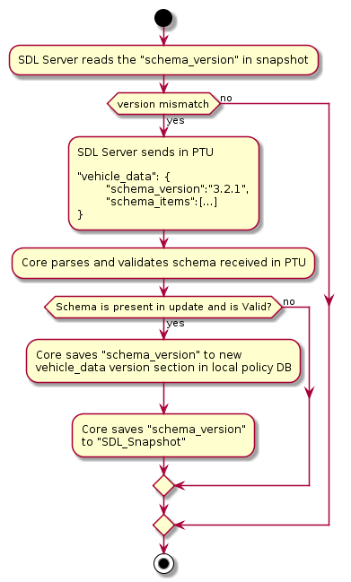

# Read Generic Network Signal data

* Proposal: [SDL-0173](0173-Read-Generic-Network-Signal-data.md)
* Author: [Ankur Tiwari](https://github.com/ATIWARI9)
* Status: **Accepted with Revisions**
* Impacted Platforms: [Core / iOS / Android / RPC / SDL Server / SHAID]

## Introduction

This proposal is to make vehicle data APIs (GetVehicleData/SubscribeVehicleData/UnsubscribeVehicleData/OnVehicleData) more flexible to allow additional new vehicle data items, while maintaining the security access via policies.

## Motivation

* Vehicles are getting more capable now than ever with advanced sensors and connectivity options. This generates tremendous amount of usable data for mobile apps in connectivity and mobility solutions domain. In order to keep up with varying demand and changing trends, SDL needs to be able to upscale with access to new vehicle data parameters without having to wait for a lengthy software build cycle for head units.
* Right now, we have a finite set of vehicle data params, even though the underlying implementation at head unit side can potentially provide more than currently defined in API. With this new implementation, we can tap in to that potential and can get access to more vehicle data elements, as it would be possible to read all the available vehicle data.

## Proposed solution

#### Definitions for terms used in proposal:
* OEM Network Mapping: This file refers to key value pairs that the OEM module will use to retrieve vehicle data off its network
* OEM Network Mapping version: Version variable for OEM Network Mapping table located in `module_config` -> `endpoint_properties`
* Vehicle Data Schema: This is a JSON object that contains vehicle data definitions for both requests and responses that can be sent using

Solution is to replace the way vehicle data items are validated for _GetVehicleData/SubscribeVehicleData/UnsubscribeVehicleData/OnVehicleData_ APIs. 

Instead of validating vehicle data items against APIs XML, SDL core would rely on a dedicated vehicle data items schema as below:
```
{
	"name":"VehicleDataItem",
	"type":"SDLDataType",
	"key":"OEMDataRef",
	"array":true/false,
	"mandatory":true/false,
	"params":"StructParams",
	"since":"X.x",
	"until":"X.x",
	"removed":true/false,
	"deprecated":true/false,	
	"minvalue":xx,
	"maxvalue":xx,
	"minsize":xx,
	"maxsize":xx,
	"minlength":xx,
	"maxlength":xx
}
```
* VehicleDataItem - is the vehicle data item in question. e.g. gps, speed etc. SDL core would use this as the vehicle data param for requests from the app and to validate policies permissions.
* SDLDataType - is the return data type of the vehicle data item. It can be a generic SDL data type e.g. integer, string, float, etc. OR an enumeration defined in APIs XML. For the vehicle data item that has sub-params, this would be struct.
* OEMDataRef - is a reference for the OEM Network Mapping table which defines signal attributes for this vehicle data items. OEMs may use this table to differentiate between various vehicle and SW configurations. SDL core will pass along this reference to HMI, and then HMI would be responsible to resolve this reference using the OEM Network Mapping table.

* _array_ : To speciify if the vehicle data item/param response is an array.
* _mandatory_ : To specify if the vehicle data param is mandatory to be included in response for overall vehicle data item.
* _name_ is required for top level vehicle data items while _dataType_, _reference_ & _mandatory_ are required fields for vehicle data & sub-params. However _array_ can be omitted, If omitted, _array_ defaults to *false*.
* _params_ is recursive array of sub-params for a vehicle data, see example below for structure definition.
* _since_, _until_ are String values and are optional per vehicle data item. _removed_, _deprecated_ are Boolean values and are optional per vehicle data item. _minvalue_, _maxvalue_, _minsize_, _maxsize_, _minlength_, _maxlength_ are Integer values and are optional per vehicle data item.
  * _Custom/OEM Specific_ vehicle data parameters that are not a part of the rpc spec should not have any version related tags included (since, until, removed, deprecated), these vehicle data parameters would not be able to have the same versioning system as the rpc spec since any version number supplied would not be the version associated with any known public rpc spec.

The proposed Policy Table structure assumes that SDL core enums are defined in the RPC Spec and are _not_ defined within the Policy Table.


### Vehicle Data Schema file location and updates
A base JSON schema file for SDL core will be kept locally and an additional one in the OEM cloud. OEMs can update the schema file with OEM specific items, which SDL core would be able to download over the cloud along with policy updates. Proxy would still follow the RPC spec to request vehicle data items.

Standard RPCs found in the RPC spec will need to be included in the vehicle data schema used by Core, so that if the RPC Spec is updated with a new vehicle data item, the old schema with OEM-specific vehicle data items can be updated to use the new version of the defintions of those vehicle data items as added in the RPC Spec. This will allow Core to dynamically add new vehicle data items as they become available for all apps using the accepted, standard vehicle data items. Therefore, the schema will be part of preloaded and updated schema Core uses, however the mobile side will not need this schema as the libraries will always implement the latest agreed upon vehicle data items.

For OEM specific additional items, the OEM app would process a generic _Object_ returned by proxy to retrieve vehicle data item response _struct_. This new design would ensure flexibility to add OEM specific vehicle data items while maintaining access control via policies the same way it is done currently.

* OEM's schema file should always be baselined with latest version of standardized schema file from open SDL. OEMs can then further add OEM specific custom vehicle data items. This ensures that any version of core that implements this proposal would be able to process the latest version of standardized vehicle data item schema, and hence would be able to support all future additions for new standardized vehicle data items.
* VehicleData item availability and definitions in the official SDL RPC Spec will always take precedence over custom ("proprietary") parameters.
* VehicleData items in the official SDL RPC Spec are immutable and therefore cannot be extended with proprietary data.
* All VehicleData items must be defined in the Policy Table (not just the custom/proprietary items), per recommendation by PM's Core team.
* Root-Level vehicle data type items such as `rpm` are always `mandatory`:`false` as defined by the RPC Spec for the vehicle data RPCs. If a data item is of type `Struct`, that struct can have mandatory parameters but the struct itself cannot be mandatory for the root-level item.

#### Use cases for vehicle data schema update:
This section defines SDL core behavior in case `schema_items` is not present in PTU or if data in schema does not match with RPC spec. So if in a PTU:
* `schema_items` key does not exist, do not update `schema_items` local schema/items.
* `schema_items` exists, replace all local schema vehicle data items with new ones except the ones defined in RPC spec.
* `schema_items` exists but is empty, remove all local schema vehicle data items except the ones defined in RPC spec.
* `schema_items` has item with same name as one of the vehicle data items defined in RPC spec, ignore those data items.


#### Versioning for Vehicle Data Schema
Since vehicle data schema will be downloaded as part of policy update, we should not send this data with every update when there is no change in schema. One solution could be that we include the schema in sdl_snapshot when requesting policy update, but that again does not solve the issue as snapshot gets large this way.

Solution to this is to include a schema versioning. This version information will be sent along with PTU when schema update is sent to module in PTU and SDL core will persist this value in local policy DB. sdl_snapshot will contain this schema version information when requesting the policy update. Policy server would then compare the schema version received from cloud with what is available on server. Based on this comparison, vehicle data schema update would be sent in policy update response. e.g.

```
"schema_version":"00.00.01",
```

#### Versioning and endpoint for OEM Network Mapping table and to provide HMI a way to read OEM Network Mapping table version

OEM Network Mapping table version would be included in PTU, which SDL core will persist in local policy DB. HMI needs to be able to read this value on demand so that it can control if and when to download the OEM Network Mapping table. HMI will utilize the _endpoint_ for OEM Network Mapping table file to download this file using _SystemRequest_ `requestType` _OEM_SPECIFIC_ and  `requestSubType` _VEHICLE_DATA_MAPPING_. OEM Network Mapping table file would have _endpoint_ key (_service_) as _custom_vehicle_data_mapping_url_.

Example for OEM Network Mapping table file `endpoint` and `version` in PTU, please note that `module_config` has a new object called `endpoint_properties`:
```
{  
   "module_config":{  
      "full_app_id_supported":true,
      "exchange_after_x_ignition_cycles":100,
      "exchange_after_x_kilometers":1800,
      "exchange_after_x_days":30,
      "timeout_after_x_seconds":60,
      "seconds_between_retries":[  
         1,
         5,
         25,
         125,
         625
      ],
      "endpoints":{  
         "0x07":{  
            "default":[  
               "http://192.168.1.143:3001/api/v1/staging/policy"
            ]
         },
         "0x04":{  
            "default":[  
               "http://localhost:3000/api/1/softwareUpdate"
            ]
         },
         "queryAppsUrl":{  
            "default":[  
               "http://localhost:3000/api/1/queryApps"
            ]
         },
         "lock_screen_icon_url":{  
            "default":[  
               "https://i.imgur.com/TgkvOIZ.png"
            ]
         },
         "custom_vehicle_data_mapping_url":{  
            "default":[  
               "http://localhost:3000/api/1/vehicleDataMap"
            ]
         }
      },
      "endpoint_properties":{  
         "custom_vehicle_data_mapping_url":{  
            "version":"0.1.2"
         }
      },
      "notifications_per_minute_by_priority":{  
         "EMERGENCY":60,
         "NAVIGATION":15,
         "VOICECOM":20,
         "COMMUNICATION":6,
         "NORMAL":4,
         "NONE":0
      }
   }
}
```

SDL core still needs to provide an API for HMI to read this value. We can do so by adding a new API (`GetPolicyConfigurationData`) to read OEM Network Mapping file version; we can make it generic so that it can also be used in the future to read some other configuration params from policy. e.g. following new API can be used to read OEM Network Mapping table version from `module_config` -> `endpoint_properties` for `custom_vehicle_data_mapping_url`

```
<function name="GetPolicyConfigurationData" messagetype="request" scope="internal">
	<description>Request from HMI to SDL Core to get policy configuration data (i.e. OEM mapping table file version etc.) from Policy Table.</description>
	<param name="policyType" type="String" maxlength="1000" minlength="1" mandatory="true">
		<description>Name of the Struct from where configuration data to be received according to Policy Table types i.e. module_config etc.</description>
	</param>  
	<param name="property" type="String" maxlength="1000" minlength="1" mandatory="true">
		<description>Name of the variable for which the configuration data to be received according to Policy Table types i.e. vehicle_year etc.</description>
	</param>  
</function>
<function name="GetPolicyConfigurationData" messagetype="response">
	<param name="value" type="String" array="true" minsize="1" maxsize="100" mandatory="false">
		<description>Value of requested property from policyType in PT. If no value is found in PT for specified policyType and property, core should respond to HMI with DATA_NOT_AVAILABLE. maxlength of the value parameter is system dependent.</description>
	</param>
</function>
```

This API can also be extended to be used for future configuration items as well and also can replace current `GetURLS` method. So we can actually deprecate `GetURLs` such that HMI_API.xml would **remove** following:

```
<function name="GetURLS" messagetype="request" scope="internal">
	<description>Sent by system to SDL to get list of URL for specified service type and optionally policy's application id.</description>
	<param name="service" type="Integer" minvalue="0" maxvalue="100" mandatory="true"/>
</function>
<function name="GetURLS" messagetype="response" scope="internal">
	<param name="urls" type="Common.ServiceInfo" array="true" mandatory="false" minsize="1" maxsize="100"/>
</function>
```


Here is the flow diagram for OEM Network Mapping table download:


* HMI sends _GetPolicyConfigurationData_ request to core to read OEM Network Mapping version from `module_config` -> `endpoint_properties`
* Core responds with available `endpoint_properties`
* HMI parses the `version` for `custom_vehicle_data_mapping_url` and compares that with `version` of local copy of OEM Network Mapping table file and decides if OEM Network Mapping table needs to be updated
* HMI sends _GetPolicyConfigurationData_ request to core to read `url` from `endpoint` object for OEM Network Mapping table
* Core responds with `endpoints` and HMI parses the `url` for `service` _custom_vehicle_data_mapping_url_
* HMI sends _onSystemRequest_ with `requestType` _OEM_SPECIFIC_ and  `requestSubType` _VEHICLE_DATA_MAPPING_ to core which core forwards to Mobile app (via proxy)
* Mobile app downloads the OEM Network Mapping table and sends to core as bulk data in _SystemRequest_ `requestType` _OEM_SPECIFIC_ and  `requestSubType` _VEHICLE_DATA_MAPPING_ which core forwards to HMI

##### Rules for OEM Network Mapping table and Vehicle Data Schema versioning:
* These two variables (`endpoint_properties`->`custom_vehicle_data_mapping_url`->`version` & `vehicle_data`->`schema_version`) would be fed by policy server to module during PTU. OEM Network Mapping version would always be included in a PTU, unlike `schema_items` and `schema_version`, which would only be present if there is a change/update in vehicle data items.
* SDL core would need to include `schema_version` in sdl_snapshot while requesting the policy update. SDL server would use this to decide whether `schema_items` schema needs to be pushed in PTU response.
* `schema_version` would only be included in `vehicle_data` only if `schema_items` schema is included.
* SDL core should skip the `schema_items` update in case `schema_version` is not included along with it.
* SDL core would need to provide a way for HMI to read OEM Network Mapping version using `GetPolicyConfigurationData` so that HMI can decide whether or not to request OEM Network Mapping file download using the _endpoint_ mentioned in PTU for the OEM table mapping file, using _SystemRequest_ `requestType` _OEM_SPECIFIC_ and  `requestSubType` _VEHICLE_DATA_MAPPING_.

Here is the flow diagram SDL server and core need to follow:


* `version mismatch` decision box simply checks if `schema_version` received in snapshot equals to `schema_version` available at server side.

### Example of sample schema addition to policy table for SDL core update:
```json
....
	"BaseBeforeDataConsent"
        ]
      }
    },
	"vehicle_data":{		
		"schema_version":"00.00.01",	
		"schema_items":
		[
			{
				"name":"rpm",
				"type":"Integer",
				"key":"OEM_REF_RPM",
				"array":false,
				"mandatory":false,
				"minvalue":"0",
				"maxvalue":"20000",
				"params":[]
			},
			{
				"name":"headLampStatus",
				"type":"Struct",
				"key":"OEM_REF_HLSTATUS",
				"mandatory":false,
				"params":[
					{
						"name":"ambientLightSensorStatus",
						"type":"AmbientLightStatus",
						"key":"OEM_REF_AMB_LIGHT",
						"mandatory":false,
						"params":[]
					},				
					{
						"name":"highBeamsOn",
						"type":"Boolean",
						"key":"OEM_REF_HIGH_BEAM",
						"mandatory":true,
						"params":[]
					},
					{
						"name":"lowBeamsOn",
						"type":"Boolean",
						"key":"OEM_REF_LOW_BEAM",
						"mandatory":true,
						"params":[]
					}				
				]
			},
			{
				"name":"engineState",
				"type":"Struct",
				"key":"OEM_REF_STRUCT",
				"mandatory":false,
				"params":[
					{
						"name":"engineCoolantTemp",
						"type":"Integer",
						"key":"OEM_REF_ENG_COOL_TEMP",
						"array":false,
						"mandatory":true,
						"params":[]
					},
					{
						"name":"engineO2Sat",
						"type":"Float",
						"key":"OEM_REF_ENG_O2_SAT",				
						"mandatory":true,
						"params":[]
					},
					{
						"name":"engineState",
						"type":"String",
						"key":"OEM_REF_ENG_STATE",
						"mandatory":true,
						"params":[]
					},
					{
						"name":"engineServiceRequired",
						"type":"Boolean",
						"key":"OEM_REF_ENG_SER_REQ",
						"array":false,
						"mandatory":false,
						"params":[]
					}
				]
			},
			{
				"name":"messageName",
				"type":"String",
				"key":"OEM_REF_MSG",
				"array":true,
				"mandatory":false,
				"since":"X.x",
				"maxsize":100,
				"params":[]
			}
		]
	}
....
```
#### Integer, Float, String can use the common range values defined in HMI/Mobile API

### Vehicle data items can be arranged in structures. See below example for existing vehicle data item _rpm_

Sample Value for map:
```json
{
	"name":"rpm",
	"type":"Integer",
	"key":"OEM_REF_RPM",
	"array":false,
	"mandatory":false,
	"minvalue":"0",
	"maxvalue":"20000",
	"params":[]
}
```
Sample response from module:
```json
{
	"rpm":844
}
```
Structure in API:
```
<param name="rpm" type="Integer" minvalue="0" maxvalue="20000" mandatory="false">
	<description>The number of revolutions per minute of the engine</description>
</param>
```
* Structure defines the data type as Integer and a reference as OEM_REF_RPM
* OEM_REF_RPM (or a more suitable nomenclature)
  * This acts as a key for OEM side mapping to signal information associated with RPM. 
  * The mapping table for this reference is purely on the OEM side. OEMs may choose to implement it on the HMI layer, fetch it over the cloud or both.
  * Mapping table defines OEM specific encoding for various identifier attributes, SW versions & configurations as needed, e.g.:
    * OEM_REF_RPM :: hev#veh_actl_spd#veh_status_msg#HS3#500ms
    * OR a JSON sub structure in table. Again, it is up to OEM to decide and implement
* HMI sends response as integer for RPM

### For complex data items, a substructure is provided as shown in below example for _headLampStatus_:

Sample Value for map:
```json
{
	"name":"headLampStatus",
	"type":"Struct",
	"key":"OEM_REF_HLSTATUS",
	"mandatory":false,
	"params":[
		{
			"name":"ambientLightSensorStatus",
			"type":"AmbientLightStatus",
			"key":"OEM_REF_AMB_LIGHT",
			"mandatory":false,
			"params":[]
		},				
		{
			"name":"highBeamsOn",
			"type":"Boolean",
			"key":"OEM_REF_HIGH_BEAM",
			"mandatory":true,
			"params":[]
		},
		{
			"name":"lowBeamsOn",
			"type":"Boolean",
			"key":"OEM_REF_LOW_BEAM",
			"mandatory":true,
			"params":[]
		}				
	]
}
```
Sample Response from module:
```json
{
	"headLampStatus":{
		"ambientLightSensorStatus":"NIGHT",
		"highBeamsOn":false,
		"lowBeamsOn":true
   }
}
```
Structure in API:
```
<struct name="HeadLampStatus">
	<param name="lowBeamsOn" type="Boolean" mandatory="true">
		<description>Status of the low beam lamps.  References signal "HeadLampLoActv_B_Stat".</description>
	</param>
	<param name="highBeamsOn" type="Boolean" mandatory="true">
		<description>Status of the high beam lamps.  References signal "HeadLghtHiOn_B_Stat".</description>
	</param>
	<param name="ambientLightSensorStatus" type="AmbientLightStatus" mandatory="false">
		<description>Status of the ambient light sensor.</description>
	</param>
</struct>

    
<enum name="AmbientLightStatus">
	<description>Reflects the status of the ambient light sensor.</description>
	<element name="NIGHT" />
	<element name="TWILIGHT_1" />
	<element name="TWILIGHT_2" />
	<element name="TWILIGHT_3" />
	<element name="TWILIGHT_4" />
	<element name="DAY" />
	<element name="UNKNOWN" internal_name="ALS_UNKNOWN" />
	<element name="INVALID" />
</enum> 

```

* There are 3 sub items, “ambientLightSensorStatus”, “highBeamsOn” and “lowBeamsOn”. Each of these individual data types and references
* Note that “ambientLightSensorStatus” has data type as “AmbientLightStatus”. This enumeration is read from the existing Mobile API.
  * This can be extrapolated to all existing data types. For new data types enumerations, we’d still either need to add to Mobile API or create a new structure for vehicle data enumerations.

### Next example touches on a *new* OEM specific vehicle data item, _engineState_

Sample value for map:
```json
{
	"name":"engineState",
	"type":"Struct",
	"key":"OEM_REF_STRUCT",
	"mandatory":false,
	"params":[
		{
			"name":"engineCoolantTemp",
			"type":"Integer",
			"key":"OEM_REF_ENG_COOL_TEMP",
			"array":false,
			"mandatory":true,
			"params":[]
		},
		{
			"name":"engineO2Sat",
			"type":"Float",
			"key":"OEM_REF_ENG_O2_SAT",				
			"mandatory":true,
			"params":[]
		},
		{
			"name":"engineState",
			"type":"String",
			"key":"OEM_REF_ENG_STATE",
			"mandatory":true,
			"params":[]
		},
		{
			"name":"engineServiceRequired",
			"type":"Boolean",
			"key":"OEM_REF_ENG_SER_REQ",
			"array":false,
			"mandatory":false,
			"params":[]
		}
	]
}
```
Sample response from module:
```json
{
	"engineState": {
		"engineCoolantTemp":140,
		"engineO2Sat":95.5,
		"engineState":"NORMAL",
		"engineServiceRequired":false
	}
}
```
#### engineState would ideally be an enum if it was a Standardized data type. But since this it OEM example of vehicle data on the fly, we can use String data type.

* _engineState_ would need to be added to SDL core Vehicle Data Schema. Once the new schema is downloaded by core, an app may request _engineState_ vehicle data item.
* This shows the capability to add a new vehicle data item, which OEMs can utilize to update the file on the cloud. SDL core can get updates on this files along with PT updates, thus new vehicle data would be able to be processed.
* Again, each sub items have individual data types and references. So as long as the OEM updates the reference file, mobile apps can access the new data.

### Also, this approach can also be used to read entire 8 bytes CAN message itself

Sample value for map:
```json
{
	"name":"messageName",
	"type":"String",
	"key":"OEM_REF_MSG",
	"array":true,
	"mandatory":false,
	"since":"X.x",
	"maxsize":100,
	"params":[]
}
```
Sample response from module:
```json
{
	"messageName": "AB 04 D1 9E 84 5C B8 22"
}
```
* The Data type is the string so that it can accommodate a byte string for CAN message. OEM_REF_MSG points to a message definition in the OEM Network Mapping table.
* _since_ param would be used only if this vehicle data is converted to standardized type in open.


### SDL core<->HMI request structure for Get/Subscribe vehicle data

In case of VehicleDataItems defined in API, SDL core should send to HMI 'dataItemName : true' of item according to HMI_API.
HMI should work as is to provide response on such request. 

In case of VehicleData Items from schema, SDL core should provide hierarchical structure description of vehicle data item.

We propose to send schema VehicleData Items with following structure :
```
{
	"dataItemKey" : // Struct with parameters 
}
```

Here is an example for "headLampStatus"

#### HMI request response approach for vehicle data item present in API:

##### Request: 
```json
{
	"headLampStatus" : "true"	
}
```

##### Response: 
```json
{
	"headLampStatus" : {
		"lowBeamsOn" : true,
		"highBeamsOn" : true,
		"ambientLightSensorStatus" : "TWILIGHT_1"
	}
}
```

#### To highlight the difference, let's consider headLampStatus as vehicle data item from schema instead of from API  : 


##### Request:
```json
{
	"HEAD_LAMP_STATUS" : {
		"LOW_BEAMS_ON" : "true",
		"HIGH_BEAMS_ON" : "true",
		"AMBIENT_LIGHT_SENSOR_STATUS" : "true"
	}
}
```

##### Response:
```json
{
	"HEAD_LAMP_STATUS" : {
		"LOW_BEAMS_ON" : true,
		"HIGH_BEAMS_ON" : true,
		"AMBIENT_LIGHT_SENSOR_STATUS" : "TWILIGHT_1"
	}
}
```

Note that in request SDL core provided list of nested "keys" of structure. 

#### Example of structure with 3 nested levels.

##### Request: 
```json
{
	"KEY_LEVEL_1" : {
		"KEY_LEVEL_2" : "true",
		"KEY2_LEVEL_2" : {
			"KEY2_LEVEL_3" : "true"
		}
	}
}
```

##### Request: 
```json
{
	"KEY_LEVEL_1" : {
		"KEY_LEVEL_2" : "value of key level 2",
		"KEY2_LEVEL_2" : {
			"KEY2_LEVEL_3" : "value of key level 3"
		}
	}
}
```
#### Backward compatibility 

Such approach is backward compatible. This also provides ability to send vehicle data items present in API and vehicle data items present in schema in one request.

#### Mix example 

Consider **gps** as API vehicle data Item, and **HEAD_LAMP_STATUS** as vehicle data item from schema: 

##### Request:
```json
{
	"gps" : "true", 
	"HEAD_LAMP_STATUS" : {
		"LOW_BEAMS_ON" : "true",
		"HIGH_BEAMS_ON" : "true",
		"AMBIENT_LIGHT_SENSOR_STATUS" : "true"
	}
}
```

##### Response: 

```json
{
	"gps" : {
		"longtitudeDegrees" : 0.0,
		"latitudeDegrees" : 0.0
	},
	"HEAD_LAMP_STATUS" : {
		"LOW_BEAMS_ON" : true,
		"HIGH_BEAMS_ON" : true,
		"AMBIENT_LIGHT_SENSOR_STATUS" : "TWILIGHT_1"
	}
}
```

#### Rules for SDL core<->HMI structure for requests and responses

- HMI should consider parameter in GVD request as name in case if it exists in list HMI_API.xml GetVehicleData of parameters.
- HMI should consider parameter in GVD request as key if it is not in list of HMI_API.xml GetVehicleData of parameters.
- _name_ is always boolean (according to API)
- _key_ in GVD request may be either boolean or struct. Struct may contain either booleans or structs. 
- Response type for vehicle data items from schema would be _VehicleDataResult_
- If HMI responds to SDL core with wrong item schema for GVD, SDL core will not process this response and respond to mobile with GENERIC_ERROR
- If HMI sends to SDL core _OnVehicleData_ Notification with wrong item schema, SDL core will ignore this notification.
- In case of UnsubscribeVehicleData, SDL core will send only root level **key**.

Here is a sample flow diagram for SDL Core <-> HMI request response model:


#### API changes required for custom vehicle data:

- VehicleDataResult in MOBILE API will be extended with non mandatory parameter `oemCustomDataType` 

```
   <struct name="VehicleDataResult" since="2.0">
        <description>Individual published data request result</description>
        <param name="dataType" type="VehicleDataType" mandatory="true">
            <description>Defined published data element type.</description>
        </param>
        <param name="resultCode" type="VehicleDataResultCode" mandatory="true">
            <description>Published data result code.</description>
        </param>
+        <param name="oemCustomDataType" type="String" mandatory="false" since="6.0">
+            <description>Type of requested OEM specific parameter </description>
+        </param>
    </struct>
```


`VehicleDataResult` in MOBILE API will be extended with non mandatory parameter `oemCustomDataType`

`VehicleDataType` will be extended with `VEHICLEDATA_OEM_CUSTOM_DATA` value in HMI and MOBILE APIs.
```
 <enum name="VehicleDataType" since="2.0">
        <description>Defines the data types that can be published and subscribed to.</description>
        <element name="VEHICLEDATA_GPS">
        ...
        <element name="VEHICLEDATA_CLOUDAPPVEHICLEID" since="5.1"/>
 +       <element name="VEHICLEDATA_OEM_CUSTOM_DATA" since="6.0"/>
 </enum>
```


For oem specific custom vehicle data items, `oemCustomDataType` will contain type of OEM specific vehicle data (from schema), and `dataType` will be `VEHICLEDATA_OEM_CUSTOM_DATA`.
For vehicle data items from RPCSpec, `oemCustomDataType` will be omitted, and `dataType` will contain appropriate data type from `VehicleDataType` enum.

## Proxy side changes
Once core has downloaded and processed the new vehicle data params, it'd send an _onPermissionsChange_ notification to the connected app with new vehicle data params. The App developer would rely on this notification to request new vehicle data items using a generic request/response methods in _GetVehicleData/SubscribeVehicleData/UnsubscribeVehicleData/OnVehicleData_ request and response messages.

### Add getter and setter for generic vehicle data in GetVehicleData/SubscribeVehicleData/UnsubscribeVehicleData:
```
public void setOEMCustomVehicleData (String vehicleDataName, Boolean vehicleDataState){
	setParameters(vehicleDataName, vehicleDataState);
}

public Boolean getOEMCustomVehicleData (String vehicleDataName){
	return getBoolean(vehicleDataName);
}
```

### Add getter and setter for generic vehicle data in SubscribeVehicleDataResponse/UnsubscribeVehicleDataResponse:
```
public void setOEMCustomVehicleData (String vehicleDataName, VehicleDataResult vehicleDataState){
	setParameters(vehicleDataName, vehicleDataState);
}

public VehicleDataResult getOEMCustomVehicleData (String vehicleDataName){
	return (VehicleDataResult) getObject(VehicleDataResult.class, vehicleDataName);
}
```

### Update VehicleDataResult to support custom vehicle data items by adding:
```
public static final String KEY_CUSTOM_DATA_TYPE = "oemCustomDataType";

public VehicleDataResult(String oemCustomDataType, @NonNull VehicleDataResultCode resultCode){
	this();
	setOEMCustomVehicleDataType(oemCustomDataType);
	setResultCode(resultCode);
}
	
public void setOEMCustomVehicleDataType(String oemCustomDataType) {
	setValue(KEY_OEM_CUSTOM_DATA_TYPE, oemCustomDataType);
}

public String getOEMCustomVehicleDataType() {
	return (String) getObject(String.class, KEY_CUSTOM_DATA_TYPE);
}
```

### Add getter and setter for generic vehicle data in GetVehicleDataResponse/OnVehicleData:
```
public void setOEMCustomVehicleData (String vehicleDataName, Object vehicleDataState){
	setParameters(vehicleDataName, vehicleDataState);
}

public Object getOEMCustomVehicleData (String vehicleDataName){
	return getParameters(vehicleDataName);
}
```

It'd be the app's responsibility to map the vehicle data object to the corresponding vehicle data struct. Struct definition would be provided by the OEM to the OEM app. This solution is acceptable only for OEM apps since the intent is to provide quick access to the OEM specific vehicle data to **OEM ONLY** apps. Due to the need of additional processing on the OEM app side, this approach discourages OEMs to use it for other vehicle data items which other app partners would want to utilize as well. In order to provide getter/setter specifics to new vehicle data items, it'd still need to be added to SDL core and proxy as a static data entry, which in turn would be beneficial for the project's evolution.

## SDL_Server side changes

Required SHAID additions:

* Conversion and transfer of full RPC Spec VehicleData parameters and enums into SHAID's database
* New/updated API endpoint(s) for synchronization of the VehicleData parameters and enums to instances of Policy Server and new object called `endpoint_properties` in `module_config`

```
{  
   "module_config":{  
      "full_app_id_supported":true,
      "exchange_after_x_ignition_cycles":100,
      "exchange_after_x_kilometers":1800,
      "exchange_after_x_days":30,
      "timeout_after_x_seconds":60,
      "seconds_between_retries":[  
         1,
         5,
         25,
         125,
         625
      ],
      "endpoints":{  
         "0x07":{  
            "default":[  
               "http://192.168.1.143:3001/api/v1/staging/policy"
            ]
         },
         "0x04":{  
            "default":[  
               "http://localhost:3000/api/1/softwareUpdate"
            ]
         },
         "queryAppsUrl":{  
            "default":[  
               "http://localhost:3000/api/1/queryApps"
            ]
         },
         "lock_screen_icon_url":{  
            "default":[  
               "https://i.imgur.com/TgkvOIZ.png"
            ]
         },
         "custom_vehicle_data_mapping_url":{  
            "default":[  
               "http://localhost:3000/api/1/vehicleDataMap"
            ]
         }
      },
      "endpoint_properties":{  
         "custom_vehicle_data_mapping_url":{  
            "version":"0.1.2"
         }
      },
      "notifications_per_minute_by_priority":{  
         "EMERGENCY":60,
         "NAVIGATION":15,
         "VOICECOM":20,
         "COMMUNICATION":6,
         "NORMAL":4,
         "NONE":0
      }
   }
}
```

Required Policy Server additions:

* Enhanced synchronization logic to retrieve standard VehicleData parameters and enums from SHAID
* New interface to create, update, and delete custom VehicleData parameters
* Modified interface to create "Proprietary Functional Groups" with associated RPCs and custom VehicleData parameters
* Ability to manually grant zero-to-many "Proprietary Functional Groups" to an application during application review. (Note: auto app approval will not grant any Proprietary Functional Groups)
* Injection of VehicleData parameters into the generated Policy Table
* SDL Server would need to compare the version received from sdl_snapshot before serving schema update
* SDL Server needs to add a new UI field on "Module Config" tab "Endpoints" to allow and OEM to add `url` for OEM Network Mapping table file.
* OEM Network Mapping table file will be hosted by OEM and there is no plan for an SDL supported sample of that project that would serve up all those different OEM Network Mapping table file
* If OEM fails to update endpoint URL for OEM Network Mapping file, SDL server will NOT serve that endpoint in PTU.

Note: PTU for app permissions/functional groups would add new vehicle data items in a similar way as current vehicle data items are handled. In given example, _engineState_ would be added along with _rpm_, _headLampStatus_ etc. Of-course OEM can have different combinations of functional-groups and vehicle data items per app.


## Impact on existing code
* SDL core would need to add support to download and parse the new JSON schema for vehicle data. The interface between SDL core and HMI needs to be updated while passing _GetVehicleData/SubscribeVehicleData/UnsubscribeVehicleData/OnVehicleData_ requests to include return data type and reference keys.
* _GetVehicleData/SubscribeVehicleData/UnsubscribeVehicleData/OnVehicleData_ APIs need to be updated at [proxy side](#proxy-side-changes).
* SDL core would need to implement new API(`GetPolicyConfigurationData`) which HMI would use to read OEM Network Mapping table version and endpoint `url`. This API replaces `GetURLS` API, hence `GetURLS` API would be removed.
* SDL core would need to add new endpoint `custom_vehicle_data_mapping_url` and update core's policy classes and table to support the parsing, setting, and retrieving of a new module config field `endpoint_properties`.
* SDL core would need to create new tables to persist `schema_items` and `schema_version` in policy DB. New table names:
  * `vehicle_data_items_definitions`
  * `vehicle_data_item_parameters`
  * `vehicle_data`
* SDL core would need to add `schema_version` to sdl_snapshot
* SDL Server project needs updates as defined above.
* SDL core would need to modify message validation process to check for known parameters in the vehicle data schema if validation fails against the RPC Spec.
* SDL core would need to modify the PTU process to parse the vehicle data schema items.


## Alternatives considered
* Instead of adding new API to read OEM Network Mapping table version, we can reuse existing API:
  * API _GetUserFriendlyMessage_ with _messageCodes_ as OEM Network Mapping version and any language.
* Instead of using JSON to define vehicle data items schema, SDL core can use either of following:
  * XML:
    * This would reuse the XML based design with adding "key" as another attribute or as a sub-element. Instead of sending a JSON file from cloud to the headunit, SDL core would send a XML file that would be like a subset of the mobile API. 
    * But this would need changes on the policy table server side as the policy server is configured to serve JSON as part of policy table update.
  * Precompiled library plug-ins:
    * Another idea is to automatically generate code and compile this code into a dynamic link library. Instead of sending a JSON or XML file, this library would be transferred to headunit as part of policy update or OTA. Core would load this library and execute this library for vehicle data.
    * But this might cause overhead to maintain and support dlls for multiple Operating Systems.
* Check history of this proposal for _GetGenericNetworkData_ submitted originally.

