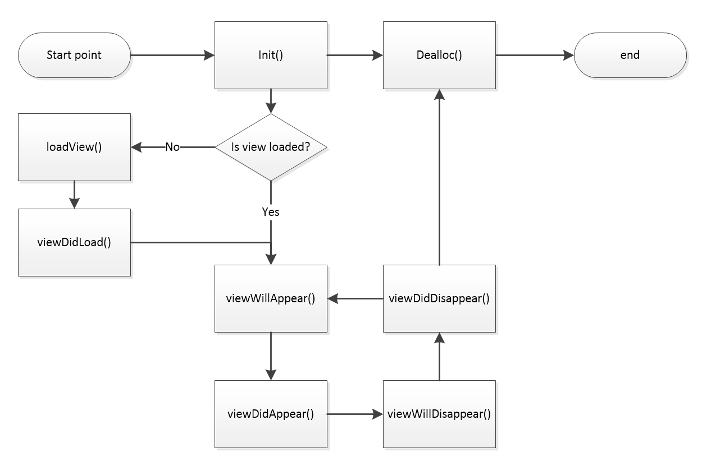

# High level interface: Views and Controllers

* Proposal: [SDL-0176](0176-high-level-interface-views-and-controllers.md)
* Author: [Kujtim Shala](https://github.com/kshala-ford)
* Status: **Returned for Revisions**
* Impacted Platforms: [ iOS ]

## Introduction

This proposal is based on [SDL 0156 High level interface: Foundation](https://github.com/smartdevicelink/sdl_evolution/blob/master/proposals/0156-high-level-interface-foundation.md) adding views and view controllers to the high level interface. It proposes a solution to mimic the UI framework of the native OS SDKs.

## Motivation

In order to work with SDL, app developers need to learn a new API which mostly doesn't adopt familiar patterns. Including but not limited to 
- read best practices and implement proxy lifecycle (Android above all)
- the use of RPCs and handle notifications, requests and responses
- manually manage concurrent and sequential operations (e.g. image upload)

The time for an app developer to learn SDL (non-productive time) is high and not accepted by some developers. The SDL iOS library already improves the current situation by abstracting painful implementations. However the management layer is still unfamiliar and causes a high learning curve.

## Proposed solution

This proposal is about adding views and view controllers to the SDL library which should be used by the `SDLApplication` (see [SDL 0156](https://github.com/smartdevicelink/sdl_evolution/blob/master/proposals/0156-high-level-interface-foundation.md)). With view controllers app developers can separate and structure the SDL related code.

### View Controller lifecycle

Based on the MVC pattern used by UIKit the high level interface should introduce the SDL view controller in order to manage and control views. App developers need to subclass the base view controller class and implement the use cases.

A view controller can exist in a set of states. Below flow shows the possible transitions between loading view, view to appear or to disappear.



#### `Init`

View controllers are instantiated when they are pushed to the view controller manager (see subsection *ViewControllerManager* below). For the root view controller it would be instantiated once a connection is established to the head unit (app is registered). In this state there is no view loaded. The app developer should not load data or perform other memory/time intense code at this time.

#### `loadView`

In case the view controller appears on the screen but does not have a loaded view the method `loadView` is called. By default `SDLViewController` implements the method placing a plain view to the view controller's view property. The app developer can override the method in order to do custom actions right before the view is created. The default implementation should be fine for most partners.

This method is following [`UIViewController.loadView`](https://developer.apple.com/documentation/uikit/uiviewcontroller/1621454-loadview?language=objc)

#### `viewDidLoad`

The view controller is notified that the view did load through this method. The app developer can override this method in order to create the view hierarchy, load data sources and apply assets to the views.

#### `viewWillAppear`

Whenever a view controller's view should become visible on the head unit the view controller will be notified that the view will appear. Reasons to appear on the head unit are:
1. The app is launched by the user (entered HMI_LIMITED or HMI_FULL). The root view controller will appear.
2. The app has pushed a second view controller to the stack. The second view controller's view will appear after the first view controller's view will disappear.
3. The top view controller was removed from the stack. The underlying view controller's view will appear after the top view controller's view will disappear.

The app developer can override this method in order to manipulate view elements before they are presented on the head unit.

#### `viewDidAppear`

This method is called after `viewWillAppear`.

#### `viewWillDisappear`

Whenever a view is/will not be visible on the head unit anymore the view controller will be notified by `viewWillDisappear`. Reasons for that are:
1. The app entered HMI_NONE or HMI_BACKGROUND. In this case the view already disappeared. Still in order to follow the flow this method should be called.
2. The app has pushed a second view controller to the stack. The first view controller's view will disappear before the second view controller's view will appear.
3. The top view controller was removed from the stack. The top view controller's view will disappear before the underlying view controller's view will appear.

#### `viewDidDisappear`

This method is called after `viewWillDisappear`. 

### SDLViewController

The view controller class is called `SDLViewController`. It's expected that the app developer creates subclasses of this base class. The methods for the lifecycle are realized using a protocol with optional methods. This way the app developer can implement the methods in their subclasses without the need of calling super. `SDLViewController` implements the delegate but not the methods except `loadView`. The color scheme can be explicitly set presenting a view controller. When pushing another view controller to the stack it'll inherit the color scheme if not explicitly set.

```objc
@protocol SDLViewControllerDelegate
@optional
- (void)loadView;
- (void)viewDidLoad;

- (void)viewWillAppear;
- (void)viewDidAppear;

- (void)viewWillDisappear;
- (void)viewDidDisappear;
@end

@interface SDLViewController<SDLViewControllerDelegate>

@property (nonatomic, readonly) BOOL isViewLoaded;

@property (nonatomic) SDLView *view;

@property (nonatomic, copy, null_resettable) SDLPredefinedLayout layout; // resets to DEFAULT if set to nil

@property (nonatomic, copy, nullable) NSString *customLayout;

@property (nonatomic, copy, nullable) SDLTemplateColorScheme *colorScheme;
@property (nonatomic, copy, nullable) SDLTemplateColorScheme *nightColorScheme; 

// if the view controller is contained in a view controller manager's stack this property 
// can be used as a convenient shortcut
@property (nonatomic, weak, nullable, readonly) SDLViewControllerManager *manager;

@end
```

#### `isViewLoaded`

This property will simply return `YES` if the view controller's view is loaded.

#### `view`

The view controller's view. Can be set by the app developer. By default it is set to a plain view by the default implementation of `loadView`.

#### `layout`

The display layout that should be used while the view controller is presented. It can be set to one of the predefined layouts.

#### `customLayout`

In order to support non-predefined layouts (OEM or custom layouts) the app developer can set the name of the custom template.

#### `manager`

A weak reference to the view controller manager object managing the current view controller. It's a convenient property for easy access to present another view controller.

### SDLViewControllerManager

A manager for view controllers should be added and used by the `SDLApplication`. The manager should provide APIs to create and manipulate a stack for view controllers presenting the most top view controller. Similar to the view controller delegate the manager should allow the app to set a delegate to receive view controller lifecycle notifications. 

```objc
@protocol SDLViewControllerManagerDelegate
@optional
- (void)viewControllerDidLoadView:(SDLViewController *)viewController;
- (void)viewControllerWillAppear:(SDLViewController *)viewController;
- (void)viewControllerDidAppear:(SDLViewController *)viewController;
- (void)viewControllerWillDisappear:(SDLViewController *)viewController;
- (void)viewControllerDidDisappear:(SDLViewController *)viewController;
@end

@interface SDLViewControllerManager

@property (nonatomic, nullable, weak) id<SDLViewControllerManagerDelegate> delegate;

@property (nonatomic, copy) NSArray<SDLViewController *> *viewControllers;

@property (nonatomic) SDLViewController *rootViewController;
@property (nonatomic) SDLViewController *topViewController;

// sets and presents the root view controller starting a new stack
- (void)setRootViewController:(SDLViewController *)rootViewController;

// Pushes a new view controller to the stack and presents it
- (void)pushViewController:(SDLViewController *)viewController;

// pops the top view controller from the stack and presents to underlying view controller
- (void)popViewController;

// pops all view controllers from the stack and presents the root view controller
- (void)popToRootViewController;

// pops all view controllers on top of the specified view controller and presents it
- (void)popToViewController:(SDLViewController *)viewController;

@end
```

#### `viewControllers`

This array is used as a stack for view controllers pushed by the app developer. It can be accessed and replaced by the app developer at any time.

#### `topViewController`

The top view controller is the most top from the stack presented on the head unit. This property is pointing to the last view controller of the stack.

#### `rootViewController` and `setRootViewController`

The very first view controller of the stack is returned by `rootViewController`. Settings a new root view controller will clear the stack and set a new root.

#### `pushViewController`

Pushes the specified view controller to the stack and the manager starts presenting it.

#### `popViewController`

Removes the top view controller from the stack and the manager starts presenting the new top view controller.

#### `popToRootViewController`

Removes all view controllers from the stack except the root view controller.

#### `popToViewController`

If the specified view controller exists in the stack the manager removes all view controllers from the stack which are on top of the specified view controller.

### Views

The high level interface introduces three different kind of views: text view, image view and button view. The views of the currently presented view controller will be responsible to manage the screen. Future proposals will add more views to abstract more RPCs.

#### SDLView

```objc
@interface SDLView

@property (nonatomic) NSArray<SDLView *> *subviews;

@end
```

#### SDLTextView

The text view is a view which takes care of any kind of text field modifiable by the `Show` RPC. Main fields are dynamically added (first item used for `mainField1`, second for `mainField2`).

```objc
@interface SDLTextView : SDLView

@property (nonatomic, nullable, copy) SDLTextAlignment textAlignment;

@property (nonatomic, nullable, copy) NSArray<SDLTextField *> *textFields;

@property (nonatomic, nullable, copy) NSString *statusBar;

@property (nonatomic, nullable, copy) NSString *mediaTrack;

@property 

@end

@interface SDLTextField

@property (nonatomic, nonnull, copy) NSString *text;
@property (nonatomic, nullable, copy) NSArray<SDLMetadataType> *metadataTypes;

@end
```

#### SDLImageView

The image view will be used for the primary and secondary graphic in the order added to the view controller's view. The image provided will be automatically scaled depending on the current display layout.

```objc
@interface SDLImageView : SDLView

@properties (nonatomic) SDLArtwork *image;

@end
```

#### SDLButtonView

Every button view added to the view controller's view will be used for the button managers `softButtons` array. If desired the app developer can manage the soft button views in a dedicated subview of type `SDLView`. This view will maintain a private reference to an `SDLSoftButtonObject` object wrapping and bypassing all the initializers, properties and methods. Below is a preview of the `SDLButtonView` class for illustration. The implementation will include *all* the methods etc.

```objc
@interface SDLButtonView : SDLView

@property (copy, nonatomic, readonly) NSString *name;

@property (strong, nonatomic, readonly) NSArray<SDLSoftButtonState *> *states;

@property (copy, nonatomic, readonly) SDLSoftButtonState *currentState;

@property (strong, nonatomic, readonly) SDLSoftButton *currentStateSoftButton;

@property (strong, nonatomic, readonly) SDLRPCButtonNotificationHandler eventHandler;

- (instancetype)initWithName:(NSString *)name states:(NSArray...
...

@end
```

## Potential downsides

The initial workload in order to implement this high level interface is expected to be quite high. Once implemented it is expected that developers will be able to implement SDL into their apps in less time than they would need today. At the end the maintenance of the high level interface may be lower compared to the counterproposal for different reasons.

This proposal mimics the native UI API. Compared to the counterproposal this proposal is not that close to the native UI kit experience. On the other side some SDL specific APIs can be easily abstracted and integrated into the rest of the high level interface.

## Impact on existing code

This proposal will add a total new high level interface layer abstracting many parts of SDL. Existing code should not be affected in a short term but it would make parts of the code obsolete therefore to be deprecated and made private.

## Alternatives considered

As discussed in the steering committee meeting from March 20 (see [here](https://github.com/smartdevicelink/sdl_evolution/issues/379#issuecomment-374736496)) this proposal is a counterproposal to [0133 - Enhanced iOS Proxy Interface](https://github.com/smartdevicelink/sdl_evolution/blob/master/proposals/0133-EnhancediOSProxyInterface.md).

