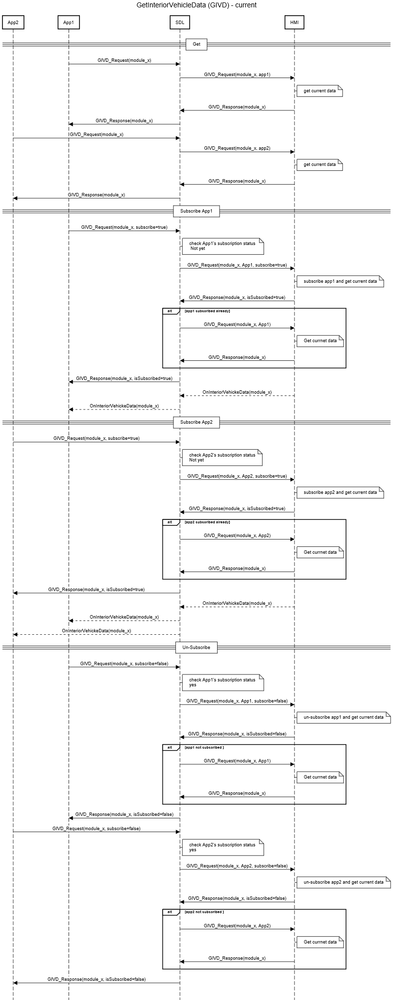
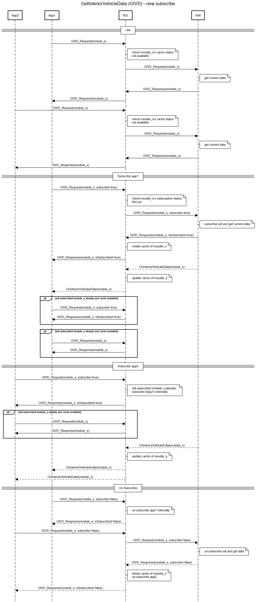

# Interior Vehicle Data Subscription Management and Data Caching in SDL

* Proposal: [SDL-0178](0178-GetInteriorVehicleData.md)
* Author: [Zhimin Yang](https://github.com/smartdevicelink/yang1070)
* Status: **In Review**
* Impacted Platforms: [Core / Web / RPC ]

## Introduction

This proposal is for improving the process of GetInteriorVehicleData RPC in SDL core. This proposal can reduce the number of messages between SDL and HMI, and improves the response time of GetInteriorVehicleData a lot. It accomplishes this by introducing a cache of the interior vehicle data and maintains SDL's subscription status of a module(Type). 


## Motivation

The following sequence diagram shows the current behavior of SDL regarding GetInteriorVehicleData.



#### 1. SDL always forwards a valid GetInteriorVehicleData request from any app to HMI regardless of whether the parameter `subscribe` is included or not.
#### 2. SDL expects HMI to manage each app’s subscription status (per moduleType) and maintains a local status to keep track of each application’s subscription (per moduleType).
#### 3. SDL mainly works as a pass-through/forwarder with little intelligence  
- If there is no subscribe parameter in GetInteriorVehicleData, SDL forwards the request to HMI.
- If parameter `subscribe=true` and the app has not subscribed to the module yet, SDL forwards the whole request to HMI.
- If parameter `subscribe=true` and the app has already subscribed to the module, SDL cuts off `subscribe=true` from the request and forwards it to HMI.
- If parameter `subscribe=false` and the app has not subscribed to the module yet, SDL cuts off  `subscribe=false` from the request and forwards it to HMI.
- If parameter `subscribe=false` and the app has already subscribed to the module, SDL forwards the whole request to HMI.

### Advantages:
- A simple SDL. Just forwarding the GetInteriorVehicleData requests and response between the app and the HMI.

### Shortcomings:
- The operation of GetInteriorVehicleData and subscribe InteriorVehicleData on HMI side may be a time consuming task. 
- If app1 has already subscribed data change notification for a moduleType, SDL still needs to include parameter `subscribe=true` when forwarding requests from other apps, i.e. to re-subscribe the data again. There are extra messages and extra processing time.
- If app1 has not subscribed data change notification for a moduleType, SDL still needs to include parameter `subscribe=false` when forwarding requests from other apps, i.e. to unsubscribe the data per app. There are extra messages and extra processing time.
- If app1 has already subscribed data change notification for a moduleType, and HMI returns the data to SDL in response,  SDL still forwards new GetInteriorVehicleData requests (from same app or different app regarding same moduleType) to HMI. However, SDL has the module data already and can keep the data up to date since SDL will get OnInteriorVehicleData notifications whenever there is any data change in the same moduleType. There are extra messages and extra processing time.
- It is not very clean. SDL still maintains the local status and makes some filtering (cut off parameter `subscribe` in certain cases), why not always forward original message if we want to keep SDL simple.


## Proposed solution

The following sequence diagram shows the proposed behavior of SDL regarding GetInteriorVehicleData. 



SDL maintains the module (Type) subscription status as a whole. SDL needs to subscribe to a module if there is at least one app that subscribes to the module. SDL needs to unsubscribe from a module if no apps subscribe to the module. Or equivalently
- SDL shall only include parameter `subscribe=true` if SDL has not (equivalently there is no app) subscribed to the module data when forwarding GetInteriorVehicleData with `subscribe=true`.
- SDL shall only include parameter `subscribe=false` if it is the last app to unsubscribe to the module data when forwarding GetInteriorVehicleData with `subscribe=false`.


SDL maintains a cache of module data only when there is at least one application subscribed to the module. 
- SDL creates a cache for the module when it receives a successful GetInteriorVehicleData response with `isSubscribed=true`. 
- SDL updates the cache (only the part that changes) when it receives an OnInteriorVehicleData notification. 
- SDL removes the cache for the module when SDL receives a successful GetInteriorVehicleData response with `isSubscribed=false`. 
	

SDL only forwards a GetInteriorVehicleData request to HMI if there is no cached data available for the requested module or it needs to unsubscribe to the module from HMI. Otherwise, SDL responds to the request with the cached data and there is no need to forward it and wait for a response from HMI.

In addition, when there is no cache available and before SDL forwards a GetInteriorVehicleData request to HMI, SDL shall apply a rate limitation scheme similar to that of the GetVehicleData request. SDL allows `x` number of GetVehicleData requests per second. The number `x` is 5 and it can be configured in smartDeviceLink.ini file. Similarly, SDL allows `y` number of GetInteriorVehicleData requests to forward to HMI. The number `y` shall be configurable in ini file. Since there are multiple moduleTypes defined for RC, ideally SDL shall apply rate limitation per moduleType. To simplify the implementation it can be regardless of moduleType. However, in this case, `y` shall be much greater than `x`.


```
; Limitation for a number of GetVehicleData requests (the 1st value) per (the 2nd value) seconds
GetVehicleDataRequest = 5, 1
+; Limitation for a number of GetInteriorVehicleDataRequest requests (the 1st value) per (the 2nd value) seconds
+GetInteriorVehicleDataRequest = 20, 1
```

## Potential downsides

- SDL core needs more memory for the data cache. In case there is something wrong with the HMI subsription, SDL will not get data updated. GetInteriorVehicleData will have aged data. 
- It makes SDL smarter but also more complex. 
- Ideally, the newly added function belongs to the integration with the vehicle data, and it shall be implemented in the vehicle/HMI side.

## Impact on existing code

- There is no change to the mobile API. 
- Parameter `appID` is no longer needed in HMI API. This may cause a major version change of HMI spec.

```xml
<function name="GetInteriorVehicleData" messagetype="request">
  <param name="moduleType" type="Common.ModuleType" mandatory="true" >
    <description>The module data to retrieve from the vehicle for that type</description>
  </param>
  <param name="subscribe" type="Boolean" mandatory="false" defvalue="false">
    <description>If subscribe is true, the head unit will send onInteriorVehicleData notifications for the module type</description>
  </param>
-  <param name="appID" type="Integer" mandatory="true">
-    <description>Internal SDL-assigned ID of the related application</description>
-  </param>
</function>
```

- SDL core code needs update.

## Alternatives considered

None
