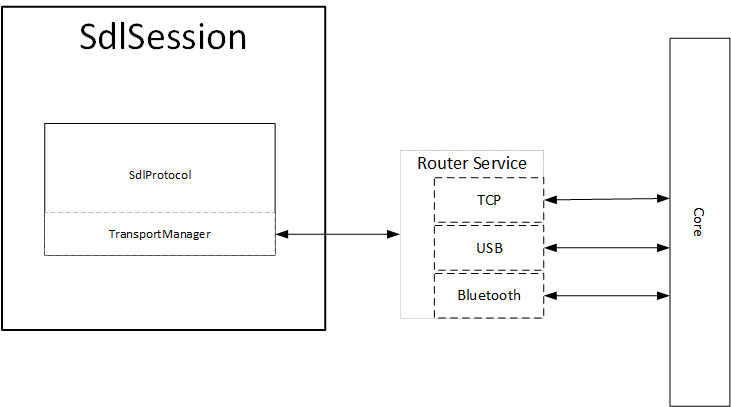

# Android Transport Layer Overhaul
* Proposal: [SDL-0194](0194-android-transport-overhaul.md)
* Author: [Joey Grover](https://github.com/joeygrover), [Austin Kirk](https://github.com/askirk)
* Status: **In Review**
* Impacted Platforms: Android

## Introduction
This proposal is to present a case for refactoring the current transport layer in the Android SDL library. The current layer is plagued with spaghetti code, improper logic locations, and unnecessary abstractions. With the requirement of providing AOA connections using the multiplexing feature, it makes sense to move all transports to such service and reduce the complexity and redundancy of the current transport layer.

This proposal includes information gathered from other proposals and they should be referenced as such:

- [AOA Multiplexing](https://github.com/smartdevicelink/sdl_evolution/blob/master/proposals/0095-AOA-multiplexing.md)
- [Simultaneous Transports](https://github.com/smartdevicelink/sdl_evolution/blob/master/proposals/0141-multiple-transports.md)

Larger code snippets are attached to the [(appendix)](#appendix).

Current code in development can be found at the [Transport Overhaul branch](https://github.com/smartdevicelink/sdl_android/pull/768).


## Motivation

There are two main reasons behind the motivation of this proposal: improper logic location and moving all transports to multiplexing architecture.

The current transport layer is overly complex, unnecessarily abstracted, and difficult to maintain. Attempting to follow where a packet is read in to where it is handled is almost impossible due to abstract classes, subclasses, etc. There is also an incorrect logic location from the protocol layer. Currently the protocol layer sits directly with the transport layer. This is outside the `SdlSession` that should be housing its own protocol layer and not mixing it in with the transport. While it might have made sense for this logical binding at the start, the protocol layer now has a lot more integration and information for subsequent layers and services (RPC, video, etc).

Next, the current transport layer doesn't work well for implementing simultaneous transports and the ability to connect multiple devices over a single transport. The router service is already in place for the bluetooth transport, and needs to be extended to the AOA transport due to a limitation by the Android OS. 

## Proposed solution

### Refactor Transport Layer

The first step will be to refactor how the transport and protocol layers work.

Currently this is how the transport layer looks. As can be seen the protocol layer is mixed into the transport layer and only receiving messages through multiple listeners. 


The first implementation will look like this for a minor change.


After the refactor the layers will look like this.



#### Move the protocol layer 

The protocol layer needs to be moved away from inside the transport layer. It actually needs to be the exact opposite. The protocol layer should sit on top of the transport layer. A new protocol layer will be created, `SdlProtocol` that will be instantiated into the `SdlSession` class. All control frame messages and related `SdlPacket` messages will be sent into the `SdlProtocol` instance for handling from the transport layer. The protocol layer will then determine whether or not packets need to move up the stack. 

#### Transport Manager

This will be the new bridge between the transports and the `SdlRouterService`. All the data gathered and delivered to the library will be passed to the `SdlProtocol`. This way, the `SdlProtocol` can decide where packets should go in logical blocks instead of the transport layer.

#### All Transports to Router Service

The next piece required for this refactor will be to move all the transport connections into the `SdlRouterService`. This is a logical step for AOA as discussed earlier. At that point 2 out of 3 transports would be already located in the router service. This means transport switching and the ability to use primary and secondary transports will already need to exist in the router service. Therefore, we should remove redundant logic and reduce the scope of transport classes outside of the router service. The only way this can be accomplished is by also moving the TCP transport.

#### ForceOnConnect Removal

The `ForceOnConnect` extra will no longer be used so the logic for it can be removed. This piece of integration has always been extra clutter and very error prone. Its removal from necessity will make the library more stable and less developer error prone.

#### AOA and TCP Multiplexing

A new USB and TCP transport discussed later, will be implemented into the `SdlRouterService`. This will allow all apps to connect through the USB and TCP transports when it is available. 

###### TCP Single SDL Port Assumption
A current assumption about the TCP transport is that the SDL core module will only expose a single port for all apps to connect through for a secondary transport. 

The ability will be added to modify this in the future so that the router service can hold multiple transports of the same type, but unless it is required the feature can be implemented at a later time. 


### Simultaneous Transport Modifications 

#### MultiplexTransport Config Updates

The config will be updated to hold a few extra settings

1. Primary Transport prioritized list - Ordered list of primary transports this app supports
    -  **Default order:** USB, Bluetooth
2. Secondary Transport prioritized list - Ordered list of secondary transports this app supports
    -  **Default order:** WiFi, USB, Bluetooth
3. High bandwidth required flag - flag for those apps that will require at least one available transport that can support the high bandwidth needs. Default will be false.

In practice, developers will only need to set the high bandwidth required flag. However, the setting of primary and secondary transports allows developers to test against certain transports as well as ensures complete control of how they intend for their app to work.


#### Transport Switching

Pushing all the transports into the router service we are able to maintain connections through proxy cycle events. This means the router service will automatically connect to transports as they become available and maintain that connection. Depending on each apps primary transport allowance and priority, they will be connected on that basis. 

If a transport disconnects that is considered to be an app's primary transport, the app will check the remaining connected transport types against its prioritized primary transport list. If a transport is found to be acceptable, the app will will perform a proxy cycle event and rebind with the router service and thus connect over the acceptable transport. 

#### New USB and TCP Transport

The current USB and TCP transport classes are very fragile and have a tendency to deadlock and prevent reconnection. A new USB and TCP transport will be created that uses an also new `MultiplexBaseTransport` abstract class [(_Code Snippet_)](#multiplexbasetransport-code). The new `MultiplexUsbTransport` [(_Code Snippet_)](#multiplexusbtransport-code) and `MultiplexTCPTransport` [(_Code Snippet_)](#multiplextcptransport-code)will be greatly simplified.


#### MultiplexBluetoothTransport changes
 The `MultiplexBluetoothTransport` will also now extend from the `MultiplexBaseTransport`
 

#### Handle multiple transports per App per Session

Each bound app will maintain one binding reference to the router service and the router service will handle when transports are added to the `RegisteredApp` and to which session specifically that transport is registered.

```java
//RegisteredApp class

//Primary will always be first. Key is the session id
SparseArray<ArrayList<TransportType>> registeredTransports;

protected void registerTransport(int sessionId,TransportType transportType){
	synchronized (TRANSPORT_LOCK){
		ArrayList<TransportType> transportTypes = this.registeredTransports.get(sessionId);
		if(transportTypes!= null){
			if(queues.get(transportType) == null){
				queues.put(transportType, new PacketWriteTaskBlockingQueue());
			}
			transportTypes.add(transportType);
			this.registeredTransports.put(sessionId,transportTypes);
		}
	}
}

protected boolean isRegisteredOnTransport(int sessionId, TransportType transportType){
	synchronized (TRANSPORT_LOCK){
		if(this.registeredTransports.indexOfKey(sessionId) >= 0){
			return this.registeredTransports.get(sessionId).indexOf(transportType) >= 0;
		}else{
			return false;
		}
	}
}

protected List<TransportType> getTransportsForSession(int sessionId){
	synchronized (TRANSPORT_LOCK){
		if(this.registeredTransports.indexOfKey(sessionId) >= 0){
			return this.registeredTransports.get(sessionId);
		}else{
			return null;
		}
	}
}

protected boolean unregisterTransport(int sessionId, TransportType transportType){
	synchronized (TRANSPORT_LOCK){
		if(this.registeredTransports.indexOfKey(sessionId) >= 0){
			return this.registeredTransports.get(sessionId).remove(transportType);
		}else{
			return false;
		}
	}
}

protected void unregisterAllTransports(int sessionId){
	synchronized (TRANSPORT_LOCK){
		if(this.registeredTransports.indexOfKey(sessionId) >= 0){
			this.registeredTransports.get(sessionId).clear();
		}else if(sessionId == -1){
			int size = this.registeredTransports.size();
			for(int i = 0; i <size; i++){
				this.registeredTransports.get(i).clear();
			}
		}
	}
}

```

#### Packet Queues
Packet queues will be a per transport per app item. Each bound app will have a queue per their registered transport for all sessions to operate.

```java
HashMap<TransportType, PacketWriteTaskBlockingQueue> queues;

public boolean handleIncommingClientMessage(final Bundle receivedBundle){
	int flags = receivedBundle.getInt(TransportConstants.BYTES_TO_SEND_FLAGS, TransportConstants.BYTES_TO_SEND_FLAG_NONE);
	TransportType transportType = TransportType.valueForString(receivedBundle.getString(TransportConstants.TRANSPORT_FOR_PACKET));

	if(flags!=TransportConstants.BYTES_TO_SEND_FLAG_NONE){
		byte[] packet = receivedBundle.getByteArray(TransportConstants.BYTES_TO_SEND_EXTRA_NAME); 
		if(flags == TransportConstants.BYTES_TO_SEND_FLAG_LARGE_PACKET_START){
			this.priorityForBuffingMessage = receivedBundle.getInt(TransportConstants.PACKET_PRIORITY_COEFFICIENT,0);
		}
		handleMessage(flags, packet, transportType);
	}else{
		//Add the write task on the stack
		PacketWriteTaskBlockingQueue queue = queues.get(transportType);
		if(queue == null){	
			queue = new PacketWriteTaskBlockingQueue();
			queues.put(transportType,queue);
		}
		if(queue!=null){
			queue.add(new PacketWriteTask(receivedBundle));
			PacketWriteTaskMaster packetWriteTaskMaster = packetWriteTaskMasterMap.get(transportType);
			if(packetWriteTaskMaster!=null){
				packetWriteTaskMaster.alert();
			}
		}
	}
	return true;
}

```

#### SdlPacket Update

The `SdlPacket` class will now include a `TransportRecord` for the local library. This lets the router service know which transport to send a packet. Also, when the router service receives a packet from the core module and relays it to the bound client app, the client knows where the packet came from.

```java
public class TransportRecord implements Parcelable{

    TransportType type;
    String address;

    public TransportRecord(TransportType transportType, String address){
        this.type = transportType;
        this.address = address;
    }

    ....    
}
```


#### Secondary Transport Registration

If the router service notices a Register Transport control frame ACK is received it will look for the corresponding session, register that transport for that session on that registered app, and forward the packet to the client.

### Breaking change phase


#### Remove WiProProtocol, SdlConnection, and Listener

All of these will no longer be necessary and should be removed.

#### Move SdlSession Class

With `SdlConnection` and listener removed, the package `com.smartdevicelink.SdlConnection` will no longer be valid and keeping `SdlSession` there will be orphaned. The class will be moved to `com.smartdevicelink.proxy`.

#### Misc Cleanup of Deprecated items

It will be required to remove all deprecated methods previously mentioned by this proposal's implementation.

## Potential downsides

- All transports will have to rely on the router service.
- For multiple sessions per app the initial design requires an app to create a new proxy and hold a separate binding to the router service. This can be overcome in the future but as the use case is very small it seems not worth the effort. 

## Impact on existing code

- New classes would be created to forge a much more straightforward transport layer.
- `SdlConnection.java` would be deprecated.
- Deprecate all transport configs in favor of a new general one.

## Alternatives considered
- Continuing with the current stack and implementing the multiple transports and USB transport to the router service. This method turns out to be very messy and changing in the future becomes difficult. 

## Appendix

**NOTE: Some code snippets might change during implementation and might have already changed, however, the changes should be relatively small.**

#### MultiplexBaseTransport Code


```java
public abstract class MultiplexBaseTransport {

    // Constants that indicate the current connection state
    public static final int STATE_NONE 			= 0;    // we're doing nothing
    public static final int STATE_LISTEN 		= 1;    // now listening for incoming connections
    public static final int STATE_CONNECTING	= 2; 	// now initiating an outgoing connection
    public static final int STATE_CONNECTED 	= 3;  	// now connected to a remote device
    public static final int STATE_ERROR 		= 4;  	// Something bad happened, we will not try to restart the thread

    public static final String TOAST = "toast";
    public static final String DEVICE_NAME = "device_name";

    protected int mState = STATE_NONE;
    protected final Handler handler;
    protected final TransportType transportType;

    public static String currentlyConnectedDevice = null;
    public static String currentlyConnectedDeviceAddress = null;

    public MultiplexBaseTransport(Handler handler, TransportType transportType){
        this.handler = handler;
        this.transportType = transportType;
    }

    protected synchronized void setState(int state) {
        int previousState = mState;
        mState = state;

        // Give the new state to the Handler so the UI Activity can update
        //Also sending the previous state so we know if we lost a connection
        handler.obtainMessage(SdlRouterService.MESSAGE_STATE_CHANGE, state, previousState,transportType).sendToTarget();
    }

    public synchronized int getState() {
        return mState;
    }

    public boolean isConnected()
    {
        return !(mState == STATE_NONE);
    }

    public synchronized void stop() {
        stop(STATE_NONE);
    }

    protected abstract void stop(int state);

    public abstract void write(byte[] out,  int offset, int count);

}

```

#### MultiplexUsbTransport Code

```java 
public class MultiplexUsbTransport extends MultiplexBaseTransport{

    private static final String TAG = "MultiplexUsbTransport";

    ReaderThread readerThread;
    WriterThread writerThread;
    final ParcelFileDescriptor parcelFileDescriptor;

    MultiplexUsbTransport(ParcelFileDescriptor parcelFileDescriptor, Handler handler){
        super(handler, TransportType.USB);
        if(parcelFileDescriptor == null){
            Log.e(TAG, "Error with object");
            this.parcelFileDescriptor = null;
            throw new ExceptionInInitializerError("ParcelFileDescriptor can't be null");
        }else{
            this.parcelFileDescriptor = parcelFileDescriptor;
            currentlyConnectedDevice = "USB";
        }
    }

    public synchronized void start(){...}

    protected synchronized void stop(int stateToTransitionTo) {...}


    /**
     * Write to the ConnectedThread in an unsynchronized manner
     * @param out The bytes to write
     */
    public void write(byte[] out,  int offset, int count) {...}

    /**
     * Indicate that the connection attempt failed and notify the UI Activity.
     */
    private void connectionFailed() {...}

    /**
     * Indicate that the connection was lost and notify the UI Activity.
     */
    private void connectionLost() {...}

    private class ReaderThread extends Thread{
        SdlPsm psm;

        final InputStream inputStream;

        public ReaderThread(final FileDescriptor fileDescriptor){
            psm = new SdlPsm();
            inputStream = new FileInputStream(fileDescriptor);
        }

        @Override
        public void run() {
            super.run();
            final int READ_BUFFER_SIZE = 4096;
            byte[] buffer = new byte[READ_BUFFER_SIZE];
            int bytesRead;
            boolean stateProgress;

            // read loop
            while (!isInterrupted()) {
                try {
                    bytesRead = inputStream.read(buffer);
                    if (bytesRead == -1) {
                        if (isInterrupted()) {
                            Log.e(TAG,"EOF reached, and thread is interrupted");
                        } else {
                            Log.i(TAG,"EOF reached, disconnecting!");
                            connectionLost();
                        }
                        return;
                    }
                    if (isInterrupted()) {
                        Log.w(TAG,"Read some data, but thread is interrupted");
                        return;
                    }
                    byte input;
                    for(int i=0;i<bytesRead; i++){
                        input=buffer[i];
                        stateProgress = psm.handleByte(input);
                        if(!stateProgress){
                            psm.reset();
                            buffer = new byte[READ_BUFFER_SIZE];
                        }

                        if(psm.getState() == SdlPsm.FINISHED_STATE){
                            synchronized (MultiplexUsbTransport.this) {
                                //Log.d(TAG, "Packet formed, sending off");
                                SdlPacket packet = psm.getFormedPacket();
                                packet.setTransportType(TransportType.USB);
                                handler.obtainMessage(SdlRouterService.MESSAGE_READ, packet).sendToTarget();
                            }
                            //We put a trace statement in the message read so we can avoid all the extra bytes
                            psm.reset();
                            buffer = new byte[READ_BUFFER_SIZE]; 
                        }
                    }
                } catch (IOException e) {
                    if (isInterrupted()) {
                        Log.w(TAG,"Can't read data, and thread is interrupted", e);
                    } else {
                        Log.w(TAG,"Can't read data, disconnecting!", e);
                        connectionLost();
                    }
                    return;
                } catch (Exception e){
                    connectionLost();
                }
            }
        }


        public synchronized void cancel() {...}

    }


    /**
     * This thread runs during a connection with a remote device.
     * It handles all incoming and outgoing transmissions.
     */
    private class WriterThread extends Thread {
        private final OutputStream mmOutStream;

        public WriterThread(FileDescriptor fileDescriptor) {
            //Log.d(TAG, "Creating a Connected - Write Thread");
            OutputStream tmpOut = null;
            setName("SDL Router BT Write Thread");
            // Get the Usb output streams
            mmOutStream = new FileOutputStream(fileDescriptor);


        }
        
        /**
         * Write to the connected OutStream.
         * @param buffer  The bytes to write
         */
        public void write(byte[] buffer, int offset, int count) {
            try {
                if(buffer==null){
                    return;
                }
                mmOutStream.write(buffer, offset, count);
            } catch (IOException|NullPointerException e) { // STRICTLY to catch mmOutStream NPE
                // Exception during write
                connectionLost();
            }
        }

        public synchronized void cancel() {
            try {
                if(mmOutStream!=null){
                    mmOutStream.flush();
                    mmOutStream.close();

                }
            } catch (IOException e) {
                // close() of connect socket failed
            }
        }
    }
}

```

#### MultiplexTCPTransport Code

```
public class MultiplexTcpTransport extends MultiplexBaseTransport {

	private static final String TAG = "MultiplexTcpTransport";

	private static final int READ_BUFFER_SIZE = 4096;
	private static final int RECONNECT_DELAY = 5000;
	private static final int RECONNECT_RETRY_COUNT = 30;

    final String ipAddress;
    final int port;
    final boolean autoReconnect;

	private Socket mSocket = null;
	private InputStream mInputStream = null;
	private OutputStream mOutputStream = null;
	private MultiplexTcpTransport.TcpTransportThread mThread = null;
	private WriterThread writerThread;


	public MultiplexTcpTransport(int port, String ipAddress, boolean autoReconnect, Handler handler) {
		super(handler, TransportType.TCP);
		this.ipAddress = ipAddress;
		this.port = port;
        connectedDeviceAddress = ipAddress + ":" + port;
		this.autoReconnect = autoReconnect;
		setState(STATE_NONE);
	}

	public synchronized void start(){
		if(getState() == STATE_NONE) {
			synchronized (this) {
				setState(STATE_CONNECTING);
				logInfo("TCPTransport: openConnection request accepted. Starting transport thread");
				try {
					mThread = new MultiplexTcpTransport.TcpTransportThread();
					mThread.setDaemon(true);
					mThread.start();

					// Initialize the SiphonServer
					if (SiphonServer.getSiphonEnabledStatus()) {
						SiphonServer.init();
					}

				} catch (Exception e) {
					logError("TCPTransport: Exception during transport thread starting", e);
				}
			}
		} else {
			logInfo("TCPTransport: openConnection request rejected. Another connection is not finished");
		}

		// Send the name of the connected device back to the UI Activity
		Message msg = handler.obtainMessage(SdlRouterService.MESSAGE_DEVICE_NAME);
		Bundle bundle = new Bundle();
		bundle.putString(DEVICE_NAME, currentlyConnectedDevice);
		msg.setData(bundle);
		handler.sendMessage(msg);
	}


	@Override
	protected void stop(int state) {
		try {
			if(mThread != null) {
				mThread.halt();
				mThread.interrupt();
			}

			if (writerThread != null) {
				writerThread.cancel();
				writerThread = null;
			}

			if(mSocket != null){
				mSocket.close();
			}
			mSocket = null;
		} catch (IOException e) {
			logError("TCPTransport.disconnect: Exception during disconnect: " + e.getMessage());
		}

		setState(state);
	}

	@Override
	public void write(byte[] out, int offset, int count) {
		// Create temporary object
		MultiplexTcpTransport.WriterThread r;
		// Synchronize a copy of the ConnectedThread
		synchronized (this) {
			if (mState != STATE_CONNECTED) return;
			r = writerThread;
			//r.write(out,offset,count);
		}
		// Perform the write unsynchronized
		r.write(out,offset,count);
	}

	/**
	 * Implementation of waiting required delay that cannot be interrupted
	 * @param timeMs Time in milliseconds of required delay
	 */
	private void waitFor(long timeMs) {
		long endTime = System.currentTimeMillis() +timeMs;
		while (System.currentTimeMillis() < endTime) {
			synchronized (this) {
				try {
					wait(endTime - System.currentTimeMillis());
				} catch (Exception e) {
					// Nothing To Do, simple wait
				}
			}
		}
	}

	private void startWriteThread() {
		if (writerThread == null) {
			writerThread =  new MultiplexTcpTransport.WriterThread();
			writerThread.start();
		}
	}

	/**
	 * Internal class that represents separate thread, that does actual work, related to connecting/reading/writing data
	 */
	private class TcpTransportThread extends Thread {
		SdlPsm psm;
		public TcpTransportThread(){
			psm = new SdlPsm();
		}
		/**
		 * Represents current thread state - halted or not. This flag is used to change internal behavior depending
		 * on current state.
		 */
		private Boolean isHalted = false;

		/**
		 * Method that marks thread as halted.
		 */
		public void halt() {
			isHalted = true;
		}

		/**
		 * Tries to connect to the SmartDeviceLink core. Behavior depends autoReconnect configuration param:
		 *      a) If autoReconnect is false, then only one connect try will be performed.
		 *      b) If autoReconnect is true, then in case of connection error continuous reconnect will be performed
		 *          after short delay until connection will be established or retry count will be reached
		 *
		 * @return true if connection established and false otherwise
		 */
		private boolean connect() {
			boolean bConnected;
			int remainingRetry = RECONNECT_RETRY_COUNT;

			synchronized (MultiplexTcpTransport.this) {
				do {
					try {

						if ((null != mSocket) && (!mSocket.isClosed())) {
							logInfo("TCPTransport.connect: Socket is not closed. Trying to close it");
							mSocket.close();
						}

						logInfo(String.format("TCPTransport.connect: Socket is closed. Trying to connect to %s", getAddress()));
						mSocket = new Socket();
						mSocket.connect(new InetSocketAddress(ipAddress, port));
						mOutputStream = mSocket.getOutputStream();
						mInputStream = mSocket.getInputStream();
						startWriteThread();
					} catch (IOException e) {
						logError("TCPTransport.connect: Exception during connect stage: " + e.getMessage());
					}

					bConnected = (null != mSocket) && mSocket.isConnected();

					if(bConnected){
						logInfo("TCPTransport.connect: Socket connected");
						setState(STATE_CONNECTED);
					}else{
						if(autoReconnect){
							remainingRetry--;
							logInfo(String.format("TCPTransport.connect: Socket not connected. AutoReconnect is ON. retryCount is: %d. Waiting for reconnect delay: %d"
									, remainingRetry, RECONNECT_DELAY));
							waitFor(RECONNECT_DELAY);
						} else {
							logInfo("TCPTransport.connect: Socket not connected. AutoReconnect is OFF");
						}
					}
				} while ((!bConnected) && (autoReconnect) && (remainingRetry > 0) && (!isHalted));

				return bConnected;
			}
		}

		/**
		 * Performs actual thread work
		 */
		@Override
		public void run() {
			logInfo("TCPTransport.run: transport thread created. Starting connect stage");
			psm.reset();
			while(!isHalted) {
				setState(STATE_CONNECTING);
				if(!connect()){
					if (isHalted) {
						logInfo("TCPTransport.run: Connection failed, but thread already halted");
					} else {
						MultiplexTcpTransport.this.stop(STATE_NONE);
					}
					break;
				}

				synchronized (MultiplexTcpTransport.this) {
					setState(STATE_CONNECTED);
				}

				byte input;
				byte[] buffer = new byte[READ_BUFFER_SIZE];
				int bytesRead;
				boolean stateProgress = false;
				while (!isHalted) {
					//logInfo("TCPTransport.run: Waiting for data...");
					try {
						//input = (byte) mInputStream.read();
						bytesRead = mInputStream.read(buffer);
					} catch (IOException e) {
						internalHandleStreamReadError();
						break;
					}

					if (bytesRead == -1) {
						// Javadoc says -1 indicates end of input stream.  In TCP case this means loss
						// of connection from HU (no exception is thrown when HU connection is lost).
						internalHandleStreamReadError();
						break;
					}

					synchronized (MultiplexTcpTransport.this) {
						if (mThread.isInterrupted()) {
							logInfo("TCPTransport.run: Got new data but thread is interrupted");
							break;
						}
					}
					for (int i = 0; i < bytesRead; i++) {
						//logInfo("TCPTransport.run: Got new data");
						// Send the response of what we received
						input = buffer[i];
						stateProgress = psm.handleByte(input);
						if (!stateProgress) {//We are trying to weed through the bad packet info until we get something

							//Log.w(TAG, "Packet State Machine did not move forward from state - "+ psm.getState()+". PSM being Reset.");
							psm.reset();
						}

						if (psm.getState() == SdlPsm.FINISHED_STATE)
						{
							synchronized (MultiplexTcpTransport.this) {
								Log.d(TAG, "Packet formed, sending off");
								SdlPacket packet = psm.getFormedPacket();
								packet.setTransportType(TransportType.TCP);
								handler.obtainMessage(SdlRouterService.MESSAGE_READ, packet).sendToTarget();
							}
							//We put a trace statement in the message read so we can avoid all the extra bytes
							psm.reset();
						}
					}
				}
			}

			logInfo("TCPTransport.run: Thread terminated");
			setState(STATE_NONE);
		}

		/**
		 * Internal handling of Tcp disconnection
		 */
		private void internalHandleTCPDisconnect() {
			if(isHalted){
				logInfo("TCPTransport.run: TCP disconnect received, but thread already halted");
			} else {
				logInfo("TCPTransport.run: TCP disconnect received");
				MultiplexTcpTransport.this.stop(STATE_NONE);
			}
		}

		/**
		 * Internal handling of reading data from input stream
		 */
		private void internalHandleStreamReadError() {
			if(isHalted){
				logError("TCPTransport.run: Exception during reading data, but thread already halted");
			} else {
				logError("TCPTransport.run: Exception during reading data");
				MultiplexTcpTransport.this.stop(STATE_NONE);
			}
		}
	}

	private class WriterThread extends Thread {
		private boolean mCancelled = false;
		private boolean mVerbose = false;

		public void write(byte[] msgBytes, int offset, int count) {
			if ((msgBytes == null) || (msgBytes.length == 0)) {
				logInfo("TCPTransport.sendBytesOverTransport: nothing to send");
				return;
			}

			if (offset + count > msgBytes.length) {
				count = msgBytes.length - offset;
			}

			OutputStream out;
			synchronized (MultiplexTcpTransport.this) {
				out = mOutputStream;
			}

			if ((out != null) && (!mCancelled)) {
				try {
					out.write(msgBytes, offset, count);
					if (mVerbose) {
						logInfo("TCPTransport.sendBytesOverTransport: successfully sent data");
					}
				} catch (IOException e) {
					logError("TCPTransport.sendBytesOverTransport: error during sending data: " + e.getMessage());
				}
			} else {
				if (mCancelled) {
					logError("TCPTransport: sendBytesOverTransport request accepted, thread is cancelled");
				} else {
					logError("TCPTransport: sendBytesOverTransport request accepted, but output stream is null");
				}
			}
		}

		public synchronized void cancel() {
			mCancelled = true;
			if (mOutputStream != null) {
				synchronized (MultiplexTcpTransport.this) {
					try {
						mOutputStream.flush();
					} catch (IOException e) {
						logError("TCPTransport flushing output stream failed: " + e.getMessage());
					}

					try {
						mOutputStream.close();
					} catch (IOException e) {
						logError("TCPTransport closing output stream failed: " + e.getMessage());
					}
					mOutputStream = null;
				}
			}
		}
	}
}


```
