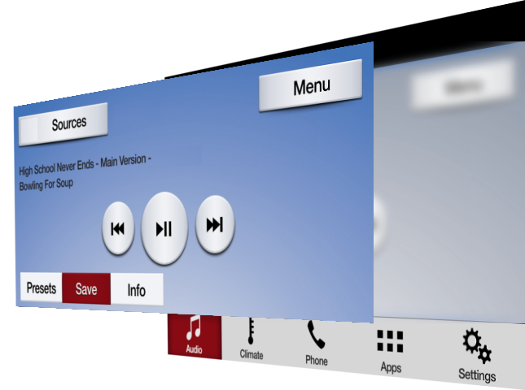
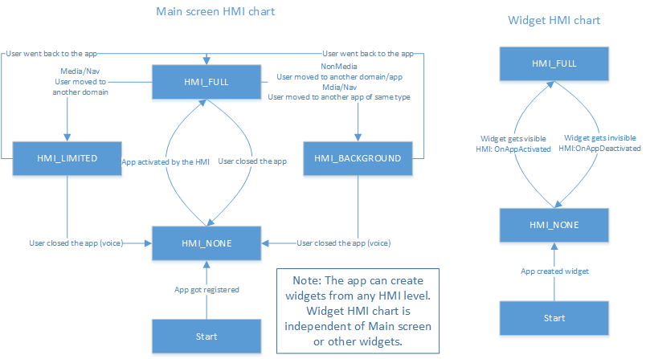
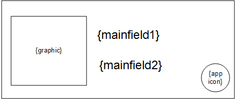

# Widget support

* Proposal: [SDL- 0216](0216-widget-support.md)
* Author: [Ashwin Karemore](https://github.com/ashwink11), [Kujtim Shala](https://github.com/kshala-ford)
* Status: **Returned for Revisions**
* Impacted Platforms: [Core / iOS / Android / RPC ]

## Introduction

This proposal is about widget support for SDL applications on modern infotainment systems and large displays. At the same time the proposed feature should prepare SDL for multi-window and multi-display support. 

## Motivation

As provided in other app platforms, app widgets are useful to quickly interact with apps and features. With modern infotainment systems and larger displays, SDL can offer a small representation of a registered application.

This proposal is focusing on main display widgets, but provides futuristic APIs to control apps on multiple displays.

### Phase 1: Widgets support on single (main) display

This proposal should allow an app to create one or multiple widgets on the single (main) display. Each widget can be individually addressed by the app and the HMI can present widgets on the infotainment display.

The below image shows SYNC3 home screen presenting two widgets with weather and VOIP features. The application itself (and the main window) are currently not visible, but still the driver can interact with the applications and control the app state and HMI e.g. by requesting weather forecast or by muting/unmuting the VOIP call.


> Figure: "Home" area of the SYNC3 display. Showing widgets from a different apps.

Included in this phase will be a redesign of display capabilities for single display and multi-window support. The goal is to make SDL ready with multi-display support.

### Phase 2: Multi display support

This phase will not be part of this proposal. Providing Widget support has been identified as a concept that can be extended to support multiple displays including clusters, heads up and rear seat entertainment systems. The long-term vision of this proposal is to provide multi-window and multi-display support. This means that one app should not only be able to have multiple windows of different types on one display, but also address other displays inside the vehicle.


> Figure: Example of having rear seat entertainment system and also a head-up display.

The following sections of the motivation provide brief description of phase 2.

#### Extend display capabilities for multi display

Apps need to be able to request system capabilities regarding displays and seats/users so that apps know about display availability, display type (center stack, cluster, head-up, head-rest etc.), size etc. In addition to display availability, it is required to know the display location relative to available seats (and therefore persons) that can reach and use the display.

Providing display information to the app should be done by extending the system capability for `DISPLAY`. Each display should be identified with a system defined `displayID` so that apps can send requests for overlays to a specific display.

#### Analyzing RPCs and their relation to displays and windows

Today in the vehicle, SDL works as a system with a single main display and a single main app window. OEMs reuse some assets from the main app window and present it in other areas in the vehicle. Additionally, OEMs have to analyze and understand how RPCs are affected by having multiple windows with multiple displays. A future proposal will solve how HMI levels will work on multiple displays and what RPCs are specific to  
- system (`RegisterAppInterface`, `CreateInteractionChoiceSet` etc.)
- display (`Alert`, `PerformInteraction`, `AddCommand` etc.)
- window (`Show`, `SetDisplayLayout` etc.)

#### System

The terminology "system" in this proposal means the system's endpoint, that is running inside the machine where the app connects to. In classical terms this means SDL core, that is running in IVI.

List of RPCs identified as system related: `RegisterAppInterface`, `UnregisterAppInterface`, `SetGlobalProperties`, `ResetGlobalProperties`, `CreateInteractionChoiceSet`, `DeleteInteractionChoiceSet`, `Speak` (and other RPCs with `.ttsChunks`), `SubscribeButton`, `UnsubscribeButton`, `ButtonPress`, `SubscribeVehicleData`, `UnsubscribeVehicleData`, `GetVehicleData`, `ReadDID`, `GetDTCs`, `ChangeRegistration`, `GenericResponse`, `PutFile`, `DeleteFile`, `ListFiles`, `SetAppIcon`, `DiagnosticMessage`, `SystemRequest`, `SendLocation`, `DialNumber`, `UpdateTurnList`, `OnAppInterfaceUnregistered`, `OnButtonEvent`, `OnButtonPress`, `OnVehicleData`, `OnCommand`, `OnTBTClientState`, `GetInteriorVehicleData`, `SetInteriorVehicleData`, `GetWayPoints`, `SubscribeWayPoints`, `UnsubscribeWayPoints`, `GetSystemCapability`, `OnDriverDistraction`, `OnPermissionsChange`, `OnSystemRequest`, `OnHashChange`, `OnInteriorVehicleData`, `OnWayPointChange`, `OnRCStatus`, `OnLanguageChange`

#### Display

A "Display" is a **physical device** mounted on a defined position inside the system's area of work. Today e.g. in Ford vehicles this means the IVI display in the center stack. However, the system should not be limited to a single (implicit) display. SDL should provide an interface to the HMI so that it can provide information to other displays, such as a cluster display, head-up display, rear seat, door panels or widget displays that also act as touch pads. 

The below image shows SYNC3 with an app window presented on the display. The SYNC3 display in the center stack is the main display of the SDL system. The highlighted area is the viewport of app windows. Each app has one single main app window that is presented on the SYNC3 display on user selection. Selecting another app will cause the display to show the window of the other app. If that window is visible, the app is defined as in HMI level FULL.



> Figure: "Display and Window" showing a media-app's window on the SYNC3 main display.

List of RPCs identified as display related: `Alert`, `PerformInteraction`, `PerformAudioPassThru`, `EndAudioPassThru`, `ScrollableMessage`, `Slider`, `ShowConstantTBT`, `AlertManeuver`, `OnAudioPassThru`, `OnKeyboardInput` (for keyboard interactions).

All of the above RPCs should be extended with a `displayID` parameter when adding multi display support. The below example shows how `Alert` should be extended:

```xml
<function name="AlertID" type="Request">
  :
  <param name="displayID" type="Integer" mandatory="false" />
</function>
```

#### Window

As of today, once an SDL app registers, it gets a main window created by default on the IVI head unit. Strictly speaking, the `Show` RPC is manipulating the content presented in the single main window. Adding the capability for apps to address a specific window per Show request allows apps to fill app windows individually.

A "window" defines a **logical area on a physical display** addressed to an app which is connected to the system. Apps can present text, buttons and/or images on windows. The capabilities of the window are provided to the app which contain information about the number of text lines, number of buttons, and size of images etc.

An app can have multiple windows of different types on a single display. However, windows may change the visibility on a display. Other applications or windows can be brought to focus by the user.

List of window RPCs:
- `MAIN` window only: `AddCommand`, `DeleteCommand`, `AddSubMenu`, `DeleteSubMenu`, `SetMediaClockTimer`, `SendHapticData`, `OnKeyboardInput` (for `NAV_KEYBOARD` template), `OnTouchEvent`
- `WIDGET` window only: none
- Both window types: `Show`, `SetDisplayLayout`, `OnHMIStatus`

This proposal will only focus on RPCs affecting widgets, which are `Show`, `SetDisplayLayout` and `OnHMIStatus`.

## Proposed solution

The proposed solution is to allow apps to create one or multiple widget windows. Each widget can be individually addressed with text, images and buttons. For convenience it should be possible to enable content duplication from another widget or window. One app should be allowed to create one or multiple widgets.

It is the OEM's responsibility and decision on how and where widgets will be presented. They could be listed on the IVI home window, in the app's domain of the IVI system, or next to the main app window area. Just as today, the application should be notified about widget visibility by using HMI levels for widgets.

In order to provide widget support, it is necessary to add APIs to manage and manipulate windows.

### Window management

In order to work with multiple windows, the app needs to be able to create or delete windows. By adding the RPCs `CreateWindow` and `DeleteWindow`, the app will be able to manage the window on the main display.

#### Mobile API

```xml
<function name="CreateWindow" messagetype="request" since="5.x">
  <description>
    Create a new window on the display with the specified window type.
  </description>
  <param name="windowID" type="Integer" mandatory="true">
     <description>
       A unique ID to identify the window. The value of '0' will always be the default main window on the main display and should not be used in this context as it will already be created for the app. See PredefinedWindows enum. Creating a window with an ID that is already in use will be rejected with `INVALID_ID`.
    </description>
  </param>
  <param name="windowName" type="String" maxlength="100" mandatory="true">
     <description>
       The window name to be used by the HMI. The name of the pre-created default window will match the app name.
       Multiple apps can share the same window name except for the default main window. 
       Creating a window with a name which is already in use by the app will result in `DUPLICATE_NAME`.
     </description>
  </param>
  <param name="type" type="WindowType" mandatory="true">
    <description>The type of the window to be created. Main window or widget.</description>
  </param>
  <param name="duplicateWindowID" type="Integer" mandatory="false">
    <description>
      Optional parameter. Specify whether the content sent to an existing window
      should be duplicated to the created window.
      If there isn't a window with the ID, the request will be rejected with `INVALID_DATA`.
    </description>
  </param>
</function>

<function name="CreateWindow" messagetype="response" since="5.x">
  <param name="success" type="Boolean" platform="documentation" mandatory="true">
    <description> true if successful; false, if failed.</description>
  </param>
  <param name="info" type="String" maxlength="1000" mandatory="false" platform="documentation">
    <description>Provides additional human readable info regarding the result.</description>
  </param>
  <param name="resultCode" type="Result" platform="documentation" mandatory="true">
    <description>See Result</description>
    <element name="SUCCESS"/>
    <element name="REJECTED"/>
    <element name="INVALID_DATA"/>
    <element name="INVALID_ID"/>
    <element name="DUPLICATE_NAME"/>
    <element name="DISALLOWED"/>
    <element name="OUT_OF_MEMORY"/>
    <element name="TOO_MANY_PENDING_REQUESTS"/>
    <element name="APPLICATION_NOT_REGISTERED"/>
    <element name="GENERIC_ERROR"/>
  </param>
</function>

<function name="DeleteWindow" messagetype="request" since="5.x">
  <description>
    Deletes previously created window of the SDL application.
  </description>
  <param name="windowID" type="Integer" mandatory="true">
    <description>
      A unique ID to identify the window. The value of '0' will always be the default main window on the main display and cannot be deleted.
      See PredefinedWindows enum.
    </description>
  </param>
</function>

<function name="DeleteWindow" messagetype="response" since="5.x">
  <param name="success" type="Boolean" platform="documentation" mandatory="true">
    <description> true if successful; false, if failed.</description>
  </param>
  <param name="info" type="String" maxlength="1000" mandatory="false" platform="documentation">
    <description>Provides additional human readable info regarding the result.</description>
  </param>
  <param name="resultCode" type="Result" platform="documentation" mandatory="true">
    <description>See Result</description>
    <element name="SUCCESS"/>
    <element name="REJECTED"/>
    <element name="INVALID_DATA"/>
    <element name="INVALID_ID"/>
    <element name="DUPLICATE_NAME"/>
    <element name="DISALLOWED"/>
    <element name="OUT_OF_MEMORY"/>
    <element name="TOO_MANY_PENDING_REQUESTS"/>
    <element name="APPLICATION_NOT_REGISTERED"/>
    <element name="GENERIC_ERROR"/>
  </param>
</function>

<enum "WindowType">
<element name="MAIN">
  <description>
    This window type describes the main window on a display.
  </description>
</element>
<element name="WIDGET">
  <description>
    A widget is a small window that the app can create to provide information and soft buttons for quick app control.
  </description>
</element>
</enum>

<enum "PredefinedWindows" since="5.x">
<element name="DEFAULT_WINDOW" value="0">
  <description>
    The default window is a main window pre-created on behalf of the app.
  </description>
</element>
</enum>
```

#### HMI API

The HMI API should contain:
- a copy of the enums `WindowType` and `PredefinedWindows` in the "Common" interface
- a copy of the functions `CreateWindow` and `DeleteWindow` in the "UI" interface

#### Create & Delete window

The RPC `CreateWindow` allows an app to create a new window on the display. The app needs to specify a window ID that is used for window manipulation e.g. with the RPC `Show` and the window type which can either be `MAIN` or `WIDGET` (see sub-section *Window types*). 

If desired, the apps can duplicate content sent to an existing window to the created window using parameter `duplicateWindowID`. All RPCs sent to the window with the ID `duplicateWindowID` will be duplicated to the created window. Bidirectional window content duplication should not be supported. RPCs sent to the created window should be rejected by the HMI.

Widgets that are created by an app are not necessarily visible on the HMI. The HMI can hold widgets in a list of available widgets so that a user can choose the widgets they want. 

#### Window types

This proposal contains two types of windows.

The main window is the full size app window on a display. Per app it should not be allowed to have multiple main windows on a single display. However, with multi-display support, an app can have multiple main windows e.g. main window on the central console and main window on rear seat entertainment system.

The widget window is a small window type that provides quick information and soft buttons. Depending on the app policies, apps can create widgets from any HMI level as allowed by policies (e.g. from HMI_NONE or BACKGROUND). Once the widget is activated by the HMI, apps can send `Show` requests to add content (text and soft buttons) to that widget. The RPCs sent to the widget follow same policies according to the widget's HMI level. 

Just like push notifications (`Alert` from `HMI_BACKGROUND`), widgets should be able to change the HMI level of the app's main window by using `STEAL_FOCUS` soft buttons. If a user taps on a soft button in the widget with `.systemAction = STEAL_FOCUS`, the app's main window should be activated by the HMI and therefore become HMI_FULL.

#### PredefinedWindows

The enum `PredefinedWindows` specifies what windows and IDs are predefined and pre-created on behalf of the app.

The default window is always available and represents the app window on the main display. It's an equivalent to today's app window. For backward compatibility, this will ensure the app always has at least the default window on the main display. The app can choose to use this predefined enum element to specifically address app's main window or to duplicate window content. It is not possible to duplicate another window to the default window.

#### Window related `OnHMIStatus`

Today, SDL uses HMI levels to inform an app about the launch state and visibility. In fact, every window instance of an app should have its own HMI level. The notification `OnHMIStatus` should be extended to address a specific window.

```xml
<function name="OnHMIStatus" functionID="OnHMIStatusID" messagetype="notification" since="1.0">
  :
  <param name="windowID" type="Integer" mandatory="false" since="5.x" >
    <description>
      This is the unique ID assigned to the window that this RPC is intended. If this param is not included, it will be assumed that this request is specifically for the main window on the main display. See PredefinedWindows enum.
    </description>
  </param>
</function>    
```

The additional parameter can be used by the system to specify the HMI level of a window. If the value is omitted, it means the default window is addressed. For other windows the window ID specified by the app should be set in this parameter.

If a widget becomes visible on the display, the HMI should notify Core that the widget is activated. Core should then notify the app that the widget is now in HMI_FULL. This can be the case if the user changes the HMI to present the widget area (e.g. the home screen shows app widgets).

Audio streaming state is not related to windows, it is related to system's audible state. To limit the changes in the RPC and support backward compatibility, `audioStreamingState` should be provided to all windows of one app. HMI and SDL Core should make sure to send the same audio states to all windows. 

Example: If a media app has created a widget and then becomes audible, the media app should receive two `OnHMIStatus` notifications for both windows (main and widget) and both audio streaming states are set to `AUDIBLE`. This will ensure a consistent audible state.

Currently, main and widget windows will receive a notification about their current system context. By default windows system context will be `MAIN`. In case of a voice session the context of all existing windows will be `VRSESSION`. In regards to main windows, widgets should be told if they are obscured by an Alert of the application `ALERT` or by any other HMI overlay `HMI_OBSCURED`.

The above requirements require additions to the HMI_API in order to provide system context notifications to widgets.

```xml
<interface name="UI">
  <function name="OnSystemContext" messagetype="notification">
    <param name="systemContext" type="Common.SystemContext" mandatory="true">
      <description>The context the application is brought into.</description>
    </param>
    <param name="appID" type="Integer" mandatory="false">
      <description>ID of application that is related to this RPC.</description>
    </param>
    <param name="windowID" type="Integer" mandatory="false" > <!-- new -->
      <description>
        This is the unique ID assigned to the window that this RPC is intended. If this param is not included, it will be assumed that this request is specifically for the main window on the main display. See PredefinedWindows enum. 
      </description>
    </param>
  </function>
```

With adding `windowID` to the system context notification, the HMI can provide individual context state to windows.

#### HMI: widget window activation

Above requirements regarding modifying the HMI level require modifications to the HMI_API, so that the HMI can inform SDL Core about window activations.

```xml
<interface name="BasicCommunication">
<function name="OnAppActivated" messagetype="notification">
  :
  <param name="windowID" type="Integer" mandatory="true" > <-- new -->
    <description>
      This is the unique ID assigned to the window that this RPC is intended. If this param is not included, it will be assumed that this request is specifically for the main window on the main display. See PredefinedWindows enum.  
    </description>
  </param>
</function>
<function name="OnAppDeactivated" messagetype="notification">
  :
  <param name="windowID" type="Integer" mandatory="true" > <-- new -->
    <description>
      This is the unique ID assigned to the window that this RPC is intended. If this param is not included, it will be assumed that this request is specifically for the main window on the main display. See PredefinedWindows enum. 
    </description>
  </param>
</function>
```

The window ID is told to the HMI by the app using `CreateWindow`. If a user taps on an app icon to launch the app, the HMI activates the app sending `OnAppActivated` to SDL Core with `windowID = 0` which points to the application's main window. The HMI flow of widgets is independent of the flow for main windows. 

Widgets created should be stored in a list of available widgets by the HMI. This list should use the app icon and the window name when showing the list to a user. The HMI level of these widgets is `HMI_NONE` and they are not visible on the HMI. A user can select or deselect widgets from this list to be added to the HMI. This means they can be added to a widget area or to a specific widget slot (depends on HMI implementation). The HMI will notify Core about widgets that are select to be part of the HMI using `OnAppActivated` with the widget's window ID. 

Widgets that are part of the HMI are not necessarily visible to the user. The display of the infotainment system can present content other than widgets. While a widget is added to the HMI but not visible it should be in `HMI_BACKGROUND`. If a widget becomes visible on the HMI, the HMI should send `OnAppActivated` with the widget's window ID to move the widget to `HMI_FULL`. There could be multiple widgets presented at the same time (from one app or from multiple), which means multiple widgets can be in `HMI_FULL`. Widgets that become invisible on the HMI should be deactivated by the HMI using `OnAppDeactivated` to transition them from `HMI_FULL` to `HMI_BACKGROUND`.

With above HMI change the HMI level transitions for main windows and widget windows can be manipulated separately and individually. See the chart below for clarity.



> Figure: The chart shows possible transitions between the HMI levels for main windows and widget windows. It shows that the HMI level transitions are independent from other windows.

### Window manipulation

The RPC `Show` and `SetDisplayLayout` are identified as the only window related RPCs apps can send. In order to allow an app to address a specific window, these two RPCs need to be changed.

#### `SetDisplayLayout`

The information contained in the deprecated parameters will be made available with the newly proposed window capability struct. In the next major release these parameters can be marked as removed.

```xml
<function name="SetDisplayLayout" functionID="SetDisplayLayoutID" messagetype="request" deprecated="true" since="5.x">
    <description>This RPC is deprecated. Use Show RPC to change layout.</description>
</function>

<function name="SetDisplayLayout" functionID="SetDisplayLayoutID" messagetype="response" deprecated="true" since="5.x">
    <description>This RPC is deprecated. Use Show RPC to change layout.</description>
</function>
```

> Note: The alternative solution describes how to refactor `SetDisplayLayout` and keep the same structure as earlier. Above solution to add a new parameter in `Show` RPC is more clean, which is why it's the primary proposed solution. Either way works and can be chosen by the steering committee.

#### `Show`

The `Show` request will take over the responsibilities of `SetDisplayLayout` by adding `layout`, `dayColorScheme` and `nightColorScheme`. 


```xml
<function name="Show" functionID="ShowID" messagetype="request" since="1.0">
 :
 :
  <param name="windowID" type="Integer" mandatory="false" since="5.x" >
    <description>
      This is the unique ID assigned to the window that this RPC is intended. If this param is not included, it will be assumed that this request is specifically for the main window on the main display. See PredefinedWindows enum. 
    </description>
  </param>
  
  <param name="layout" type="String" maxlength="500" mandatory="true">
    <description>
        Predefined or dynamically created window layout.
        Currently only predefined window layouts are defined.
    </description>
  </param>

  <param name="dayColorScheme" type="TemplateColorScheme" mandatory="false" />
  <param name="nightColorScheme" type="TemplateColorScheme" mandatory="false" />
</function>

```

This allows the app to use the full flexibility of the `Show` RPC for main window as well as for widgets.

As the app can present soft buttons on different locations, it is more important to protect uniqueness of the button IDs. Every soft button ID used by the app should be unique throughout the whole system. Example: If an app developer presents a soft button on the main window with ID=1, the app must not use the same ID on any other window. If the app wants to present two buttons for the same button action, the app developer must use a different ID.

The color scheme parameters are related to the app's color scheme. Setting a new color scheme parameter will change the color scheme of all windows of the app. Color scheme parameters will ignore the window ID parameter.

### Window capabilities

The RPCs `RegisterAppInterfaceResponse` and `SetDisplayLayoutResponse` contain parameters about display and window capabilities including text, image and button capabilities. This approach of providing capabilities is outdated and a new system capability feature is ready to take over. In order to provide a more modern API design and ability to resize or reposition windows, this proposal should move metadata out of the response RPCs into a system capability RPC. 

A new system capability type is necessary in order to provide display capabilities.

```xml
<enum name="SystemCapabilityType" since="4.5">
    <element name="DISPLAY" since="5.x" />
</enum>
```

This new type should contain display and window capabilities. The following sections describe window capabilities and the new display capabilities. Finally, both come together in the system capability struct.

#### Struct `WindowCapability`

Apps requesting the display capabilities can use `GetSystemCapability` and set the capability type to `DISPLAY`. The system capability struct needs to be extended to hold display capabilities. The following `WindowCapability`struct reflects content of `DisplayCapabilities`, `ButtonCapabilities` and `SoftButtonCapabilities`. 

```xml
<struct name="WindowCapability" since="5.x">
  <param name="windowID" type="Integer" mandatory="false">
    <description>The specified ID of the window. Can be set to a predefined window, or omitted for the main window on the main display.</description>
  </param>
  <param name="textFields" type="TextField" minsize="1" maxsize="100" array="true" mandatory="false">
    <description>A set of all fields that support text data. See TextField</description>
  </param>
  <param name="imageFields" type="ImageField" minsize="1" maxsize="100" array="true" mandatory="false">
    <description>A set of all fields that support images. See ImageField</description>
  </param>
  <param name="imageTypeSupported" type="ImageType" array="true" minsize="0" maxsize="1000" mandatory="false">
    <description>Provides information about image types supported by the system.</description>
  </param>
  <param name="layoutsAvailable" type="String" minsize="0" maxsize="100" maxlength="100" array="true" mandatory="false">
    <description>A set of all window layouts available on headunit. To be referenced in SetDisplayLayout.</description>
  </param>
  <param name="numCustomPresetsAvailable" type="Integer" minvalue="1" maxvalue="100" mandatory="false">
    <description>The number of on-window custom presets available (if any); otherwise omitted.</description>
  </param>
  <param name="buttonCapabilities" type="ButtonCapabilities" minsize="1" maxsize="100" array="true" mandatory="false">
    <description>The number of buttons and the capabilities of each on-window button.</description>
  </param>
  <param name="softButtonCapabilities" type="SoftButtonCapabilities" minsize="1" maxsize="100" array="true" mandatory="false">
    <description>The number of soft buttons available on-window and the capabilities for each button.</description>
  </param>
</struct>
```

#### Struct `WindowTypeCapabilities`

This capability struct should be used to inform an app how many window instances per type they can create.

```xml
<struct name="WindowTypeCapabilities" since="5.1">
  <param name="type" type="WindowType" mandatory="true" />
  <param name="maximumNumberOfWindows" type="Integer" mandatory="true" />
</struct>
```

#### Struct `DisplayCapability`

To hold window capabilities, the display capabilities should contain the display related information and all windows related to that display.

```xml
<struct name="DisplayCapability" since="5.x">
  <param name="displayName" type="String" mandatory="false" />
  <param name="windowTypeSupported" type="WindowTypeCapabilities" array="true" minsize="1" mandatory="false">
    <description>
      Informs the application how many windows the app is allowed to create per type. 
    </description>
  </param>
  <param name="windowCapabilities" type="WindowCapability" array="true" minsize="1" maxsize="1000" mandatory="false">
    <description>
      Contains a list of capabilities of all windows related to the app.
      Once the app has registered the capabilities of all windows are provided.
      GetSystemCapability still allows requesting window capabilities of all windows.
      After registration, only windows with capabilities changed will be included. Following cases will cause only affected windows to be included:
      1. App creates a new window. After the window is created, a system capability notification will be sent related only to the created window.
      2. App sets a new layout to the window. The new layout changes window capabilties. The notification will reflect those changes to the single window.
    </description>
  </param>
</struct>
```

#### System capabilitiy additions

The above struct needs to be added as a parameter into the system capability struct. The parameter needs to be an array to be ready for multi-display support.

```xml
<struct name="SystemCapability" since="4.5">
  <param name="displayCapabilities" type="DisplayCapability" array="true" minsize="1" maxsize="1000" mandatory="false" />
</struct>
```

#### Deprecate existing params

With the above change, it will be possible to deprecate existing parameters in `RegisterAppInterfaceResponse`. Regarding `SetDisplayLayout`, it makes sense to deprecate this RPC and include `layout` and color scheme parameters into `Show` RPC (see section "Window manipulation"). Deprecation is valid as all parameters are replaced in favor of display capability over system capability. Adding the parameters into the `Show` RPC has benefits of synchronizing layout/color changes with content changes.

```xml
<function name="RegisterAppInterface" functionID="RegisterAppInterfaceID" messagetype="response" since="1.0">
  <param name="displayCapabilities" type="DisplayCapabilities" mandatory="false" deprecated="true" since="5.x">
    <description>See DisplayCapabilities. This parameter is deprecated and replaced by SystemCapability using DISPLAY.</description>
    <history>
        <param name="displayCapabilities" type="DisplayCapabilities" mandatory="false" until="5.x"/>
    </history>
  </param>
  <param name="buttonCapabilities" type="ButtonCapabilities" minsize="1" maxsize="100" array="true" mandatory="false" deprecated="true" since="5.x">
    <description>See ButtonCapabilities. This parameter is deprecated and replaced by  SystemCapability using DISPLAY.</description>
    <history>
        <param name="buttonCapabilities" type="ButtonCapabilities" minsize="1" maxsize="100" array="true" mandatory="false" until="5.x">
    </history>
  </param>
  <param name="softButtonCapabilities" type="SoftButtonCapabilities" minsize="1" maxsize="100" array="true" mandatory="false" deprecated="true" since="5.x">
    <description>If returned, the platform supports on-screen SoftButtons; see SoftButtonCapabilities.  This parameter is deprecated and replaced by  SystemCapability using DISPLAY.</description>
    <history>
        <param name="softButtonCapabilities" type="SoftButtonCapabilities" minsize="1" maxsize="100" array="true" mandatory="false" since="2.0" until="5.x" />
    </history>
  </param>
  <param name="presetBankCapabilities" type="PresetBankCapabilities" mandatory="false" deprecated="true" since="5.x">
    <description>If returned, the platform supports custom on-screen Presets; see PresetBankCapabilities. This parameter is deprecated and replaced by  SystemCapability using DISPLAY.</description>
    <history>
        <param name="presetBankCapabilities" type="PresetBankCapabilities" mandatory="false" since="2.0" until="5.x" />
    </history>
  </param>
</function>
```

#### Automatic subscription to display and window capabilities

As accepted in the app services proposal, the application can subscribe to system capabilities. With this proposal it would inclde display capabilities. In order to provide display capabilities as soon as possible after the app registered, the application should be automatically subscribed to display capabilities. With this rule, Core should send a system capability notification with display capabilities right after sending the response of the app registration. This approach will result in a better performance compared to the need of the app to get/subscribe to display capabilities. Without this approach, applications will perform slower than the solution used today, which is having capabilities being returned in `RegisterAppInterfaceResponse`.

If an app sends `GetSystemCapability` with `DISPLAY` type including `subscribe` flag, Core should ignore a subscription (`subscribe: true`) or unsubscription (`subscribe: false`) and return a message in `GetSystemCapabilityResponse`. It should mention that the `subscribe` parameter is ignored for `DISPLAY` type and that the app is always subscribed to this type. The response should contain the display capability regardless.

Below scenario shows the expected RPCs being send at app registration:

1. App sends `RegisterAppInterface`
2. System responds with `RegisterAppInterfaceResponse`
3. System sends `OnSystemCapability` notification with display capabilities
4. System sends `OnHMIStatus` notification 
5. System sends `OnPermissionsChange` notification

The display capabilities should contain *all* windows available immediately after registration. This is important for app resumption when widgets are reused by a hash ID in the app registration.

Another scenario is changing the layout using `Show`:

1. App sends `Show` which includes `layout` parameter
2. System responds with `ShowResponse`
3. System sends `OnSystemCapability` notification with display capabilities

Different to registration the notification should contain only the affected window.

With this proposal the scenario of creating a new window should be similar to setting a new layout:

1. App sends `CreateWindow`
2. System responds with `CreateWindowResponse`
3. System sends `OnSystemCapability` notification with display capabilities

Again, different from registration, the notification should contain only the affected (created) window.

In all scenarios it should not be necessary for the app to subscribe to window capabilities.

### Window templates

Today, SDL comes with a set of predefined templates available. The information for what templates are available for the apps is proposed to be provided in `WindowCapability.layoutsAvailable`.

Details about the currently selected window template are part of the display capabilities struct:
- text fields, the name, width etc.
- image fields e.g. graphic, or soft button image resolutions

The template design comes from the head unit. However predefined template names are defined in `PredefinedLayout` enum. The head unit should provide template designs for the predefined template names. Still, it can also provide additional custom templates with self defined names.

All this can be reused for widget windows. When creating a new widget window, the available widget templates are provided in `WindowCapability.layoutsAvailable`.

The details about the currently selected widget template are provided using the same display capabilities struct. It is expected that the HMI will return with fewer text fields (only main field 1 and 2), shorter text field width and smaller image resolutions. This solution reuses the existing API, to provide widget template details as mentioned.

Examples for widget windows:

| template name | Example layout |
|-|-|
| text with graphic  |  |
| graphic with text  |  |
| buttons with graphic |  |

### Policies

With above modification of `OnHMIStatus` the existing policies are compatible to widgets. The policy manager of Core should be modified and use the HMI level of the main window to evaluate permissions for all RPCs, except window specific RPCs. In this case the HMI level of the targeting window should be used for evaluation.

A new functional group should be added that reflects permissions of the new RPCs.

```json
"functional_groupings": {
  …
  "WidgetSupport" : {
      "rpcs":{
          "CreateWindow":{
              "hmi_levels":["NONE","BACKGROUND","LIMITED","FULL"]
          }, 
          "DeleteWindow":{
              "hmi_levels":["NONE","BACKGROUND","LIMITED","FULL"]
          }
      }
  }
}
```

This functional group should be provided to the app developers as a conditional feature, they can request. This will need to be added on the SmartDeviceLink Developer Portal when creating a "New App". The "New App" page needs to have a checkbox under "Special Permissions Required for Integration" labeled "Allow Creating Widgets".

### App Resumption

If the app registers with a resumption ID and this ID is recognized by the HMI, all windows created by the application will resume including widgets and their content (text, images and buttons). The `OnSystemCapabilityUpdate` notification will provide information of the resumed windows. 

## Potential downsides

Moving window metadata will require more effort from OEMs and app consumers to implement this feature. The metadata needs to be sent twice, in the responses but also in the system capability notification. However, since the data is basically a copy it is expected as an acceptable effort in favor of an improved API design.

## Impact on existing code

There are additional RPCs `CreateWindow` and `DeleteWindow` that need to be added. In addition to this `Show`, `SetDisplayLayout` and `OnHMIStatus` need to be extended with a `windowID` parameter.

After investigating impact to SDL Core, the impact is expected to be minor. Global approach remains the same for now. The following items have been identified as affected by this proposal:
1. Changes to RPC service as new RPCs and parameters are introduced
2. Changes to State Controller to allow HMI level transitions for widgets and windows
3. Changes to Request Controller as RPCs from one app can be addressed to different windows

The window managers should be refactored to read window capabilities notifications as well as the deprecated parameters.

## Additional features

This section describes a possible feature to allow widgets per app or service type. Instead of providing only app specific widgets, an infotainment system with widget support can also offer widgets per type. As an example, the infotainment system can offer a "Media Player" widget which will present the widget of the active/audible media application. This can include media sources offered by the infotainment system such as Radio, Bluetooth or USB playback. A similar user experience can be offered to other app types like navigation, weather, (voice) communication or telephony, voice assistant etc.

There are different approaches to provide this feature.

### App HMI type

```xml
<function name="CreateWindow" messagetype="request">
  :
  <param name="widgetType" type="AppHMIType" mandatory="false">
    <description>
      Allows an app to create a widget related to a specific HMI type.
      As an example if a `MEDIA` app becomes active, this app becomes audible and is allowed to play audio. Actions such as skip or play/pause will be
      directed to this active media app. In case of widgets, the system can provide a single "media" widget which will act as a placeholder for the active media app.

      It is only allowed to have one window per HMI type. This means that a media app can only have a a single MEDIA widget. Still the app can create widgets omitting this parameter or by specifying the HMI type `DEFAULT`. Those widgets would be available to the user independent of the HMI type.

      This parameter is related to widgets only. The default main window, which is pre-created during app registration, will be created based on the HMI types specified in the app registration request.
    </descripion>
  </param>
</function>
```

Allows an app to create a widget related to a specific HMI type.
As an example if a `MEDIA` app becomes active, this app becomes audible and is allowed to play audio. Actions such as skip or play/pause will be
directed to this active media app. In case of widgets, the system can provide a single "media" widget which will act as a placeholder for the active media app.

It is only allowed to have one window per HMI type. This means that a media app can only have a single MEDIA widget. Still the app can create widgets omitting this parameter or by specifying the HMI type `DEFAULT`. Those widgets would be available to the user independent of the HMI type.

This parameter is related to widgets only. The default main window, which is pre-created during app registration, will be created based on the HMI types specified in the app registration request.

The benefit of `AppHMIType` is the linkage to embedded features such as embedded navigation and media/radio. Another benefit is the the ability to use policy management. The application can only create widgets for app types that are allowed according to policies.

### Service type

```xml
<function name="CreateWindow" messagetype="request">
  :
  <param name="widgetType" type="AppServiceType" mandatory="false">
    <description>
      Allows an app to create a widget related to a specific service type.
      As an example if a `MEDIA` app becomes active, this app becomes audible and is allowed to play audio. Actions such as skip or play/pause will be
      directed to this active media app. In case of widgets, the system can provide a single "media" widget which will act as a placeholder for the active media app.
      
      It is only allowed to have one window per service type. This means that a media app can only have a single MEDIA widget. Still the app can create widgets omitting this parameter. Those widgets would be available as app specific widgets that are permanently included in the HMI.

      This parameter is related to widgets only. The default main window, which is pre-created during app registration, will be created based on the HMI types specified in the app registration request.
    </descripion>
  </param>
</function>
```

Allows an app to create a widget related to a specific service type.
As an example if a `MEDIA` app becomes active, this app becomes audible and is allowed to play audio. Actions such as skip or play/pause will be
directed to this active media app. In case of widgets, the system can provide a single "media" widget which will act as a placeholder for the active media app.

It is only allowed to have one window per service type. This means that a media app can only have a single MEDIA widget. Still the app can create widgets omitting this parameter. Those widgets would be available as app specific widgets that are permanently included in the HMI.

This parameter is related to widgets only. The default main window, which is pre-created during app registration, will be created based on the HMI types specified in the app registration request.

The benefit of using `AppServiceType` is the ability to also have weather as a generic widget and possible future improvements with service manifest data.

## Alternatives considered

To reduce complexity on the head unit, window duplication can be supported by the SDL libraries. This could allow more flexibility to display duplication for existing windows. However, this increases the number of RPCs to be sent by the app and the user might see a delay in window updates (duplication not being synchronized).

In order to reduce state machine complexity for widget HMI levels on SDL Core side, the HMI can take control of HMI level transitions for widgets. However this might cause different behavior per HMI implementation which could be confusing to developers as the behavior is not consistent.

It is possible to have a manual subscription to display capabilities. This is definitely a possible solution as the SDL managers will perform the capabilities subscription. However, as this subscription will be made for 100% of the apps and as subscribing takes more time than sending RPCs, it was determined that autosubscription improves performance in this case. Without the automatic subscription, this redesign would perform worse than the current design of returning the information in a response.

Another alternative, similar to above, allows manual subscription but with automatic notifications after `RegisterAppInterfaceResponse` and `SetDisplayLayout`, regardless of the subscription. This would allow applications to subscribe, in order to get notified of HMI changes related to the window caused by the system or the user. Still it provides automatic notifications if the window related HMI change is caused by the app (e.g. by changing the layout). 

Instead of deprecating `SetDisplayLayout` RPC and adding a new parameter in `Show` RPC, we can refactor the RPC to be called `SetWindowLayout`. This would also prevent overburdening of `Show` RPC. 

```xml
<function name="SetWindowLayout" functionID="SetWindowLayoutID" messagetype="request" since="5.x">
  <param name="layout" type="String" maxlength="500" mandatory="true">
    <description>
        Predefined or dynamically created window layout.
        Currently only predefined window layouts are defined.
    </description>
  </param>

  <param name="dayColorScheme" type="TemplateColorScheme" mandatory="false" />
  <param name="nightColorScheme" type="TemplateColorScheme" mandatory="false" />
</function>

<function name="SetWindowLayout" functionID="SetWindowLayoutID" messagetype="response" since="5.x">
  <param name="info" type="String" maxlength="1000" mandatory="false" platform="documentation">
      <description>Provides additional human readable info regarding the result.</description>
  </param>
  <param name="success" type="Boolean" platform="documentation" mandatory="true">
    <description> true, if successful; false, if failed </description>
  </param>
  <param name="resultCode" type="Result" platform="documentation" mandatory="true">
    <description>See Result</description>
    <element name="SUCCESS"/>
    <element name="INVALID_DATA"/>
    <element name="OUT_OF_MEMORY"/>
    <element name="TOO_MANY_PENDING_REQUESTS"/>
    <element name="APPLICATION_NOT_REGISTERED"/>
    <element name="GENERIC_ERROR"/>
    <element name="REJECTED"/>
    <element name="UNSUPPORTED_REQUEST"/>
  </param>
</function>
```

## Appendix

### RPC Table
This table is for referencing which RPCs are display or window addressable. While multiple displays are not yet supported, nor included in this proposal, this table can help show which RPCs will be affected.

RPC                    | Display Addressable | Window Addressable  | `WindowType`      | Notes
---------------------- | ------------------- | ------------------  | ------------------| -------- |
`Alert`                | <center>x</center>  | <center> </center>  | <center> </center>| 
`PerformInteraction`   | <center>x</center>  | <center> </center>  | <center> </center>|
`PerformAudioPassThru` | <center>x</center>  | <center> </center>  | <center> </center>|
`EndAudioPassThru`     | <center>x</center>  | <center> </center>  | <center> </center>|
`OnAudioPassThru`      | <center>x</center>  | <center> </center>  | <center> </center>|
`ScrollableMessage`    | <center>x</center>  | <center> </center>  | <center> </center>|
`Slider`               | <center>x</center>  | <center> </center>  | <center> </center>|
`ShowConstantTBT`      | <center>x</center>  | <center> </center>  | <center> </center>|
`AlertManeuver`        | <center>x</center>  | <center> </center>  | <center> </center>|
`OnKeyboardInput`      | <center>x</center>  | <center>x</center>  | <center>`MAIN`</center>| Display addressable for keyboard interactions. Window addressable for `NAV_KEYBOARD` template
`AddCommand `          | <center> </center>  | <center>x</center>  | <center>`MAIN`</center>|
`DeleteCommand `       | <center> </center>  | <center>x</center>  | <center>`MAIN`</center>|
`AddSubMenu `          | <center> </center>  | <center>x</center>  | <center>`MAIN`</center>|
`DeleteSubMenu `       | <center> </center>  | <center>x</center>  | <center>`MAIN`</center>|
`SetMediaClockTimer `  | <center> </center>  | <center>x</center>  | <center>`MAIN`</center>|
`SendHapticData `      | <center> </center>  | <center>x</center>  | <center>`MAIN`</center>|
`OnTouchEvent `        | <center> </center>  | <center>x</center>  | <center>`MAIN`</center>|
`Show `                | <center> </center>  | <center>x</center>  | <center>`MAIN`, `WIDGET`</center>|
`SetDisplayLayout `    | <center> </center>  | <center>x</center>  | <center>`MAIN`, `WIDGET`</center>|
`OnHMIStatus `         | <center> </center>  | <center>x</center>  | <center>`MAIN`, `WIDGET`</center>|
