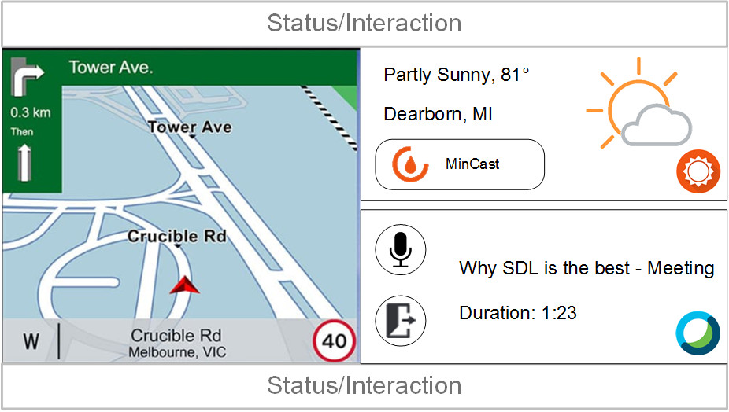
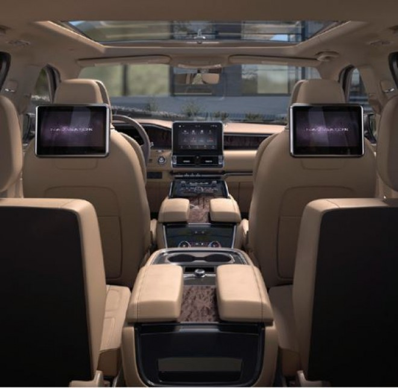
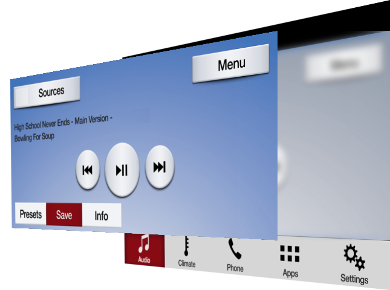
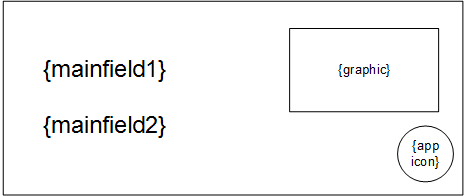
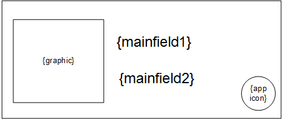

# Widget support

* Proposal: [SDL- 0216](0216-widget-support.md)
* Author: [Ashwin Karemore](https://github.com/ashwink11), [Kujtim Shala](https://github.com/kshala-ford)
* Status: **Awaiting review**
* Impacted Platforms: [Core / iOS / Android / RPC ]

## Introduction

This proposal is about widget support for SDL applications on modern infotainment systems and large displays. At the same time the proposed feature should prepare SDL for multi screen and multi display support. 

## Motivation

As provided in other app platforms, app widgets are useful to quickly interact with apps and features. With modern infotainment systems and larger displays, SDL can offer a small representation of a registered application.

This proposal is focusing on main display widgets, but provides futuristic APIs to control apps on multiple displays.

### Phase 1: Widgets support on single (main) display

This proposal should allow an app to create one or multiple widgets on the single (main) display. Each widget can be individually addressed by the app and the HMI can present widgets on the infotainment display.

The below image shows SYNC3 home screen presenting two widgets with weather and VOIP features. The application itself (and the main screen) are currently not visible, but still the driver can interact with the applications and control the app state and HMI e.g. by requesting weather forecast or by muting/unmuting the VOIP call.



> Figure: "Home" area of the SYNC3 display. Showing widgets from a different apps.

Included in this phase will be a redesign of display capabilities for single display and multi-screen support. The goal is to make SDL ready with multi display support.

### Phase 2: Multi display support

This phase will not be part of this proposal. Providing Widget support has been identified as a concept that can be extended to support multiple displays including clusters, heads up and rear seat entertainment systems. The long-term vision of this proposal is to provide multi-screen and multi-display support. This means that one app should not only be able to have multiple screens of different types on one display, but also address other displays inside the vehicle.



> Figure: Example of having rear seat entertainment system and also a head-up display.

The following sections of the motivation provide brief description of phase 2.

#### Extend display capabilities for multi display

Apps need to be able to request system capabilities regarding displays and seats/users so that apps know about display availability, display type (center stack, cluster, head-up, head-rest etc.), size etc. In addition to display availability, it is required to know the display location relative to available seats (and therefore persons) that can reach and use the display.

Providing display information to the app should be done by extending the system capability for `DISPLAY`. Each display should be identified with a system defined `displayID` so that apps can send requests for overlays to a specific display.

#### Analyzing RPCs and their relation to displays and screens

Today in the vehicle, SDL works as a system with a single main display and a single main app screen. OEMs reuse some assets from the main app screen and present it in other areas in the vehicle. Additionally, OEMs have to analyze and understand how RPCs are affected by having multiple screens with multiple displays. A future proposal will solve how HMI levels will work on multiple displays and what RPCs are specific to  
- system (`RegisterAppInterface`, `CreateInteractionChoiceSet` etc.)
- display (`Alert`, `PerformInteraction`, `AddCommand` etc.)
- screen (`Show`, `SetDisplayLayout` etc.)

#### System

The terminology "system" in this proposal means the system's endpoint, that is running inside the machine where the app connects to. In classical terms this means SDL core, that is running in IVI.

List of RPCs identified as system related: `RegisterAppInterface`, `UnregisterAppInterface`, `SetGlobalProperties`, `ResetGlobalProperties`, `CreateInteractionChoiceSet`, `DeleteInteractionChoiceSet`, `Speak` (and other RPCs with `.ttsChunks`), `SubscribeButton`, `UnsubscribeButton`, `ButtonPress`, `SubscribeVehicleData`, `UnsubscribeVehicleData`, `GetVehicleData`, `ReadDID`, `GetDTCs`, `ChangeRegistration`, `GenericResponse`, `PutFile`, `DeleteFile`, `ListFiles`, `SetAppIcon`, `DiagnosticMessage`, `SystemRequest`, `SendLocation`, `DialNumber`, `UpdateTurnList`, `OnAppInterfaceUnregistered`, `OnButtonEvent`, `OnButtonPress`, `OnVehicleData`, `OnCommand`, `OnTBTClientState`, `GetInteriorVehicleData`, `SetInteriorVehicleData`, `GetWayPoints`, `SubscribeWayPoints`, `UnsubscribeWayPoints`, `GetSystemCapability`, `OnDriverDistraction`, `OnPermissionsChange`, `OnSystemRequest`, `OnHashChange`, `OnInteriorVehicleData`, `OnWayPointChange`, `OnRCStatus`, `OnLanguageChange`

#### Display

A "Display" is a **physical device** mounted on a defined position inside the system's area of work. Today e.g. in Ford vehicles this means the IVI display in the center stack. However, the system should not be limited to a single (implicit) display. SDL should provide an interface to the HMI so that it can provide information to other displays, such as a cluster display, head-up display, rear seat, door panels or widget displays that also act as touch pads. 

The below image shows SYNC3 with an app screen being part of the display. The SYNC3 display in the center stack is the main display of the SDL system. The highlighted area is the viewport of app screens. Each app has one single main app screen that is presented on the SYNC3 display on user selection. Selecting another app will cause the display to show the screen of the other app. If that screen is visible, the app is defined as in HMI level FULL.



> Figure: "Display and Screen" showing a media-app's screen on the SYNC3 main display.

List of RPCs identified as display related: `Alert`, `PerformInteraction`, `PerformAudioPassThru`, `EndAudioPassThru`, `ScrollableMessage`, `Slider`, `ShowConstantTBT`, `AlertManeuver`, `OnAudioPassThru`, `OnKeyboardInput` (for keyboard interactions).

All of the above RPCs should be extended with a `displayID` parameter when adding multi display support. The below example shows how `Alert` should be extended:

```xml
<function name="AlertID" type="Request">
  :
  <param name="displayID" type="Integer" mandatory="false" />
</function>
```

#### Screen

As of today, once an SDL app registers, it gets a main screen allocated by default on the IVI head unit. Strictly speaking, the `Show` RPC is manipulating the content presented in the single main screen. Adding the capability for apps to address a specific screen per Show request allows apps to fill app screens individually.

A "screen" defines a **logical area on a physical display** addressed to an app which connected to the system. Apps can present text, buttons and/or images on screens. The capabilities of the screen are provided to the app which contain information about the number of text lines, number of buttons, and size of images etc.

An app can have multiple screens of different types on a single display. However, screens may change the visibility on a display. Other applications or screens can be brought to focus by the user.

List of screen RPCs:
- `MAIN` screen only: `AddCommand`, `DeleteCommand`, `AddSubMenu`, `DeleteSubMenu`, `SetMediaClockTimer`, `SendHapticData`, `OnKeyboardInput` (for `NAV_KEYBOARD` template), `OnTouchEvent`
- `WIDGET` screen only: none
- Both screen types: `Show`, `SetDisplayLayout`, `OnHMIStatus`

This proposal will only focus on RPCs affecting widgets, which are `Show`, `SetDisplayLayout` and `OnHMIStatus`.

## Proposed solution

The proposed solution is to allow apps to create one or multiple widget screens. Each widget can be individually addressed with text, images and buttons. For convenience it should be possible to enable content duplication from another widget or screen. One app should be allowed to create one or multiple widgets.

It is the OEMs responsibility and decision on how and where widgets will be presented. They could be listed on the IVI home screen, in the apps domain or next to the main app screen area. Just as today, the application should be notified about widget visibility by using HMI levels for widgets.

In order to provide widget support, it is necessary to add APIs to manage and manipulate screens.

### Screen management

In order to work with multiple screens, the app needs to be able to create or delete screens. By adding the RPCs `CreateScreen` and `DeleteScreen`, the app will be able to manage the screen on the main display.

#### Mobile API

```xml
<function name="CreateScreen" messagetype="request" since="5.x">
  <description>
    Create a new screen on the display with the specified screen type.
  </description>
  <param name="screenID" type="Integer" mandatory="true">
    <description>
      A unique ID to identify the screen.
    </description>
  </param>
  <param name="screenName" type="String" maxlength="100" mandatory="true">
     <description>The screen name to be used by the HMI. The name of the precreated default screen will match the app name.</description>
  </param>
  <param name="type" type="ScreenType" mandatory="true">
    <description>The type of the screen to be created. Main screen or widget screen.</description>
  </param>
  <param name="duplicateScreenID" type="Integer" mandatory="false">
    <description>
      Optional parameter. Specify whether the content of an existing screen should be duplicated
      to the created screen.
    </description>
  </param>
</function>

<function name="CreateScreen" messagetype="response" since="5.x">
  <!-- common response params -->
</function>

<function name="DeleteScreen" messagetype="request" since="5.x">
  <description>
    Deletes previously created screen of the SDL application.
  </description>
  <param name="screenID" type="Integer" mandatory="true" />
</function>

<function name="DeleteScreen" messagetype="response" since="5.x">
  <!-- common response params -->
</function>

<enum "ScreenType">
<element name="MAIN">
  <description>
    This Screen type describes the main screen on a display.
  </description>
</element>
<element name="WIDGET">
  <description>
    A widget is a small screen that the app can create to provide information and softbuttons for a quick app control.
  </description>
</element>
</enum>

<enum "PredefinedScreens" since="5.x">
<element name="DEFAULT_SCREEN" value="0">
  <description>
    The default screen is a main screen pre-created on behalfs of the app.
  </description>
</element>
</enum>
```

#### HMI API

The HMI API should contain:
- a copy of the enums `ScreenType` and `PredefinedScreens` in the "Common" interface
- a copy of the functions `CreateScreen` and `DeleteScreen` in the "UI" interface

#### Create & Delete screen

The RPC `CreateScreen` allows an app to create a new screen on the display. The app needs to specify a screen ID that is used for screen manipulation e.g. with the RPC `Show` and the screen type which can either be `MAIN` or `WIDGET` (see sub-section *Screen types*). 

If desired, the apps can duplicate content of an existing screen to the created screen using parameter `duplicateScreenID`. All RPCs sent to the screen with the ID equals `dulicateScreenID` will be duplicated to the created screen. Bidirectional screen content duplication should not be supported. RPCs sent to the creating screen should be rejected by the HMI.

#### Screen types

This proposal contains two types of screens.

The main screen is the full size app screen on a display. It should not be allowed to have multiple main screens on a single display per app. However, with multi display support, an app can have multiple main screens e.g. main screen on the central console and main screen on rear seat entertainment system.

The widget screen is a small screen type to provide quick information and softbuttons. Depending on the app policies, apps can create widgets from any HMI level as allowed by policies (e.g. from HMI_NONE or BACKGROUND). Once the widget is activated by the HMI, apps can send `Show` or `SetDisplayLayout` to add content (text and soft buttons) to that widget. The RPCs sent to the widget follow same policies according to the widget's HMI level. 

Just like push notifications (`Alert` from `HMI_BACKGROUND`), widgets should have effect to the HMI level of the app's main screen in case of `STEAL_FOCUS` soft buttons. If a user taps on a soft button in the widget with `.systemAction = STEAL_FOCUS`, the app's main screen should be activated by the HMI and therefore become HMI_FULL.

#### PredefinedScreens

The enum `PredefinedScreens` specifies what screens and IDs are predefined and pre-created on behalf of the app.

The default screen is always available and represents the app screen on the main display. It's an equivalent to the todays app screen. For backward compatibility, this will ensure the app always has at least the default screen on the main display. The app can choose to use this predefined enum element to specifically address app's main screen or to duplicate screen content. It is not possible to duplicate another screen to the default screen.

#### Screen related `OnHMIStatus`

Today, SDL uses HMI levels to inform an app about the launch state and visibility. In fact, every screen instance of an app should have its own HMI level. The notification `OnHMIStatus` should be extended to address a specific screen.

```xml
<function name="OnHMIStatus" functionID="OnHMIStatusID" messagetype="notification" since="1.0">
  :
  <param name="screenID" type="Integer" mandatory="false" since="5.x" />
</function>    
```

The additional parameter can be used by the system to specify the HMI level of a screen. If the value is omitted, it means the default screen is addressed. For other screens the screen ID specified by the app should be set in this parameter.

If a widget becomes visible on the display, the HMI should notify Core that the widget is activated. Core should then notify the app that the widget is now in HMI_FULL. This can be the case if the user changes the HMI to present the widget area (e.g. the home screen shows app widgets).

Audio streaming state is not related to screens but to system's audible state. To limit the changes in the RPC and support backward compatibility, `audioStreamingState` should be provided to all screens of one app. HMI and SDL core should make sure to send the same audio states to all screens. Example: If a media app has created a widget and then becomes audible, the media app should receive two `OnHMIStatus` notifications for both screens (main and widget) and both audio streaming states are set to `AUDIBLE`. This will ensure a consistent audible state.

Just as today, main and widget screens will receive a notification about their current system context. By default screens system context will be `MAIN`. In case of a voice session the context of all existing screens will be `VRSESSION`. As for main screens, widgets should be told if they are obscured by an Alert of the own application `ALERT` or by any other HMI overlay `HMI_OBSCURED`.

Above requirement to provide system context notifications to widgets requires additions to the HMI_API

```xml
<interface name="UI">
  <function name="OnSystemContext" messagetype="notification">
    <param name="systemContext" type="Common.SystemContext" mandatory="true">
      <description>The context the application is brought into.</description>
    </param>
    <param name="appID" type="Integer" mandatory="false">
      <description>ID of application that is related to this RPC.</description>
    </param>
    <param name="screenID" type="Integer" mandatory="false" /> <!-- new -->
  </function>
```

With adding `screenID` to the system context notification, the HMI can provide individual context state to screens.

#### HMI: widget screen activation

Above requirements regarding modifying the HMI level require modifications to the HMI_API, so that the HMI can inform SDL Core about screen activations.

```xml
<interface name="BasicCommunication">
<function name="OnAppActivated" messagetype="notification">
  :
  <param name="screenID" type="Integer" mandatory="true" /> <-- new -->
</function>
<function name="OnAppDeactivated" messagetype="notification">
  :
  <param name="screenID" type="Integer" mandatory="true" /> <-- new -->
</function>
```

The screen ID is told to the HMI by the app using `CreateScreen`. If a user taps on an app icon to launch the app, the HMI activates the app sending `OnAppActivated` to SDL Core with `screenID = 0` which points to the application's main screen. If a widget becomes visible on the HMI, the HMI should also send `OnAppActivated` but this time using the widget's `screenID`. There could be multiple widgets presented at the same time (from one app or from multiple), which means it can be in HMI_FULL.

With above HMI change the HMI level transitions for main screens and widget screens can be manipulated separately and individually. See the chart below for clarity.


> Figure: The chart shows possible transitions between the HMI levels for main screens and widget screens. It shows that the HMI level transitions are independent from other screens.

### Screen manipulation

The RPC `Show` and `SetDisplayLayout` are identified as the only screen related RPCs apps can send. In order to allow an app to address a specific screen, these two RPCs need to have an optional parameter for the screen ID.

```xml
<function name="Show" functionID="ShowID" messagetype="request" since="1.0">
 :
 :
<param name="screenID" type="Integer" mandatory="false" since="5.x" />
</function>

<function name="SetDisplayLayout" functionID="SetDisplayLayoutID" messagetype="request" since="2.0">
 :
 :
 <param name="screenID" type="Integer" mandatory="false" since="5.x" />
</function>
```

This allows the app to use the full flexibility of the `Show` RPC for main screen as well as for widgets.

As the app can present soft buttons on different locations, it is more important to protect uniqueness of the button IDs. Every soft button ID used by the app should be unique throughout the whole system. Example: If an app developer presents a soft button on the main screen with ID=1, the app must not use the same ID on any other screen. If the app wants to present two buttons for the same button action, the app developer must use a different ID.

### Screen capabilities

The RPCs `RegisterAppInterfaceResponse` and `SetDisplayLayoutResponse` contain parameters about display and screen capabilities including text, image and button capabilities. This approach of providing capabilities is outdated and a new system capability feature is ready to take over. In order to provide a more modern API desgin and ability to resize or reposition screens, this proposal should move metadata out of the repsonse RPCs into a system capability RPC. 

A new system capability type is necessary in order to provide display capabilities.

```xml
<enum name="SystemCapabilityType" since="4.5">
    <element name="DISPLAY" since="5.x" />
</enum>
```

This new type should contain display but also screen capabilities. The following sections are starting with screen capabilities, which is then used by display capabilities. At last, they are coming together in the system capability struct.

#### Struct `ScreenCapability`

Apps requesting the display capabilities can use `GetSystemCapability` and set the capability type to `DISPLAY`. The system capability struct needs to be extended to hold display capabilities. The following `ScreenCapability`struct reflects content of `DisplayCapabilities`, `ButtonCapabilities` and `SoftButtonCapabilities`. 

```xml
<struct name="ScreenCapability" since="5.x">
  <param name="screenID" type="Integer" mandatory="false">
    <description>The specified ID of the screen/widget. Can be set to a predefined screen, or omitted for the main screen on the main display.</description>
  </param>
  <param name="textFields" type="TextField" minsize="1" maxsize="100" array="true" mandatory="false">
    <description>A set of all fields that support text data. See TextField</description>
  </param>
  <param name="imageFields" type="ImageField" minsize="1" maxsize="100" array="true" mandatory="false">
    <description>A set of all fields that support images. See ImageField</description>
  </param>
  <param name="imageTypeSupported" type="ImageType" array="true" minsize="0" maxsize="1000" mandatory="false">
    <description>Provides information about image types supported by the system.</description>
  </param>
  <param name="screenLayoutsAvailable" type="String" minsize="0" maxsize="100" maxlength="100" array="true" mandatory="false">
    <description>A set of all screen layouts available on headunit. To be referenced in SetDisplayLayout.</description>
  </param>
  <param name="numCustomPresetsAvailable" type="Integer" minvalue="1" maxvalue="100" mandatory="false">
    <description>The number of on-screen custom presets available (if any); otherwise omitted.</description>
  </param>
  <param name="buttonCapabilities" type="ButtonCapabilities" minsize="1" maxsize="100" array="true" mandatory="false">
    <description>The number of button and the capabilities of each on-screen button.</description>
  </param>
  <param name="softButtonCapabilities" type="SoftButtonCapabilities" minsize="1" maxsize="100" array="true" mandatory="false">
    <description>The number of soft button available on-screen and the capabilities for each button.</description>
  </param>
</struct>
```

#### Struct `DisplayCapability`

To hold screen capabilities, the display capabilities should contain the display related information and all screens related to that display.

```xml
<struct name="DisplayCapability" since="5.x">
  <param name="displayName" type="String" mandatory="false" />
  <param name="screenCapabilities" type="ScreenCapability" array="true" minsize="1" maxsize="1000" mandatory="false" />
</struct>
```

#### System capabilitiy additions

The above struct needs to be added as a parameter into system capability struct. The parameter needs to be of type array to be ready for multi-display support.

```xml
<struct name="SystemCapability" since="4.5">
  <param name="displayCapabilities" type="DisplayCapability" array="true" minsize="1" maxsize="1000" mandatory="false" />
</struct>
```

#### Deprecate existing params

With above change, it will be possible to deprecate existing parameters in `RegisterAppInterfaceResponse`. Regarding `SetDisplayLayout` it can make sense to refactor the RPC to be called `SetScreenLayout` instead by deprecating the old RPC and creating a new RPC. Deprecation is valid as they all are replaced in favor of display capability over system capability. 

```xml
<function name="RegisterAppInterface" functionID="RegisterAppInterfaceID" messagetype="response" since="1.0">
  <param name="displayCapabilities" type="DisplayCapabilities" mandatory="false" deprecated="true" since="5.x">
    <description>See DisplayCapabilities. This parameter is deprecated and replaced by SystemCapability using DISPLAY.</description>
    <history>
        <param name="displayCapabilities" type="DisplayCapabilities" mandatory="false" until="5.x"/>
    </history>
  </param>
  <param name="buttonCapabilities" type="ButtonCapabilities" minsize="1" maxsize="100" array="true" mandatory="false" deprecated="true" since="5.x">
    <description>See ButtonCapabilities. This parameter is deprecated and replaced by  SystemCapability using DISPLAY.</description >
    <history>
        <param name="buttonCapabilities" type="ButtonCapabilities" minsize="1" maxsize="100" array="true" mandatory="false" until="5.x">
    </history>
  </param>
  <param name="softButtonCapabilities" type="SoftButtonCapabilities" minsize="1" maxsize="100" array="true" mandatory="false" deprecated="true" since="5.x">
    <description>If returned, the platform supports on-screen SoftButtons; see SoftButtonCapabilities.  This parameter is deprecated and replaced by  SystemCapability using DISPLAY.</description >
    <history>
        <param name="softButtonCapabilities" type="SoftButtonCapabilities" minsize="1" maxsize="100" array="true" mandatory="false" since="2.0" until="5.x" />
    </history>
  </param>
  <param name="presetBankCapabilities" type="PresetBankCapabilities" mandatory="false" deprecated="true" since="5.x">
    <description>If returned, the platform supports custom on-screen Presets; see PresetBankCapabilities. This parameter is deprecated and replaced by  SystemCapability using DISPLAY.</description >
    <history>
        <param name="presetBankCapabilities" type="PresetBankCapabilities" mandatory="false" since="2.0" until="5.x" />
    </history>
  </param>
</function>

<function name="SetDisplayLayout" functionID="SetDisplayLayoutID" messagetype="request" deprecated="true" since="5.x">
    <description>this RPC is deprecated in favor of SetScreenLayout</description>
</function>

<function name="SetDisplayLayout" functionID="SetDisplayLayoutID" messagetype="response" deprecated="true" since="5.x">
    <description>this RPC is deprecated in favor of SetScreenLayout</description>
</function>

<function name="SetScreenLayout" functionID="SetScreenLayoutID" messagetype="request" since="5.x">
  <param name="screenLayout" type="String" maxlength="500" mandatory="true">
    <description>
        Predefined or dynamically created screen layout.
        Currently only predefined screen layouts are defined.
    </description>
  </param>

  <param name="dayColorScheme" type="TemplateColorScheme" mandatory="false" />
  <param name="nightColorScheme" type="TemplateColorScheme" mandatory="false" />
</function>

<function name="SetScreenLayout" functionID="SetScreenLayoutID" messagetype="response" since="5.x">
  <param name="info" type="String" maxlength="1000" mandatory="false" platform="documentation">
      <description>Provides additional human readable info regarding the result.</description>
  </param>
  <param name="success" type="Boolean" platform="documentation" mandatory="true">
    <description> true, if successful; false, if failed </description>
  </param>
  <param name="resultCode" type="Result" platform="documentation" mandatory="true">
    <description>See Result</description>
    <element name="SUCCESS"/>
    <element name="INVALID_DATA"/>
    <element name="OUT_OF_MEMORY"/>
    <element name="TOO_MANY_PENDING_REQUESTS"/>
    <element name="APPLICATION_NOT_REGISTERED"/>
    <element name="GENERIC_ERROR"/>
    <element name="REJECTED"/>
    <element name="UNSUPPORTED_REQUEST"/>
  </param>
</function>
```

The information contained in the deprecated parameters will be made available with the newly proposed screen capability struct. In the next major release these parameters can be marked as removed.

> Note: The alternative solution describe how to keep `SetDisplayLayout` and deprecate just the parameters within the response RPC. Above solution to create a new `SetScreenLayout` RPC is more clean to the naming and design, which is why it's the primary proposed solution. Either way works and can be chosen by the steering committee.

#### Automatic subscription to display and screen capabilities

As accepted in the app services proposal, the application can subscribe to system capabilities. With this proposal it would inclde display capabilities. In order to provide display capabilities as soon as possible after the app registered, the application should be automatically subscribed to display capabilities. With this rule, Core should send a system capability notification with display capabilities right after sending the response of the app registration. This approach results in a better performance compared to the need of the app to get/subscribe to display capabilities. Without this approach applications would perform slower as with the todays solution having capabilities being returned in `RegisterAppInterfaceResponse`.

If an app sends `GetSystemCapability` with `DISPLAY` type including `subscribe` flag, Core should ignore a subscription (`subscribe: true`) or unsubscription (`subscribe: false`) and return a message in `GetSystemCapabilityResponse`. It should mention that the `subscribe` parameter is ignored for `DISPLAY` type and that the app is always subscribed to this type. The response should contain the display capability regardless.

Below scenario shows the expected RPCs being send at app registration:

1. App sends `RegisterAppInterface`
2. System responds with `RegisterAppInterfaceResponse`
3. System sends `OnSystemCapability` notification with display capabilities
4. System sends `OnHMIStatus` notification 
5. System sends `OnPermissionsChange` notification

The display capabilities should contain all screen's available immediately after registration. This can be important for app resumption when widgets are reused by a hash ID in the app registration.

Another scenario is changing the layout using `SetScreenLayout`:

1. App sends `SetDisplayLayout`
2. System responds with `SetDisplayLayoutResponse`
3. System sends `OnSystemCapability` notification with display capabilities

Same as on app registration, the notification should return capabilities to all screens created.

With this proposal the scenario of creating a new screen should be similar to set a new layout:

1. App sends `CreateScreen`
2. System responds with `CreateScreenResponse`
3. System sends `OnSystemCapability` notification with display capabilities

Same again, the notification should return capabilities to all screens created.

In all scenarios it should not be necessary for the app to subscribe to screen capabilities.

### Screen templates

Today, SDL comes with a set of predefined templates available. The information for what templates are available for the apps is proposed to be provided in `ScreenCapability.screenLayoutAvailable`.

Details about the currently selected screen template are part of the display capabilities struct:
- text fields, the name, width etc.
- image fields e.g. graphic, or soft button image resolutions

The template design comes from the head unit. However predefined template names are defined in `PredefinedLayout` enum. The head unit should provide template designs for the predefined template names. Still, it can also provide additional custom templates with self defined names.

All this can be reused for widget screens. When creating a new widget screen, the available widget templates are provided in `ScreenCapability.screenLayoutAvailable`.

The details about the currently selected widget template are provided using the same display capabilities struct. It is expected that the HMI will return with fewer text fields (only main field 1 and 2), shorter text field width and smaller image resolutions. This solution reuses the existing API, to provide widget template details as mentioned.

Examples for widget screens:

| template name | Example layout |
|-|-|
| text with graphic  |  |
| graphic with text  |  |
| buttons with graphic |  |

### Policies

With above modification of `OnHMIStatus` the existing policies are compatible to widgets. The policy manager of Core should be modified and use the HMI level of the main screen to evaluate permissions for all RPCs, except screen specific RPCs. In this case the HMI level of the targeting screen should be used for evaluation.

A new functional group should be added that reflects permissions of the new RPCs.

```json
"functional_groupings": {
  …
  "WidgetSupport" : {
      "rpcs":{
          "CreateScreen":{
              "hmi_levels":["NONE","BACKGROUND","LIMITED","FULL"]
          }, 
          "DeleteScreen":{
              "hmi_levels":["NONE","BACKGROUND","LIMITED","FULL"]
          }
      }
  }
}
```

This functional group should be provided to the app developers as a conditional feature, they can request. This should be done on the SmartDeviceLink developer portal when managing the app and the permissions. The web portal needs to have a checkbox additionally to the other checkboxes. The checkbox could be labeled "Allow creating widgets".

### App Resumption

If the app registers with a resumption ID and this ID is recognized by the HMI, all screens created by the application will resume including widgets and their content (text, images and buttons). The `OnSystemCapabilityUpdate` notification will provide information of the resumed screens. 

## Potential downsides

Moving screen metadata will cause more effort for OEMs and app consumers to implement this feature. The metadata needs to be send twice, in the responses but also in the system capability notification. However as the data is basically just a copy it is expected as an acceptable effort in favor of an improved API design.

## Impact on existing code

There are additional RPCs `CreateScreen` and `DeleteScreen` that need to be added. In addition to this `Show`, `SetDisplayLayout` and `OnHMIStatus` need to be extended with a `screenID` parameter.

After investigating impact to SDL Core, the impact is expected to be minor. Global approach remains the same for now. The following items have been identified as affected by this proposal:
1. Changes to RPC service as new RPCs and parameters are introduced
2. Changes to State Controller to allow HMI level transitions for widgets and screens
3. Changes to Request Controller as RPCs from one app can be addressed to different screens

T screen managers should be refactored to read screen capabilities notifications as well as the deprecated parameters.

## Alternatives considered

To reduce complexity on the head unit, screen duplication can be supported by the SDL libraries. This could allow more flexibility to display duplication for existing screens. However this increases the number of RPCs to be sent by the app and the user might see a delay in screen updates (duplication not synchronized).

In order to reduce state machine complexity for widget HMI levels on SDL core side, the HMI can take control of HMI level transitions for widgets. However this might cause different behavior per HMI implementation which could be confusing to developers as the behavior is not consistent.

Instead of only having display capability type it is possible to separate display capability and screen capability in `SystemCapability`. This may allow some benefits avoiding repeating display data when screens have changed. Also it may allow to notify changes only to a specific screen, instead of repeating all screens data.

It is possible to have a manual subscription to display capabilities. This is definitely a possible solution as the SDL managers will perform the capabilities subscription. However, as this subscription will be made for 100% of the apps and as subscribing takes more time sending RPCs it was considered that autosubscription improves performance in this case. Without the automatic subscription, this redesign would perform worse than the current design of returning the information in a response.

Another alternative, similar to above, allows manual subscritpion but with automatic notifications after `RegisterAppInterfaceResponse` and `SetDisplayLayout`, regardless of the subscription. This would allow applications to subscribe, in order to get notified on HMI changes related to the screen caused by the system or the user. Still it provides automatic notifications if the screen related HMI change is caused by the app (e.g. by changing the layout). 

To avoid refactoring `SetDisplayLayout` to `SetScreenLayout` it is possible to just deprecate the parameters of the response.

```xml
<function name="SetDisplayLayout" functionID="SetDisplayLayoutID" messagetype="response" since="3.0">
  <param name="displayCapabilities" type="DisplayCapabilities" mandatory="false" deprecated="true" since="5.x">
    <description>See DisplayCapabilities.  This parameter is deprecated and replaced by screen capabilities.</description>
    <history>
        <param name="displayCapabilities" type="DisplayCapabilities" mandatory="false" until="5.x"/>
    </history>
  </param>
  <param name="buttonCapabilities" type="ButtonCapabilities" minsize="1" maxsize="100" array="true" mandatory="false" deprecated="true" since="5.x">
    <description>See ButtonCapabilities.  This parameter is deprecated and replaced by screen capabilities.</description >
    <history>
        <param name="buttonCapabilities" type="ButtonCapabilities" minsize="1" maxsize="100" array="true" mandatory="false" until="5.x">
    </history>
  </param>
  <param name="softButtonCapabilities" type="SoftButtonCapabilities" minsize="1" maxsize="100" array="true" mandatory="false" deprecated="true" since="5.x">
    <description>If returned, the platform supports on-screen SoftButtons; see SoftButtonCapabilities. This parameter is deprecated and replaced by screen capabilities.</description >
    <history>
        <param name="softButtonCapabilities" type="SoftButtonCapabilities" minsize="1" maxsize="100" array="true" mandatory="false" until="5.x" />
    </history>
  </param>
  <param name="presetBankCapabilities" type="PresetBankCapabilities" mandatory="false" deprecated="true" since="5.x">
    <description>If returned, the platform supports custom on-screen Presets; see PresetBankCapabilities. This parameter is deprecated and replaced by screen capabilities.</description >
    <history>
        <param name="presetBankCapabilities" type="PresetBankCapabilities" mandatory="false" until="5.x" />
    </history>
  </param>
</function>
```