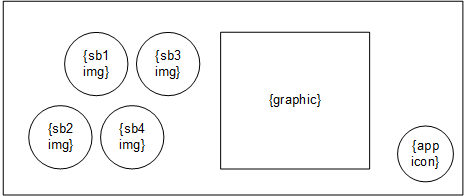

# Widget support

* Proposal: [SDL- 0216](0216-widget-support.md)
* Author: [Ashwin Karemore](https://github.com/ashwink11), [Kujtim Shala](https://github.com/kshala-ford)
* Status: **Awaiting review**
* Impacted Platforms: [Core / iOS / Android / RPC ]

## Introduction

This proposal is about widget support for SDL applications on modern infotainment systems and large displays. At the same time the proposed feature should prepare SDL for multi screen and multi display support. 

## Motivation

As provided in other app platforms, app widgets are useful to quickly interact with apps and features. With modern infotainment systems and larger displays, SDL can offer a small representation of a registered application.

This proposal is focusing on main display widgets, but provides futuristic APIs to control apps on multiple displays.

### Phase 1: Widgets support on single (main) display

This proposal should allow an app to create one or multiple widgets on the single (main) display. Each widget can be individually addressed by the app and the HMI can present widgets on the infotainment display.

The below image shows SYNC3 home screen presenting two widgets with weather and VOIP features. The application itself (and the main screen) are currently not visible, but still the driver can interact with the applications and control the app state and HMI e.g. by requesting weather forecast or by muting/unmuting the VOIP call.


> Figure: "Home" area of the SYNC3 display. Showing widgets from a different apps.

### Phase 2: Multi display support

This phase will not be part of this proposal. Providing Widget support has been identified as a concept that can be extended to support multiple displays including clusters, heads up and rear seat entertainment systems. The long-term vision of this proposal is to provide multi-screen and multi-display support. This means that one app should not only be able to have multiple screens of different types on one display, but also address other displays inside the vehicle.


> Figure: Example of having rear seat entertainment system and also a head-up display.

The following sections of the motivation provide brief description of phase 2.

#### Extend system capabilities

Apps need to be able to request system capabilities regarding displays, screens and seats so that apps know about display availability, display type (center stack, cluster, head-up, head-rest etc.), size etc.

In addition to display availability, it is required to know the display location relative to available seats (and therefore persons) that can reach and use the display.

Providing display information to the app should be done by extending `GetSystemCapability` with a `DISPLAY` capability type. Each display should be identified with a system defined `displayID` so that apps can send requests for overlays to a specific display.

#### Analyzing RPCs and their relation to displays and screens

Today in the vehicle, SDL works as a system with a single main display and a single main app screen. OEMs reuse some assets from the main app screen and present it in other areas in the vehicle. Additionally, OEMs have to analyze and understand how RPCs are affected by having multiple screens with multiple displays. A future proposal will solve how HMI levels will work on multiple displays and what RPCs are specific to  
- system (`RegisterAppInterface`, `CreateInteractionChoiceSet` etc.)
- display (`Alert`, `PerformInteraction`, `AddCommand` etc.)
- screen (`Show`, `SetDisplayLayout` etc.)

#### System

The terminology "system" in this proposal means the system's endpoint is running inside the machine where the app connects to. In classical terms this means SDL core is running in IVI.

List of RPCs identified as system related: `RegisterAppInterface`, `UnregisterAppInterface`, `SetGlobalProperties`, `ResetGlobalProperties`, `CreateInteractionChoiceSet`, `DeleteInteractionChoiceSet`, `Speak` (and other RPCs with `.ttsChunks`), `SubscribeButton`, `UnsubscribeButton`, `ButtonPress`, `SubscribeVehicleData`, `UnsubscribeVehicleData`, `GetVehicleData`, `ReadDID`, `GetDTCs`, `ChangeRegistration`, `GenericResponse`, `PutFile`, `DeleteFile`, `ListFiles`, `SetAppIcon`, `DiagnosticMessage`, `SystemRequest`, `SendLocation`, `DialNumber`, `UpdateTurnList`, `OnAppInterfaceUnregistered`, `OnButtonEvent`, `OnButtonPress`, `OnVehicleData`, `OnCommand`, `OnTBTClientState`, `GetInteriorVehicleData`, `SetInteriorVehicleData`, `GetWayPoints`, `SubscribeWayPoints`, `UnsubscribeWayPoints`, `GetSystemCapability`, `OnDriverDistraction`, `OnPermissionsChange`, `OnSystemRequest`, `OnHashChange`, `OnInteriorVehicleData`, `OnWayPointChange`, `OnRCStatus`, `OnLanguageChange`

#### Display

A "Display" is a **physical device** mounted on a defined position inside the system's area of work. Today e.g. in Ford vehicles this means the IVI display in the center stack. However, the system should not be limited to a single (implicit) display. SDL should provide an interface to the HMI so that it can provide information to other displays, such as a cluster display, head-up display, rear seat, door panels or widget displays that also act as touch pads. 

The below image shows SYNC3 with an app screen being part of the display. The SYNC3 display in the center stack is the main display of the SDL system. The highlighted area is the viewport of app screens. Each app has one single main app screen that is presented on the SYNC3 display on user selection. Selecting another app will cause the display to show the screen of the other app. If that screen is visible, the app is defined as in HMI level FULL.


> Figure: "Display and Screen" showing a media-app's screen on the SYNC3 main display.

List of RPCs identified as display related: `Alert`, `PerformInteraction`, `PerformAudioPassThru`, `EndAudioPassThru`, `ScrollableMessage`, `Slider`, `ShowConstantTBT`, `AlertManeuver`, `OnAudioPassThru`, `OnKeyboardInput` (for keyboard interactions).

All of the above RPCs should be extended with a `displayID` parameter when adding multi display support. The below example shows how `Alert` should be extended:

```xml
<function name="AlertID" type="Request">
  :
  <param name="displayID" type="Integer" mandatory="false" />
</function>
```

#### Screen

As of today, once an SDL app registers, it gets a main screen allocated by default on the IVI head unit. Strictly speaking, the `Show` RPC is manipulating the content presented in the single main screen. Adding the capability for apps to address a specific screen per Show request allows apps to fill app screens individually.

A "screen" defines a **logical area on a physical display** addressed to an app which connected to the system. Apps can present text, buttons and/or images on screens. The capabilities of the screen are provided to the app which contain information about the number of text lines, number of buttons, and size of images etc.

An app can have multiple screens of different types on a single display. However, screens may change the visibility on a display. Other applications or screens can be brought to focus by the user.

List of screen RPCs:
- `MAIN` screen only: `AddCommand`, `DeleteCommand`, `AddSubMenu`, `DeleteSubMenu`, `SetMediaClockTimer`, `SendHapticData`, `OnKeyboardInput` (for `NAV_KEYBOARD` template), `OnTouchEvent`
- `WIDGET` screen only: none
- Both screen types: `Show`, `SetDisplayLayout`, `OnHMIStatus`

This proposal will only focus on RPCs affecting widgets, which are `Show`, `SetDisplayLayout` and `OnHMIStatus`.

## Proposed solution

The proposed solution is to allow apps to create one or multiple widget screens. Each widget can be individually addressed with text, images and buttons. For convenience it should be possible to enable content duplication from another widget or screen. One app should be allowed to create one or multiple widgets.

It is the OEMs responsibility and decision on how and where widgets will be presented. They could be listed on the IVI home screen, in the apps domain or next to the main app screen area. Just as today, the application should be notified about widget visibility by using HMI levels for widgets.

In order to provide widget support, it is necessary to add APIs to manage and manipulate screens.

### Screen management

In order to work with multiple screens, the app needs to be able to create or delete screens. By adding the RPCs `CreateScreen` and `DeleteScreen`, the app will be able to manage the screen on the main display.

#### Mobile API

```xml
<function name="CreateScreen" messagetype="request" since="5.1">
  <description>
    Create a new screen on the display with the specified screen type.
  </description>
  <param name="screenID" type="Integer" mandatory="true">
    <description>
      A unique ID to identify the screen.
    </description>
  </param>
  <param name="type" type="ScreenType" mandatory="true" />
  <param name="duplicateScreenID" type="Integer" mandatory="false">
    <description>
      Optional parameter. Specify whether the content of an existing screen should be duplicated
      to the created screen.
    </description>
  </param>
</function>

<function name="CreateScreen" messagetype="response" since="5.1">
  <!-- common response params -->
  <param name="displayCapabilities" type="DisplayCapabilities" mandatory="false" />
  <param name="buttonCapabilities" type="ButtonCapabilities" minsize="1" maxsize="100" array="true" mandatory="false" />
  <param name="softButtonCapabilities" type="SoftButtonCapabilities" minsize="1" maxsize="100" array="true" mandatory="false" />
  <param name="presetBankCapabilities" type="PresetBankCapabilities" mandatory="false" />
</function>

<function name="DeleteScreen" messagetype="request" since="5.1">
  <description>
    Deletes previously created screen of the SDL application.
  </description>
  <param name="screenID" type="Integer" mandatory="true" />
</function>

<function name="DeleteScreen" messagetype="response" since="5.1">
  <!-- common response params -->
</function>

<enum "ScreenType">
<element name="MAIN">
  <description>
    This Screen type describes the main screen on a display.
  </description>
</element>
<element name="WIDGET">
  <description>
    A widget is a small screen that the app can create to provide information and softbuttons for a quick app control.
  </description>
</element>
</enum>

<enum "PredefinedScreens" since="5.1">
<element name="DEFAULT_SCREEN" value="0">
  <description>
    The default screen is a main screen pre-created on behalfs of the app.
  </description>
</element>
</enum>
```

#### HMI API

The HMI API should contain:
- a copy of the enums `ScreenType` and `PredefinedScreens` in the "Common" interface
- a copy of the functions `CreateScreen` and `DeleteScreen` in the "UI" interface

#### Create & Delete screen

The RPC `CreateScreen` allows an app to create a new screen on the display. The app needs to specify a screen ID that is used for screen manipulation e.g. with the RPC `Show` and the screen type which can either be `MAIN` or `WIDGET` (see sub-section *Screen types*). 

If desired the apps can duplicate content of an existing screen to the created screen using parameter `duplicateScreenID`. All RPCs sent to the screen with the ID equals `dulicateScreenID` will be duplicated to the created screen. Bidirectional screen content duplication should not be supported. RPCs sent to the creating screen will not be duplicated to the screen with ID matching `duplicateScreenID`. 

After a screen is successfully created, the response will contain information and capabilities about the created screen. These capabilities will be provided by using the capabilities structure as it is used today. These capabilities include:
- Number of text fields available
- Number of buttons available
- Image fields available and their capabilities (resolution)
- Templates available
- etc.

#### Screen types

This proposal contains two types of screens.

The main screen is the full size app screen on a display. It should not be allowed to have multiple main screens on a single display per app. However, with multi display support, an app can have multiple main screens e.g. main screen on the central console and main screen on rear seat entertainment system.

The widget screen is a small screen type to provide quick information and softbuttons. Depending on the app policies, apps can create widgets from any HMI level as allowed by policies (e.g. from HMI_NONE or BACKGROUND). Once the widget is activated by the HMI, apps can send `Show` or `SetDisplayLayout` to add content (text and soft buttons) to that widget. The RPCs sent to the widget follow same policies according to the widget's HMI level. 

Just like push notifications (`Alert` from `HMI_BACKGROUND`), widgets should have effect to the HMI level of the app's main screen in case of `STEAL_FOCUS` soft buttons. If a user taps on a soft button in the widget with `.systemAction = STEAL_FOCUS`, the app's main screen should be activated by the HMI and therefore become HMI_FULL.

#### PredefinedScreens

The enum `PredefinedScreens` specifies what screens and IDs are predefined and pre-created on behalf of the app.

The default screen is always available and represents the app screen on the main display. It's an equivalent to the todays app screen. For backward compatibility, this will ensure the app always has at least the default screen on the main display. The app can choose to use this predefined enum element to specifically address app's main screen or to duplicate screen content. It is not possible to duplicate another screen to the default screen.

#### Screen related `OnHMIStatus`

Today, SDL uses HMI levels to inform an app about the launch state and visibility. In fact, every screen instance of an app should have its own HMI level. The notification `OnHMIStatus` should be extended to address a specific screen.

```xml
<function name="OnHMIStatus" functionID="OnHMIStatusID" messagetype="notification" since="1.0">
  :
  <param name="screenID" type="Integer" mandatory="false" since="5.1" />
</function>    
```

The additional parameter can be used by the system to specify the HMI level of a screen. If the value is omitted, it means the default screen is addressed. For other screens the screen ID specified by the app should be set in this parameter.

If a widget becomes visible on the display, the HMI should notify Core that the widget is activated. Core should then notify the app that the widget is now in HMI_FULL. This can be the case if the user changes the HMI to present the widget area (e.g. the home screen shows app widgets).

Audio streaming state is not related to screens but to system's audible state. To limit the changes in the RPC and support backward compatibility, `audioStreamingState` should be provided to all screens of one app. HMI and SDL core must make sure to send the same audio states to all screens. Example: If a media app has created a widget and then becomes audible, the media app should receive two `OnHMIStatus` notifications for both screens (main and widget) and both audio streaming states are set to `AUDIBLE`.

The parameter system context makes sense for main screens to inform an app if the user entered the menu or started VR session. Knowing the system context of a widget may not be necessary. Therefore every widget's systemContext is always `MAIN`.

#### HMI: widget screen activation

Above requirements regarding modifying the HMI level require modifications to the HMI_API, so that the HMI can inform SDL Core about screen activations.

```xml
<interface name="BasicCommunication">
<function name="OnAppActivated" messagetype="notification">
  :
  <param name="screenID" type="Integer" mandatory="true" /> <-- new -->
</function>
<function name="OnAppDeactivated" messagetype="notification">
  :
  <param name="screenID" type="Integer" mandatory="true" /> <-- new -->
</function>
```

The screen ID is told to the HMI by the app using `CreateScreen`. If a user taps on an app icon to launch the app, the HMI activates the app sending `OnAppActivated` to SDL Core with `screenID = 0` which points to the application's main screen. If a widget becomes visible on the HMI, the HMI should also send `OnAppActivated` but this time using the widget's `screenID`. There could be multiple widgets presented at the same time (from one app or from multiple), which means it can be in HMI_FULL.

### Screen manipulation

The RPC `Show` and `SetDisplayLayout` are identified as the only screen related RPCs apps can send. In order to allow an app to address a specific screen, these two RPCs need to have an optional parameter for the screen ID.

```xml
<function name="Show" functionID="ShowID" messagetype="request" since="1.0">
 :
 :
<param name="screenID" type="Integer" mandatory="false" since="5.1" />
</function>

<function name="SetDisplayLayout" functionID="SetDisplayLayoutID" messagetype="request" since="2.0">
 :
 :
 <param name="screenID" type="Integer" mandatory="false" since="5.1" />
</function>
```

This allows the app to use the full flexibility of the `Show` RPC for main screen as well as for widgets.

As the app can present soft buttons on different locations, it is more important to protect uniqueness of the button IDs. Every soft button ID used by the app should be unique throughout the whole system. Example: If an app developer presents a soft button on the main screen with ID=1, the app must not use the same ID on any other screen. If the app wants to present two buttons for the same button action, the app developer must use a different ID.

### Screen templates

Today, SDL comes with a set of predefined templates available. The information for what templates are available for the apps is provided in 
- `RegisterAppInterfaceResponse.displayCapabilities.templatesAvailable` and 
- `SetDisplayLayoutResponse.displayCapabilities.templatesAvailable`.

Details about the currently selected screen template are part of the display capabilities struct:
- text fields, the name, width etc.
- image fields e.g. graphic, or soft button image resolutions

The template design comes from the head unit. However predefined template names are defined in `PredefinedLayout` enum. The head unit should provide template designs for the predefined template names. Still, it can also provide additional custom templates with self defined names.

All this can be reused for widget screens. When creating a new widget screen the available widget templates are provided in `CreateScreenResponse.displayCapabilities.templatesAvailable`.

The details about the currently selected widget template are provided using the same display capabilities struct. It is expected that the HMI will return with fewer text fields (only main field 1 and 2), shorter text field width and smaller image resolutions. This solution reuses the existing API, to provide widget template details as mentioned.

Examples for widget screens:

| template name | Example layout |
|-|-|
| text with graphic  |  |
| graphic with text  |  |
| buttons with graphic |  |

### Screen type capabilities

In order to inform the app what screen types are supported, the struct `DisplayCapabilities` should be extended with a single optional parameter called `screenTypeCapabilities`.

```xml
<struct name="ScreenTypeCapabilities" since="5.1">
  <param name="type" type="ScreenType" mandatory="true" />
  <param name="maximumNumberOfScreens" type="Integer" mandatory="true" />
</struct>

<struct name="DisplayCapabilities" since="2.0">
 :
 <param name="screenTypeCapabilities" type="ScreenTypeCapabilities" array="true" minsize="1" mandatory="false" since="5.1">
   <description>
    Informs the application how many screens the app is allowed to create per type. 
   </description>
 </param>
</struct>
```

This parameter informs the app how many screens per type are supported. The OEM decides on how many screens should be displayed. Example: 1 main screen and 6 widgets.

### Policies

With above modification of `OnHMIStatus` the existing policies are compatible to widgets. The policy manager should be modified and use the HMI level of the main screen to evaluate permissions for all RPCs, except screen specific RPCs. In this case the HMI level of the targeting screen should be used for evaluation.

## Potential downsides

No downsides identified.

## Impact on existing code

There are additional RPCs `CreateScreen` and `DeleteScreen` that need to be added. In addition to this `Show`, `SetDisplayLayout` and `OnHMIStatus` need to be extended with a `screenID` parameter.

After investigating impact to SDL Core, the impact is expected to be minor. Global approach remains the same for now. The following items have been identified as affected by this proposal:
1. Changes to RPC service as new RPCs and parameters are introduced
2. Changes to State Controller to allow HMI level transitions for widgets and screens
3. Changes to Request Controller as RPCs from one app can be addressed to different screens

## Alternatives considered

To reduce complexity on the head unit, screen duplication can be supported by the SDL libraries. This could allow more flexibility to  display duplication for existing screens. However this increases the number of RPCs to be sent by the app and the user might see a delay in screen updates (duplication not synchronized).

In order to reduce state machine complexity for widget HMI levels on SDL core side, the HMI can take control of HMI level transitions for widgets. However this might cause different behavior per HMI implementation which could be confusing to developers as the behavior is not consistent.
