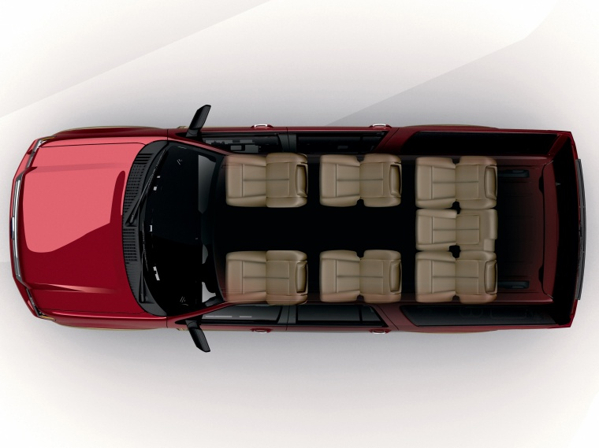
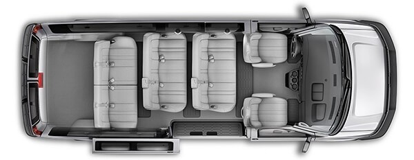

# Remote Control - Allow Multiple Modules per Module Type

* Proposal: [SDL-0221](0221-multiple-modules.md)
* Author: [Zhimin Yang](https://github.com/smartdevicelink/yang1070)
* Status: **Accepted with Revisions**
* Impacted Platforms: [Core / iOS / Java Suite / RPC]

## Introduction
SDL remote control baseline proposal [SDL-0071](https://github.com/smartdevicelink/sdl_evolution/blob/master/proposals/0071-remote-control-baseline.md) groups available controllable items of the same category into a RC module type. SDL defines six module types: `RADIO`, `CLIMATE`, `AUDIO`, `LIGHT`, `HMI_SETTINGS` and `SEAT`. SDL allows only one module per module type so far. However, there are production needs to support multiple modules of the same module type. For example, some vehicles in the market are equipped with "dual-zone" climate control systems. There are also ["tri-zone" or even "quad-zone" climate control](https://www.autotrader.com/car-info/definitions-dual-zone-climate-control-211783) in the existing vehicles. Some vehicles in the market have seat control for several seats (driver's seat, front passenger's seat for example). Some vehicles have both a default entertainment system and a back seat entertainment system. There are car headrest monitors, seat back monitors, car roof mount monitors and flip down screens. Passengers can use a back seat entertainment system to play video, audio or even games. 


## Motivation
To allow SDL to support multiple modules of the same module type, SDL needs a module id parameter.

## Proposed solution

In the existing remote control capabilities data structures, for example, ClimateControlCapabilities, they define a parameter called `moduleName`. It is a friendly name of the module. It tells what the module is about. However, it is not supposed to be used as an identifier of a module.  SDL needs a way to identify a module if the vehicle supports multiple modules of the same type.

This proposal adds a new optional parameter `ModuleInfo` to the existing data structures to help identify the module. The `moduleId` within `ModuleInfo` and the `moduleType` together will uniquely identify a module. The `moduleId` is internal between the app and the system. The end user may not be aware of the `moduleId` at all.

```xml
<struct name="ModuleInfo" since="5.x">
    <description>Information about a RC module</description>
    <param name="moduleId" type="String" maxlength="100" mandatory="true">
        <description> uuid of a module. "moduleId + moduleType" uniquely identify a module.<description>
    </param>
    <param name="location" type="Grid" mandatory="false">
       <description>Location of a module.<description>
    </param>
    <param name="serviceArea" type="Grid" mandatory="false">
       <description>Service area of a module. <description>
    </param>
    <param name="allowMultipleAccess" type="Boolean" mandatory="false" defValue="true">
        <description>allow multiple users/apps to access the module or not <description>
    </param>
</struct>
```

The `ModuleInfo` serves two purposes. First, its mandatory parameter `moduleId` is used as an ID helper for a RC module within a module type. Second, it has additional information about the RC module. 

`location` indicates where the module is located. 

`serviceArea` indicates the service area or the coverage area of a module. For example, a seat control covers only one seat. The location and the service area of a seat control module are the same. A radio control serves all passengers in the vehicle. Its service area will cover its own physical location as well as other locations in the vehicle.  If a `serviceArea` is not included, it is assumed the `serviceArea` is the same as `location`. If both are not included, it is assumed that they cover the whole area of the vehicle.

Flag `allowMultipleAccess` indicates whether a RC module can be accessed by multiple users or exclusively used by a user. In general, examples of shared module types are `RADIO`, `AUDIO`, `LIGHT` and `HMI`. An example of exclusive module types is `SEAT`. Depending on single climate zone or multiple climate zone support, a module with `CLIMATE` module type can be shared or exclusive.

It is suggested that the HMI always includes all parameters in capabilities even if they are defined as optional.

Ideally, `ModuleInfo` shall also include a `moduleType` parameter and a `moduleName` parameter. However, moving the existing mandatory parameters from other data types into the new data type will cause a breaking change.

The new parameter `moduleInfo` is added to the data type `Xyz-ControlCapabilities`, which is in the response of `GetSystemCapabilites` and in the `OnSystemCapabilityUpdated` notifications. Where the `Xyz` in `Xyz-ControlCapabilities` can be any of the existing 6 module types. When an app receives the remote control capabilities, it shall remember the capabilities and it might show a map on the mobile device to the user indicating where a module is and a module's coverage so that the user can choose a module to control. When the app sends a `GetInteriorVehicleData` or a `SetInteriorVehicleData` request, it shall use the `moduleId` together with the `moduleType` to identify a module. Instead of sending the whole `moduleInfo` data, only the `moduleId` string is needed. Valid module IDs are those published by the `GetSystemCapabilites` response or `OnSystemCapabilityUpdated` notifications.


```xml
<struct name="ModuleData" since="4.5">
    <description>The moduleType indicates which type of data should be changed and identifies which data object exists in this struct. For example, if the moduleType is CLIMATE then a "climateControlData" should exist</description>
    <param name="moduleType" type="ModuleType" mandatory="true">
    </param>
+   <param name="moduleId" type="String" maxlength="100" mandatory="false" since="5.x">
+      <description>Id of a module, published by System Capability. <description>
+   </param>
    <param name="radioControlData" type="RadioControlData" mandatory="false">
    </param>
    <param name="climateControlData" type="ClimateControlData" mandatory="false">
    </param>
    <param name="seatControlData" type="SeatControlData" mandatory="false" since="5.0">
    </param>
    <param name="audioControlData" type="AudioControlData" mandatory="false" since="5.0">
    </param>
    <param name="lightControlData" type="LightControlData" mandatory="false" since="5.0">
    </param>
    <param name="hmiSettingsControlData" type="HMISettingsControlData" mandatory="false" since="5.0">
    </param>
</struct>
```
The `moduleId` is defined as optional in order to keep backward compatibility. If it is not included in the mobile request, SDL shall replace it with a default `moduleId` for each supported module type. The default `moduleId` is the first item published by `Xyz-ControlCapabilities`. HMI shall make sure it publishes a correct `Xyz-ControlCapabilities`.

In addition, this proposal deprecates the `SupportedSeat` Enumeration and parameter `id` in `SeatControlData` in order to get a uniformed solution.

If a mobile app uses the `SupportedSeat` and no `moduleId` in a RPC request, SDL shall forward the request as is to HMI, HMI shall automatically convert seat `id=DRIVER` to the `moduleId` that corresponds to the driver’s seat module, and seat `id=FRONT_PASSENGER` to the `moduleId` that corresponds to the front passenger's seat.

### Define the Grid

This proposal introduces a coordinate system, which divides the space of the vehicle into smaller areas or grids. Each grid has its coordinates (for example column, row in a two-dimensional surface, or column, row and level in a three-dimensional space) and maps to a physical location within or outside a vehicle.  In order to customize the size of the grid, the spans for each dimension are also needed. This proposal assumes left front corner in the bottom level is the origin (0, 0, 0). Negative column/row/level means left/front/bottom outside of the vehicle. 


```xml
<struct name="Grid" since="5.x">
    <description>Describes a location (origin coordinates and span) of a vehicle component.</description>
    <param name="col" type="Integer" mandatory="true" minvalue="-1" maxvalue="100">
    </param>
    <param name="row" type="Integer"  mandatory="true" minvalue="-1" maxvalue="100">
    </param>
    <param name="level" type="Integer" mandatory="false"  defvalue="0" minvalue="-1" maxvalue="100" >
    </param>
    <param name="colspan" type="Integer" mandatory="false" defvalue="1" minvalue="1" maxvalue="100">
    </param>
    <param name="rowspan" type="Integer" mandatory="false" defvalue="1" minvalue="1" maxvalue="100">
    </param>
    <param name="levelspan" type="Integer" mandatory="false" defvalue="1" minvalue="1" maxvalue="100">
    </param>
</struct>
```

For example, in a regular sedan with two rows, three columns and one level. The following image and table show the positions and the grid of each seat.


| col=-1, row=-1  | col=0 | col=1 | col=2 |
| --- | --- | --- | --- |
| row=0 | driver's seat: {col=0, row=0, level=0, colspan=1, rowspan=1, levelspan=1} |   | front passenger's seat : {col=2, row=0, level=0, colspan=1, rowspan=1, levelspan=1}|
| row=1 | rear-left seat : {col=0, row=1, level=0, colspan=1, rowspan=1, levelspan=1}| rear-middle seat :  {col=1, row=1, level=0, colspan=1, rowspan=1, levelspan=1} | rear-right seat : {col=2, row=1, level=0, colspan=1, rowspan=1, levelspan=1} |

Please note grids can be overlapping. A grid that covers the completely internal area of the above two-row three-column vehicle can be {col=0, row=0, colspan=3, rowspan=2}.

The following images and tables show the positions of each seat in popular 7-seat and 12-seat configurations with 3x3 and 4x4 grids.



| col=-1, row=-1  | col=0 | col=1 | col=2 |
| --- | --- | --- | --- |
| row=0 | driver's seat: 0A  |   | front passenger's seat : 0C |
| row=1 | 1A |  |  1C  |
| row=2 | 2A | 2B |  2C  |



| col=-1, row=-1  | col=0 | col=1 | col=2 | col=3 
| --- | --- | --- | --- | --- | 
| row=0 | driver's seat: 0A  |  |  | front passenger's seat : 0D |
| row=1 | 1A | 1B |  1C  | |
| row=2 | 2A | 2B |  2C  | |
| row=3 | 3A | 3B |  3C  | 3D |


 The vehicle HMI needs to publish how many rows, columns and levels are available for the vehicle and the list of modules in some properly defined grids. This proposal proposes to publish the row number, column number and level number in a new `SeatLocationCapability`, which also includes all the seats installed and their locations. An app might use this information to show a user a seat map on the mobile device. Note, there is no `id` parameter defined here. 


```xml
<struct name="SeatLocation" since="5.x">
    <description>Describes the location of a seat.</description>
    <param name="grid" type="Grid"  mandatory="false">
        <description>HMI shall include this parameter when publishing seat locations in capabilities. App shall include it even if it is optional.</description>
    </param>
</struct>
```

### How to use the new parameter

Examples:
- To read/get module data for a specific moduleType and moduleId.
- To subscribe or unsubscribe data change notifications for a specific moduleType and moduleId.
- To control/update module data for a specific moduleType and moduleId.
- To notify that a module is allocated to an app.
- To request permissions for a specific moduleType and moduleId.


### SDL core changes

SDL core needs to allocate resources by a module (moduleId + moduleType), not just by module type only anymore.

SDL core needs to cache data for each module (moduleId + moduleType).

SDL core and HMI need to validate `moduleId` string against remote control capabilities. A valid moduleId means it is published by the HMI via remote control capabilities.

### Missing moduleId

SDL core and HMI shall treat a missing moduleId (older version API) as the default moduleId for the module type. It is up to the HMI to determine what moduleId is the default id for the module type and publish it as the first item in `Xyz-ControlCapabilities`.


- Remote control capabilities

HMI shall always provide a moduleId and service area in the capabilities when it supports multiple modules per module type. 

- GetInteriorVehicleData/SetInteriorVehicleData request and response

If the optional moduleId is provided in a `GetInteriorVehicleData`/`SetInteriorVehicleData` request, SDL core shall either forward the request to HMI if it is a valid moduleId or reject the request if it is an invalid moduleId. 


If the optional moduleId is not provided in a `GetInteriorVehicleData`/`SetInteriorVehicleData` request, and if there is at least one module (published by capabilities) of the same module type, SDL core shall use the default `moduleId` (the first item) when processing the request. 

In all cases, HMI/SDL must always include a moduleId in the response even if it is optional and only change/return the data for the requested moduleId. SDL core shall cache the module data for this moduleId + moduleType and forward the response to the mobile.

- OnInteriorVehicleData notifications

HMI and SDL core shall always include a moduleId for a `ModuleData` in an `OnInteriorVehicleData` notification. SDL core shall update the cache.

- OnRCStatus notifications and module allocation

SDL core shall always include a moduleId for each and every `ModuleData` in `allocatedModules` and `freeModules` in an `OnRCStatus` notification.


#### Policy Update
This proposal does not propose any change to the policy.

Consider a simple policy extension that is similar to "moduleType", which adds a list of allowed module types to an app's policy, we might add a list of allowed module IDs as the example below.

```json
app_policies": {
  "xyz app": {
      ....
      "moduleType": ["RADIO", "CLIMATE"],
      "moduleId": ["id1", "id2", "id3"]
   }
}
```

However, we think it is unnecessary in the current stage. When an app partner develops a remote control SDL app to control seats for example, the expectation is to be able to control all available seats by default. At run time, there might be permission pop ups or a permission settings screen for the driver to give permissions to an app used by the users sitting in the rear seats to control their own seats. The policy server will not be able to configure that an app can access only certain seats statically.

That shall be a different proposal if there is a need to give permissions for moduleId in the policy.


#### Mobile and HMI API

HMI API is similar to but not the same as the mobile API.


```xml
<struct name="ClimateControlCapabilities" since="4.5">
    <description>Contains information about a climate control module's capabilities.</description>
-   <!-- need an ID in the future -->
    <param name="moduleName" type="String" maxlength="100" mandatory="true">
        <description>The short friendly name of the climate control module.
            It should not be used to identify a module by mobile application.</description>
    </param>
+   <param name="moduleInfo" type="ModuleInfo" mandatory="false" since="5.x">
+      <description>Information about a RC module, including its id. <description>
+   </param>
    ...
</struct>

<struct name="RadioControlCapabilities" since="4.5">
    <description>Contains information about a radio control module's capabilities.</description>
-   <!-- need an ID in the future -->
    <param name="moduleName" type="String" maxlength="100" mandatory="true">
        <description>
            The short friendly name of the climate control module.
            It should not be used to identify a module by mobile application.
        </description>
    </param>
+   <param name="moduleInfo" type="ModuleInfo" mandatory="false" since="5.x">
+      <description>Information about a RC module, including its id. <description>
+   </param>
    ...
</struct>

<struct name="ButtonCapabilities" since="1.0">
    <description>Contains information about a button's capabilities.</description>
    <param name="name" type="ButtonName" mandatory="true">
        <description>The name of the button. See ButtonName.</description>
    </param>
+   <param name="moduleInfo" type="ModuleInfo" mandatory="false" since="5.x">
+      <description>Information about a RC module, including its id. <description>
+   </param>
    ...
</struct>

<struct name="AudioControlCapabilities" since="5.0">
    <param name="moduleName" type="String" maxlength="100" mandatory="true">
        <description>
            The short friendly name of the light control module.
            It should not be used to identify a module by mobile application.
        </description>
    </param>
+   <param name="moduleInfo" type="ModuleInfo" mandatory="false" since="5.x">
+      <description>Information about a RC module, including its id. <description>
+   </param>
    ...
</struct>

<struct name="HMISettingsControlCapabilities" since="5.0">
    <param name="moduleName" type="String" maxlength="100" mandatory="true">
        <description>
          The short friendly name of the HMI setting module.
          It should not be used to identify a module by mobile application.
        </description>
    </param>
+   <param name="moduleInfo" type="ModuleInfo" mandatory="false" since="5.x">
+      <description>Information about a RC module, including its id. <description>
+   </param>
    ...
</struct>


<struct name="LightControlCapabilities" since="5.0">
    <param name="moduleName" type="String" maxlength="100" mandatory="true">
        <description>
            The short friendly name of the light control module.
            It should not be used to identify a module by mobile application.
        </description>
    </param>
+   <param name="moduleInfo" type="ModuleInfo" mandatory="false" since="5.x">
+      <description>Information about a RC module, including its id. <description>
+   </param>
    ...
</struct>   
    
<struct name="SeatControlCapabilities" since="5.0">
    <param name="moduleName" type="String" maxlength="100"  mandatory="true">
        <description>
        The short friendly name of the light control module.
        It should not be used to identify a module by mobile application.
        </description>
    </param>
+   <param name="moduleInfo" type="ModuleInfo" mandatory="false" since="5.x">
+      <description>Information about a RC module, including its id. <description>
+   </param>
    ...
</struct>


<struct name="SeatControlData" since="5.0">
    <description>Seat control data corresponds to "SEAT" ModuleType. </description>
-   <param name="id" type="SupportedSeat" mandatory="true"></param>
+   <param name="id" type="SupportedSeat" mandatory="true" deprecated=true since=5.x></param>
    ...
</struct>

-<enum name="SupportedSeat" since="5.0">
+<enum name="SupportedSeat" deprecated=true since="5.x">
  <description>List possible seats that is a remote controllable seat.</description>
  <element name="DRIVER"/>
  <element name="FRONT_PASSENGER"/>
</enum>


<struct name="ModuleData" since="4.5">
    <description>The moduleType indicates which type of data should be changed and identifies which data object exists in this struct. For example, if the moduleType is CLIMATE then a "climateControlData" should exist</description>
    <param name="moduleType" type="ModuleType" mandatory="true">
    </param>
+   <param name="moduleId" type="String" maxlength="100" mandatory="false" since="5.x">
+      <description>Id of a module, published by System Capability. <description>
+   </param>
    <param name="radioControlData" type="RadioControlData" mandatory="false">
    </param>
    <param name="climateControlData" type="ClimateControlData" mandatory="false">
    </param>
    <param name="seatControlData" type="SeatControlData" mandatory="false" since="5.0">
    </param>
    <param name="audioControlData" type="AudioControlData" mandatory="false" since="5.0">
    </param>
    <param name="lightControlData" type="LightControlData" mandatory="false" since="5.0">
    </param>
    <param name="hmiSettingsControlData" type="HMISettingsControlData" mandatory="false" since="5.0">
    </param>
</struct>

<function name="GetInteriorVehicleData" functionID="GetInteriorVehicleDataID" messagetype="request" since="4.5">
    <param name="moduleType" type="ModuleType" mandatory="true">
        <description>
            The type of a RC module to retrieve module data from the vehicle.
            In the future, this should be the Identification of a module.
        </description>
    </param>
+   <param name="moduleId" type="String" maxlength="100" mandatory="false" since="5.x">
+      <description>Id of a module, published by System Capability. <description>
+   </param>
    <param name="subscribe" type="Boolean" mandatory="false" since="4.5.1">
+       <description since="5.x">
+           If subscribe is true, the head unit will register OnInteriorVehicleData notifications for the requested module (moduleId and moduleType).
+           If subscribe is false, the head unit will unregister OnInteriorVehicleData notifications for the requested module (moduleId and moduleType).
+           If subscribe is not included, the subscription status of the app for the requested module (moduleId and moduleType) will remain unchanged.
        </description>
        <history>
            <param name="subscribe" type="Boolean" mandatory="false" defvalue="false" since="4.5" until="4.5.1"/>
            <description since="4.5" until="5.x">
            If subscribe is true, the head unit will register onInteriorVehicleData notifications for the requested moduleType.
            If subscribe is false, the head unit will unregister onInteriorVehicleData notifications for the requested moduleType.
            If subscribe is not included, the subscription status of the app for the requested moduleType will remain unchanged.
            </description>
        </history>
    </param>
</function>

<enum name="SystemCapabilityType" since="4.5">
    <description>Enumerations of all available system capability types</description>
    <element name="NAVIGATION"/>
    <element name="PHONE_CALL"/>
    <element name="VIDEO_STREAMING"/>
    <element name="REMOTE_CONTROL"/>
    <element name="APP_SERVICES" since="5.1"/>
+   <element name="SEAT_LOCATION" since="5.x"/>
</enum>

<struct name="SystemCapability" since="4.5">
    ...
+    <param name="seatLocationCapability" type="SeatLocationCapability" mandatory="false" since="5.x">
+        <description>Contains information about the locations of each seat</description>
+    </param>
</struct>

<struct name="SeatLocationCapability" since="5.x">
    <description>Contains information about the locations of each seat</description>
    <param name="rows" type="Integer" minvalue="1" maxvalue="100" mandatory="false">
    <param name="columns" type="Integer" minvalue="1" maxvalue="100" mandatory="false">
    <param name="levels" type="Integer" minvalue="1" maxvalue="100" defValue="1" mandatory="false">   
    </param>
+    <param name="seats" type="SeatLocation" array="true" mandatory="false">
+        <description>Contains a list of SeatLocation in the vehicle</description>
+    </param>
</struct>

<struct name="SeatLocation" since="5.x">
    <description>Describes the location of a seat.</description>
    <param name="grid" type="Grid"  mandatory="false">
    </param>
</struct>

```

The following HMI API needs an update and needs to be added to mobile API.

```xml
<function name="GetInteriorVehicleDataConsent" messagetype="request">
-    <description>Sender: SDL->HMI. </description>
    <description>HMI is expected to display a permission prompt to the driver showing the RC module and app details (for example, app's name).
    The driver is expected to have an ability to grant or deny the permission.</description>
    <param name="moduleType" type="Common.ModuleType" mandatory="true">
      <description>The module type that the app requests to control.</description>
    </param>
+   <param name="moduleIds" type="String" maxlength="100" array="true" mandatory="false">
+      <description>Ids of a module of same type, published by System Capability. <description>
+   </param>
+    <param name="userLocation" type="SeatLocation" mandatory="false">
+      <description>Location of the user's seat. <description>
+   </param>
    <param name="appID" type="Integer" mandatory="true">
      <description>ID of the application that triggers the permission prompt.</description>
    </param>
</function>
<function name="GetInteriorVehicleDataConsent" messagetype="response">    
    <param name="allowed" type="Boolean" array="true" mandatory="true">
      <description>This array has the same size as "moduleIds" in the request; each element corresponding to one moduleId 
      "true" - if the driver grants the permission for controlling the named app;
      "false" - in case the driver denies the permission for controlling the named app.</description>
    </param>
    <histroy>
        <param name="allowed" type="Boolean" mandatory="true">
        <description>
        "true" - if the driver grants the permission for controlling the named app;
        "false" - in case the driver denies the permission for controlling the named app.</description>
        </param>
    </histroy>
</function>
```

Mobile version

```xml
<function name="GetInteriorVehicleDataConsent" functionID="GetInteriorVehicleDataConsentID" messagetype="request" since="5.x">
    <param name="moduleType" type="ModuleType" mandatory="true">
      <description>The module type that the app requests to control.</description>
    </param>
    <param name="moduleIds" type="String" maxlength="100" array="true" mandatory="true">
      <description>Ids of a module of same type, published by System Capability. <description>
   </param>
    <param name="userLocation" type="SeatLocation" mandatory="false">
      <description>Location of the user's seat. <description>
    </param>
</function>

<function name="GetInteriorVehicleDataConsent" functionID="GetInteriorVehicleDataConsentID" messagetype="response" since="5.x">
    <param name="allowed" type="Boolean" array="true" mandatory="true">
        <description>This array has the same size as "moduleIds" in the request; each element corresponding to one moduleId  
		"true" - if SDL grants the permission for the requested module;
        "false" - SDL denies the permission for the requested module.</description>
    </param>
    <param name="resultCode" type="Result" platform="documentation" mandatory="true">
        <description>See Result</description>
        <element name="SUCCESS"/>
        <element name="INVALID_DATA"/>
        <element name="OUT_OF_MEMORY"/>
        <element name="TOO_MANY_PENDING_REQUESTS"/>
        <element name="APPLICATION_NOT_REGISTERED"/>
        <element name="GENERIC_ERROR"/>
        <element name="REJECTED"/>
        <element name="IGNORED"/>
        <element name="DISALLOWED"/>
        <element name="USER_DISALLOWED"/>
        <element name="UNSUPPORTED_RESOURCE"/>
    </param>
    <param name="info" type="String" maxlength="1000" mandatory="false">
    </param>
    <param name="success" type="Boolean" platform="documentation" mandatory="true">
        <description> true if successful; false, if failed </description>
    </param>
</function>
```

An alternative solution is to add a new RPC `SetUserLocation`, which is sent from mobile apps to SDL and forwarded to HMI, instead of including `userLocation` as a parameter of the `GetInteriorVehicleDataConsent` RPC.


### How to use the new parameter for permission control

A simple Module Id based permission control is listed here.

- SDL shall enforce permission control. It may or may not use the local policy table depending on the implementation. The permissions are given by the user/driver via HMI, and information is passed to sdl core.

- When a user launches a RC app from a phone, the app calls GetSystemCapabilites to get vehicle configurations, which includes how many rows, columns and levels are available, how many / what type / what id of remote control modules are available, and where  those modules are located and/or designed for. With this info, the app may show a map to the user so that user knows where the control modules of each type are, and where the user sits. The app may ask the user to choose their seat location (at least driver or passenger for dismissal of the lock screen) for later use. The app may get this information from other means, for example scan a RFID tag, a NFC chip or a QrCode. The user can choose a RC module or modules for remote control. 

- `GetInteriorVehicleDataConsent` needs be extended to mobile API, so that an app can send a request to control/reserve a RC module after getting the SystemCapabilites and user's intent. 

- Once SDL receives a `GetInteriorVehicleDataConsent`, `SetInteriorVehicleData` or `ButtonPress`, if the requested RC module is exclusive to a user (`allowMultipleAccess=false`), without asking the driver, SDL shall grant the access only if the user's grid equals to or is within module service area. (The reason behind this is that a user shall be able to control his own seat without asking driver's permission; it does not make sense if a pop up is shown on driver's screen). Otherwise, SDL rejects the request.

- If the requested RC module is shared among multiple users (`allowMultipleAccess=true`), all users located within the module's service area can potentially control the module without asking driver's permission.
  - If the RC setting is auto deny (always no), then only the first user can control the module. Whoever requests a free shared module can lock the module and use it until the user frees the module. 
  - If the RC setting is auto allow (always yes), then every user can control the module. 
  - If the RC setting is ask driver, SDL shall grant or deny the request following the current resource allocation rules: if a module is free, allow access; if the module is used by another app, and current app is in HMI FULL, SDL shall trigger or forward `GetInteriorVehicleDataConsent` to HMI. HMI shows a popup so that the driver can give permission to the app for accessing the requested module and options to switch to two other RC settings. (4 options: yes/no/always yes/always no)
  - In order to reduce driver distractions, the default setting shall be auto allow (always yes). 
  - The driver's yes/no decision shall be cached for certain time (30 days default) configurable in ini file.  Later if the same user (identified by device id or MAC address) uses the same app (identified by policy app id), and tries to control the same module (identified by module type and module id), SDL shall use driver's last known decision if asking driver is needed. A cached item is removed if it is older than 30 days by default. Disable RC will clear all cached items.

- A new RPC `ReleaseInteriorVehicleDataModule` is needed to indicate that the app is done with the RC module and no longer needs access to it.

```xml
<function name="ReleaseInteriorVehicleDataModule" functionID="ReleaseInteriorVehicleDataModuleID" messagetype="request" since="5.x">
    <param name="moduleType" type="ModuleType" mandatory="true">
    </param>
    <param name="moduleId" type="String" maxlength="100" mandatory="false" since="5.x">
       <description>Id of a module, published by System Capability. <description>
    </param>
</function>

<function name="ReleaseInteriorVehicleDataModule" functionID="ReleaseInteriorVehicleDataModuleID" messagetype="response" since="5.x">
    <param name="resultCode" type="Result" platform="documentation" mandatory="true">
        <description>See Result</description>
        <element name="SUCCESS"/>
        <element name="INVALID_DATA"/>
        <element name="OUT_OF_MEMORY"/>
        <element name="TOO_MANY_PENDING_REQUESTS"/>
        <element name="APPLICATION_NOT_REGISTERED"/>
        <element name="GENERIC_ERROR"/>
        <element name="REJECTED"/>
        <element name="IGNORED"/>
        <element name="DISALLOWED"/>
        <element name="UNSUPPORTED_RESOURCE"/>
    </param>
    <param name="info" type="String" maxlength="1000" mandatory="false">
    </param>
    <param name="success" type="Boolean" platform="documentation" mandatory="true">
        <description> true if successful; false, if failed </description>
    </param>
</function>
```

## Potential downsides

Not aware from the author.

## Impacts on existing code

- New parameters will need to be updated within the RPC.

- SDL core and the mobile proxies will need updates to support the new parameters.

- There is no policy change regarding module permission. Policy still controls per module type.


## Alternatives considered
There are some alternatives of how to define the new module `Id` parameter without introducing the grid system.  

#### Option 1: Duplicate parameters within module control data

This option duplicates all the parameters within a remote control module type with a slightly different name. 

Take the `temperature` parameter in "single-zone" climate control as an example, we may have two parameters, a `driver side temperature` and a `passenger side temperature` for "dual-zone" climate control. Each parameter is for a climate zone.

In this option, there is no need to identify the module, as there is still only one module per module type. Instead of having one parameter per module and multiple modules, it has multiple parameters in one big module. Additional parameters are added for the new control items.

This option may work for a few parameters. For example, temperature only. However, there may be separate controls for airflow mode and fan speed in each climate control zone. In seat control, each seat has its own complete set of parameters.
It is not scalable for many parameters.  


#### Option 2: OEM assigned ID

In this option, instead of saying a module is located in a grid, an OEM assigns an ID to each module (basically, only `moduleId` in `ModuleInfo` is used, all optional parameters are not used). The ID may be a UUID that does not have any meaning that can be understood by a user or an app. The ID may be a meaningful ID for the module, for example, a seat number assigned by the OEM or anything meaningful that can allow a normal user/driver/passenger to associate the ID to the module with just common sense.

OEM module ID + module type together identify the module and potentially UUID alone identifies the module.
Once implemented, there would be no additional SDL work when new modules are added for an existing module type.

Each OEM may have its own way to assign IDs. It may cause confusions to app developers. It is hard to develop an SDL enabled app across OEMs.

```xml
<struct name="ModuleInfo" since="5.x">
    <param name="uuid" type="String" minlength="1" maxlength="100" mandatory="true">
</struct>
```

#### Option 3: SDLC approved ID (commonly used name or location)

In this option, SDL defines a list of meaningful module IDs, which is a list of enumerations approved by SDLC. Since this list is unified across all SDLC members, there shall be the same understanding across the developers and OEMs.
Every time a new module is added, a new proposal needs to be approved, and there will be a version change in mobile API.

In this option, the module ID and the module type together identify a module.

There is a "default" or “main" or "primary" module ID for each module type. This default module ID may be used if there is only one module per module type. This ID may be also used when there are multiple modules but one of them is the most commonly used.

There is a "driver" module ID. It is potentially for the modules that are designed or mostly used for a driver. For example, driver climate, driver seat, driver light, driver audio.

There is a "passenger" or "passengers" module ID. To tell which passenger from all possible passengers, it may have "front passenger" or "rear row passengers". To extend the idea, the name of a location or seat position may be introduced. For example, rear left (the 2nd row vehicle), rear right (2nd row vehicle), second row, third row, etc. It is a short version of "grid" system with only commonly used location defined.

Consider a normal passenger vehicle with 2~8 seats. There are one (driver/front row only), two (front row and rear row), or three (front-middle-back rows or equivalently front row, second row, and third row) rows. There are usually two (driver-passenger sides or left-right sides) or three (left-middle-right sides) columns in a row.

For vehicles with more (9, 12, 15) seats, there may be four or five rows and four seats per row. It can get complex to give a name to each seat location. The "grid" system will work better. However, it is not common to have a RC module specific to a seat in these vehicles.

We listed the most commonly used names here. 

```xml
<enum name="ModuleId">
    <description>most commonly used names or locations for a RC module. </description>
    <element name="DEFAULT"/> <!--main, default, front middle, center -->
    <element name="DRIVER"/>
    <element name="FRONT_PASSENGER"/>
    <element name="SECOND_ROW"/> <!--second row middle or as a whole row -->
    <element name="SECOND_ROW_LEFT"/>
    <element name="SECOND_ROW_RIGHT"/>
    <element name="THIRD_ROW"/> <!-- third row middle or as a whole row -->
    <element name="THIRD_ROW_LEFT"/>
    <element name="THIRD_ROW_RIGHT"/>
</enum>
```

Not all combinations are valid. An OEM shall make sure they publish a valid combination of `ModuleId` for each `moduleType` in `XyzControlCapabilities`. In addition, mobile apps shall only use ids that are published by the remote control capabilities.

#### Option 4: SDLC assigned "module" ID
Similar to option 3, but module ID includes module type info. It is possible to use module ID alone to identify a module. We listed the most commonly used names as below. 

```xml
<enum name="ModuleId">
    <description>most commonly used RC modules</description>
    <element name="DEFAULT_CLIMATE"/> <!--  used when supporting only one CLIMATE -->
    <element name="DEFAULT_RADIO"/>   <!--  used when supporting only one RADIO -->
    <element name="DEFAULT_AUDIO"/>   <!--  used when supporting only one AUDIO -->
    <element name="DEFAULT_HMI_SETTINGS"/> <!--  used when supporting only one HMI -->
    <element name="DEFAULT_LIGHT"/>   <!--  used when supporting only one LIGHT -->
    <element name="DEFAULT_SEAT"/>    <!--  used when supporting only one SEAT -->

    <element name="DRIVER_CLIMATE"/>  <!--  same as DEFAULT_CLIMATE when supporting multiple modules -->
    <element name="FRONT_PASSENGER_CLIMATE"/>
    <element name="DRIVER_SEAT"/>     <!--  same as DEFAULT_SEAT when supporting multiple modules -->
    <element name="FRONT_PASSENGER_SEAT"/>
</enum>
```

Potentially, we may have

```xml
<element name="DRIVER_CLIMATE"/>  (in dual-zone, tri-zone or quad-zone climate control , climate moduleType)
<element name="FRONT_PASSENGER_CLIMATE"/>  (in dual-zone, tri-zone or quad-zone climate control , climate moduleType)
<element name="REAR_LEFT_CLIMATE"/> (in quad-zone climate control , climate moduleType)
<element name="REAR_RIGHT_CLIMATE"/> (in quad-zone climate control , climate moduleType)
<element name="SECOND_ROW_CLIMATE"/> (in tri-zone or quad-zone climate control , climate moduleType)
<element name="THIRD_ROW_CLIMATE"/> (? future)
<element name="DRIVER_SEAT"/> 
<element name="FRONT_PASSENGER_SEAT"/>
<element name="SECOND_ROW_LEFT_SEAT"/> 
<element name="SECOND_ROW_RIGHT_SEAT"/>
<element name="SECOND_ROW_MONITOR"/>
<element name="ROOF_MONITOR"/>
<element name="SECOND_ROW_LEFT_MONITOR"/> 
<element name="SECOND_ROW_RIGHT_MONITOR"/>
```

There is a default module ID per module type. If a request does not specify an ID, either return data from all modules (it is not possible, since the data is not defined as an array, and the system shall not send multiple responses per request) with the same type or data from one default module. 

Unlike option 3, in which there are combinations of moduleInfo and moduleType, this option must predefine all possible module IDs by SDLC.
