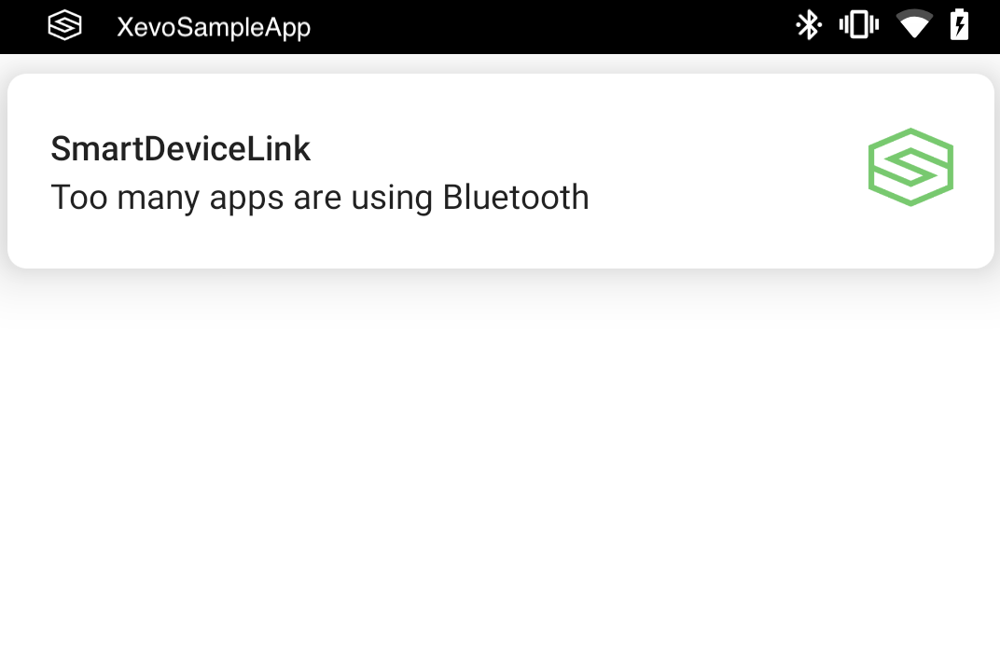

# SPP resource management for Android

* Proposal: [SDL-0230](0230-spp-resource-management-for-android.md)
* Author: [Shinichi Watanabe](https://github.com/shiniwat)
* Status: **Returned for Revisions**
* Impacted Platforms: Java Suite

## Introduction

RFCOMM is a connection-oriented, streaming transport over Bluetooth, which is known as Serial Port Profile (SPP) in Android. 
SDL Proxy uses BluetoothServerSocket to listen on a SPP channel, and it is used for primary transport.
On an Android device, the number of SPP resources is limited, and BluetoothServerSocket fails to accept connections when SPP channel runs out of available resources.
Current SDL Proxy does not handle that case very well. This proposal is to improve the SPP resource management in SDL Android.

## Motivation

When SPP resources are exhausted, the SDL app cannot communicate with head unit. Right now, that error is not notified to the app and a user has no way to figure out why connection fails.
This proposal focuses on the case where Proxy detects the SPP resource error, and let users know what happened and suggests possible work around.


## Proposed solution

### Detect the case where BluetoothServerSocket fails to accept a connection from head unit. 
Even though we could detect the case, we cannot increase the number of available SPP resources, because they are used by other apps.
All we can do in this case is notify users that SPP channel runs out of available resources, and let users close some apps that may use the BluetoothSocket. It's not practical to show SPP service records that are used by Bluetooth adapter. It's sufficient just to notify users that we're running out of resources.

Prior to detecting the error, we can define the runnable interface as the listener in MultiplexBluetoothTransport class:
```java
    private Runnable mSocketErrorListener;
```
and define the setter:
```java
    public void setSocketErrorListener(Runnable onError) {
        mSocketErrorListener = onError;
    }
```

In SdlRouterService, we can implement the runnable to utilize notification channel something like below:
```java
    bluetoothTransport.setSocketErrorListener(new Runnable() {
        @Override
        public void run() {
            // utilize Android notification channel in this case.
            notifySppError();
        }
    });
```

notifySppError() method looks like below:
```java
	/**
	 * notifySppError: utilize notification channel to notify the SPP out-of-resource error.
	 */
	@TargetApi(28)
	public void notifySppError() {
		Notification.Builder builder;
		if(android.os.Build.VERSION.SDK_INT < Build.VERSION_CODES.O){
			builder = new Notification.Builder(getApplicationContext());
		} else {
			builder = new Notification.Builder(getApplicationContext(), TransportConstants.SDL_ERROR_NOTIFICATION_CHANNEL_ID);
		}

		builder.setContentTitle(getString(R.string.notification_title));
		builder.setTicker(getString(R.string.sdl_error_notification_channel_name));
		builder.setContentText(getString(R.string.spp_out_of_resource));

		//We should use icon from library resources if available
		int trayId = getResources().getIdentifier("sdl_tray_icon", "drawable", getPackageName());

		builder.setSmallIcon(trayId);
		Bitmap icon = BitmapFactory.decodeResource(getResources(), R.drawable.ic_sdl);
		builder.setLargeIcon(icon);

		// Create an intent that will be fired when the user clicks the notification.
		// The code snippet implements a new activity, called SdlNotificationActivity.
		Intent intent = new Intent(getApplicationContext(), SdlNotificationActivity.class);
		PendingIntent pendingIntent = PendingIntent.getActivity(this, 0, intent, 0);
		builder.setContentIntent(pendingIntent);
		builder.setOngoing(false);

		synchronized (NOTIFICATION_LOCK) {
			final String tag = "SDL";
			//Now we need to add a notification channel
			final NotificationManager notificationManager = (NotificationManager) getSystemService(Context.NOTIFICATION_SERVICE);
			if (notificationManager != null) {
				notificationManager.cancel(tag, TransportConstants.SDL_ERROR_NOTIFICATION_CHANNEL_ID_INT);
				if (Build.VERSION.SDK_INT >= Build.VERSION_CODES.O) {
					NotificationChannel notificationChannel = new NotificationChannel(TransportConstants.SDL_ERROR_NOTIFICATION_CHANNEL_ID, getString(R.string.sdl_error_notification_channel_name), NotificationManager.IMPORTANCE_HIGH);
					notificationChannel.enableLights(true);
					notificationChannel.enableVibration(true);
					notificationChannel.setShowBadge(false);
					notificationManager.createNotificationChannel(notificationChannel);
					builder.setChannelId(notificationChannel.getId());
				}
				Notification notification = builder.build();
				notificationManager.notify(tag, TransportConstants.SDL_ERROR_NOTIFICATION_CHANNEL_ID_INT, notification);
			} else {
				Log.e(TAG, "notifySppError: Unable to retrieve notification Manager service");
			}
		}
	}
```

**Code-1: code snippet of notifySppError method**

When notifySppError gets called, the notification is shown like below:



**Fig. 1: Notification popup is shown when SPP resource error is detected**

### Expected settings for the notification channel

When SPP resource error is detected, notification is expected to be shown as popup. For this reason, we need another notification channel in addition to existing SDL notification channel, which is used when SdlRouterService enters foreground.
This is why Code-1 above uses different channel ID (SDL_ERROR_NOTIFICATION_CHANNEL_ID), and different setting of channel importance flag (IMPORTANCE_HIGH)

When user opens "manage notifications", the app's notification setting will be shown below:


**Fig. 2: Manage notifications setting**

Please note that channel name ("SDL Error" in Fig. 2) is TBD.

And the channel ("SDL Error") should be configured like below:


**Fig. 3: Manage notification category setting**

### When user clicks on notification popup

In previous code snippet (Code-1), SdlNotificationActivity is specified for ContentIntent. The activity is shown when user clicks on the notification popup.

The sample UX of SdlNotificationActivity looks like below:


All strings used for this error UX is defined in strings.xml like below:

```java
    <string name="spp_out_of_resource">Bluetooth channel is out of resource</string>
    <string name="notification_title">SmartDeviceLink</string>
    <string name="spp_out_of_resource_message">There are too many bluetooth apps running on your device. Please close them and try to re-connect</string>
    <string name="button_ok">OK</string>
    <string name="sdl_error_notification_channel_name">SDL Error</string>
```

The strings above are TBD (requires review).

### Localization of SPP error UX

Because all strings used for error UX is defined in strings.xml, the standard localization process for Android can be applied; i.e. adding language specific strings.xml per language.
All language enums of [Mobile_API](https://github.com/smartdevicelink/sdl_core/blob/master/src/components/interfaces/MOBILE_API.xml#L167) are assumed as the supported languages. They are:

ar_SA, cs_CZ, da_DK, de_DE, el_GR, en_AU, en_GB, en_IN, en_SA, en_US, es_ES, es_MX, fi_FI, fr_CA, fr_FR, he_IL, hi_IN, hu_HU, id_ID, it_IT, ja_JP, ko_KR, ms_MY, no_NO, pl_PL, pt_BR, pt_PT, ro_RO, ru_RU, sk_SK, sv_SE, th_TH, tr_TR, uk_UA, vi_VN, zh_TW, zh_CN

The default language would be en_US.

## Potential downsides

- We need to think about who is responsible for the localization process, which includes management of string resources.
- In Fig. 3 (Manage notification category setting), if user changed the behavior to "No sound", user won't notice anything even if SPP error occurred. This seems to be a potential issue, but it is up to the user's configuration.


## Impact on existing code

There's no impact to existing code, because all error UX is provided by Proxy. Developers do not have to implement the error UX at all.

## Alternatives considered

Does sdl_java_suite library need to have all localized strings? This question is raised because the supported languages can be varied on the app.
