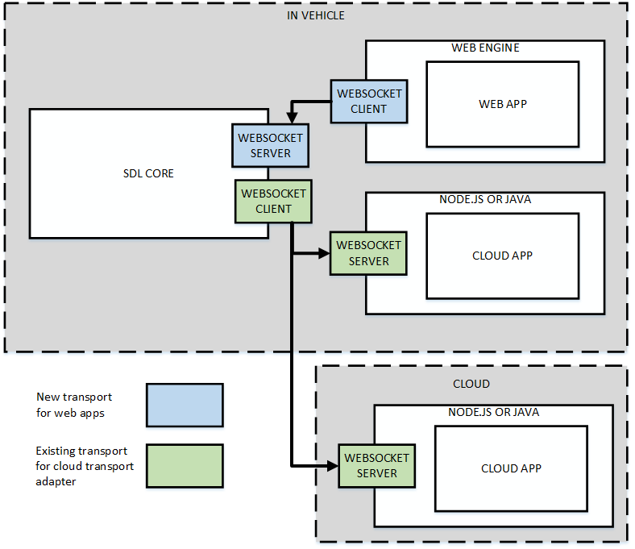
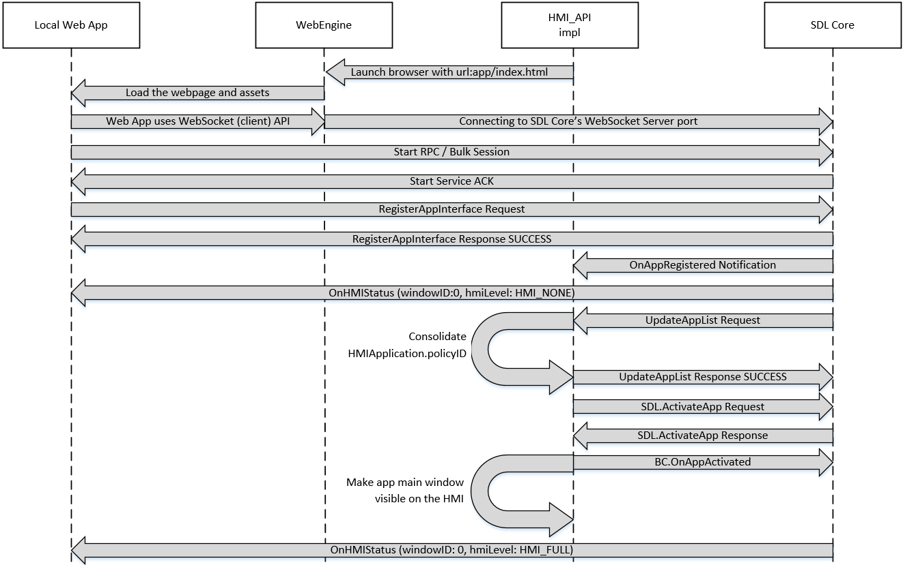

# WebEngine support for SDL JavaScript

* Proposal: [SDL-0240](0240-sdl-js-pwa.md)
* Author: [Kujtim Shala](https://github.com/kshala-ford)
* Status: **In Review**
* Impacted Platforms: [ Core / RPC / JavaScript / Server ]

## Introduction

This proposal is adding a new transport to the SDL JavaScript library to support (progressive) web apps to run on a WebEngine or a browser.

## Motivation

Applications running in vehicle opens big opportunities for SmartDeviceLink enhancing the user experience. Recent browsers allow a hardware independent runtime environment for apps with application management, sandboxing together with decent performance.

The motivation of this proposal is to provide an extensible in-vehicle infotainment system using the infotainment system as a platform and runtime for SDL applications. An in-vehicle application store (OEM store) should provide applications and services to the user. These applications and services can be installed directly into the vehicle. These applications should be independent from a mobile phone. Instead they connect to the locally running SDL Core and use the in-vehicle modem to communicate to the internet.

## Proposed solution

The proposed solution is to allow web apps to run in a WebEngine and connect to SDL Core using WebSockets. A web app is a single page application developed with web technology like HTML, CSS and JavaScript using the SDL JavaScript library. The WebEngine can be a browser that is reduced to the HTML rendering part only (without url bar, tabs etc.). The WebEngine should be on the same host as SDL Core (in the infotainment system). It can also be in the local network for development purposes.

### High level overview 

1. An OEM store should make apps available to the user. The user should be able to install or uninstall apps from the store.
2. An app should be a compressed bundle of application files, such as HTML, CSS or script files. At minimum it requires the following files:
   1. sdl.js file
   2. manifest.json file
   3. An HTML file where the manifest is pointing to
3. The manifest.json file must be included in the HTML file as a script source
4. The OEM store's backend should store the compressed app copied from the SDL Developer Platform after the app and version was approved by the SDLC and the OEM. 
   1. Note: Neither the SDL Developer Platform nor the SDL Server or SHAID are directly involved in distributing the app package to vehicles. 
5. If a user installs an app, the OEM store should download the app package from the OEM backend and decompress/install the app to the system.
6. After installation, the OEM store should make the app visible and available on the HMI.
7. Core should support a WebSocket Server as a transport.
8.  If a user activates a local app through the HMI, the HMI should launch the app by opening the entrypoint HTML file.
9.  HMI should launch the app including SDL Core's hostname and port as GET parameters (file://somewhere/HelloSDL/index.html?ws-host=localhost&ws-port=123456)
10. The app should connect to Core using the SDL library using hostname and port specified.
11. If Core sends UpdateAppList, the HMI should compare matching SDL app IDs and avoid showing an app twice.



> An overview of application runtime environment and how they connect to SDL Core. This proposal adds the WebEngine part.

### Chapter 1: Web application package
---------

Running apps on an embedded WebEngine defines a new app platform/runtime. With installing an app on the infotainment system there should be a minimum set of requirements on how the app should be packaged.

1. The app package should be a compressed zip file
2. It should contain a manifest.json and the sdl.js file
3. The manifest file should contain:
   1. a relative path to an html file which is the entry point of the app
   2. a relative path to an app icon in the app bundle
   3. SDL app ID
   4. app name
   5. optionally per supporting SDL locale:
      1. app name (overrides global app name) (must be one of the valid app nicknames)
      2. optionally relative path to an app icon (overrides global app icon)
      3. optionally TTS name (an array of tts chunks)
      4. optionally VR app names (an array of strings)
   6. App version
   7. Min SDL RPC version supported
   8. Min SDL Protocol version supported
4. All script files should be included in the package
   1. Any `<script>` element with `src` attribute should point to a script file in the package
   2. No scripts from outside the package should be allowed
5. The entry point HTML file should refer to the manifest file (`<script src="manifest.json" />`)

#### 1.1 Manifest file

> Note: See appendix for an example manifest file

The manifest should be used for multiple purposes.

The SDL Developer Platform should allow developers to upload app packages which are candidates for app certification. The platform can read the manifest file and automatically read app assets instead of requesting the developer to input the data manually.

The backend of the OEM store should store copies of a certified app package if the OEM accepted and approved the app. The OEM store should also read the manifest file to create app assets for the store's database. The assets should be made visible for OEM customers when discovering available apps in the OEM store client. The OEM store client should also use the manifest file to list the app in the app list (see chapter "HMI API using App Properties RPCs"). The SDL library should use the manifest file to automatically send `RegisterAppInterface` and `ChangeRegistration` instead of using a configuration or builder pattern.

This definition should ensure that apps can be approved and verified by the SDLC and OEMs without possibility of modifications after approval. Also this set of requirements should ensure compatibility throughout integrators. The final approval process will be part of another proposal.

### Chapter 2: SDL support for WebEngines
---------

This chapter focuses on the minimum requirements to have SDL support for WebEngines and Browsers. It describes a new transport for SDL Core, how apps are listed on the HMI and how they can be user activated. It also changes the registration of applications on the SDL developer portal (smartdevicelink.com) to allow defining apps as local/embedded.

#### 2.1 WebSocket transport

This proposal introduces a new runtime environment: the WebEngine. Data communication protocols are very limited in this environment. Therefore a new transport implementation should be introduced to SDL Core and the JavaScript library. 

##### 2.1.1 SDL Core

The transport for Core should be a WebSocket server which listens to a port specified in the smartDeviceLink.ini file. While SDL Core is operating, the server should be permanently available and listen for connections on the specified port. Another ini configuration should allow binding the socket to the localloop address or any address. This increases security in the production environment and allows remote connection in development systems.

The new transport should be available as a build configuration called `BUILD_WEBSOCKET_SERVER_SUPPORT` (definition `-DWEBSOCKET_SERVER_TRANSPORT_SUPPORT`) so that SDL Core can be compiled with or without this additional transport type.

##### 2.1.2 JavaScript library

On the library side, a new WebSocket client transport should be created using the [WebSocket API](https://developer.mozilla.org/en-US/docs/Web/API/Websockets_API). This transport should require a hostname or ip address with a port to connect to Core's WebSocket server. The library should also be extended to be exportable to a single .js file that can be easily included in an HTML file. This export could be done per library release using Webpack. This new transport should be specifically for WebEngine purposes and should not be included for the Node.js platform. In order to improve simple "plug-and-play" of the library, the .js file should include only this single transport.

#### 2.2 Activating a web app

Activating a local web app by a user will cause the HMI to launch the app's entrypoint HTML file in the WebEngine. Once the engine has loaded the web app, the JavaScript SDL library will initiate a WebSocket connection to SDL Core's WebSocket server port and then establish the RPC/Bulk service session.

After the app registers, the HMI will be notified with `OnAppRegistered`, which allows the HMI to return to SDL and activate the app. This will make the app HMI level set to HMI_FULL and the HMI will present the app's template. At no time the web view of the web application will be visible.



> Flow of how a user activates a web app and how it becomes visible on the screen.

#### 2.3 Mobile App properties change

Due to a new app platform, the hybrid app preference should be modified to track mobile, cloud and local apps.

##### 2.3.1 Mobile API

```xml
<enum name="HybridAppPreference" since="5.1">
  <description>Enumeration for the user's preference of which app type to use when both are available</description>
  <element name="MOBILE" />
  <element name="CLOUD" />
  <element name="BOTH" deprecated="true" since="5.x">
    <description>This element is deprecated. Using this element will be equal to "ALL". Please use ALL instead.</description>
    <history>
      <element name="BOTH" since="5.1" />
    </history>
  </element>
  <element name="LOCAL" since="5.x" />
  <element name="ALL" since="5.x" />
</enum>
```

App registration on the SDL Developer Portal (smartdevicelink.com) should allow a developer to specify an app as a local web app. As the app platforms increase (2 -> 3) a new way to specify preferences should be introduced. The element `BOTH` should be deprecated and replaced by `ALL` for a next major release. Occurrences of `BOTH` would be treated as `ALL`.

### 2.4 HMI API using App Properties RPCs

The HMI API should be extended to set app properties to SDL Core. This addition should allow the HMI to add app policy IDs to the policy database as they are installed by the embedded OEM catalog.

The HMI API extension is mostly a copy of the cloud-app-properties included in the mobile API. 

1. The OEM store uses the manifest data to for `SetAppProperties`.
2. The OEM store may choose to add not-installed apps to SDL using `enabled` parameter set to `false` (optional)
3. If an embedded app is installed the `enabled` flag should be set to `true` to appear in UpdateAppsList RPC
4. For local apps
   - "cloudTransportType" will be "ws" (WebSocket) or "wss" (WebSocket-Secure)
   - "endpoint" parameter will be omitted. Instead the HMI is responsible to launch local apps.
5. If Core doesn't know the app ID it should ask HMI for a policy update.
   - Alternatively HMI can call `UpdateSDL` after setting app properties to enforce SDL to perform the policy update.
6. Policy HMI impl. (incl. SYNCP) should have the ability to use embedded modem to send policy snapshot to the policy server.

#### 2.5 App presentation with Templates

The default app presentation approach should be template based. With the web app becoming active on the HMI, the HMI should present the application template. The body of the index.html file of the web app should be empty and should not be modified with scripts as the app won't be visible on the HMI anyway. The HMI should show the system component responsible for SDL templates. This component would receive the `Show` RPCs provided by the app.

#### 2.6 App update and certification

As already mentioned, app packages are uploaded to the SDL Developer Platform. App developers may also update the application by uploading new app packages. The backend of the OEM store should store copies of a certified app package if the OEM accepted and approved the app. 

As a result, managing app updates is the responsibility of the OEMs. App packages hosted on the SDL Developer Platform should not be made available directly to vehicles. No changes are being suggested by this proposal to the SDL Server or SHAID in order to support app updates. If needed by the OEM, the OEM store backend should be able to store app packages of different versions. The OEM store client should list and allow installing only supported apps, dependent of the vehicle software version, SDL Core version and app's min SDL (RPC or Protocol) version.

An app certification test should be perform to apps provided on the SDL Developer Platform before they are made available to vehicles. App developers can request SDLC app certification performed by the SDLC PM on the initial submission of the application. This app certification should be inspired by the mobile app certification and include tests that are valid for in-vehicle applications. It should not include tests to monitor data traffic with respect to effort and cost to perform such tests.

The SDLC app certification tests will not test every detail and aspect of the application. Once the initial submission has passed the certification tests the app should be marked as certified independent of future releases which won't be tested anymore. The test will not guarantee that the app behaves the same in OEM vehicles. Therefore the OEMs should consider functional tests for each release to a depth they feel is necessary to make sure the app is of a desired quality.

## Potential downsides

The upside of apps running with a WebEngine is that it comes with an extremely flexible html based user interface and with a very sandboxed runtime environment. This can also be seen as a downside as the responsibility of following driver distraction rules increases and a sandbox environment is limiting the functionality of apps.

## Impact on existing code

1. Core needs a new transport type to support a WebSocket Server.
2. The JavaScript library needs a new transport type to support WebSocket Client.
3. App registration on SDL Developer Portal (smartdevicelink.com) needs a new field for local apps.

## Alternatives considered

Local Node.js or Java were considered as alternative options for locally running applications. However both options have downsides:
1. Both are difficult to sandbox. Compared to a web engine the effort to sandbox a Node.js or java application and to protect the vehicle system are very high.
2. Limited app availability. App developers would potentially need to reassemble a good portion of existing code and write new code to make locally running applications possible.
3. Licensing and compatibility. License cost may apply for embedded in-vehicle use. Efforts avoiding license using older versions may cause compatiblity issues leading to code rewrite. Open source variants may cause other license issues.

Many services are available over a web application and modern WebEngines provide a good sandboxing ability.

## Appendix

### HMI API change for App Properties

```xml
<interface name="Common" ...>
:
<enum name="HybridAppPreference">
  <description>Enumeration for the user's preference of which app type to use when both are available</description>
  <element name="MOBILE" />
  <element name="CLOUD" />
  <element name="LOCAL"/>
  <element name="ALL"/>
</enum>
</interface>

<interface name="BasicCommunication" ...>
:
<struct name="AppProperties">
  <param name="nicknames" type="String" minlength="0" maxlength="100" array="true" minsize="0" maxsize="100" mandatory="false">
      <description>An array of app names an app is allowed to register with. If included in a SetAppProperties request, this value will overwrite the existing "nicknames" field in the app policies section of the policy table.</description>
  </param>
  <param name="appID" type="String" maxlength="100" mandatory="true"/>
  <param name="enabled" type="Boolean" mandatory="false">
      <description>If true, the app will be marked as "available" or "installed" and will be included in HMI RPC UpdateAppList.</description>
  </param>
  <param name="authToken" type="String" maxlength="65535" mandatory="false">
      <description>Used to authenticate connection on app activation</description>
  </param>
  <param name="transportType" type="String" maxlength="100" mandatory="false">
      <description>
        Specifies the connection type Core should use. The Core role (server or client) is dependent of "endpoint" being specified.
        See "endpoint" for details.
      </description>
  </param>
  <param name="hybridAppPreference" type="HybridAppPreference" mandatory="false">
      <description>Specifies the user preference to use one specific app type or all available types</description>
  </param>
  <param name="endpoint" type="String" maxlength="65535" mandatory="false">
      <description>
        If specified, which Core uses a client implementation of the connection type and attempts to connect to the endpoint when this app is selected (activated).
        If omitted, Core won't attempt to connect as the app selection (activation) is managed outside of Core. Instead it uses a server implementation of the connection type and expects the app to connect.
      </description>
  </param>
</struct>

<function name="SetAppProperties" messagetype="request">
  <description>
    HMI >SDL. RPC used to enable/disable an application and set authentication data
  </description>
  <param name="properties" type="AppProperties" mandatory="true">
    <description>The new application properties</description>
  </param>
</function> 

<function name="SetAppProperties" messagetype="response">
  <description>The response to SetAppProperties</description>
  <param name="success" type="Boolean" platform="documentation" mandatory="true">
    <description>true if successful; false if failed</description>
  </param>
  <param name="resultCode" type="Result" platform="documentation" mandatory="true">
    <description>See Result</description>
    <element name="SUCCESS"/>
    <element name="INVALID_DATA"/>
    <element name="OUT_OF_MEMORY"/>
    <element name="TOO_MANY_PENDING_REQUESTS"/>
    <element name="GENERIC_ERROR"/>
    <element name="DISALLOWED"/>
    <element name="WARNINGS"/>
  </param>
</function>

<function name="GetAppProperties" messagetype="request">
  <description>
    HMI >SDL. RPC used to get the current properties of an application
  </description>
  <param name="appID" type="String" maxlength="100" mandatory="false">
    If specified the response will contain the properties of the specified app ID.
    Otherwise if omitted all app properties will be returned at once.
  </param>
</function>

<function name="GetAppProperties" messagetype="response">
  <description>The response to GetAppProperties</description>
  <param name="properties" type="AppProperties" array="true" minsize="1" mandatory="false">
    <description>The requested application properties</description>
  </param>
  <param name="success" type="Boolean" platform="documentation" mandatory="true">
    <description>true if successful; false if failed</description>
  </param>
  <param name="resultCode" type="Result" platform="documentation" mandatory="true">
    <description>See Result</description>
    <element name="SUCCESS"/>
    <element name="INVALID_DATA"/>
    <element name="OUT_OF_MEMORY"/>
    <element name="TOO_MANY_PENDING_REQUESTS"/>
    <element name="GENERIC_ERROR"/>
    <element name="DISALLOWED"/>
    <element name="WARNINGS"/>
  </param>
</function>

<function name="OnAppPropertiesChange" messagetype="notification">
  <description>
    SDL >HMI. RPC used to inform HMI about app properties change (such as auth token).
  </description>
  <param name="properties" type="AppProperties" mandatory="true">
    <description>The new application properties</description>
  </param>
</function>
</interface>
```

### Example manifest file

```json
{
  "entrypoint": "index.html",
  "appIcon": "appIcon.png",
  "sdlAppID": "180eb7aa-6e52-4c01-99c0-375bda718743",
  "appName": "HelloSDL",
  "locales": {
    "de_DE": {
      "appName": "HalloSDL",
      "appIcon": "appIcon.de.png",
      "ttsName": [ { "type": "TEXT", "text": "Hallo S D L" } ],
      "vrNames": [ "Hallo S D L" ]
    }
  },
  "appVersion": "1.0.0",
  "sdlMinRPCVersion": "6.0",
  "sdlMinProtocolVersion": "5.0"
}
```
