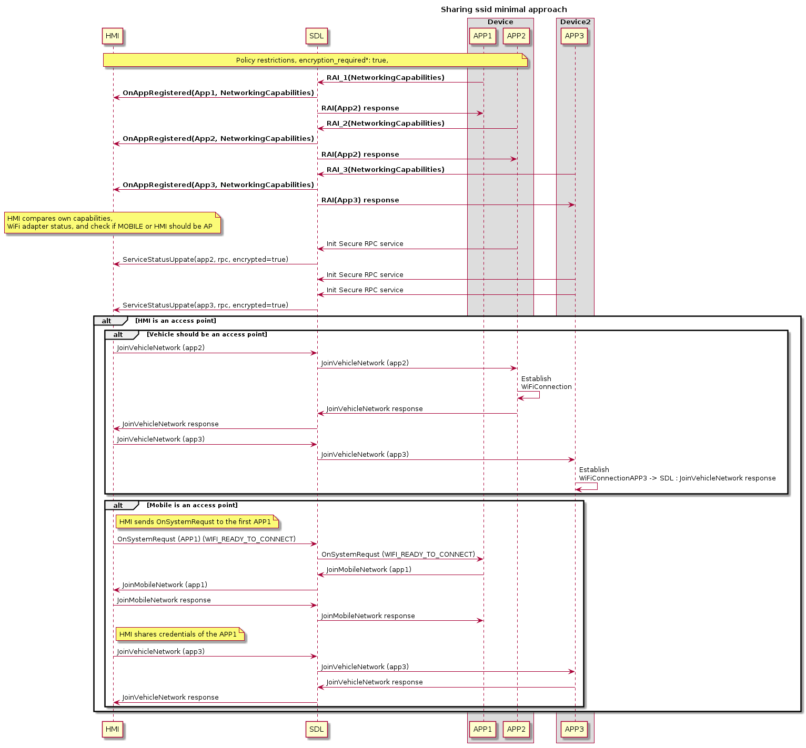

# WiFi Transport: Sharing SSID and password with Mobile Proxy

* Proposal: [SDL-NNNN](0245-sharing-wifi-ssid-and-password.md)
* Author: [Ashwin Karemore](https://github.com/ashwink11)
* Status: **In Review**
* Impacted Platforms: [Java Suite / iOS / RPC / Core / HMI]

## Introduction

The current proposal defines rules and communication facilities between IVI and the Mobile device to establish a WiFi connection with the automatic sharing of credentials via Core.

## Motivation

In the current implementation of SDL over WiFi transport, IP address and port are shared with Mobile proxy. However, the prerequisite for using SDL over WiFi transport is that the mobile device should be connected to WiFi.
In some cases, entering a password for the access point created by HMI could be tedious and it would be a lot more convenient for users if devices could automatically connect via WiFi.

If WiFi credentials are automatically generated by the IVI system, the password could contain special characters or it could be just too long. It would be inconvenient for the user to enter such passwords in the HMI. Another possible scenario is, the HMI could keep changing passwords to improve the security of the network. In such cases, a user might need to connect to the WiFi network every time the password is changed.

## Proposed solution

The functionality to be introduced in the current proposal mostly rely on the IVI and Mobile device capabilities. It is proposed to introduce a new capability type to be specific for networking purposes to both Mobile and HMI API:

### HMI_API

SDL should be able to receive networking capabilities with `UI.GetCapabilities` request at the very beginning of SDL - HMI communication. If omitted, HMI will be considered as not suitable for the feature initialization.

```xml
<enum name="NetworkHost">
    <element name="MOBILE"/>
    <element name="VEHICLE"/>
    <element name="EXTERNAL"/>
</enum>

<enum name="FrequencyBand">
    <element name="FREQUENCY_BAND_2_4_GHZ"/>
    <element name="FREQUENCY_BAND_5_0_GHZ"/>
    <element name="FREQUENCY_BAND_6_0_GHZ"/>
</enum>

<struct name="NetworkingCapabilities">
    <description>Describes some of the sending device's available configurations around WiFi networking. This includes the ability to automatically join a network or host one itself.</description>
    <param name="autoJoinWiFiSupported" type="Boolean" mandatory="false">
        <description>Defines whether HMI supports programmatic join to the external network</description>
    </param>
    <param name="hostingWiFiSupported" type="Boolean" mandatory="false">
        <description>Defines whether HMI is capable of hosting WiFi network.</description>
    </param>
    <param name="preferredNetworkHost" type="NetworkHost" mandatory="false">
        <description>This describes the preference of what device to use for the network host. This could mean the user prefers to use the data of either mobile or the vehicle when one might have unlimited data but a cap on another. When sent from mobile this will simply be a suggestion. When sent from the head unit, the mobile device should take this as a determined host.</description>
    </param>
    <param name="wifiFrequencyBandsSupported" type="FrequencyBand" array="true" minsize="1" maxsize="100" mandatory="false">
        <description>An array of frequencies supported by the device. Values should be in units of GHz for example 2.4GHz, 5.0GHz, etc.</description>
    </param>
</struct>


<enum name="SystemCapabilityType">
    ...
    <element name="NETWORKING"/>
</enum>


<struct name="SystemCapability">
    ...
    <param name="networkingCapabilities" type="NetworkingCapabilities" mandatory="false">
        <description>Describes HMI networking capabilities</description>
    </param>
</struct>
```

### MOBILE_API

SDL should receive Mobile capabilities within `DeviceInfo` section of `RegisterAppInterface` request. If omitted, the application will be considered as not suitable for the feature initialization. Also, Mobile application should be able to receive HMI networking capabilities on-demand via `GetSystemCapabilities`, `OnSystemCapabilitiesUpdated`.

```xml
<enum name="FrequencyBand" since="x.x">
    <element name="FREQUENCY_BAND_2_4_GHZ"/>
    <element name="FREQUENCY_BAND_5_0_GHZ"/>
    <element name="FREQUENCY_BAND_6_0_GHZ"/>
</enum>

<enum name="NetworkHost" since="x.x">
    <element name="MOBILE"/>
    <element name="VEHICLE"/>
    <element name="EXTERNAL"/>
</enum>

<struct name="NetworkingCapabilities" since="x.x">
    <description>Describes some of the sending device's available configurations around WiFi networking. This includes the ability to automatically join a network or host one itself.</description>
    <param name="autoJoinWiFiSupported" type="Boolean" mandatory="false">
        <description>Defines whether Mobile application supports programmatic join to the external network</description>
    </param>
    <param name="hostingWiFiSupported" type="Boolean" mandatory="false">
        <description>Defines whether Mobile device is capable of hosting WiFi network.</description>
    </param>
    <param name="preferredNetworkHost" type="NetworkHost" mandatory="false">
        <description> This describes the preference of what device to use for the network host. This could mean the user prefers to use the data of either mobile or the vehicle when one might have unlimited data but a cap on another. When sent from mobile this will simply be a suggestion. When sent from the head unit, the mobile device should take this as a determined host.</description>
    </param>
    <param name="wifiFrequencyBandsSupported" type="FrequencyBand" array="true" minSize="1" maxSize="100" mandatory="false">
        <description> An array of frequencies supported by the device. Values should be in units of GHz for example 2.4GHz, 5.0GHz, etc.</description>
    </param>
</struct>

<struct name="DeviceInfo" since="3.0">
    ...
    <param name="networkingCapabilities" type="NetworkingCapabilities" mandatory="false" since="x.x">
        <description>Device's available configurations around networking</description>
    </param>
</struct>
```

### Application ability to use the feature

To avoid data races and uncontrollable reconnection to Access Point, only one application per device has to be able to use this feature. Defining this application is the responsibility of the Core. To ensure, applications are running on the same device `DeviceInfo` section from `RegisterAppInterface` will be taken into account.

Permissions to use the feature should be also controlled by OEM, so the application has to obtain specific permissions from the Policy server. Since Core can define currently enabled application for this feature only after PolicyTable update, it has to cache all the network capabilities per application and also registration sequence to be sure, the first registered and allowed by the policy will be used for the feature initialization. Since Core is responsible for the available application, HMI is not required to know anything about the application.

Currently available application for the feature initialisation should be switched according to the following rules:
* Once the first application is unregistered, the second will become available for the feature.
* Application activation of feture enabled application will make this application the active for feature initialization.

__Note:__ after switching of the active application, if the connection is already established, no extra actions will be required for other applications. Capabilities of this application will be taken into account during feature reinitialization if one is required.

Before PolicyTable update Core can make a preliminary decision based on the networking capabilities of Vehicle and Mobile application:

#### Hardware compatibility

* `wifiFrequencyBandsSupported` - defines supported frequency bands.
Available values: FREQUENCY_BAND_2_4_GHZ, FREQUENCY_BAND_5_0_GHZ, FREQUENCY_BAND_6_0_GHZ;

If the `wifiFrequencyBandsSupported` of HMI does not intersect with Mobile's: the feature cannot be initialized for the application.

If the result of the intersection of these parameters is a single value, which is allowed via ini file, the application can initialize the feature and the value should be used for the network.

If the result of the intersection of these parameters is more then one value, Core should rely on priority(order) defined in HMI network capabilities.

#### Network hosting compatibility

* `autoJoinWiFiSupported` - defines whether a device can join network programmatically;

* `hostingWiFiSupported` - defines whether a device can create an access point;

* `preferedNetworkHost` - defines a preferable host of the network if both HMI and Mobile can host network and automatically join the network.

Decision rules for `autoJoinWiFiSupported` and `hostingWiFiSupported`:

* if `autoJoinWiFiSupported` and `hostingWiFiSupported` are both set to false either for HMI or Mobile application - the feature cannot be initialized for the application.

* if `hostingWiFiSupported = false` in Mobile and Vehicle capabilities feature cannot be initialized for the application.

* if `autoJoinWiFiSupported = false` in Mobile and Vehicle capabilities feature cannot be initialized for the application.

In the case of the following combinations, `preferedNetworkHost` parameter has to be considered:

<table align=center>
  <tr>
    <th colspan="2">HMI</th>
    <th colspan="2">Mobile</th>
    <th>HMI</th>
    <th>Mobile</th>
    <th rowspan="2">Result</th>
  </tr>
  <tr >
    <td >autoJoin<br>WiFi<br>Supported</td>
    <td>canHost<br>WiFi<br>Network</td>
    <td>autoJoin<br>WiFi<br>Supported</td>
    <td>canHost<br>WiFi<br>Network</td>
    <td>preferred<br>NetworkHost
    </td>
    <td>preferred<br>NetworkHost
    </td>
  </tr>
  <tr>
    <td rowspan="15">true</td>
    <td rowspan="15">true</td>
    <td rowspan="10">true</td>
    <td rowspan="10">true</td>
    <td>Vehicle</td>
    <td>Vehicle</td>
    <td>Vehicle</td>
  </tr>
  <tr>
    <td>Vehicle</td>
    <td>Mobile</td>
    <td>.ini file</td>
  </tr>
  <tr>
    <td>Vehicle</td>
    <td>omitted</td>
    <td>Vehicle</td>
  </tr>
  <tr>
    <td>Mobile</td>
    <td>Vehicle</td>
    <td>.ini file</td>
  </tr>
  <tr>
    <td>Mobile</td>
    <td>Mobile</td>
    <td>Mobile</td>
  </tr>
  <tr>
    <td>Mobile</td>
    <td>omitted</td>
    <td>Mobile</td>
  </tr>
  <tr>
    <td>omitted</td>
    <td>Vehicle</td>
    <td>Vehicle</td>
  </tr>
  <tr>
    <td>omitted</td>
    <td>Mobile</td>
    <td>Mobile</td>
  </tr>
  <tr>
    <td>omitted</td>
    <td>ommtited</td>
    <td>.ini file</td>
  </tr>
  <tr>
    <td>External</td>
    <td>Vehicle/Mobile/omitted</td>
    <td>External</td>
  </tr>
  <tr>
    <td rowspan="2">true</td>
    <td rowspan="2">false</td>
    <td>Vehicle/Mobile/omitted</td>
    <td>Vehicle/Mobile/omited</td>
    <td>Vehicle</td>
  </tr>
  <tr>
    <td>External</td>
    <td>Vehicle/Mobile/omitted</td>
    <td>External</td>
  </tr>
  <tr>
    <td rowspan="2">false</td>
    <td rowspan="2">true</td>
    <td>Vehicle/Mobile/omitted</td>
    <td>Vehicle/Mobile/omitted</td>
    <td>Mobile</td>
  </tr>
  <tr>
    <td>External</td>
    <td>Vehicle/Mobile/omitted</td>
    <td>External</td>
  </tr>
  <tr>
    <td>false</td>
    <td>false</td>
    <td>Vehicle/Mobile/omitted</td>
    <td>Vehicle/Mobile/omitted</td>
    <td>not be initialized</td>
  </tr>
  <tr>
    <td rowspan="4">true</td>
    <td rowspan="4">false</td>
    <td>true</td>
    <td>true</td>
    <td>Vehicle/Mobile/omitted</td>
    <td>Vehicle/Mobile/omitted</td>
    <td>Mobile</td>
  </tr>
  <tr>
    <td>true</td>
    <td>false</td>
    <td>Vehicle/Mobile/omitted</td>
    <td>Vehicle/Mobile/omitted</td>
    <td>not be initialized</td>
  </tr>
  <tr>
    <td>false</td>
    <td>true</td>
    <td>Vehicle/Mobile/omitted</td>
    <td>Vehicle/Mobile/omitted</td>
    <td>Mobile</td>
  </tr>
  <tr>
    <td>false</td>
    <td>false</td>
    <td>Vehicle/Mobile/omitted</td>
    <td>Vehicle/Mobile/omitted</td>
    <td>not be initialized</td>
  </tr>
  <tr>
    <td rowspan="8">false</td>
    <td rowspan="8">true</td>
    <td rowspan="2">true</td>
    <td rowspan="2">true</td>
    <td>Vehicle/Mobile/omitted</td>
    <td>Vehicle/Mobile/omitted</td>
    <td>Vehicle</td>
  </tr>
  <tr>
    <td>External</td>
    <td>Vehicle/Mobile/omitted</td>
    <td>External</td>
  </tr>
  <tr>
    <td rowspan="2">true</td>
    <td rowspan="2">false</td>
    <td>Vehicle/Mobile/omitted</td>
    <td>Vehicle/Mobile/omitted</td>
    <td>Vehicle</td>
  </tr>
  <tr>
    <td>External</td>
    <td>Vehicle/Mobile/omitted</td>
    <td>External</td>
  </tr>
  <tr>
    <td rowspan="2">false</td>
    <td rowspan="2">true</td>
    <td>Vehicle/Mobile/omitted</td>
    <td>Vehicle/Mobile/omitted</td>
    <td>not be initialized</td>
  </tr>
  <tr>
    <td>External</td>
    <td>Vehicle/Mobile/omitted</td>
    <td>External</td>
  </tr>
  <tr>
    <td rowspan="2">false</td>
    <td rowspan="2">false</td>
    <td>Vehicle/Mobile/omitted</td>
    <td>Vehicle/Mobile/omitted</td>
    <td>not be initialized</td>
  </tr>
  <tr>
    <td>External</td>
    <td>Vehicle/Mobile/omitted</td>
    <td>External</td>
  </tr>
  <tr>
    <td rowspan="4">false</td>
    <td rowspan="4">false</td>
    <td>true</td>
    <td>true</td>
    <td rowspan="4">any</td>
    <td rowspan="4">any</td>
    <td rowspan="4">not be initialized</td>
  </tr>
  <tr>
    <td>true</td>
    <td>false</td>
  </tr>
  <tr>
    <td>false</td>
    <td>true</td>
  </tr>
  <tr>
    <td>false</td>
    <td>false</td>
  </tr>
</table>


__Note:__ `preferedNetworkHost` parameter will be considered only if `hostingWiFiSupported` and `autoJoinWiFiSupported` is `true` in Vehicle and Mobile application capabilities.

In any case, from the above table, Core has to check whether the network host is allowed in the ini file.

If both HMI and Mobile application can host the network and both network host values allowed in the ini file, Core checks `preferedNetworkHost` from capabilities: if this parameter coincides for Mobile and HMI capabilities - then this value has to be taken as a network host.

If the `preferedNetworkHost` is omitted in Mobile application network capabilities - Vehicle preference will be chosen.

If the `preferedNetworkHost` is omitted in Vehicle network capabilities - mobile application preference will be chosen.

If for both Vehicle and Mobile application network capabilities `preferedNetworkHost` parameter is omitted - a decision will be based on ini file configuration.

If `preferedNetworkHost` of Mobile application network capabilities contradict the corresponding parameter of Vehicle network capabilities - a decision will be based on ini file configuration.

#### INI file update

```ini
[Networking]
;networkHostPriority defines the priority of network host in case parameter is omitted for Mobile and Vehicle networking capabilities, or if they contradict to each other.
networkHostPriority = VEHICLE, MOBILE

;allowAccessPointSharing defines whether it Core is allowed to share credentials of the external AccessPoint
allowAccessPointSharing = FALSE
```

__Note:__ `preferredNetworkHost` is the array with priority defined by the order of elements.

### Feature initialization

After Core defined suitable network configuration and found available feature enabled application, it has to notify HMI and Mobile application.

It is proposed to implement new notification for this purpose:

#### Mobile API

```xml
<struct name="NetworkConfiguration" since="x.x">
    <description>Describes negotiated network configuration.</description>
    <param name="networkHost" type="NetworkHost" mandatory="true">
        <description>Host for the network defined by Core based on the capabilities of Mobile device, HMI and ini file priorities</description>
    </param>
    <param name="wifiFrequencyBand" type="FrequencyBand" mandatory="true">
        <description>Frequency band defined by Core based on the capabilities of Mobile device and HMI</description>
    </param>
</struct>

<function name="OnNetworkConfiguration" messagetype="notification">
  <description>
    Notification to be sent to Mobile application letting it know about agreed network configuration and allow sending of JoinNetwork if needed or prepare to connect.
  </description>
  <param name="configuration" type="NetworkConfiguration" mandatory="true">
    <description>Specifies the service which has been updated.</description>
  </param>
</function>
```

#### HMI API

```xml
<struct name="NetworkConfiguration">
    <description>Describes negotiated network configuration.</description>
    <param name="networkHost" type="NetworkHost" mandatory="true">
        <description>Host for the network defined by Core based on the capabilities of Mobile device, HMI and ini file priorities</description>
    </param>
    <param name="wifiFrequencyBand" type="FrequencyBand" mandatory="true">
        <description>Frequency band defined by Core based on the capabilities of Mobile device, HMI and ini file priorities</description>
    </param>
</struct>

<function name="OnNetworkConfiguration" messagetype="notification">
  <description>
    Notification to be sent to HMI leting it know about agreed network configuration and allow sending of JoinNetwork if needed or prepare to connect.
  </description>
  <param name="configuration" type="NetworkConfiguration" mandatory="true">
    <description>Specifies the service which has been updated.</description>
  </param>
</function>
```

Once at least one Mobile application is ready for the feature initialization, Core has to notify HMI and the application on the agreed network configuration with `OnNetworkConfiguration`.

Finally, to share the credentials of the network, it is proposed to implement the new RPC `JoinNetwrok` to be sent by current netwrokHost.


#### Mobile API

```xml
<enum name="WiFiSecurityType">
    <description>enum to define WiFi security types used for WiFi connection.</description>
    <element name="NONE"/>
    <element name="WEP"/>
    <element name="WPA"/>
    <element name="WPA2"/>
    <element name="WPA3"/>
</enum>

<function name="JoinNetwork" functionID="JoinNetworkID" messagetype="request" since="x.x">
    <description>A request for the receiver to join the specified network.</description>
    
    <param name="ssid" type="String" minlength="1" maxlength="32" mandatory="true">
        <description>name of the WiFi ssid</description>
    </param>
    <param name="password" type="String" minlength="1" maxlength="100" mandatory="false">
        <description>password to use to connect AP</description>
    </param>
    <param name="securityType" type="WiFiSecurityType" mandatory="false">
        <description>security type of WiFi AP</description>
    </param>
    <param name="allowAccessPointSharing" type="Boolean" mandatory="false">
        <description>True if it is acceptable to share this network's SSID and password with other nearby devices. This is helpful if two mobile devices connected to a head unit, and one of them is selected as the network host.</description>
    </param>
    <param name="accesssPointSupportsInternetAccess" type="Boolean" mandatory="false">
        <description>True if access point provides internet access, otherwise false.</description>
    </param>
</function>

<function name="JoinNetwork" functionID="JoinNetworkID" messagetype="response" since="6.2">
    <description>A response and description of requested action.</description>
    <param name="success" type="Boolean" platform="documentation" mandatory="true">
        <description> true, if successful; false, if failed </description>
    </param>
    <param name="resultCode" type="Result" platform="documentation" mandatory="true">
        <description>See Result</description>
        <element name="SUCCESS"/>
        <element name="UNSUPPORTED_RESOURCE"/>
        <element name="DISALLOWED"/>
        <element name="REJECTED"/>
        <element name="TOO_MANY_PENDING_REQUESTS"/>
        <element name="APPLICATION_NOT_REGISTERED"/>
        <element name="GENERIC_ERROR"/>
        <element name="USER_DISALLOWED"/>
    </param>
    <param name="info" type="String" maxlength="1000" mandatory="false" platform="documentation">
        <description>Provides additional human readable info regarding the result.</description>
    </param>
</function>

```

#### HMI API

```xml
<enum name="WiFiSecurityType">
    <description>enum to define WiFi security types used for WiFi connection.</description>
    <element name="NONE"/>
    <element name="WEP"/>
    <element name="WPA"/>
    <element name="WPA2"/>
    <element name="WPA3"/>
</enum>

<function name="JoinNetwork" messagetype="request">
    <description>A request for the receiver to join the specified network.</description>

    <param name="ssid" type="String" minlength="1" maxlength="32" mandatory="true">
        <description>name of the WiFi ssid</description>
    </param>
    <param name="password" type="String" minlength="1" maxlength="100" mandatory="false">
        <description>password to use to connect AP</description>
    </param>
    <param name="securityType" type="Common.WiFiSecurityType" mandatory="false">
        <description>security type of WiFi AP</description>
    </param>
    <param name="allowAccessPointSharing" type="Boolean" mandatory="false">
        <description>True if it is acceptable to share this network's SSID and password with other nearby devices. This is helpful if two mobile devices connected to a head unit, and one of them is selected as the network host.</description>
    </param>
    <param name="accesssPointSupportsInternetAccess" type="Boolean" mandatory="false">
        <description>True if access point provides internet access, otherwise false.</description>
    </param>
</function>

<function name="JoinNetwork" messagetype="response">
    <description>A response and description of requested action.</description>
    <param name="success" type="Boolean" platform="documentation" mandatory="true">
        <description> true, if successful; false, if failed </description>
    </param>
    <param name="resultCode" type="Common.Result" platform="documentation" mandatory="true">
    </param>
    <param name="info" type="String" maxlength="1000" mandatory="false" platform="documentation">
        <description>Provides additional human readable info regarding the result.</description>
    </param>
</function>
```

`JoinNetwork` should be sent by the current network host (previously defined within `OnNetworkConfiguration`).
`JoinNetwork` has to be rejected by Core if:
* it is sent from the device, which is not selected as a network host;
* it is sent before `OnNetworkConfiguration` received.

The core has to perform basic validation for the parameters of the `JoinNetwork` request:
* if `wifiState` is set to `WIFI_ENABLED`: `ssid` parameter has to be presented;
* if `securityType` is set to any value but `NONE`: `password` parameter has to be presented.

SDL will not transfer JoinNetwork to app on the mobile device in any application on the mobile device had already started service via Wifi transport

HMI should not send JoinNetwork in case if there is at leaset one app from each device established service via Wifi.
In other words HMI should send JoinNetwork in case if there is
at lease one device with no apps that established Wifi service

If the validation process successfully passed, the request should be transferred to the network client.


__Note:__ `JoinNetwork` should not depend on the default RPC timeout, since WiFi connection may take much more time. So, this RPC has to operate without active timeout from Core perspective.


### Secondary transport 

Mobile should start secondary (Wifi) transport right after registration and transport is available.

HMI is not able to check if certain application is connected to the same wifi network as HMI does withut establishing TCP connection and and starting service on secondary transport.

Such behaviour required to avoid sending redundant JoinNetwork to mobile and to avoid showing confusing user consent popup. 

### Multiple device connection

#### Vehicle is a network host

For each connected device, Core will select a single feature enabled application.

Once network parameters are established with the first device, `OnNetworkConfiguration` will be sent to this application and HMI. After receiving this notification, HMI should send `OnSystemCapabilityUpdated` in case capabilities have changed. The next application's capabilities will be compared to updated HMI capabilities.

This mechanism will allow HMI to decide it's own behavior based on all the following incoming connections.


#### Mobile device is a network host

A precondition for further discussion is that the first device is connected, it hosts the network and HMI successfully connected to its hotspot. The Core already received `OnSystemCapabilityUpdate` with updated networking capabilities.

A vehicle should be able to share credentials of the external hotspot only if `allowAccessPointSharing` is set to true in Mobile application JoinNetwork request and the ini file.

If mobile is an AP and `allowAccessPointSharing = false`, Vehicle is not able to establish WIfi connection with other devices.

In that case, HMI should provide SDL `OnSystemCapabilityUpdate` with appropriate `hostingWiFiSupported`, and `autoJoinWiFiSupported`.

Once Vehicle is connected to the Mobile hotspot, HMI should send `OnSystemCapabilityUpdate` with `hostingWiFiSupported = true` and `preferedNetworkHost = EXTERNAL`. If the new application is compatible with HMI network capabilities, Core will send `OnNetworkConfiguration` with `networkHost = EXTERNAL` to HMI and new Mobile application. Then HMI should send `JoinNetwork` with the credentials of the external hotspot. After the new application will receive this request it is responsible for its rejection or connection to the external hotspot.


### RPCs Encryption

Wifi credentials considered as sensitive data, and should not be shared without encryption.
[SDL 0207 - RPC message protection](https://github.com/smartdevicelink/sdl_evolution/issues/634) SDL feature.

RPC message protection is controlled completely by Policy table.

It is adviced to restrict `JoinNetwork`, to be sent only by encrypted RPC service, but it is up to particular OEM. SDL does not enforce `JoinNetwork`, to be send only by encrypted RPC service.

If `JoinNetwork` or `OnNetworkConfiguration` should not be protected, there are no additional issues.
If `JoinNetwork` or `OnNetworkConfiguration` allowed only via protected RPC service, following rules applied:

 - Reject `JoinNetwork` from Mobile if it is sent via Unprotected service. (guaranteed by SDL 0207)
 - Reject `JoinNetwork` from HMI if appropriate mobile has not start protected service yet(result code : REJECT)
 - SDL should not send `OnNetworkConfiguration` to HMI until appropriate mobile won't start secure RPC service.<br>
__Note:__ Such rule required because HMI `OnNetworkConfiguration` for HMI can be trigger for sending `JoinNetwork` to mobile.
 - Starting secure RPC service should trigger postponed `OnNetworkConfiguration` to HMI.
 - In case if JoinNetwork is allowed non secure SDL not should postpone `OnNetworkConfiguration` to HMI.

Consider following sequences:


### Preloaded policy table

It is proposed to introduce new functional group within current proposal:

```json
"policy_table": {
    ...
    "functional_groupings": {
        ...
        "NetworkSharing": {
            "rpcs": {
                "OnNetworkConfiguration": {
                    "hmi_levels": [
                        "BACKGROUND",
                        "FULL",
                        "LIMITED",
                        "NONE"
                    ]
                },
                "JoinNetwork": {
                    "encryption_required": true,
                    "hmi_levels": [
                        "BACKGROUND",
                        "FULL",
                        "LIMITED",
                        "NONE"
                    ]
                }
            }
        }
    }
}
```

__Note:__ Keep in mind, if `encryption_required` for `OnNetworkConfiguration` is set to `true`, Mobile application will not receive notification until secure service is not established.

## Troubleshooting and race conditions

### Race condition in case of multiple device connection

#### Registration race

From the Core perspective registration process is sequential and since it will cache registration order, there gonna be no race condition during registration.

#### Capability race

##### Vehicle is the hotspot

After the application from the device is connected and Vehicle should be hotspot, Core will send `OnNetworkConfiguration` notification to the application and to HMI. Since it is Vehicle responsibility to start Hotspot, Core should wait for `OnCapabilityUpdate` with the updated capabilities. Only after this notification, Core is ready to process feature enabled application from another device.

#### Mobile device is the hotspot

After Core has decided, that Mobile device should be an Access point, Core will send `OnNetworkConfiguration` notification to the application and HMI. Since HMI has nothing to do before establishing WiFi connection. So the HMI capability will be updated only after connection attempt to the Mobile hotspot. Before this point, Core will not be able to process feature enabled applications from other devices.

### WiFi disconnection

Core knows nothing of WiFi connection state. The application which uses this feature, will connect via secondary transport. After the connection is established, Core will not proceed feature RPCs to the application. Once WiFi connetion lost, secondary transport connection will be broken, so the feature will be enabled again for the Application until TCP connection will be established.

### Manual WiFi connection

Mobile device is still can be connected to the Vehicle manually (or vice versa). In this case, if an application is connected via other transports, it will receive TransportEventUpdate and applications will be able to connect via WiFi, so the feature is not requred after this point. Core should not process `OnNetworkConfiguration` and `JoinNetwork` for the application, which is already connected via WiFi.

However, if there are no applications connected via WiFi, Core knows nothing of the established connection, so the first feature enable application will still be able to use the feature.


## Potential Downsides

SDL is not able to check that 2 different transport belongs to the same device.
On device connected by 2 different devices will be 2 devices for SDL. 

## Alternative solutions 

### Minor alternatives to solution

1. Use OnSystemRequest instead of new notification.

Proposition discussed and rejected during SDLC discussion  https://github.com/smartdevicelink/sdl_evolution/issues/799


2. Do not postpone sending `OnNetworkConfiguration` to HMI if secure service was not started, but extend `OnServiceStatusUpdate` with `encrypted` flag. 
 
 - This rejected because `OnServiceStatusUpdate` is specific for application, but for Wifi functionality sharing HMI does not know particular application for sending `JoinNetwork`. 


3. Leave establishing secondary transport on app activation. 
   Consider following drawbacks:
   - Application will receive redundant JoinNetwork
   - HMI will show redundant confusing user consent
   - Application will receive redundant JoinNetwork on app on second device Register
     applicable if Mobile is AP, and multiple devices (sharing is allowed)

### Minimal approach alternative 

#### Proposed solution

Current proposal introduces additional APIs for sharing Wifi credentials between the vehicle and devices.

This solution does not put on SDL any logic to determine access point host.
This decision should be controlled by HMI.

SDL does not have direct access to Wifi hardware, so SDL is not able to check the current Wifi state.
Such an approach gives OEM the ability to have own rules and priorities for Wifi interaction.

This approach can be easily integrated into some already existing solution because there is no additional logic on SDL, and OEM may just adopt an existing solution for using new APIs.

The proposed approach designed to avoid bidirectional RPC because it adds technical complexity that causes additional bugs.

Following API extension will provide mobile device ability to share their networking capabilities.

##### Sharing mobile networking capabilities with the vehicle

**MOBILE_API** :

SDL should receive Mobile capabilities within `DeviceInfo` section of `RegisterAppInterface` request.

```xml
<enum name="FrequencyBand" since="x.x">
    <element name="FREQUENCY_BAND_2_4_GHZ"/>
    <element name="FREQUENCY_BAND_5_0_GHZ"/>
    <element name="FREQUENCY_BAND_6_0_GHZ"/>
</enum>

<enum name="NetworkHost" since="x.x">
    <element name="MOBILE"/>
      <description>
        Use Mobile device as Wifi access point
      </description>
    </element>
    <element name="VEHICLE"/>
      <description>
        Use Vehicle as Wifi access point
      </description>
    </element>
</enum>

<struct name="MobileNetworkingCapabilities" since="x.x">
  <description>
    Describes sending device's availability configurations around WiFi networking.
    This includes the ability to automatically join a network or to host one by itself.
  </description>
    <param name="autoJoinWiFiSupported" type="Boolean" mandatory="false">
      <description>
        Defines whether Mobile application supports programmatic join to the external network
      </description>
    </param>
    <param name="hostingWiFiSupported" type="Boolean" mandatory="false">
      <description>Defines whether Mobile device is capable of hosting WiFi network.</description>
    </param>
    <param name="preferredNetworkHost" type="NetworkHost" mandatory="false">
      <description>
        This describes the preference of what device (vehicle or mobile) to use as a WiFi access point.
      </description>
    </param>
    <param name="wifiFrequencyBandsSupported" type="FrequencyBand" array="true" minSize="1" maxSize="100" mandatory="false">
      <description>
        An array of frequencies supported by the device.
      </description>
    </param>
</struct>

<struct name="DeviceInfo" since="3.0">
    ...
    <param name="networkingCapabilities" type="MobileNetworkingCapabilities" mandatory="false" since="x.x">
        <description>Device's available configurations around networking</description>
    </param>
    ...
</struct>
```

**HMI_API** :

SDL will send mobile networking capabilities in OnAppRegistered notification within `DeviceInfo` struct

```xml

<enum name="NetworkHost">
    <element name="MOBILE"/>
      <description>
        Use Mobile device as Wifi access point
      </description>
    </element>
    <element name="VEHICLE"/>
      <description>
        Use Vehicle as Wifi access point
      </description>
    </element>
</enum>

<enum name="FrequencyBand">
    <element name="FREQUENCY_BAND_2_4_GHZ"/>
    <element name="FREQUENCY_BAND_5_0_GHZ"/>
    <element name="FREQUENCY_BAND_6_0_GHZ"/>
</enum>

<struct name="MobileNetworkingCapabilities">

  <description>
    Describes sending device's availability configurations around WiFi networking.
    This includes the ability to automatically join a network or to host one by itself.
  </description>

  <param name="autoJoinWiFiSupported" type="Boolean" mandatory="false">
    <description>
      Defines whether Mobile application supports programmatic join to the external network
    </description>
  </param>
  <param name="hostingWiFiSupported" type="Boolean" mandatory="false">
    <description>
      Defines whether Mobile device is capable of hosting WiFi network.
    </description>
  </param>
    <param name="preferredNetworkHost" type="NetworkHost" mandatory="false">
      <description>
        This describes the preference of what device (vehicle or mobile) to use as a WiFi access point.
    </description>
    </param>
    <param name="wifiFrequencyBandsSupported" type="FrequencyBand" array="true" minsize="1" maxsize="100" mandatory="false">
      <description>
        An array of frequencies supported by the device.
      </description>
    </param>
</struct>

<struct name="DeviceInfo">
  ...
  <param name="networkingCapabilities" type="MobileNetworkingCapabilities" mandatory="false">
        <description>Describes Device networking capabilities</description>
  </param>
  ...
</struct>

```

##### INI file update

Ini file will contain supported modes for the vehicle.
SDL should restrict RPCs not supported by the vehicle.

```ini
[Networking]

; WifiModesSupported provides information to SDL if HMI can join to an external wifi network, and if it can host Wifi network. 
; SDL should not allow JoinMobileNetwork requests from mobile if HMI is not able to join a network, 
; SDL should not allow JoinVehicleNetwork requests from HMI if HMI is not able to host network.
WifiModesSupported = AccessPoint, WifiClient

```


If `WifiModesSupported` is empty or ommited SDL will not process `JoinVehicleNetwork` and `JoinMobileNetwork` RPCs and respond with error, `UNSUPPORTED_REQUEST` result code.

##### Sharing SSID with Join request

Against sharing SSID with a password via `Get` requests, proposed to use *HollywoodPrinciple* : "Don't call us, we'll call you".

If Vehicle is ready to accept Wifi connection, it will ask Mobile for connection via `JoinVehicleNetwork`

If the Vehicle is ready to connect to the mobile access point it will notify the Mobile via `ReadyForWifiConnection`.

If Mobile is ready to accept Wifi connection, it will ask Vehicle for connection via `JoinMobileNetwork`

Following API changes required :
###### MOBILE_API

```xml

<enum name="WiFiSecurityType">
    <description>enum to define WiFi security types used for WiFi connection.</description>
    <element name="NONE"/>
    <element name="WEP"/>
    <element name="WPA"/>
    <element name="WPA2"/>
    <element name="WPA3"/>
</enum>


<function name="ReadyForWifiConnection" functionID="ReadyForWifiConnectionID" messagetype="notification" since="x.x">
    <description>
      Notification from Vehicle to Mobile to inform that Vehicle is ready to be Wifi client and requests Wifi connection with mobile as an access point. 
    </description>

    <param name="wifiFrequencyBandsSupported" type="FrequencyBand" array="true" minsize="1" maxsize="100" mandatory="false">
      <description>
        An array of frequencies supported by the vehicle.
      </description>
    </param>
</function>

<function name="JoinVehicleNetwork" functionID="JoinVehicleNetworkID" messagetype="request" since="x.x">
    <description>
      A request to the mobile to join the Vehicle network.
    </description>

    <param name="ssid" type="String" minlength="1" maxlength="32" mandatory="true">
        <description>vehicle access point SSID</description>
    </param>
    <param name="password" type="String" minlength="1" maxlength="100" mandatory="false">
        <description>password to use to connect AP</description>
    </param>
    <param name="securityType" type="WiFiSecurityType" mandatory="false">
        <description>security type of WiFi AP</description>
    </param>
    <param name="accesssPointSupportsInternetAccess" type="Boolean" mandatory="false">
        <description>true if access point provides internet access, otherwise false.</description>
    </param>
</function>

<function name="JoinVehicleNetwork" functionID="JoinVehicleNetworkID" messagetype="response" since="6.2">
    <description>A response and description of requested action.</description>
    <param name="success" type="Boolean" platform="documentation" mandatory="true">
        <description> true, if successful; false, if failed </description>
    </param>
    <param name="resultCode" type="Result" platform="documentation" mandatory="true">
        <description>See Result</description>
        <element name="SUCCESS"/>
        <element name="UNSUPPORTED_RESOURCE"/>
        <element name="DISALLOWED"/>
        <element name="REJECTED"/>
        <element name="TOO_MANY_PENDING_REQUESTS"/>
        <element name="APPLICATION_NOT_REGISTERED"/>
        <element name="GENERIC_ERROR"/>
        <element name="USER_DISALLOWED"/>
    </param>
    <param name="info" type="String" maxlength="1000" mandatory="false" platform="documentation">
        <description>Provides additional human readable info regarding the result.</description>
    </param>
</function>

<function name="JoinMobileNetwork" functionID="JoinMobileNetworkID" messagetype="request" since="x.x">
    <description>
      A request to the vehicle to join the mobile network.
    </description>
        
    <param name="ssid" type="String" minlength="1" maxlength="32" mandatory="true">
        <description>mobile access point SSID</description>
    </param>
    <param name="password" type="String" minlength="1" maxlength="100" mandatory="false">
        <description>password to use to connect AP</description>
    </param>
    <param name="securityType" type="WiFiSecurityType" mandatory="false">
        <description>security type of WiFi AP</description>
    </param>
    <param name="allowAccessPointSharing" type="Boolean" mandatory="false">
        <description>true if it is acceptable to share this network's SSID and password with other nearby devices. This is helpful if two mobile devices connected to a head unit, and one of them is selected as the network host.</description>
    </param>
    <param name="accesssPointSupportsInternetAccess" type="Boolean" mandatory="false">
        <description>true if access point provides internet access, otherwise false.</description>
    </param>
</function>

<function name="JoinMobileNetwork" functionID="JoinMobileNetworkID" messagetype="response" since="6.2">
    <description>A response and description of requested action.</description>
    <param name="success" type="Boolean" platform="documentation" mandatory="true">
        <description> true, if successful; false, if failed </description>
    </param>
    <param name="resultCode" type="Result" platform="documentation" mandatory="true">
        <description>See Result</description>
        <element name="SUCCESS"/>
        <element name="UNSUPPORTED_RESOURCE"/>
        <element name="DISALLOWED"/>
        <element name="REJECTED"/>
        <element name="TOO_MANY_PENDING_REQUESTS"/>
        <element name="APPLICATION_NOT_REGISTERED"/>
        <element name="GENERIC_ERROR"/>
        <element name="USER_DISALLOWED"/>
    </param>
    <param name="info" type="String" maxlength="1000" mandatory="false" platform="documentation">
        <description>Provides additional human readable info regarding the result.</description>
    </param>
</function>


```

###### HMI API

```xml
<enum name="WiFiSecurityType">
    <description>enum to define WiFi security types used for WiFi connection.</description>
    <element name="NONE"/>
    <element name="WEP"/>
    <element name="WPA"/>
    <element name="WPA2"/>
    <element name="WPA3"/>
</enum>

<function name="ReadyForWifiConnection" messagetype="notification">
    <description>
      Notification from Vehicle to Mobile to inform that Vehicle is ready to be Wifi client and requests Wifi connection with the mobile device as an access point. 
    </description>


    <param name="appID" type="Integer" mandatory="true">
      <description>Unique (during ignition cycle) id of the application.</description>
    </param>

    <param name="wifiFrequencyBandsSupported" type="FrequencyBand" array="true" minsize="1" maxsize="100" mandatory="false">
      <description>
        An array of frequencies supported by the vehicle.
      </description>
    </param>
</function>

<function name="JoinVehicleNetwork" messagetype="request">
    <description>
      request to the Mobile to join the Vehicle network.
    </description>

    <param name="appID" type="Integer" mandatory="true">
      <description>Unique (during ignition cycle) id of the application. </description>
    </param>

    <param name="ssid" type="String" minlength="1" maxlength="32" mandatory="true">
        <description>vehicle access point SSID</description>
    </param>
    <param name="password" type="String" minlength="1" maxlength="100" mandatory="false">
        <description>password to use to connect AP</description>
    </param>
    <param name="securityType" type="Common.WiFiSecurityType" mandatory="false">
        <description>security type of WiFi AP</description>
    </param>
    <param name="accesssPointSupportsInternetAccess" type="Boolean" mandatory="false">
        <description>True if access point provides internet access, otherwise false.</description>
    </param>
</function>

<function name="JoinVehicleNetwork" messagetype="response">
    <description>A response and description of requested action.</description>
    <param name="success" type="Boolean" platform="documentation" mandatory="true">
        <description> true, if successful; false, if failed </description>
    </param>
    <param name="resultCode" type="Common.Result" platform="documentation" mandatory="true">
    </param>
    <param name="info" type="String" maxlength="1000" mandatory="false" platform="documentation">
        <description>Provides additional human readable info regarding the result.</description>
    </param>
</function>

<function name="JoinMobileNetwork" messagetype="request">
    <description>
      A request to the vehicle to join the mobile network.
    </description>

    <param name="appID" type="Integer" mandatory="true">
      <description>Unique (during ignition cycle) id of the application.</description>
    </param>

    <param name="ssid" type="String" minlength="1" maxlength="32" mandatory="true">
        <description>mobile access point SSID</description>
    </param>
    <param name="password" type="String" minlength="1" maxlength="100" mandatory="false">
        <description>password to use to connect AP</description>
    </param>
    <param name="securityType" type="Common.WiFiSecurityType" mandatory="false">
        <description>security type of WiFi AP</description>
    </param>
    <param name="allowAccessPointSharing" type="Boolean" mandatory="false">
        <description>true if it is acceptable to share this network's SSID and password with other nearby devices. This is helpful if two mobile devices connected to a head unit, and one of them is selected as the network host.</description>
    </param>
    <param name="accesssPointSupportsInternetAccess" type="Boolean" mandatory="false">
        <description>true if access point provides internet access, otherwise false.</description>
    </param>
</function>

<function name="JoinMobileNetwork" messagetype="response">
    <description>A response and description of requested action.</description>
    <param name="success" type="Boolean" platform="documentation" mandatory="true">
        <description> true, if successful; false, if failed </description>
    </param>
    <param name="resultCode" type="Common.Result" platform="documentation" mandatory="true">
    </param>
    <param name="info" type="String" maxlength="1000" mandatory="false" platform="documentation">
        <description>Provides additional human readable info regarding the result.</description>
    </param>
</function>
```

HMI should send `JoinVehicleNetwork` to Mobile if wifi connection required. 
OEM can decide if this requires should be sent either on app activation of after app registration. 

HMI should send `ReadyForWifiConnection` to mobile if the WiFi connection is required but OEM prefers to use mobile device's Wifi. 

Mobile should send `JoinMobileNetwork` to Vehicle right after receiving `ReadyForWifiConnection`

SDL will not filter `JoinMobileNetwork` if HMI didn't send `ReadyForWifiConnection` before. 

__Note:__ `JoinVehicleNetwork`, `JoinMobileNetwork` should not depend on the default RPC timeout, since WiFi connection may take much more time. So, this RPC has to operate without an active timeout from the sdl_core perspective.



###### Manual Wifi connection

HMI should not send `JoinVehicleNetwork` to the application if at least one application on the corresponding device started Wifi secondary transport. HMI will take information about device apps and transports from UpdateAppList and UpdateDeviceList notifications from SDL. 

If the user established Wifi connection manually, the Vehicle has no instruments to check that it is connected to the same Wifi network as mobile application until application won't start secondary transport. 

So HMI may send redundant `JoinVehicleNetwork`/`ReadyForWifiConnection` to the application. `sdl_proxy` should not initiate the connection to Vehicle Wifi network if it is already connected. 

##### Multiple device connections

OEM have full control on multiple device connection policy. 

##### RPCs Encryption

Wifi credentials are considered sensitive data, and should not be shared without encryption.

To protect Wifi credentials [SDL 0207 - RPC message protection](https://github.com/smartdevicelink/sdl_evolution/issues/634) SDL feature is used.

RPC message protection is controlled completely by the Policy table.

It is advised to restrict `JoinMobileNetwork`, `JoinVehicleNetwork`, to be sent only by encrypted RPC service, but it is up to particular OEM. SDL does not enforce these RPCs, to be sent only by encrypted RPC service.

SDL will not transfer `JoinVehicleNetwork` to mobile by nonsecure RPC service if encryption required. SDL will respond with the `REJECTED` result code.

HMI should know about RPC service encryption status for each application. 
therefore proposed to extend `OnServiceUpdate` notification with the appropriate information : 
```xml

<function name="OnServiceUpdate" messagetype="notification">
  <param name="encrypted" type="true" mandatory="false">
</function>

```
If `encrypted` parameter is omitted, it means that service is not encrypted.

##### Preloaded policy table

It is proposed to introduce a new functional group within the current proposal:

```json
"policy_table": {
    ...
    "functional_groupings": {
        ...
        "NetworkSharing": {
            "rpcs": {
                "ReadyForWifiConnection": {
                    "encryption_required": false,
                    "hmi_levels": [
                        "BACKGROUND",
                        "FULL",
                        "LIMITED",
                        "NONE"
                    ]
                },
                "JoinMobileNetwork": {
                    "encryption_required": true,
                    "hmi_levels": [
                        "BACKGROUND",
                        "FULL",
                        "LIMITED",
                        "NONE"
                    ]
                },
                "JoinVehicleNetwork": {
                    "encryption_required": true,
                    "hmi_levels": [
                        "BACKGROUND",
                        "FULL",
                        "LIMITED",
                        "NONE"
                    ]
                }
            }
        }
    }
}
```

#### Potential Downsides

SDL is not able to check that 2 different transport belongs to the same device.
The device connected by 2 different types of transport will be considered by SDL as 2 different devices.

#### Alternative solutions 

1. Use `OnSystemRequest` with subtype `WIFI_READY_TO_CONNECT`  instead of `ReadyForWifiConnection`

2. Add DeviceID parameter to RAI request. So sdl_proxy should be responsible for providing a unique Device identifier.

3. Add `MobileNetworkCapabilitiesUpdate` RPC from mobile to Vehicle to inform Vehicle that mobile network capabilities updated. For example, the user manually created a hotspot on mobile, and the application is not able to join the Wifi network anymore. 

4. Start secondary transport right after registration, but not on app Activation. It prevents sending redundant `JoinVehicleNetwork`/`ReadyForWifiConnection` to the application. 

5. Send WiFI SSID in `RegisterAppInterface`.
It is possible for the device to be connected to WiFi before any application is registered (for example, manual connection). In this case it will be useful for IVI to be aware of this connection. So, as an alternative, it is proposed to send SSID of currently connected WiFi network within `RegisterAppInterface` request. However, this approach introduces a number of issues:
* SSID is not unique enough identifier
* the access point could be configured in a way not to share SSID. In this case, it's sharing from mobile device could become a security issue
