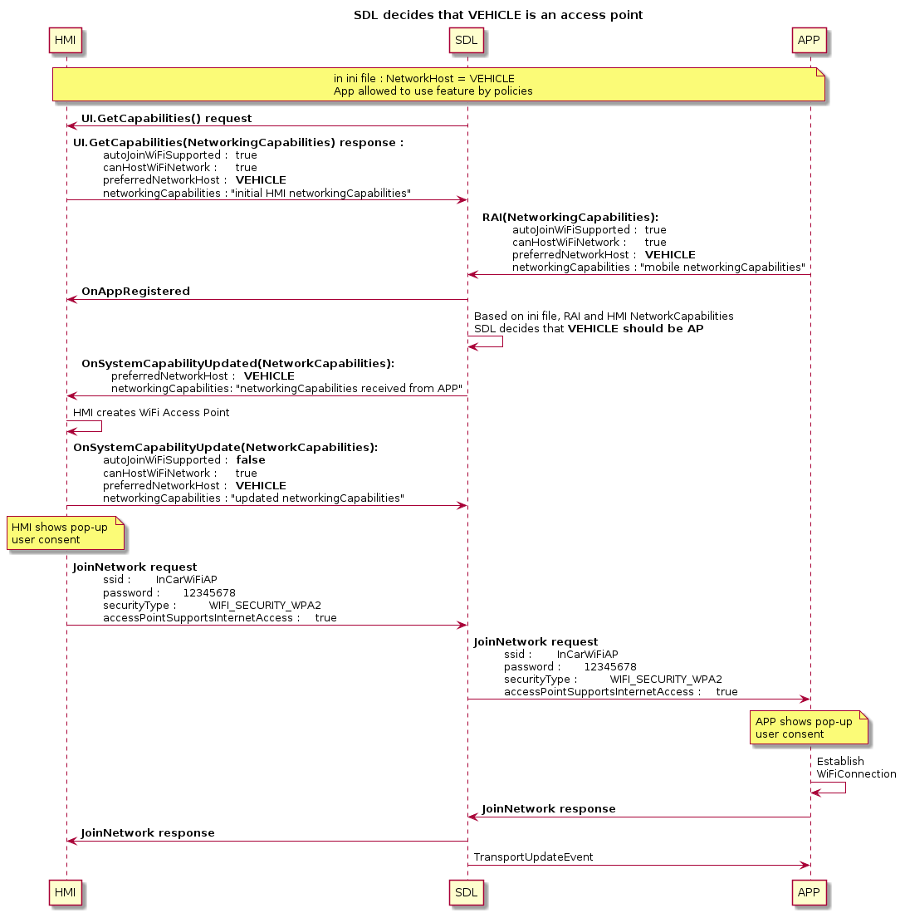

# WiFi Transport: Sharing SSID and password with Mobile Proxy

* Proposal: [SDL-0245](0245-sharing-wifi-ssid-and-password.md)
* Author: [Alexander Kutsan](https://github.com/ashwink11)
* Status: **Awaiting Review**
* Impacted Platforms: [Java Suite / iOS / RPC / Core / HMI]

## Introduction

The current proposal defines rules and communication facilities between IVI and the mobile device to establish a WiFi connection with the automatic sharing of credentials via SDL Core.

## Motivation

In the current implementation of SDL over WiFi transport, IP address and port are shared with Mobile proxy. However, the prerequisite for using SDL over WiFi transport is that the mobile device should be connected to WiFi.
In some cases, entering a password for the access point created by HMI could be tedious and it would be a lot more convenient for users if devices could automatically connect via WiFi.

If WiFi credentials are automatically generated by the IVI system, the password could contain special characters or it could be just too long. It would be inconvenient for the user to enter such passwords in the HMI. Another possible scenario is, the HMI could keep changing passwords to improve the security of the network. In such cases, a user might need to connect to the WiFi network every time the password is changed.

## Proposed solution

The functionality to be introduced in the current proposal mostly relies on the IVI and mobile device capabilities. It is proposed to introduce a new capability type to be specific for networking purposes to both Mobile and HMI API:

### HMI_API

SDL should be able to receive networking capabilities with `UI.GetCapabilities` request at the very beginning of SDL - HMI communication. If omitted, HMI will be considered as not suitable for the feature initialization.

```xml
<enum name="Device">
    <element name="MOBILE"/>
    <element name="VEHICLE"/>
</enum>

<enum name="FrequencyBand">
    <element name="FREQUENCY_BAND_2_4_GHZ"/>
    <element name="FREQUENCY_BAND_5_0_GHZ"/>
    <element name="FREQUENCY_BAND_6_0_GHZ"/>
</enum>

<struct name="NetworkingCapabilities">
    <description>Describes some of the sending device's available configurations around WiFi networking. This includes the ability to automatically join a network or host one itself.</description>
    <param name="autoJoinWiFiSupported" type="Boolean" mandatory="false">
        <description>Defines whether HMI supports programmatic join to the external network.</description>
    </param>
    <param name="canHostWiFiNetwork" type="Boolean" mandatory="false">
        <description>Defines whether HMI is capable of hosting WiFi network.</description>
    </param>
    <param name="dataFallbackSupported" type="Boolean" mandatory="false">
        <description> This describes the device's ability to support joining multiple networks and using one for internet connectivity if not available on a different, connected network.</description>
    </param>
    <param name="accessPointSupportsInternetAccess" type="Boolean" mandatory="false">
        <description> True if the access point created by this device will support internet access to connected clients.</description>
    </param>
    <param name="preferredNetworkHost" type="Device" mandatory="false">
        <description>This describes the preference of what device to use for the network host. This could mean the user prefers to use the data of either mobile or the vehicle when one might have unlimited data but a cap on another. When sent from mobile this will simply be a suggestion. When sent from the head unit, the mobile device should take this as a determined host.</description>
    </param>
    <param name="allowAccessPointToBeShared" type="Boolean" mandatory="false">
        <description> True if it is acceptable to share this network's SSID and password with other nearby devices. This is helpful if two mobile devices connected to a head unit, and one of them is selected as the network host.</description>
    </param>
    <param name="wifiFrequencyBandsSupported" type="FrequencyBand" array="true" minsize="1" maxsize="100" mandatory="false">
        <description>An array of frequencies supported by the device. Values should be in units of GHz for example 2.4GHz, 5.0GHz, etc.</description>
    </param>
    <param name="wifiSpecsSupported" type="String" array="true" minSize="1" maxSize="100" mandatory="false">
         <description> An array of WiFi Specifications, aka "Names", supported by the device. Currently expected values should be from the following: 802.11b = 1, 802.11a = 2, 802.11g = 3, 802.11n = 4, 802.11ac = 5, 802.11ax = 6.  </description>
    </param>
</struct>


<enum name="SystemCapabilityType">
  ...
  <element name="NETWORKING"/>
</enum>

<struct name="SystemCapability" since="4.5">
  ...
  <param name="networkingCapabilities" type="NetworkingCapabilities" mandatory="false" since="X.X">
    <description>Describes capabilities for networking </description>
  </param>
</struct>

<struct name="DeviceInfo">
  ...
  <param name="networkingCapabilities" type="NetworkingCapabilities" mandatory="false">
    <description>Describes HMI networking capabilities</description>
  </param>
</struct>
```

### MOBILE_API

SDL Core should receive mobile capabilities within `DeviceInfo` section of `RegisterAppInterface` request. If omitted, the application will be considered as not suitable for the feature initialization. Also, mobile application should be able to receive HMI networking capabilities on demand via `GetSystemCapabilities`, `OnSystemCapabilitiesUpdated`.

```xml
<enum name="FrequencyBand" since="x.x">
    <element name="FREQUENCY_BAND_2_4_GHZ"/>
    <element name="FREQUENCY_BAND_5_0_GHZ"/>
    <element name="FREQUENCY_BAND_6_0_GHZ"/>
</enum>

<enum name="Device" since="x.x">
    <element name="MOBILE"/>
    <element name="VEHICLE"/>
</enum>

<struct name="NetworkingCapabilities" since="x.x">
    <description>Describes some of the sending device's available configurations around WiFi networking. This includes the ability to automatically join a network or host one itself.</description>
    <param name="autoJoinWiFiSupported" type="Boolean" mandatory="false">
        <description>Defines whether mobile application supports programmatic join to the external network.</description>
    </param>
    <param name="canHostWiFiNetwork" type="Boolean" mandatory="false">
        <description>Defines whether mobile device is capable of hosting WiFi network.</description>
    </param>
    <param name="dataFallbackSupported" type="Boolean" mandatory="false">
        <description> This describes the device's ability to support joining multiple networks and using one for internet connectivity if not available on a different, connected network.</description>
    </param>
    <param name="accessPointSupportsInternetAccess" type="Boolean" mandatory="false">
        <description> True if the access point created by this device will support internet access to connected clients.</description>
    </param>
    <param name="preferredNetworkHost" type="Device" mandatory="false">
        <description> This describes the preference of what device to use for the network host. This could mean the user prefers to use the data of either mobile or the vehicle when one might have unlimited data but a cap on another. When sent from mobile this will simply be a suggestion. When sent from the head unit, the mobile device should take this as a determined host.</description>
    </param>
    <param name="allowAccessPointToBeShared" type="Boolean" mandatory="false">
        <description> True if it is acceptable to share this network's SSID and password with other nearby devices. This is helpful if two mobile devices connected to a head unit, and one of them is selected as the network host.</description>
    </param>
    <param name="wifiFrequencyBandsSupported" type="FrequencyBand" array="true" minSize="1" maxSize="100" mandatory="false">
        <description> An array of frequencies supported by the device. Values should be in units of GHz for example 2.4GHz, 5.0GHz, etc.</description>
    </param>
    <param name="wifiSpecsSupported" type="String" array="true" minSize="1" maxSize="100" mandatory="false">
         <description> An array of WiFi Specifications, aka "Names", supported by the device. Currently expected values should be from the following: 802.11b = 1, 802.11a = 2, 802.11g = 3, 802.11n = 4, 802.11ac = 5, 802.11ax = 6.  </description>
    </param>
</struct>

<struct name="DeviceInfo" since="3.0">
    ...
    <param name="networkingCapabilities" type="NetworkingCapabilities" mandatory="false" since="x.x">
        <description>Device's available configurations around networking</description>
    </param>
</struct>
```

### Application ability to use the feature

To avoid data races and uncontrollable reconnection to the access point, only one application per device has to be able to use this feature. Defining this application is the responsibility of SDL Core. To ensure applications are running on the same device, `DeviceInfo` section from `RegisterAppInterface` will be taken into account.

Permissions to use the feature should be also controlled by the OEM, so the application has to obtain specific permissions from the OEM's Policy Server. Since Core can define currently enabled applications for this feature only after Policy Table update, it has to cache all the network capabilities per application and also registration sequence to be sure that the first registered and allowed by the policy will be used for the feature initialization. Since SDL Core is responsible for the available application(s), the HMI is not required to know anything about the application(s).

Currently available applications for the feature initialization should be switched according to the following rules:

* Once the first application is unregistered, the second will become available for the feature.
* Application activation of feature enabled application will make this application the active for feature initialization.

__Note:__ after switching of the active application, if the connection is already established, no extra actions will be required for other applications. Capabilities of this application will be taken into account during feature reinitialization if one is required.

Before Policy Table update, SDL Core can make a preliminary decision based on the networking capabilities of the vehicle and mobile application:

#### Hardware compatibility

* `wifiFrequencyBandsSupported` - defines supported frequency bands.
Available values: FREQUENCY_BAND_2_4_GHZ, FREQUENCY_BAND_5_0_GHZ, FREQUENCY_BAND_6_0_GHZ;

If the `wifiFrequencyBandsSupported` of HMI does not intersect with mobile's, the feature cannot be initialized for the application.

If the result of the intersection of these parameters is a single value, which is allowed via ini file, the application can initialize the feature and the value should be used for the network.

If the result of the intersection of these parameters is more then one value, SDL Core should rely on priority (order defined in HMI network capabilities).

#### Determining which device should host the network

Once the head unit receives the `RegisterAppInterface` and the `NetworkingCapabilities` it must decide who should host. Each bullet point assumes that the network configurations can be supported by both devices (frequencies, data fallback, etc). These bullet points are just a suggestion, an OEM can determine the situation themselves.

* MOBILE (assuming `canHostWiFiNetwork` in NetworkingAbilities is set to true from mobile)
  - Core set `MOBILE` as the only device in the INI file
  - If Core set BOTH and the mobile device does NOT support dataFallbackSupported
  - If Core set BOTH and the mobile device set dataUsagePreference to MOBILE value
* VEHICLE (assuming canJoinNetwork in NetworkingAbilities is set to true from mobile)
  - Core set VEHICLE as the only device in the INI file
  - If Core set BOTH and the mobile device DOES support dataFallbackSupported
  - If Core set BOTH and the mobile device sets dataUsagePreference as VEHICLE
  - If any other settings mismatch, this will be the default

##### Additional Information

Can either be a hotspot or a common, known WiFi connection
* Android
 - startLocalOnlyHotspot() -  “The network created by this method will not have Internet access.”
 - When creating a hot spot programmatically, the result will not allow clients to share the internet connection of the mobile device
 - User could create an access point with internet access and the app could ask IVI to join
 - User could set preferred WiFi network
* iOS
 - Unable to create an access point programmatically
 - User could create an access point and the app could ask IVI to join
 - User could set preferred WiFi network


#### INI file update

```ini
[Networking]
;networkHostPriority defines the priority of network host in case parameter is omitted for mobile and vehicle networking capabilities, or if they contradict one another.
networkHostPriority = VEHICLE, MOBILE

;allowAccessPointSharing defines whether SDL Core is allowed to share credentials of the external access point
allowAccessPointSharing = FALSE
```

__Note:__ `preferredNetworkHost` is the array with priority defined by the order of elements.

### Feature initialization

After SDL Core defines suitable network configuration and finds available feature enabled application, it has to notify HMI or mobile application.

If head unit should be the network host: SDL Core requests HMI sets up a WiFi network as an `OnSystemCapabilities` notification that includes `NetworkingCapabilities` and `VEHICLE` as the `preferredNetworkHost`.

If the mobile device is selected to be the network host the selected app will receive the `OnSystemCapabilityUpdated` notification with the info that it was chosen to host the network.

Finally, to share the credentials of the network, it is proposed to implement the new RPC `JoinNetwork` to be sent by current networkHost.

Core then sends the `TransportEventUpdate` protocol message with IP and port to connect the TCP transport to all appropriate apps. Flow is then as defined in [0141-multiple-transports.md](https://github.com/smartdevicelink/sdl_evolution/blob/master/proposals/0141-multiple-transports.md)

#### Mobile API

```xml
<enum name="WiFiSecurityType">
    <description>enum to define WiFi security types used for WiFi connection.</description>
    <element name="NONE"/>
    <element name="WEP"/>
    <element name="WPA"/>
    <element name="WPA2"/>
    <element name="WPA3"/>
</enum>

<enum name="WiFiStateInfo">
  <description>enum to define WiFi state.</description>
  <element name="WIFI_STATE_DISABLED"/>
  <element name="WIFI_STATE_ENABLED"/>
</enum>

<function name="JoinNetwork" functionID="JoinNetworkID" messagetype="request" since="x.x">
    <description>A request for the receiver to join the specified network.</description>

    <param name="wifiState" type="WiFiStateInfo" mandatory="false">
        <description>wifi state info</description>
    </param>

    <param name="ssid" type="String" minlength="1" maxlength="32" mandatory="true">
        <description>name of the WiFi ssid</description>
    </param>
    <param name="password" type="String" minlength="1" maxlength="100" mandatory="false">
        <description>password to use to connect AP</description>
    </param>
    <param name="securityType" type="WiFiSecurityType" mandatory="false">
        <description>security type of WiFi AP</description>
    </param>
</function>

<function name="JoinNetwork" functionID="JoinNetworkID" messagetype="response" since="6.2">
    <description>A response and description of requested action.</description>
    <param name="success" type="Boolean" platform="documentation" mandatory="true">
        <description> true, if successful; false, if failed </description>
    </param>
    <param name="resultCode" type="Result" platform="documentation" mandatory="true">
        <description>See Result</description>
        <element name="SUCCESS"/>
        <element name="UNSUPPORTED_RESOURCE"/>
        <element name="DISALLOWED"/>
        <element name="REJECTED"/>
        <element name="TOO_MANY_PENDING_REQUESTS"/>
        <element name="APPLICATION_NOT_REGISTERED"/>
        <element name="GENERIC_ERROR"/>
        <element name="USER_DISALLOWED"/>
        <element name="DATA_NOT_AVAILABLE"/>
    </param>
    <param name="info" type="String" maxlength="1000" mandatory="false" platform="documentation">
        <description>Provides additional human readable info regarding the result.</description>
    </param>
</function>

```

#### HMI API

```xml
<enum name="WiFiSecurityType">
    <description>enum to define WiFi security types used for WiFi connection.</description>
    <element name="NONE"/>
    <element name="WEP"/>
    <element name="WPA"/>
    <element name="WPA2"/>
    <element name="WPA3"/>
</enum>

<function name="JoinNetwork" messagetype="request">
    <description>A request for the receiver to join the specified network.</description>
    <param name="wifiState" type="WiFiStateInfo" mandatory="false">
        <description>wifi state info</description>
    </param>
    <param name="ssid" type="String" minlength="1" maxlength="32" mandatory="true">
        <description>name of the WiFi ssid</description>
    </param>
    <param name="password" type="String" minlength="1" maxlength="100" mandatory="false">
        <description>password to use to connect AP</description>
    </param>
    <param name="securityType" type="Common.WiFiSecurityType" mandatory="false">
        <description>security type of WiFi AP</description>
    </param>
</function>

<function name="JoinNetwork" messagetype="response">
    <description>A response and description of requested action.</description>
    <param name="success" type="Boolean" platform="documentation" mandatory="true">
        <description> true, if successful; false, if failed </description>
    </param>
    <param name="resultCode" type="Common.Result" platform="documentation" mandatory="true">
    </param>
    <param name="info" type="String" maxlength="1000" mandatory="false" platform="documentation">
        <description>Provides additional human readable info regarding the result.</description>
    </param>
</function>
```

`JoinNetwork` should be sent by the current network host (previously defined within `OnSystemCapabilityUpdated`).
`JoinNetwork` has to be rejected by Core if:

* it is sent from the device, which is not selected as a network host;
* it is sent before `OnSystemCapabilityUpdated` received.

SDL Core has to perform basic validation for the parameters of the `JoinNetwork` request:

* if `wifiState` is set to `WIFI_ENABLED`: `ssid` parameter has to be presented;
* if `securityType` is set to any value but `NONE`: `password` parameter has to be presented.

SDL will not transfer `JoinNetwork` to app on the mobile device in any application on the mobile device had already started service via WiFi transport.

HMI should not send `JoinNetwork` in case if there is at least one app from each device which has established service via WiFi.
In other words, HMI should send `JoinNetwork` in case if there is at least one device with no apps that established WiFi service.

If the validation process successfully passed, the request should be transferred to the network client.

__Note:__ `JoinNetwork` should not depend on the default RPC timeout, since WiFi connection may take much more time. So, this RPC has to operate without active timeout from Core perspective.

<!--
@startuml ../assets/proposals/0245-sharing-wifi-ssid-and-password/vehicle_access_point
!include ../assets/proposals/0245-sharing-wifi-ssid-and-password/vehicle_access_point.puml
@enduml
-->


<!--
@startuml ../assets/proposals/0245-sharing-wifi-ssid-and-password/mobile_access_point
!include ../assets/proposals/0245-sharing-wifi-ssid-and-password/mobile_access_point.puml
@enduml
-->


<!--
@startuml ../assets/proposals/0245-sharing-wifi-ssid-and-password/vehicle_access_point_multiapps
!include ../assets/proposals/0245-sharing-wifi-ssid-and-password/vehicle_access_point_multiapps.puml
@enduml
-->


### Multiple device connection

#### Vehicle is a network host

For each connected device, SDL Core will select a single feature enabled application.

Once network parameters are established with the first device, `OnNetworkConfiguration` will be sent to this application and HMI. After receiving this notification, HMI should send `OnSystemCapabilityUpdated` in case capabilities have changed. The next application's capabilities will be compared to updated HMI capabilities.

This mechanism will allow the HMI to decide its own behavior based on all of the following incoming connections.

<!--
@startuml ../assets/proposals/0245-sharing-wifi-ssid-and-password/vehicle_access_point_multidev
!include ../assets/proposals/0245-sharing-wifi-ssid-and-password/vehicle_access_point_multidev.puml
@enduml
-->


#### Mobile device is a network host

A precondition for further discussion is that the first device is connected, it hosts the network and HMI successfully connected to its hotspot. SDL Core already received `OnSystemCapabilityUpdate` with updated networking capabilities.

A vehicle should be able to share credentials of the external hotspot only if `allowAccessPointSharing` is set to true in mobile application `NetworkCapabilities` and the ini file.

If mobile is an access point and `allowAccessPointSharing = false`, vehicle is not able to establish Wifi connection with other devices.

In that case, HMI should provide SDL `OnSystemCapabilityUpdate` with appropriate `canHostWiFiNetwork`, and `autoJoinWiFiSupported`.

Once vehicle is connected to the mobile hotspot, HMI should send `OnSystemCapabilityUpdate` with `canHostWiFiNetwork = true` and `preferredNetworkHost = VEHICLE`. If the new application is compatible with HMI network capabilities, Core will send `OnSystemCapabilityUpdate` with `networkHost = VEHICLE` to HMI and new mobile application. Then HMI should send `JoinNetwork` with the credentials of the external hotspot.

<!--
@startuml ../assets/proposals/0245-sharing-wifi-ssid-and-password/mobile_access_point_multidev_externalhost
!include ../assets/proposals/0245-sharing-wifi-ssid-and-password/mobile_access_point_multidev_externalhost.puml
@enduml
-->


### RPCs Encryption

WiFi credentials are considered as sensitive data, and should not be shared without encryption.
[SDL 0207 - RPC message protection](https://github.com/smartdevicelink/sdl_evolution/issues/634) feature.

RPC message protection is controlled completely by Policy Table.

It is advised to restrict `JoinNetwork` to be sent only by encrypted RPC service, but it is up to particular OEM. SDL does not enforce `JoinNetwork` to be sent only by encrypted RPC service.

If `JoinNetwork` or `OnSystemCapabilityUpdated` should not be protected, there are no additional issues.
If `JoinNetwork` or `OnSystemCapabilityUpdate` are allowed only via protected RPC service, the following rules are applied:

* Reject `JoinNetwork` from mobile if it is sent via unprotected service. (guaranteed by SDL 0207)
* Reject `JoinNetwork` from HMI if appropriate mobile has not started protected service yet (result code: REJECT)
* SDL should not send `OnSystemCapabilityUpdate` to HMI until appropriate mobile won't start secure RPC service.<br>

__Note:__ Such rule is required because HMI `OnSystemCapabilityUpdate` for HMI can be trigger for sending `JoinNetwork` to mobile.

* Starting secure RPC service should trigger postponed `OnSystemCapabilityUpdate` to HMI.
* In case if `JoinNetwork` is allowed non secure, SDL not should postpone `OnSystemCapabilityUpdate` to HMI.

Consider following sequences:
<!--
@startuml ../assets/proposals/0245-sharing-wifi-ssid-and-password/secure_service
!include ../assets/proposals/0245-sharing-wifi-ssid-and-password/secure_service.puml
@enduml
-->


### Preloaded policy table

It is proposed to introduce new functional group within current proposal:

```json
"policy_table": {
    ...
    "functional_groupings": {
        ...
        "NetworkSharing": {
            "rpcs": {
                "OnSystemCapabilityUpdate": {
                    "hmi_levels": [
                        "BACKGROUND",
                        "FULL",
                        "LIMITED",
                        "NONE"
                    ]
                },
                "JoinNetwork": {
                    "encryption_required": true,
                    "hmi_levels": [
                        "BACKGROUND",
                        "FULL",
                        "LIMITED",
                        "NONE"
                    ]
                }
            }
        }
    }
}
```

__Note:__ Keep in mind, if `encryption_required` for `OnSystemCapabilityUpdate` is set to `true`, mobile application will not receive notification until secure service is established.

## Troubleshooting and race conditions


### Android Permission Issue

android.permission.WRITE_SETTINGS required for Android SDK 29+
This permission is a “system” permission. This causes an error message in the manifest.xml editor to appear
User must specifically grant this permission. This is not the same as a location permission request, it is a distinct permission with its own settings pageWill require a dialog/pop up explaining why the user must grant this permission and then forward the user to the settings page where they can grant it.
Because this feature can be used by any app (not just a single OEM app), this will require a pop up and user redirect for all apps that are going to use the feature.


### iOS Entitlement Issues

The feature could be difficult to test on iOS. If it's not easily tested, regression issues could easily surface.
Each app will need to apply to Apple for the entitlement
Joining the network requires the user to interact with the device each time
 - “[app] Wants to Join Wi-Fi Network”


### Race condition in case of multiple device connection

#### Registration race

From the Core perspective, registration process is sequential and since it will cache registration order, there will not be race conditions during registration.

#### Capability race

##### Vehicle is the hotspot

After the application from the device is connected and if the vehicle should be the hotspot, SDL Core will send `OnSystemCapabilityUpdate` notification to the HMI. Since it is the vehicle's responsibility to start the hotspot, Core should wait for `OnSystemCapabilityUpdate` with the updated capabilities. Only after this notification is Core ready to process feature enabled application from another device.

#### Mobile device is the hotspot

After SDL Core has decided that the mobile device should be an access point, Core will send `OnSystemCapabilityUpdate` notification to the application. Since HMI has nothing to do before establishing WiFi connection, the HMI capability will be updated only after connection attempt to the mobile hotspot. Before this step another connected app (on another device) may receive wrong `OnSystemCapabilityUpdate` notification.

### WiFi disconnection

SDL Core knows nothing of the WiFi connection state. The application which uses this feature will connect via secondary transport. After the connection is established, Core will not proceed feature RPCs to the application. Once WiFi connection is lost, secondary transport connection will be broken, so the feature will be enabled again for the application until TCP connection will be established.

### Manual WiFi connection

Mobile device can still be connected to the vehicle manually (or vice versa). In this case, if an application is connected via other transports, it will receive `TransportEventUpdate` and applications will be able to connect via WiFi, so the feature is not required after this point. Core should not process `OnSystemCapabilityUpdate` and `JoinNetwork` for the application, which is already connected via WiFi.

However, if there are no applications connected via WiFi, Core knows nothing of the established connection, so the first feature enabled application will still be able to use the feature.

<!--
@startuml ../assets/proposals/0245-sharing-wifi-ssid-and-password/WiFi_AP_created_manually_Disconnected
!include ../assets/proposals/0245-sharing-wifi-ssid-and-password/WiFi_AP_created_manually_Disconnected.puml
@enduml
-->


## Potential Downsides

SDL Core is not able to check that two different transports belong to the same device.

For a device connected by two different transport types, SDL will understand this as two different devices.

HMI is not able to check if certain application is connected to the same WiFi network as HMI does without establishing TCP connection and starting service on secondary transport.
Such behavior is required to avoid sending redundant `JoinNetwork` to mobile and to avoid showing confusing user consent popup.

## Alternative solutions

### Minor alternatives

 1. Use OnSystemRequest instead of new notification.

Proposition discussed and rejected during SDLC discussion  https://github.com/smartdevicelink/sdl_evolution/issues/799

2. Do not postpone sending `OnSystemCapabilityUpdate` to HMI if secure service was not started, but extend `OnServiceStatusUpdate` with `encrypted` flag.

* This was rejected because `OnServiceStatusUpdate` is specific for application, but for WiFi functionality sharing HMI does not know particular application for sending `JoinNetwork`.

3. Leave establishing secondary transport on app activation.

Consider following drawbacks:

* Application will receive redundant `JoinNetwork`
* HMI will show redundant confusing user consent
* Application will receive redundant `JoinNetwork` on app on second device registration
* Applicable if mobile is access point, and there are multiple devices (sharing is allowed)

### Minimal approach solution

#### Proposed solution

Current proposal introduces additional APIs for sharing WiFi credentials between the vehicle and devices.

This solution does not put on SDL Core any logic to determine access point host.

This decision should be controlled by HMI.

SDL Core does not have direct access to WiFi hardware, so SDL Core is not able to check the current WiFi state.
Such an approach gives the OEM the ability to have their own rules and priorities for WiFi interaction.

This approach can be easily integrated into some already existing solution because there is no additional logic on SDL Core, and an OEM may just adopt an existing solution for using new APIs.

The proposed approach is designed to avoid bidirectional RPCs because it adds technical complexity that causes additional bugs.

The following API extension will provide the mobile device ability to share their networking capabilities.

#### Sharing mobile networking capabilities with the vehicle

**MOBILE_API** :

SDL Core should receive mobile capabilities within `DeviceInfo` section of `RegisterAppInterface` request.

```xml
<enum name="FrequencyBand" since="x.x">
    <element name="FREQUENCY_BAND_2_4_GHZ"/>
    <element name="FREQUENCY_BAND_5_0_GHZ"/>
    <element name="FREQUENCY_BAND_6_0_GHZ"/>
</enum>

<enum name="NetworkHost" since="x.x">
    <element name="MOBILE"/>
      <description>
        Use mobile device as WiFi access point
      </description>
    </element>
    <element name="VEHICLE"/>
      <description>
        Use vehicle as WiFi access point
      </description>
    </element>
</enum>

<struct name="MobileNetworkingCapabilities" since="x.x">
  <description>
    Describes sending device's availability configurations around WiFi networking.
    This includes the ability to automatically join a network or to host one by itself.
  </description>
    <param name="autoJoinWiFiSupported" type="Boolean" mandatory="false">
      <description>
        Defines whether mobile application supports programmatic join to the external network.
      </description>
    </param>
    <param name="hostingWiFiSupported" type="Boolean" mandatory="false">
      <description>Defines whether mobile device is capable of hosting WiFi network.</description>
    </param>
    <param name="preferredNetworkHost" type="NetworkHost" mandatory="false">
      <description>
        This describes the preference of what device (vehicle or mobile) to use as a WiFi access point.
      </description>
    </param>
    <param name="wifiFrequencyBandsSupported" type="FrequencyBand" array="true" minSize="1" maxSize="100" mandatory="false">
      <description>
        An array of frequencies supported by the device.
      </description>
    </param>
</struct>

<struct name="DeviceInfo" since="3.0">
    ...
    <param name="networkingCapabilities" type="MobileNetworkingCapabilities" mandatory="false" since="x.x">
        <description>Device's available configurations around networking</description>
    </param>
    ...
</struct>
```

**HMI_API** :

SDL Core will send mobile networking capabilities in `OnAppRegistered` notification within `DeviceInfo` struct.

```xml

<enum name="NetworkHost">
    <element name="MOBILE"/>
      <description>
        Use mobile device as WiFi access point
      </description>
    </element>
    <element name="VEHICLE"/>
      <description>
        Use vehicle as WiFi access point
      </description>
    </element>
</enum>

<enum name="FrequencyBand">
    <element name="FREQUENCY_BAND_2_4_GHZ"/>
    <element name="FREQUENCY_BAND_5_0_GHZ"/>
    <element name="FREQUENCY_BAND_6_0_GHZ"/>
</enum>

<struct name="MobileNetworkingCapabilities">

  <description>
    Describes sending device's availability configurations around WiFi networking.
    This includes the ability to automatically join a network or to host one by itself.
  </description>

  <param name="autoJoinWiFiSupported" type="Boolean" mandatory="false">
    <description>
      Defines whether mobile application supports programmatic join to the external network.
    </description>
  </param>
  <param name="hostingWiFiSupported" type="Boolean" mandatory="false">
    <description>
      Defines whether mobile device is capable of hosting WiFi network.
    </description>
  </param>
    <param name="preferredNetworkHost" type="NetworkHost" mandatory="false">
      <description>
        This describes the preference of what device (vehicle or mobile) to use as a WiFi access point.
    </description>
    </param>
    <param name="wifiFrequencyBandsSupported" type="FrequencyBand" array="true" minsize="1" maxsize="100" mandatory="false">
      <description>
        An array of frequencies supported by the device.
      </description>
    </param>
</struct>

<struct name="DeviceInfo">
  ...
  <param name="networkingCapabilities" type="MobileNetworkingCapabilities" mandatory="false">
        <description>Describes device's networking capabilities</description>
  </param>
  ...
</struct>

```

#### INI file update

Ini file will contain supported modes for the vehicle.
SDL Core should restrict RPCs not supported by the vehicle.

```ini
[Networking]

; WifiModesSupported provides information to SDL Core regarding if the HMI can join to an external WiFi network, and if it can host a WiFi network. 
; SDL Core should not allow JoinMobileNetwork requests from mobile if HMI is not able to join a network.
; SDL should not allow JoinVehicleNetwork requests from HMI if HMI is not able to host network.
WifiModesSupported = AccessPoint, WifiClient

```


If `WifiModesSupported` is empty or omitted, SDL Core will not process `JoinVehicleNetwork` and `JoinMobileNetwork` RPCs and respond with error `UNSUPPORTED_REQUEST` result code.

#### Sharing SSID with Join request

Instead of sharing SSID with a password via `Get` requests, this solution proposes to use *Hollywood Principle*: "Don't call us, we'll call you."

If vehicle is ready to accept WiFi connection, it will ask mobile for connection via `JoinVehicleNetwork`.

If the vehicle is ready to connect to the mobile access point, it will notify the mobile device via `ReadyForWifiConnection`.

If mobile is ready to accept WiFi connection, it will ask vehicle for connection via `JoinMobileNetwork`.

The following API changes are required:
##### MOBILE_API

```xml

<enum name="WiFiSecurityType">
    <description>enum to define WiFi security types used for WiFi connection.</description>
    <element name="NONE"/>
    <element name="WEP"/>
    <element name="WPA"/>
    <element name="WPA2"/>
    <element name="WPA3"/>
</enum>


<function name="ReadyForWifiConnection" functionID="ReadyForWifiConnectionID" messagetype="notification" since="x.x">
    <description>
      Notification from vehicle to mobile to inform that vehicle is ready to be WiFi client and requests WiFi connection with mobile as an access point.
    </description>

    <param name="wifiFrequencyBandsSupported" type="FrequencyBand" array="true" minsize="1" maxsize="100" mandatory="false">
      <description>
        An array of frequencies supported by the vehicle.
      </description>
    </param>
</function>

<function name="JoinVehicleNetwork" functionID="JoinVehicleNetworkID" messagetype="request" since="x.x">
    <description>
      A request to the mobile device to join the vehicle network.
    </description>

    <param name="ssid" type="String" minlength="1" maxlength="32" mandatory="true">
        <description>vehicle access point SSID</description>
    </param>
    <param name="password" type="String" minlength="1" maxlength="100" mandatory="false">
        <description>password to use to connect AP</description>
    </param>
    <param name="securityType" type="WiFiSecurityType" mandatory="false">
        <description>security type of WiFi AP</description>
    </param>
    <param name="accesssPointSupportsInternetAccess" type="Boolean" mandatory="false">
        <description>true if access point provides internet access, otherwise false.</description>
    </param>
</function>

<function name="JoinVehicleNetwork" functionID="JoinVehicleNetworkID" messagetype="response" since="6.2">
    <description>A response and description of requested action.</description>
    <param name="success" type="Boolean" platform="documentation" mandatory="true">
        <description> true, if successful; false, if failed </description>
    </param>
    <param name="resultCode" type="Result" platform="documentation" mandatory="true">
        <description>See Result</description>
        <element name="SUCCESS"/>
        <element name="UNSUPPORTED_RESOURCE"/>
        <element name="DISALLOWED"/>
        <element name="REJECTED"/>
        <element name="TOO_MANY_PENDING_REQUESTS"/>
        <element name="APPLICATION_NOT_REGISTERED"/>
        <element name="GENERIC_ERROR"/>
        <element name="USER_DISALLOWED"/>
        <element name="DATA_NOT_AVAILABLE"/>
    </param>
    <param name="info" type="String" maxlength="1000" mandatory="false" platform="documentation">
        <description>Provides additional human readable info regarding the result.</description>
    </param>
</function>

<function name="JoinMobileNetwork" functionID="JoinMobileNetworkID" messagetype="request" since="x.x">
    <description>
      A request to the vehicle to join the mobile network.
    </description>

    <param name="ssid" type="String" minlength="1" maxlength="32" mandatory="true">
        <description>mobile access point SSID</description>
    </param>
    <param name="password" type="String" minlength="1" maxlength="100" mandatory="false">
        <description>password to use to connect AP</description>
    </param>
    <param name="securityType" type="WiFiSecurityType" mandatory="false">
        <description>security type of WiFi AP</description>
    </param>
    <param name="allowAccessPointSharing" type="Boolean" mandatory="false">
        <description>true if it is acceptable to share this network's SSID and password with other nearby devices. This is helpful if two mobile devices connected to a head unit, and one of them is selected as the network host.</description>
    </param>
    <param name="accesssPointSupportsInternetAccess" type="Boolean" mandatory="false">
        <description>true if access point provides internet access, otherwise false.</description>
    </param>
</function>

<function name="JoinMobileNetwork" functionID="JoinMobileNetworkID" messagetype="response" since="6.2">
    <description>A response and description of requested action.</description>
    <param name="success" type="Boolean" platform="documentation" mandatory="true">
        <description> true, if successful; false, if failed </description>
    </param>
    <param name="resultCode" type="Result" platform="documentation" mandatory="true">
        <description>See Result</description>
        <element name="SUCCESS"/>
        <element name="UNSUPPORTED_RESOURCE"/>
        <element name="DISALLOWED"/>
        <element name="REJECTED"/>
        <element name="TOO_MANY_PENDING_REQUESTS"/>
        <element name="APPLICATION_NOT_REGISTERED"/>
        <element name="GENERIC_ERROR"/>
        <element name="USER_DISALLOWED"/>
        <element name="DATA_NOT_AVAILABLE"/>

    </param>
    <param name="info" type="String" maxlength="1000" mandatory="false" platform="documentation">
        <description>Provides additional human readable info regarding the result.</description>
    </param>
</function>


```

##### HMI API

```xml
<enum name="WiFiSecurityType">
    <description>enum to define WiFi security types used for WiFi connection.</description>
    <element name="NONE"/>
    <element name="WEP"/>
    <element name="WPA"/>
    <element name="WPA2"/>
    <element name="WPA3"/>
</enum>

<function name="ReadyForWifiConnection" messagetype="notification">
    <description>
      Notification from vehicle to mobile to inform that vehicle is ready to be WiFi client and requests WiFi connection with the mobile device as an access point. 
    </description>


    <param name="appID" type="Integer" mandatory="true">
      <description>Unique (during ignition cycle) ID of the application.</description>
    </param>

    <param name="wifiFrequencyBandsSupported" type="FrequencyBand" array="true" minsize="1" maxsize="100" mandatory="false">
      <description>
        An array of frequencies supported by the vehicle.
      </description>
    </param>
</function>

<function name="JoinVehicleNetwork" messagetype="request">
    <description>
      request to the mobile device to join the vehicle network.
    </description>

    <param name="appID" type="Integer" mandatory="true">
      <description>Unique (during ignition cycle) ID of the application. </description>
    </param>

    <param name="ssid" type="String" minlength="1" maxlength="32" mandatory="true">
        <description>vehicle access point SSID</description>
    </param>
    <param name="password" type="String" minlength="1" maxlength="100" mandatory="false">
        <description>password to use to connect AP</description>
    </param>
    <param name="securityType" type="Common.WiFiSecurityType" mandatory="false">
        <description>security type of WiFi AP</description>
    </param>
    <param name="accesssPointSupportsInternetAccess" type="Boolean" mandatory="false">
        <description>True if access point provides internet access, otherwise false.</description>
    </param>
</function>

<function name="JoinVehicleNetwork" messagetype="response">
    <description>A response and description of requested action.</description>
    <param name="success" type="Boolean" platform="documentation" mandatory="true">
        <description> true, if successful; false, if failed </description>
    </param>
    <param name="resultCode" type="Common.Result" platform="documentation" mandatory="true">
    </param>
    <param name="info" type="String" maxlength="1000" mandatory="false" platform="documentation">
        <description>Provides additional human readable info regarding the result.</description>
    </param>
</function>

<function name="JoinMobileNetwork" messagetype="request">
    <description>
      A request to the vehicle to join the mobile network.
    </description>

    <param name="appID" type="Integer" mandatory="true">
      <description>Unique (during ignition cycle) ID of the application.</description>
    </param>

    <param name="ssid" type="String" minlength="1" maxlength="32" mandatory="true">
        <description>mobile access point SSID</description>
    </param>
    <param name="password" type="String" minlength="1" maxlength="100" mandatory="false">
        <description>password to use to connect AP</description>
    </param>
    <param name="securityType" type="Common.WiFiSecurityType" mandatory="false">
        <description>security type of WiFi AP</description>
    </param>
    <param name="allowAccessPointSharing" type="Boolean" mandatory="false">
        <description>true if it is acceptable to share this network's SSID and password with other nearby devices. This is helpful if two mobile devices connected to a head unit, and one of them is selected as the network host.</description>
    </param>
    <param name="accesssPointSupportsInternetAccess" type="Boolean" mandatory="false">
        <description>true if access point provides internet access, otherwise false.</description>
    </param>
</function>

<function name="JoinMobileNetwork" messagetype="response">
    <description>A response and description of requested action.</description>
    <param name="success" type="Boolean" platform="documentation" mandatory="true">
        <description> true, if successful; false, if failed </description>
    </param>
    <param name="resultCode" type="Common.Result" platform="documentation" mandatory="true">
    </param>
    <param name="info" type="String" maxlength="1000" mandatory="false" platform="documentation">
        <description>Provides additional human readable info regarding the result.</description>
    </param>
</function>
```

HMI should send `JoinVehicleNetwork` to mobile if WiFi connection is required. 

OEM can decide if this requirement should be sent either on app activation of after app registration. 

HMI should send `ReadyForWifiConnection` to mobile if the WiFi connection is required but OEM prefers to use mobile device's Wifi. 

Mobile should send `JoinMobileNetwork` to vehicle right after receiving `ReadyForWifiConnection`.

SDL Core will not filter `JoinMobileNetwork` if HMI didn't send `ReadyForWifiConnection` before. 

__Note:__ `JoinVehicleNetwork`, `JoinMobileNetwork` should not depend on the default RPC timeout, since WiFi connection may take much more time. So, this RPC has to operate without an active timeout from the sdl_core perspective.

<!--
@startuml ../assets/proposals/0245-sharing-wifi-ssid-and-password/minimal_approach
!include ../assets/proposals/0245-sharing-wifi-ssid-and-password/minimal_approach.puml
@enduml
-->


##### Manual Wifi connection

HMI should not send `JoinVehicleNetwork` to the application if at least one application on the corresponding device started WiFi secondary transport. HMI will take information about device apps and transports from `UpdateAppList` and `UpdateDeviceList` notifications from SDL. 

If the user established WiFi connection manually, the vehicle has no instruments to check that it is connected to the same WiFi network as mobile application until the application doesn't start the secondary transport. 

So HMI may send redundant `JoinVehicleNetwork`/`ReadyForWifiConnection` to the application. `sdl_proxy` should not initiate the connection to vehicle WiFi network if it is already connected. 

#### Multiple device connections

The OEM has full control on multiple device connection policy. 

#### RPCs Encryption

WiFi credentials are considered sensitive data, and should not be shared without encryption.

To protect WiFi credentials [SDL 0207 - RPC message protection](https://github.com/smartdevicelink/sdl_evolution/issues/634) feature is used.

RPC message protection is controlled completely by the Policy Table.

It is advised to restrict `JoinMobileNetwork`, `JoinVehicleNetwork`, to be sent only by encrypted RPC service, but it is up to each OEM upon implementation. SDL Core does not enforce that RPCs should be sent only by encrypted RPC service.

SDL Core will not transfer `JoinVehicleNetwork` to mobile by non-secure RPC service if encryption is required. SDL Core will respond with the `REJECTED` result code.

HMI should know about RPC service encryption status for each application. 
Therefore, this solution proposes to extend `OnServiceUpdate` notification with the appropriate information: 
```xml

<function name="OnServiceUpdate" messagetype="notification">
  <param name="encrypted" type="true" mandatory="false">
</function>

```
If `encrypted` parameter is omitted, it means that service is not encrypted.

#### Preloaded policy table

It is proposed to introduce a new functional group within the current proposal:

```json
"policy_table": {
    ...
    "functional_groupings": {
        ...
        "NetworkSharing": {
            "rpcs": {
                "ReadyForWifiConnection": {
                    "encryption_required": false,
                    "hmi_levels": [
                        "BACKGROUND",
                        "FULL",
                        "LIMITED",
                        "NONE"
                    ]
                },
                "JoinMobileNetwork": {
                    "encryption_required": true,
                    "hmi_levels": [
                        "BACKGROUND",
                        "FULL",
                        "LIMITED",
                        "NONE"
                    ]
                },
                "JoinVehicleNetwork": {
                    "encryption_required": true,
                    "hmi_levels": [
                        "BACKGROUND",
                        "FULL",
                        "LIMITED",
                        "NONE"
                    ]
                }
            }
        }
    }
}
```

### Potential Downsides

SDL is not able to check that 2 different transport connections belongs to one mobile device. The device connected by two different types of transport will be considered by SDL Core as two different devices.

### Alternative solutions 

1. Use `OnSystemRequest` with subtype `WIFI_READY_TO_CONNECT` instead of `ReadyForWifiConnection`

2. Add DeviceID parameter to RAI request. So sdl_proxy should be responsible for providing a unique device identifier.

3. Add `MobileNetworkCapabilitiesUpdate` RPC from mobile to vehicle to inform vehicle that mobile network capabilities have been updated. For example, the user manually created a hotspot on mobile, and the application is not able to join the WiFi network anymore. 

4. Start secondary transport right after registration, but not on app activation. This prevents sending redundant `JoinVehicleNetwork`/`ReadyForWifiConnection` to the application. 

5. Send WiFI SSID in `RegisterAppInterface`.
It is possible for the device to be connected to WiFi before any application is registered (for example, manual connection). In this case it will be useful for IVI to be aware of this connection. So, as an alternative, it is proposed to send SSID of currently connected WiFi network within `RegisterAppInterface` request. However, this approach introduces a number of issues:
* SSID is not unique enough identifier
* The access point could be configured in a way not to share SSID. In this case, its sharing from mobile device could become a security issue.
