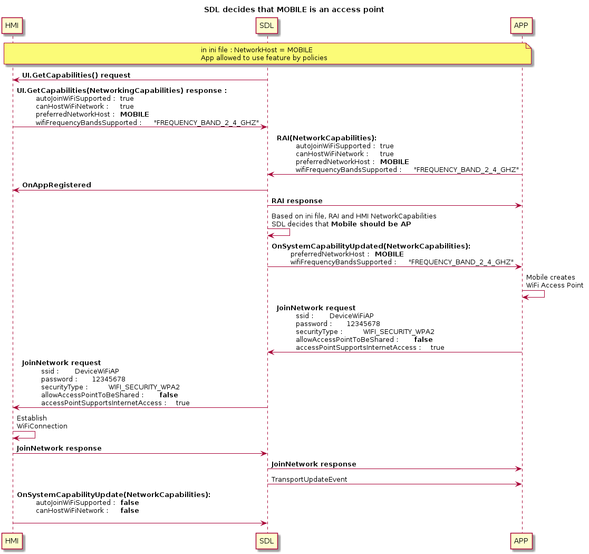
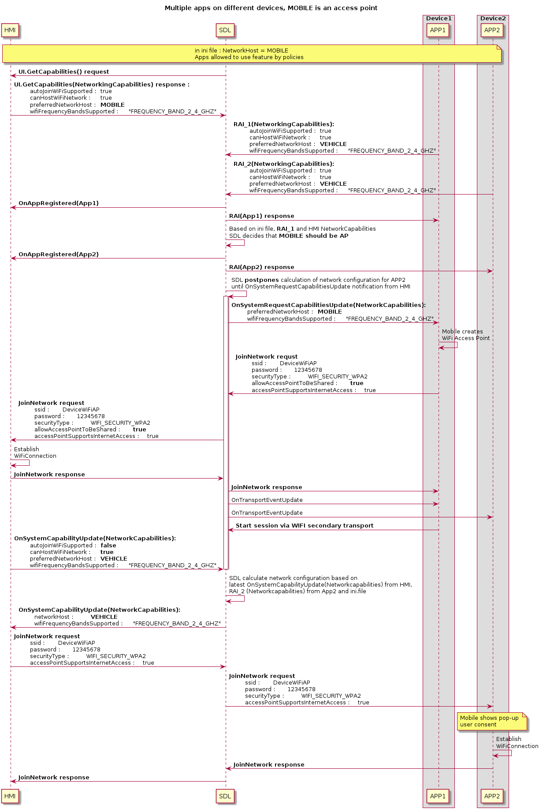

# WiFi Transport: Sharing SSID and password with Mobile Proxy

* Proposal: [SDL-0245](0245-sharing-wifi-ssid-and-password.md)
* Author: [Alexander Kutsan](https://github.com/ashwink11)
* Status: **Awaiting Review**
* Impacted Platforms: [Java Suite / iOS / RPC / Core / HMI]

## Introduction

The current proposal defines rules and communication facilities between IVI and the mobile device to establish a WiFi connection with the automatic sharing of credentials via SDL Core.

## Motivation

In the current implementation of SDL over WiFi transport, IP address and port are shared with Mobile proxy. However, the prerequisite for using SDL over WiFi transport is that the mobile device should be connected to WiFi.
In some cases, entering a password for the access point created by HMI could be tedious and it would be a lot more convenient for users if devices could automatically connect via WiFi.

If WiFi credentials are automatically generated by the IVI system, the password could contain special characters or it could be just too long. It would be inconvenient for the user to enter such passwords in the HMI. Another possible scenario is, the HMI could keep changing passwords to improve the security of the network. In such cases, a user might need to connect to the WiFi network every time the password is changed.

## Proposed solution

The functionality to be introduced in the current proposal mostly relies on the IVI and mobile device capabilities. It is proposed to introduce a new capability type to be specific for networking purposes to both Mobile and HMI API:

### HMI_API

SDL should be able to receive networking capabilities with `UI.GetCapabilities` request at the very beginning of SDL - HMI communication. If omitted, HMI will be considered as not suitable for the feature initialization.

```xml
<enum name="Device">
    <element name="MOBILE"/>
    <element name="VEHICLE"/>
</enum>

<enum name="FrequencyBand">
    <element name="FREQUENCY_BAND_2_4_GHZ"/>
    <element name="FREQUENCY_BAND_5_0_GHZ"/>
    <element name="FREQUENCY_BAND_6_0_GHZ"/>
</enum>

<struct name="NetworkingCapabilities">
    <description>Describes some of the sending device's available configurations around WiFi networking. This includes the ability to automatically join a network or host one itself.</description>
    <param name="autoJoinWiFiSupported" type="Boolean" mandatory="false">
        <description>Defines whether HMI supports programmatic join to the external network.</description>
    </param>
    <param name="hostingWiFiSupported" type="Boolean" mandatory="false">
        <description>Defines whether HMI is capable of hosting WiFi network.</description>
    </param>
    <param name="preferredNetworkHost" type="Device" mandatory="false">
        <description>This describes the preference of what device to use for the network host. This could mean the user prefers to use the data of either mobile or the vehicle when one might have unlimited data but a cap on another. When sent from mobile this will simply be a suggestion. When sent from the head unit, the mobile device should take this as a determined host.</description>
    </param>
    <param name="wifiFrequencyBandsSupported" type="FrequencyBand" array="true" minsize="1" maxsize="100" mandatory="false">
        <description>An array of frequencies supported by the device. Values should be in units of GHz for example 2.4GHz, 5.0GHz, etc.</description>
    </param>
 	
    <param name="dataFallbackSupported" type="Boolean" mandatory="false">
        <description> This describes the device's ability to support joining multiple networks and using one for internet connectivity if not available on a different, connected network.</description>
    </param> 	 

    <param name="accessPointSupportsInternetAccess" type="Boolean" mandatory="false">
        <description> True if the access point created by this device will support internet access to connected clients.</description>
    </param> 	 

    <param name="allowAccessPointToBeShared" type="Boolean" mandatory="false">
        <description> True if it is acceptable to share this network's SSID and password with other nearby devices. This is helpful if two mobile devices connected to a head unit, and one of them is selected as the network host.</description>
    </param> 	

    <param name="wifiSpecsSupported" type="String" array="true" minSize="1" maxSize="100" mandatory="false">
         <description> An array of WiFi Specifications, aka "Names", supported by the device. Currently expected values should be from the following: 802.11b = 1, 802.11a = 2, 802.11g = 3, 802.11n = 4, 802.11ac = 5, 802.11ax = 6.  </description>
    </param> 

</struct>


<enum name="SystemCapabilityType">
    ...
    <element name="NETWORKING"/>
</enum>

<struct name="SystemCapability" since="4.5">
  ...
    <param name="networkingCapabilities" type="NetworkingCapabilities" mandatory="false" since="X.X">
    <description>Describes capabilities for networking </description>
        </param>
</struct>

<struct name="DeviceInfo">
    ...
    <param name="networkingCapabilities" type="NetworkingCapabilities" mandatory="false">
        <description>Describes HMI networking capabilities</description>
    </param>
</struct>
```

### MOBILE_API

SDL Core should receive mobile capabilities within `DeviceInfo` section of `RegisterAppInterface` request. If omitted, the application will be considered as not suitable for the feature initialization. Also, mobile application should be able to receive HMI networking capabilities on demand via `GetSystemCapabilities`, `OnSystemCapabilitiesUpdated`.

```xml
<enum name="FrequencyBand" since="x.x">
    <element name="FREQUENCY_BAND_2_4_GHZ"/>
    <element name="FREQUENCY_BAND_5_0_GHZ"/>
    <element name="FREQUENCY_BAND_6_0_GHZ"/>
</enum>

<enum name="Device" since="x.x">
    <element name="MOBILE"/>
    <element name="VEHICLE"/>
</enum>

<struct name="NetworkingCapabilities" since="x.x">
    <description>Describes some of the sending device's available configurations around WiFi networking. This includes the ability to automatically join a network or host one itself.</description>
    <param name="autoJoinWiFiSupported" type="Boolean" mandatory="false">
        <description>Defines whether mobile application supports programmatic join to the external network.</description>
    </param>
    <param name="hostingWiFiSupported" type="Boolean" mandatory="false">
        <description>Defines whether mobile device is capable of hosting WiFi network.</description>
    </param>
    <param name="preferredNetworkHost" type="Device" mandatory="false">
        <description> This describes the preference of what device to use for the network host. This could mean the user prefers to use the data of either mobile or the vehicle when one might have unlimited data but a cap on another. When sent from mobile this will simply be a suggestion. When sent from the head unit, the mobile device should take this as a determined host.</description>
    </param>
    <param name="wifiFrequencyBandsSupported" type="FrequencyBand" array="true" minSize="1" maxSize="100" mandatory="false">
        <description> An array of frequencies supported by the device. Values should be in units of GHz for example 2.4GHz, 5.0GHz, etc.</description>
    </param>
        <param name="dataFallbackSupported" type="Boolean" mandatory="false">
        <description> This describes the device's ability to support joining multiple networks and using one for internet connectivity if not available on a different, connected network.</description>
    </param>

    <param name="accessPointSupportsInternetAccess" type="Boolean" mandatory="false">
        <description> True if the access point created by this device will support internet access to connected clients.</description>
    </param>

    <param name="allowAccessPointToBeShared" type="Boolean" mandatory="false">
        <description> True if it is acceptable to share this network's SSID and password with other nearby devices. This is helpful if two mobile devices connected to a head unit, and one of them is selected as the network host.</description>
    </param>

    <param name="wifiSpecsSupported" type="String" array="true" minSize="1" maxSize="100" mandatory="false">
         <description> An array of WiFi Specifications, aka "Names", supported by the device. Currently expected values should be from the following: 802.11b = 1, 802.11a = 2, 802.11g = 3, 802.11n = 4, 802.11ac = 5, 802.11ax = 6.  </description>
    </param>

</struct>

<struct name="DeviceInfo" since="3.0">
    ...
    <param name="networkingCapabilities" type="NetworkingCapabilities" mandatory="false" since="x.x">
        <description>Device's available configurations around networking</description>
    </param>
</struct>
```

### Application ability to use the feature

To avoid data races and uncontrollable reconnection to the access point, only one application per device has to be able to use this feature. Defining this application is the responsibility of SDL Core. To ensure applications are running on the same device, `DeviceInfo` section from `RegisterAppInterface` will be taken into account.

Permissions to use the feature should be also controlled by the OEM, so the application has to obtain specific permissions from the OEM's Policy Server. Since Core can define currently enabled applications for this feature only after Policy Table update, it has to cache all the network capabilities per application and also registration sequence to be sure that the first registered and allowed by the policy will be used for the feature initialization. Since SDL Core is responsible for the available application(s), the HMI is not required to know anything about the application(s).

Currently available applications for the feature initialization should be switched according to the following rules:

* Once the first application is unregistered, the second will become available for the feature.
* Application activation of feature enabled application will make this application the active for feature initialization.

__Note:__ after switching of the active application, if the connection is already established, no extra actions will be required for other applications. Capabilities of this application will be taken into account during feature reinitialization if one is required.

Before Policy Table update, SDL Core can make a preliminary decision based on the networking capabilities of the vehicle and mobile application:

#### Hardware compatibility

* `wifiFrequencyBandsSupported` - defines supported frequency bands.
Available values: FREQUENCY_BAND_2_4_GHZ, FREQUENCY_BAND_5_0_GHZ, FREQUENCY_BAND_6_0_GHZ;

If the `wifiFrequencyBandsSupported` of HMI does not intersect with mobile's, the feature cannot be initialized for the application.

If the result of the intersection of these parameters is a single value, which is allowed via ini file, the application can initialize the feature and the value should be used for the network.

If the result of the intersection of these parameters is more then one value, SDL Core should rely on priority (order defined in HMI network capabilities).

#### Network hosting compatibility

* `autoJoinWiFiSupported` - defines whether a device can join network programmatically;

* `hostingWiFiSupported` - defines whether a device can create an access point;

* `preferedNetworkHost` - defines a preferable host of the network if both HMI and mobile can host network and automatically join the network.

Decision rules for `autoJoinWiFiSupported` and `hostingWiFiSupported`:

* if `autoJoinWiFiSupported` and `hostingWiFiSupported` are both set to false either for HMI or mobile application, the feature cannot be initialized for the application.

* if `hostingWiFiSupported = false` in mobile and vehicle capabilities, feature cannot be initialized for the application.

* if `autoJoinWiFiSupported = false` in mobile and vehicle capabilities, feature cannot be initialized for the application.

In the case of the following combinations, `preferedNetworkHost` parameter has to be considered:

<table align="center">
<tbody>
<tr >
<th  colspan="2">HMI</th>
<th  colspan="2">Mobile</th>
<th >HMI</th>
<th >Mobile</th>
<th  rowspan="2">Result</th>
</tr>
<tr >
<td >autoJoin<br />WiFi<br />Supported</td>
<td >canHost<br />WiFi<br />Network</td>
<td >autoJoin<br />WiFi<br />Supported</td>
<td >canHost<br />WiFi<br />Network</td>
<td >preferred<br />NetworkHost</td>
<td >preferred<br />NetworkHost</td>
</tr>
<tr >
<td rowspan="12">true</td>
<td rowspan="12">true</td>
<td  rowspan="9">true</td>
<td  rowspan="9">true</td>
<td >Vehicle</td>
<td >Vehicle</td>
<td >Vehicle</td>
</tr>
<tr >
<td >Vehicle</td>
<td >Mobile</td>
<td >.ini file</td>
</tr>
<tr >
<td >Vehicle</td>
<td >omitted</td>
<td >Vehicle</td>
</tr>
<tr >
<td >Mobile</td>
<td >Vehicle</td>
<td >.ini file</td>
</tr>
<tr >
<td >Mobile</td>
<td >Mobile</td>
<td >Mobile</td>
</tr>
<tr >
<td >Mobile</td>
<td >omitted</td>
<td >Mobile</td>
</tr>
<tr >
<td >omitted</td>
<td >Vehicle</td>
<td >Vehicle</td>
</tr>
<tr >
<td >omitted</td>
<td >Mobile</td>
<td >Mobile</td>
</tr>
<tr >
<td >omitted</td>
<td >ommtited</td>
<td >.ini file</td>
</tr>
<tr >
<td >true</td>
<td >false</td>
<td >Vehicle/Mobile/omitted</td>
<td >Vehicle/Mobile/omited</td>
<td >Vehicle</td>
</tr>
<tr >
<td >false</td>
<td >true</td>
<td >Vehicle/Mobile/omitted</td>
<td >Vehicle/Mobile/omitted</td>
<td >Mobile</td>
</tr>
<tr >
<td >false</td>
<td >false</td>
<td >Vehicle/Mobile/omitted</td>
<td >Vehicle/Mobile/omitted</td>
<td >not be initialized</td>
</tr>
<tr >
<td  rowspan="4">true</td>
<td  rowspan="4">false</td>
<td >true</td>
<td >true</td>
<td >Vehicle/Mobile/omitted</td>
<td >Vehicle/Mobile/omitted</td>
<td >Mobile</td>
</tr>
<tr >
<td >true</td>
<td >false</td>
<td >Vehicle/Mobile/omitted</td>
<td >Vehicle/Mobile/omitted</td>
<td >not be initialized</td>
</tr>
<tr >
<td >false</td>
<td >true</td>
<td >Vehicle/Mobile/omitted</td>
<td >Vehicle/Mobile/omitted</td>
<td >Mobile</td>
</tr>
<tr >
<td >false</td>
<td >false</td>
<td >Vehicle/Mobile/omitted</td>
<td >Vehicle/Mobile/omitted</td>
<td >not be initialized</td>
</tr>
<tr >
<td  rowspan="4">false</td>
<td  rowspan="4">true</td>
<td >true</td>
<td >true</td>
<td >Vehicle/Mobile/omitted</td>
<td >Vehicle/Mobile/omitted</td>
<td >Vehicle</td>
</tr>
<tr >
<td >true</td>
<td >false</td>
<td >Vehicle/Mobile/omitted</td>
<td >Vehicle/Mobile/omitted</td>
<td >Vehicle</td>
</tr>
<tr >
<td >false</td>
<td >true</td>
<td >Vehicle/Mobile/omitted</td>
<td >Vehicle/Mobile/omitted</td>
<td >not be initialized</td>
</tr>
<tr >
<td >false</td>
<td >false</td>
<td >Vehicle/Mobile/omitted</td>
<td >Vehicle/Mobile/omitted</td>
<td >not be initialized</td>
</tr>
<tr >
<td  rowspan="4">false</td>
<td  rowspan="4">false</td>
<td >true</td>
<td >true</td>
<td  rowspan="4">any</td>
<td  rowspan="4">any</td>
<td  rowspan="4">not be initialized</td>
</tr>
<tr >
<td >true</td>
<td >false</td>
</tr>
<tr >
<td >false</td>
<td >true</td>
</tr>
<tr >
<td >false</td>
<td >false</td>
</tr>

__Note:__ `preferredNetworkHost` parameter will be considered only if `hostingWiFiSupported` and `autoJoinWiFiSupported` is `true` in vehicle and mobile application capabilities.

In any case, from the above table, SDL Core has to check whether the network host is allowed in the ini file.

If both HMI and mobile application can host the network and both network host values are allowed in the ini file, SDL Core checks `preferredNetworkHost` from capabilities. If this parameter coincides for mobile and HMI capabilities, then this value has to be taken as a network host.

If the `preferredNetworkHost` is omitted in mobile application network capabilities, vehicle preference will be chosen.

If the `preferredNetworkHost` is omitted in vehicle network capabilities, mobile application preference will be chosen.

If for both vehicle and mobile application network capabilities `preferredNetworkHost` parameter is omitted, a decision will be based on ini file configuration.

If `preferredNetworkHost` of mobile application network capabilities contradict the corresponding parameter of vehicle network capabilities, a decision will be based on ini file configuration.

#### INI file update

```ini
[Networking]
;networkHostPriority defines the priority of network host in case parameter is omitted for mobile and vehicle networking capabilities, or if they contradict one another.
networkHostPriority = VEHICLE, MOBILE

;allowAccessPointSharing defines whether SDL Core is allowed to share credentials of the external access point
allowAccessPointSharing = FALSE
```

__Note:__ `preferredNetworkHost` is the array with priority defined by the order of elements.

### Feature initialization

After SDL Core defines suitable network configuration and finds available feature enabled application, it has to notify HMI and mobile application.

If head unit should be network host: sdl_core requests HMI sets up a WiFi network as an `OnSystemCapabilities` notification that includes NetworkingCapabilities and VEHICLE as the `preferredNetworkHost`

If the mobile device is selected to be the network host the selected app will receive the `OnSystemCapabilityUpdated` notification with the info that it is to host the network.

Finally, to share the credentials of the network, it is proposed to implement the new RPC `JoinNetwork` to be sent by current networkHost.

Core then sends the `TransportEventUpdate` protocol message with IP and port to connect the TCP transport to all appropriate apps. Flow is then as defined in [0141-multiple-transports.md](https://github.com/smartdevicelink/sdl_evolution/blob/master/proposals/0141-multiple-transports.md)

#### Mobile API

```xml
<enum name="WiFiSecurityType">
    <description>enum to define WiFi security types used for WiFi connection.</description>
    <element name="NONE"/>
    <element name="WEP"/>
    <element name="WPA"/>
    <element name="WPA2"/>
    <element name="WPA3"/>
</enum>

<enum name="WiFiStateInfo">
  <description>enum to define WiFi state.</description>
  <element name="WIFI_STATE_DISABLED"/>
  <element name="WIFI_STATE_ENABLED"/>
</enum>

<function name="JoinNetwork" functionID="JoinNetworkID" messagetype="request" since="x.x">
    <description>A request for the receiver to join the specified network.</description>

    <param name="wifiState" type="WiFiStateInfo" mandatory="false">
        <description>wifi state info</description>
    </param>

    <param name="ssid" type="String" minlength="1" maxlength="32" mandatory="true">
        <description>name of the WiFi ssid</description>
    </param>
    <param name="password" type="String" minlength="1" maxlength="100" mandatory="false">
        <description>password to use to connect AP</description>
    </param>
    <param name="securityType" type="WiFiSecurityType" mandatory="false">
        <description>security type of WiFi AP</description>
    </param>
</function>

<function name="JoinNetwork" functionID="JoinNetworkID" messagetype="response" since="6.2">
    <description>A response and description of requested action.</description>
    <param name="success" type="Boolean" platform="documentation" mandatory="true">
        <description> true, if successful; false, if failed </description>
    </param>
    <param name="resultCode" type="Result" platform="documentation" mandatory="true">
        <description>See Result</description>
        <element name="SUCCESS"/>
        <element name="UNSUPPORTED_RESOURCE"/>
        <element name="DISALLOWED"/>
        <element name="REJECTED"/>
        <element name="TOO_MANY_PENDING_REQUESTS"/>
        <element name="APPLICATION_NOT_REGISTERED"/>
        <element name="GENERIC_ERROR"/>
        <element name="USER_DISALLOWED"/>
        <element name="DATA_NOT_AVAILABLE"/>
    </param>
    <param name="info" type="String" maxlength="1000" mandatory="false" platform="documentation">
        <description>Provides additional human readable info regarding the result.</description>
    </param>
</function>

```

#### HMI API

```xml
<enum name="WiFiSecurityType">
    <description>enum to define WiFi security types used for WiFi connection.</description>
    <element name="NONE"/>
    <element name="WEP"/>
    <element name="WPA"/>
    <element name="WPA2"/>
    <element name="WPA3"/>
</enum>

<function name="JoinNetwork" messagetype="request">
    <description>A request for the receiver to join the specified network.</description>

    <param name="wifiState" type="WiFiStateInfo" mandatory="false">
        <description>wifi state info</description>
    </param>

    <param name="ssid" type="String" minlength="1" maxlength="32" mandatory="true">
        <description>name of the WiFi ssid</description>
    </param>
    <param name="password" type="String" minlength="1" maxlength="100" mandatory="false">
        <description>password to use to connect AP</description>
    </param>
    <param name="securityType" type="Common.WiFiSecurityType" mandatory="false">
        <description>security type of WiFi AP</description>
    </param>
</function>

<function name="JoinNetwork" messagetype="response">
    <description>A response and description of requested action.</description>
    <param name="success" type="Boolean" platform="documentation" mandatory="true">
        <description> true, if successful; false, if failed </description>
    </param>
    <param name="resultCode" type="Common.Result" platform="documentation" mandatory="true">
    </param>
    <param name="info" type="String" maxlength="1000" mandatory="false" platform="documentation">
        <description>Provides additional human readable info regarding the result.</description>
    </param>
</function>
```

`JoinNetwork` should be sent by the current network host (previously defined within `OnSystemCapabilityUpdated`).
`JoinNetwork` has to be rejected by Core if:

* it is sent from the device, which is not selected as a network host;
* it is sent before `OnSystemCapabilityUpdated` received.

SDL Core has to perform basic validation for the parameters of the `JoinNetwork` request:

* if `wifiState` is set to `WIFI_ENABLED`: `ssid` parameter has to be presented;
* if `securityType` is set to any value but `NONE`: `password` parameter has to be presented.

SDL will not transfer `JoinNetwork` to app on the mobile device in any application on the mobile device had already started service via WiFi transport.

HMI should not send `JoinNetwork` in case if there is at least one app from each device which has established service via WiFi.
In other words, HMI should send `JoinNetwork` in case if there is at least one device with no apps that established WiFi service.

If the validation process successfully passed, the request should be transferred to the network client.

__Note:__ `JoinNetwork` should not depend on the default RPC timeout, since WiFi connection may take much more time. So, this RPC has to operate without active timeout from Core perspective.

<!--
@startuml ../assets/proposals/0245-sharing-wifi-ssid-and-password/vehicle_access_point
!include ../assets/proposals/0245-sharing-wifi-ssid-and-password/vehicle_access_point.puml
@enduml
-->


<!--
@startuml ../assets/proposals/0245-sharing-wifi-ssid-and-password/mobile_access_point
!include ../assets/proposals/0245-sharing-wifi-ssid-and-password/mobile_access_point.puml
@enduml
-->


<!--
@startuml ../assets/proposals/0245-sharing-wifi-ssid-and-password/vehicle_access_point_multiapps
!include ../assets/proposals/0245-sharing-wifi-ssid-and-password/vehicle_access_point_multiapps.puml
@enduml
-->


### Secondary transport

Mobile should start secondary (WiFi) transport right after registration and transport is available.

HMI is not able to check if certain application is connected to the same WiFi network as HMI does without establishing TCP connection and starting service on secondary transport.
Such behavior is required to avoid sending redundant `JoinNetwork` to mobile and to avoid showing confusing user consent popup.

### Multiple device connection

#### Vehicle is a network host

For each connected device, SDL Core will select a single feature enabled application.

Once network parameters are established with the first device, `OnNetworkConfiguration` will be sent to this application and HMI. After receiving this notification, HMI should send `OnSystemCapabilityUpdated` in case capabilities have changed. The next application's capabilities will be compared to updated HMI capabilities.

This mechanism will allow the HMI to decide its own behavior based on all of the following incoming connections.

<!--
@startuml ../assets/proposals/0245-sharing-wifi-ssid-and-password/vehicle_access_point_multidev
!include ../assets/proposals/0245-sharing-wifi-ssid-and-password/vehicle_access_point_multidev.puml
@enduml
-->


#### Mobile device is a network host

A precondition for further discussion is that the first device is connected, it hosts the network and HMI successfully connected to its hotspot. SDL Core already received `OnSystemCapabilityUpdate` with updated networking capabilities.

A vehicle should be able to share credentials of the external hotspot only if `allowAccessPointSharing` is set to true in mobile application `NetworkCapabilities` and the ini file.

If mobile is an access point and `allowAccessPointSharing = false`, vehicle is not able to establish Wifi connection with other devices.

In that case, HMI should provide SDL `OnSystemCapabilityUpdate` with appropriate `hostingWiFiSupported`, and `autoJoinWiFiSupported`.

Once vehicle is connected to the mobile hotspot, HMI should send `OnSystemCapabilityUpdate` with `hostingWiFiSupported = true` and `preferredNetworkHost = VEHICLE`. If the new application is compatible with HMI network capabilities, Core will send `OnSystemCapabilityUpdate` with `networkHost = VEHICLE` to HMI and new mobile application. Then HMI should send `JoinNetwork` with the credentials of the external hotspot.

<!--
@startuml ../assets/proposals/0245-sharing-wifi-ssid-and-password/mobile_access_point_multidev_externalhost
!include ../assets/proposals/0245-sharing-wifi-ssid-and-password/mobile_access_point_multidev_externalhost.puml
@enduml
-->



### RPCs Encryption

WiFi credentials are considered sensitive data, and should not be shared without encryption.
[SDL 0207 - RPC message protection](https://github.com/smartdevicelink/sdl_evolution/issues/634) feature.

RPC message protection is controlled completely by Policy Table.

It is advised to restrict `JoinNetwork` to be sent only by encrypted RPC service, but it is up to particular OEM. SDL does not enforce `JoinNetwork` to be sent only by encrypted RPC service.

If `JoinNetwork` or `OnSystemCapabilityUpdate` should not be protected, there are no additional issues.
If `JoinNetwork` or `OnSystemCapabilityUpdate` are allowed only via protected RPC service, the following rules are applied:

* Reject `JoinNetwork` from mobile if it is sent via unprotected service. (guaranteed by SDL 0207)
* Reject `JoinNetwork` from HMI if appropriate mobile has not started protected service yet (result code: REJECT)
* SDL should not send `OnSystemCapabilityUpdate` to HMI until appropriate mobile won't start secure RPC service.<br>

__Note:__ Such rule is required because HMI `OnSystemCapabilityUpdate` for HMI can be trigger for sending `JoinNetwork` to mobile.

* Starting secure RPC service should trigger postponed `OnSystemCapabilityUpdate` to HMI.
* In case if `JoinNetwork` is allowed non secure, SDL not should postpone `OnSystemCapabilityUpdate` to HMI.

Consider following sequences:
<!--
@startuml ../assets/proposals/0245-sharing-wifi-ssid-and-password/secure_service
!include ../assets/proposals/0245-sharing-wifi-ssid-and-password/secure_service.puml
@enduml
-->


### Preloaded policy table

It is proposed to introduce new functional group within current proposal:

```json
"policy_table": {
    ...
    "functional_groupings": {
        ...
        "NetworkSharing": {
            "rpcs": {
                "OnSystemCapabilityUpdate": {
                    "hmi_levels": [
                        "BACKGROUND",
                        "FULL",
                        "LIMITED",
                        "NONE"
                    ]
                },
                "JoinNetwork": {
                    "encryption_required": true,
                    "hmi_levels": [
                        "BACKGROUND",
                        "FULL",
                        "LIMITED",
                        "NONE"
                    ]
                }
            }
        }
    }
}
```

__Note:__ Keep in mind, if `encryption_required` for `OnSystemCapabilityUpdate` is set to `true`, mobile application will not receive notification until secure service is established.

## Troubleshooting and race conditions

### Race condition in case of multiple device connection

#### Registration race

From the Core perspective, registration process is sequential and since it will cache registration order, there will not be race conditions during registration.

#### Capability race

##### Vehicle is the hotspot

After the application from the device is connected and if the vehicle should be the hotspot, SDL Core will send `OnSystemCapabilityUpdate` notification to the application and to the HMI. Since it is the vehicle's responsibility to start the hotspot, Core should wait for `OnCapabilityUpdate` with the updated capabilities. Only after this notification is Core ready to process feature enabled application from another device.

#### Mobile device is the hotspot

After SDL Core has decided that the mobile device should be an access point, Core will send `OnSystemCapabilityUpdate` notification to the application and HMI. Since HMI has nothing to do before establishing WiFi connection, the HMI capability will be updated only after connection attempt to the mobile hotspot. Before this point, Core will not be able to process feature enabled applications from other devices.

### WiFi disconnection

SDL Core knows nothing of the WiFi connection state. The application which uses this feature will connect via secondary transport. After the connection is established, Core will not proceed feature RPCs to the application. Once WiFi connection is lost, secondary transport connection will be broken, so the feature will be enabled again for the application until TCP connection will be established.

### Manual WiFi connection

Mobile device can still be connected to the vehicle manually (or vice versa). In this case, if an application is connected via other transports, it will receive `TransportEventUpdate` and applications will be able to connect via WiFi, so the feature is not required after this point. Core should not process `OnSystemCapabilityUpdate` and `JoinNetwork` for the application, which is already connected via WiFi.

However, if there are no applications connected via WiFi, Core knows nothing of the established connection, so the first feature enabled application will still be able to use the feature.

<!--
@startuml ../assets/proposals/0245-sharing-wifi-ssid-and-password/WiFi_AP_created_manually_Disconnected
!include ../assets/proposals/0245-sharing-wifi-ssid-and-password/WiFi_AP_created_manually_Disconnected.puml
@enduml
-->


## Potential Downsides

SDL Core is not able to check that two different transports belong to the same device.

For a device connected by two different transport types, SDL will understand this as two different devices.

## Alternative solutions

### Minor alternatives

 1. Use OnSystemRequest instead of new notification.

Proposition discussed and rejected during SDLC discussion  https://github.com/smartdevicelink/sdl_evolution/issues/799

2. Do not postpone sending `OnSystemCapabilityUpdate` to HMI if secure service was not started, but extend `OnServiceStatusUpdate` with `encrypted` flag.

* This was rejected because `OnServiceStatusUpdate` is specific for application, but for WiFi functionality sharing HMI does not know particular application for sending `JoinNetwork`.

3. Leave establishing secondary transport on app activation.

Consider following drawbacks:

* Application will receive redundant `JoinNetwork`
* HMI will show redundant confusing user consent
* Application will receive redundant `JoinNetwork` on app on second device registration
* Applicable if mobile is access point, and there are multiple devices (sharing is allowed)
