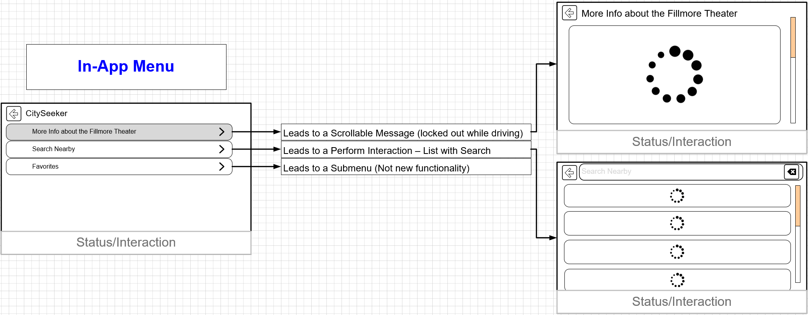
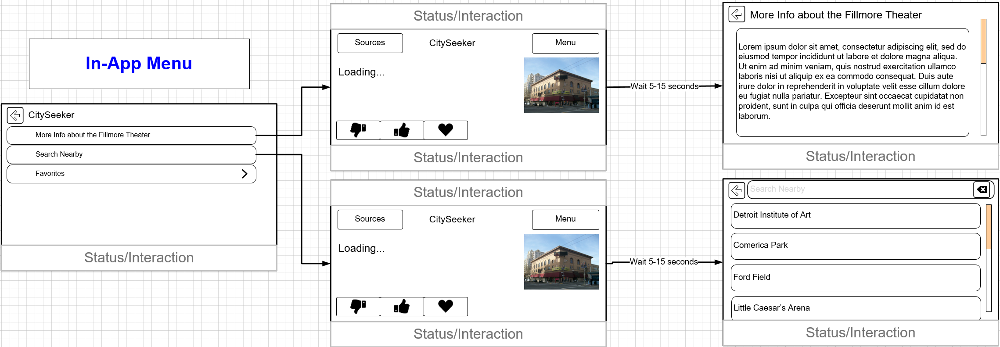

# Next RPC Indication for the HMI

* Proposal: [SDL-0250](0250-NextRpcIndication.md)
* Author: [Michael Crimando](https://github.com/MichaelCrimando)
* Status: **In Review**
* Impacted Platforms: [Core / iOS / Java Suite / RPC ]

## Introduction

In situations with driver distraction, also with making a good UI, it really hurts the possible UX when the HMI has no idea what's going to happen next after the user taps an in-app menu item, a softbutton or a selection in a perform interaction. 
This feature would provide apps with a way for the HMI to know what's next when a button or choice is selected.

This can be used in tandem with [Template Improvements: Additional SubMenus](https://github.com/smartdevicelink/sdl_evolution/blob/master/proposals/0148-template-additional-submenus.md) to provide a fantastic user experience.

## Motivation

As a system, I want to be able to be smarter and faster with in-app menu systems.
This enables:
1. **Better HMI possibilities:** can show forward and backward arrows for the user so the user knows what to expect when navigating around.
2. **Smart Driver Distraction:** if a softbutton or choice would lead to a screen that's normally locked out while driving (like a Scrollable Message), the HMI could show the softbutton as disabled while driving.
3. **Smoother Experience:** The HMI can have a much smoother experience with native HMI loading screens - not depending on the mobile app to send a sort of loading screen on its own.

Here's an example of an in-app menu for CitySeeker.
With this proposal, the HMI would know that after the user picks something like "Radio Genres", another RPC is incoming and can show a special loading screen until the RPC comes in. (Or the loading screen times out, but that behavior would be set by the OEM and not require SDL responses of any sort)
Here is an example from a potential tourism app with this proposal:

1. There's nice arrow indicators so the user can see that something is next in the menu even for items that don't go to a submenu
2. The system knows that one of the in-app menu items leads to a `ScrollableMessage` so it blocks the user ahead of time and never sends the `OnCommand` signal back to the app. The user never has to leave the current system context. The user also can see at a glance what things are and are not allowed while driving, without having to do a trial-and-error system.
3. If the user chooses "Search Nearby", the HMI can keep the user in the menu context but have a blank loading screen until the `performInteraction` comes from the app. (Or a timeout that the HMI is tracking occurs - at that point the HMI can relay that info back to the user)


VS the same app without this proposal - the app has to create its own sort of loading screen with `Show` and it's a jarring experience:

1. There's only an arrow indicator for the menu item that leads to a submenu.
2. If the user taps the item that leads to a `ScrollableMessage`, the system has to process the `onCommand` and send it back to the app. Plus the in-app menu has no idea what's going on, so it closes and goes back to the main layout, only to find out that a `ScrollableMessage` would come up - which is locked out while driving. 
3. For the search selection, the app has to create its own loading screen using mainfield1 of the `show` RPC (or via an alert), and the user is transitioned away from the menu structure until the `performInteraction` finishes loading.


## Proposed solution

Add a new struct `NextFunctionInfo` with all the data needed for the HMI to know what's coming next to the HMI API and the same in the MOBILE API:
```xml
<struct name="NextFunctionInfo" since="x.x">
	<description>
		Outlines information about the next RPC that will be triggered.		
	</description>
	<param name="nextFunctionID" type="FunctionID" mandatory="true"/>
		<description>The next function (RPC) that will be triggered by selecting the current option/command/choice etc.</description>
	</param>
		<param name="nextInitialText" type="String" maxlength="500"  mandatory="false"/>
			<description>This lets the HMI know what the initialText of the next RPC is going to be to help the loading user experience.</description>
		</param>
</struct>
```

Add the struct to `Choice` in the HMI API and the same in the MOBILE API:
```xml
<struct name="Choice" since="1.0">
  <description>A choice is an option given to the user, which can be selected either by menu, or through voice recognition system.</description>
  .
  .
  .
  <param name="nextFunctionInfo" type="NextFunctionInfo" mandatory="false" since="x.x">
    <description>Information about the next RPC that is triggered when this choice is selected. </description>
  </param>
</struct>
```

Add the struct to `AddCommand` to the HMI API:
```xml
  <function name="AddCommand" functionID="AddCommandID" messagetype="request" since="1.0">
  <description>
    Adds a command to the in application menu.
    Either menuParams or vrCommands must be provided.
  </description>
  .
  .
  .
  <param name="nextFunctionInfo" type="NextFunctionInfo" mandatory="false" since="x.x">
    <description>
      Information about the next RPC that is triggered when this choice is selected.
    </description>
  </param>
</function>
```

Add the struct to the `SoftButton` struct. This will cover Show/SetDisplayLayout, Alert, ShowconstantTBT and ScrollableMessage in the HMI API and the same in the MOBILE API
```xml
<struct name="SoftButton">
  .
  .
  .
  <param name="nextFunctionInfo" type="NextFunctionInfo" mandatory="false" since="x.x">
    <description>Information about the next RPC that is triggered when this choice is selected. </description>
  </param>
</struct>
 ```

### iOS
1. We're adding in a public manager-level enum
(iOS example in Swift that we should translate to ObjC)
```swift
enum NextFunction {
	case Default
	case PerformChoiceSet
	case Alert
	case ScreenUpdate
	case Speak
	case AccessMicrophone
	case ScrollableMessage
	case Slider
	case SendLocation
	case DialNumber
	case OpenMenu
}
```
2. Add a manager-level class `NextFunctionInfo` with an initializer 
```swift
    class NextFunctionInfo {
		var nextFunction = NextFunction.Default
		var loadingText : String!
	}
	
	init(nextFunction : NextFunction, loadingText : String) {
		self.nextFunction = nextFunction
		self.loadingText = loadingText
	}
```
3. Add a `nextFunctionInfo` parameter to `SDLChoiceCell`, `SDLMenuCell`, and `SDLSoftButtonObject` and their respective initilaizers. 


### Java
1.  Add in a public manager-level enum
```Java
public enum NextFunction{ 
        Default, 
        PerformChoiceSet, 
        Alert, 
        ScreenUpdate, 
        Speak, 
        AccessMicrophone, 
        ScrollableMessage, 
        Slider, 
        SendLocation, 
        DialNumber, 
        OpenMenu 
}
```

2. Add a manager-level class `NextFunctionInfo` with an initializer 
```Java
    public class NextFunctionInfo {
		private NextFunction nextFunction = NextFunction.Default;
		private String loadingText;
	}
	
	public NextFunctionInfo(NextFunction nextFunction, String loadingText) {
		this.nextFunction = nextFunction;
		this.loadingText = loadingText;
	}
```

3. Add a `nextFunctionInfo` parameter to `ChoiceCell`, `MenuCell`, and `SoftButtonObject` and their respective initializers. 

## Potential downsides

Adds core, HMI and app complexity

## Impact on existing code

It's a new parameter so this would not affect older SDL versions.

## Alternatives considered

None
