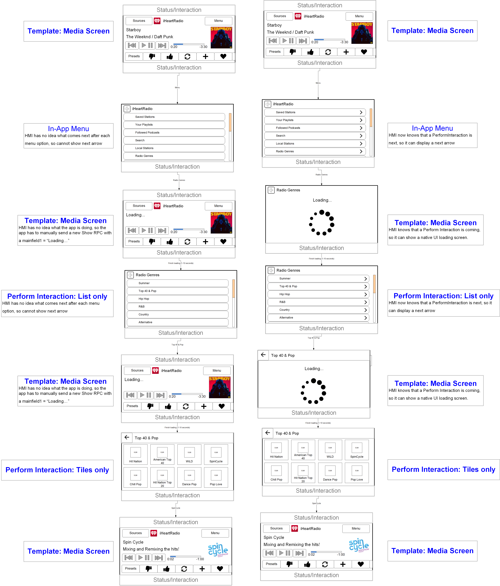

# Next RPC Indication for the HMI

* Proposal: [SDL-0250](0250-NextRpcIndication.md)
* Author: [Michael Crimando](https://github.com/MichaelCrimando)
* Status: **In Review**
* Impacted Platforms: [Core / iOS / Java Suite / RPC ]

## Introduction

In situations with driver distraction, also with making a good UI, it really hurts the possible UX when the HMI has no idea what's going to happen next after the user taps an in-app menu item, a softbutton or a selection in a perform interaction. 
This feature would provide apps with a way for the HMI to know what's next when a button or choice is selected.

This can be used in tandem with [Template Improvements: Additional SubMenus](https://github.com/smartdevicelink/sdl_evolution/blob/master/proposals/0148-template-additional-submenus.md) to provide a fantastic user experience.

## Motivation

As a system, I want to be able to be smarter and faster with in-app menu systems.
This enables:
1. **Better HMI possibilities:** can show forward and backward arrows for the user so the user knows what to expect when navigating around.

[insert pic of list of items from Alexa that lead from menu to scrollable message]
2. **Smart Driver Distraction:** if a softbutton or choice would lead to a screen that's normally locked out while driving (like a Scrollable Message), the HMI could show the softbutton as disabled while driving.
(../assets/proposals/0250-NextRpcIndication/0250-NextRpcIndication.png)
[insert pic of cityseeker and a show more info button]
3. **Smoother Experience:** The HMI can have a much smoother experience with native HMI loading screens - not depending on the mobile app to send a sort of loading screen on its own.
[insert a pic of menu going to a keyboard

[just use pic from #1]
Here's an example of current SYNC3 iHeartRadio flow (left) vs potential future (right).
With this proposal, the HMI would know that after the user picks something like "Radio Genres", another RPC is incoming and can show a special loading screen until the RPC comes in. (Or the loading screen times out, but that behavior would be set by the OEM and not require SDL responses of any sort)



## Proposed solution

Add a new struct `NextFunctionInfo` with all the data needed for the HMI to know what's coming next to the HMI API and the same in the MOBILE API:
```xml
<struct name="NextFunctionInfo" since="x.x">
	<description>
		Outlines information about the next RPC that will be triggered.		
	</description>
	<param name="nextFunctionID" type="FunctionID" mandatory="true"/>
		<description>The next function (RPC) that will be triggered by selecting the current option/command/choice etc.</description>
	</param>
		<param name="nextInitialText" type="String" maxlength="500"  mandatory="false"/>
			<description>This lets the HMI know what the initialText of the next RPC is going to be to help the loading user experience.</description>
		</param>
</struct>
```

Add the struct to `Choice` in the HMI API and the same in the MOBILE API:
```xml
<struct name="Choice" since="1.0">
  <description>A choice is an option given to the user, which can be selected either by menu, or through voice recognition system.</description>
  .
  .
  .
  <param name="nextFunctionInfo" type="NextFunctionInfo" mandatory="false" since="x.x">
    <description>Information about the next RPC that is triggered when this choice is selected. </description>
  </param>
</struct>
```

Add the struct to `AddCommand` to the HMI API:
```xml
  <function name="AddCommand" functionID="AddCommandID" messagetype="request" since="1.0">
  <description>
    Adds a command to the in application menu.
    Either menuParams or vrCommands must be provided.
  </description>
  .
  .
  .
  <param name="nextFunctionInfo" type="NextFunctionInfo" mandatory="false" since="x.x">
    <description>
      Information about the next RPC that is triggered when this choice is selected.
    </description>
  </param>
</function>
```

Add the struct to the `SoftButton` struct. This will cover Show/SetDisplayLayout, Alert, ShowconstantTBT and ScrollableMessage in the HMI API and the same in the MOBILE API
```xml
<struct name="SoftButton">
  .
  .
  .
  <param name="nextFunctionInfo" type="NextFunctionInfo" mandatory="false" since="x.x">
    <description>Information about the next RPC that is triggered when this choice is selected. </description>
  </param>
</struct>
 ```

## Potential downsides

Adds core, HMI and app complexity

## Impact on existing code

It's a new parameter so this would not affect older SDL versions.

## Alternatives considered

None
