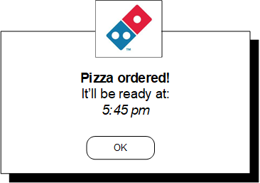

# Font Styles

* Proposal: [SDL-0251](0251-font-styles.md)
* Author: [Michael Crimando](https://github.com/MichaelCrimando)
* Status: **Returned for Revisions**
* Impacted Platforms: [Core / iOS / Java Suite / RPC ]

## Introduction

This feature would let apps style text within `Alert`, `Show`, `ScrollableMessage` or `PerformInteraction` RPC with things like bold, italics or underlining.

## Motivation

As an app partner, I want to be able to customize text on main layouts and popups so that I can have a visually pleasing and easy to use UI.

## Proposed solution

When an app wants a more visually appealing UI experience,  it can add a HTML tags for font style customization onto text if desired.



### Hyper Text Capabilities

The HMI should be able to provide a list of supported hyper text elements to SDL and to  the applications. This allows the HMI to have it's own flexibility to support what it wants:

### HMI & Mobile API changes

```xml
<struct name="TextField" since="1.0">
:
    <param name="hyperTextSupported" type="String" array="true" mandatory="false" minvalue="1" maxvalue="100" since="6.x">    
    </param>
</struct>
```

The HMI API equivalent should exclude the versioning attributes.

Alternative: An enum can be added that lists all the hyper text elements.

With this implementation, technically the html tags take up part of the 500 character count restriction placed in `TextFieldStruct`. So, the character count for `TextFieldStruct` would go from 500 to 1000 in the HMI API. This struct is used for pretty much any text field in RPCs like `Alert`, `ScrollableMessage`, `Show` and so on.
```xml
<struct name="TextFieldStruct">
  .
  .
  .
  <param name="fieldText" type="String" maxlength="1000" mandatory="true">
    <description>The  text itself.</description>
  </param>
  .
  .
  .
</struct>
```

### Automatic Tag Cleanup Using Managers 

The manager API of the SDL libraries should recognize the new parameter `hyperTextSupported` and scan strings to see if unsupported elements are requested by the app. When a manager wants to generate a RPC it should scan the string and send a cleaned up version of the string in the RPC. For instance when the `ScreenManager` generates a new `Show` request it should set the main fields to a cleaned up version of the manager's text fields.

Example:
The head unit provided information that `mainField1` can support the hyper text elements `b` and `i`. If a developer sets `screenManager.textField1` to a string like `<b>Hello <u>World!</u></b>`, the manager should scan the text field and clean it up to `<b>Hello World!</b>` before setting the string to `Show.mainField1` in the RPC request.

The following managers should need to scan and clean text fields before generating RPCs:
1. ScreenManager
2. TextAndGraphicManager
3. SoftButtonManager
4. ChoiceSetManager
5. MenuManager


## Potential downsides
This adds some HMI complexity anhd would require SDL to potentially handle translating the 1000 characters in text fields to 500 characters on older headunits.

Currently not considering these as there is no current or immediate need:
- SendLocation
- Media clock
- Media track

## Impact on existing code

It's a new parameter so this would not affect older SDL versions.

## Alternatives considered
Potentially have pre-defined styles like in Android "Header 1", "Header 2", "Body 1", "Body 2" etc.

OR

Add a `FontStyle` struct to all text fields that defines if bold, italic, or underline.
