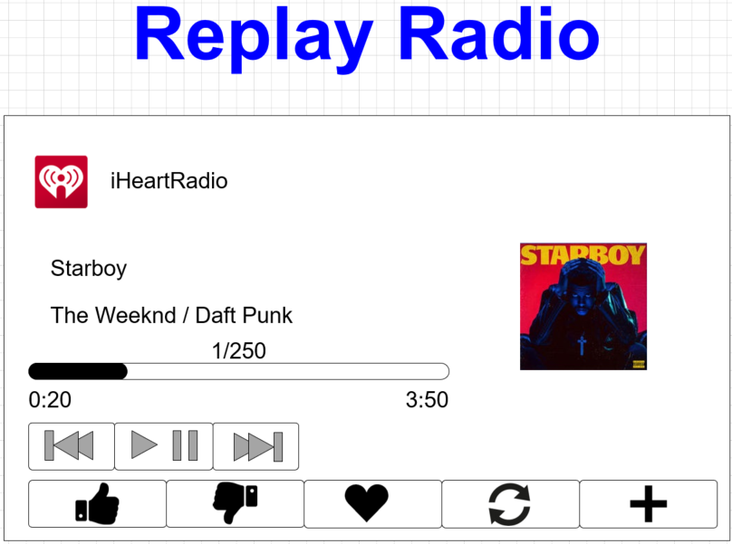
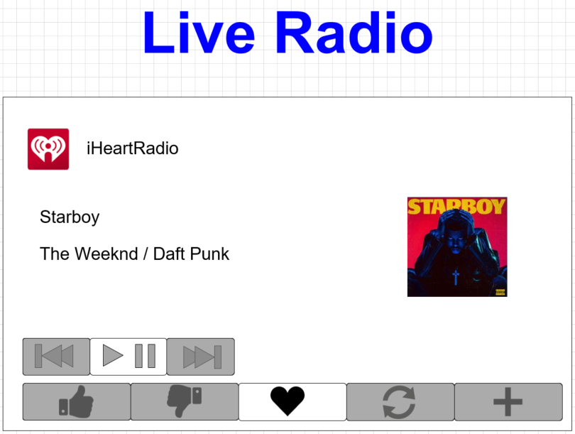

# Disabled Softbuttons

* Proposal: [SDL-0259](0259-DisabledSoftbuttons.md)
* Author: [Michael Crimando](https://github.com/MichaelCrimando)
* Status: **Returned for Revisions**
* Impacted Platforms: [Core / iOS / Java Suite / RPC ]

## Introduction

This feature would allow apps to send custom softbuttons to display on screen but they would appear disabled.
This also allows an app to subscribe to and disable SDL predefined buttons.

## Motivation
Some apps like iHeartRadio don't provide the same set of custom softbuttons for each home screen.
This would allow them to display that to the user, just like the native app on the phone.  Other apps like Pandora only support Seek Left and Repeat if the user has a premium account. This can let them show the buttons and let the user know it's available just not right now.

 
 

## Proposed solution

For custom softbuttons, add a parameter to `SoftButtonCapabilities` to let the app know that the ability is possible.
```xml
<struct name="SoftButtonCapabilities">
    .
    .
    .
    <param name="supportsDisabled" type="Boolean" mandatory="false">
        <description>The button supports being disabled. If the button is set to disabled, it will still show on the HMI but appear grayed out.
        </description>
    </param>
</struct>
```

Plus add an `isDisabled` flag to `SoftButton`. If the flag is false or missing, the softbutton must appear usable. If true, the `SoftButton` will still show on the HMI but appear grayed out or otherwise disabled. Button press events will still be sent to the app so the app can enable experiences like "Repeat is for Premium customers only". If a button is set to disabled and highlighted, it's up to the HMI to depict the best possible UI.
```xml
<struct name="SoftButton">
.
.
.
    <param name="isDisabled" type="Boolean" mandatory="false">
      <description>If false or missing, softbutton must appear usable. If true, softbutton must appear as not usable.
      </description>
    </param>
 </struct>
```

For buttons that can be subscribed to, add a parameter to `ButtonCapabilities` to let the app know that the ability is possible.
```xml
<struct name="ButtonCapabilities">
    .
    .
    .
    <param name="disabledButtonPossible" type="Boolean" mandatory="true">
        <description>The button supports being disabled. If the button is set to disabled, it will still show on the HMI but appear grayed out.
        </description>
    </param>
</struct>

```

Plus add an `isDisabled` flag to the `SubscribeButton` RPC.  If the button is set to disabled, it will still show on the HMI but appear grayed out. Button press events would still be sent to the app so the app can enable experiences like "Seek Left is for Premium customers only". 

```xml
    <function name="SubscribeButton" functionID="SubscribeButtonID" messagetype="request" since="1.0">
        <description>
            Subscribes to built-in HMI buttons.
            The application will be notified by the OnButtonEvent and OnButtonPress.
            To unsubscribe the notifications, use unsubscribeButton.
        </description>
        .
        .
        .
            <param name="isDisabled" type="Boolean" mandatory="false">
      <description>If false or missing, subscribed button must appear on screen and usable. If true, softbutton must appear on screen (if applicable) and not usable.  Button press events will still be sent to the app regardless.
      </description>
    </function>
    
```

### Manager-Level Additions for the app developer

#### Objective C
1. Add a new soft button configuration to the screen manager:

```ObjectiveC
@property (strong, nonatomic, readonly) SDLSoftButtonConfiguration *softButtonConfiguration;
```

2. This will involve creating the soft button configuration:

```ObjectiveC
@interface SDLSoftButtonConfiguration: NSObject

/// If true and connected to a head unit that doesn't support disabled softbuttons, the soft button manager will not send soft button objects that have the parameter isDisabled=false. If false, the soft buttons will be sent anyway but will appear enabled on the head unit. Defaults to true.
@property (assign, nonatomic) BOOL disabledButtonFallback;

@end
```


3. The `disabled` property will have to be added to `SDLSoftButtonState`:

```ObjectiveC
@property (assign, nonatomic, getter=isDisabled) BOOL disabled;
```

The soft button manager will then have to take both the configuration value and the `disabled` BOOL on the state into account to determine if the button will be sent or not and with what values. If on an older headunit that doesn't support this feature- the manager would make sure that the button is not sent to the head unit.


#### Java
1. Add a new soft button configuration to the screen manager:

```Java
    private SoftButtonConfiguration softButtonConfiguration;
```

2. This will involve creating the soft button configuration:

```Java
public class SoftButtonConfiguration {
    boolean disabledButtonFallback;
}
```

3. The `disabled` property will have to be added to `SoftButtonState`:

```Java
	public boolean getDisabled(){};
	public void setDisabled(boolean disabled){};
```

The soft button manager will then have to take both the configuration value and the `disabled` BOOL on the state into account to determine if the button will be sent or not and with what values.  If on an older headunit that doesn't support this feature- the manager would make sure that the button is not sent to the head unit.

## Potential downsides

Adds HMI complexity

## Impact on existing code

It's a new parameter so this wouldn't block usability on older headunits. However, apps would have to know that on older headunits the functionality to disable a button isn't possible. Otherwise they would try to request a disabled softbutton but a regular softbutton would show up on screen.

## Alternatives considered
One alternative would be that we could have a disabled  button not send any button events. That matches what Android and iOS do when a button is on screen but disabled.

Another alternative- for custom softbuttons, an app could send a graphic that appears disabled, but it usually doesn't grant the same effect as having the whole softbutton looking disabled.
