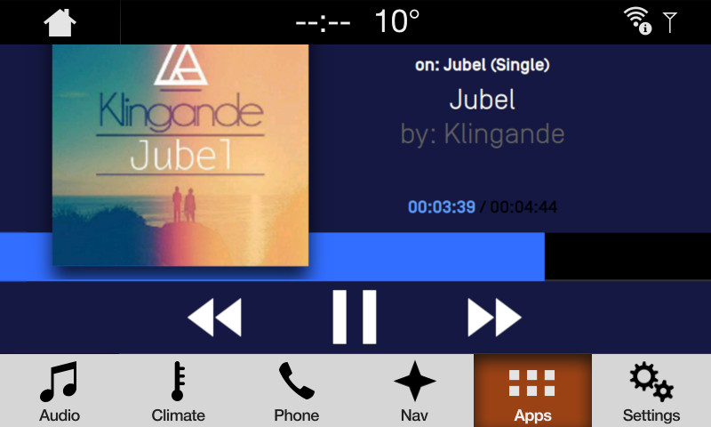

# WebEngine Projection mode

* Proposal: [SDL-0273](0273-webengine-projection-mode.md)
* Author: [Kujtim Shala](https://github.com/kshala-ford)
* Status: **Returned for Revisions**
* Impacted Platforms: [Core / JavaScript ]

## Introduction

This proposal is created based on discussion in https://github.com/smartdevicelink/sdl_evolution/issues/767.
It extends [SDl-0240 - WebEngine support for SDL JavaScript](https://github.com/smartdevicelink/sdl_evolution/blob/master/proposals/0240-sdl-js-pwa.md) with a projection mode (formerly known as OpenHMI) that was introduced with [SDL-0031 Mobile Projection](https://github.com/smartdevicelink/sdl_evolution/blob/master/proposals/0031-mobile-projection.md).

## Motivation

This proposal describes a feature made possible using a WebEngine. A WebEngine can come with a web page rendering component described as a WebView in this proposal. The proposal describes how apps based on a WebEngine can be presented not only using system templates but that can control the WebView using the app's document object.

## Proposed solution

The app HMI type `PROJECTION` should be enabled for in-vehicle apps. When apps with this HMI type are activated, the HMI should make the web page of this app visible on the screen. This web page will become the main window of the application. The window capabilities of this open main window will be empty except for the window ID and physical button capabilities. `Show` requests that address the main window won't have any effect on the HMI. If the app sends this request, Core should return an unsuccessful response with the result code `RESOURCE_NOT_AVAILABLE`. The info field should note that the app is registered with projection mode enabled.

> Example of a local web app presenting the user interface with the WebView.

Widgets are still available and can be controlled using `Show` RPC. Any overlay like Alert, ChoiceSets, Slider etc. are also available to the application.

##### Policy control

The HMI type `PROJECTION` is policy controlled. On the policy server this HMI type can be added to the valid HMI type list per app ID. Only apps with permissions to use this HMI type would be allowed to register.

##### User interface guidelines (Driver Distraction rules)

With the current depth of this proposal, the HMI type should be used by 1st party OEM apps only. With future proposals and workshops the SDLC could open the HMI type to 3rd party by creating and defining proper driver distraction and user interface guidelines.

At the time of this proposal being in review, a set of driver distraction rules are being created and proposed to enable 3rd party using the projection mode. The following bullet points are items that will be described further in the ruleset:

- minimum font size
- minimum contrast between font and background
- min/max brightness (for day and night mode)
- number of buttons
- minimum size of a button
- no customized keyboard
- no video playback (exceptions in standstill per countries)
- NHTSA related guidelines
    - Amount of text (button and text fields)
    - number of lines of text
    - Complexity of use cases (number of steps to fulfill a use case)

More items may be included in the ruleset as they become Driver Distraction affected.

##### System context and event change

Independent of the app presentation type, the HMI will continue to provide system context information from the app. An application which uses the projection mode should continue to receive `OnHMIStatus` notifications and SDL Core will still be notified about event changes.

Different to mobile app projection mode, in-vehicle apps won't be streaming video to the IVI, therefore the app and the library wouldn't listen for `OnHMIStatus.videoStreamingState` parameter to start presenting the app UI through the WebView.

## Potential downsides

The same downsides apply as for [SDL 0031 Mobile Projection](https://github.com/smartdevicelink/sdl_evolution/blob/master/proposals/0031-mobile-projection.md) 

## Impact on existing code

To the author's knowledge there is no impact to existing code unless there are barriers implemented in SDL Core preventing an in-vehicle app from registering with the `PROJECTION` HMI type.

## Alternatives considered

There are no alternatives available that the author feels competitive to the projection mode using a WebView.
