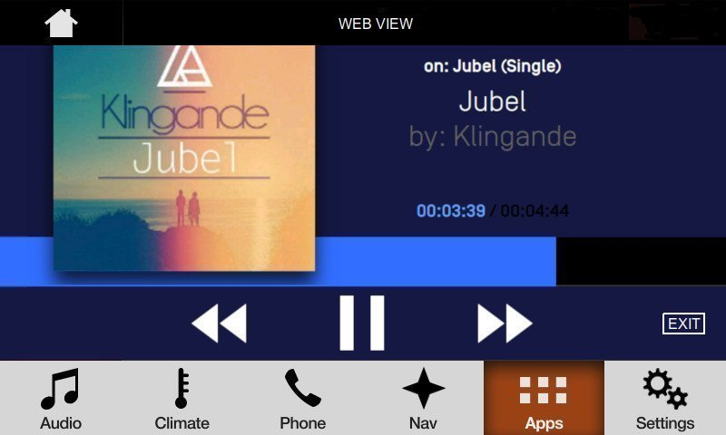
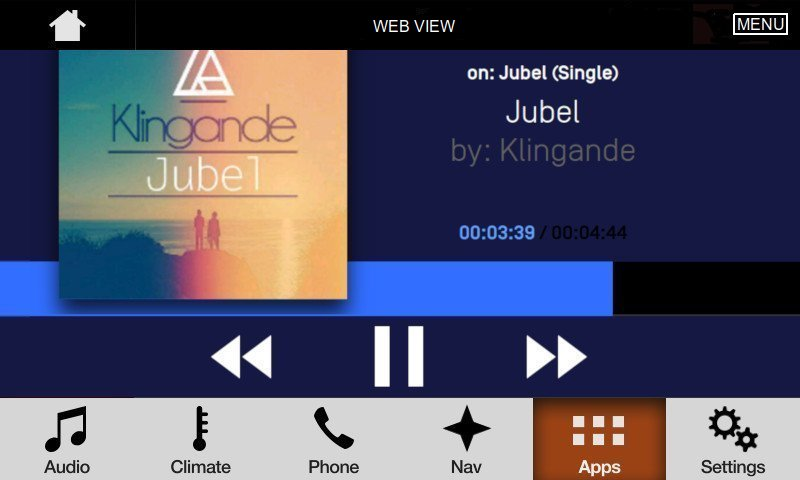

# WebEngine Projection mode

* Proposal: [SDL-0273](0273-webengine-projection-mode.md)
* Author: [Kujtim Shala](https://github.com/kshala-ford), [Markos Rapitis](https://github.com/mrapitis) and [Andriy Byzhynar](https://github.com/abyzhynar)
* Status: **Returned for Revisions**
* Impacted Platforms: [ Core / JavaScript Suite / Java Suite / iOS / RPC / SDL Server / SHAID ]

## Introduction

This proposal is created based on discussion in https://github.com/smartdevicelink/sdl_evolution/issues/767.
It extends [SDl-0240 - WebEngine support for SDL JavaScript](https://github.com/smartdevicelink/sdl_evolution/blob/master/proposals/0240-sdl-js-pwa.md) to allow using the WebEngine app's web view for the HMI in addition to the other available SDL templates.

## Motivation

This proposal describes a feature made possible using a WebEngine. A WebEngine can come with a web page rendering component described as a WebView in this proposal. The proposal describes how apps based on a WebEngine can be presented not only using system templates but that can control the WebView using the app's document object.

The author and the SDLC member believe there are plenty of SDL features that are useful for WebEngine applications that use the proposed feature. The most important items are app policy management and app lifecycle. We would like to streamline the implementation to manage activating apps, deactivating apps, closing apps or running apps in background. Besides the benefits for us implementing web apps, it's also beneficial for the web app developer to use all the SDL features like app services, remote control, vehicle data widgets and many more.

## Proposed solution

The solution is based on a new template and a new App HMI type.

### 1. Template `WEB_VIEW`

A new template called `WEB_VIEW` should be added. This template should have the following restrictions:
1. It's supported for in-vehicle WebEngine apps only.
2. It's available only to the main window. It should not be available for widgets.
3. It is only available to applications that successfully registered with the new App HMI type (see below section regarding new App HMI Type).
4. The `WEB_VIEW` template is not allowed to to support textfields, softbuttons, graphics (inside or outside of the webview). DuplicateUpdatesFromWindowID=0 is not allowed for widgets.

If this template is used by WebEngine apps, the HMI of the IVI should present the WebEngine app and show the application's web page. 
The application can control the web `document` object using JavaScript code to manipulate the document object model of the WebEngine app.
JavaScript is the only language supported within current proposal.
The HMI should respect the WebEngine app as the first responder to touch events. This means that touchable elements in the `document` should be accessible through the system's touch screen to the user.
If the app sends RPCs which triggers POP-UP on the HMI screen, so this POP-UP overlays what WEB_VIEW area shows (Alert, PerformInteraction etc.) - in that case, touch events will first go through the POP-UP area.
After POP-UP is closed - touch events processing returned back to the WEB_VIEW area.

The HMI should include a button to access the app list, the add command menu button (or a requirement for the app to implement ShowAppMenu or otherwise implement CloseApplication), and app/template title.
The template/app title should be visible when the app is activated. The exact location of the template/app title relies on OEM


#### 1.1. Application deactivation
The HMI should always support showing a menu button, but it would only be shown if the app sends at least one AddCommand or AddSubMenu. If the app does not send any AddCommands or AddSubmenus, then the menu button should not be shown, but in that case the app must implement the CloseApplication RPC in an **EXIT** button somewhere in their in-app UI.



> Example of a local web app presenting the user interface with the WebView.
> App did not send any AddCommands or AddSubmenus so the EXIT button is the only
> UI way to deactivate the app to NONE HMI Level


If the app has sent any AddCommands or AddSubmenus, then the **MENU** button should appear.



> Example of a local web app presenting the user interface with the MENU button.

```xml
<enum name="PredefinedLayout" platform="documentation" since="3.0">
    <element name="WEB_VIEW" rootscreen="true" since="6.x">
        <description>
            Custom root template allowing in-vehicle WebEngine applications with
            appropriate permissions to show the application's own web view.
        </description>
    </element>
    :
</enum>
```


> Example of a local web app presenting the user interface with the WebView.

#### 1.2. Window Capabilities

As of today, the HMI sends notifications of `OnSystemCapabilityUpdated` to the application to inform about the (main) window capabilities. 
These capabilities are dependent of the currently used template. The application can change to any of the available templates as per current window capabilities. 
Whenever the application changes the template, the HMI should send a new notification with the current template capabilities. 
Generally, the window capabilities should refer to available text and image fields and should list the number of possible soft buttons and their capabilities.

If the `WEB_VIEW` template is currently active, the window capabilities change as the application is presenting content using the web document.

The following text fields `mainField1`, `mainField2`, `mainField3`, `mainField4`, `statusBar`, `mediaClock` and `mediaTrack` should be used practically on all the base templates. 
It is required that `WindowCapability.textFields` should not contain these text field names if the OEM has implemented the `WEB_VIEW` template without these text fields.
The text fields `menuName` and `templateTitle` should be included in the capabilities if these fields are visible on the HMI.

The parameters `availableTemplates`, `buttonCapabilities`, and `imageTypeSupported` are independent of the currently active template and should reflect the general capabilities of the window/system.


#### 1.3. What about widgets?

Widgets are not affected by this proposal. They are still available and can be controlled using `Show` RPC. Any overlay like Alert, ChoiceSets, Slider etc. are also available to the application.

Widgets that duplicate content from the main window should still be possible. Despite the window capability, the app should still be able to send `Show` requests with all the desired content. This content should be duplicated to these widgets.
The behavior of the WEB_VIEW template with widgets that duplicate main window should align with
the behavior of existing templates(ie switching from NON_MEDIA to a TILES_ONLY template with a duplicate widget).

### 2. App HMI Type `WEB_VIEW`

A new App HMI type `WEB_VIEW` should be added for in-vehicle WebEngine apps. This HMI type specifies that the application's initial template should be set to `WEB_VIEW` instead of `DEFAULT`. 
As a result, when in-vehicle apps with this HMI type are activated, the HMI should make the web page of this app visible on the screen. This web page will become the main window of the application.


**HMI_API**

```xml
<enum name="AppHMIType">
    :
    <element name="WEB_VIEW" />
</enum>
```

**MOBILE_API**

```xml
<enum name="AppHMIType" since="2.0">
    :
    <element name="WEB_VIEW" since="6.3" />
</enum>
```

#### 2.1. Policy control

The HMI type `WEB_VIEW` should be policy controlled. On the policy server this HMI type can be added to the valid HMI type list per app ID.

Only apps with permissions to use this HMI type would be allowed to register. If a WebEngine application attempts to register with this HMI type but the local policy table doesn't allow, Core should not allow the app to register.
It is required for applications to register with this App HMI type in order to use the `WEB_VIEW` template. Otherwise the `WEB_VIEW` template should not be available.

#### 2.2. System context and event change

Independent of the app presentation type, the HMI will continue to provide system context information from the app. An application which uses the projection mode should continue to receive `OnHMIStatus` notifications and SDL Core will still be notified about event changes.

### 3. User interface guidelines (Driver Distraction rules)

With the current depth of this proposal, the HMI type should be used by 1st party OEM apps only. With future proposals and workshops the SDLC could open the HMI type to 3rd party by creating and defining proper driver distraction and user interface guidelines.

The acceptance of this proposal means the feature is available for OEM/1st party apps and content ONLY.
There is an inherent risk that OEMs could use the feature to bring in 3rd party apps and content without additional proposals
as it will be impossible to enforce. If an OEM takes such an action, the SDLC will be forced to bring the issue up to the Board of Directors for possible consequences.

At the time of this proposal being in review, a set of driver distraction rules are being created and proposed to enable 3rd party using the projection mode. The following bullet points are items that will be described further in the ruleset:

- minimum font size
- minimum contrast between font and background
- min/max brightness (for day and night mode)
- number of buttons
- minimum size of a button
- no customized keyboard
- no video playback (exceptions in standstill per countries)
- NHTSA related guidelines
    - Amount of text (button and text fields)
    - number of lines of text
    - Complexity of use cases (number of steps to fulfill a use case)

More items may be included in the ruleset as they become Driver Distraction affected.

### 4. Application lifecycle (or, what happens if the app is closed?)

When an app is deactivated into HMI level NONE, the connection to Core can stay open as long as there is a way for the HMI to be able to unregister and disconnect an app in case of performance issues. Performance issues can be due to high CPU load or memory warnings. This requires a new exit reason that can be used by the HMI and will be forwarded to the app. 

**HMI_API**

```xml
<enum name="ApplicationExitReason">
    :
    <element name="RESOURCE_CONSTRAINT">
        <description>By getting this value, SDL should unregister the application to allow the HMI to close the application.</description>
    </element>
</enum>
```

**MOBILE_API**

```xml
<enum name="AppInterfaceUnregisteredReason" since="1.0">
    :
    <element name="RESOURCE_CONSTRAINT" since="6.x" />
</enum>
```

## Potential downsides

The same downsides apply as for [SDL 0031 Mobile Projection](https://github.com/smartdevicelink/sdl_evolution/blob/master/proposals/0031-mobile-projection.md) because WebEngine applications that use the web view are responsible just as any projection or mobile navigation application.

The proposal states:

> If a WebEngine application attempts to register with this HMI type but the local policy table doesn't allow, Core should not allow the app to register.

This can be seen as a downside as it could break with apps being used for the first time. This feature would require the IVI to implement policy table updates through the vehicle modem instead of using a mobile application. It also requires the HMI to use `SetAppProperties` upon app installation to add the app policy ID to the policy table in order to trigger the policy table update through the mode.

## Impact on existing code

As a new enum element is added to the `AppHMIType` enum, other platforms are impacted by this very minor change.
Core would need to specially treat apps with this HMI type as they are not allowed to register unless permission was granted.
Possibly SDL Server and SHAID are affected as HMI types are part of the policy system.

## Alternatives considered

There are no alternatives available that the author feels competitive to a WebView.
