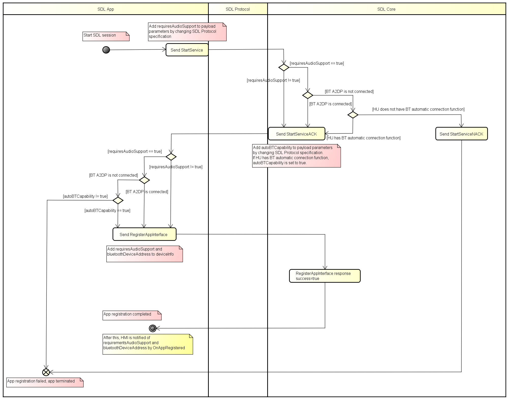

# Adding new parameter of requiresAudioSupport and BluetoothDeviceAddress

* Proposal: [SDL-0280](0280-Adding-new-parameter-of-requiresAudioSupport-and-BluetoothDeviceAddress.md)
* Author: [Shohei Kawano](https://github.com/Shohei-Kawano), [Kazuki Sugimoto](https://github.com/Kazuki-Sugimoto), [Akihiro Miyazaki (Nexty)](https://github.com/Akihiro-Miyazaki)
* Status: **In Review**
* Impacted Platforms: [ Core / iOS / Java Suite / RPC / Protocol / HMI ]

## Introduction

In this proposal, by adding the `requiresAudioSupport` in `RegisterAppInterface` and the `bluetooothDeviceAddress` in `DeviceInfo`, when the device is connected via only USB, head unit (HU) will connect to the SDL device's Bluetooth (BT) automatically or prompt the user requesting BT connection.

## Motivation

Since Android recommends not supporting AOA2.0, Android will no longer be able to play audio using only USB, and it will be necessary to use BT A2DP to play audio.
In the current SDL Java Suite library, if `requiresAudioSupport` is TRUE and BT A2DP is not connected, SDL activation will be cancelled. Users aren't notified why the SDL App doesn't start, so the UX needs to be improved.
To solve this problem, add `bluetoothDeviceAddress` and `requiresAudioSupport` so that a new SDL device can be specified in `RegisterAppInterface`, and prompt the user to connect the device via BT, or the HU will connect the device via BT automatically when connected via USB.

## Proposed solution

The current SDL Java Suite library cancels the transport connection if the `requiresAudioSupport` setting is TRUE and BT A2DP is not connected.
However, with this proposal, by adding a new parameter, the SDL app always establishes the transport connection and is registered without depending on the connection status of BT A2DP. If BT A2DP is not connected, the HU will automatically connect BT using `bluetoothDeviceAddress` or request connection from the user.

### Change the app registration flow

In order for the app to be always registered, the changes in SDL session establishment to app registration flow are shown below.
If the SDL app or HU cannot use this function, it will perform the same operation as before.



1. The developer will set their `requiresAudioSupport` to true.
2. The library will send a `StartService` for the RPC service with a new param in the payload, `requiresAudioSupport`.
3. Core will receive the `StartService` for the RPC service:

    1. Core will check its current audio connects (BT A2DP), if it has a supported audio connect it will continue in flow.
    2. If there is no audio support, Core will check if it supports the auto connect BT feature. If it does, it will continue in flow.
    3. If there is no supported audio methods and Core does not support the auto connect BT feature, it will send a `StartServiceNAK` with the reason `No audio support available`.

4. If Core has continued, it will send a `StartServiceACK` with a new param `autoBTCapability` set to true.
5. The app receives the response to its `StartService` for the RPC service:

    1. If the response was a `StartServiceNAK` the app will shut down.
    2. If the response was a `StartServiceACK`, `requiresAudioSupport` was set to true, but the protocol version of the ACK is less than the major version of this feature, the app will shut down.
    3. If the response was a `StartServiceACK`, `requiresAudioSupport` was set to true, the protocol version of the ACK is equal to or greater than the major version of this feature, and the `autoBTCapability` flag is set to false, the app will check if audio support is available using the `MediaStreamingStatus` class. If it is available it will continue, if not it will shut down.
    4. If the response was a `StartServiceACK`, `requiresAudioSupport` was set to true, the protocol version of the ACK is equal to or greater than the major version of this feature, and the `autoBTCapability` flag is set to true, the app will continue.

6. The app will send its `RegisterAppInterface` which will include the `hmiTypes` and `isMediaApplication` flag.
7. Core will receive the `RegisterAppInterface`:

    1. If the `requiresAudioSupport` flag was not included in the `StartService`, `isMediaApplication` is set to true in the `RegisterAppInterface` and the protocol version for the session is less than the major version of the version that included this feature, it will send a `RegisterAppInterface` response with `success=false` and deny the app's registration.
    2. If the `requiresAudioSupport` flag was not included in the `StartService`, `isMediaApplication` is set to true in the `RegisterAppInterface` and the protocol version for the session is equal to or greater than the major version of the version that included this feature, it will send a `RegisterAppInterface` response with `success=true` but not move forward with this proposal's feature.
    3. If the `requiresAudioSupport` flag was set to true in the `StartService`, `isMediaApplication` is set to true in the `RegisterAppInterface` and the protocol version for the session is equal to or greater than the major version of the version that included this feature, it will send a `RegisterAppInterface` response with `success=true` and move forward with this proposal's feature.

#### Preconditions

The protocol version will need to be incremented for a major change.
Using the current library apps will not register at all without audio support. So it is assumed in this flow the app will only be using a compatible library.

#### Add parameters

- StartService

`requiresAudioSupport` is added to the payload of `StartService`.
Similar to the default in the existing Java Suite library, `requiresAudioSupport` is set to true for media apps and false for other types of apps. However, app developers can change these settings if needed.
Core considers `requireAudioSupport` to be false if `StartService` is the protocol version that does not support this function, or if it supports this function but `requireAudioSupport` is not set.

- StartServiceACK

`autoBTCapability` is added to the payload of `StartServiceACK`.
Additionally, a new parameter `autoBTConnection`, which indicates whether the HU has the BT automatic connection function, is added to `HMICapabilities`. SDL Core sets `autoBTCapability` to true if it has a supported audio connect or if it supports the auto connect BT feature.
The app considers `autoBTCapability` to be false if `StartServiceACK` is the protocol version that does not support this function, or if it supports this function but `autoBTCapability` is not set.

HMI API:
```xml
  <struct name="HMICapabilities">
      <param name="navigation" type="Boolean" mandatory="false">
          <description>Availability of build in Nav. True: Available, False: Not Available</description>
      </param>
      <param name="phoneCall" type="Boolean" mandatory="false">
          <description>Availability of build in phone. True: Available, False: Not Available</description>
      </param>
      <param name="videoStreaming" type="Boolean" mandatory="false">
          <description>Availability of built-in video streaming. True: Available, False: Not Available</description>
      </param>
+     <param name="autoBTConnection" type="Boolean" mandatory="false">
+         <description>Indicates whether the HU has BT automatic connection function. True: Available, False: Not Available</description>
+     </param>
  </struct>
```

- RegisterAppInterface
- OnAppRegistered

Add `bluetoothDeviceAddress` to`DeviceInfo`. Add `requiresAudioSupport` to`HMIApplication`.

Mobile API:
```xml
  <struct name="DeviceInfo" since="3.0">
      <description>Various information about connecting device.</description>
      <param name="hardware" type="String"  minlength="0" maxlength="500" mandatory="false">
          <description>Device model</description>
      </param>
      <param name="firmwareRev" type="String" minlength="0" maxlength="500" mandatory="false">
          <description>Device firmware revision</description>
      </param>
      <param name="os" type="String" minlength="0" maxlength="500" mandatory="false">
          <description>Device OS</description>
      </param>
      <param name="osVersion" type="String" minlength="0" maxlength="500" mandatory="false">
          <description>Device OS version</description>
      </param>
      <param name="carrier" type="String" minlength="0" maxlength="500" mandatory="false">
          <description>Device mobile carrier (if applicable)</description>
      </param>
      <param name="maxNumberRFCOMMPorts" type="Integer" minvalue="0" maxvalue="100" mandatory="false">
          <description>Omitted if connected not via BT.</description>
      </param>
+     <param name="bluetoothDeviceAddress" type="String"  minlength="0" maxlength="500" mandatory="false">
+         <description>Device BT Address</description>
+     </param>
  </struct>
```

HMI API:
```xml
  <struct name="DeviceInfo">
      <param name="name" type="String" mandatory="true">
          <description>The name of the device connected.</description>
      </param>
      <param name="id" type="String" mandatory="true">
          <description>The ID of the device connectedi: either hash of device's USB serial number(in case of USB connection) or has of device's MAC address(in case of BlueTooth or WIFI connection</description>
      </param>
      <param name="transportType" type="Common.TransportType" mandatory="false">
         <description>The transport type the named-app's-device is connected over HU(BlueTooth, USB or WiFi). It must be provided in OnAppRegistered and in UpdateDeviceList</description>
      </param>
      <param name="isSDLAllowed" type="Boolean" mandatory="false">
          <description>Sent by SDL in UpdateDeviceList. 'true' - if device is allowed for PolicyTable Exchange; 'false' - if device is NOT allowed for PolicyTable Exchange </description>
      </param>
+     <param name="bluetoothDeviceAddress" type="String" mandatory="false">
+         <description>Device BT Address</description>
+     </param>
  </struct>
  ...
  <struct name="HMIApplication">
  ...
      <param name="deviceInfo" type="Common.DeviceInfo" mandatory="true">
          <description>The ID, serial number, and transport type by which the named app's device is connected to HU.</description>
      </param>
  ...
      <param name="cloudConnectionStatus" type="Common.CloudConnectionStatus" mandatory="false"></param>
+     <param name="requiresAudioSupport" type="Boolean" mandatory="false">
+         <description>Set whether or not this app requires the use of an audio streaming output device.</description>
+     </param>
  </struct>
```

### MediaStreamingStatus class

If the Java Suite library supports the newer version of the protocol specification, but the IVI system is using a lower version, the app will still need to use the `MediaStreamingStatus` class before attempting to register.
By using the value of `isAudioOutputAvailable()` method on `MediaStreamingStatus` class, the Java Suite library can make a decision whether BT A2DP is connected like below:

- True : BT A2DP is connected.
- False : BT A2DP is NOT connected.

With the changes of the flow, it is necessary to do refactoring of the Java Suite library to move the logic of the `MediaStreamingStatus` class from the preprocessing of the `StartService` to the preprocessing of the `RegisterAppInterface`.

### Launch the app

By using this function, the HU is able to perform  BT automatic connection based on the `bluetoothDeviceAddress` which is notified when the app that requests audio (`requiresAudioSupport` is set to true) is launched.
It can also display a message that prompts BT connection to the user.

Note: The HMI will be responsible for preventing app activation while the HMI is in the process of connecting to the mobile device's BT for an app that has `requiresAudioSupport=true`. For example, the HMI could show a loading icon for that app, or display an error message to the user upon activation.

## Potential downsides

Due to the complexity of the flow, the developer must do the implementation carefully.

## Impact on existing code

This proposal requires a major version change.
Since new parameters are added, Core, iOS, Java Suite, RPC, Protocol, and HMI are affected.

## Alternatives considered

While this alternative was considered, the Steering Committee determined this flow does not account for previous versions of the protocol, and therefore is not viable as the primary solution.

### Change the app registration flow


1. The developer will set their `requiresAudioSupport` to true.
2. The library will send a `StartService` for the RPC service with a new param in the payload, `requiresAudioSupport`.
3. Core will receive the `StartService` for the RPC service:

    1. If `requiresAudioSupport` was set to false or not set, it will continue in flow.
    2. Core will check its current audio connects (BT A2DP), if it has a supported audio connect it will continue in flow.
    3. If there is no audio support, Core will check if it supports the auto connect BT function. If it does, it will continue in flow.
    4. If `requiresAudioSupport` is true and there is no supported audio methods and Core does not support the auto connect BT function, it will send a `StartServiceNAK` with the reason `No audio support available`.

4. If it supports the auto connect BT function, a new param in the payload of `StartServiceACK`, `autoBTCapability` is set to true, otherwise set to false. Then if Core has continued, it will send a `StartServiceACK`.
5. The app receives the response to its `StartService` for the RPC service:

    1. If the response was a `StartServiceNAK`, the app will shut down.
    2. If the response was a `StartServiceACK`, it will continue in flow.
    3. If `requiresAudioSupport` was set to false or not set, it will continue in flow.
    4. The library checks its current audio connects (BT A2DP), if it has a supported audio connect, it will continue in flow.
    5. If `autoBTCapability` was set to true, it will continue in flow.
    6. If the response was a `StartServiceACK` and `requiresAudioSupport` was set to true and `autoBTCapability` was set to false, the app will shut down.

6. The app will send its `RegisterAppInterface` which will include `requiresAudioSupport` and `bluetoothDeviceAddress` in `deviceInfo`.
7. When Core receives `RegisterAppInterface`, it sends response. Then it will send `OnAppRegistered` including `deviceInfo` to HMI.

#### Preconditions

As demonstrated in the flow, the following conditions are required to use this function.
If the SDL app or HU cannot use this function, it will perform the same operation as before.


|conditions|details|
|---|---|
|The app/HMI must have the version that supports this function|App side: `requiresAudioSupport` of `RegisterAppInterface` must be set to true in order to use this function.<br>HMI side: `autoBTCapability` of `StartServiceACK` must be set to true in order to use this function.|
|App must request audio|In case of media app, `requestAudioSupport` is set to true as default. However, developers can set `requiresAudioSupport` to true regardless of default settings.|
|HU must have BT automatic connection function|`autoBTConnect` of` HMICapabilities` must be set to true.|

#### Add parameters

Only the differences from the `Proposed solution` section are shown below.

- StartServiceACK
Additionally, a new parameter `autoBTConnection`, which indicates whether the HU has the BT automatic connection function, is added to `HMICapabilities`. SDL Core sets `autoBTCapability` to true, **if `autoBTConnection` is true.**
