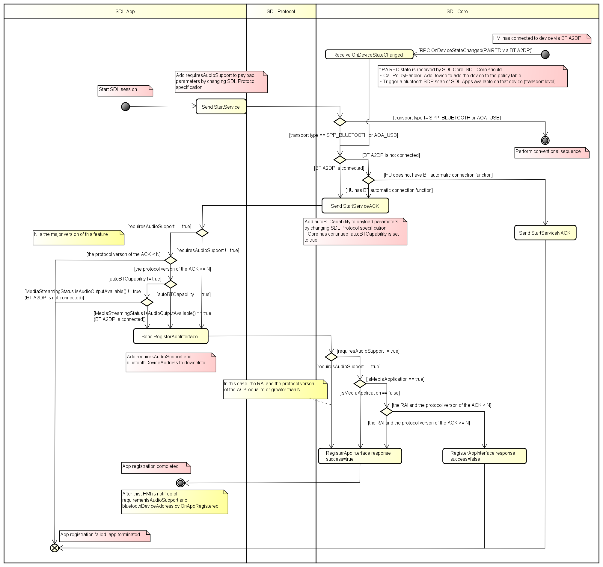

# Adding new parameter of requiresAudioSupport and BluetoothDeviceAddress

* Proposal: [SDL-0280](0280-Adding-new-parameter-of-requiresAudioSupport-and-BluetoothDeviceAddress.md)
* Author: [Shohei Kawano](https://github.com/Shohei-Kawano), [Kazuki Sugimoto](https://github.com/Kazuki-Sugimoto)
* Status: **In Review**
* Impacted Platforms: [ Core / iOS / Java Suite / RPC / Protocol / HMI ]

## Introduction

In this proposal, by adding the `requiresAudioSupport` in `RegisterAppInterface` and the `BluetooothDeviceAddress` in `DeviceInfo`, when the device is connected via only USB, HU will connect to the SDL device's BT automatically or prompt the user requesting BT connection.  

## Motivation

Since Android recommends not supporting AOA2.0, Android will no longer be able to play audio using only USB, and it will be necessary to use BT A2DP to play audio.  
In the current SDL Java Suite library, if `requiresAudioSupport` is TRUE and BT A2DP is not connected, SDL activation will be cancelled. Users aren't notified why the SDL App doesn't start, so the UX needs to be improved.
To solve this problem, add `BluetoothDeviceAddress` and `requiresAudioSupport` so that a new SDL device can be specified in `RegisterAppInterface`, and prompt the user to connect the device via BT, or the HU will connect the device via BT automatically when connected via USB. 

## Proposed solution

The current SDL Java Suite library cancels the transport connection if the `requiresAudioSupport` setting is TRUE and BT A2DP is not connected.
However, with this proposal, by adding a new parameter, the SDL app always establishes the transport connection and is registered without depending on the connection status of BT A2DP. If BT A2DP is not connected, the HU will automatically connect BT using `bluetoothDeviceAddress` or request connection from the user.


### Change the app registration flow

In order for the app to be always registered, the changes in SDL session establishment to app registration flow are shown below.




#### Preconditions

As demonstrated in the flow, the following conditions are required to use this function.
If the SDL app or HU cannot use this function, it will perform the same operation as before.


|conditions|details|
|---|---|
|The app/HMI must have the version that supports this function|App side: `requiresAudioSupport` of `RegisterAppInterface` must be set to true in order to use this function.<br>HMI side: `autoBTCapability` of `StartServiceACK` must be set to true in order to use this function.|
|App must request audio|In case of media app, `requestAudioSupport` is set to true as default. However, developers can set `requiresAudioSupport` to true regardless of default settings.|
|HU must have BT automatic connection function|`autoBTConnect` of` HMICapabilities` must be set to true.|

#### Add parameters

- StartService
`requiresAudioSupport` is added to the payload of `StartService`.
Similar to the default in the existing Java Suite library, `requiresAudioSupport` is set to true for media apps and false for other types of apps. However, app developers can change these settings if needed.

- StartServiceACK
`autoBTCapability` is added to the payload of `StartServiceACK`.
Additionally, a new parameter `autoBTConnection`, which indicates whether the HU has the BT automatic connection function, is added to `HMICapabilities`. SDL Core sets `autoBTCapability` to true, if `autoBTConnection` is true.

HMI API:
```xml
<struct name="HMICapabilities">
  <param name="navigation" type="Boolean" mandatory="false">
    <description>Availability of build in Nav. True: Available, False: Not Available</description>
  </param>
  <param name="phoneCall" type="Boolean" mandatory="false">
    <description>Availability of build in phone. True: Available, False: Not Available</description>
  </param>
  <param name="videoStreaming" type="Boolean" mandatory="false">
    <description>Availability of built-in video streaming. True: Available, False: Not Available</description>
  </param>
+  <param name="autoBTConnection" type="Boolean" mandatory="false">
+    <description>Indicates whether the HU has BT automatic connection function. True: Available, False: Not Available</description>
+  </param>
</struct>
```

- RegisterAppInterface
- OnAppRegistered
Add `bluetoothDeviceAddress` to` DeviceInfo`. Add `requiresAudioSupport` to` HMIApplication`.

Mobile API:
```xml
    <struct name="DeviceInfo" since="3.0">
        <description>Various information about connecting device.</description>         
        <param name="hardware" type="String"  minlength="0" maxlength="500" mandatory="false">
            <description>Device model</description>
        </param>
        <param name="firmwareRev" type="String" minlength="0" maxlength="500" mandatory="false">
            <description>Device firmware revision</description>
        </param>
        <param name="os" type="String" minlength="0" maxlength="500" mandatory="false">
            <description>Device OS</description>
        </param>
        <param name="osVersion" type="String" minlength="0" maxlength="500" mandatory="false">
            <description>Device OS version</description>
        </param>
        <param name="carrier" type="String" minlength="0" maxlength="500" mandatory="false">
            <description>Device mobile carrier (if applicable)</description>
        </param>
        <param name="maxNumberRFCOMMPorts" type="Integer" minvalue="0" maxvalue="100" mandatory="false">
            <description>Omitted if connected not via BT.</description>
        </param>         
+       <param name="bluetoothDeviceAddress" type="String"  minlength="0" maxlength="500" mandatory="false">
+           <description>Device BT Address</description>
+       </param>
    </struct>
```
  
HMI API:
```xml
<struct name="DeviceInfo">
  <param name="name" type="String" mandatory="true">
    <description>The name of the device connected.</description>
  </param>
  <param name="id" type="String" mandatory="true">
    <description>The ID of the device connectedi: either hash of device's USB serial number(in case of USB connection) or has of device's MAC address(in case of BlueTooth or WIFI connection</description>
  </param>
  <param name="transportType" type="Common.TransportType" mandatory="false">
    <description>The transport type the named-app's-device is connected over HU(BlueTooth, USB or WiFi). It must be provided in OnAppRegistered and in UpdateDeviceList</description>
  </param>
  <param name="isSDLAllowed" type="Boolean" mandatory="false">
    <description>Sent by SDL in UpdateDeviceList. 'true' - if device is allowed for PolicyTable Exchange; 'false' - if device is NOT allowed for PolicyTable Exchange </description>
  </param>
+ <param name="bluetoothDeviceAddress" type="String" mandatory="false">
+   <description>Device BT Address</description>
+ </param>
</struct>
...
<struct name="HMIApplication">
...
    <param name="deviceInfo" type="Common.DeviceInfo" mandatory="true">
       <description>The ID, serial number, and transport type by which the named app's device is connected to HU.</description>
    </param>
...
    <param name="cloudConnectionStatus" type="Common.CloudConnectionStatus" mandatory="false"></param>
+    <param name="requiresAudioSupport" type="Boolean" mandatory="false">
+        <description>Set whether or not this app requires the use of an audio streaming output device.</description>
+    </param>
</struct>
```

### Launch the app

By using this function, the HU is able to perform  BT automatic connection based on the `bluetoothDeviceAddress` which is notified when the app that requests audio (`requiresAudioSupport` is set to true) is launched. 
It can also display a message that prompts BT connection to the user.


## Potential downsides

Due to the complexity of the flow, the developer must do the implementation carefully.

## Impact on existing code

This proposal requires a major version change.
Since new parameters are added, Core, iOS, Java Suite, RPC, Protocol, and HMI are affected.


## Alternatives considered

Nothing.  
