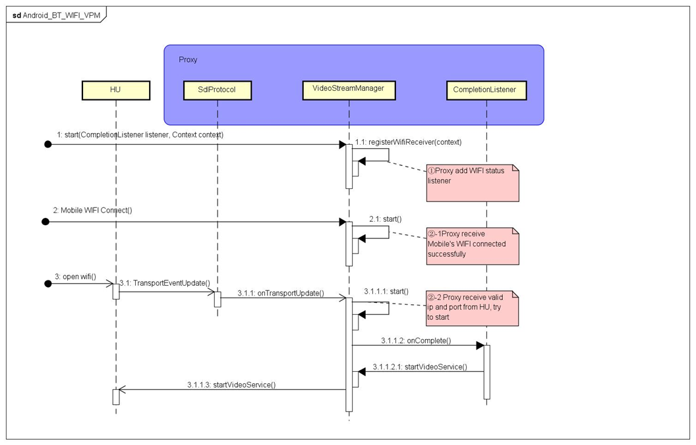

# Allow navigation apps to access information about WiFi networks


* Proposal: [SDL-0291](0291-allows-navigation-apps-to-access-information-about-Wi-Fi-networks.md)
* Author: [Zhou Xin](https://github.com/zhouxin627)
* Status: **Returned for Revisions**
* Impacted Platforms: [Java Suite]

## Introduction
This proposal requires all current navigation apps to include a new permission (android.permission.ACCESS_WIFI_STATE) to benefit from the issue fix as follows:
https://github.com/smartdevicelink/sdl_java_suite/pull/1259


## Motivation
Currently, there are some issues with navigation apps when users enable WiFi after the navigation apps are activated.

For example:
1. SDL failed to start video streaming if users enable WiFi on the head unit after the NaviAPP is activated.
https://github.com/smartdevicelink/sdl_java_suite/issues/1235
2. SDL failed to start video streaming if users enable WiFi on the phone more than 150s after the NaviAPP is activated.
https://github.com/smartdevicelink/sdl_java_suite/issues/1236

Basically, the problem is that NaviAPPs start video streaming unsuccessfully in the following use cases:

1. Activate the NaviAPP, then enable WiFi on the head unit within 150 seconds.
2. Activate the NaviAPP, wait more than 150 seconds, then enable WiFi on the head unit.
3. Activate the NaviAPP, wait more than 150 seconds, then enable WiFi on the phone

The root cause of the problems is that,in the above three situations,
there is no mechanism to trigger the reestablishment of secondary transport (TCP) for `VideoStreaming` in Java Suite currently.
There is a complete solution to these problems.
It would help SDL greatly improve the user experience on `VideoStreaming` via BT+WiFi.

1. Add WIFI status listener into Proxy
2. Reference iOS's design, modify the timing of request TCP connection,
  +  2-1 Proxy receive Mobile's WIFI connected successfully
  +  2-2 Proxy receive valid IP and port from HU
  +  2-3 Proxy receive onHmiStatus(FULL) from HU(the Existing process of current proxy)

3. Proxy receive TCP TransportDisconnected, clear IP and port

Please refer to Appendix section for sample code.

The implementation of WIFI status listener is as follows.
```Java
    public void registerWifiReceiver(Context context){
        this.context = new WeakReference<>(context);
        IntentFilter intentFilter = new IntentFilter();
        intentFilter.addAction(WifiManager.WIFI_STATE_CHANGED_ACTION);
        WifiBroadcastReceiver wifiBroadcastReceiver = new WifiBroadcastReceiver();
        this.context.get().registerReceiver(wifiBroadcastReceiver,intentFilter);
    }
```
The new permission android.permission.ACCESS_WIFI_STATE is required to use the above mentioned API.

### Sequence diagram
 

## Proposed solution
Add manifest permission to navigation apps that allows them to access information about WiFi networks.

```xml
    <!-- Required to check if WiFi is enabled -->
    <uses-permission android:name="android.permission.ACCESS_NETWORK_STATE" />
    <uses-permission android:name="android.permission.FOREGROUND_SERVICE" />
+   <uses-permission android:name="android.permission.ACCESS_WIFI_STATE" />
```

## Potential downsides
No downsides were identified.

## Impact on existing code
This will be a minor version change to the Java Suite Library.

## Alternatives considered
No alternatives were identified.

## Appendix
### Sample Code
#### VideoStreamManager.java
```java
    @Override
    public void start(CompletionListener listener) {
+       this.listener = listener;
        isTransportAvailable = internalInterface.isTransportForServiceAvailable(SessionType.NAV);
        getVideoStreamingParams();
        checkState();
        super.start(listener);
    }

+   public void start(CompletionListener listener, Context context){
+       registerWifiReceiver(context);
+       start(listener);
+   }
+
+   public void registerWifiReceiver(Context context){
+       this.context = new WeakReference<>(context);
+       IntentFilter intentFilter = new IntentFilter();
+       intentFilter.addAction(WifiManager.WIFI_STATE_CHANGED_ACTION);
+       WifiBroadcastReceiver wifiBroadcastReceiver = new WifiBroadcastReceiver();
+       this.context.get().registerReceiver(wifiBroadcastReceiver,intentFilter);
+   }

    @Override
    protected void onTransportUpdate(List<TransportRecord> connectedTransports, boolean audioStreamTransportAvail, boolean videoStreamTransportAvail){
        isTransportAvailable = videoStreamTransportAvail;
        if(internalInterface.getProtocolVersion().isNewerThan(new Version(5,1,0)) >= 0){
            if(videoStreamTransportAvail){
                checkState();
+               if ((!hasStarted && listener != null && this.getState() == SETTING_UP)) {
+                   // Since istransportavailable is false on the first start, try to restart when receiving status updates
+                   start(listener);
+               }
+               else if (hasStarted && listener != null && getState() == READY && stateMachine.getState() == StreamingStateMachine.STOPPED) {
+                   // When the TCP connection is disconnected, the stateMachine will be set to STOPPED.
+                   // When the WiFi is reconnected at the vehicle side, the status will be updated.
+                   // Here, it should be reset to the stateMachine status and restart
+                   transitionToState(SETTING_UP);
+                   stateMachine.transitionToState(StreamingStateMachine.NONE);
+                   hasStarted = false;
+                   start(listener);
+               }
            }
        }else{
            //The protocol version doesn't support simultaneous transports.
            if(!videoStreamTransportAvail){
                //If video streaming isn't available on primary transport then it is not possible to
                //use the video streaming manager until a complete register on a transport that
                //supports video
                transitionToState(ERROR);
            }
        }
    }
    
+   public class WifiBroadcastReceiver extends BroadcastReceiver {
+       @Override
+       public void onReceive(Context context, Intent intent) {
+           if (WifiManager.WIFI_STATE_CHANGED_ACTION.equals(intent.getAction())) {
+               int wifiState = intent.getIntExtra(WifiManager.EXTRA_WIFI_STATE, -1);
+               if (wifiState == WifiManager.WIFI_STATE_ENABLED){
+                   Log.i(TAG,"WifiBroadcastReceiver has receiver state = " + getState() + " machine state = " + currentVideoStreamState() + " hasStarted = " + hasStarted);
+                   if (listener != null) {
+                       if (getState() == READY && currentVideoStreamState() == StreamingStateMachine.READY && hasStarted == false) {
+                           // If you cannot establish a TCP connection with the vehicle because the WiFi on the mobile side is not turned on,
+                           // you should try to restart when the WiFi on the mobile side is turned on.
+                           start(listener);
+                       }
+                   }
+               }
+           }
+       }
+   }
```
#### SdlProtocolBase.java
```java
...
                //If the secondary transport isn't connected yet that will have to be performed first
                List<ISecondaryTransportListener> listenerList = secondaryTransportListeners.get(secondaryTransportType);
                if(listenerList == null){
                    listenerList = new ArrayList<>();
                    secondaryTransportListeners.put(secondaryTransportType, listenerList);
                }
+               else {
+                   listenerList.clear();
+               }

                //Check to see if the primary transport can also be used as a backup
                final boolean primaryTransportBackup = transportPriorityForServiceMap.get(serviceType).contains(PRIMARY_TRANSPORT_ID);
...

        @Override
        public void onTransportDisconnected(String info, TransportRecord disconnectedTransport, List<TransportRecord> connectedTransports) {
            if (disconnectedTransport == null) {
                Log.d(TAG, "onTransportDisconnected");
                if (transportManager != null) {
                    transportManager.close(iSdlProtocol.getSessionId());
                }
                iSdlProtocol.shutdown("No transports left connected");
                return;
            } else {
                Log.d(TAG, "onTransportDisconnected - " + disconnectedTransport.getType().name());
+               if (disconnectedTransport.getType() == TransportType.TCP && secondaryTransportParams != null){
+                   if (activeTransports.containsValue(disconnectedTransport)) {
+                       //If the established TCP connection is disconnected, the corresponding IP and port are invalid and should be removed from the list.
+                       // Otherwise, istransportforserviceavailable is always true after disconnection
+                       secondaryTransportParams.remove(TransportType.TCP);
+                   }
+               }
            }
```
