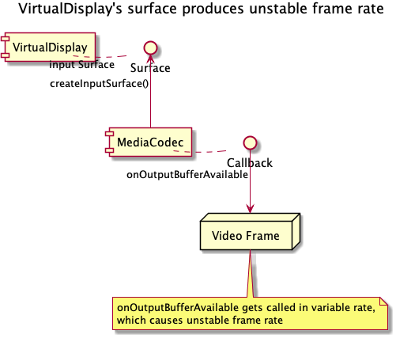

# Improve VirtualDisplayEncoder for stable frame rate

* Proposal: [SDL-0292](0292-improve-VDE-for-stable-frame-rate.md)
* Author: [Shinichi Watanabe](https://github.com/shiniwat)
* Status: **Returned for Revisions**
* Impacted Platforms: [Java Suite]

## Introduction

This proposal improves the quality of video projection when using Android `VirtualDisplay` and `MediaEncoder`, as Android `MediaEncoder` does not produce a consistent frame rate for rendering `VirtualDisplay`'s surface.

[SDL-0274](0274-add-preferred-FPS.md) introduced `preferredFPS` parameter specified in `VideoStreamingCapability`. This proposal helps to implement the `preferredFPS` support in the sdl_java_suite platform.

## Motivation

A part of sdl_java_suite library utilizes `VirtualDisplay` and `MediaEncoder` to produce the video projection stream.
Actually, frame rate of video stream depends on how often `MediaCodec.Callback` gets called.
The component structure is illustrated as follows:



**Fig. 1: VirtualDisplay's surface produces unstable frame rate**

For instance, 
- if an app's content in `VirtualDisplay` is updated quite often, the `MediaEncoder` associated with `VirtualDisplay`'s surface produces 60 frames per second.
- if an app's content in `VirtualDisplay` is not updated very frequently, its surface produces rather few frames (e.g. 20 frames) per second.

Most HUs would be designed for consistent video frame rate, so it may cause some negative effect if video frame rate goes up and down.

This proposal addresses this Android specific issue as it's closely related to how Android `VirtualDisplay` works.

## Proposed solution

Because the issue comes from the fact where `VirtualDisplay`'s surface emits output buffer in a variable rate, the idea is:

- Give the intermediate surface to `VirtualDisplay`.
- When `VirtualDisplay` sends frames, the intermediate surface can determine whether or not to forward them into `MediaCodec`'s input surface.

The approach is introduced at http://stackoverflow.com/questions/31527134/controlling-frame-rate-of-virtualdisplay, i.e.

- Create a `SurfaceTexture`, construct a Surface from it, and give it to `VirtualDisplay`.
- When `SurfaceTexture` fires `onFrameAvailable` callback, we can buffer the frame, and render the texture onto `MediaCodec`'s input surface by using GLES.

The idea is illustrated as follows:
  


**Fig. 2: VirtualDisplay with intermediate Surface**

### Detailed design

The proposed solution heavily depends on Android OpenGL ES components (classes under android.opengl namespace), which are composed of following classes:
- android.opengl.EGLConfig
- android.opengl.EGLContext
- android.opengl.EGLDisplay
- android.opengl.EGLSurface

Actually a open source graphic library, called [Grafika](https://github.com/google/grafika) already implemented some useful wrapper classes that internally wraps some GLES classes, and the following wrapper classes in Grafika already did exactly what we want:
- `EglCore` (com.android.grafika.gles.EglCore)
- `OffscreenSurface` (com.android.grafika.gles.OffscreenSurface)
- `WindowSurface` (com.android.grafika.gles.WindowSurface)
- `FullFrameRect` (com.android.grafika.gles.FullFrameRect)

Instead of having dependency on above Grafika classes, I tried to use those GLES classes directly.
However, Grafika classes above are just thin wrapper of GLES classes, and because the basic idea is exactly the same as what some part of Grafika does, as a nature of open source policy, we should follow the Grafika's Apache License 2.0.

It is exactly the philosophy of open source, and re-inventing a wheel does not make sense.

Based on the concept above, the detailed design would be:

1. Setup intermediate surface and surface texture.
We need to add the following components into `VirtualDisplayEncoder` class.

- `EglCore` (com.android.grafika.gles.EglCore)
- `OffscreenSurface` (com.android.grafika.gles.OffscreenSurface)
- `TextureId`, which can be created by `FullFrameRect.createTextureObject()`
- `SurfaceTexture` with above `TextureId`
- Surface with above `SurfaceTexture` (let's call this to IntermediateSurface)
- `WindowSurface` (com.android.grafika.gles.WindowSurface)

2. Create `VirtualDisplay` with IntermediateSurface
Instead of inputSurface, we use IntermediateSurface for `VirtualDisplay`, so that we can control update timing of the IntermediateSurface.

3. Create capture thread
In capture thread, we periodically update surface texture, so that we can capture the surface in a constant rate.

The pseudo code of CaptureThread looks as follows:

```java
 import android.os.Looper;private final class CaptureThread extends Thread implements SurfaceTexture.OnFrameAvailableListener {
    long frameInterval; // this is given as the parameter
    static final int MSG_TICK = 1;
    static final int MSG_UPDATE_SURFACE = 2;

    private Handler handler;
    private SurfaceTexture surfaceTexture;
    private int textureId;
    private WindowSurface windowSurface;
    private FullFrameRect fullFrameRect;
    private long frameIntervalInNano = 1000000000 / fps; // fps should be specified by HU.
    private long nextTime;
    private final float[] matrix = new float[16];

    ...
    public void run() {
        Looper.prepare();
        // we use a Handler for this thread
        handler = new Handler() {
                public void handleMessage(Message msg) {
                    switch(msg.what) {
                        case MSG_TICK:
                            // we can draw the image in Surface Texture here, something like
                            long now = System.nanoTime();
                            if (now > nextTime) {
                                try {
                                    windowSurface.makeCurrent();
                                    GLES20.glViewport(0, 0, width, height);
                                    fullFrameRect.drawFrame(textureId, matrix);
                                } catch(RuntimeException e) {
                                    ...
                                }
                                nextTime += frameIntervalInNano;
                            }
                            long delayTime = // adjust delaytime..
                            handler.sendMessageDelayed(handler.obtainMessage(MSG_TICK), delayTime);
                            break;
                        case MSG_UPDATE_SURFACE:
                            // update the surface here.
                            updateSurface();
                    }
                }
         }
    }

    private void updateSurface() {
        try {
            windowSurface.makeCurrent()
        } catch(RuntimeException e) {
            ...
        }
        surfacetexture.updateTexImage();
        surfaceTexture.getTransformMatrix(matrix);
    }

    /**
    * this is where we update the surface
    * @param surfaceTexture
    */
    public void onFrameAvailable(SurfaceTexture surfaceTexture) {
        // here, we can update surfaceTexture
        if (Build.VERSION.SDK_INT >= Build.VERSION_CODES.LOLLIPOP) {
            updateSurface();
        } else {
            // note that API level is lower than 21 (LOLLIPOP), setOnFrameAvailableListener(listener) is used,
            // and most likely, OnFrameAvailableListener gets called in main thread.
            // In that case, we have to call updateSurface in CaptureThread instead.
            handler.sendMessage(handler.obtainMessafge(MSG_UPDATE_SURFACE));
        }

        // the first time this gets called, start the loop
        // by mHandler.sendMessage()
        if (nextTime == 0) {
            nextTime = System.nanoTime();
            handler.sendMessage(handler.obtainMessage(MSG_TICK));
        }
    }
 }
```

4. Add stableFrameRate to VideoStreamingParameters

Consistent frame rate should be beneficial for all head units. However, adding stableFrameRate flag to VideoStreamingParameters allows developers to turn on or off the capability.

```java
public class VideoStreamingParameters {
    ...
    private boolean stableFrameRate;

    public VideoStreamingParameters(){
        ...
        stableFrameRate = true; // true by default
    }

    public VideoStreamingParameters(int displayDensity, int frameRate, int bitrate, int interval,
                                    ImageResolution resolution, VideoStreamingFormat format, boolean stableFrameRate){
        ...
        this.stableFrameRate = stableFrameRate;
    }

    public void update(VideoStreamingParameters params){
        ...
        this.stableFrameRate = params.stableFrameRate;
    }
}
```

Please note that if head unit specified `preferredFPS` parameter, and if a developer turned off `stableFrameRate` flag, `MediaEncoder` will emit video frames very frequently, which will likely exceed the number of frames specified to `preferredFPS` partameter.

## Potential downsides

In previous review session, there were some concerns about the quality of Grafika library. As mentioned in Detailed Design section already, what we need is some GLES wrapper classes, which are already implemented as a part of Grafika library.

We can add some Unit Test for those wrapper classes to verify the code quality anyway.
The other thing to note is that `Grafika` component is under [Apache License 2.0](http://www.apache.org/licenses/LICENSE-2.0).

sdl_java_suite already uses some component under Apache License 2.0 (e.g. `JSON`), so adding another open source component won't cause any issues.

## Impact on existing code

Because this approach does not change an existing API, and changes are inside of `VirtualDisplayEncoder` class, there's no impact to developers who use `VirtualDisplayEncoder`.

Also note that developer can explicitly turn off this feature by setting `VideoStreamingParameters.stableFrameRate` to false.

This proposal should be combined with "Add preferred FPS to VideoStreamingCapability" proposal, so that we can respect the preferred FPS value, which is specified by head unit.

## Alternatives considered

This is a pure improvement for existing `VistualDisplayEncoder`, so there are no alternatives, but this proposal adds the ability to specify the desired FPS on Proxy end.
