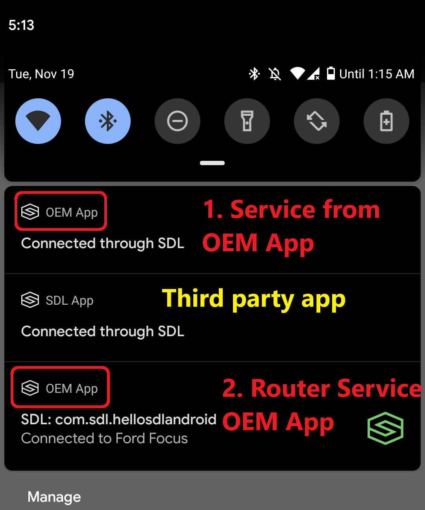
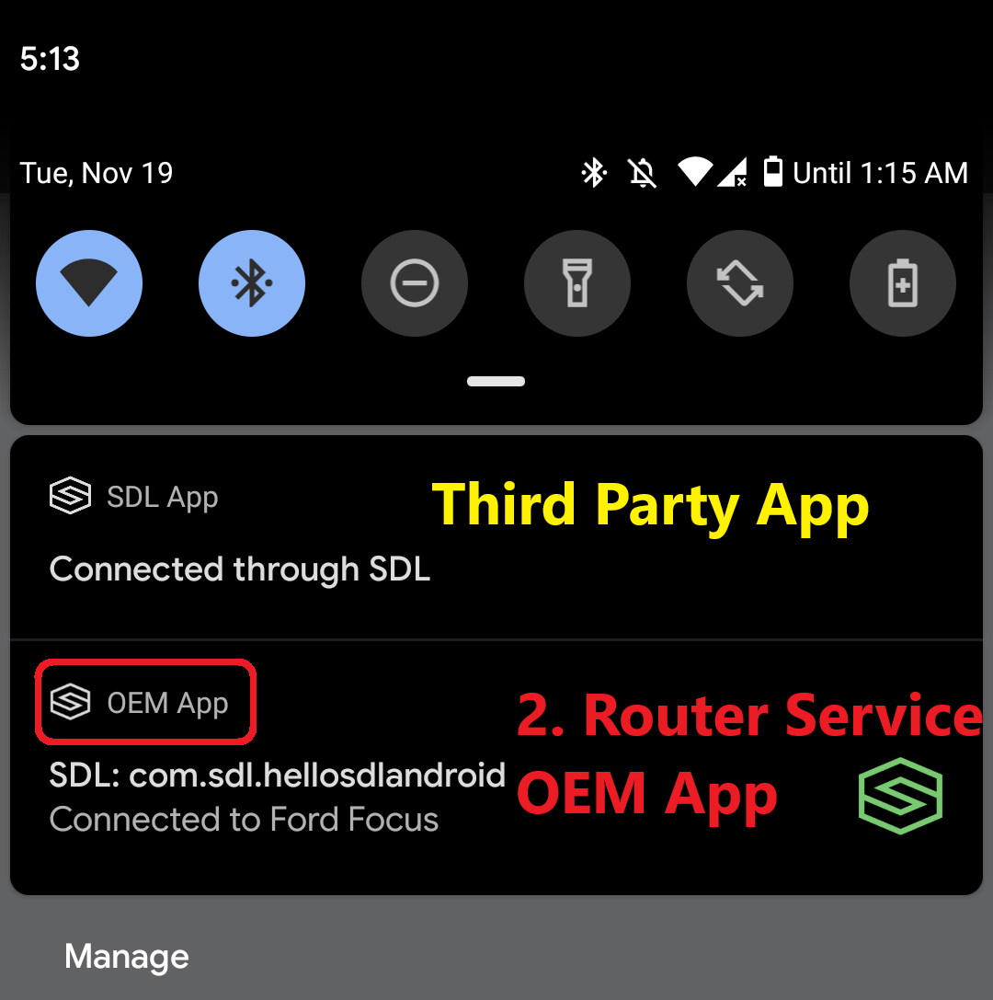
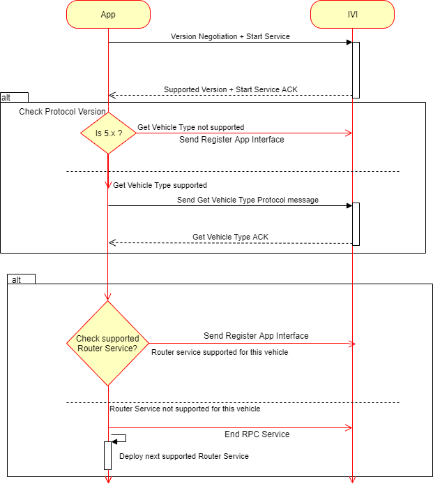
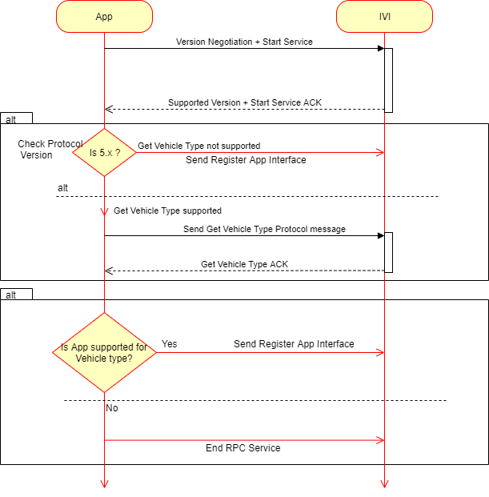

# Enable OEM exclusive apps support

* Proposal: [SDL-0293](0293-vehicle-type-filter.md)
* Author: [Ashwin Karemore](https://github.com/ashwink11)
* Status: **In Review**
* Impacted Platforms: [Core / iOS / Java Suite / Protocol]

## Introduction

This feature will enable SDL adopters to provide exclusive apps to their users depending on vehicle type. The proposal describes a way to share vehicle type information before sending the Register App Interface request.

## Motivation

The proposal tries to mitigate the below issues.

### Handling Proprietary app registrations

In the current implementation of SDL, vehicle information is shared with the `RegisterAppInterface` response. If there are any apps that work with specific OEMs, they would need to send the `RegisterAppInterface` RPC to know vehicle details. If the vehicle details do not match the supported vehicle types, they would need to implement some mechanism to unregister the app. This behavior would cause an app to be shown on an SDL enabled system for some time until the app unregisters itself from the IVI system. The users would see that apps were shown in the IVI system for a moment, but are removed within seconds. By providing vehicle type information before app registration, we could solve this issue. The app will not register on the IVI if vehicle type is not supported, allowing app partners and SDL adopters to provide an exclusive apps experience to their users depending on vehicle type information. 

### App name shown on notifications in Android

The exclusive apps should not host Android Router Service on unsupported SDL systems. The Android system requires all apps using foreground services to show a notification. An SDL enabled Android app can have two foreground services. The Android Router Service is started by the Android proxy and another foreground service will be started by an SDL enabled app.

The Android Router Service has no information on what head unit it is connecting to when a transport connection is made. Other SDL apps bind to available router service and use this connection. This behavior could lead to cases where a proprietary app creates an Android Router Service when connected to an unsupported SDL enabled system. This started service will need to show a foreground notification with the app name, giving the user the impression that the proprietary app is working with an unsupported SDL enabled system.

For example, if a proprietary app of an OEM creates a router service and the mobile device is connected to another OEM's SDL enabled IVI system, the user would perceive that the proprietary app is doing something in the background when connected to an SDL enabled IVI system from another OEM.

Please reference the below screenshots.

- Notification 1: Created by OEM App.
- Notification 2: Created by SDL Android SDK for Android Router Service.

__Note the app name being shown in both notifications. In the below picture, the `SDL App` is using the “Android Router Service” created by the `OEM App`.__




The only way to remove notifications from an OEM App when it connects to another vehicle is to force stop both the services so that both notifications are removed. In this case, other apps connected through the OEM App's router service will also get disconnected. This is not a recommended approach. If the OEM app wants to unregisters itself from the SDL enabled IVI system, it will stop the service created by an app. The Android Router Service from the OEM App will keep running.

Please reference the below screenshot. The Android Router Service is hosted by the OEM app, the `Notification 2` with the app name will be shown to the user, giving the impression that the `OEM App` is still working. If the OEM App starts showing notifications when connected to another OEM's vehicle, this would confuse users. They would probably think that `OEM App` on their mobile device is working with another OEM's SDL enabled IVI system. This proposal will define ways to mitigate this issue.



This proposal tries to address the router service notification issue by defining the vehicle type filter. So, we could have an app that could specifically connect to certain vehicles. For example, an app that is designed only for Mustang vehicles.

### Configuring lock screen with vehicle name or brand logo 

 This would help apps to show the vehicle brand logo depending on the vehicle type to which it's connected. In the current implementation, the lock screen configuration is set along with the SDL lifecycle/manager configuration. Hence while configuring the lock screen, the app does not know to which vehicle it's connecting. The apps cannot change the configuration of the lock screen once the app receives the `RegisterAppInterface` response with vehicle details. Some app partners have expressed their interest in showing the vehicle brand logo on the lock screen of the app depending on vehicle type information, which is not possible with the current implementation of SDL due to reasons described above. 
 
## Proposed solution

This proposal will describe additional information exchange in the protocol layer and changes in the Java Suite and iOS proxy libraries. 

### Protocol Layer Changes

In the current implementation, every app is responsible for negotiating the maximum supported protocol version. The IVI can share vehicle type information with the proxy after protocol version negotiation. To share this info, we would need to define the new protocol message.

#### Frame Info Definitions

| Frame Info Value| Name | Description |
|------------|------|-------------|
| 0x0A| Get Vehicle Type | Requests vehicle type information|
| 0x0B | Get Vehicle Type ACK |Acknowledges that the specific information has been shared successfully |
| 0x0C | Get Vehicle Type NAK | Negatively acknowledges that the specific information *cannot* be shared |


1. If the system supports the `GetVehicleType` protocol message, the proxy will send it after version negotiation.
2. If the system does not support the `GetVehicleType` protocol message, the proxy will send the `RegisterAppInterface` RPC after version negotiation and continue the use case.

#### Messaging from the app to IVI

<table width="100%">
  <tr>
    <th>Version</th>
    <th>E</th>
    <th>Frame Type</th>
    <th>Service Type</th>
    <th>Frame Info</th>
    <th>Session ID</th>
    <th>Data Size</th>
    <th>Message ID</th>
  </tr>
  <tr>
    <td>5.x</td>
    <td>no</td>
    <td>Control</td>
    <td>Control</td>
    <td>Get Vehicle Type</td>
    <td>Assigned Session</td>
    <td>0</td>
    <td>n</td>
  </tr>
  <tr>
    <td>0b0101</td>
    <td>0b0</td>
    <td>0b000</td>
    <td>0x00</td>
    <td>0x0A</td>
    <td>0x01</td>
    <td>0x00000000</td>
    <td>0x0000000n</td>
  </tr>
</table>

#### Messaging from the IVI to the app

##### Success message: IVI sends vehicle type info

If the IVI can share vehicle type info, it will send the following protocol message.

<table width="100%">
  <tr>
    <th>Version</th>
    <th>E</th>
    <th>Frame Type</th>
    <th>Service Type</th>
    <th>Frame Info</th>
    <th>Session ID</th>
    <th>Data Size</th>
    <th>Message ID</th>
  </tr>
  <tr>
    <td>5.x</td>
    <td>no</td>
    <td>Control</td>
    <td>Control</td>
    <td>Get Vehicle Type ACK</td>
    <td>Assigned Session</td>
    <td>BSON object Size</td>
    <td>n</td>
  </tr>
  <tr>
    <td>0b0101</td>
    <td>0b0</td>
    <td>0b000</td>
    <td>0x00</td>
    <td>0x0B</td>
    <td>0x01</td>
    <td>0x00000XXX</td>
    <td>0x0000000n</td>
  </tr>
</table>

The BSON payload of this message will have the following info.

| Tag Name| Type | Description |
|------------|------|-------------|
|make|String| Vehicle make |
|model|String| Vehicle model |
|model year|String| Vehicle model year |
|trim|String| Vehicle trim |
|systemSoftwareVersion|String| Vehicle system software version |
|systemHardwareVersion|String| Vehicle system hardware version |
|rpcSpecVersion|String| RPC message spec version |

##### Failure message: IVI does not send vehicle type info

If the IVI cannot share vehicle type info, it will send the following protocol message.

<table width="100%">
  <tr>
    <th>Version</th>
    <th>E</th>
    <th>Frame Type</th>
    <th>Service Type</th>
    <th>Frame Info</th>
    <th>Session ID</th>
    <th>Data Size</th>
    <th>Message ID</th>
  </tr>
  <tr>
    <td>5.x</td>
    <td>no</td>
    <td>Control</td>
    <td>Control</td>
    <td>Get Vehicle Type NACK</td>
    <td>Assigned Session</td>
    <td>0</td>
    <td>n</td>
  </tr>
  <tr>
    <td>0b0101</td>
    <td>0b0</td>
    <td>0b000</td>
    <td>0x00</td>
    <td>0x0C</td>
    <td>0x01</td>
    <td>0x00000000</td>
    <td>0x0000000n</td>
  </tr>
</table>

### Android Proxy changes

The Android proxy will need to implement the above protocol changes. In addition to implementing a protocol message, the proxy will need the additional implementation to propagate vehicle type info to the application layer.

#### Defining resource file for supported vehicle type

1. The mobile apps can define an XML for supported vehicles in resources of the project. The XML resource file can be called as `supported_vehicle_type.xml`.
2. The structure of the resource file can be as follows.

```xml
<?xml version="1.0" encoding="utf-8"?>
<resource>
    <vehicle-type
        make="Ford"
        model="Mustang"
        modelYear="2019"
        trim="GT"/>
</resource>
```
3. If an app defines a `vehicle-type` element, then it should always have a `make` attribute, all other attributes are optional. However, if the app developers want to use `model year` or `trim`, they should define `make` and `model` attributes as well. The proxy will check only the defined attributes. The below example shows a valid vehicle type resource file.

```xml
<?xml version="1.0" encoding="utf-8"?>
<resource>
<!-- Vehicle filter for vehicle make-->
    <vehicle-type
        make="Ford"/>
</resource>
```

```xml
<?xml version="1.0" encoding="utf-8"?>
<resource>
<!-- Vehicle filter for vehicle make and model-->
    <vehicle-type
        make="Ford"
        model="Mustang"/>
</resource>
```
```xml
<?xml version="1.0" encoding="utf-8"?>
<resource>
<!-- Vehicle filter for vehicle make, model and model year-->
    <vehicle-type
        make="Ford"
        model="Mustang"
        modelYear="2019"/>
</resource>
```
```xml
<?xml version="1.0" encoding="utf-8"?>
<resource>
<!-- Vehicle filter for vehicle make, model and trim-->
    <vehicle-type
        make="Ford"
        model="Mustang"
        trim="GT"/>
</resource>
```
```xml
<?xml version="1.0" encoding="utf-8"?>
<resource>
<!-- Vehicle filter for vehicle make-->
    <vehicle-type
        make="Ford"/>
    <vehicle-type
        make="OEM1"/>
    <vehicle-type
        make="OEM2"/>
</resource>
```
4. If the supported vehicle type list is not defined, the proxy can start Android Router Service for all SDL enabled IVI system.

#### Metadata for Android Router Service

1. This resource file needs to be referenced in the manifest file of the project as `metadata` for Android Router Service.
2. When the proxy receives `GetVehicleTypeACK`, it will check if the vehicle type information is defined in the provided supported vehicle type list.
3. If the vehicle filter is not defined, the proxy can skip the check. In this case, the Android Router Service is supported for all SDL enabled systems.

#### Determining Vehicle Type Info

1. In the current implementation, all SDL apps need to start version negotiations and register themselves on the SDL enabled system. This proposal recommends starting the RPC service by the Android Router Service to get vehicle type information from an SDL enabled IVI system before notifying clients about an SDL connection.
2. If the protocol version supports `GetVehicleType`, Android Router Service will send the `GetVehicleType` protocol message.
3. If the Android Router Service supports the connected IVI system, then the Android Router Service will notify the client and provide vehicle type information. The router service will also transfer RPC session information to the application hosting the router service. Since every app is responsible for version negotiations and starting RPC session, the host application will use the same session information to communicate further with the SDL system. 
4. If the vehicle type is not supported by the Android Router Service, the proxy will deploy the next router service. The exclusive apps will not register on the SDL enabled system.
5. The proxy determines the appropriate router service to deploy based on vehicle type information received in the `GetVehicleTypeACK` protocol message. The proxy will check the metadata of the supported vehicle type list to determine the next router service to deploy. The deployed router service will also receive vehicle type information.
6. The next router service deployed will not start the RPC session if vehicle type information is available. It will forward vehicle type info to its clients.
7. It is necessary to check support for `GetVehicleType` protocol message and vehicle type info before notifying the client with SDL enabled callback. If clients are informed before checking the mentioned info, the exclusive apps could end up registering on an unintended SDL enabled IVI system. 
8. If the `GetVehicleType` message is not supported by the protocol version, the exclusive apps will try deploying the next router service. The exclusive apps will host the router service only if there are no other SDL app available on the user's device to host a router service. The exclusive apps, in this case, will rely on vehicle type info received in the `RegisterAppInterface` response. In such a case, if vehicle type is not supported, the exclusive apps will be allowed to unregister apps from the SDL system and stop the Android Router Service.
9. If `GetVehicleType` message response is NACK, the exclusive apps will not register on the SDL system.

 

### iOS Proxy changes

The iOS proxy will need to implement the above-mentioned protocol changes. In addition to implementing a protocol message, the proxy will need the additional implementation to propagate vehicle type info to the application layer.


#### Defining supported vehicle type in Info.plist

1. The supported vehicle list can be defined in Info.plist as below. All the attributes in this list are optional, however, if the app includes `SDLSupportedVehicleTypes` in Info.plist, at least one array element with one key-value in the dictionary should be defined.
2. If an app defines an `SDLSupportedVehicleTypes` key, then it should always have a `make` key-value pair in the dictionary. All other attributes are optional if `make` is defined. However, if the app developers want to use `model year` or `trim`, they should define `make` and `model` key-value pairs as well. The proxy will check only the defined attributes.
The below example shows valid vehicle type filters.

```xml
<key>SDLSupportedVehicleTypes</key>
    <array>
        <dict>
            <key>make</key>
            <string>Ford</string>
            <key>model</key>
            <string>Mustang</string>
            <key>modelYear</key>
            <string>2019</string>
            <key>trim</key>
            <string>GT</string>
        </dict>
        <dict>
            <key>make</key>
            <string>OEM1</string>
            <key>model</key>
            <string>OEM model</string>
            <key>modelYear</key>
            <string>2019</string>
            <key>trim</key>
            <string>trim info</string>
        </dict>
    </array>
```
```xml
<key>SDLSupportedVehicleTypes</key>
    <array>
        <dict>
            <key>make</key>
            <string>Ford</string>
            <key>model</key>
            <string>Mustang</string>
        </dict>
    </array>
```
```xml
<key>SDLSupportedVehicleTypes</key>
    <array>
        <dict>
            <key>make</key>
            <string>Ford</string>
            <key>model</key>
            <string>Mustang</string>
            <key>modelYear</key>
            <string>2019</string>
        </dict>
        <dict>
            <key>make</key>
            <string>OEM1</string>
            <key>model</key>
            <string>OEM model</string>
            <key>modelYear</key>
            <string>2019</string>
        </dict>
    </array>
```

```xml
<key>SDLSupportedVehicleTypes</key>
    <array>
        <dict>
            <key>make</key>
            <string>Ford</string>
            <key>model</key>
            <string>Mustang</string>
            <key>trim</key>
            <string>GT</string>
        </dict>
        <dict>
            <key>make</key>
            <string>OEM1</string>
            <key>model</key>
            <string>OEM model</string>
            <key>trim</key>
            <string>trim info</string>
        </dict>
    </array>
```
```xml
<key>SDLSupportedVehicleTypes</key>
    <array>
        <dict>
            <key>make</key>
            <string>Ford</string>
        </dict>
        <dict>
            <key>make</key>
            <string>OEM1</string>
        </dict>
    </array>
```
#### Determining Vehicle Type Info

1. After version negotiations and starting the RPC service, the proxy should check if `GetVehicleType` is supported by the SDL enabled IVI system.
2. If the protocol version supports `GetVehicleType`, the proxy will send the `GetVehicleType` protocol message.
3. On receiving vehicle type information, proxy will check `SDLSupportedVehicleTypes` keys to check supported vehicle types.
4. If the vehicle type is supported, the proxy should also notify the app about the connected vehicle type so that the app can configure SDL as required. The iOS proxy can implement an `OnSDLEnabled` notification similar to that of the Android proxy to notify the app about SDL connection with the supported vehicle. The app can provide lifecycle configuration to the proxy upon receiving the `OnSDLEnabled` notification. 
5. If the proxy determines from `GetVehicleType` ACK that the vehicle type is not supported, the proxy will end the RPC session. The application layer will not be notified about the vehicle type.
6. If the protocol version does not support the `GetVehicleType` protocol message, the SDL proxy will continue with the app registration and it will rely on vehicle type information received in the `RegisterAppInterface` response. If vehicle type is not supported, the exclusive apps will be allowed to unregister from the SDL enabled system.
7. If the `GetVehicleType` message response is NACK, the proxy will end the RPC session and the app will not be registered on the SDL system.



## Potential downsides

The Android Router Service after transport connection needs to start the RPC service. If the Android Router Service does not start RPC service and relies on the client to send the `GetVehicleType` protocol message, the connected client would start another foreground service. This would force the connected app to show two notifications to users while determining vehicle type information and would need to terminate services if the app does not support the SDL enabled IVI system. 

## Impact on existing code

Above mentioned changes need to be implemented in SDL Core, the Java Suite proxy, and the iOS proxy libraries.

## Alternatives considered

### GetVehicleType as an RPC instead of Protocol message
1. As per the current implementation, the RAI is the first RPC sent to an SDL enabled IVI system and the vehicle type information is available to the app in its response. 
2. If `GetVehicleType` is an RPC, this behavior needs to be changed. The app should be able to use the `GetVehicleType` RPC before the `RegisterAppInterface` RPC.
3. Since the RPC message version is sent to the app in `RAI response`, the app, when connected to an older SDL enabled IVI, would not know if the `GetVehicleType` RPC is supported or not.
4. If `GetVehicleType` is an RPC and it's sent first, the app would need to depend on a timeout to know the support for the `GetVehicleType` RPC when connected to an older SDL enabled IVI system. This behavior would add delays in app registration on the SDL system.
5. If `GetVehicleType` is an RPC, the exclusive apps could potentially show two notifications described above for Android apps before terminating them. Terminating a router service hosted by exclusive apps will unregister all apps using it.

### Soft-Registrations of an App
1. The app sends the RAI Request and receives its Response.
2. The HMI does not register the app until the app completes its validation.
3. Upon completing validation, the app sends some indication for a hard app registration. The app will be shown on the SDL enabled IVI system. The type of notification sent to the SDL enabled IVI system needs to be defined.
4. This solution would solve the proprietary app registrations. In this case, as well, the exclusive apps could potentially show two notifications described above for Android apps before terminating them. Terminating a router service hosted by exclusive apps will unregister all apps using it.

### Creating generic SDL app to create Android Router Service

1. The user will need to download an additional app for the SDL connection.
2. This would affect App discoverability, as the users would potentially never know about such app and never find apps in an SDL enabled system. 

### App sending list of supported vehicle types in `RegisterAppInterface`

1. This solution would solve the proprietary app registrations.
2. The HMI does not register the app until the app completes its validation.
3. The exclusive apps could potentially show two notifications described above for Android apps before terminating them. 
4. If the vehicle type is not supported and the app needs to deploy another router service it would not know the supported Android Router Service for the SDL system.
5. In this case, as well, the exclusive apps could potentially show two notifications described above for Android apps before terminating them. Terminating a router service hosted by exclusive apps will unregister all apps using it.
