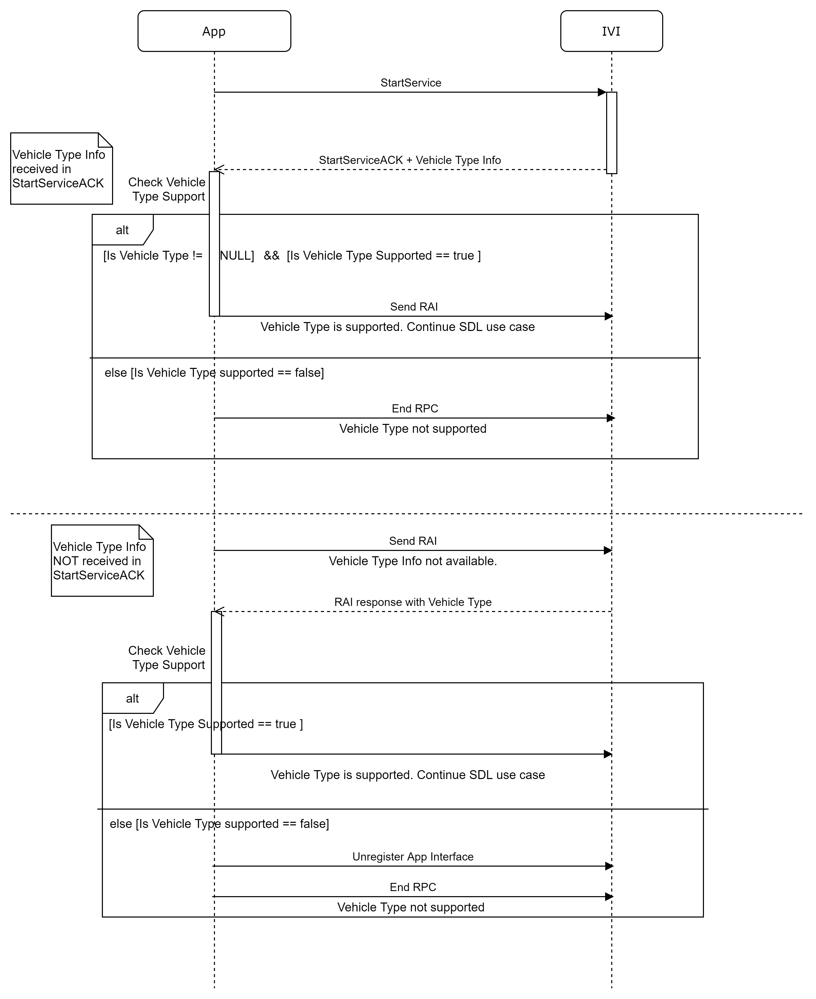
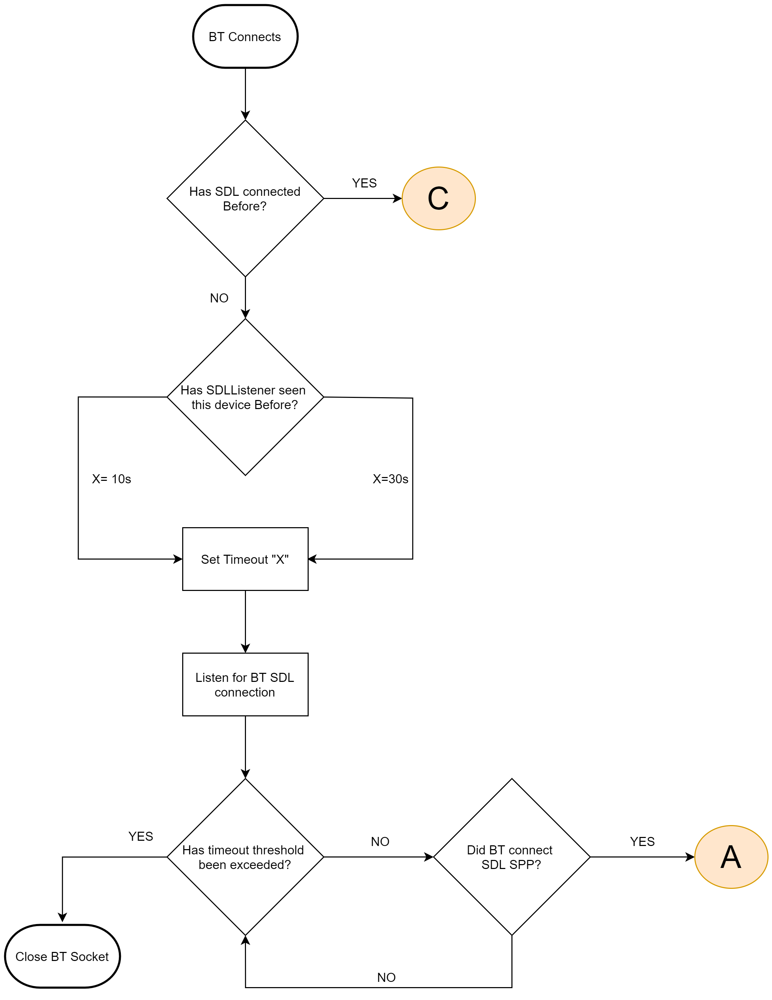
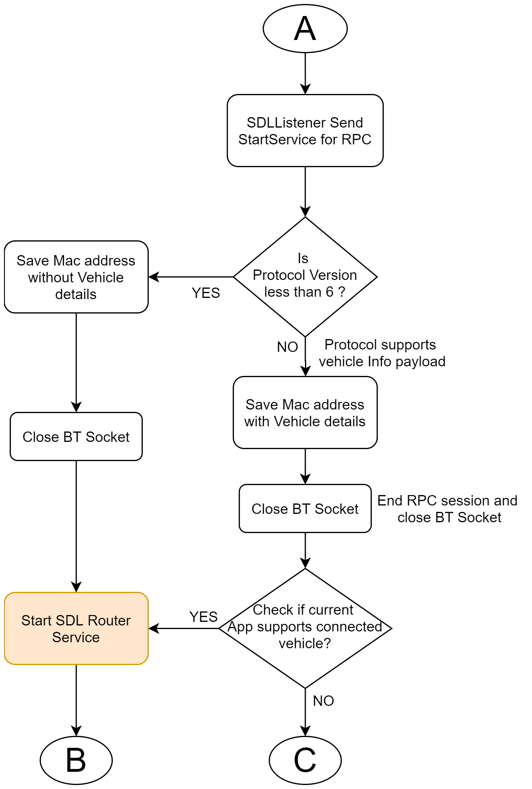
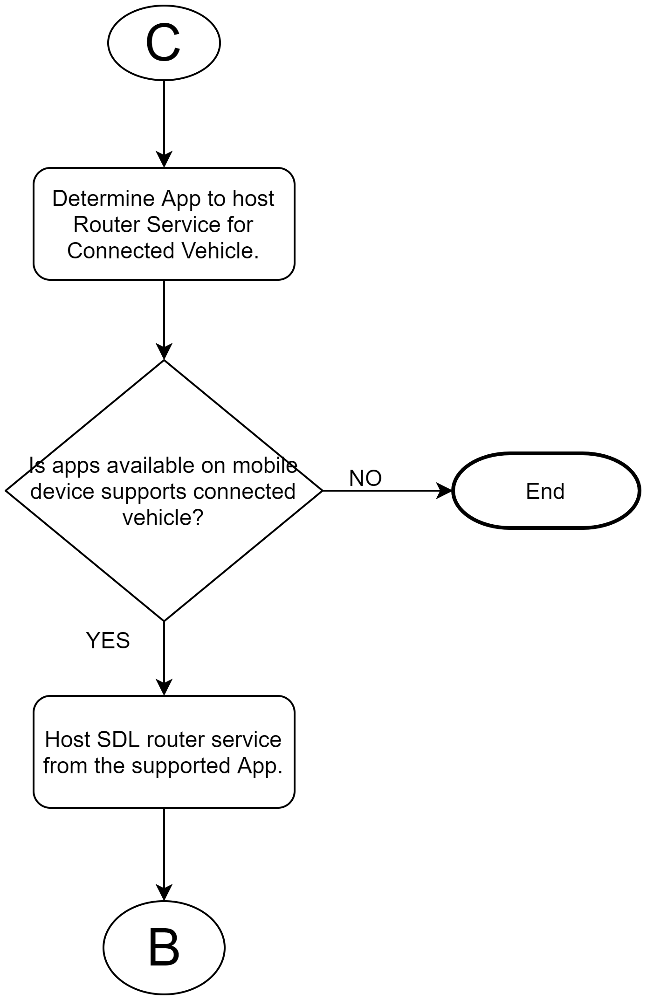
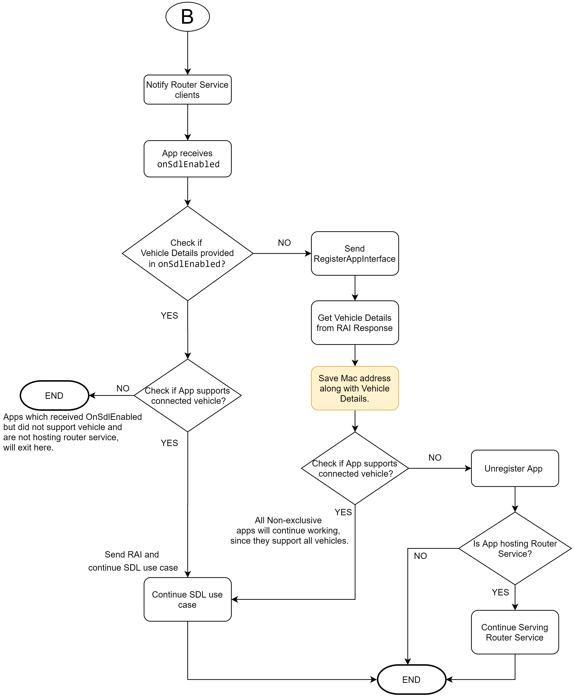

# Enable OEM exclusive apps support

* Proposal: [SDL-0293](0293-vehicle-type-filter.md)
* Author: [Ashwin Karemore](https://github.com/ashwink11)
* Status: **Returned for Revisions**
* Impacted Platforms: [Core / iOS / Java Suite / Protocol / JavaScript Suite]

## Introduction

This feature will enable SDL adopters to provide exclusive apps to their users depending on vehicle type. The proposal describes a way to share vehicle type information before sending the Register App Interface request.

## Motivation

The proposal tries to mitigate the below issues.

### Handling Proprietary app registrations

In the current implementation of SDL, vehicle information is shared with the `RegisterAppInterface` response. If there are any apps that work with specific OEMs, they would need to send the `RegisterAppInterface` RPC to know vehicle details. If the vehicle details do not match the supported vehicle types, they would need to send an `UnregisterAppInterface` request RPC. This behavior would cause an app to be shown on an SDL enabled system for some time until the app unregisters itself from the IVI system. The users would see that apps were shown in the IVI system for a moment, but are removed within seconds. By providing vehicle type information before app registration, we could solve this issue. The app will not register on the IVI if vehicle type is not supported, allowing app partners and SDL adopters to provide an exclusive apps experience to their users depending on vehicle type information. 

### App name shown on notifications in Android

The exclusive apps should not host Android Router Service on unsupported SDL systems. The Android system requires all apps using foreground services to show a notification. An SDL enabled Android app can potentially have two foreground services. The Android Router Service is started by the Android app library and another foreground service will be started by an SDL enabled app. The App starting Android Router service will show two notifications to users. Only a single app will have two notifications, which is by design. Therefore, the more apps, the less likely the app will be required to display two notifications.

The Android Router Service has no information on what head unit it is connecting to when a transport connection is made. Other SDL apps bind to available router service and use this connection. This behavior could lead to cases where a proprietary app creates an Android Router Service when connected to an unsupported SDL enabled system. This started service will need to show a foreground notification with the app name, giving the user the impression that the proprietary app is working with an unsupported SDL enabled system.

For example, if a proprietary app of an OEM creates a router service and the mobile device is connected to another OEM's SDL enabled IVI system, the user would perceive that the proprietary app is doing something in the background when connected to an SDL enabled IVI system from another OEM.

Please reference the below screenshots.

- Notification 1: Created by OEM App.
- Notification 2: Created by SDL Android SDK for Android Router Service.

__Note the app name being shown in both notifications. In the below picture, the `SDL App` is using the “Android Router Service” created by the `OEM App`.__


The only way to remove the router service notification from an OEM App when it connects to another vehicle is to force close. In this case, other apps connected through the OEM App's router service will also get disconnected. This is not a recommended approach. The OEM app can unregister itself from the SDL enabled IVI system. However, the Android Router Service from the OEM App will keep running. 

Please reference the below screenshot. The Android Router Service is hosted by the OEM app, the `Notification 2` with the app name will be shown to the user, giving the impression that the `OEM App` is still working. If the OEM App starts showing notifications when connected to another OEM's vehicle, this would confuse users. They would probably think that `OEM App` on their mobile device is working with another OEM's SDL enabled IVI system. This proposal will define ways to mitigate this issue.


This proposal tries to address the router service notification issue by defining the vehicle type filter. So, we could have an app that could specifically connect to certain vehicles. For example, an app that is designed only for Mustang vehicles.

## Proposed solution

The proposed solution is to share vehicle type information with the SDL application before sending the `RegisterAppInterface` RPC. This method will require the protocol layer change. The vehicle type information can be shared using `StartServiceACK` protocol message. On receiving vehicle type info, the app can determine if it's connected to supported SDL system or not. If the vehicle type is unsupported, the app will not register on SDL enabled IVI system. The below sections will describe additional information exchange in the protocol layer and changes in the Java Suite and iOS app libraries. 



### Protocol Layer Changes

The IVI can share vehicle type information along with `StartServiceACK`. The vehicle type info will be shared as BSON payload as described below.

#### IVI sends vehicle type info

If the IVI can share vehicle type info, it will send the `StartServiceACK` protocol message with vehicle type details.
The BSON payload of this message will have the following info.

| Tag Name| Type | Description |
|------------|------|-------------|
|make|String| Vehicle make |
|model|String| Vehicle model |
|model year|String| Vehicle model year |
|trim|String| Vehicle trim |
|systemSoftwareVersion|String| Vehicle system software version |
|systemHardwareVersion|String| Vehicle system hardware version |

### Android App Library Changes

The Android proxy will need to implement the above protocol changes. In addition to implementing a protocol message, the proxy will need the additional implementation to propagate vehicle type info to the application layer.

#### Defining resource file for supported vehicle type

1. The mobile apps can define an XML for supported vehicles in resources of the project. The XML resource file can be called as `supported_vehicle_type.xml`.
2. The structure of the resource file can be as follows.

```xml
<?xml version="1.0" encoding="utf-8"?>
<resource>
    <vehicle-type
        make="Ford"
        model="Mustang"
        modelYear="2019"
        trim="GT"/>
</resource>
```
3. If an app defines a `vehicle-type` element, then it should always have a `make` attribute, all other attributes are optional. However, if the app developers want to use `model year` or `trim`, they should define `make` and `model` attributes as well. The proxy will check only the defined attributes. The below example shows a valid vehicle type resource file.

```xml
<?xml version="1.0" encoding="utf-8"?>
<resource>
<!-- Vehicle filter for vehicle make-->
    <vehicle-type
        make="Ford"/>
</resource>
```

```xml
<?xml version="1.0" encoding="utf-8"?>
<resource>
<!-- Vehicle filter for vehicle make and model-->
    <vehicle-type
        make="Ford"
        model="Mustang"/>
</resource>
```
```xml
<?xml version="1.0" encoding="utf-8"?>
<resource>
<!-- Vehicle filter for vehicle make, model and model year-->
    <vehicle-type
        make="Ford"
        model="Mustang"
        modelYear="2019"/>
</resource>
```
```xml
<?xml version="1.0" encoding="utf-8"?>
<resource>
<!-- Vehicle filter for vehicle make, model and trim-->
    <vehicle-type
        make="Ford"
        model="Mustang"
        trim="GT"/>
</resource>
```
```xml
<?xml version="1.0" encoding="utf-8"?>
<resource>
<!-- Vehicle filter for vehicle make-->
    <vehicle-type
        make="Ford"/>
    <vehicle-type
        make="OEM1"/>
    <vehicle-type
        make="OEM2"/>
</resource>
```
4. If the supported vehicle type list is not defined, the proxy can start Android Router Service for all SDL enabled IVI system.

#### Metadata for Android Router Service

1. This resource file needs to be referenced in the manifest file of the project as `metadata` for Android Router Service.
2. When the app library receives `StartServiceACK` with vehicle type details, it will check if the vehicle type information is defined in the provided supported vehicle type list.
3. If the vehicle filter is not defined, the app library can skip the check. In this case, the Android Router Service is supported for all SDL enabled systems.

#### Flowcharts and sample code

1. In the current implementation, all SDL apps need to start version negotiations and register themselves on the SDL enabled system. This proposal recommends starting the RPC service by the SDL Device Listener to get vehicle type information from an SDL enabled IVI system before notifying clients about an SDL connection.
2. The app library determines the appropriate router service to deploy based on vehicle type information received in the `StartServiceACK` protocol message. The app library will check the metadata of the supported vehicle type list to determine the router service to deploy. The deployed router service will also receive vehicle type information. Once the Android Router Service is started, it will notify the client and provide vehicle type information. 
3. It is necessary to check support for the `StartServiceACK` protocol message and vehicle type info before notifying the client with SDL enabled callback. If clients are informed before checking the mentioned info, the exclusive apps could end up registering on an unintended SDL enabled IVI system. 
4. If the `StartServiceACK` message does not have vehicle type info or the protocol version is less than that supporting the vehicle type info and if there are multiple SDL apps available on the user's device, the exclusive apps will not host the router service.
5. If the `StartServiceACK` message does not have vehicle type info or the protocol version is less than that supporting the vehicle type info and if all SDL apps available on the user's device are exclusive apps, the exclusive apps, in this case, will rely on vehicle type info received in the `RegisterAppInterface` response. In such a case, if vehicle type is not supported, the exclusive apps will be allowed to unregister apps from the SDL system and stop the Android Router Service. The exclusive app will be only allowed to stop the Android Router Service that it hosts.

The below flow is modified from the [SDL 0301 proposal](https://github.com/smartdevicelink/sdl_evolution/blob/master/proposals/0301-SDL-device-listener.md). Starting Section A and Section C, we would like to extend the scope of SDL Listener.



In the below flow chart, SDL Listener will check vehicle type info for the connected vehicle. After detecting successful BT connection, the SDL Listener will send `Start Service for RPC`, to know vehicle type info. The SDL Listener will then end the RPC session and close BT socket connection. If vehicle info is available in `StartServiceACK`, the SDL Device Listener should save this info and use it to decide the host of the router service on subsequent connections.



On finding the vehicle info, SDL Listener should find the appropriate app to start the router service. The vehicle filter of an app will be available in the metadata of router service in manifest file. The SDL listener will find the supported app using the metadata.



The below flow chart shows the application receiving `onSDLEnabled`. The vehicle details will be shared with apps using intent extra.



The below code is for reference. PM can decide on the implementation details of this proposal. 

Implementation in SDL Device Listener class below.

```java
    private static class TransportHandler extends Handler {
        .
        .
        public void sendStartService(){
            SdlDeviceListener sdlListener = this.provider.get();
            byte[] serviceProbe = SdlPacketFactory.createStartSession(SessionType.RPC, 0x00, (byte)1, (byte)0x00, false).constructPacket();
            if(sdlListener.bluetoothTransport !=null && sdlListener.bluetoothTransport.getState() == MultiplexBluetoothTransport.STATE_CONNECTED) {
                sdlListener.bluetoothTransport.write(serviceProbe, 0,serviceProbe.length);
            }
        }


        public void onPacketRead(SdlPacket packet){
            SdlDeviceListener sdlListener = this.provider.get();
            VehicleType vehicleType = null;
            if (packet.getVersion() >=  6 && packet.getFrameInfo() == SdlPacket.FRAME_INFO_START_SERVICE_ACK) {
                //parse vehicle Type info from connected system
                vehicleType = getVehicleType(packet.getPayload());
            }

            byte[] stopService = SdlPacketFactory.createEndSession(SessionType.RPC, (byte)packet.getSessionId(), 0, (byte)packet.getVersion(), hashId).constructPacket();
            if(sdlListener.bluetoothTransport !=null && sdlListener.bluetoothTransport.getState() == MultiplexBluetoothTransport.STATE_CONNECTED) {
                sdlListener.bluetoothTransport.write(stopService, 0,stopService.length);
            }

            notifyConnection(vehicleType);
        }

        private VehicleType getVehicleType(byte[] payload) {
            //Parse Vehicle details received in StartService ACK protocol message and return Vehicle Type object.
        }

        public void notifyConnection(VehicleType vehicleType){
            SdlDeviceListener sdlListener = this.provider.get();
            sdlListener.setSDLConnectedStatus(sdlListener.contextWeakReference.get(), sdlListener.connectedDevice.getAddress(), true);
            boolean keepConnectionOpen = sdlListener.callback.onTransportConnected(sdlListener.contextWeakReference.get(), sdlListener.connectedDevice,vehicleType);
            if (!keepConnectionOpen) {
                sdlListener.bluetoothTransport.stop();
                sdlListener.bluetoothTransport = null;
                sdlListener.timeoutHandler.removeCallbacks(sdlListener.timeoutRunner);
            }
        }

        @Override
        public void handleMessage(@NonNull Message msg) {
            if (this.provider.get() == null) {
                return;
            }
            SdlDeviceListener sdlListener = this.provider.get();
            switch (msg.what) {
                case SdlRouterService.MESSAGE_STATE_CHANGE:
                    switch (msg.arg1) {
                        case MultiplexBaseTransport.STATE_CONNECTED:
                            //Send StartService RPC to get Vehicle Type Info.
                            sendStartService();
                            break;
                        case MultiplexBaseTransport.STATE_NONE:
                            // We've just lost the connection
                            sdlListener.callback.onTransportDisconnected(sdlListener.connectedDevice);
                            break;
                        case MultiplexBaseTransport.STATE_ERROR:
                            sdlListener.callback.onTransportError(sdlListener.connectedDevice);
                            break;
                    }
                    break;

                case com.smartdevicelink.transport.SdlRouterService.MESSAGE_READ:
                    onPacketRead((SdlPacket) msg.obj);
                    break;
            }
        }
    }
```

Changes in TransportConstants

```java
public class TransportConstants {
	public static final String CONNECTED_VEHICLE_INFO                                   = "connected_vehicle_info_for_router_service";
	public static final String START_ROUTER_SERVICE_SDL_ENABLED_CONNECTED_VEHICLE_INFO  = "connected_vehicle_info";
    .
    .
    .
}
```

Changes in SdlBroadcastReceiver 

```java
	private static SdlDeviceListener getSdlDeviceListener(Context context, BluetoothDevice bluetoothDevice){

		synchronized (DEVICE_LISTENER_LOCK){
			if (sdlDeviceListener == null){
				sdlDeviceListener = new SdlDeviceListener(context, bluetoothDevice, new SdlDeviceListener.Callback() {
                    /*Receive vehicle type info in OnTransportConnected callback from SDLDeviceListener. Use Vehicle Type info received here to find supported app.*/
					@Override
					public boolean onTransportConnected(Context context, BluetoothDevice bluetoothDevice, VehicleType vehicleType) {
						synchronized (DEVICE_LISTENER_LOCK){
							sdlDeviceListener = null;
							if(context != null) {
                                /* Use vehicle Type object to find supported app*/
								final List<SdlAppInfo> sdlAppInfoList = AndroidTools.querySdlAppInfo(context, new SdlAppInfo.BestRouterComparator(),vehicleType);
								if(sdlAppInfoList != null && !sdlAppInfoList.isEmpty()) {
									ComponentName routerService = sdlAppInfoList.get(0).getRouterServiceComponentName();
                                    /*Pass vehicle type object to start router service.*/
									startRouterService(context, routerService, false, bluetoothDevice, true,vehicleType);
								}
							}
						}

						return false;
					}
            .
            .
            .
		}

		return sdlDeviceListener;
	}

    	private static void startRouterService(Context context, ComponentName componentName, boolean altTransportWake, BluetoothDevice device, boolean confirmedDevice, VehicleType vehicleType) {
        .
        .
        .
		Intent serviceIntent = new Intent();
		serviceIntent.setComponent(componentName);
		if(null != vehicleType){
			serviceIntent.putExtra(TransportConstants.CONNECTED_VEHICLE_INFO, vehicleType);
		}
        .
        .
        .
	}
```

Changes in SDL Router Service class
```java
public void onTransportConnected(final TransportRecord record){
        .
        .
        .
		Intent startService = new Intent();  
		startService.setAction(TransportConstants.START_ROUTER_SERVICE_ACTION);

        startService.putExtra(TransportConstants.START_ROUTER_SERVICE_SDL_ENABLED_CONNECTED_VEHICLE_INFO , vehicleType);
        .
        .
        AndroidTools.sendExplicitBroadcast(getApplicationContext(),startService, null);
}
```

Example usage: vehicle type check in Application Broadcast Receiver.

```java
public class SdlReceiver  extends SdlBroadcastReceiver {
	@Override
	public void onSdlEnabled(Context context, Intent intent) {
		if(IsVehicleTypeSupported(intent)){
            .
            .
            .
		}
	}

	private boolean IsVehicleTypeSupported(Intent intent) {
		if(intent.hasExtra(TransportConstants.START_ROUTER_SERVICE_SDL_ENABLED_CONNECTED_VEHICLE_INFO))
		{
			VehicleType vehicleType = intent.getParcelableExtra(TransportConstants.START_ROUTER_SERVICE_SDL_ENABLED_CONNECTED_VEHICLE_INFO);
			/* Return true if vehicle is supported, else false*/
		}
		return false;
	}
    .
    .
    .
}
```

### iOS App Library Changes

The iOS proxy will need to implement the above-mentioned protocol changes. In addition to implementing a protocol message, the proxy will need the additional implementation to propagate vehicle type info to the application layer.


#### Defining supported vehicle type in Info.plist

1. The supported vehicle list can be defined in Info.plist as below. All the attributes in this list are optional, however, if the app includes `SDLSupportedVehicleTypes` in Info.plist, at least one array element with one key-value in the dictionary should be defined.
2. If an app defines an `SDLSupportedVehicleTypes` key, then it should always have a `make` key-value pair in the dictionary. All other attributes are optional if `make` is defined. However, if the app developers want to use `model year` or `trim`, they should define `make` and `model` key-value pairs as well. The proxy will check only the defined attributes.
The below example shows valid vehicle type filters.

```xml
<key>SDLSupportedVehicleTypes</key>
    <array>
        <dict>
            <key>make</key>
            <string>Ford</string>
            <key>model</key>
            <string>Mustang</string>
            <key>modelYear</key>
            <string>2019</string>
            <key>trim</key>
            <string>GT</string>
        </dict>
        <dict>
            <key>make</key>
            <string>OEM1</string>
            <key>model</key>
            <string>OEM model</string>
            <key>modelYear</key>
            <string>2019</string>
            <key>trim</key>
            <string>trim info</string>
        </dict>
    </array>
```
```xml
<key>SDLSupportedVehicleTypes</key>
    <array>
        <dict>
            <key>make</key>
            <string>Ford</string>
            <key>model</key>
            <string>Mustang</string>
        </dict>
    </array>
```
```xml
<key>SDLSupportedVehicleTypes</key>
    <array>
        <dict>
            <key>make</key>
            <string>Ford</string>
            <key>model</key>
            <string>Mustang</string>
            <key>modelYear</key>
            <string>2019</string>
        </dict>
        <dict>
            <key>make</key>
            <string>OEM1</string>
            <key>model</key>
            <string>OEM model</string>
            <key>modelYear</key>
            <string>2019</string>
        </dict>
    </array>
```

```xml
<key>SDLSupportedVehicleTypes</key>
    <array>
        <dict>
            <key>make</key>
            <string>Ford</string>
            <key>model</key>
            <string>Mustang</string>
            <key>trim</key>
            <string>GT</string>
        </dict>
        <dict>
            <key>make</key>
            <string>OEM1</string>
            <key>model</key>
            <string>OEM model</string>
            <key>trim</key>
            <string>trim info</string>
        </dict>
    </array>
```
```xml
<key>SDLSupportedVehicleTypes</key>
    <array>
        <dict>
            <key>make</key>
            <string>Ford</string>
        </dict>
        <dict>
            <key>make</key>
            <string>OEM1</string>
        </dict>
    </array>
```
#### Determining Vehicle Type Info

1. The app library will receive vehicle type info in `StartServiceAck` protocol message. 
2. On receiving vehicle type information, the app library will check `SDLSupportedVehicleTypes` keys to check supported vehicle types.
3. If the vehicle type is supported, the app library should also notify the app about the connected vehicle type so that the app can configure SDL as required. 
4. If the app library determines that connected vehicle type is not supported, the app library will end the RPC session. The application will not register on the SDL enabled IVI system.
5. If the vehicle type information is not available in `StartServiceAck` protocol message or the protocol version is less than that supporting the vehicle type info, the SDL app library will continue with the app registration and it will rely on vehicle type information received in the `RegisterAppInterface` response. If vehicle type is not supported, the exclusive apps will be allowed to unregister from the SDL enabled system.

## Potential downsides

The SDL Device Listener after transport connection needs to start the RPC service. If the SDL Device Listener does not start the RPC service and relies on the client for vehicle type details, the connected client would start another foreground service. This would force the connected app to show two notifications to users while determining vehicle type information and would need to terminate services if the app does not support the SDL enabled IVI system. 

## Impact on existing code

Above mentioned changes need to be implemented in SDL Core, the Java Suite app library, and the iOS app library.

## Alternatives considered

### Using RPC instead of Protocol message to share vehicle type info
1. As per the current implementation, the RAI is the first RPC sent to an SDL enabled IVI system, and the vehicle type information is available to the app in its response. 
2. To know vehicle type details before the RAI, we have to introduce new RPC `GetVehicleType` to receive the vehicle type info. The app will have to send `GetVehicleType` before RAI since the app needs to know vehicle type info before the app registration on IVI.
3. Since the RPC message version is sent to the app in the `RAI response`, the app would not know if the `GetVehicleType` RPC is supported or not.
4. If `GetVehicleType` is an RPC and it's sent first, the app would need to depend on a timeout to know the support for the `GetVehicleType` RPC when connected to an older SDL enabled IVI system. This behavior would add delays in app registration on the SDL system.
5. If `GetVehicleType` is an RPC, the exclusive apps could potentially show two notifications described above for Android apps before terminating them. Terminating a router service hosted by exclusive apps will unregister all apps using it.

### Soft-Registrations of an App
1. The app sends the RAI Request and receives its Response.
2. The HMI does not register the app until the app completes its validation.
3. Upon completing validation, the app sends some indication for a hard app registration. The app will be shown on the SDL enabled IVI system. The type of notification sent to the SDL enabled IVI system needs to be defined.
4. This solution would solve the proprietary app registrations. In this case, as well, the exclusive apps could potentially show two notifications described above for Android apps before terminating them. Terminating a router service hosted by exclusive apps will unregister all apps using it.

### Creating generic SDL app to create Android Router Service

1. The user will need to download an additional app for the SDL connection.
2. This would affect App discoverability, as the users would potentially never know about such app and never find apps in an SDL enabled system. 

### App sending list of supported vehicle types in `RegisterAppInterface`

1. This solution would solve the proprietary app registrations.
2. The HMI does not register the app until the app completes its validation.
3. The exclusive apps could potentially show two notifications described above for Android apps before terminating them. 
4. If the vehicle type is not supported and the app needs to deploy another router service it would not know the supported Android Router Service for the SDL system.
5. In this case, as well, the exclusive apps could potentially show two notifications described above for Android apps before terminating them. Terminating a router service hosted by exclusive apps will unregister all apps using it.
