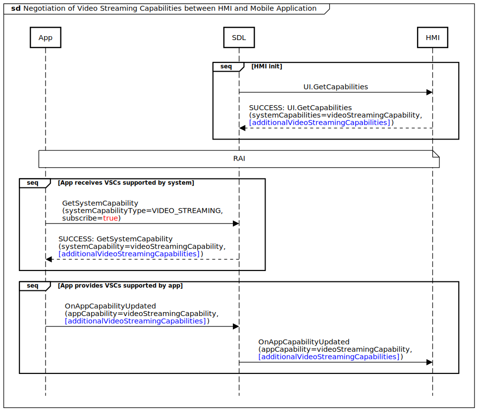
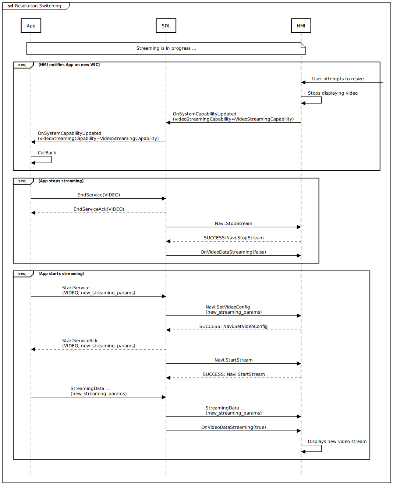

# Possibility to update video streaming capabilities during ignition cycle

* Proposal: [SDL-0296](0296-Update-video-streaming-capabilities-during-ignition-cycle.md)
* Author: [Dmytro Boltovskyi](https://github.com/dboltovskyi)
* Status: **In Review**
* Impacted Platforms: [Core / iOS / Java Suite]

## Introduction

The main purpose of this proposal is to make it possible to update video streaming capabilities (VSC) during the ignition cycle.

## Motivation

Currently there are numerous VSC parameters may be provided by HMI through SDL to Mobile application.
These may also include the ones described in [Pixel density and Scale](https://github.com/smartdevicelink/sdl_evolution/blob/master/proposals/0179-pixel-density-and-scale.md) proposal.
These parameters may be used by Projection or Navigation mobile application to properly adjust video streaming data.
Unfortunately, once these parameters defined during HMI initialization process, they can't be updated until the next ignition cycle.

This won't allow to implement use cases related to dynamic resolution switching, such as:
 - Picture-in-Picture
 - Preview
 - Split screen
 - Collapsed view

The idea of the proposal is to add such possibility into SDL ecosystem. Also offered solution would allow to adjust size of UI elements depends on a current screen mode.

## Proposed solution

### SDL Core changes

#### Negotiation of VSCs

Available and supported VSCs needs to be negotiated between HMI and Mobile application.

1. HMI provides list of supported by system VSCs within new `additionalVideoStreamingCapabilities` parameter of `VideoStreamingCapability` struct in `UI.GetCapabilities` response:

```xml
<struct name="VideoStreamingCapability" since="4.5">
    <!-- Existing params -->
    <param name="additionalVideoStreamingCapabilities" type="VideoStreamingCapability" array="true" minvalue="1" maxvalue="100" mandatory="false" since="X.X">
    </param>
</struct>
```

2. Mobile application obtains these VSCs through `GetSystemCapability` request of `VIDEO_STREAMING` type.
Within this request mobile application (SDL library) can also subscribe to receive future VSC updates.

3. Mobile application provides supported by application VSCs within new `OnAppCapabilityUpdated` notification.

```xml
<function name="OnAppCapabilityUpdated" functionID="OnAppCapabilityUpdatedID" messagetype="notification" since="x.x">
    <description>A notification to inform SDL Core that a specific app capability has changed.</description>
    <param name="appCapability" type="AppCapability" mandatory="true">
        <description>The app capability that has been updated</description>
    </param>
</function>

<struct name="AppCapability" since="x.x">
    <param name="appCapabilityType" type="AppCapabilityType" mandatory="true">
        <description>Used as a descriptor of what data to expect in this struct. The corresponding param to this enum should be included and the only other param included.</description>
    </param>
    <param name="videoStreamingCapability" type="VideoStreamingCapability" mandatory="false">
        <description>Describes supported capabilities for video streaming </description>
    </param>
</struct>

<enum name="AppCapabilityType" since="x.x">
    <description>Enumerations of all available app capability types</description>
    <element name="VIDEO_STREAMING"/>
</enum>

<struct name="VideoStreamingCapability" since="4.5">
    <!-- Existing params -->
    <param name="additionalVideoStreamingCapabilities" type="VideoStreamingCapability" array="true" minvalue="1" maxvalue="100" mandatory="false" since="X.X">
    </param>
</struct>
```

Details on how mobile application selects supported VSCs described in [Mobile libraries changes](0296-Update-video-streaming-capabilities-during-ignition-cycle.md#mobile-libraries-changes-ios-and-android) section.

4. These VSCs transfered by SDL to HMI within the same new notification.



#### Resolution Switching

In order to notify Mobile application on current VSC HMI may use existing `OnSystemCapabilityUpdated` notification of `VIDEO_STREAMING` type.

Mobile application will receive such updates if it has been subscribed to them previously.

There are no changes expected on a protocol level. Just existing service Stop/Start sequences would be utilized.



### Mobile libraries changes (iOS and Android)

#### Negotiation of VSCs

Mobile application (SDL library) has to provide back to HMI filtered list of supported VSCs based on the complete list provided by HMI.

In order to simplify this mechanism for application developers there is an idea to add VSC constraints into Public API.

To generalize both Android and iOS platforms these are public methods (or properties) that need to be implemented by application developer:
 - min/max `aspectRatio`
 - min/max `resolution`
 - min `diagonalScreenSize`

While `diagonalScreenSize` is mandatory, `aspectRatio` and `resolution` are optional. Combining `diagonalScreenSize` with `aspectRatio` or `resolution` the flow of choosing supported VSCs would look in next way:
1. Start iterating through all VSCs provided by HMI
2. If `diagonalScreenSize` provided by HMI is less than developer's constraint, skip this VSC and go to next iteration, otherwise check `aspectRatio` constraint
3. If `aspectRatio` suits constraint provided - add this VSC to supported VCS list, otherwise check `resolution` constraint
4. If `resolution` suits constraint provided - add this VSC to supported VSC list, otherwise go to next iteration

***Examples:***

**iOS**

In `SDLStreamingMediaConfiguration`:

```objectivec
@property (strong, nonatomic, nullable) SDLSupportedStreamingRange *supportedLandscapeStreamingRange;
@property (strong, nonatomic, nullable) SDLSupportedStreamingRange *supportedPortraitStreamingRange;

@interface SDLSupportedStreamingRange : NSObject
// The minimum supported normalized aspect ratio, Min value is 1. (0 matches any ratio)
@property (nonatomic, assign) float minimumAspectRatio;
// The maximum supported normalized aspect ratio, Min value is 1. (0 matches any ratio)
@property (nonatomic, assign) float maximumAspectRatio;
// The minimum supported diagonal screen size in inches, defaults to 0 (0 matches any size)
@property (nonatomic, assign) float minimumDiagonal;
// The minimum resolution to support
@property (nonatomic, assign, nullable) SDLImageResolution *minimumResolution;
// The maximum resolution to support
@property (nonatomic, assign, nullable) SDLImageResolution *maximumResolution;
// Check if the argument is within the [.minimumResolution, .maximumResolution] range
- (BOOL)isImageResolutionInRange:(SDLImageResolution*)imageResolution;
// Check if the argument is within the [.minimumAspectRatio, .maximumAspectRatio] range
- (BOOL)isAspectRatioInRange:(float)aspectRatio;
<……>
@end
```

**Android**

In `VideoStreamManager` add new `startRemoteDisplayStream`:

```java
public void startRemoteDisplayStream(Context context, Class<? extends SdlRemoteDisplay> remoteDisplayClass,
    VideoStreamingParameters parameters, final boolean encrypted, SupportedStreamingRange streamingRange)
```

In this way, developers will be able to pass constraints related to specific application directly into `SDLManager`
where `SupportedStreamingRange`:

```java
public class SupportedStreamingRange {
    private Resolution minSupportedResolution;
    private Resolution maxSupportedResolution;
    private Double maxScreenDiagonal;
    private AspectRatio aspectRatio;
}
```
In `SdlRemoteDisplay` implementation by mobile application developers:

Later, when alternative supported resolutions are retrieved from `HMI`, `SupportedStreamingRange` will be used to unpack data:

```java
private List<VideoStreamingCapability> getSupportedCapabilities(
    Resolution minResolution,
    Resolution maxResolution,
    Double constraintDiagonalMax,
    AspectRatio ratioRange
)
```

#### Resolution Switching

Mobile applications should be able to update the streaming content window to the new VSCs received in `OnSystemCapabilityUpdated`.

In order to do this application developers would be notified with a callback `onViewResized(width, height)/videoStreamingSizeDidUpdate:(CGSize)displaySize`. It would be called once new data on resolution is retrieved from HMI and internal process in library of proper component change is finished. This callback is passed to implemented by developers classes responsible for markup, where UI reorganization could be handled.

SDL Manager wouldn't check and validate the VSC HMI sends to app to switch to.

### HMI Guidelines

HMI guidelines would need to include the following recommendations how various screen modes have to be handled.

If the change is a PIP-type change, scale the current video stream to the size you desire without going through this flow. Touches should never be passed to the app. Either a system menu/buttons should be displayed when selected, or the selection should bring the user immediately back to the full-screen app.

If the change is a split-screen type change (and cannot be handled by scaling the original video), then go through this flow. If the app does not support your custom split-resolution, either don't allow the user to put the app in split screen, or scale the video stream to a size that fits the window and use "black bars" to fill the rest of the window. Touches may be passed to the app in certain limited cases.

 * The window must have a width of at least 3" and a height of at least 3".

 * The touches must be offset for the developer so that 0,0 continues to be in the top-left corner of the app window. If these requirements are not met, either a system menu / buttons should be displayed when selected, or the selection should bring the user immediately back to the full-screen app.

### Old applications behavior

In case if a particular application doesn't support this feature at all it wouldn't send `OnAppCapabilityUpdated` notification to SDL.
Hence HMI would treat this application as the one which doesn't support dynamic resolution switching and would allow only full-screen mode for it.

Nevertheless [alternatives solution](0296-Update-video-streaming-capabilities-during-ignition-cycle.md#alternatives-considered) may be implemented on HMI to handle such applications.

## Potential downsides

The author was unable to identify any potential downsides.

## Impact on existing code

* SDL core needs to be updated to support described logic and new APIs.
* Java Suite and iOS proxy libraries would require updates related to dynamic resolution switching and new APIs.
* HMI needs to be updated to handle only supported VSCs received from Mobile application.

## Alternatives considered

Implement scaling of video frame completely at HMI. This approach has the following drawbacks:
  - aspect ratio remains the same
  - size of the touchable UI elements cannot be adjusted for a small resolutions and hence the elements become hard to use
