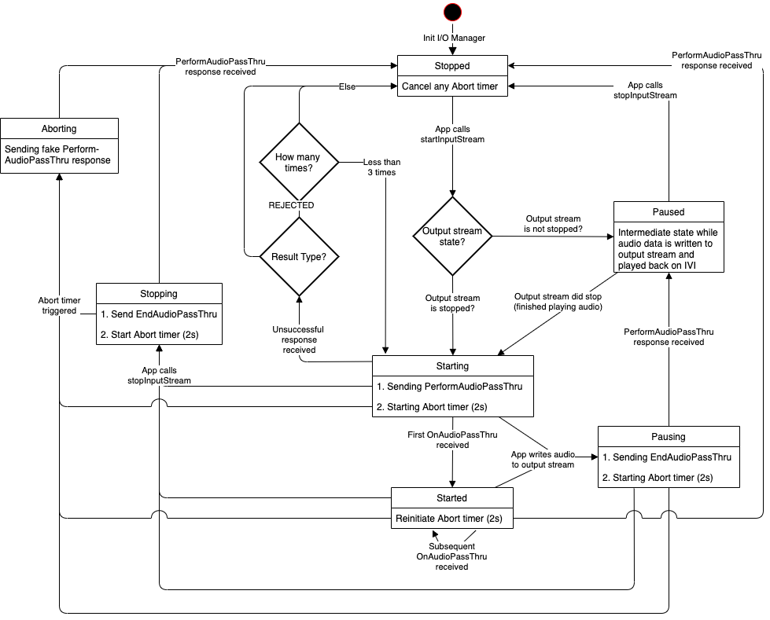
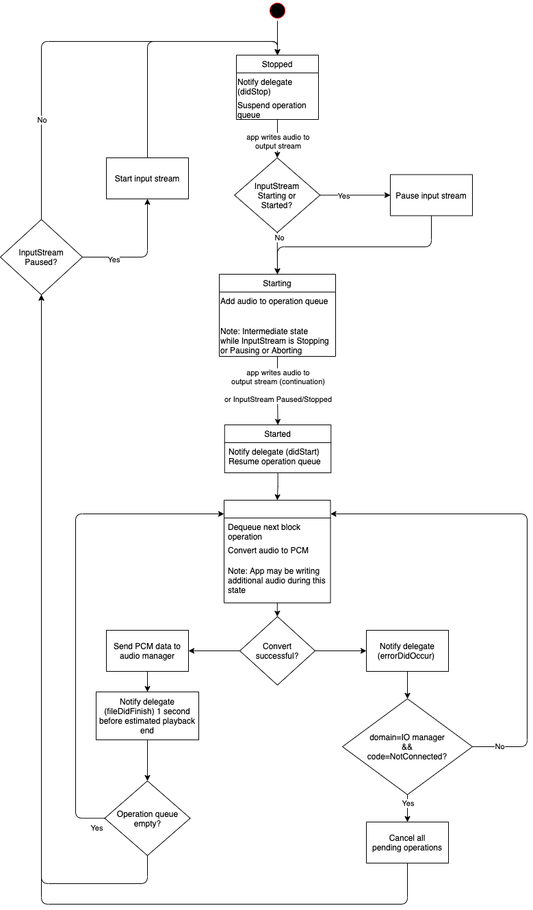

# SDL Audio I/O Manager

* Proposal: [SDL-0303](0303-audio-io-manager.md)
* Author: [Kujtim Shala](https://github.com/kshala-ford)
* Status: **Returned for Revisions**
* Impacted Platforms: [ iOS ]

## Introduction

This proposal is about integrating a new manager to the sdl_ios library that allows reading audio data from the car microphone and sending audio to the car speaker.

## Motivation

For mobile navigation apps, supporting voice-based address search while driving is an important feature. In the effort to support SDL partners, Ford worked together with a nav app partner to develop a feature for audio input and output. The goal was to use `AudioPassThru` RPCs to receive audio from the car microphone and to use the audio service from the SDL protocol specification to play audio.

SDL does not include requirements to head units to support `PerformAudioPassThru` and audio services to run at the same time. It's not possible to expect or have a guarantee that all SDL enabled head units support both at the same time. Furthermore, the current SDL libraries don't prevent an app from executing both. Therefore receiving audio data with `PerformAudioPassThru` and sending audio data with the audio Service must be synchronized.

The feature was originally located in the app as it was a joint development specifically for the app. Due to the substantial use of SDL it required quite some experience with SDL to maintain this code. Moving forward the partner requested to maintain it externally. The feature was refactored as an SDL manager and should now be part of the open source sdl_ios repository. 

## Proposed solution

As described in the motivation, the existing audio input and output feature is implemented in an SDL manager called `SDLAudioIOManager`. The goal is to add this manager to the sdl_ios repository and be part of the official library. Sources are attached to this proposal:

- [SDLAudioIOManager.h](../assets/proposals/0303-audio-io-manager/SDLAudioIOManager.h)
- [SDLAudioIOManager.m](../assets/proposals/0303-audio-io-manager/SDLAudioIOManager.m)
- [SDLAudioIOManagerDelegate.h](../assets/proposals/0303-audio-io-manager/SDLAudioIOManagerDelegate.h)

The manager requires a delegate that the app needs to implement. Delegate calls are notifications to the app to inform if an input or output stream has started or stopped and also which file was played. Audio data received from the input stream is forwarded to the app through the delegate. More details are listed below.

### State machine

The manager handles the input and the output stream in different states. Both streams can be `Stopped`, `Starting` and `Started`. In addition the input stream can be `Stopping` (as waiting for RPC responses), `Pausing` and `Paused`. The paused state will be described in detail in the next section. It is important to understand that certain stream state combinations must not occur. For instance, The output stream must not be started while the input stream is not stopped. The challenging part is to be robust against application calls during a state change or delegate call. Robustness can be achieved by serializing state transitions with public method calls.

### Audio Input Stream

The manager provides APIs for an input stream using `PerformAudioPassThru`. The developer can specify two properties for the initial prompt and the text that should be used when presenting the audio pass thru overlay. Other parameters to `PerformAudioPassThru` are based on audio capabilities provided in the `RegisterAppInterfaceResponse` or preset (audio is always muted, timeout is 100 seconds according to `maxvalue` in MOBILE_API). 

Audio data is received using the request's `audioDataHandler` callback. The first `OnAudioPassThru` notification will notify the app that the input stream has started. The audio data will be processed before forwarding to the app in order to boost the audio volume. This processing is helpful for certain voice recognition engines but also provides audio recording to other apps at a decent volume. 

The algorithm to boost the audio volume is looped through the audio samples per audio chunk and looks for the maximum possible audio volume multiplier without causing clipping. This multiplier is stored for subsequent chunks. If any audio chunk returns with high volume samples (user hammers the microphone) the multiplier will be reduced to guarantee no clipping. Over the next silent chunks the multiplier will be slowly increased again to the maximum value. Theoretically this can be six seconds in the worst case but experience showed that the volume is back to normal within one second. The algorithm is independent for the sampling rate and supports both sampling types 8-Bit (0 to 255 where mute is 128) and 16-Bit (-32,768 to 32,767 where mute is 0). This method is common in basic audio recording and telephony. The related methods are in `sdl_calculateAmplifierFactor:size:` and `sdl_applyAmplifierFactor:data:size:`.

While the app receives amplified audio chunks, the app can choose to end the input stream at any time. By doing so the manager sends `EndAudioPassThru` and waits for `PerformAudioPassThru` to end with a response. This response will notify the app about the audio input stream to be finished with a result code.

While the input stream is active, the app can also send audio files to be played on the output stream. In order to play the file the current audio pass thru has to end before sending the audio. The manager will try to "pause" the input stream by sending `EndAudioPassThru` and wait for the `PerformAudioPassThru` response. Once received the manager sends the audio data. Once the manager has completed sending all files through the audio output stream, the manager will automatically continue the audio input stream by sending a `PerformAudioPassThru` request.

#### Known bug: Missing RPCs from the system

There is a known bug related to the audio input stream and audio pass thru, where RPC processing fails on certain systems. Following problems can happen:
1. HU stops sending `OnAudioPassThru` notifications
2. HU does not respond to `PerformAudioPassThru`
3. HU does not handle `EndAudioPassThru`

Incorrect RPC messaging has severe issues to the operation of the managers. These issues were addressed when found on the head unit. However, some vehicles are still equipped with affected software versions. 

##### Workaround

In order to resolve the issues, an abort timeout must be added that aborts the input stream. This is done by simulating a `PerformAudioPassThru` response with `ABORTED` result code which requires knowledge about the correlation ID upon sending. This is not only necessary to keep the manager running, but also to remove dead RPC operations from the lifecycle manager's operation queue. The lifecycle manager's operation queue is configured for three concurrent tasks. Without this workaround the lifecycle manager can be stuck as it has to operate with only two concurrent tasks. Previous workarounds were able to recover the state machine but didn't remove the operation from the queue. Over time, this leads to an inoperable app if this error happens three times in one session. 

#### Known bug: Input stream resumption is rejected

There is a race condition when the output stream has finished and the input stream should resume. It's not possible to identify the exact moment when the audio output has finished. The HMI priority matrix favors the audio service above audio pass thru. Therefore, when sending `PerformAudioPassThru` too early the HMI will reply with `REJECT`. 

##### Workaround

The manager waits 0.5 seconds after it predicts that the audio output did stop and retries the request two times, also waiting 0.5 seconds if `REJECT` is received again. After three attempts, the manager reverts the state machine to `Stopped` and notifies the app about the error.

### Audio Output Stream

The manager provides APIs to write audio files to the output stream using the audio service session held by the existing streaming audio manager. Before processing the first audio file, the manager notifies the app that the output stream has started. The API is simplified as the requirement is to play audio files always on demand. Any audio file written to the output stream will first be placed in an operation queue but immediately converted to PCM data and sent to the audio service session. 

When adding audio to the output stream while the input stream is active, the input stream must be paused first. Before starting the output stream, the manager ends the input stream and waits. During this time, the operation queue remains suspended and will be resumed as soon as the `PerformAudioPassThru` response is received. The input stream state will then be `Paused`.

Over time, the app can push additional files that will be added to the operation queue. As long as the manager's output stream is started it'll dequeue the audio files no matter what. For each file, the manager reads the estimated playback time and dequeues the next file at the end of the current file. At the end of the last file, the manager notifies the app about the output stream being stopped. Once stopped, the manager checks the input stream state to see if it is `Paused`. In this case, the manager will automatically start the input stream.

Attempts to start the input stream during an active output stream will be held back in state `Starting`. The manager will automatically start the input stream then if the output stream stopped.

#### Known bug: Race condition with empty audio buffer

A race condition was identified on the head unit that occurs during an active output stream of multiple audio files. Previously, the audio stream manager was used to send the audio files by continuing to send audio data at the end of the current audio file. This resulted in an emptying audio input buffer on the head unit side, which was immediately refilled. These short periods of empty audio buffer caused race conditions and blocked the fluent audio output stream.

##### Workaround

This manager includes the audio encoding feature and changes the notification behavior. Starting with the first file, the manager notifies the app one second in advance of the file being played. This is helpful when apps continue sending new files based on previous files being uploaded. This notification in advance is only performed for one file and doesn't add up with multiple files. This means the head unit's input stream won't empty if not intended and remains with at least 32 kB of data.

This workaround is actually a positive feature for the audio output stream as it provides a more fluent audio playback without interruption.

### Replacing `SDLAudioStreamManager`

The current manager `SDLAudioStreamManager` should be deprecated as the new `SDLAudioIOManager` provides the same functionality in addition to synchronizing with Audio pass thru. The only missing feature is to queue audio files before playing `playNextWhenReady`.

## Potential downsides

A new manager replacing an existing manager instead of extending the existing manager is only possible with deprecations. Due to the complexity of the Audio IO manager and the changes to the output stream logic it made sense to separate the code and start a new manager.

## Impact on existing code

The current manager `SDLAudioStreamManager` should be deprecated and the new `SDLAudioIOManager` should be used.

This proposal is not altered to be conform to the accepted proposal 0297 because this would be a revision to this proposal, which is not accepted yet. The accepted proposal 0297 sending audio data in chunks should be considered for the IO manager. This also includes force interrupt removing any other output data in the queue.

## Alternatives considered

The Java Suite was not considered in this proposal because it does not contain an implementation of the Audio IO manager. This does not mean the author doesn't support other libraries. It is necessary to organize resources to work on the manager in advance if the vote is to also add the manager to the Java Suite.

For non-navigation apps this manager could be extended to use `Speak` with audio files to provide an output stream.
