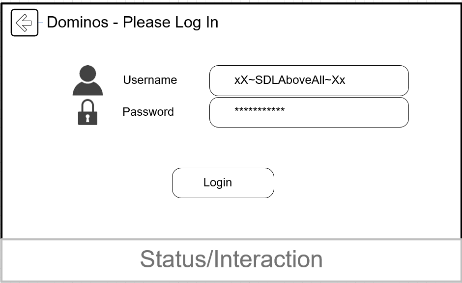
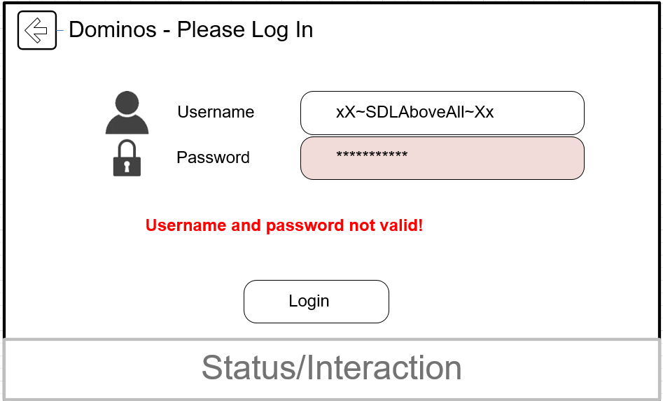
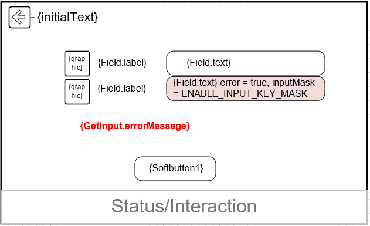
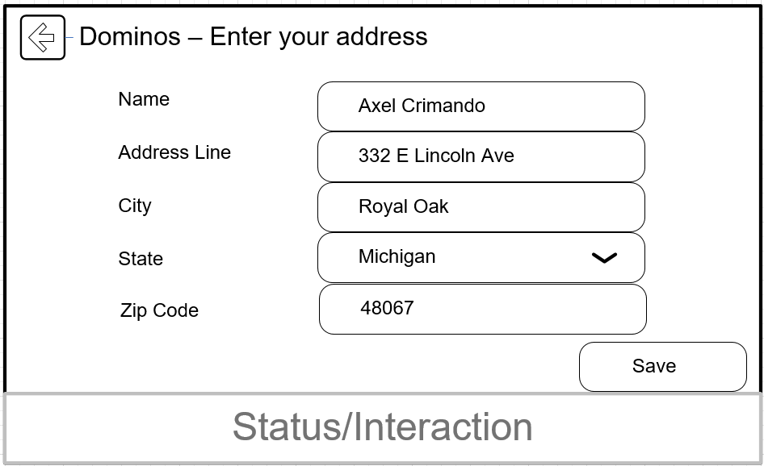
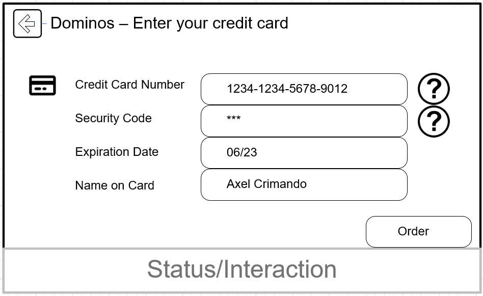
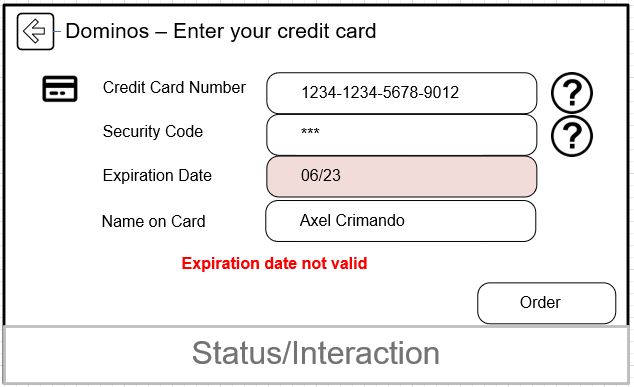
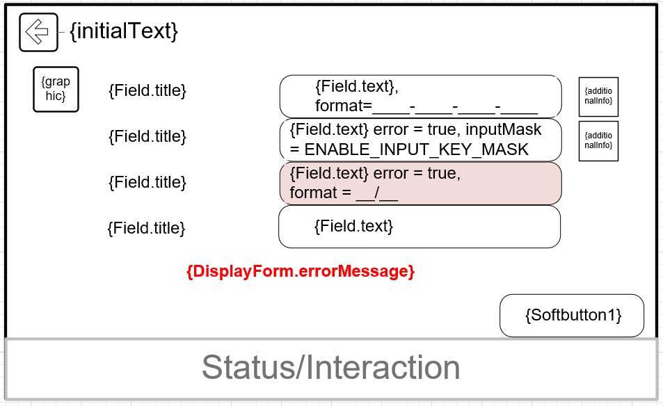

# Get Input Screen

* Proposal: [SDL-0307](0307-GetInputScreen.md)
* Author: [Michael Crimando](https://github.com/MichaelCrimando)
* Status: **In Review**
* Impacted Platforms: [HMI / Core / iOS / Java Suite / JavaScript / RPC]

## Introduction

This proposal adds an Form screen for apps. This enables a way for the user to sign in, put in their credit card information, put in their address and more. This is particularly focused on embedded/cloud apps because the app lives in the car and the user will still need a way to enter information without having the ability to do so on their phone.

## Motivation

With current SDL, apps live on the phone and connect to the car. So, the user can enter information for things like their login, address and credit card information via their phone and then connect the app to their car. With embedded/cloud apps, the app no longer lives in the phone - it lives in the car.  Users will need a way to do all of this functionality still.

Here's an example from an overall plan

 

Here's more specific potential screens

 
 
 
 




## Proposed solution
Add a new RPC for an input screen. This screen would use RPC encryption which is handled by policies.
It contains a title, and an array of `InputLines`


```xml
<function name="DisplayForm" functionID="DisplayFormID" messagetype="request" since="X.X">
  <param name="initialText" type="String" maxlength="500"  mandatory="true">
    <description>
      Text to be displayed first.
    </description>
  </param>
  <param name="errorMessage" maxlength="500" type="String" mandatory="false">
    <description>
      If there's a problem with the input fields, this can be used to display information.
    </description>
  </param>
  <param name="fields" type="Common.Field" array="true" minsize="0" maxsize="100" mandatory="true">\
  </param>
    <param name="softButtons" type="Common.SoftButton" minsize="0" maxsize="8" array="true" mandatory="false">
    <description>
      App defined SoftButtons for cancel, edit, submit, etc.
    </description>
  </param>
</function>
```

Add a new struct called `Field` and an enum called `FieldType` to get user input in the DisplayForm screen.
This enables text input fields, numeric input fields and combo box input fields.  Text and numeric input fields would bring up a keyboard or numpad. Combo box input would bring up a drop down list of items.  
```xml
<struct name="Field">
  <description>
    A single field for data input
  </description>
  <param name="type" type="Common.FieldType" mandatory="true">
  </param>
  <param name="label" maxlength="500" type="String" mandatory="true">
  </param>
  <param name="image" type="Common.Image" mandatory="false">
    <description>
      An image icon for the input field
    </description>
  </param>
  <param name="text" maxlength="500" type="String" mandatory="false">
    <description>
      The text that is already present in the input field
    </description>
  </param>
  <param name="format" maxlength="500" type="String" mandatory="false">
    <description>
      A text string used to format the input text to a certain style. Any characters except underscore will remain in the field with no way to type over them. The underscore character will represent a space that the user can type in.  E.g. A format string for phone number would be +_(___)___-____
    </description>
  </param>
  <param name="additionalInfo" maxlength="500" type="String" mandatory="false">
    <description>
      More information that is shown by the input field
    </description>
  </param>
  <param name="error" type="Boolean" mandatory="false">
    <description>
      If set to true, then the field has some problem with it and the HMI should highlight it in red.
    </description>
  </param>
  <param name="comboBoxChoices" type="String" maxlength="500" array="true" minsize="0" maxsize="200" mandatory="false">
    <description>
      List of choices if the type is COMBO_BOX. Otherwise ignored.
    </description>
  </param>
  <param name="inputMask" type="KeyboardInputMask" mandatory="false">
    <description>
      Used to cover up personal information like credit card number. Defaults to "DISABLE_INPUT_KEY_MASK"
    </description>
  </param>
</struct>
```
```xml
  <enum name="FieldType" since="X.X">
    <description>The type of input field</description>
    <element name="COMBO_BOX" />
    <element name="TEXT" />
    <element name="NUMBER" />
      <description>
        This is a notice for the HMI to bring up a keyboard, however the response for this field will still be a string.
      </description>
  </enum>
```

Regarding the response which would be sent when the user presses a softbutton, this would use RPC encryption which is handled by policies.
There would be one string response for each field. If a field was left empty, the associated string would be blank.
```xml
<function name="DisplayForm" messagetype="response">
  <param name="fields" type="String" maxlength="500" array="true" minsize="0" maxsize="100" mandatory="true">
    <description>
      One string response for each field. If a field was left empty, the associated string would be blank. If the field had formatting characters, they are included in the response as well. 
    </description>
  </param>
</function>
```

We can use the `maskInputCharacters` parameter from [0238-Keyboard-Enhancements](https://github.com/smartdevicelink/sdl_evolution/blob/master/proposals/0238-Keyboard-Enhancements.md) for password or other sensitive data input.

## Potential downsides

This adds complexity to Mobile Libraries, JavaScript Library, Core and the HMI.

## Impact on existing code

It's a new parameter so this would not affect older SDL versions.
It would be a minor version change for affected mobile libraries. 

## Alternatives considered

If an app desires, they can give the user a PIN number via an on-screen alert instead and have the user go to their website and enter the PIN there as a login.
