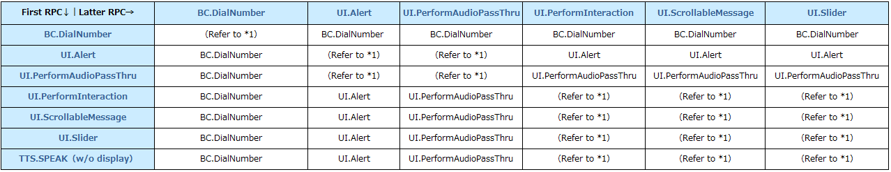

# Add RPC Conflict Management

* Proposal: [SDL-0315](0315-Add-RPC-Conflict-Management.md)
* Author: [Akihiro Miyazaki (Nexty)](https://github.com/Akihiro-Miyazaki)
* Status: **Accepted with Revisions**
* Impacted Platforms: [ Core / HMI / Policy Server ]

## Introduction
This proposal is to add a function to SDL Core that manages concurrent RPC conflicts according to priority. This will allow OEMs to receive the expected request from SDL Core during RPC conflict by modifying the configuration in the policy table in which the priority is set.


## Motivation
When multiple apps operate, ON-screen (ONS) messages and text-to-speech (TTS) RPCs are requested together. However, the current SDL Core does not have the function to manage these conflicts. Thus, all requests are notified to HMI and managed by the OEMs themselves. The figure below demonstrates the sequence process when `PerformAudioPassThru` occurs during `ScrollableMessage`.

<b>Figure 1.</b> Conflict between `ScrollableMessage` and `PerformAudioPassThru`


The example above shows that the latter RPC PerformAudioPassThru is displayed and aborts ScrollableMessage. However, this kind of method may increase the difficulty of implementing the HMI because the OEM's must manage RPC conflicts.

To solve these problems, we propose to add a new RPC conflict management function to SDL Core.

## Proposed solution
To implement the RPC conflict management, we will add a new RPC conflict management module, `InterruptManager` to SDL Core, and add `rpc_priority_table` to policy table.

RPC priority table, App priority table and HMI status priority table are specified in `rpc_priority_table`. RPC priority table, App priority table and HMI status priority table are tables that each set the priority of RPC, app and HMI status. By modifying `rpc_priority_table`, an OEM can receive the expected request from SDL Core during RPC conflict. On the other hand, `InterruptManager` reads `rpc_priority_table` from the policy table to construct the two tables mentioned above based on their settings. When an RPC conflict occurs, the `InterruptManager` first determines the RPC with a high priority according to the RPC priority table. However, if two competing RPCs have the same priority, then the RPC with the higher priority is determined according to the App priority priority table. Therefore, only one modal RPC to be displayed at a time.

#### RPC Conflict Management Configuration Table
The following tables described in `rpc_priority_table` in the Policy table are explained below.

- RPC priority table
- App priority table
- HMI status priority table

The RPC priority will be determined by the order below. Priority order will shift from 1 to 2, from 2 to 3 and from 3 to 4, if the RPCs are same priority.

1. Apps with app priority EMERGENCY.
2. RPC priority
3. App priority (non-emergency)
4. HMI status priority

<b>RPC priority Table</b><br>
The RPC priority table describes the priority of each RPC. When multiple RPCs occur at the same time, the RPC with the higher priority is determined according to the RPC priority table. The target RPCs in this proposal are ONS and TTS. ONS RPCs include such as `Alert` and `PerformInteraction`. The RPC priority table can set the priority for each ONS RPC. On the other hand, there are two types of TTS RPCs, TTS with ONS and TTS only. TTS with ONS RPCs shall follow the processed priority of the ONS RPC, while TTS only RPCs can set the priority individually.

Below are the default settings of RPC priority table.

<b>Table 1.</b> Default settings of RPC priority table

| RPC_Name (String)        | Priority (INT) | Note (String)     |
|:-:                      |:-:            |:-:               |
| BC.DialNumber           | 1             | Highest priority |
| UI.Alert                | 2             |                  |
| UI.PerformAudioPassThru | 2             |                  |
| UI.PerformInteraction   | 3             |                  |
| UI.ScrollableMessage    | 3             |                  |
| UI.Slider               | 3             |                  |
| TTS.Speak w/o ONS       | 3             | Lowest priority  |

OEMs can modify the RPC priority table and adjust the RPC priority to their specifications.

Because `SubtleAlert` is designed to work alongside other ONS RPCs, it is exempted from this proposal and will be sent to the HMI alongside any other ONS RPC. It will be up to the HMI to determine if the `SubtleAlert` contains TTS data and whether or not to play that TTS data alongside showing the `SubtleAlert` UI based on whether other TTS data is currently playing from another RPC.

The table below shows how the RPC will be determined by the priority set during RPC conflict based on the default settings above (Table 1).

<b>Table 2.</b> Priority result of Table 1



(* 1): For RPCs with the same priority, the App priority table, which is described later, will be used to determine the priority.

Below shows the Json example for the RPC priority table:
```json
"rpc_priority":{
    "BC.DialNumber": 1,
    "UI.Alert": 2,
    "UI.PerformAudioPassThru": 2,
    "UI.PerformInteraction": 3,
    "UI.ScrollableMessage": 3,
    "UI.Slider": 3,
    "TTS.SPEAK": 3
}
```

OEMs can modify any RPC priority. For example, if the priority of `UI.PerformInteraction` is modified to "1", its RPC priority will be the same as `BC.DialNumber`.

```json
"rpc_priority":{
    "BC.DialNumber": 1,
    "UI.Alert": 2,
    "UI.PerformAudioPassThru": 2,
    "UI.PerformInteraction": 1,
    "UI.ScrollableMessage": 3,
    "UI.Slider": 3,
    "TTS.SPEAK": 3
}
```

OEMs can delete any RPC priority. For example, if the priority of `UI.Slider` is deleted as shown below, its priority will be the same as a normal RPC and will be lower than any RPC in the RPC priority table.

```json
"rpc_priority":{
    "BC.DialNumber": 1,
    "UI.Alert": 2,
    "UI.PerformAudioPassThru": 2,
    "UI.PerformInteraction": 3,
    "UI.ScrollableMessage": 3,
    "TTS.SPEAK": 3
}
```


OEMs can restore the deleted `UI.Slider` and modify its priority. For example, if the priority of `UI.Slider` is modified to "2", its priority will be the same as `UI.Alert` and `UI.PerformAudioPassThru`.

```json
"rpc_priority":{
    "BC.DialNumber": 1,
    "UI.Alert": 2,
    "UI.PerformAudioPassThru": 2,
    "UI.PerformInteraction": 3,
    "UI.ScrollableMessage": 3,
    "UI.Slider": 2,
    "TTS.SPEAK": 3
}
```


<b>App priority Table</b><br>
App priority priority table describes the priority for each app. When a conflict between RPCs with the same priority in the RPC priority table occurs, the RPC with the higher priority is determined according to App priority table. Below are the default settings of App priority table.

<b>Table 3.</b> Default settings of App priority table

| App priority (String) | Priority (INT) | Note (String)     |
|:-:                  |:-:            |:-:               |
| EMERGENCY           | 0             | Automatically always the top priority |
| NAVIGATION          | 1             | Highest priority |
| VOICE_COMMUNICATION | 2             |                  |
| COMMUNICATION       | 3             |                  |
| NORMAL              | 4             |                  |
| NONE                | 5             | Lowest priority  |

OEMs can modify the App priority table and adjust the priority of application according to their own specifications. However, because EMERGENCY is set always the highest priority, the priority is determined by the items excluding EMERGENCY. Including EMERGENCY will change nothing.
For RPCs with the same priority, the HMI Status priority table, which is described later, will be used to determine the priority.

Below shows the Json example for the App priority table:
```json
"app_priority":{
    "EMERGENCY": 0, // Does not need to be included, if it is included it will be ignored no matter its assigned priority. See above.
    "NAVIGATION": 1,
    "VOICE_COMMUNICATION": 2,
    "COMMUNICATION": 3,
    "NORMAL": 4,
    "NONE": 5
}
```

<b>HMI status priority Table</b><br>
HMI status priority table describes the priority for each app level. When a conflict between RPCs with the same priority in the RPC priority table and App priority table occurs, the RPC with the higher priority is determined according to HMI status priority table. Below are the default settings of HMI status priority table.

<b>Table 4.</b> Default settings of HMI status priority table

| HMI Level (String) | Priority (INT) | Note (String)    |
|:-:                 |:-:             |:-:               |
| FULL               | 1              | Highest priority |
| LIMITED            | 2              |                  |
| BACKGROUND         | 3              |                  |
| NONE               | 4              | Lowest priority  |

If two RPCs with the same priority are sent, the second RPC sent will be prioritized.

Below shows the Json example for the HMI status priority table:
```json
"hmi_status_priority":{
    "FULL": 1,
    "LIMITED": 2,
    "BACKGROUND": 3,
    "NONE": 4
}
```

Also, below shows the Json example for the `rpc_priority_table` adding in policy table:
```json
"rpc_priority_table": {
    "rpc_priority":{
        "BC.DialNumber": 1,
        "UI.Alert": 2,
        "UI.PerformAudioPassThru": 2,
        "UI.PerformInteraction": 3,
        "UI.ScrollableMessage": 3,
        "UI.Slider": 3,
        "TTS.SPEAK": 3
    },
    "app_priority":{
        "EMERGENCY": 0, // Does not need to be included, if it is included it will be ignored no matter its assigned priority. See above.
        "NAVIGATION": 1,
        "VOICE_COMMUNICATION": 2,
        "COMMUNICATION": 3,
        "NORMAL": 4,
        "NONE": 5
    },
    "hmi_status_priority":{
        "FULL": 1,
        "LIMITED": 2,
        "BACKGROUND": 3,
        "NONE": 4
    }
}
```


#### Adding ON/OFF switch feature of RPC Conflict Management function
The parameter of `EnableRPCConflictManager` will be added to the SmartDeviceLink.ini file. This will show whether the RPC conflict management method implemented on SDL Core will be used. For example, if the `EnableRPCConflictManager` is set to `false`, SDL Core sends RPCs to HMI as it is without using the RPC conflict management method implemented on SDL Core. The HMI needs to manage the RPC conflict by using the OEM's own method. If the `EnableRPCConflictManager` is set to `true`, SDL Core only sends one RPC to the HMI specified according to the priority tables above by using the RPC conflict management method implemented on SDL Core.

Below shows the example of `EnableRPCConflictManager` parameter:

```
[MAIN]
EnableRPCConflictManager = false
```

#### RPC Conflict Management Module
The following explains functions of `InterruptManager`.

<b>1.Loading of configuration table</b><br>
`rpc_priority_table` is loaded from policy table.

<b>2.RPC conflict management processing sequence</b><br>
The processing sequence during ONS RPCs conflict is shown below.


<b>Figure 2.</b> ONS RPCs conflict


The processing sequence during TTS RPC conflict is shown below.

<b>Figure 3.</b> TTS RPCs conflict


## Potential downsides

Enabling this feature will force only one modal RPC to ever be displayed for every OEM implementing SDL. As a result, the system can not support multi ON-screen(ONS) and text-to-speech(TTS) RPCs notification.

However, by using the parameter of `EnableRPCConflictManager` set to false, SDL Core can continue to pass through ONS and TTS RPCs to the HMI as happens now.


## Impact on existing code

1. Add `InterruptManager` to the SDL Core source code to manage RPC conflicts.
2. Add `rpc_priority_table` that sets RPC priority, App priority and HMI status priority to the policy table file.
3. Remove the existing RPC conflict management systems from the HMI.
3. Add guidelines for OEMs such as `rpc_priority_table` placement and setting method on SDL Developer Portal (smartdevicelink.com).


## Alternatives considered
None.
