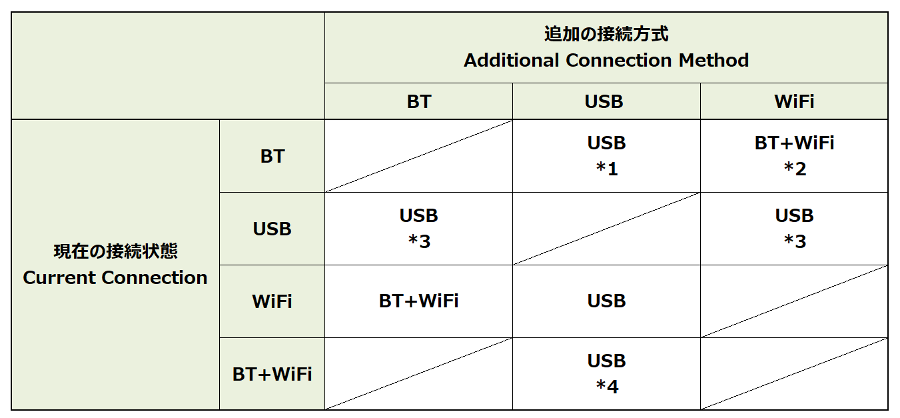

# Clarification of transport switching rules and improvement of UX

* Proposal: [SDL-0316](0316-Clarification-of-transport-switching-rules-and-improvement-of-UX.md)
* Author: [Akihiro Miyazaki (Nexty)](https://github.com/Akihiro-Miyazaki)
* Status: **Returned for Revisions**
* Impacted Platforms: [ Core / HMI ]

## Introduction

This proposal is to improve primary transport switching in the same device for primary transport switching of iOS approved by [SDL 0053-Connectivity via iAP-BT and Transport Switch](https://github.com/smartdevicelink/sdl_evolution/issues/158).


## Motivation
The rules for primary transport switching, such as connection priority, when the same device is connected to the Head Unit (HU) with multiple primary transport methods are not explicitly defined in the current SDL specifications. Therefore, designing the HU primary transport switching process takes time, and thus is inefficient.
Additionally, the user cannot know that the connection is being switched because the switching status is not notified to HMI during primary transport switching. Also, the user cannot operate the app screen on the HU. As a result, it causes an extremely inconvenient state for the user.


## Proposed solution
The following items are proposed to improve the problems mentioned above.
1. Clarification of primary transport switching rules
2. Addition of primary transport switching notification to HMI

#### 1. Clarification of primary transport switching rules
The following primary transport switching rules and tables should be added to [the SDL Core Guides](https://smartdevicelink.com/en/guides/core/developer-documentation/transport-manager/) as a specification for multiple primary transport methods for the same device.

- The priority of primary transport methods: USB > Bluetooth (BT)<br>Note that WiFi cannot communicate alone by itself, therefore WiFi is excepted from the priority.
- If the HU connects to multiple terminals (mobile devices), then the device that is already connected to the HU is prioritized.

<b>Table 1.</b> Switching of Multiple Primary Transport



*1 : If the HU recognizes that current BT and new USB are connected to the same device, SDL primary transport will switch to USB.<br>
*2 : The SDL app that uses Video Projection Mode (VPM) detects WiFi transport when it is launched. If the WiFi transport, which is connected to same device as the BT connection, is found, the SDL app will start VPM via WiFi.<br>
*3 : The USB connection is prioritized, even if both primary transports are connected to the same device.<br>
*4 : If the HU has recognized that current BT and new USB are connected to same device, SDL primary transport will switch to USB.

#### 2. Addition of primary transport switching notification to HMI
The following RPC, which will notify the HMI that the primary transport switching process is in progress, should be added.
OEMs can implement processes related to primary transport switching, such as message display and screen transition, according to the HMI specifications. They can also eliminate the inconvenience for the users when using the primary transport switch.

New RPC: `OnDeviceSwitchStatus`(HMI_API.xml)

```xml
<function name="OnDeviceSwitchStatus" messagetype="notification">
    <description> Notify HMI of the current state of the primary transport switch </description>
    <param name="status" type="Common.SwitchStatus" mandatory="true"/>
    <param name="switchingTransportResult" type="Common.SwitchingTransportResult" mandatory="false"/>
</function>

<struct name="SwitchingTransportResult" mandatory="false"/>
   <param name="switchingResult" type="SwitchResult" mandatory="true"/>
   <param name="failReason" type="Strings" mandatory="false"/>
</struct>

<enum name="SwitchStatus">
   <element name="STARTED"/>
   <element name="FINISHED"/>
</enum>

<enum name="SwitchResult">
   <element name="PASSED"/>
   <element name="FAILED"/>
</enum>
```

The below shows the new RPC (in red text) added to the existing logic. It is necessary to add the related information regarding the new RPC, including this sequence diagram, to the "SDL Core Guides" and "HMI Documentation" on SDL Developer Portal (smartdevicelink.com).

*1 The switching from BT to USB logic in the same device primary transport of iOS is already approved and implemented by the SDLC in SDL 0053 - Connectivity via iAP-BT and Transport Switch. See [PR](https://github.com/smartdevicelink/sdl_evolution/issues/158) and [sequence](https://cloud.githubusercontent.com/assets/11158516/26067529/3f428434-39a3-11e7-910b-6cc4069e0be3.png).<br>
*2 With the current SDL standard specification, the device cannot identify whether it is the same device or not. Therefore, device identification by the HU must be a prerequisite.

<b>Figure 1.</b> Sequence with new RPC added to existing logic


## Potential downsides
There are no downsides to this proposal.


## Impact on existing code
This proposal impacts the following:

- SDL Core : Add the process to send a new RPC to HMI.
- HMI : Add the process of receiving a new RPC.


## Alternatives considered
No alternatives were considered.
