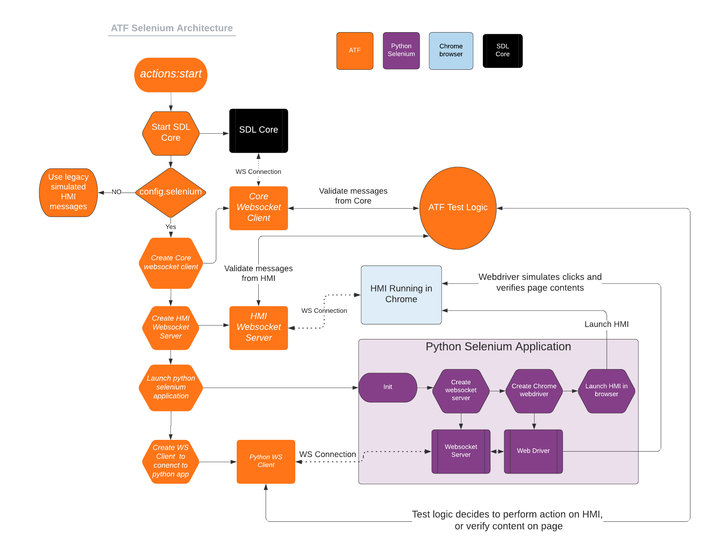

# ATF Selenium Support

* Proposal: [SDL-0340](0340-atf-selenium-support.md)
* Author: [Jack Byrne](https://github.com/JackLivio)
* Status: **Returned for Revisions**
* Impacted Platforms: [ATF / ATF Test Scripts / Generic HMI]

## Introduction

This proposal is to integrate the Generic HMI into ATF tests scripts by using Selenium to control a web browser programmatically.

## Motivation

Currently ATF is used to test SDL Core as a black box. ATF uses simulated mobile applications and a simulated HMI to test SDL Core functionality. While ATF is great at testing SDL Core, the author aims to create a solution for having an automated test suite that tests both SDL Core and the Generic HMI together.

## Proposed solution

The solution is to create a python Selenium WebDriver that will control actions and validate the content of the HMI when it is interacting with SDL Core.

### Selenium WebDriver Application

#### Life Cycle 

ATF will launch the python app using the os.execute() method. The python application will then launch a physical instance of the Generic HMI in the chromium browser.

```
from selenium import webdriver
driver = webdriver.Chrome()
driver.get(GENERIC_HMI_LOCATION)
```

This application will stay running until the end of the test when ATF will shut down the process. To close the browser the Selenium driver calls:

```
driver.close()
```

#### WebDriver Actions

Selenium is capable of finding elements on a page and interacting with them.

```
driver.find_element_by_id(ELEMENT_ID).click()
```

This type of call will be used to press different buttons in the HMI. This will be useful for activating an app, opening the menu, pressing a softbutton etc. These actions will trigger the HMI's state to change and also trigger applicable RPC messages to be sent back to ATF for validation.

#### WebDriver Validation

The Selenium WebDriver can also be used to validate the content on the page. For example if a Show request is sent to the HMI, the web driver should check that the text is correctly displayed.

```
return driver.find_element_by_id(ELEMENT_ID).text() == test.text
```

#### Communication with ATF

This python application will have a websocket server that will receive messages from ATF for specific test actions.

### Extra Websocket Server and Clients in ATF

#### Selenium Websocket Client

ATF will need to create a websocket client that relays messages to the python Selenium application. These messages will tell the WebDriver to click buttons and verify content displayed on the screen.

#### HMI Websocket Server

ATF will need to create a websocket server that will receive messages from the HMI. This server will then be routed through the ATF test logic to verify the contents of the HMI messages. After verifying that the messages are valid, ATF will pass the HMI message to SDL Core.

#### Core Websocket Client

ATF already has a websocket client that connects to SDL Core, but this piece will need to be extended to pass messages to the HMI while using existing method `getHMIConnection():ExpectRequest()` to validate RPC messages.

### ATF Test Logic

When ATF is configured to use Selenium, there are a few methods used in ATF that should be extended.

This is an existing simple test for a Show RPC request.

```lua
local function show(pParams)
  local cid = common.getMobileSession():SendRPC("Show", pParams.requestParams)
  pParams.responseUiParams.appID = common.getHMIAppId()
  common.getHMIConnection():ExpectRequest("UI.Show", pParams.responseUiParams)
  :Do(function(_, data)
      common.getHMIConnection():SendResponse(data.id, data.method, "SUCCESS", { })
    end)
  common.getMobileSession():ExpectResponse(cid, { success = true, resultCode = "SUCCESS" })
end
```

#### Extend `ExpectRequest`

In this code example there is a simulated mobile request being passed to SDL Core. The simulated HMI has a defined behavior for handling the request via `ExpectRequest`. For Selenium compatible tests, ATF's `ExpectRequest()` should be extended to forward the RPC to the HMI and then the Selenium WebDriver can verify the state of the HMI if applicable.

#### Extend `SendResponse`

After handling the request, the HMI will automatically respond with a success response. ATF will need to catch this response from the HMI and match it with the parameters included in the test. If the parameters match, ATF will forward the message to SDL Core and the test will continue. To implement this behavior, the `SendResponse()` method will need to be extended for Selenium-compatible test scripts.

#### Extend `SendError`

Similar to `SendResponse`, `SendError` will need to be extended to handle error responses from the HMI.

#### Extend `SendNotification`

Most notifications sent by the HMI are triggered as a result of a user interaction with the HMI. Examples of these events are pressing a menu command, or consenting to app permissions.

```lua
local function onCommand()
  common.getHMIConnection():SendNotification("UI.OnCommand", { cmdID = 20, appID = common.getHMIAppId() })
  common.getMobileSession():ExpectNotification("OnCommand", { cmdID = 20, triggerSource= "MENU" })
end
```

`SendNotification` should be extended to notify the Selenium WebDriver that it should simulate a user action if applicable. In this case it would be selecting menu command with `cmdID = 20`. This will trigger the HMI to send the `UI.OnCommand` RPC. ATF will need to listen for this notification and match it with the parameters listed in the test. ATF will then forward the notification from the HMI to SDL Core after validating the message contents.

#### Extend `SendRequest`

Similar to `SendNotification`, ATF sometimes uses `SendRequest` to simulate an event that was triggered by a user action.

```lua
function m.app.activate(pAppId)
  if not pAppId then pAppId = 1 end
  local requestId = m.hmi.getConnection():SendRequest("SDL.ActivateApp", { appID = m.app.getHMIId(pAppId) })
  m.hmi.getConnection():ExpectResponse(requestId)
  m.mobile.getSession(pAppId):ExpectNotification("OnHMIStatus", { hmiLevel = "FULL", systemContext = "MAIN" })
  if m.mobile.getAppsCount() > 1 then m.run.wait(m.minTimeout) end
end
```

In this example the HMI is requesting to activate an application via `SDL.ActivateApp`. This action implies the user has selected the app from the app list, therefore the Selenium application needs to simulate a user action. `SendRequest` would be extended to notify the Selenium WebDriver to click an app on the app list to activate the app.

#### Extend `ExpectResponse`

Using the previous activate app example, the `ExpectResponse` method should be extended to be able to validate the state of the HMI changed post activating an app.

### RPC Switching

Because there is a mix of behavior for overwriting the previously mentioned methods in terms of requiring a simulated user action vs verifying the content displayed on the HMI, ATF should implement a structure that defines which actions the Selenium WebDriver must take in the extended ATF methods.

#### Schema for RPC Switching feature

The extended `ExpectRequest` method would reference this object to figure out which Selenium WebDriver actions are required. 

```lua
-- this would be contained in some config or common file
local HmiRpcSwitching = {
  ["UI.Show"] = {
    expectRequest = {
      validate = {
        {
          id = "#mainField1",
          type = "text",
          textParam = "mainField1"
        }
      }
    }
  }
}

function test.hmiConnection:ExpectRequest(pName, ...)
  local event = events.Event()
  event.matches = function(_, data) return data.method == pName end
  local args = table.pack(...)
  local ret = expectations.Expectation("HMI call " .. pName, self)
  if #args > 0 then
    ret:ValidIf(function(e, data)
        local arguments
        if e.occurences > #args then
          arguments = args[#args]
        else
          arguments = args[e.occurences]
        end
        reporter.AddMessage("EXPECT_HMICALL",
          { ["Id"] = data.id, ["name"] = tostring(pName),["Type"] = "EXPECTED_RESULT" }, arguments)
        reporter.AddMessage("EXPECT_HMICALL",
          { ["Id"] = data.id, ["name"] = tostring(pName),["Type"] = "AVAILABLE_RESULT" }, data.params)
        return compareValues(arguments, data.params, "params")
      end)
  end
  ret.event = event
  event_dispatcher:AddEvent(self, event, ret)
  test:AddExpectation(ret)
  if HmiRpcSwitching[pName] ~= nil and HmiRpcSwitching[pName].expectRequest ~= nil then
    ret.Do = function(_, func) 
      SeleniumManager.sendRequest(pname, args, HmiRpcSwitching[pName].expectRequest)
      return self 
    end
  end

  return ret
end
```

Behavior changes highlighted here:
```lua
  if HmiRpcSwitching[pName] ~= nil and HmiRpcSwitching[pName].expectRequest ~= nil then
    ret.Do = function(_, func) 
      SeleniumManager.sendRequest(pname, args, HmiRpcSwitching[pName].expectRequest)
      return self 
    end
  end
```


The idea is that if the RPC matches the expected request in the RPC Switching table, ATF will overwrite the `Do` method to prevent a normal test from responding for the HMI. The message would then be passed to the Selenium Manager. This manager would be responsible for forwarding the message to the HMI and performing the validate or action behavior.


In this case the WebDriver would validate that the mainfield1 and mainfield2 text fields are displayed correctly.

```lua
{
  ["UI.Show"] : {
    expectRequest: {
      validate: [{
        id: "#mainfield1", //user by Document.getElementById()
        text: <Show text 1>, // text to validate the contents of the field
        textParam = "mainField1"
      }, {
        id: "#mainfield2", //user by Document.getElementById()
        text: <Show text 2>, // text to validate the contents of the field
        textParam = "mainField1"
      }] 
    }
  }
}
```

This example shows how an extended `SendNotification` for an `OnCommand` would instead trigger a button press on the HMI causing the `OnCommand` to be sent.

```lua
{
  ["UI.OnCommand"] : {
    sendNotification: {
      action: [{
        id: "#cmdID20", //user by Document.getElementById()
        ["function"]: "click" // action to be taken by the webdriver
      }] 
    }
  }
}
```

This example shows how a `SendRequest`'s behavior would be overwritten for activating an app (which involves a user selecting the app from the app list).

```lua
{
  ["SDL.ActivateApp"] : {
    sendRequest: {
      action: [{
        id: "#appListItem1", //user by Document.getElementById()
        ["function"]: "click" // action to be taken by the webdriver
      }] 
    }
  }
}
```


This example shows how an `ExpectResponse` behavior would be overwritten for the activate app response. After the response is received the WebDriver will validate that the app is active via the displayed app name.

```lua
{
  ["SDL.ActivateApp"] : {
    expectResponse: {
      validate: [{
        id: "#appListHeader", //user by Document.getElementById()
        ["function"]: <App Name> // text to validate the contents of the field
      }] 
    }
  }
}
```

### Scope Of Test Scripts

ATF has a very large collection of tests that are implemented with varying design patterns. It is hard to gauge the scope of how much work it would take to make every ATF test compatible with the Selenium WebDriver. The author suggests that the initial implementation of this proposal covers basic smoke test cases such as registering an app, activating an app, displaying some data, and performing some sort of button press type interactions.

It should be noted that not all test cases will be possible. ATF's simulated HMI has the ability to define error responses and behavior that the Generic HMI does not have.

### Architecture Diagram



## Potential downsides

This proposal includes a lot of components that have to interact and communicate with one another. Maintaining and developing this proposal would take a lot of work but the author thinks it would be extremely beneficial in helping automate our IVI related components tests. The less time we spend manually testing features, the more time we have for bug fixes and feature development.

## Impact on existing code

### ATF

- ATF will need to implement some new websocket servers/clients to communicate with the different components seen in the architecture diagram.
- ATF request/response methods should be extended to handle the RPC switching feature for this proposal.
- ATF will need to handle the lifecycle of starting and stopping the python Selenium application.

### ATF Test Scripts
- Some scripts may need to be modified more than others to accommodate the Selenium testing feature.

### Python Selenium Application
- Websockets should be set up to communicate with the ATF test scripts. The WebDriver will read messages that contain the actions defined in the `RPC Switching` section.

### Generic HMI
- Generic HMI might need to be updated to include the id property for applicable html elements to allow for the Selenium WebDriver to easily find these elements that need validation or interaction.


## Alternatives considered

An alternative solution would be to first create automated Selenium tests that only interact with the Generic HMI. This simplified solution wouldn't involve SDL Core or ATF.
