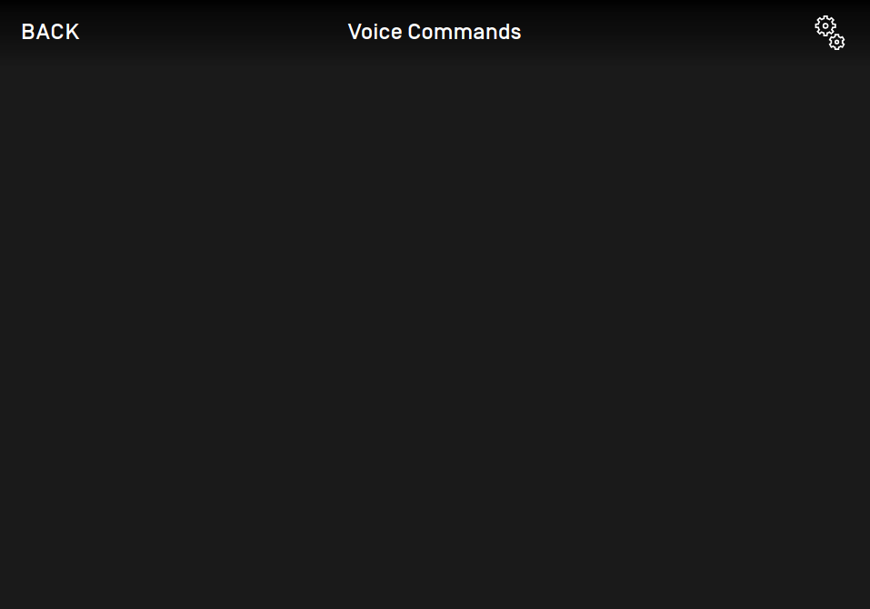
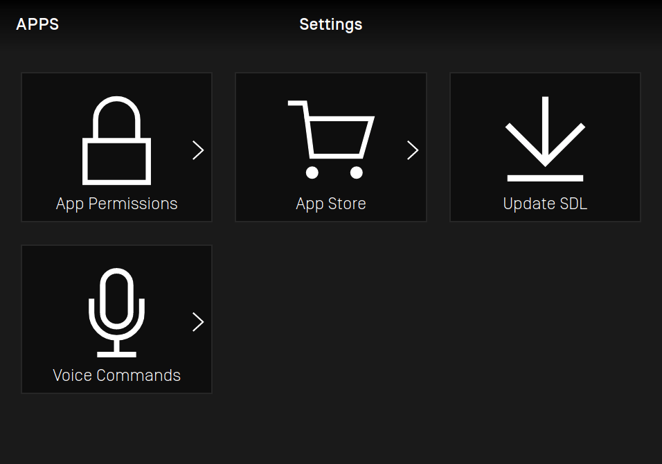

# Add Generic HMI Plugin Support

* Proposal: [SDL-0341](0341-add-generic-hmi-plugin-support.md)
* Author: [Jacob Keeler](https://github.com/smartdevicelink)
* Status: **Returned for Revisions**
* Impacted Platforms: [HMI]

## Introduction

The Generic HMI is currently missing a number of components which are available in the SDL project. The main reason behind this is that several HMI interfaces require data from components of the vehicle beyond SDL (ex. climate module data). This means that many of these vehicle components would need to be emulated in a test environment, and would need to use faked/test data. This makes including these components in the Generic HMI a difficult task, as the project is meant to be a definitive reference implementation for an SDL integration, and introducing faked data to the project would go against that design. Ideally, it should be possible to include the Generic HMI in a production system with minimal modification. This proposal provides a potential solution to this issue by introducing swappable plugins for the Generic HMI. These can be used to easily integrate both test and production implementations of these missing interfaces in the Generic HMI.

## Motivation

The main motivation behind this proposal is to bring the Generic HMI to a state where it can support all available SDL features. Currently a number of the available HMI interfaces aren't implemented (or are only partially implemented) within the Generic HMI, specifically:

- VR
- RC
- VehicleInfo
- Buttons (with the exception of media app buttons and softbuttons)
- Navigation (with the exception of video streaming)
- AppService (HMI provider support)

## Proposed solution

The ideal way to add support for these vehicle-specific components in the Generic HMI would be to introduce external plugins to the project. These plugins are separate applications with limited scope which run alongside the HMI and interact with it as needed. Basic plugins which emulate vehicle functionality will be included in the Generic HMI project for testing and reference purposes, while tailored plugins can be written to work with a specific system in production cases. Each of these plugins would maintain their own connection to SDL Core using a message broker, which can be borrowed from the Manticore project (see [here](https://github.com/smartdevicelink/manticore-images/blob/master/cores/broker/index.js)). Much of the test functionality needed in the Generic HMI is already available in the Manticore project (ex. vehicle data), so these components could be ported and used as a baseline for several of the test plugins detailed in this proposal.

An additional benefit to this approach is that plugins which run in the background can be written in any desired language; they only need to connect to the router service.

### Plugin Configuration

It should be possible to add, remove, disable, and replace plugins with minimal configuration changes where feasible. This configuration can be handled using the existing `Flags.js` file, which is currently used by the Generic HMI for any runtime configurations.

#### Configuration Format

Plugin (Object) Definition:

* General plugin fields
    * Enabled (Boolean) - Flag to enable or disable this plugin within the HMI. If set to `false`, then the Generic HMI will ignore this configuration entry.
    * Url (String) - For web-based plugins, the URL to be opened by the HMI in order to start the plugin. The UI for this plugin can be enabled or disabled using the `TestViewEnabled` field.
    * MenuNavEnabled (Boolean) - Optional flag to enable an entry point within the HMI menu to a customizable section of the HMI which interacts with this plugin. See the [Integrated Plugin Controls](#integrated-plugin-controls) section for more details.
    * MenuNavTitle (String) - A custom title to display in the HMI menu item for this plugin. Must be unique between enabled plugins. Used only when `MenuNavEnabled` is set to `true`.
    * MenuNavIcon (String) - A custom icon name to display in the HMI menu item for this plugin. Can be either a hex code (for static icons) or a file path. If omitted, a default icon will be displayed based on plugin type. Used only when `MenuNavEnabled` is set to `true`.
* Test plugin fields
    * TestViewEnabled (Boolean) - Optional flag for test plugins to display the UI for the plugin (using the provided `Url` field) beside the main HMI.
    * TestViewTitle (String) - A custom title to display in a tabbed list above the test UI to differentiate between plugins. Must be unique between enabled plugins. Used only when `TestViewEnabled` is set to `true`.

Plugin Configuration Fields (added to `Flags.js`):

* VRPlugin (Plugin) - Configuration for the plugin which handles voice recognition and connects to the `VR` HMI interface. If enabled, the Generic HMI will not send `MB.registerComponent` for the `VR` interface to the message broker.
* VIPlugin (Plugin) - Configuration for the plugin which handles vehicle data and connects to the `VehicleInfo` HMI interface. If enabled, the Generic HMI will not send `MB.registerComponent` for the `VehicleInfo` interface to the message broker.
* RCPlugins (Plugin array) - List of configurations for plugins which handle remote control functionality and connect to the `RC` HMI interface. Depending on developer preference, each plugin provided could handle a different module type, or a single configuration could be provided for a plugin which handles all modules. If at least one entry is enabled, the Generic HMI will not send `MB.registerComponent` for the `RC` interface to the message broker.
* ButtonPlugin (Plugin) - Configuration for the plugin which handles button events and connects to the `Buttons` HMI interface.
* AppServicePlugins (Plugin array) - List of configurations for plugins which provide app service functionality/data and connect to the `AppService` HMI interface. Depending on developer preference, each plugin provided could handle a different app service type, or a single configuration could be provided for a plugin which handles all app service types. The main HMI can act as an App Service Consumer for data provided by these plugins.
* TTSPlugin (Plugin) - Configuration for the plugin which handles text-to-speech and connects to the `TTS` HMI interface. If enabled, the Generic HMI will not send `MB.registerComponent` for the `TTS` interface to the message broker.
* NavigationPlugin (Plugin) - Configuration for the plugin which handles navigation-related functionality and connects to the `Navigation` HMI interface. This plugin does not override existing video/audio streaming functionality in the Generic HMI, as that is handled separately despite being defined in the `Navigation` interface.
* MiscPlugins (Plugin array) - List of configurations for plugins which are not tied to a specific HMI interface (such as the [General Settings](#general-settings-plugin) plugin or [Phone](#phone-plugin) plugin).

##### Example
```
window.flags = {
    VRPlugin: {
        Enabled: false, //Plugin is disabled, HMI will ignore this entry
        Url: 'http://127.0.0.1:3010', //URL path to plugin application, for web applications
        TestViewEnabled: true, //Plugin application has a test UI (accessible via the "Url" field), which should be displayed beside the main HMI
        TestViewTitle: 'Voice', //Title to display alongside the plugin's test UI
        MenuNavEnabled: true, //Plugin has a custom integrated component within the Generic HMI, accessible via settings menu
        MenuNavTitle: 'Voice Commands' //Text to display with the item in the settings menu directing to this plugin's custom component
    },
    RCPlugins: [
        {
            Enabled: true, //Plugin is enabled
            TestViewEnabled: false, //Plugin application does not have an accessible test UI (due to not being a web application)
            MenuNavEnabled: true, //Plugin has a custom integrated component within the Generic HMI, accessible via settings menu
            MenuNavTitle: 'Climate Controls' //Text to display with the item in the settings menu directing to this plugin's custom component
        },
        {
            Enabled: true, //Plugin is enabled
            Url: 'http://127.0.0.1:3020',
            TestViewEnabled: true,
            TestViewTitle: 'Seat (RC)',
            MenuNavEnabled: true, 
            MenuNavTitle: 'Seats'
        }
    ]
    ...
};
```

### Message Broker

In order to communicate with each of these plugins, a message broker will be added to the project to route messages between SDL Core and each HMI component (using [Manticore's message broker](https://github.com/smartdevicelink/manticore-images/blob/master/cores/broker/index.js) as a base). Each plugin (in addition to the Generic HMI itself) will connect to this message broker in place of SDL Core and register one or more HMI interfaces using the [MB.registerComponent](https://smartdevicelink.com/en/guides/core/integrating-your-hmi/sdl-core-and-hmi-communication/#component-registration) request. The message broker will then automatically route messages from SDL Core to all appropriate plugins based on which interfaces they registered (multiple plugins can register to the same interface, if needed). 

Some interfaces (such as VehicleInfo) only have stub implementations in the Generic HMI at the moment because, as mentioned previously, they require information from an actual vehicle to work properly. If an appropriate plugin is available for one of these unimplemented interfaces, then the Generic HMI itself will skip registration for that interface, allowing the plugin to handle all messages related to the given interface instead.

In addition, the message broker can be used to send messages between individual plugins as well as the main HMI, such messages are described in [this section](#messages-between-components).

### Web-based plugins

When using web-based plugins, the Generic HMI can open these plugins directly in-browser when it is initially started. This feature is configured using the options defined in the [Plugin Configuration](#plugin-configuration) section of this proposal. In order to run these applications within the browser, the Generic HMI will open the `Url` provided in the plugin configuration within a hidden `iframe` (or something similar), allowing the plugin to run alongside the HMI.

#### Displaying test plugins in-browser

For any test plugins which are web-based, the UI of the plugin can also be displayed directly in the browser window beside the main HMI using the provided `Url` config parameter. These plugin UIs would be arranged in a similar manner to Manticore using tabs, with each tab containing a window (also possible using an embedded `iframe`) to display the test UI. These views will need to be kept to a fixed width to fit within provided space beside the HMI.


The test UI for each plugin can be enabled or disabled using the plugin configuration file (see `TestViewEnabled` in the [configuration format section](#configuration-format)).

### Plugin Types

Detailed in this section is a list of all of the plugin types needed to allow for full feature coverage in the Generic HMI. Each plugin description includes details about which features the plugin needs to support, along with the RPCs it must handle to cover each feature. As part of this proposal, an example plugin of each type will be created for testing purposes, and these examples can then be used as a reference for production implementations. These example plugins will be included directly in the Generic HMI repository.

#### Voice Recognition Plugin

Connects to the `VR` interface, overriding the Generic HMI's implementation of this component.

*Features:*

- General interface functions
    - VR.IsReady
    - VR.GetCapabilities
- Voice commands (both "Command" and "Choice" type), test implementation can be ported from Manticore
    - VR.AddCommand
    - VR.DeleteCommand
    - VR.PerformInteraction
    - VR.OnCommand
- Voice recognition state control
    - VR.Started
    - VR.Stopped
- Language switching support
    - VR.OnLanguageChange
    - VR.GetLanguage
    - VR.GetSupportedLanguages
    - VR.ChangeRegistration
- The "Help" command, which will trigger the TTS component to speak the app's `helpPrompt`

#### Vehicle Info Plugin

Connects to the `VehicleInfo` interface, overriding the Generic HMI's implementation of this component.

*Features:*

- General interface functions
    - VehicleInfo.IsReady
- Vehicle data, test implementation can be ported from Manticore
    - VehicleInfo.GetVehicleData
    - VehicleInfo.SubscribeVehicleData
    - VehicleInfo.UnsubscribeVehicleData
    - VehicleInfo.OnVehicleData
    - VehicleInfo.GetVehicleType
- Raw vehicle info requests
    - VehicleInfo.ReadDID
    - VehicleInfo.GetDTCs
    - VehicleInfo.DiagnosticMessage

#### Remote Control Plugin

Connects to the `RC` interface, overriding the Generic HMI's implementation of this component. This could potentially be split into several plugins (by module type) depending on the system.

*Features:*

- General interface functions
    - RC.IsReady
    - RC.GetCapabilities
- Remote Control data, test implementation can be ported from Manticore
    - RC.SetInteriorVehicleData
    - RC.GetInteriorVehicleData
    - RC.OnInteriorVehicleData
- Remote Control settings and status control
    - RC.OnRCStatus
    - RC.OnRemoteControlSettings
    - RC.SetGlobalProperties
    - RC.GetInteriorVehicleDataConsent
- Alternate audio source (ex. radio)

#### Buttons Plugin

Connects to the `Buttons` interface. This plugin would also communicate `ButtonPress` events to other plugins where needed.

*Features:*

- General interface functions
    - Buttons.GetCapabilities
- Button Event Notifications, test implementation can be ported from Manticore
    - Buttons.OnButtonPress
    - Buttons.OnButtonEvent
- Button Subscription
    - Buttons.SubscribeButton
    - Buttons.UnsubscribeButton
- Button Presses
    - Buttons.ButtonPress
- Media Button Names, test implementation can be ported from Manticore
    - PLAY_PAUSE
    - SEEKLEFT, SEEKRIGHT
    - TUNEUP, TUNEDOWN
- Climate Button Names, test implementation can be ported from Manticore
    - AC, AC_MAX, RECIRCULATE, UPPER_VENT, LOWER_VENT
    - FAN_UP, FAN_DOWN, TEMP_UP, TEMP_DOWN
    - DEFROST, DEFROST_MAX, DEFROST_REAR
- Radio Button Names, test implementation can be ported from Manticore
    - VOLUME_UP, VOLUME_DOWN
    - EJECT, SOURCE
    - SHUFFLE, REPEAT
- Navigation Button Names
    - NAV_CENTER_LOCATION
    - NAV_ZOOM_IN, NAV_ZOOM_OUT
    - NAV_PAN_UP, NAV_PAN_UP_RIGHT, NAV_PAN_RIGHT, etc.
    - NAV_TILT_TOGGLE, NAV_HEADING_TOGGLE
    - NAV_ROTATE_CLOCKWISE, NAV_ROTATE_COUNTERCLOCKWISE
- Preset Button Names
    - PRESET_0...9

#### App Service Plugin

Connects to the `AppService` interface, registering IVI services for each type. This could potentially be split into several plugins (by service type) depending on developer preference.

*Features:*

- Media, Weather, and Navigation App Service Data Providers, test implementations can be ported from Manticore
    - AppService.PublishAppService
    - AppService.UnpublishAppService
    - AppService.GetAppServiceData
    - AppService.OnAppServiceData
    - AppService.PerformAppServiceInteraction
- App Service settings
    - AppService.GetAppServiceRecords
    - AppService.AppServiceActivation
    - AppService.GetActiveServiceConsent

#### Phone Plugin

Connects to the `BasicCommunication` interface.

*Features:*

- Phone calls
    - BasicCommunication.DialNumber
    - OnEventChanged(PHONE_CALL)

#### Navigation Plugin

Connects to the `Navigation` interface.

*Features:*

- General interface functions
    - Navigation.IsReady
- Navigation data popups, will need to interact with the UI component
    - Navigation.AlertManeuver
    - Navigation.ShowConstantTBT
- Navigation instructions
    - Navigation.UpdateTurnList
    - Navigation.SendLocation
- Embedded navigation support
    - Navigation.GetWayPoints
    - Navigation.SubscribeWayPoints
    - Navigation.UnsubscribeWayPoints
    - Navigation.OnWayPointChange
    - BasicCommunication.OnEventChanged(EMBEDDED_NAVI)

#### General Settings Plugin

Connects to the `BasicCommunication` and `UI` interfaces, also communicates with the main HMI to control settings via custom messages.

*Features:*

- General settings, replaces the controls that are currently placed below the main HMI screen. The test implementation for this feature can be ported from Manticore.
    - UI.OnDriverDistraction
    - Change HMI Theme
- Shutdown control, replaces the "Shutdown" button 
    - BasicCommunication.OnIgnitionCycleOver
    - BasicCommunication.OnExitAllApplications(IGNITION_OFF)
- General HMI events
    - BasicCommunication.OnEventChanged(EMERGENCY_EVENT)
    - BasicCommunication.OnEventChanged(DEACTIVATE_HMI)

#### TTS Plugin

Connects to the `TTS` interface, overriding the Generic HMI's implementation of this component.

*Features:*

- General interface functions
    - TTS.IsReady
    - TTS.GetCapabilities
- Speech support
    - TTS.Speak
    - TTS.StopSpeaking
    - TTS.Started
    - TTS.Stopped
- Language switching support
    - TTS.OnLanguageChange
    - TTS.GetLanguage
    - TTS.GetSupportedLanguages
    - TTS.ChangeRegistration
- Prompt support, will require custom message from other components
    - TTS.SetGlobalProperties
    - TTS.Speak(helpPrompt) when "Help" option is selected
    - TTS.Speak(timeoutPrompt) when timeout occurs

### Messages between components

While ideally each of the HMI components would be isolated, there are a number of places where one component will need information from other components. For that reason, we will need to define a messaging scheme for HMI-specific messages which can be sent between components. These messages are routed using the message broker as well.

Each message will use the `Plugin` prefix and includes a `destination` parameter to target a specific component (ex. VR).

#### Plugin API Format

The API for these inter-plugin messages will be modeled after the [HMI_API.xml](https://github.com/smartdevicelink/sdl_core/blob/master/src/components/interfaces/HMI_API.xml) and they will use the same [JSON-RPC 2.0](https://www.jsonrpc.org/specification) format used for existing HMI messages. Though the format is the same, this API will be maintained separately from the main HMI API, since these messages will be specific to the Generic HMI.

Example Request:

```
{
    "jsonrpc": "2.0",
    "id": 239,
    "method": "Plugins.DISMISS_INTERACTION",
    "params": {
        "appID": 2005331421,
        "destination": "UI"
    }
}
```

Example Response:

```
{
    "jsonrpc": "2.0",
    "id": 239,
    "result": {
        "code": 0,
        "method": "Plugins.DISMISS_INTERACTION"
    }
}
```

Example Notification:

```
{
    "jsonrpc": "2.0",
    "method": "Plugins.BUTTON_PRESS",
    "params": {
        "buttonName": "TEMP_UP",
        "destination": "RC"
    }
}
```

#### Plugin API Messages

**DISMISS_INTERACTION**

Sender: **VR/UI**

Receiver: **UI/VR**

Definition:

```
<function name="DISMISS_INTERACTION" messagetype="request">
    <description>
        Direction: VR -> UI or UI -> VR
        Sent when a choice is selected for `PerformInteraction` via VR or UI, informing the other component that the interaction is complete.
    </description>
    <param name="appID" type="Integer" mandatory="true">
        <description>The ID of the application that started the interaction.</description>
    </param>
</function>

<function name="DISMISS_INTERACTION" messagetype="response">
</function>
```

**BUTTON_PRESS**

Sender: **Buttons**

Receiver: **RC**

Definition:

```
<function name="BUTTON_PRESS" messagetype="notification">
    <description>
        Direction: Buttons -> RC
        Sent when a button related to RC is pressed, informing the RC component to update its data where appropriate.
    </description>
    <param name="buttonName" type="ButtonName" mandatory="true">
        <description>The name of the button that was pressed.</description>
    </param>
</function>
```

**SEND_NAV_CAPABILITIES**

Sender: **Navigation**

Receiver: **Main HMI**

Definition:

```
<function name="SEND_NAV_CAPABILITIES" messagetype="notification">
    <description>
        Direction: Navigation -> UI
        Sent when the navigation plugin is registered, communicating its capabilities to be sent in `UI.GetCapabilities` or `BC.OnSystemCapabilityUpdated`.
    </description>
    <param name="navigationCapabilities" type="NavigationCapability" mandatory="true">
        <description>The capabilities provided by the connected navigation plugin.</description>
    </param>
</function>
```

**SPEAK**

Sender: **Various**

Receiver: **TTS**

Definition:

```
<function name="SPEAK" messagetype="request">
    <description>
        Direction: *Any Component* -> TTS
        Sent when any TTS prompt is triggered outside of the TTS interface (ex. `helpPrompt`/`timeoutPrompt` in `VR.PerformInteraction`). The TTS plugin will speak whatever data is provided.
    </description>
    <param name="ttsChunks" type="TTSChunk" mandatory="true" array="true" minsize="1" maxsize="100">
        <description>List of strings to be spoken.</description>
    </param>
</function>

<function name="SPEAK" messagetype="response">
</function>
```

**ALERT_MANEUVER**

Sender: **Navigation**

Receiver: **UI**

Definition:

```
<function name="ALERT_MANEUVER" messagetype="request">
    <description>
        Direction: *Any Component* -> TTS
        Sent whenever a `Navigation.AlertManeuver` request is received by the Navigation plugin. The UI should display an alert maneuver popup with the provided softbuttons.
    </description>
    <param name="softButtons" type="Common.SoftButton" minsize="0" maxsize="3" array="true" mandatory="false">
        <description>
            Buttons to display with popup. 
            If omitted, only the system defined "Close" SoftButton should be displayed.
        </description>
    </param>
    <param name="appID" type="Integer" mandatory="true">
        <description>ID of the application which requested this RPC.</description>
    </param>
</function>

<function name="ALERT_MANEUVER" messagetype="response">
</function>
```

**SETTINGS_UPDATE**

Sender: **Settings**

Receiver: **Main HMI**

Definition:

```
<function name="SETTINGS_UPDATE" messagetype="notification">
    <description>
        Direction: Settings(BasicCommunication) -> UI
        Sent when one or more of the HMI settings are changed in the Settings plugin.
    </description>
    <param name="hmiTheme" type="DisplayMode" mandatory="false">
        <description>The requested theme for the HMI.</description>
    </param>
    <param name="driverDistraction" type="Boolean" mandatory="false">
        <description>The current driver distraction state.</description>
    </param>
</function>
```

**ON_EVENT_CHANGED**

Sender: **Various**

Receiver: **Main HMI**

Definition:

```
<function name="ON_EVENT_CHANGED" messagetype="notification">
    <description>
        Direction: *Any Component* -> BasicCommunication
        Sent when an event is activated or deactivated from a plugin to allow the main HMI to apply appropriate state changes.
    </description>
    <param name="eventName" type="EventTypes" mandatory="true">
        <description>Specifies the type of event being activated or deactivated.</description>
    </param>
    <param name="isActive" type="Boolean" mandatory="true">
       <description>'true' when the event is started, 'false' when the event has ended.</description>
    </param>
</function>
```

**DEACTIVATE_EVENT**

Sender: **Main HMI**

Receiver: **Various**

Definition:

```
<function name="DEACTIVATE_EVENT" messagetype="request">
    <description>
        Direction: BasicCommunication -> *Any Component* (depending on event type)
        Sent when the HMI needs to deactivate an event in progress (for example, if a navigation app is activated during the EMBEDDED_NAVIGATION event).
    </description>
    <param name="eventName" type="EventTypes" mandatory="true">
        <description>Specifies the type of event being deactivated.</description>
    </param>
</function>

<function name="DEACTIVATE_EVENT" messagetype="response">
</function>
```

Additional Notes: The `destination` field for this request is dependent on the event type, according to which plugin is responsible for the event. Specifically, if the `eventName` is: 

* `EMBEDDED_NAVIGATION` - the request will be sent to the `Navigation` interface.
* `PHONE_CALL` - the request will be sent to the `BasicCommunication` interface (and handled by the Phone plugin).
* `EMERGENCY_EVENT` - the request will be sent to the `BasicCommunication` interface (and handled by the General Settings plugin).
* `DEACTIVATE_HMI` - the request will be sent to the `BasicCommunication` interface (and handled by the General Settings plugin).

**SHOW_POPUP**

Sender: **Various**

Receiver: **Main HMI**

Definition:

```
<function name="SHOW_POPUP" messagetype="request">
    <description>
        Direction: *Any Component* -> BasicCommunication
        Sent whenever a plugin needs to display a prompt to the user (ex. `RC.GetInteriorVehicleDataConsent` or `AppService.GetActiveServiceConsent`). A response is sent when an option is selected or the popup is closed.
    </description>
    <param name="title" type="String" mandatory="false">
      <description>Title to display with the popup.</description>
    </param>
    <param name="popupText" type="String" mandatory="true">
      <description>Text body of the popup.</description>
    </param>
    <param name="softButtons" type="SoftButton" mandatory="false" minsize="0" maxsize="4" array="true">
      <description>SoftButtons to display with the popup.</description>
    </param>
</function>

<function name="SHOW_POPUP" messagetype="response">
    <param name="customButtonID" type="Integer" mandatory="false" minvalue="0" maxvalue="65536">
        <description>The ID of the popup button that was pressed, if applicable.</description>
    </param>
</function>
```

**Note:** While this list of messages is meant to be as comprehensive as possible for general use, custom messages will still be needed in production systems (primarily depending on the design of the integrated portion of the plugin, see [Integrated Plugin Controls](#integrated-plugin-controls)). This API can also be expanded in the future if new interactions are required or new plugin types are added.

### Integrated Plugin Controls

While a majority of the functionality for these plugins can be handled in the background, production implementations will need the ability to integrate some portion of these plugins directly into the Generic HMI (such as a set of controls and/or settings for the plugin). To accommodate this, a customizable portion of the HMI which can interact with the plugin will be added to the project. This custom section of the HMI needs to be built out by the plugin developer, though stubs for these integrated components will be included in the project which can be used as a base.



In order to incorporate this functionality, we will need to include an entry point within the Generic HMI for each of these integrated plugin components. These entry points will be included in the existing settings menu, as shown in this example:



These integrated components can be included or excluded from the menu using the plugin configuration file (see `MenuNavEnabled` in the [Configuration Format](#configuration-format) section).

## Potential downsides

Besides the general overhead of maintaining these plugins, the author does not see any significant downsides to this approach. Using plugins may be slightly more complicated than integrating these interfaces directly into the HMI, but it also allows for extra flexibility, and would not require any sizable design changes to the Generic HMI.

## Impact on existing code

With the variety of components being added in this proposal which run separate from the main HMI, a startup script will be required to handle the initialization of all of these components. This script will start the HMI, python backend, and any desired plugins all at once using a single command. This new script will need its own simple configuration file in order to start each plugin, for example:

```
{
  "Plugins": [
    {
      "Name": "VR",
      "Directory": "./plugins/samples/VR/"
      "StartCommand": "npm start"
    },
    {
      "Name": "TTS",
      "Directory": "./plugins/samples/TTS/"
      "StartCommand": "python3 start.py"
    },
    ...
  ]
}
```

As far as existing Generic HMI code, a few additions are needed:

- Logic to handle plugin configuration (via `Flags.js`)
- A sidebar for displaying test plugins next to the main portion of the HMI (via iframes, etc.)
- Logic to disable registration of unimplemented components when appropriate plugins are available
- Logic to handle new inter-component messages from connected plugins
- Logic for including additional settings menu items to navigate to integrated plugin components based on plugin configuration
- Basic stub components for each plugin to be expanded in production applications

Example plugin stub:

```
import React from 'react';

import AppHeader from './containers/Header';

export default class VRPlugin extends React.Component {
    render() {
        return (
            <div>
                <AppHeader icon="store" backLink="" appName="Menu" title={window.flags.VRPlugin.MenuName ? window.flags.VRPlugin.MenuName : "Voice Recognition"} />
                {
                    //Add your Voice Recognition controls here
                }
            </div>
        )
    }
}
```

Overall, a majority of the changes needed for this proposal will be in the form of test plugins, which will be isolated from any existing code.

## Alternatives considered

- The main alternative to this proposal was to implement a full IVI system around the Generic HMI. Most of this functionality would have to be emulated to a degree, which would make it harder to integrate into a production system. As such, this approach didn't seem ideal given the current design of the Generic HMI.
