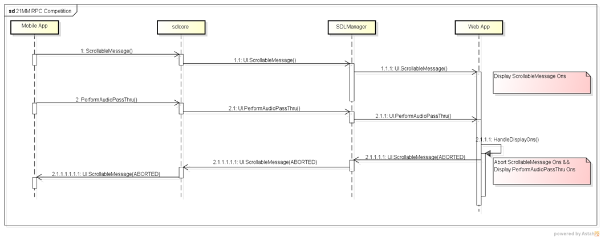
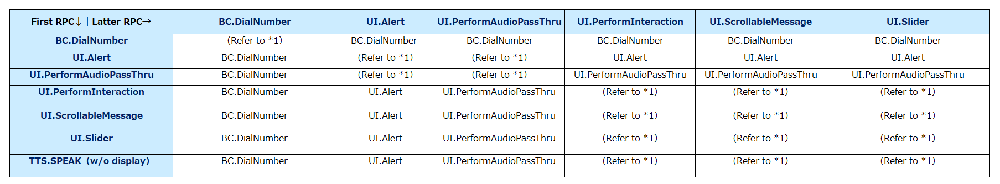
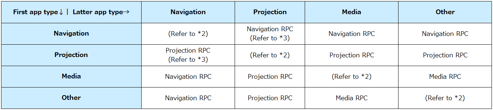
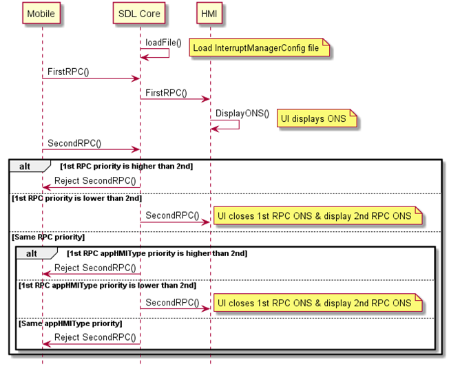
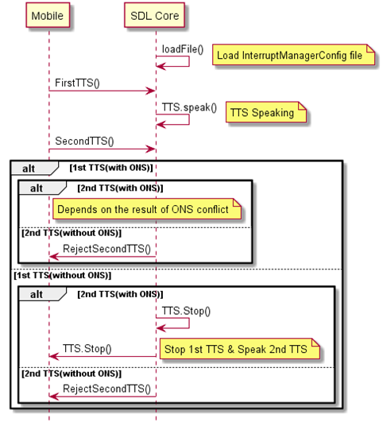

# Add RPC Conflict Management

* Proposal: [SDL-NNNN](NNNN-Clarification-of-SDL-App-Icon-display-sequence-and-display-order.md)
* Author: [Akihiro Miyazaki (Nexty)](https://github.com/Akihiro-Miyazaki)
* Status: **Awaiting review**
* Impacted Platforms: [ Core / SDL Documents ]

## Introduction
This proposal is to add a function to SDL Core that manages concurrent RPC conflicts according to priority. This will allow OEMs to receive the expected request from SDL Core during RPC conflict by modifying the configuration file in which the priority is set.


## Motivation
When multiple apps operate, ON-screen (ONS) messages and text-to-speech (TTS) RPCs are requested together. However, the current SDL Core does not have the function to manage these conflicts. Thus, all requests are notified to the middleware and managed by the OEMs themselves.For instance, ONS and TTS conflicts are managed by prioritizing the latter RPC. The figure below demonstrates the sequence process when `PerformAudioPassThru`occurs during  `ScrollableMessage`

<b>Figure 1.</b> Conflict between `ScrollableMessage` and `PerformAudioPassThru`


The example above shows that the latter RPC `PerformAudioPassThru` is displayed and aborts `ScrollableMessage`. However, this kind of method has the following problems.
1. Since there is no guideline for RPC conflicts, implementations vary for each OEMs, thus, it is hard to standardize.
2. Management of RPC conflicts with OEMs may increase the difficulty of implementing middleware.

To solve these problems, we propose to add a new RPC conflict management function to SDL Core.

## Proposed solution
To implement the RPC conflict management, we will add a new RPC conflict management module, InterruptManager, and configuration file, InterruptManagerConfig, to SDL Core.

RPC priority table and AppHMIType priority table are specified in InterruptManagerConfig. RPC priority table and AppHMIType priority table are tables that each set the priority of RPC and app type (`appHMIType`). By modifying InterruptManagerConfig, the OEM can receive the expected request from SDL Core during RPC conflict. On the other hand, InterruptManager reads InterruptManagerConfig during the SDL Core startup and builds the two tables mentioned above based on their settings. When an RPC conflict occurs, the `InterruptManager` first determines the RPC with a high priority according to the RPC priority table. However, if two competing RPCs have the same priority, then the RPC with the higher priority is determined according to the AppHMIType priority table.

#### RPC Conflict Management Configuration File
The following tables of InterruptManagerConfig are explained.

- RPC priority table
- AppHMIType priority table

<b>RPC Priority Table</b><br>
The RPC priority table describes the priority of each RPC. When multiple RPCs occur at the same time, the RPC with the higher priority is determined according to the RPC priority table. The target RPCs in this proposal are ONS and TTS. ONS RPCs include such as `Alert` and `PerformInteraction`. The RPC priority table can set the priority for each ONS RPC. On the other hand, there are two types of TTS RPCs, TTS with ONS and TTS only. TTS with ONS RPCs shall follow the processed priority of the ONS RPC, while TTS only RPCs can set the priority individually.

Below is the default settings of RPC priority table.

<b>Table 1.</b> Default settings of priority table

| RPC_Name(String)        | Priority(INT) | Note(String)     |
|:-:                      |:-:            |:-:               |
| BC.DialNumber           | 1             | Highest priority |
| UI.Alert                | 2             |                  |
| UI.PerformAudioPassThru | 2             |                  |
| UI.PerformInteraction   | 3             |                  |
| UI.ScrollableMessage    | 3             |                  |
| UI.Slider               | 3             |                  |
| TTS.Speak w/o ONS       | 3             | Lowest priority  |

OEMs can modify the RPC priority table and adjust the RPC priority to their specifications.

The table below shows how the RPC will be determined by the priority set during RPC conflict based on the default settings above (table 1).

<b>Table 2.</b> Priority result of Table 1



(* 1): For RPCs with the same priority, the AppHMIType priority table, which is described later, will be used to determine the priority.

Below shows the Json example for the RPC priority table:
```json
  "RpcPriority":{
    "BC.DialNumber": 1,
    "UI.Alert": 2,
    "UI.PerformAudioPassThru": 2,
    "UI.PerformInteraction": 3,
    "UI.ScrollableMessage": 3,
    "UI.Slider": 3,
    "TTS.SPEAK": 3
}
```

OEMs can modify any RPC priority. For example, if the priority of UI.PerformInteraction is modified to "1", its RPC priority will be the same as `BC.DialNumber`.

```json
"RpcPriority":{
    "BC.DialNumber": 1,
    "UI.Alert": 2,
    "UI.PerformAudioPassThru": 2,
    "UI.PerformInteraction": 1,
    "UI.ScrollableMessage": 3,
    "UI.Slider": 3,
    "TTS.SPEAK": 3
}
```

OEMs can delete any RPC priority. For example, if the priority of `UI.Slider` is deleted as shown below, its priority will be the same as a normal RPC and will be lower than any RPC in the RPC priority table.

```json
"RpcPriority":{
    "BC.DialNumber": 1,
    "UI.Alert": 2,
    "UI.PerformAudioPassThru": 2,
    "UI.PerformInteraction": 3,
    "UI.ScrollableMessage": 3,
    "TTS.SPEAK": 3
}
```


OEMs can restore the deleted `UI.Slider` and modify its priority. For example, if the priority of `UI.Slider` is modified to "2", its priority will be the same as `UI.Alert` and `UI.PerformAudioPassThru`.
```json
"RpcPriority":{
  	"BC.DialNumber": 1,
    "UI.Alert": 2,
	"UI.PerformAudioPassThru": 2,
	"UI.PerformInteraction": 3,
	"UI.ScrollableMessage": 3,
	"UI.Slider": 2,
	"TTS.SPEAK": 3
}
```


<b>appHMIType Priority Table</b><br>
AppHMIType priority table describes the priority for each app type (`appHMIType`). When a conflict between RPCs with the same priority in the RPC priority table occurs, the RPC with the higher priority is determined according to AppHMIType priority table. Below is the default settings of AppHMIType priority table.

<b>Table 3.</b> Default settings of AppHMIType priority table

| appHMIType(String) | Priority(INT) | Note(String)     |
|:-:                 |:-:            |:-:               |
| Navigation         | 1             | Highest priority |
| Projection         | 1             |                  |
| Media              | 2             |                  |
| Other              | 3             | Lowest priority  |

Note that the "Other" in table 3 refers to appHMITypes other than Navigation, Projection and Media.
OEMs can modify the AppHMIType priority table and adjust the priority of application types according to their own specifications.

The table below shows how the RPC will be determined by the priority set during RPC conflict, based on the default settings above (table 3).

<b>Table 4.</b> Priority result of Table 3



(* 2): According to the current SDL regulations, when a certain app has an HMI level of FULL, the HMI level of other similar apps will not be FULL. Therefore, there is a low possibility of RPC conflict with similar apps. Thus, RPC conflict for similar apps is outside the scope of this proposal.<br>
(* 3): For the app types with the same priority, the first RPC will be prioritized.

Below shows the Json example for the AppHMIType priority table:

```json
"RpcAppTypePriority":{
    "Navigation:": 1,
    "Projection:": 1,
    "Media": 2,
    "Other": 3
}
```

OEMs can modify any app type priority. For example, if the Media priority is modified to "1", its app type priority will be the same as Navigation and Projection.

```json
"RpcAppTypePriority":{
    "Navigation:": 1,
    "Projection:": 1,
    "Media": 1,
    "Other": 3
}
```

OEMs can delete any app type priority. For example, if you delete the Media priority, its app type priority will be the same as Other.

```json
"RpcAppTypePriority":{
    "Navigation:": 1,
    "Projection:": 1,
    "Other": 3
}
```

OEMs can add another app type if needed. For example, if you add an app type such as Communication and set the priority to "2", its app type priority will be the same as Media.

```json
"RpcAppTypePriority":{
    "Navigation:": 1,
    "Projection:": 1,
    "Media": 2,
    "Communication": 2,
    "Other": 3
}
```

#### RPC Conflict Management Module
The following functions of InterruptManager are explained.

<b>1.Loading of configuration file</b><br>
InterruptManagerConfig is loaded during the startup of SDL Core.

<b>2.RPC conflict management processing sequence</b><br>
The processing sequence during ONS RPCs conflict is shown below.


<b>Figure 2.</b> ONS RPCs conflict



The processing sequence during TTS RPC conflict is shown below.

<b>Figure 3.</b> TTS RPCs conflict




## Potential downsides
None.


## Impact on existing code

1. Add InterruptManager to the SDL Core source code to manage RPC conflicts.
2. Add InterruptManagerConfig that sets RPC priority to the SDL Core configuration file.
3. Add guidelines for OEMs such as InterruptManagerConfig placement and setting method on SDLC official website.


## Alternatives considered
None.
