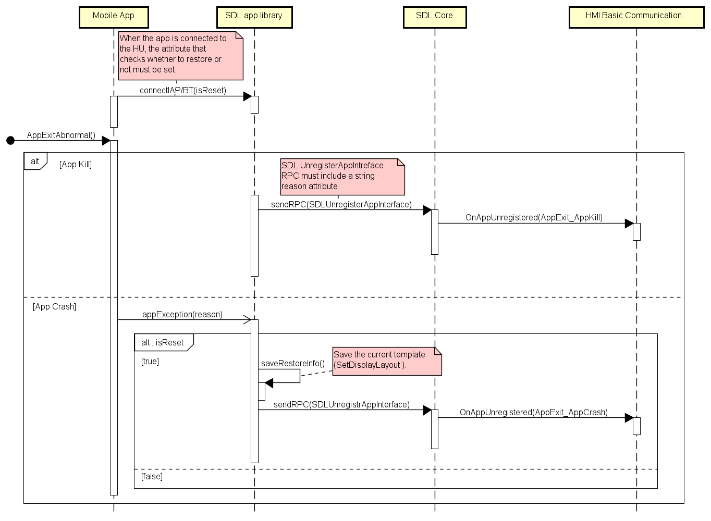
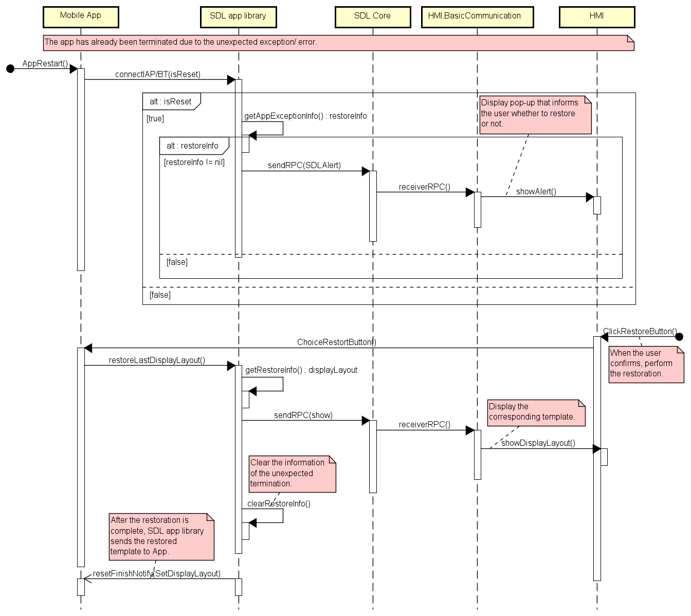

# Add a notification and restore function for unexpected exception/error

* Proposal: [SDL-NNNN](NNNN-Add-a-notification-and-restore-function-for-unexpected-exception-error.md)
* Author: [Akihiro Miyazaki (Nexty)](https://github.com/Akihiro-Miyazaki)
* Status: **Awaiting review**
* Impacted Platforms: [ Core / iOS / Java Suite / JavaScript Suite / HMI / RPC ]

## Introduction
This proposal is to add a notification and restore function to SDL Core during unexpected exception/error. This proposal aims to inform users of the cause of unexpected exception/error and allow them to restore the app.


## Motivation
With the current SDL Core, the cause of an unexpected exception/error cannot be determined. Therefore, users cannot be notified of the cause and there is no function to restore the state before the app was terminated. Also, since the HMI specifications during an unexpected exception/error are not defined, OEMs have to define it by themselves. As a result, the function is insufficient, such as not being able to return to the state before the error occurred after restarting the app. Therefore, we propose a mechanism to notify users of the cause and provide a restore operation during an unexpected exception/error.


## Proposed solution
We propose the following items to improve the problems mentioned above.
1. Addition of notification process when unexpected exception/error occurs
2. Addition of restore process after unexpected exception/error occcured

#### 1. Addition of notification process when unexpected exception/error occurs
App crash and app kill are the two types of causes for an unexpected exception/error. App crash refers to the unexpected exception/error due to design while launching the app. On the other hand, app kill refers to the swipe out operation by the user or termination by the system while the app is running.

<b>a) App Kill</b>

- In the case of Android, app kill notifications are monitored with the router service, while it is with the SDL proxy in the case of iOS.
- SDL proxy sends `UnregisterAppInterface` that includes the cause of the unexpected exception/error to SDL Core.
- SDL Core notifies onscreen (ONS) message display to HMI after receiving the app kill notification.
- Then, the HMI displays a pop-up to notify the user with the cause of the unexpected exception/error of the app.
- In the case of app kill, the process of restoring the state before the app was terminated will NOT be perfomed.

<b>b) App Crash</b>

- In case the Android, app crash notifications are monitored with the router service, while it is with the app in the case of iOS.
- After receiving the app crash notification, the app calls the error handling provided by the SDL proxy and sends the cause of the unexpected exception/error of the app to the SDL proxy.
- At the time of the app crash, SDL proxy saves the template (`SetDisplayLayout`) displayed on the head unit (HU).
- SDL proxy sends `UnregisterAppInterface` that includes the cause of the unexpected exception/error to SDL Core.
- SDL Core notifies ONS message display to HMI after receiving the app crash notification.
- Then, the HMI displays a pop-up to notify the user with the cause of the unexpected exception/error of the app.
- SDL proxy records the flag in preparation for restoring the app.

<b>Figure 1.</b> Notification of Unexpected Exception/Error



#### 2. Addition of restore process after unexpected exception/error occcured

- When SDL proxy (`SdlManager`, `LifeCycleConfigure`) is initialized, it is necessary to set whether or not to restore the app during an unexpected exception/error.
- When the app restarts, SDL proxy checks whether the template displayed on the HU at the time of the app crash is saved.
- If the template during the app crash is saved, SDL proxy sends `Alert` to SDL Core.
- After receiving `Alert`, the HMI displays a pop-up and informs the user of the option to restore.
- If restore is selected, SDL proxy sends the RPC of the template at the time of app crash, and then the HMI displays that template. If restore is NOT selected, SDL proxy discards the restoration information, and then the app launches as is.
- During the restoration, the HMI display a "Restoration in Progress" pop-up, while SDL proxy performs the restore process by rejecting all RPCs sent by the app.
- After the restoration is complete, SDL Proxy sends the restored template to App.
- Finally, the app proceeds to the next operation after receiving the restored template.

<b>Figure 2.</b> Restore Process of the App



The contents suggested by this proposal are as follows:

i) Add an attribute, `unregisterReason`,  to `UnregisterAppInterface` on Mobile_API and `OnAppUnregistered` on HMI_API.

<b>Mobile_API.xml</b>

```xml
    <function name="UnregisterAppInterface" functionID="UnregisterAppInterfaceID" messagetype="request" since="1.0">
        <description>
            Closes an interface from a mobile application.
            After unregisterAppInterface, no commands other than registerAppInterface will be accepted/executed.
            Will fail, if no registerAppInterface was completed successfully before.
        </description>
 +      <param name="unregisterReason" type="ReasonType" platform="documentation" mandatory="true">
 +          <description>Specifies reason for unregistering the apllication.</description>
 +      </param>
    </function>

 +  <enum name="ReasonType">
 +      <description>Describes the reasons for unregistering the application.</description>
 +      <element name="APP_CRASH">
 +          <description>Indicates the unexpected exception/error due to design while launching the application.</description>
 +      </element>
 +      <element name="APP_KILL">
 +          <description>Indicates the swipe out operation by user or termination by the system while the application is running.</description>
 +      </element>
 +  </enum>
```

<b>HMI_API.xml</b>

```xml
    <function name="OnAppUnregistered" messagetype="notification">
        <description>
            Issued by SDL to notify HMI about application unregistered.
            Application then to be removed from application list; all data connected with application has to be cleared up.
        </description>
 +      <param name="unregisterReason" type="Common.ReasonType" mandatory="true">
 +          <description>Specifies reason for unregistering the apllication.</description>
 +      </param>
    </function>

 +  <enum name="ReasonType">
 +      <description>Describes the reasons for unregistering the application.</description>
 +      <element name="APP_CRASH">
 +          <description>Indicates the unexpected exception/error due to design while launching the application.</description>
 +      </element>
 +      <element name="APP_KILL">
 +          <description>Indicates the swipe out operation by user or termination by the system while the application is running.</description>
 +      </element>
 +  </enum>
```

ii) Add an attribute, `isReset`, to `SDLLifecycleConfiguration`, which determines whether to restore the app or not.<br>
iii) Add a backup process that saves the template at the time of App Crash to `SdlManager` and send `UnregisterAppInterface`.<br>
iv) SDL proxy checks whether the restore information is saved when `isReset` is set to true. If there is information, SDL proxy sends `Alert` to the HMI. When the user selects to restore on the HMI, SDL proxy sends the template for app crash to the HMI.


## Potential downsides
None.


## Impact on existing code

- The addition of a new attribute to `UnregisterAppInterface` affects SDL Core and SDL proxy.
- The addition of a new attribute to `OnAppUnregistered` affects SDL Core and HMI.
- SDL proxy must monitor app kill notifications and provide processing during unexpected exception/error.
- It is necessary to add an unexpected exception/error display screen to HMI.


## Alternatives considered
None.
