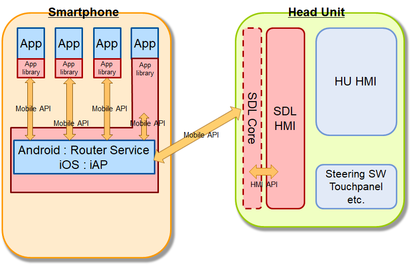
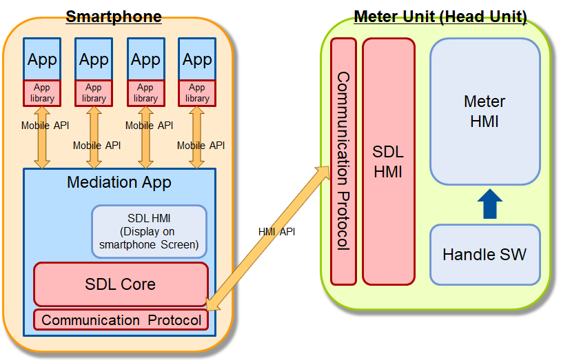

# Add new SDL System Structure using Mediation Application for middle/low-end class model of Powered Two Wheeler and low-cost vehicle models

* Proposal: [SDL-NNNN](NNNN-Add-new-SDL-System-Structure-using-Mediation-Application.md)
* Author: [Akihiro Miyazaki (Nexty)](https://github.com/Akihiro-Miyazaki)
* Status: **Awaiting review**
* Impacted Platforms: [ iOS / Java Suite / JavaScript Suite / HMI / Policy Server / SHAID / RPC / Protocol ]

## Introduction

This proposal is to construct new SDL system for a Head Unit(HU) with low performed ECU for Powered Two Wheeler (PTW) *1 middle/low-end class models and low-cost vehicle models.

*1 Powered Two Wheeler (PTW) includes motorcycle/scooter/moped.

## Motivation

The current SDL system is mainly for four-wheeled vehicles and requires a high-performance/high-resolution system (the binary size is 177MB when built with x86_64.). However, it is not possible to mount a high-performance/high-resolution system on a PTW nor low-cost vehicles due to the limitation of space and price that the vehicles have. Therefore, support for PTW and low-cost vehicles in the current SDL system is not incorporated. The main purpose of this proposal is to construct a new SDL system for a Head Unit (HU) with low performance ECU.

## Proposed solution

Firstly, PTW can be classified into the following classes by their meter display specifications.
 - High-end class: display specifications and ECU performance are equivalent to that of a four-wheeled vehicle.
 - Middle-end class: a TFT liquid-crystal display but has restrictions such as the area assigned to SDL is small, and ECU performance is low.
 - Low-end class: simple display specifications and low ECU performance.

Furthermore, the display specifications of low-cost vehicle models are also equivalent to PTW middle/low-end class models. Therefore, this proposal is for PTW middle/low-end class models and low-cost vehicle models.

In the current SDL system configuration, the HU implements SDL Core and SDL HMI as follows.

<b>Figure1.</b> Current SDL system configuration

However, in the PTW middle/low-end models and low-cost vehicle models, since the HU can only implement the low performance ECU, it cannot implement the large programs such as SDL Core. Therefore, in this proposal, the target is to add a new SDL system which moves SDL Core to the smartphone as follows.

<b>Figure2.</b> new SDL system configuration for low performed ECU

In order to move SDL Core from the HU to smartphone as it is, it is necessary to create the SDL application called `Mediation Application` which can connect to and control the SDL App, SDL Core and SDL HMI. In the case of Android Mediation Application, the NDK (Native Development Kit) is used to implement SDL Core as it is.

Basically, in the Mediation Application, communication between the SDL App, SDL Core and SDL HMI is needed. Also, it will need to absorb the difference between the current system and the new one. Moreover, only the HMI API which the HU needs is sent.

Therefore, the changes made in each component to establish this system are shown below.

###### 1. To App Library
 - Addition of the system identification function
 - Addition of the function to switch the communication destination and mean
 - Addition of the function of the communication destination and mean

###### 2. To Mediation Application
 - Implementation of SDL Core (using NDK etc.)
 - Addition of the communication to App Library and notification to SDL Core
 - Addition of function to determine whether the message from SDL Core is related to new SDL system
 - Addition of the support function for RPCs except for new SDL system
 - Addition of the function to determine the display destination (on HU or smartphone)
 - Addition of the function to manage the conflict of RPC messages
 - Addition of the screen display function on the smartphone (SDL app list etc.)
 - Addition of the connection function to the SDL app store
 - Addition of SDL App deletion function
 - Addition of the function to manage the HMI status
 - Addition of the function to reacquire information (such as Policy table etc.) when connecting to another HU

###### 3. To SDL Core
 - There is no changes from current SDL Core.

###### 4. To SDL HMI
 - Addition of the guideline for development of HU. (Implementation is handled by each OEM.)

The changes above will be provide a separate proposal for each change after this proposal is accepted.

## Potential downsides

This proposal is to provide new SDL system with low performed ECU such as PTW and low-cost vehicles, thus it assumes that it requires costs of management and maintenance.
However, it is assumed that the management and maintenance costs will be reduced for the following reasons.
 - It will use SDL Core same as current one.
 - There is not any management about SDL HMI, only manages the guideline.
 - In the case of HU with low performed ECU, there is no OS and the programing language is different. Therefore, generalization is not possible.
 - The App Library will be shared by adding a function to determine if it is a low performed ECU system.
From the above, the management and maintenance of the Mediation App would be newly generated.

## Impact on existing code

###### 1. App library
 - As described above, a determination function and a communication destination and method to the new SDL system will be added, but the existing code will not be affected because systems that do not meet the determination conditions or do not have the conditions will continue to operate with the existing basic system.

###### 2. Mediation App
 - It will be used in the new SDL system, so there will be no impact on the existing code.

###### 3. SDL Core
 - At this time, there will be no impact on existing code as we plan to use the current SDL Core as is.

###### 4. SDL HMI
 - In the new SDL system, SDL HMI will be implemented by OEM and SDLC will only provide the guidelines, so there will be no impact on the existing code.

###### 5. Policy table
 - There will be no impact on existing code as it is created for each system and OEM.

###### 6. SHAID
 - There will be no impact on existing code as the new SDL system will still use SHAID as before.

###### 7. RPC
 - For both Mobile and HMI API, there will be no additional RPC, but parameters will be added.

###### 8. Protocol
 - The new SDL system will use Bluetooth Low Energy (BLE) for communication, so there will be no impact on the existing code.

## Alternatives considered

An alternative proposal is the lightweight SDL Core proposed in [SDL 0302 - SDL System Structure for Middle/Low-end Class Model of Powered Two Wheeler](https://github.com/smartdevicelink/sdl_evolution/issues/1004).
However, this proposal is not a viable alternative because it does not describe specific modifications and has many disadvantages as described below. Therefore, there is no alternative proposal at this time.
 - Management between apps needs to be handled by the HU
 - The App library made for low performed ECU is required
 - The display destination(on the smartphone or on the HU) needs to be managed by the App library etc
 - RPC conflicts can be avoided by Router Service or iAP, but management control of RPC priority from each App needs to be handled by the HU
 
