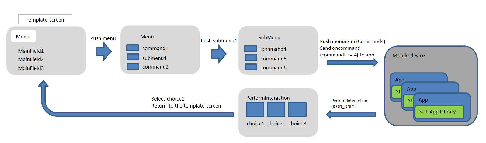
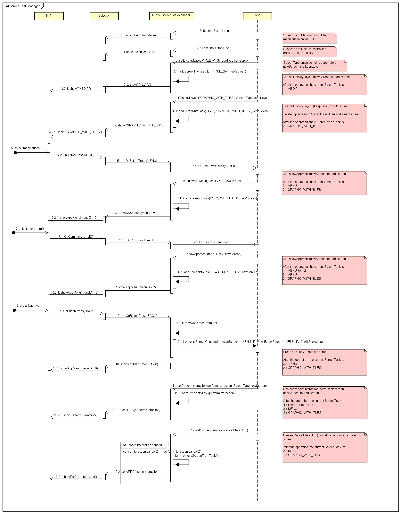

# Add screen stack management module

* Proposal: [SDL-NNNN](NNNN-Add-screen-stack-management-module.md)
* Author: [Akihiro Miyazaki (Nexty)](https://github.com/Akihiro-Miyazaki)
* Status: **Awaiting review**
* Impacted Platforms: [ Core / iOS / Java Suite / JavaScript Suite / RPC ]

## Introduction
The purpose of this proposal is to reduce the burden on screen development for app developers by adding a screen management module.

## Motivation
Currently, the screens displayed by `Show` and `PerformInteraction` are independent, and there is no relationship between each screen. However, in many cases of the app development process, screens have relationships with each other. Therefore, the screen transition specifications expected by the app developers may not be realized. By adding a screen management module and managing transitions, this problem can be solved and we can reduce the burden of screen development. For example, we can allow pressing the back button to enable screen transitions such as returning to the previous screen. As a result, it will be possible to build a better UX by reducing the inconvenience of use as much as possible for the users.

<b>Current behavior</b>
 - `PerformInteraction` and `Show (template)` are independent screens.
 - HMI controls menu/submenu displays and screen transitions.
 - Contents displayed in menu/submenu are provided by `AddCommand`, `DeleteCommand`, `AddSubMenu`, `DeleteSubMenu` of the app.
 - When pushing the menu item, the HMI sends an `onCommand` notification to the mobile, and then the mobile determines the operation.
   After that, you cannot return to the menu screen, but you will return to the first template screen.
 - Even if the `DeleteSubMenu` is notified from mobile while the submenu is displayed, it is rejected.

<b>Current Screen transition process</b>

- RPCs related to menu/submenu are sent after the successful registration of app.
```
AddCommand(commandID = 1，"command1")
AddSubMenu(menuID = 100, "submenu1")
AddCommand(commandID = 2，"command2")
AddCommand(commandID = 4，"command4", parentID = 100)
AddCommand(commandID = 5，"command5", parentID = 100)
AddCommand(commandID = 6，"command6", parentID = 100)
```

- RPC for `PerformInteraction`
```
CreateInteractionChoiceSet[
	 interactionChoiceSetID = 1000,
	(choiceID = 1,  menuName = "choice1"),
	(choiceID = 2,  menuName = "choice2"),
	(choiceID = 3,  menuName = "choice3") ]
```



## Proposed solution
To solve this problem, build the following screen management mechanism.

- Add a screen management module, `screenTaskManager`, to the SDL app libraries to manage screen transition stacks such as menu, submenu, `PerformInteraction` displays, pop-ups, etc.
- Add `button Name` for subscribe.
- Add screen change notification process `notifyScreenChanged` to each SDL app library.
- Add the screen management module to [the iOS Guides](https://smartdevicelink.com/en/guides/iOS/displaying-a-user-interface/template-images/), [the Android Guides](https://smartdevicelink.com/en/guides/android/displaying-a-user-interface/main-screen-templates/) and [the JavaScript Guides](https://smartdevicelink.com/en/guides/javascript/displaying-a-user-interface/main-screen-templates/).

Below is the `Button Name` for subscribe.
Add element to enum value `ButtonName`. (HMI_API.xml, MOBILE_API.xml)

```xml
 <enum name="ButtonName" since="1.0">
     <description>Defines the hard (physical) and soft (touchscreen) buttons available from the module</description>
+    <element name="MENU" />
+    <element name="BACK" />
 </enum>

```

The sequence is as follows.

1. Subscribe to `BACK` on the back button.
2. Subscribe to `MENU` on the menu button.
3. The app displays MEDIA screen with `setDisplayLayout`. `ScreenTaskManager` detects `newScreen` and stacks MEDIA screen.
4. The app displays the GRAPHIC_WITH_TILES screen with `setDisplayLayout`. `ScreenTaskManager` detects `keepLevel`, deletes the top layer screen of the screen stack, and stacks GRAPHIC_WITH_TILES screen.
5. The user pushes the menu button. Then, head unit (HU) sends `OnButtonPress (MENU)` to the app.
6. The app displays the menu screen with `showAppMenu`. `ScreenTaskManager` detects `newScreen` and stacks the menu screen.
7. The user pushes the submenu button. Then, the HU sends the `OnCommand` notification to the app.
8. The app displays submenu screen with `showAppMenu`. ScreenTaskManager detects `newScreen` and stacks the submenu screen.
9. The user pushes the back button. Then, the HU sends `OnButtonPress (BACK_KEY)` to the app.
10. The app returns to menu screen with `showAppMenu`.
11. The app displays PerformInteraction screen with `setPerformInteraction`. ScreenTaskManager  stacks PerformInteraction screen.
12. The app hides PerformInteraction screen with `setPerformInteraction`, and displays menu svreen. ScreenTaskManager deletes PerformInteraction screen of the screen stack.



## Potential downsides
None.

## Impact on existing code

- A new module is added to the app library, therefore, it is affected as well.
- Since there are new enum elements added, it affects SDL Core.
- It is necessary to modify the following documentation.
1. [the iOS Guides](https://smartdevicelink.com/en/guides/iOS/displaying-a-user-interface/template-images/)
2. [the Android Guides](https://smartdevicelink.com/en/guides/android/displaying-a-user-interface/main-screen-templates/)
3. [the JavaScript Guides](https://smartdevicelink.com/en/guides/javascript/displaying-a-user-interface/main-screen-templates/)

## Alternatives considered
None.
