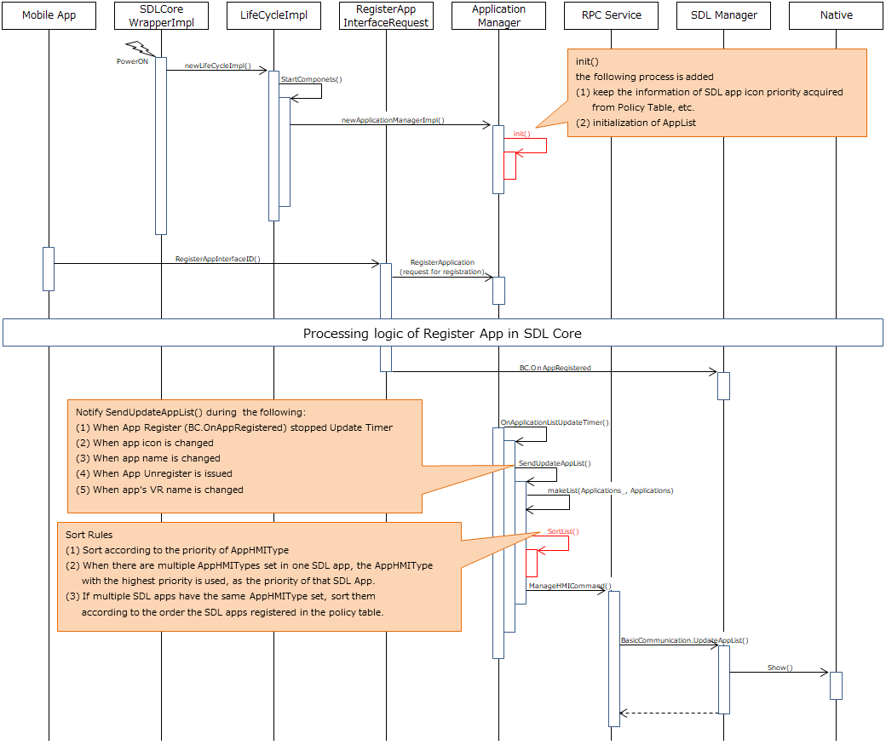

# Clarification of SDL App Icon display sequence and display order

* Proposal: [SDL-NNNN](NNNN-Clarification-of-SDL-App-Icon-display-sequence-and-display-order.md)
* Author: [Akihiro Miyazaki (Nexty)](https://github.com/Akihiro-Miyazaki)
* Status: **Awaiting review**
* Impacted Platforms: [ Core / Policy Server ]

## Introduction

This proposal is to clarify the SDL app icon display sequence and the display order of icons. By doing so, we can prevent unnecessary development for the Head Unit (HU) developers and improve usability by enhancing the visuality for users.

## Motivation

Currently, the SDL app icon is displayed on the SDL app selection (menu) screen, but the sequence to display the icon is not provided. Also, there is no explicit definition of the icon's display order and the rule for example grouping by app type, as a result, the display order of icons changes every launch. Incidentally, it is implemented on the program code of SDL Core by the following rule.

 1. Registered apps are sorted by the ascending order of appID *1.
 2. Unregistered apps are sorted by the ascending order of policyID in the policy table. If there are duplicate policyIDs, they will be sorted by the ascending order of deviceID.

*1 appID: It is NOT the ID obtained during SDLC App Certification. It is the ID that is set when the app establishes a session and is launched based on the hash algorithm using the sessionID (set from 0 in the app registration order) and deviceHandlerID (set from 0 in the device connection order).

For these reasons, it is difficult for the HU developer to know by what specification the icons are sorted. Also, it is difficult to judge whether or not it is necessary to deal with it on the HMI side. Furthermore, it is very poor visuality and operability (usability) because it takes a long time for the user to find an app that s/he wants to use. In order to solve these problems, we propose to clarify the display order of the SDL app icon and improve the usability by presenting the sequence and the rules of the SDL app icon display.

## Proposed solution

The following items are proposed to improve the problems mentioned above.
 1. Clarification of rule of the icon display order
 2. Clarification of icon display sequence

<b>1. Clarification of rule of the icon display order</b>
The display order of SDL app icon is performed according to the following procedures.

 1. Set the priority of the SDL app according to the AppHMIType priority in Table 1.
 2. When there are multiple AppHMITypes set in one SDL App, the AppHMIType with the highest priority is used, as the priority of that SDL App.
 3. If multiple SDL apps have the same AppHMIType set, sort them according to the order the SDL apps registered in the policy table.

<b>Table 1.</b> AppHMIType priority list

| Priority | AppHMIType |
|:-:|:-:|
| 1 | NAVIGATION |
| 2 | MEDIA |
| 3 | MESSAGE |
| 4 | INFORMATION |
| 5 | COMMUNICATION |
| 6 | SOCIAL |
| 7 | PROJECTION |
| 8 | REMOTE_CONTROL |
| 9 | SYSTEM |
| 10 | DEFAULT |
| 11 | BACKGROUND_PROCESS |
| 12 | TESTING |

At first, The priority information of AppHMIType in Table 1 is stored in the policy table, the SDL Core and default policy table (sdl_preloaded_pt.json). Then, the first searched information is used as the AppHMIType priority list (priority list). During the first launch, there is no policy table, therefore it is searched in the default policy table at first, then be searched in SDL Core to obtain the default appHMIType priority list. After that, the policy table has been created, so it is searched in the order, policy table->default policy table->SDL Core.

However, since the preferred AppHMIType priority may vary for each OEM, the OEMs can create the priority list information of AppHMIType and store it in the policy table. By changing the priority list of AppHMIType created by each OEM in the policy table, they can display the SDL app icon according to each OEM's intended order.

<b>2. Clarification of icon display sequence</b>
Currently, there is no sequence provided that demonstrates until the icon is displayed. Figure 1 shows the sequence in which the process of this proposal added to the existing sequence from the program code of SDL Core. The black text indicates the existing order described in the program code. The red text indicates the added process by this proposal.

<b>Figure 1.</b> SDL App Icon display sequence

The contents suggested by this proposal are as follows:
- Add SortList() as a process to sort according to the display order of SDL App Icon.
- Perform the processing of SortList() after processing the normal makelist(Applications_, Applications)
- Add init() as a process to initialize the AppList used in SortList() every launch, and keep the priority list information of AppHMIType acquired from PolicyTable, etc.

## Potential downsides

There is no potential downside since it is a modification to the current process of the SDL app icon display order.

## Impact on existing code

This proposal has no impact on the existing code because there are no changes in RPC and parameters.

## Alternatives considered

None.
